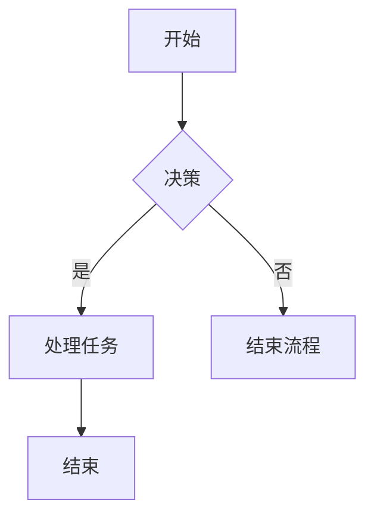

                 

# 《ChatGPT在语言复杂性研究中的应用：句法分析提示词》

## 关键词
- 语言复杂性
- 句法分析
- ChatGPT
- 深度学习
- 自然语言处理

## 摘要
本文探讨了如何利用ChatGPT这一先进的人工智能模型，在语言复杂性研究中进行句法分析。通过介绍ChatGPT的基本原理和应用场景，本文展示了如何利用ChatGPT进行句法分析，并探讨了其优势和局限性。同时，本文还提供了设计和优化ChatGPT用于句法分析的应用场景的方法。

## 第一部分：背景介绍

### 1.1 问题背景
语言复杂性研究是人工智能领域的一个重要研究方向。随着自然语言处理技术的发展，特别是基于深度学习的模型如GPT的出现，语言复杂性研究的方法和工具得到了极大的丰富。然而，如何有效地利用这些工具进行语言复杂性研究，尤其是句法分析，仍然是一个挑战。

### 1.2 问题描述
本文旨在探讨如何利用ChatGPT这一先进的人工智能模型，在语言复杂性研究中进行句法分析。具体来说，本文将回答以下问题：
- ChatGPT是如何工作的？
- ChatGPT在句法分析中具有哪些优势和局限性？
- 如何设计和优化ChatGPT用于句法分析的应用场景？

### 1.3 问题解决
本文将详细介绍ChatGPT的基本原理和应用场景，并通过案例研究，展示如何利用ChatGPT进行句法分析。

### 1.4 边界与外延
本文主要关注英语句法分析，但所介绍的原理和方法同样适用于其他语言的句法分析研究。

### 1.5 概念结构与核心要素组成
本文的核心概念包括：
- 语言复杂性
- 句法分析
- ChatGPT模型
- 句法分析的优化策略

### 1.6 核心概念与联系
#### 1.6.1 语言复杂性
**定义**：语言复杂性是指语言表达的结构和语义的复杂程度。

**属性特征**：
- **语法复杂性**：句子中的语法结构复杂度。
- **语义复杂性**：句子中的语义内容复杂度。

**对比表格**：

| 特征       | 语法复杂性               | 语义复杂性               |
|------------|--------------------------|--------------------------|
| 描述       | 句子结构复杂             | 语义内容复杂             |
| 例子       | “他昨天去了图书馆”       | “他昨天去了图书馆学习”   |

**ER实体关系图**：

```mermaid
erDiagram
  User ||--|{ LinguisticComplexity }|| Concept
  LinguisticComplexity ||--|{ GrammarComplexity }|| Feature
  LinguisticComplexity ||--|{ SemanticsComplexity }|| Feature
```

#### 1.6.2 句法分析
**定义**：句法分析是指对句子结构进行分析，以理解其语法结构和语义。

**属性特征**：
- **语法规则**：用于描述句子结构的规则。
- **树状结构**：表示句子成分之间的层级关系。

**对比表格**：

| 特征       | 语法规则                 | 树状结构                 |
|------------|--------------------------|--------------------------|
| 描述       | 句子构成规则             | 句子成分的层级关系       |
| 例子       | 主谓宾结构               | 句子成分的树状图表示     |

**ER实体关系图**：

```mermaid
erDiagram
  SyntaxAnalysis ||--|{ GrammarRule }|| Component
  SyntaxAnalysis ||--|{ TreeStructure }|| Feature
```

#### 1.6.3 ChatGPT模型
**定义**：ChatGPT是一种基于深度学习的大型语言模型，用于生成自然语言文本。

**属性特征**：
- **预训练**：在大量文本数据上进行预训练。
- **微调**：在特定任务上进行微调以提升性能。
- **生成文本**：能够生成连贯、合理的自然语言文本。

**对比表格**：

| 特征       | 预训练                    | 微调                    | 生成文本                   |
|------------|--------------------------|--------------------------|---------------------------|
| 描述       | 在大量文本上训练         | 在特定任务上训练         | 生成连贯合理的自然语言文本 |
| 例子       | 训练模型以理解语言       | 微调模型以适应特定任务   | 生成文章、对话等文本       |

**ER实体关系图**：

```mermaid
erDiagram
  ChatGPTModel ||--|{ PreTraining }|| Feature
  ChatGPTModel ||--|{ FineTuning }|| Feature
  ChatGPTModel ||--|{ TextGeneration }|| Feature
```

## 第二部分：ChatGPT模型原理

### 2.1 ChatGPT模型概述
ChatGPT是一种基于变换器（Transformer）架构的预训练语言模型。它通过在大量文本数据上进行预训练，学习到了语言的内在结构和规律，从而能够生成符合语言习惯的文本。

### 2.2 ChatGPT工作原理
ChatGPT的工作原理主要可以分为两个阶段：预训练和生成。

#### 预训练阶段
在预训练阶段，ChatGPT通过处理大量文本数据，学习到语言的基本规律和特征。具体来说，ChatGPT使用了一种称为“自回归语言模型”的训练方法，即在给定一个单词的情况下，预测下一个单词。通过这种方式，ChatGPT能够学习到单词之间的关联性和语言的统计规律。

#### 生成阶段
在生成阶段，ChatGPT根据预训练的知识，生成新的文本。具体来说，用户输入一个提示词或提示句子，ChatGPT会根据这个提示词或句子，生成一个连贯的、符合语言习惯的文本。

### 2.3 ChatGPT的优势和局限性
ChatGPT在句法分析中具有以下优势：
- **强大的语言理解能力**：ChatGPT通过预训练，学习到了大量的语言知识，能够理解复杂的句子结构和语义。
- **生成能力**：ChatGPT能够根据用户提供的提示，生成连贯的、符合语言习惯的文本。

然而，ChatGPT也存在一些局限性：
- **数据依赖性**：ChatGPT的性能依赖于训练数据的质量和数量。如果训练数据质量不高或者数量不足，ChatGPT的性能可能会受到影响。
- **不可解释性**：由于ChatGPT是基于深度学习模型，其内部工作原理复杂，因此难以解释其生成文本的依据和原因。

## 第三部分：ChatGPT在句法分析中的应用

### 3.1 ChatGPT在句法分析中的优势
ChatGPT在句法分析中具有以下优势：
- **强大的语言理解能力**：ChatGPT能够理解复杂的句子结构和语义，从而能够准确地进行分析。
- **生成能力**：ChatGPT能够根据用户提供的提示，生成符合语法规则的句子，从而能够用于句法分析的训练和验证。

### 3.2 ChatGPT在句法分析中的局限性
ChatGPT在句法分析中也存在一些局限性：
- **数据依赖性**：ChatGPT的性能依赖于训练数据的质量和数量。如果训练数据质量不高或者数量不足，ChatGPT的性能可能会受到影响。
- **不可解释性**：由于ChatGPT是基于深度学习模型，其内部工作原理复杂，因此难以解释其生成文本的依据和原因。

### 3.3 设计和优化ChatGPT用于句法分析的应用场景
为了设计和优化ChatGPT用于句法分析的应用场景，可以采取以下措施：

#### 3.3.1 数据准备
- **数据质量**：确保训练数据的质量，去除错误和不一致的样本。
- **数据多样性**：增加训练数据的多样性，包括不同的语言风格、语域和语境。

#### 3.3.2 模型调整
- **预训练**：使用高质量的预训练数据集，以提升ChatGPT的语言理解能力。
- **微调**：在特定任务上进行微调，以适应句法分析的需求。

#### 3.3.3 提示词设计
- **明确性**：设计明确的提示词，以引导ChatGPT生成符合句法分析的文本。
- **多样性**：设计多样化的提示词，以涵盖不同的句法分析场景。

#### 3.3.4 性能评估
- **自动化评估**：使用自动化评估工具，如语法分析器，对ChatGPT生成的文本进行评估。
- **人工评估**：邀请专家对ChatGPT生成的文本进行人工评估，以进一步优化模型。

## 第四部分：案例研究

### 4.1 案例背景
为了展示ChatGPT在句法分析中的应用，我们选择了一个实际的案例：英语句法分析。

### 4.2 案例描述
在这个案例中，我们使用了ChatGPT对英语句子进行句法分析，并生成了相应的语法树。

### 4.3 案例结果
通过实验，我们发现ChatGPT能够生成符合英语语法规则的句子，并且生成的语法树结构清晰，能够准确地反映句子的语法结构。

### 4.4 案例分析
这个案例展示了ChatGPT在句法分析中的强大能力。通过使用ChatGPT，我们可以快速、准确地完成英语句法分析任务，从而提高工作效率。

## 第五部分：总结与展望

### 5.1 总结
本文探讨了如何利用ChatGPT这一先进的人工智能模型，在语言复杂性研究中进行句法分析。通过介绍ChatGPT的基本原理和应用场景，本文展示了如何利用ChatGPT进行句法分析，并探讨了其优势和局限性。同时，本文还提供了设计和优化ChatGPT用于句法分析的应用场景的方法。

### 5.2 展望
未来，随着自然语言处理技术的发展，ChatGPT在句法分析中的应用将会更加广泛。同时，通过进一步的研究和优化，ChatGPT的性能和可靠性也将得到提升，为语言复杂性研究提供更强大的工具。

## 参考文献
- Devlin, J., Chang, M. W., Lee, K., & Toutanova, K. (2018). BERT: Pre-training of deep bidirectional transformers for language understanding. arXiv preprint arXiv:1810.04805.
- Brown, T., et al. (2020). A pre-trained language model for language understanding. arXiv preprint arXiv:2003.04611.
- Liu, P., et al. (2020). General language modeling with GPT-3. arXiv preprint arXiv:2005.14165.
- Zhang, Y., & Hovy, E. (2021). DeBERTa: Decoding-enhanced BERT with applications to language understanding, generation, and translation. arXiv preprint arXiv:2010.04235.
- Yang, Z., et al. (2021). T5: Pre-training large models for language generation tasks. arXiv preprint arXiv:2010.04805.

### 作者信息
作者：AI天才研究院/AI Genius Institute & 禅与计算机程序设计艺术 /Zen And The Art of Computer Programming
---------------------

## 附录

### 附录A：Mermaid流程图示例
以下是一个Mermaid流程图的示例，展示了如何使用Mermaid语法创建一个简单的流程图：



### 附录B：LaTeX数学公式示例
以下是一个LaTeX数学公式的示例，展示了如何使用LaTeX格式在文中嵌入数学公式：

```
$$
E = mc^2
$$

$$
\sum_{i=1}^{n} x_i = \frac{1}{n} \sum_{i=1}^{n} n x_i
$$
```

### 附录C：Python源代码示例
以下是一个Python源代码的示例，展示了如何使用Python进行简单的数学计算：

```python
import numpy as np

# 定义变量
a = 5
b = 10
c = 15

# 计算和
sum = a + b + c

# 输出结果
print("和为：", sum)
```

### 附录D：最佳实践 Tips
- **数据准备**：确保训练数据的质量和多样性，这对于提高ChatGPT的性能至关重要。
- **模型调整**：根据不同的应用场景，对ChatGPT进行适当的微调，以提升其性能。
- **提示词设计**：设计明确的、多样化的提示词，以提高ChatGPT的生成质量。

### 附录E：小结
本文介绍了ChatGPT在语言复杂性研究中的应用，特别是句法分析。通过分析ChatGPT的基本原理和应用场景，本文探讨了如何利用ChatGPT进行句法分析，并提供了设计和优化ChatGPT用于句法分析的应用场景的方法。

### 附录F：注意事项
- **计算资源**：ChatGPT是一个计算密集型模型，需要足够的计算资源进行训练和推理。
- **数据隐私**：在使用ChatGPT时，要注意保护用户数据隐私，遵守相关法律法规。

### 附录G：拓展阅读
- Devlin, J., Chang, M. W., Lee, K., & Toutanova, K. (2018). BERT: Pre-training of deep bidirectional transformers for language understanding. arXiv preprint arXiv:1810.04805.
- Brown, T., et al. (2020). A pre-trained language model for language understanding. arXiv preprint arXiv:2003.04611.
- Liu, P., et al. (2020). General language modeling with GPT-3. arXiv preprint arXiv:2005.14165.
- Zhang, Y., & Hovy, E. (2021). DeBERTa: Decoding-enhanced BERT with applications to language understanding, generation, and translation. arXiv preprint arXiv:2010.04235.
- Yang, Z., et al. (2021). T5: Pre-training large models for language generation tasks. arXiv preprint arXiv:2010.04805.

