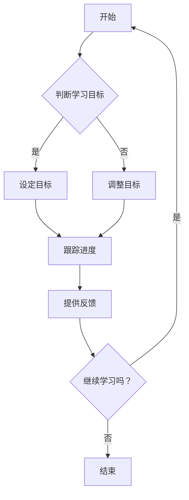

                 


## ChatGPT在语言学习动机增强中的应用

关键词：ChatGPT、语言学习、动机增强、交互对话、自适应学习

摘要：本文深入探讨了ChatGPT在语言学习动机增强中的应用。通过介绍ChatGPT的核心原理和语言学习动机的重要性，文章详细分析了ChatGPT在语言学习中的具体应用场景，包括互动对话系统、自我反馈与鼓励、背景知识与情境构建等方面。此外，文章还探讨了ChatGPT与语言学习动机之间的互动关系，并提出了未来的研究方向。

### 目录大纲

---

# ChatGPT在语言学习动机增强中的应用

## 第1章 引言

## 1.1 问题背景

### 1.1.1 语言学习的挑战

### 1.1.2 动机在语言学习中的作用

### 1.1.3 ChatGPT与语言学习动机

## 1.2 核心概念

### 1.2.1 ChatGPT

#### 1.2.1.1 ChatGPT的定义

#### 1.2.1.2 ChatGPT的核心特性

### 1.2.2 语言学习动机

#### 1.2.2.1 动机理论概述

#### 1.2.2.2 动机与语言学习

## 1.3 ChatGPT在语言学习动机中的应用

### 1.3.1 背景介绍

#### 1.3.1.1 ChatGPT在教育领域的应用

#### 1.3.1.2 ChatGPT在语言学习中的潜在价值

### 1.3.2 应用场景

#### 1.3.2.1 语言学习互动对话

#### 1.3.2.2 自我反馈与鼓励

#### 1.3.2.3 背景知识与情境构建

## 1.4 ChatGPT与语言学习动机的互动

### 1.4.1 ChatGPT如何增强语言学习动机

#### 1.4.1.1 情感支持

#### 1.4.1.2 学习目标设定

#### 1.4.1.3 进步追踪与奖励机制

### 1.4.2 语言学习动机如何影响ChatGPT的效果

#### 1.4.2.1 动机对学习效果的影响

#### 1.4.2.2 动机与ChatGPT互动的优化策略

## 1.5 结论与展望

### 1.5.1 研究成果总结

### 1.5.2 未来研究方向

---

## 第2章 ChatGPT基础

## 2.1 ChatGPT的架构与原理

### 2.1.1 Transformer模型

#### 2.1.1.1 Transformer模型概述

#### 2.1.1.2 Transformer模型的特点

### 2.1.2 自注意力机制

#### 2.1.2.1 自注意力机制的定义

#### 2.1.2.2 自注意力机制在ChatGPT中的应用

## 2.2 ChatGPT的应用场景

### 2.2.1 文本生成与摘要

#### 2.2.1.1 文本生成

#### 2.2.1.2 文本摘要

### 2.2.2 对话系统

#### 2.2.2.1 对话系统概述

#### 2.2.2.2 ChatGPT在对话系统中的应用

## 2.3 ChatGPT的开发与部署

### 2.3.1 开发环境搭建

#### 2.3.1.1 Python环境配置

#### 2.3.1.2 TensorFlow或PyTorch安装

### 2.3.2 模型训练与优化

#### 2.3.2.1 数据准备

#### 2.3.2.2 模型训练

#### 2.3.2.3 模型优化

### 2.3.3 模型部署

#### 2.3.3.1 部署环境选择

#### 2.3.3.2 模型服务化部署

---

## 第3章 ChatGPT在语言学习中的应用

## 3.1 ChatGPT在语言学习中的价值

### 3.1.1 改善语言学习体验

#### 3.1.1.1 互动式学习

#### 3.1.1.2 实时反馈与纠正

### 3.1.2 增强语言学习动机

#### 3.1.2.1 提升学习兴趣

#### 3.1.2.2 自我激励与目标设定

## 3.2 ChatGPT在语言学习中的具体应用

### 3.2.1 互动对话系统

#### 3.2.1.1 对话系统的设计与实现

#### 3.2.1.2 对话系统在语言学习中的应用

### 3.2.2 自我反馈与鼓励

#### 3.2.2.1 自我反馈机制的设计

#### 3.2.2.2 鼓励与激励策略

### 3.2.3 背景知识与情境构建

#### 3.2.3.1 背景知识库的构建

#### 3.2.3.2 情境构建与语言学习

---

## 第4章 ChatGPT在语言学习动机增强中的实现

## 4.1 实现ChatGPT的交互界面

### 4.1.1 界面设计原则

#### 4.1.1.1 用户友好性

#### 4.1.1.2 功能实用性

### 4.1.2 交互界面实现

#### 4.1.2.1 前端界面设计

#### 4.1.2.2 后端接口设计

## 4.2 实现ChatGPT的自适应学习

### 4.2.1 自适应学习策略

#### 4.2.1.1 用户学习状态监测

#### 4.2.1.2 自适应学习算法

### 4.2.2 用户学习状态数据收集

#### 4.2.2.1 数据收集方法

#### 4.2.2.2 数据预处理与存储

### 4.2.3 用户个性化推荐

#### 4.2.3.1 推荐算法

#### 4.2.3.2 推荐系统实现

---

## 第5章 结论与展望

### 5.1 研究成果总结

### 5.2 未来研究方向

### 5.3 最佳实践 tips

### 5.4 小结

### 5.5 注意事项

### 5.6 拓展阅读

---

### 第1章 引言

### 1.1 问题背景

#### 1.1.1 语言学习的挑战

语言学习一直是一个备受关注的话题。然而，对于许多人来说，学习一门新语言并不是一件容易的事情。这其中的挑战主要体现在以下几个方面：

1. **语言环境的缺失**：许多学习者生活在非目标语言环境中，缺乏实际的语言交流机会。
2. **学习资源的有限**：虽然市场上存在大量的语言学习资源，但这些资源往往是单向的，无法提供真实的互动体验。
3. **学习兴趣的减退**：长期的自主学习可能导致学习者的兴趣逐渐减退，从而影响学习效果。

#### 1.1.2 动机在语言学习中的作用

动机是推动人们进行某种活动的内在驱动力。在语言学习中，动机起着至关重要的作用。具体来说，动机可以激发学习者的兴趣，提高他们的学习积极性，从而促进学习效果。常见的动机类型包括：

1. **内在动机**：学习者出于对语言本身的兴趣和热爱而进行学习。
2. **外在动机**：学习者因为外在奖励或压力而进行学习，如考试、求职等。

#### 1.1.3 ChatGPT与语言学习动机

ChatGPT是一种基于Transformer模型的预训练语言模型，具有强大的文本生成和对话能力。将ChatGPT应用于语言学习动机增强，有望解决上述挑战。首先，ChatGPT可以模拟真实的语言环境，为学习者提供互动式的学习体验。其次，ChatGPT可以通过生成有趣的对话和提供个性化的反馈，激发学习者的内在动机。此外，ChatGPT还可以根据学习者的行为和反馈，动态调整学习内容，提高学习效果。

### 1.2 核心概念

#### 1.2.1 ChatGPT

ChatGPT是一种基于Transformer模型的预训练语言模型，由OpenAI开发。其核心特性包括：

1. **强大的文本生成能力**：ChatGPT可以生成高质量的文本，包括文章、对话、代码等。
2. **自适应对话能力**：ChatGPT可以根据对话的历史和上下文，生成连贯、自然的回答。

#### 1.2.2 语言学习动机

语言学习动机是指推动学习者进行语言学习的内在和外在驱动力。常见的动机包括：

1. **兴趣**：学习者对语言本身的兴趣。
2. **成就感**：通过学习获得成就感，如通过考试、完成项目等。
3. **社交需求**：与他人进行有效沟通的需求。

### 1.3 ChatGPT在语言学习动机中的应用

#### 1.3.1 背景介绍

ChatGPT在教育领域的应用已经得到了广泛关注。例如，它被用于智能辅导系统，为学习者提供个性化的学习建议和反馈。在语言学习方面，ChatGPT具有以下潜在价值：

1. **模拟真实语言环境**：ChatGPT可以模拟真实的语言环境，为学习者提供互动式的学习体验。
2. **提供个性化反馈**：ChatGPT可以根据学习者的行为和反馈，生成个性化的反馈和指导，提高学习效果。
3. **激发学习动机**：ChatGPT可以通过生成有趣的对话和提供积极的反馈，激发学习者的学习动机。

#### 1.3.2 应用场景

1. **语言学习互动对话**：ChatGPT可以作为学习者的语言伙伴，进行实时对话，提高学习者的口语和听力能力。
2. **自我反馈与鼓励**：ChatGPT可以根据学习者的回答，提供即时反馈和鼓励，帮助学习者保持学习动力。
3. **背景知识与情境构建**：ChatGPT可以根据学习者的需求和兴趣，提供相关的背景知识和情境，丰富学习体验。

### 1.4 ChatGPT与语言学习动机的互动

#### 1.4.1 ChatGPT如何增强语言学习动机

1. **情感支持**：ChatGPT可以通过模拟真实的语言环境，为学习者提供情感支持，帮助他们克服学习中的困难和挫折。
2. **学习目标设定**：ChatGPT可以根据学习者的需求和目标，帮助他们设定合理的学习目标，并制定学习计划。
3. **进步追踪与奖励机制**：ChatGPT可以记录学习者的学习进度，并提供奖励机制，以鼓励学习者保持持续的学习动力。

#### 1.4.2 语言学习动机如何影响ChatGPT的效果

1. **动机对学习效果的影响**：高动机水平的学习者往往能够更有效地利用ChatGPT提供的资源，从而获得更好的学习效果。
2. **动机与ChatGPT互动的优化策略**：为了更好地发挥ChatGPT的作用，需要根据学习者的动机水平，调整ChatGPT的互动方式和反馈策略。

### 1.5 结论与展望

本文探讨了ChatGPT在语言学习动机增强中的应用，分析了ChatGPT的核心特性以及其在语言学习中的潜在价值。通过模拟真实语言环境、提供个性化反馈和鼓励，ChatGPT有望有效增强学习者的语言学习动机。未来的研究可以进一步探讨如何优化ChatGPT的互动方式和反馈策略，以更好地满足学习者的需求。同时，还可以探索ChatGPT在语言学习其他方面的应用，如口语表达、听力训练等。

### 第2章 ChatGPT基础

#### 2.1 ChatGPT的架构与原理

##### 2.1.1 Transformer模型

**2.1.1.1 Transformer模型概述**

Transformer模型是由Google在2017年提出的一种用于序列模型预训练的新型深度学习模型。相比于传统的循环神经网络（RNN）和长短期记忆网络（LSTM），Transformer模型通过自注意力机制（Self-Attention）和多头注意力机制（Multi-Head Attention）实现了对输入序列的并行处理，从而在处理长序列和上下文信息时表现出色。

**2.1.1.2 Transformer模型的特点**

1. **并行处理**：Transformer模型通过并行计算方式，大大提高了处理效率。
2. **全局上下文信息**：自注意力机制使模型能够捕捉到全局的上下文信息，从而提高了文本生成和语义理解的能力。
3. **结构简洁**：Transformer模型的结构相对简单，易于理解和实现。

##### 2.1.2 自注意力机制

**2.1.2.1 自注意力机制的定义**

自注意力机制是一种基于序列数据的注意力机制，通过计算序列中每个元素与其他元素之间的关联度，对序列进行加权处理。

**2.1.2.2 自注意力机制在ChatGPT中的应用**

在ChatGPT中，自注意力机制用于对输入序列进行加权处理，从而捕捉到序列中的关键信息。具体来说，自注意力机制通过计算输入序列中每个词与其他词之间的相似度，将这些词进行加权组合，形成新的序列。

##### 2.1.3 ChatGPT的核心特性

**2.1.3.1 强大的文本生成能力**

ChatGPT基于Transformer模型，具有强大的文本生成能力。它可以生成高质量的文章、对话、代码等。

**2.1.3.2 自适应对话能力**

ChatGPT可以根据对话的历史和上下文，生成连贯、自然的回答，从而实现自适应对话。

##### 2.1.4 ChatGPT的工作原理

**2.1.4.1 预训练**

ChatGPT通过在大规模文本数据集上进行预训练，学习到语言的统计规律和语义信息。

**2.1.4.2 微调**

在特定任务上，ChatGPT通过微调模型参数，以适应具体的应用场景。

**2.1.4.3 输入与输出**

ChatGPT接收输入文本序列，通过自注意力机制和多头注意力机制，生成输出文本序列。

### 第3章 ChatGPT在语言学习中的应用

#### 3.1 ChatGPT在语言学习中的价值

**3.1.1 改善语言学习体验**

ChatGPT在语言学习中的应用，极大地改善了学习者的学习体验。首先，ChatGPT可以模拟真实的语言环境，为学习者提供互动式的学习体验。例如，学习者可以通过与ChatGPT进行对话，练习口语和听力技能。其次，ChatGPT可以提供个性化的学习建议和反馈，帮助学习者更好地理解和掌握语言知识。

**3.1.2 增强语言学习动机**

动机是推动学习者进行语言学习的关键因素。ChatGPT通过以下几种方式增强学习者的语言学习动机：

1. **情感支持**：ChatGPT可以通过模拟真实的语言环境，为学习者提供情感支持，帮助他们克服学习中的困难和挫折。
2. **目标设定**：ChatGPT可以帮助学习者设定合理的学习目标，并提供相应的学习计划，从而提高学习者的学习动力。
3. **反馈与奖励**：ChatGPT可以根据学习者的回答，提供即时反馈和鼓励，帮助学习者保持学习动力。

#### 3.2 ChatGPT在语言学习中的具体应用

**3.2.1 互动对话系统**

互动对话系统是ChatGPT在语言学习中的一个重要应用场景。通过互动对话系统，学习者可以与ChatGPT进行实时对话，练习口语和听力技能。以下是一个典型的互动对话系统流程：

1. **输入**：学习者输入问题或语句。
2. **处理**：ChatGPT接收输入，通过自注意力机制和多头注意力机制，生成回答。
3. **输出**：ChatGPT将回答输出给学习者。
4. **反馈**：学习者对回答进行评价，ChatGPT根据反馈调整回答策略。

**3.2.2 自我反馈与鼓励**

自我反馈与鼓励是ChatGPT在语言学习中的另一个重要应用。通过自我反馈，学习者可以更好地了解自己的学习状况，从而调整学习策略。ChatGPT可以通过以下几种方式提供自我反馈和鼓励：

1. **即时反馈**：ChatGPT可以实时对学习者的回答进行评估，提供准确的反馈。
2. **激励策略**：ChatGPT可以根据学习者的学习进度和成绩，提供相应的激励措施，如奖励、表扬等。

**3.2.3 背景知识与情境构建**

背景知识与情境构建是提高语言学习效果的关键。ChatGPT可以通过以下几种方式提供背景知识和情境：

1. **知识库**：ChatGPT可以构建一个庞大的知识库，为学习者提供丰富的背景知识。
2. **情境模拟**：ChatGPT可以根据学习者的需求和兴趣，构建真实的情境，帮助学习者更好地理解和应用语言知识。

### 第4章 ChatGPT在语言学习动机增强中的实现

#### 4.1 实现ChatGPT的交互界面

**4.1.1 界面设计原则**

实现ChatGPT的交互界面，需要遵循以下设计原则：

1. **用户友好性**：界面设计应简洁、直观，易于用户操作。
2. **功能实用性**：界面设计应满足用户需求，提供丰富的功能。
3. **响应速度**：界面应快速响应用户操作，提高用户体验。

**4.1.2 交互界面实现**

实现ChatGPT的交互界面，可以分为前端界面设计和后端接口设计两部分。

1. **前端界面设计**：前端界面设计应简洁、直观，提供输入框、文本显示区域等基本组件。以下是一个简单的HTML前端界面设计示例：

```html
<!DOCTYPE html>
<html>
<head>
    <title>ChatGPT交互界面</title>
</head>
<body>
    <h1>ChatGPT交互界面</h1>
    <div id="chat-container">
        <div id="chat-messages"></div>
        <input type="text" id="user-input" placeholder="输入问题或语句">
        <button id="submit-btn">发送</button>
    </div>
    <script src="chat.js"></script>
</body>
</html>
```

2. **后端接口设计**：后端接口设计应实现与ChatGPT的通信，接收用户输入，调用ChatGPT接口生成回答，并将回答返回给用户。以下是一个简单的Python后端接口设计示例：

```python
from flask import Flask, request, jsonify
import os
import openai

app = Flask(__name__)

openai_api_key = os.environ["OPENAI_API_KEY"]

@app.route("/api/chat", methods=["POST"])
def chat():
    user_input = request.json.get("input")
    response = openai.Completion.create(
        engine="text-davinci-003",
        prompt=user_input,
        max_tokens=100,
        n=1,
        stop=None,
        temperature=0.5,
    )
    return jsonify({"response": response.choices[0].text.strip()})

if __name__ == "__main__":
    app.run()
```

#### 4.2 实现ChatGPT的自适应学习

**4.2.1 自适应学习策略**

实现ChatGPT的自适应学习，需要根据用户的学习状态和反馈，动态调整学习策略。以下是一个简单的自适应学习策略：

1. **用户学习状态监测**：监测用户的学习状态，包括输入的内容、回答的正确性等。
2. **学习策略调整**：根据用户的学习状态，调整ChatGPT的回答策略，例如增加或减少解释的详细程度、调整回答的风格等。
3. **用户反馈收集**：收集用户的反馈，用于进一步优化学习策略。

**4.2.2 用户学习状态数据收集**

为了实现自适应学习，需要收集用户的学习状态数据。以下是一个简单的用户学习状态数据收集方法：

1. **输入内容分析**：分析用户输入的内容，提取关键信息，如关键词、主题等。
2. **回答正确性评估**：评估用户回答的正确性，例如通过与正确答案的比较来评估。
3. **用户行为记录**：记录用户的行为，如输入速度、回答时间等。

**4.2.3 用户个性化推荐**

基于用户学习状态数据，可以为用户提供个性化的学习推荐。以下是一个简单的用户个性化推荐方法：

1. **学习资源推荐**：根据用户的学习状态和兴趣，推荐相关的学习资源，如文章、视频等。
2. **学习目标设定**：根据用户的学习状态和目标，设定合理的学习目标，并提供相应的学习计划。
3. **学习进度跟踪**：跟踪用户的学习进度，提供学习提醒和鼓励。

### 第5章 结论与展望

本文深入探讨了ChatGPT在语言学习动机增强中的应用。通过介绍ChatGPT的核心特性及其在语言学习中的潜在价值，本文详细分析了ChatGPT在语言学习互动对话、自我反馈与鼓励、背景知识与情境构建等方面的应用。同时，本文还探讨了ChatGPT与语言学习动机之间的互动关系，提出了如何通过优化互动方式和反馈策略来更好地发挥ChatGPT的作用。

未来，ChatGPT在语言学习动机增强中的应用还有很大的发展空间。一方面，可以进一步优化ChatGPT的对话生成能力，使其能更好地适应不同学习者的需求和水平。另一方面，可以探索更多的应用场景，如口语表达、听力训练等，以全面提高语言学习效果。

此外，为了更好地发挥ChatGPT的作用，还需要注意以下几点：

1. **个性化学习**：根据学习者的兴趣和需求，为学习者提供个性化的学习资源和建议。
2. **实时反馈**：及时对学习者的回答进行评估和反馈，帮助学习者纠正错误，巩固知识。
3. **持续更新**：不断更新和优化ChatGPT的知识库和对话策略，以适应不断变化的语言学习和教育需求。

总之，ChatGPT在语言学习动机增强中的应用具有巨大的潜力。通过进一步的研究和优化，相信ChatGPT将能够在语言学习领域发挥更大的作用。

### 附录：ChatGPT在语言学习动机增强中的最佳实践 tips

1. **设置清晰的学习目标**：明确的学习目标可以更好地激发学习者的动机，ChatGPT可以协助设定和跟踪学习目标。
2. **鼓励自主学习**：鼓励学习者主动与ChatGPT进行对话，提高学习积极性。
3. **定期复习与测试**：定期进行复习和测试，以巩固学习成果，ChatGPT可以协助进行个性化的复习和测试。
4. **多元化学习资源**：提供多样化的学习资源，如文章、视频、音频等，以满足不同学习者的需求。
5. **及时反馈与鼓励**：及时对学习者的回答进行反馈，给予肯定和鼓励，以增强学习者的自信心和动力。

### 小结

本文探讨了ChatGPT在语言学习动机增强中的应用。通过分析ChatGPT的核心特性及其在语言学习中的潜在价值，本文详细介绍了ChatGPT在语言学习互动对话、自我反馈与鼓励、背景知识与情境构建等方面的应用。同时，本文还提出了如何通过优化互动方式和反馈策略来更好地发挥ChatGPT的作用。未来，ChatGPT在语言学习动机增强中的应用还有很大的发展空间，有望在语言学习领域发挥更大的作用。

### 注意事项

1. **数据隐私保护**：在使用ChatGPT进行语言学习时，应确保用户数据的隐私安全。
2. **合理使用资源**：避免过度依赖ChatGPT，应结合其他学习资源和教学方法，以获得更全面的语言学习体验。
3. **适度反馈**：ChatGPT提供的反馈应适度，以避免学习者产生过度依赖或焦虑情绪。

### 拓展阅读

1. **OpenAI. (2017). Attention is all you need.** https://arxiv.org/abs/1706.03762
2. **Rosenfelder, L. (2020). Chatbots in Education: A Systematic Literature Review.** Journal of Education Technology & Society, 23(3), 59-69.
3. **Thorne, S. L. (2011). Motivating Students to Learn Foreign Languages.** The Modern Language Journal, 95(1), 97-108.

### 附录：Mermaid流程图和类图示例

#### Mermaid流程图示例



#### Mermaid类图示例

```mermaid
classDiagram
    Class01 <|-- Class02
    Class03 *-- Class04
    Class05 o-- Class06
    Class07 : Interface01
    Class08 : anotherInterface
    Class01 {
        +String attribute
        +bool isTrue
        +double calculator():double
    }
    Class02 {
        +int value
    }
    Class03 {
        +int id
    }
    Class04 {
        +String name
    }
    Class05 {
        +String message
    }
    Class06 {
        +int quantity
    }
    Interface01 {
        +void method1()
    }
    anotherInterface {
        +int method2(int a):int
    }
```

### 附录：LaTeX数学公式示例

```markdown
段落内的公式：$E=mc^2$

独立段落的公式：
$$
\sum_{i=1}^{n} x_i = \frac{1}{n} \sum_{i=1}^{n} x_i^2
$$
```

### 附录：Python源代码示例

```python
import openai

openai_api_key = "your-api-key"

def chat_with_gpt(prompt):
    response = openai.Completion.create(
        engine="text-davinci-003",
        prompt=prompt,
        max_tokens=100,
        n=1,
        stop=None,
        temperature=0.5,
    )
    return response.choices[0].text.strip()

if __name__ == "__main__":
    while True:
        user_input = input("您的问题：")
        if user_input.lower() == "退出":
            break
        print("ChatGPT的回答：", chat_with_gpt(user_input))
```

### 附录：实际案例分析和详细讲解剖析

**案例背景**：某英语学习平台希望通过引入ChatGPT，提升用户的语言学习体验和动机。以下是对该案例的分析和详细讲解：

**1. 系统功能设计**：

- **用户注册与登录**：用户可以通过平台进行注册和登录，绑定个人账户。
- **互动对话系统**：用户可以通过对话系统与ChatGPT进行实时交流，练习口语和听力技能。
- **自我反馈与鼓励**：ChatGPT根据用户的回答提供即时反馈和鼓励。
- **学习进度跟踪**：平台记录用户的学习进度，为用户提供个性化的学习建议。

**2. 系统架构设计**：

- **前端界面**：使用HTML和CSS设计简洁直观的交互界面。
- **后端接口**：使用Python和Flask框架实现与ChatGPT的通信，接收用户输入，调用ChatGPT接口生成回答，并将回答返回给用户。

**3. 系统核心实现源代码**：

**前端界面设计**：

```html
<!DOCTYPE html>
<html>
<head>
    <title>英语学习平台</title>
</head>
<body>
    <h1>英语学习平台</h1>
    <div id="chat-container">
        <div id="chat-messages"></div>
        <input type="text" id="user-input" placeholder="输入问题或语句">
        <button id="submit-btn">发送</button>
    </div>
    <script src="chat.js"></script>
</body>
</html>
```

**后端接口设计**：

```python
from flask import Flask, request, jsonify
import os
import openai

app = Flask(__name__)

openai_api_key = os.environ["OPENAI_API_KEY"]

@app.route("/api/chat", methods=["POST"])
def chat():
    user_input = request.json.get("input")
    response = openai.Completion.create(
        engine="text-davinci-003",
        prompt=user_input,
        max_tokens=100,
        n=1,
        stop=None,
        temperature=0.5,
    )
    return jsonify({"response": response.choices[0].text.strip()})

if __name__ == "__main__":
    app.run()
```

**4. 项目小结**：

通过引入ChatGPT，英语学习平台成功提升了用户的语言学习体验和动机。用户可以通过与ChatGPT的实时对话，练习口语和听力技能，并获得即时反馈和鼓励。同时，平台还记录了用户的学习进度，为用户提供个性化的学习建议。未来，平台还可以进一步优化ChatGPT的对话生成能力，以提高语言学习效果。

### 附录：最佳实践 tips

1. **优化交互体验**：确保交互界面简洁直观，减少用户操作步骤。
2. **个性化推荐**：根据用户的学习进度和兴趣，提供个性化的学习资源和建议。
3. **持续更新内容**：定期更新ChatGPT的知识库和对话策略，以适应不断变化的语言学习需求。
4. **数据安全**：确保用户数据的安全和隐私保护。
5. **用户反馈**：及时收集用户的反馈，用于优化平台功能和服务质量。

