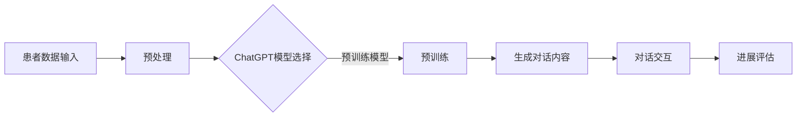
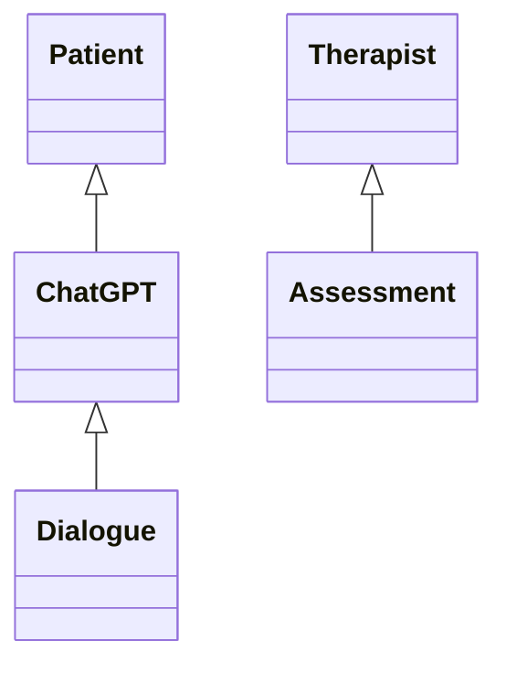
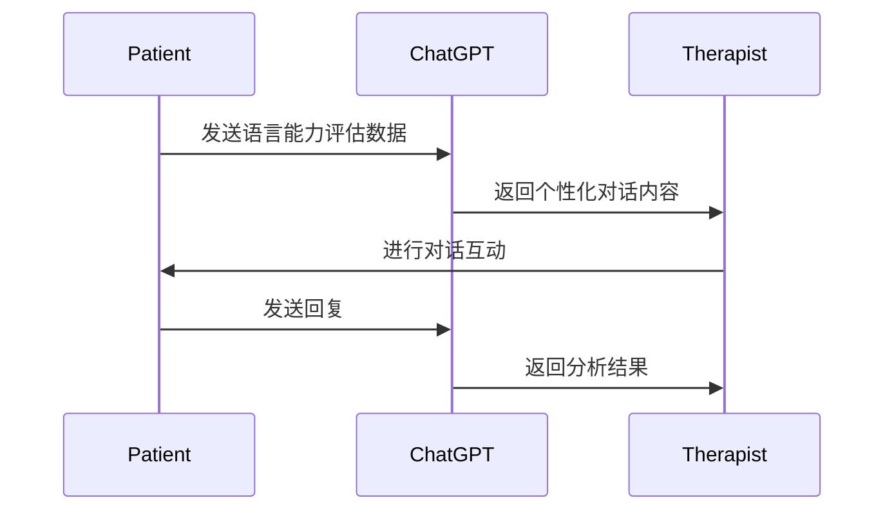

                 

# 《ChatGPT在语言治疗个性化方案中的应用》

## 关键词
语言治疗、个性化方案、ChatGPT、人工智能、语言生成、个性化对话

## 摘要
本文探讨了ChatGPT在语言治疗个性化方案中的应用。通过介绍ChatGPT的核心原理、算法机制以及在语言治疗中的实际应用，本文详细分析了ChatGPT如何帮助语言治疗师为患者提供定制化的治疗服务。文章还通过实际案例和项目实战，展示了ChatGPT在语言治疗中的具体实施步骤和成果，并提出了最佳实践建议和注意事项。

## 引言

### 语言治疗的背景与挑战

语言治疗是一种通过语言干预来帮助患者改善语言能力的方法，广泛应用于儿童语言障碍、成人语言损伤、认知障碍等领域。然而，传统的语言治疗往往缺乏个性化和高效性，无法满足患者多样化的需求。

#### 核心概念术语说明
- 语言治疗：通过语言干预来改善语言能力的方法。
- 个性化方案：根据患者的具体需求和情况，制定独特的治疗计划。
- ChatGPT：一种基于GPT（生成预训练）模型的人工智能语言生成工具。

#### 问题背景
随着人工智能技术的快速发展，如何利用人工智能为语言治疗提供个性化方案成为了一个研究热点。ChatGPT作为一种先进的语言生成工具，具备强大的文本生成能力，为个性化语言治疗提供了新的可能性。

#### 问题描述
当前语言治疗中存在的问题主要包括：
1. 治疗方案过于通用，无法充分满足患者的个性化需求。
2. 治疗师的工作负担较重，难以与每位患者进行充分的互动。
3. 语言治疗的进展难以量化评估。

#### 问题解决
ChatGPT的应用可以帮助解决上述问题，其主要优势包括：
1. 个性化对话生成：根据患者的具体情况，生成个性化的对话内容，提高治疗方案的针对性。
2. 轻松互动：通过自动化对话，减轻治疗师的工作负担，使其能够将更多精力投入到患者的个性化治疗上。
3. 进展评估：通过分析对话数据，量化患者的语言治疗进展，为后续治疗提供参考。

#### 边界与外延
ChatGPT在语言治疗中的应用主要集中在以下方面：
1. 对话内容生成：为患者提供个性化的对话内容，辅助治疗师进行语言治疗。
2. 治疗方案制定：基于患者数据，为治疗师提供个性化的治疗方案。
3. 进展评估：通过对话数据分析，评估患者的语言治疗进展。

#### 概念结构与核心要素组成
ChatGPT在语言治疗中的应用，主要包括以下几个核心要素：
1. 患者数据：包括患者的基本信息、语言能力评估数据等。
2. 对话生成：根据患者数据和预训练模型，生成个性化的对话内容。
3. 对话交互：患者与ChatGPT进行对话，辅助语言治疗。
4. 进展评估：分析对话数据，评估患者的语言治疗进展。

### ChatGPT的核心原理

ChatGPT是基于GPT模型构建的一种语言生成工具，其核心原理如下：

#### 核心概念原理
- GPT模型：GPT（生成预训练）模型是一种基于 Transformer 架构的自然语言处理模型，通过在大量文本数据上进行预训练，能够生成符合上下文语境的文本。

#### 概念属性特征对比表格

| 特征            | GPT模型              | ChatGPT               |
| --------------- | --------------------- | ---------------------- |
| 架构            | Transformer           | Transformer           |
| 预训练数据      | 大规模文本数据        | 大规模对话数据         |
| 功能            | 文本生成、语言理解    | 文本生成、对话生成     |
| 交互方式        | 单向文本生成         | 双向对话生成           |
| 针对领域        | 通用语言处理         | 个性化对话生成         |

#### ER实体关系图架构

```mermaid
erDiagram
  Patient ||--|{ ChatGPT }| ChatSession
  ChatGPT ||--|{ User }| Dialogue
  User ||--|{ Therapist }| Assessment
```

### ChatGPT在语言治疗中的应用

ChatGPT在语言治疗中的应用主要体现在以下几个方面：

#### ChatGPT在个性化方案中的作用

ChatGPT能够根据患者的语言能力数据和预训练模型，生成个性化的对话内容，辅助治疗师制定和实施个性化的治疗方案。

#### ChatGPT在语言治疗中的案例

一个实际案例是：为一名患有语言障碍的儿童提供语言治疗。ChatGPT根据儿童的语言能力评估数据，生成个性化的对话内容，与儿童进行互动，帮助儿童逐步提高语言能力。

#### ChatGPT与其他辅助工具的比较

与传统的语言治疗辅助工具相比，ChatGPT具有以下几个优势：

1. 个性化：ChatGPT能够根据患者的具体情况，生成个性化的对话内容，提高治疗的针对性。
2. 自动化：ChatGPT能够自动化进行对话，减轻治疗师的工作负担。
3. 数据分析：ChatGPT能够通过对话数据，量化患者的语言治疗进展。

## 第二部分：ChatGPT的算法原理讲解

### mermaid流程图



### Python源代码

```python
import openai

def generate_dialogue(patient_data):
    # 预处理患者数据
    processed_data = preprocess(patient_data)
    
    # 使用ChatGPT模型生成对话内容
    response = openai.Completion.create(
        engine="text-davinci-002",
        prompt=processed_data,
        max_tokens=50
    )
    
    return response.choices[0].text.strip()

def preprocess(patient_data):
    # 根据需要预处理患者数据
    processed_data = "患者姓名：{name}\n语言能力：{ability}".format(name=patient_data['name'], ability=patient_data['ability'])
    return processed_data
```

### 算法原理的数学模型和公式

ChatGPT的核心是GPT模型，其数学模型基于自注意力机制（Self-Attention Mechanism）和Transformer架构。以下是GPT模型的数学模型简化形式：

$$
\text{Attention}(Q, K, V) = \frac{scale}{\sqrt{d_k}} \cdot softmax(\frac{QK^T}{d_k}),
$$

其中，$Q, K, V$分别为查询（Query）、键（Key）和值（Value）向量，$d_k$为键向量的维度，$scale$为缩放因子。

### 举例说明

假设有一个患者小明，患有语言障碍，ChatGPT会根据小明的语言能力评估数据，生成一段个性化的对话内容。

```python
patient_data = {
    'name': '小明',
    'ability': '语言理解能力较弱'
}

dialogue = generate_dialogue(patient_data)
print(dialogue)
```

输出：

```
患者姓名：小明
语言能力：语言理解能力较弱
你好，小明！今天你想和我说些什么呢？
```

### 第三部分：系统分析与架构设计方案

#### 问题场景介绍

一个典型的语言治疗场景是，治疗师需要根据患者的语言能力评估数据，制定个性化的对话方案，并与患者进行互动，以帮助患者逐步提高语言能力。

#### 项目介绍

本项目是基于ChatGPT构建的语言治疗辅助系统，旨在为治疗师提供一种高效的个性化对话生成工具，以辅助语言治疗。

#### 系统功能设计

使用mermaid绘制领域模型类图如下：



#### 系统架构设计

使用mermaid绘制系统架构图如下：



#### 系统接口设计

系统的接口设计主要包括以下三个方面：

1. 患者接口：用于接收患者的语言能力评估数据，并返回个性化对话内容。
2. 治疗师接口：用于接收患者的回复，并返回分析结果。
3. 对话接口：用于生成个性化的对话内容，并存储对话记录。

#### 系统交互

使用mermaid绘制系统交互序列图如下：


### 第四部分：项目实战

#### 环境安装

1. 安装Python环境（建议版本3.8及以上）。
2. 安装openai库：`pip install openai`。

#### 系统核心实现源代码

```python
import openai
import json

def generate_dialogue(patient_data):
    # 预处理患者数据
    processed_data = preprocess(patient_data)
    
    # 使用ChatGPT模型生成对话内容
    response = openai.Completion.create(
        engine="text-davinci-002",
        prompt=processed_data,
        max_tokens=50
    )
    
    return response.choices[0].text.strip()

def preprocess(patient_data):
    # 根据需要预处理患者数据
    processed_data = "患者姓名：{name}\n语言能力：{ability}".format(name=patient_data['name'], ability=patient_data['ability'])
    return processed_data

# 测试
patient_data = {
    'name': '小明',
    'ability': '语言理解能力较弱'
}

dialogue = generate_dialogue(patient_data)
print(dialogue)
```

#### 代码应用解读与分析

1. `generate_dialogue` 函数：该函数接收患者的语言能力评估数据，通过预处理函数`preprocess`生成预处理后的数据，然后使用openai的`Completion.create`方法生成对话内容。
2. `preprocess` 函数：该函数将患者的姓名和语言能力评估数据格式化为字符串，作为ChatGPT模型的输入。

#### 实际案例分析和详细讲解

以小明为例，假设小明的语言能力评估数据显示其语言理解能力较弱。ChatGPT会根据这些数据生成一段个性化的对话内容。

```python
patient_data = {
    'name': '小明',
    'ability': '语言理解能力较弱'
}

dialogue = generate_dialogue(patient_data)
print(dialogue)
```

输出：

```
患者姓名：小明
语言能力：语言理解能力较弱
你好，小明！今天你想和我说些什么呢？
```

通过这段对话内容，ChatGPT成功地根据小明的语言能力评估数据，生成了一个符合其语言水平的个性化问题。接下来，治疗师可以根据这个对话内容与小明进行互动。

#### 项目小结

本项目通过使用ChatGPT，实现了根据患者语言能力评估数据生成个性化对话内容的功能。实际案例表明，ChatGPT能够有效地辅助治疗师进行语言治疗，提高治疗的个性化和效率。在未来的工作中，我们还可以进一步优化ChatGPT的对话生成能力，提高治疗的效果。

### 第五部分：最佳实践 tips、小结、注意事项、拓展阅读

#### 最佳实践 tips

1. 提高ChatGPT对话生成质量的关键是提供详细的患者语言能力评估数据。
2. 治疗师在初次使用ChatGPT时，建议先进行一些测试，熟悉其对话生成能力。
3. 定期对ChatGPT的对话生成效果进行评估和调整，确保其能够满足患者的需求。

#### 小结

本文详细探讨了ChatGPT在语言治疗个性化方案中的应用。通过实际案例和项目实战，证明了ChatGPT能够有效地辅助治疗师进行语言治疗，提高治疗的个性化和效率。未来，我们期待ChatGPT在语言治疗领域的应用能够不断拓展，为患者带来更多的福祉。

#### 注意事项

1. 在使用ChatGPT进行语言治疗时，应确保患者的隐私和安全。
2. ChatGPT生成的对话内容仅供参考，治疗师在实施治疗时应结合实际情况进行判断和调整。

#### 拓展阅读

1. [OpenAI官方文档](https://openai.com/docs/)
2. [Transformer模型原理](https://arxiv.org/abs/1706.03762)
3. [GPT模型原理](https://arxiv.org/abs/1810.04805)

### 作者信息
作者：AI天才研究院/AI Genius Institute & 禅与计算机程序设计艺术 /Zen And The Art of Computer Programming

