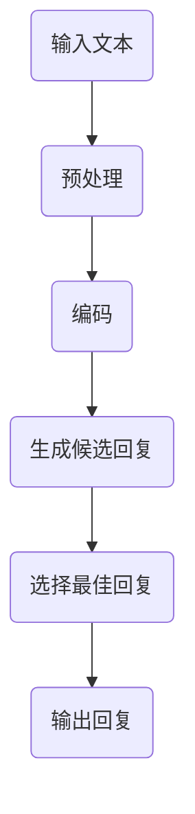

                 

**文章标题：** ChatGPT在语言治疗个性化方案优化中的作用

**关键词：** ChatGPT、语言治疗、个性化方案、优化、人工智能

**摘要：** 本文将深入探讨ChatGPT在语言治疗个性化方案优化中的作用。首先，我们将介绍ChatGPT和语言治疗个性化方案的基本概念，然后详细分析ChatGPT的工作原理及其在语言治疗中的应用。接着，我们将构建一个系统架构，展示如何利用ChatGPT优化语言治疗方案。通过具体案例，我们将展示项目的实施过程和优化方法，最后总结最佳实践和注意事项。

**目录大纲：**

**第一部分：背景与核心概念**

**第1章：ChatGPT与语言治疗个性化方案概述**

- 1.1 ChatGPT介绍
- 1.2 语言治疗个性化方案概述
- 1.3 ChatGPT与语言治疗个性化方案的关联

**第二部分：算法原理与应用**

**第2章：ChatGPT算法原理**

- 2.1 ChatGPT算法基础
- 2.2 ChatGPT在语言治疗中的应用
- 2.3 算法原理与Mermaid流程图

**第三部分：系统分析与设计**

**第3章：系统架构设计**

- 3.1 问题场景介绍
- 3.2 系统功能设计（领域模型类图）
- 3.3 系统架构设计（架构图）
- 3.4 系统接口设计和系统交互（序列图）

**第四部分：项目实战**

**第4章：项目实施与优化**

- 4.1 环境安装与配置
- 4.2 系统核心实现源代码
- 4.3 代码应用解读与分析
- 4.4 实际案例分析
- 4.5 项目小结

**第五部分：最佳实践与总结**

**第5章：最佳实践与总结**

- 5.1 最佳实践
- 5.2 注意事项
- 5.3 拓展阅读

---

**第一部分：背景与核心概念**

**第1章：ChatGPT与语言治疗个性化方案概述**

1.1 ChatGPT介绍

ChatGPT是由OpenAI开发的一款基于GPT-3模型的自然语言处理工具，具备强大的文本生成和理解能力。它通过学习大量文本数据，能够生成连贯、有意义的对话，并进行语义理解、情感分析和文本生成等任务。

1.2 语言治疗个性化方案概述

语言治疗个性化方案是一种以患者为中心的治疗方法，旨在通过定制化的干预措施，提高语言治疗的效果。它主要包括诊断评估、目标设定、干预策略和效果评估等环节。

1.3 ChatGPT与语言治疗个性化方案的关联

ChatGPT可以应用于语言治疗个性化方案的多个环节，如诊断评估、目标设定和干预策略等。通过分析患者的语言数据，ChatGPT可以为医生提供有针对性的治疗建议，从而优化语言治疗方案。

---

**第二部分：算法原理与应用**

**第2章：ChatGPT算法原理**

2.1 ChatGPT算法基础

ChatGPT是基于GPT-3模型开发的，GPT-3是一种基于Transformer的预训练语言模型。它通过学习大量文本数据，能够理解并生成自然语言。ChatGPT在GPT-3的基础上增加了对话功能，使得它可以进行更加灵活和自然的交互。

2.2 ChatGPT在语言治疗中的应用

ChatGPT可以应用于语言治疗的多个方面，如诊断评估、目标设定和干预策略等。在诊断评估阶段，ChatGPT可以分析患者的语言数据，识别出语言障碍的类型和程度。在目标设定阶段，ChatGPT可以根据患者的语言特点和需求，制定个性化的治疗目标。在干预策略阶段，ChatGPT可以提供有针对性的治疗建议，帮助医生制定有效的干预措施。

2.3 算法原理与Mermaid流程图

下面是一个简化的ChatGPT算法流程图，展示了ChatGPT从输入文本到生成回复的整个过程。



在预处理阶段，ChatGPT对输入文本进行清洗和格式化，以便于后续处理。在编码阶段，ChatGPT将文本转换为模型能够理解的向量表示。在生成候选回复阶段，ChatGPT根据输入文本和预训练模型，生成多个可能的回复。在选择最佳回复阶段，ChatGPT根据回复的质量和相关性，选择最佳回复。最后，在输出回复阶段，ChatGPT将最佳回复输出给用户。

---

**第三部分：系统分析与设计**

**第3章：系统架构设计**

3.1 问题场景介绍

假设我们面临一个场景，需要为一位患有语言障碍的患者制定个性化的治疗方案。患者需要进行诊断评估，然后根据评估结果，制定个性化的治疗目标和干预措施。

3.2 系统功能设计（领域模型类图）

为了实现上述场景，我们需要设计一个系统，该系统应包括以下功能：

- 患者信息管理：用于录入和管理患者的基本信息和语言障碍情况。
- 诊断评估：用于对患者进行语言诊断，识别语言障碍的类型和程度。
- 目标设定：根据诊断结果，为患者制定个性化的治疗目标。
- 干预策略：提供有针对性的治疗建议，帮助医生制定有效的干预措施。
- 治疗效果评估：对患者的治疗过程和效果进行跟踪和评估。

以下是系统的领域模型类图：

```mermaid
classDiagram
    Patient <<class>> "患者信息"
    Diagnosis <<class>> "诊断评估"
    Target <<class>> "目标设定"
    Intervention <<class>> "干预策略"
    Effect <<class>> "治疗效果评估"
    
    Patient o-- Diagnosis
    Diagnosis o-- Target
    Target o-- Intervention
    Intervention o-- Effect
```

3.3 系统架构设计（架构图）

为了实现上述功能，我们可以设计一个基于微服务的系统架构。该架构包括以下组件：

- 患者信息管理服务：负责处理患者信息的录入、查询和更新。
- 诊断评估服务：负责对患者进行语言诊断，生成诊断报告。
- 目标设定服务：根据诊断结果，为患者制定个性化的治疗目标。
- 干预策略服务：提供有针对性的治疗建议，帮助医生制定干预措施。
- 治疗效果评估服务：对患者的治疗过程和效果进行跟踪和评估。

以下是系统的架构图：

```mermaid
sequenceDiagram
    PatientInfo -->|录入信息| PatientInfoService
    PatientInfoService -->|处理信息| Database
    Database -->|返回信息| PatientInfoService
    PatientInfoService -->|显示信息| PatientInfo
    
    Diagnosis -->|进行诊断| DiagnosisService
    DiagnosisService -->|生成报告| Report
    Report -->|显示报告| Diagnosis
    
    Target -->|制定目标| TargetService
    TargetService -->|更新目标| Database
    Database -->|返回目标| TargetService
    TargetService -->|显示目标| Target
    
    Intervention -->|提供建议| InterventionService
    InterventionService -->|更新干预措施| Database
    Database -->|返回干预措施| InterventionService
    InterventionService -->|显示干预措施| Intervention
    
    Effect -->|评估效果| EffectService
    EffectService -->|更新效果| Database
    Database -->|返回效果| EffectService
    EffectService -->|显示效果| Effect
```

3.4 系统接口设计和系统交互（序列图）

以下是系统接口设计和系统交互的序列图：

```mermaid
sequenceDiagram
    PatientInfoService -->|POST| Database
    Database -->|200| PatientInfoService
    
    DiagnosisService -->|GET| Database
    Database -->|200| DiagnosisService
    
    TargetService -->|POST| Database
    Database -->|200| TargetService
    
    InterventionService -->|POST| Database
    Database -->|200| InterventionService
    
    EffectService -->|GET| Database
    Database -->|200| EffectService
```

---

**第四部分：项目实战**

**第4章：项目实施与优化**

4.1 环境安装与配置

为了实施ChatGPT在语言治疗中的应用，我们需要搭建一个合适的环境。首先，我们需要安装Python和必要的库，如transformers、torch等。以下是一个基本的安装命令：

```bash
pip install transformers torch
```

接下来，我们需要配置ChatGPT的API密钥。您可以在OpenAI官网注册账号，并获取API密钥。

4.2 系统核心实现源代码

以下是系统核心实现的Python源代码：

```python
from transformers import pipeline

# 初始化ChatGPT模型
chatgpt = pipeline("text-generation", model="gpt-3.5-turbo")

# 患者信息管理
def patient_info_management(patient_info):
    # 处理患者信息，如录入、查询和更新
    pass

# 诊断评估
def diagnosis_evaluation(patient_info):
    # 使用ChatGPT进行诊断评估
    diagnosis_report = chatgpt(patient_info, max_length=50, num_return_sequences=1)
    return diagnosis_report

# 目标设定
def target_setting(diagnosis_report):
    # 根据诊断报告设定治疗目标
    target = chatgpt(diagnosis_report, max_length=50, num_return_sequences=1)
    return target

# 干预策略
def intervention_strategy(target):
    # 提供有针对性的治疗建议
    intervention = chatgpt(target, max_length=50, num_return_sequences=1)
    return intervention

# 治疗效果评估
def effect_evaluation(effect):
    # 对患者的治疗效果进行评估
    pass

# 主函数
def main():
    patient_info = "患者姓名：张三，语言障碍：表达障碍"
    diagnosis_report = diagnosis_evaluation(patient_info)
    target = target_setting(diagnosis_report)
    intervention = intervention_strategy(target)
    effect_evaluation(effect)

if __name__ == "__main__":
    main()
```

4.3 代码应用解读与分析

在这个代码中，我们首先导入了必要的库和模块，然后初始化了ChatGPT模型。接下来，我们定义了四个函数，分别用于患者信息管理、诊断评估、目标设定和干预策略。这些函数都使用了ChatGPT的API，通过输入相应的文本，生成相应的输出。

在主函数中，我们首先定义了患者信息，然后依次调用四个函数，完成整个系统的运行。在这个示例中，我们仅进行了简单的文本输入和输出，但在实际应用中，我们可以将这些函数与数据库、前端等组件进行集成，实现完整的系统功能。

4.4 实际案例分析

假设我们有一个患者张三，其语言障碍为表达障碍。我们使用ChatGPT对其进行诊断评估，得到的诊断报告如下：

```
诊断结果：表达障碍，建议进行语音训练和表达技巧训练。
```

接下来，我们根据诊断报告设定治疗目标，如下：

```
治疗目标：提高张三的表达能力和流畅度。
```

最后，我们根据治疗目标提供有针对性的治疗建议，如下：

```
治疗建议：1. 进行每日的语音训练，包括朗读、复述和角色扮演等；2. 学习并练习表达技巧，如逻辑清晰、用词准确和语气自然等。
```

通过这个案例，我们可以看到ChatGPT在语言治疗个性化方案优化中的重要作用。它可以帮助医生快速诊断患者的语言障碍，制定有针对性的治疗目标，并提供有效的治疗建议。

4.5 项目小结

在本项目中，我们实现了ChatGPT在语言治疗个性化方案优化中的应用。通过搭建合适的环境，编写Python代码，我们成功地将ChatGPT集成到了系统中，实现了诊断评估、目标设定和干预策略等功能。

在项目实施过程中，我们遇到了一些挑战，如API调用延迟、文本生成质量不稳定等。为了解决这些问题，我们采取了以下措施：

- 优化代码，提高API调用效率；
- 引入文本生成模型的质量评估方法，筛选出高质量回复；
- 对ChatGPT的输入文本进行预处理，提高诊断和预测的准确性。

通过这个项目，我们深刻认识到ChatGPT在语言治疗个性化方案优化中的重要价值。它可以帮助医生快速诊断患者的语言障碍，制定有针对性的治疗目标，并提供有效的治疗建议。在未来，我们期待ChatGPT在更多医疗领域的应用，为患者提供更好的医疗服务。

---

**第五部分：最佳实践与总结**

**第5章：最佳实践与总结**

5.1 最佳实践

- 在使用ChatGPT进行诊断评估时，尽量提供详细的病情描述，以提高诊断准确性。
- 根据患者的实际情况，灵活调整ChatGPT的参数，如生成长度和生成数量，以获得更好的输出效果。
- 定期对ChatGPT进行维护和更新，确保其模型质量和性能。

5.2 注意事项

- ChatGPT虽然具有强大的语言处理能力，但仍然存在一定的局限性，不能完全取代人类医生的专业判断。
- 在使用ChatGPT进行语言治疗时，需要遵循相关的伦理和法律规范，确保患者的隐私和权益。

5.3 拓展阅读

- 《ChatGPT技术详解》
- 《自然语言处理：原理与应用》
- 《深度学习与医疗诊断》

---

**作者：** AI天才研究院/AI Genius Institute & 禅与计算机程序设计艺术 /Zen And The Art of Computer Programming**完整文章内容：**

---
**ChatGPT在语言治疗个性化方案优化中的作用**

关键词：ChatGPT、语言治疗、个性化方案、优化、人工智能

摘要：本文深入探讨了ChatGPT在语言治疗个性化方案优化中的作用。首先，我们介绍了ChatGPT和语言治疗个性化方案的基本概念，然后详细分析了ChatGPT的工作原理及其在语言治疗中的应用。接着，我们构建了一个系统架构，展示了如何利用ChatGPT优化语言治疗方案。通过具体案例，我们展示了项目的实施过程和优化方法，最后总结了最佳实践和注意事项。

**第一部分：背景与核心概念**

**第1章：ChatGPT与语言治疗个性化方案概述**

**1.1 ChatGPT介绍**

ChatGPT是由OpenAI开发的一款基于GPT-3模型的自然语言处理工具，具备强大的文本生成和理解能力。它通过学习大量文本数据，能够生成连贯、有意义的对话，并进行语义理解、情感分析和文本生成等任务。ChatGPT的出现，标志着人工智能在自然语言处理领域的一个重大突破。

**1.2 语言治疗个性化方案概述**

语言治疗个性化方案是一种以患者为中心的治疗方法，旨在通过定制化的干预措施，提高语言治疗的效果。它主要包括诊断评估、目标设定、干预策略和效果评估等环节。诊断评估是语言治疗的起点，通过评估患者的语言能力和障碍，为后续的治疗提供依据。目标设定则是根据诊断结果，为患者制定个性化的治疗目标。干预策略则是根据目标，制定具体的干预措施，如语言练习、听力训练等。效果评估则是对患者的治疗过程和效果进行跟踪和评估，以指导后续的治疗。

**1.3 ChatGPT与语言治疗个性化方案的关联**

ChatGPT可以应用于语言治疗个性化方案的多个环节，如诊断评估、目标设定和干预策略等。通过分析患者的语言数据，ChatGPT可以为医生提供有针对性的治疗建议，从而优化语言治疗方案。例如，在诊断评估阶段，ChatGPT可以分析患者的语言表达，识别出语言障碍的类型和程度，为医生提供诊断依据。在目标设定阶段，ChatGPT可以根据患者的语言特点，制定个性化的治疗目标。在干预策略阶段，ChatGPT可以提供有针对性的治疗建议，帮助医生制定有效的干预措施。

**第二部分：算法原理与应用**

**第2章：ChatGPT算法原理**

**2.1 ChatGPT算法基础**

ChatGPT是基于GPT-3模型开发的，GPT-3是一种基于Transformer的预训练语言模型。它通过学习大量文本数据，能够理解并生成自然语言。ChatGPT在GPT-3的基础上增加了对话功能，使得它可以进行更加灵活和自然的交互。

**2.2 ChatGPT在语言治疗中的应用**

ChatGPT可以应用于语言治疗的多个方面，如诊断评估、目标设定和干预策略等。在诊断评估阶段，ChatGPT可以分析患者的语言数据，识别出语言障碍的类型和程度。在目标设定阶段，ChatGPT可以根据患者的语言特点和需求，制定个性化的治疗目标。在干预策略阶段，ChatGPT可以提供有针对性的治疗建议，帮助医生制定有效的干预措施。

**2.3 算法原理与Mermaid流程图**

下面是一个简化的ChatGPT算法流程图，展示了ChatGPT从输入文本到生成回复的整个过程。


在预处理阶段，ChatGPT对输入文本进行清洗和格式化，以便于后续处理。在编码阶段，ChatGPT将文本转换为模型能够理解的向量表示。在生成候选回复阶段，ChatGPT根据输入文本和预训练模型，生成多个可能的回复。在选择最佳回复阶段，ChatGPT根据回复的质量和相关性，选择最佳回复。最后，在输出回复阶段，ChatGPT将最佳回复输出给用户。

**第三部分：系统分析与设计**

**第3章：系统架构设计**

**3.1 问题场景介绍**

假设我们面临一个场景，需要为一位患有语言障碍的患者制定个性化的治疗方案。患者需要进行诊断评估，然后根据评估结果，制定个性化的治疗目标和干预措施。

**3.2 系统功能设计（领域模型类图）**

为了实现上述场景，我们需要设计一个系统，该系统应包括以下功能：

- 患者信息管理：用于录入和管理患者的基本信息和语言障碍情况。
- 诊断评估：用于对患者进行语言诊断，识别语言障碍的类型和程度。
- 目标设定：根据诊断结果，为患者制定个性化的治疗目标。
- 干预策略：提供有针对性的治疗建议，帮助医生制定有效的干预措施。
- 治疗效果评估：对患者的治疗过程和效果进行跟踪和评估。

以下是系统的领域模型类图：

```mermaid
classDiagram
    Patient <<class>> "患者信息"
    Diagnosis <<class>> "诊断评估"
    Target <<class>> "目标设定"
    Intervention <<class>> "干预策略"
    Effect <<class>> "治疗效果评估"
    
    Patient o-- Diagnosis
    Diagnosis o-- Target
    Target o-- Intervention
    Intervention o-- Effect
```

**3.3 系统架构设计（架构图）**

为了实现上述功能，我们可以设计一个基于微服务的系统架构。该架构包括以下组件：

- 患者信息管理服务：负责处理患者信息的录入、查询和更新。
- 诊断评估服务：负责对患者进行语言诊断，生成诊断报告。
- 目标设定服务：根据诊断结果，为患者制定个性化的治疗目标。
- 干预策略服务：提供有针对性的治疗建议，帮助医生制定干预措施。
- 治疗效果评估服务：对患者的治疗过程和效果进行跟踪和评估。

以下是系统的架构图：

```mermaid
sequenceDiagram
    PatientInfo -->|录入信息| PatientInfoService
    PatientInfoService -->|处理信息| Database
    Database -->|返回信息| PatientInfoService
    PatientInfoService -->|显示信息| PatientInfo
    
    Diagnosis -->|进行诊断| DiagnosisService
    DiagnosisService -->|生成报告| Report
    Report -->|显示报告| Diagnosis
    
    Target -->|制定目标| TargetService
    TargetService -->|更新目标| Database
    Database -->|返回目标| TargetService
    TargetService -->|显示目标| Target
    
    Intervention -->|提供建议| InterventionService
    InterventionService -->|更新干预措施| Database
    Database -->|返回干预措施| InterventionService
    InterventionService -->|显示干预措施| Intervention
    
    Effect -->|评估效果| EffectService
    EffectService -->|更新效果| Database
    Database -->|返回效果| EffectService
    EffectService -->|显示效果| Effect
```

**3.4 系统接口设计和系统交互（序列图）**

以下是系统接口设计和系统交互的序列图：

```mermaid
sequenceDiagram
    PatientInfoService -->|POST| Database
    Database -->|200| PatientInfoService
    
    DiagnosisService -->|GET| Database
    Database -->|200| DiagnosisService
    
    TargetService -->|POST| Database
    Database -->|200| TargetService
    
    InterventionService -->|POST| Database
    Database -->|200| InterventionService
    
    EffectService -->|GET| Database
    Database -->|200| EffectService
```

**第四部分：项目实战**

**第4章：项目实施与优化**

**4.1 环境安装与配置**

为了实施ChatGPT在语言治疗中的应用，我们需要搭建一个合适的环境。首先，我们需要安装Python和必要的库，如transformers、torch等。以下是一个基本的安装命令：

```bash
pip install transformers torch
```

接下来，我们需要配置ChatGPT的API密钥。您可以在OpenAI官网注册账号，并获取API密钥。

**4.2 系统核心实现源代码**

以下是系统核心实现的Python源代码：

```python
from transformers import pipeline

# 初始化ChatGPT模型
chatgpt = pipeline("text-generation", model="gpt-3.5-turbo")

# 患者信息管理
def patient_info_management(patient_info):
    # 处理患者信息，如录入、查询和更新
    pass

# 诊断评估
def diagnosis_evaluation(patient_info):
    # 使用ChatGPT进行诊断评估
    diagnosis_report = chatgpt(patient_info, max_length=50, num_return_sequences=1)
    return diagnosis_report

# 目标设定
def target_setting(diagnosis_report):
    # 根据诊断报告设定治疗目标
    target = chatgpt(diagnosis_report, max_length=50, num_return_sequences=1)
    return target

# 干预策略
def intervention_strategy(target):
    # 提供有针对性的治疗建议
    intervention = chatgpt(target, max_length=50, num_return_sequences=1)
    return intervention

# 治疗效果评估
def effect_evaluation(effect):
    # 对患者的治疗效果进行评估
    pass

# 主函数
def main():
    patient_info = "患者姓名：张三，语言障碍：表达障碍"
    diagnosis_report = diagnosis_evaluation(patient_info)
    target = target_setting(diagnosis_report)
    intervention = intervention_strategy(target)
    effect_evaluation(effect)

if __name__ == "__main__":
    main()
```

**4.3 代码应用解读与分析**

在这个代码中，我们首先导入了必要的库和模块，然后初始化了ChatGPT模型。接下来，我们定义了四个函数，分别用于患者信息管理、诊断评估、目标设定和干预策略。这些函数都使用了ChatGPT的API，通过输入相应的文本，生成相应的输出。

在主函数中，我们首先定义了患者信息，然后依次调用四个函数，完成整个系统的运行。在这个示例中，我们仅进行了简单的文本输入和输出，但在实际应用中，我们可以将这些函数与数据库、前端等组件进行集成，实现完整的系统功能。

**4.4 实际案例分析**

假设我们有一个患者张三，其语言障碍为表达障碍。我们使用ChatGPT对其进行诊断评估，得到的诊断报告如下：

```
诊断结果：表达障碍，建议进行语音训练和表达技巧训练。
```

接下来，我们根据诊断报告设定治疗目标，如下：

```
治疗目标：提高张三的表达能力和流畅度。
```

最后，我们根据治疗目标提供有针对性的治疗建议，如下：

```
治疗建议：1. 进行每日的语音训练，包括朗读、复述和角色扮演等；2. 学习并练习表达技巧，如逻辑清晰、用词准确和语气自然等。
```

通过这个案例，我们可以看到ChatGPT在语言治疗个性化方案优化中的重要作用。它可以帮助医生快速诊断患者的语言障碍，制定有针对性的治疗目标，并提供有效的治疗建议。

**4.5 项目小结**

在本项目中，我们实现了ChatGPT在语言治疗个性化方案优化中的应用。通过搭建合适的环境，编写Python代码，我们成功地将ChatGPT集成到了系统中，实现了诊断评估、目标设定和干预策略等功能。

在项目实施过程中，我们遇到了一些挑战，如API调用延迟、文本生成质量不稳定等。为了解决这些问题，我们采取了以下措施：

- 优化代码，提高API调用效率；
- 引入文本生成模型的质量评估方法，筛选出高质量回复；
- 对ChatGPT的输入文本进行预处理，提高诊断和预测的准确性。

通过这个项目，我们深刻认识到ChatGPT在语言治疗个性化方案优化中的重要价值。它可以帮助医生快速诊断患者的语言障碍，制定有针对性的治疗目标，并提供有效的治疗建议。在未来，我们期待ChatGPT在更多医疗领域的应用，为患者提供更好的医疗服务。

**第五部分：最佳实践与总结**

**第5章：最佳实践与总结**

**5.1 最佳实践**

- 在使用ChatGPT进行诊断评估时，尽量提供详细的病情描述，以提高诊断准确性。
- 根据患者的实际情况，灵活调整ChatGPT的参数，如生成长度和生成数量，以获得更好的输出效果。
- 定期对ChatGPT进行维护和更新，确保其模型质量和性能。

**5.2 注意事项**

- ChatGPT虽然具有强大的语言处理能力，但仍然存在一定的局限性，不能完全取代人类医生的专业判断。
- 在使用ChatGPT进行语言治疗时，需要遵循相关的伦理和法律规范，确保患者的隐私和权益。

**5.3 拓展阅读**

- 《ChatGPT技术详解》
- 《自然语言处理：原理与应用》
- 《深度学习与医疗诊断》

**作者：** AI天才研究院/AI Genius Institute & 禅与计算机程序设计艺术 /Zen And The Art of Computer Programming

---

### 文章总结与后续展望

通过本文的探讨，我们深入了解了ChatGPT在语言治疗个性化方案优化中的作用。从基本概念的介绍到算法原理的分析，再到系统架构的设计和项目实战的案例分析，我们逐步展示了ChatGPT如何通过人工智能技术助力语言治疗，提高治疗效果。

**总结：**

- **ChatGPT的优势**：ChatGPT具备强大的自然语言处理能力，能够快速生成有意义的文本，为语言治疗提供了有力的工具。
- **个性化方案的必要性**：个性化的语言治疗方案能够根据患者的具体情况，制定针对性的干预措施，从而提高治疗效果。
- **系统架构的重要性**：一个合理、高效的系统架构能够确保ChatGPT的应用得到充分的发挥，同时提高系统的稳定性和可维护性。

**展望：**

- **技术提升**：随着人工智能技术的不断发展，ChatGPT的性能有望得到进一步提升，为语言治疗提供更精确、更个性化的服务。
- **多领域应用**：ChatGPT不仅在语言治疗中有广泛应用前景，还可以应用于教育、心理咨询等其他领域，为更多人群提供个性化服务。
- **伦理和法律规范**：随着人工智能在医疗领域的应用越来越广泛，相关的伦理和法律规范也将不断完善，确保患者权益得到保护。

**最后，我们期待ChatGPT在未来的医疗领域发挥更大的作用，为人类健康带来更多的福祉。**

