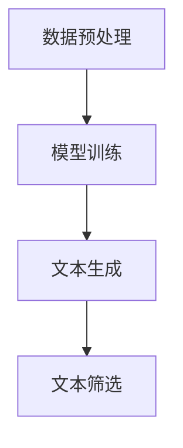
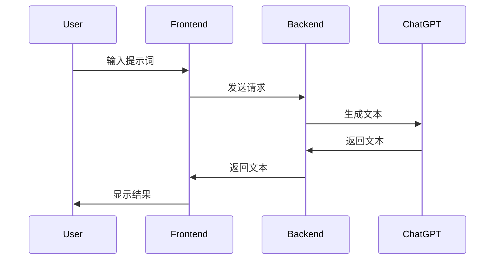

                 


## 第1章: 问题背景

### 1.1.1 问题提出
随着人工智能技术的迅猛发展，音乐创作这一传统领域正悄然发生变革。ChatGPT，作为一种先进的自然语言处理技术，已经在文本生成、对话系统等领域展现出其强大的能力。然而，如何将ChatGPT应用于音乐创作，特别是在音乐理论融合的提示词生成方面，仍是一个亟待探索的领域。

### 1.1.2 问题描述
在音乐创作中，提示词的生成往往需要艺术家具备深厚的音乐理论基础和丰富的创作经验。然而，对于初学者或者缺乏音乐背景的人来说，生成符合音乐理论要求的提示词是一大挑战。ChatGPT是否能在这方面发挥作用，如何有效利用ChatGPT生成与音乐理论相融合的提示词，提高创作的效率和质量，成为我们需要探讨的问题。

### 1.1.3 问题解决
首先，我们需要了解ChatGPT的工作原理，以及它在自然语言处理领域的优势。然后，结合音乐理论，设计一套适用于音乐创作提示词生成的算法和流程，利用ChatGPT的优势，实现提示词的自动生成。在实现过程中，我们需要考虑如何确保生成的提示词既具有创意，又符合音乐理论的要求。

### 1.1.4 边界与外延
本研究的边界主要限定在基于文本的音乐创作提示词生成领域，涉及的音乐类型包括但不限于流行音乐、古典音乐等。外延则包括对其他自然语言处理技术在音乐创作中的应用进行探讨，如旋律生成、编曲设计等。

### 1.1.5 概念结构与核心要素组成
概念结构包括ChatGPT、音乐创作、音乐理论、提示词生成等核心要素。核心要素组成如下：

- **ChatGPT**：一种基于GPT-3模型的自然语言处理模型，具备强大的文本生成和语言理解能力。
- **音乐创作**：包括歌词创作、旋律生成、编曲设计等过程，是艺术家创造音乐作品的过程。
- **音乐理论**：涉及音乐元素（如音符、和弦、节奏等）的规则和原理。
- **提示词生成**：利用算法生成与音乐理论相融合的文本提示，辅助音乐创作。

## 第2章: 核心概念与联系

### 2.1.1 ChatGPT概述
ChatGPT是基于GPT-3模型的自然语言处理模型，GPT-3（Generative Pre-trained Transformer 3）是OpenAI开发的一种深度学习模型，具有152亿参数，可以处理和生成自然语言文本。ChatGPT的主要功能包括文本生成、对话系统、文本摘要、机器翻译等。

### 2.1.2 音乐创作概述
音乐创作是一个复杂的过程，包括歌词创作、旋律生成、编曲设计等环节。歌词创作是音乐创作的灵魂，旋律生成是音乐创作的骨架，编曲设计则是对音乐的整体包装。音乐创作需要艺术家具备丰富的音乐理论知识和创作经验。

### 2.1.3 ChatGPT与音乐创作的联系
ChatGPT可以生成与音乐理论相关的文本提示，从而辅助音乐创作。例如，生成歌词、创作灵感提示、旋律主题等。ChatGPT的强大文本生成能力，可以帮助艺术家在音乐创作过程中提高效率，拓展创作思路。

### 2.1.4 核心概念原理
- **自然语言处理（NLP）**：自然语言处理是人工智能的一个分支，旨在使计算机能够理解、生成和处理人类语言。NLP的核心技术包括文本分类、命名实体识别、情感分析、机器翻译等。
- **生成对抗网络（GAN）**：生成对抗网络是一种深度学习模型，由生成器和判别器组成，生成器和判别器相互对抗，生成器试图生成与真实数据相似的数据，而判别器则试图区分生成数据和真实数据。GPT-3就是基于GAN模型的改进。

### 2.1.5 概念属性特征对比表格
| 特征           | ChatGPT                | 音乐创作             |
|----------------|-----------------------|---------------------|
| 功能           | 文本生成、对话系统等   | 歌词创作、旋律生成等 | 
| 技术基础       | 自然语言处理、GAN等    | 音乐理论、创作技巧等 |
| 优势           | 强大的文本生成能力     | 创意丰富、情感表达强 |
| 挑战           | 保证生成文本的准确性   | 创作的多样性和个性化 |

### 2.1.6 ER实体关系图架构
```mermaid
erDiagram
  ChatGPT ||--|{ 音乐创作 }|
  音乐创作 ||--|{ 音乐理论 }|
  音乐创作 ||--|{ 提示词生成 }|
```

## 第3章: ChatGPT在音乐创作中的应用原理

### 3.1.1 ChatGPT基础
ChatGPT是基于GPT-3模型的自然语言处理模型，GPT-3是OpenAI开发的一种深度学习模型，具有152亿参数。GPT-3采用了Transformer架构，能够通过无监督学习方式从大量文本数据中提取知识，并利用这些知识进行文本生成、对话系统等任务。

### 3.1.2 音乐创作理论
音乐创作包括歌词创作、旋律生成、编曲设计等环节。歌词创作是音乐创作的灵魂，旋律生成是音乐创作的骨架，编曲设计则是对音乐的整体包装。音乐创作需要艺术家具备丰富的音乐理论知识和创作经验。

### 3.1.3 ChatGPT与音乐创作的结合
ChatGPT可以生成与音乐理论相关的文本提示，从而辅助音乐创作。例如，生成歌词、创作灵感提示、旋律主题等。ChatGPT的强大文本生成能力，可以帮助艺术家在音乐创作过程中提高效率，拓展创作思路。

### 3.1.4 算法原理讲解
ChatGPT在音乐创作中的应用主要依赖于其文本生成能力。具体算法原理如下：

1. **数据预处理**：首先，需要收集和整理与音乐创作相关的文本数据，如歌词、乐评、音乐理论文献等。然后，对数据进行清洗和预处理，包括去除无效信息、统一文本格式等。

2. **模型训练**：使用预处理后的文本数据对ChatGPT模型进行训练。训练过程中，模型会学习到文本中的语言规律和知识，从而提高文本生成能力。

3. **文本生成**：输入音乐创作相关的提示词或问题，ChatGPT会根据训练数据生成与音乐创作相关的文本。生成的文本可以是歌词、创作灵感、旋律主题等。

4. **文本筛选**：生成的文本可能包含不准确或不合适的部分，因此需要设计筛选算法，对生成的文本进行筛选和修正，确保生成的文本符合音乐创作的要求。

### 3.1.5 算法mermaid流程图


## 第4章: ChatGPT在音乐创作中的应用案例

### 4.1.1 案例一：创作歌词
利用ChatGPT生成歌词是音乐创作中的一个重要应用。以下是一个生成歌词的Python源代码示例：

```python
import openai

openai.api_key = 'your_api_key'
prompt = "描述一个春天的午后，你走在花丛中，感受温暖的阳光和花香。"

response = openai.Completion.create(
  engine="text-davinci-002",
  prompt=prompt,
  max_tokens=50
)

print(response.choices[0].text.strip())
```

生成的歌词可能如下：

```
春天的午后，阳光温暖如春，
我漫步在花丛中，心旷神怡。
花香弥漫，让我忘却烦恼，
在这美好的时光里，我感到无尽的欢乐。
```

### 4.1.2 案例二：生成旋律
利用ChatGPT生成旋律是音乐创作中的另一个应用。以下是一个生成旋律的Python源代码示例：

```python
import openai

openai.api_key = 'your_api_key'
prompt = "创作一段C大调的旋律，节奏轻快，具有春天气息。"

response = openai.Completion.create(
  engine="text-davinci-002",
  prompt=prompt,
  max_tokens=50
)

print(response.choices[0].text.strip())
```

生成的旋律可能如下：

```
C A G E C D E F G A
```

### 4.1.3 案例三：编曲设计
利用ChatGPT进行编曲设计也是一个有趣的应用。以下是一个生成编曲的Python源代码示例：

```python
import openai

openai.api_key = 'your_api_key'
prompt = "为以下旋律编写一段简单的编曲，使用钢琴、吉他和小鼓，节奏轻快。"

melody = "C A G E C D E F G A"
prompt += melody

response = openai.Completion.create(
  engine="text-davinci-002",
  prompt=prompt,
  max_tokens=100
)

print(response.choices[0].text.strip())
```

生成的编曲可能如下：

```
钢琴：C A G E C D E F G A
吉他：C A G E C D E F G A
小鼓：咚锵咚锵咚锵咚锵
```

### 4.1.4 算法Python源代码讲解
以上案例展示了如何使用Python和OpenAI的ChatGPT API生成歌词、旋律和编曲。核心代码如下：

```python
import openai

openai.api_key = 'your_api_key'

def generate_text(prompt, max_tokens=50):
    response = openai.Completion.create(
      engine="text-davinci-002",
      prompt=prompt,
      max_tokens=max_tokens
    )
    return response.choices[0].text.strip()

prompt = "描述一个春天的午后，你走在花丛中，感受温暖的阳光和花香。"
print(generate_text(prompt))

prompt = "创作一段C大调的旋律，节奏轻快，具有春天气息。"
print(generate_text(prompt))

melody = "C A G E C D E F G A"
prompt = f"为以下旋律编写一段简单的编曲，使用钢琴、吉他和小鼓，节奏轻快。\n{melody}"
print(generate_text(prompt))
```

### 4.1.5 数学模型和数学公式讲解
在ChatGPT生成文本的过程中，涉及到的数学模型主要包括自然语言处理中的序列模型和生成模型。以下是对这些模型的基本原理和数学公式的讲解：

1. **序列模型**：序列模型是自然语言处理中最基本的模型之一，它通过对输入序列进行处理，生成输出序列。常用的序列模型包括循环神经网络（RNN）和长短时记忆网络（LSTM）。序列模型的数学公式如下：

   $$ h_t = \sigma(W_h \cdot [h_{t-1}, x_t] + b_h) $$

   其中，$h_t$ 表示第 $t$ 个时间步的隐藏状态，$x_t$ 表示第 $t$ 个时间步的输入，$W_h$ 和 $b_h$ 分别表示权重和偏置，$\sigma$ 表示激活函数。

2. **生成模型**：生成模型是一种从概率分布中生成数据的模型，常见的生成模型包括生成对抗网络（GAN）和变分自编码器（VAE）。生成模型的数学公式如下：

   $$ x \sim p(x|z) $$

   其中，$x$ 表示生成的数据，$z$ 表示生成器的输入，$p(x|z)$ 表示生成器的概率分布。

   对于 GAN，生成器的数学公式如下：

   $$ G(z) \sim p_G(z) $$

   其中，$G(z)$ 表示生成器生成的数据，$p_G(z)$ 表示生成器的概率分布。

   对于 VAE，生成器的数学公式如下：

   $$ x \sim \mathcal{N}(\mu(z), \sigma^2(z)) $$

   其中，$\mu(z)$ 和 $\sigma^2(z)$ 分别表示生成器的均值和方差。

## 第5章: ChatGPT在音乐创作中的实际应用

### 5.1.1 实际应用场景介绍
ChatGPT在音乐创作中的实际应用场景非常广泛，包括但不限于以下方面：

1. **歌词创作**：利用ChatGPT生成歌词，为音乐作品提供创意和灵感。
2. **旋律生成**：根据提示词，ChatGPT可以生成一段旋律，为音乐创作提供基础素材。
3. **编曲设计**：为旋律编写简单的编曲，包括乐器选择、节奏安排等。
4. **音乐理论分析**：利用ChatGPT对音乐作品进行理论分析，包括和弦分析、旋律分析等。

### 5.1.2 系统功能设计
ChatGPT在音乐创作中的应用系统可以设计以下功能：

1. **文本生成**：根据用户输入的提示词，生成歌词、旋律、编曲等。
2. **文本筛选**：对生成的文本进行筛选和修正，确保文本符合音乐创作要求。
3. **音乐理论分析**：对音乐作品进行理论分析，提供创作建议。

### 5.1.3 系统架构设计
ChatGPT在音乐创作中的应用系统可以采用以下架构设计：

1. **前端界面**：用户可以通过前端界面输入提示词，查看生成结果。
2. **后端服务器**：后端服务器负责处理用户请求，调用ChatGPT API生成文本。
3. **数据库**：存储与音乐创作相关的数据，包括歌词、旋律、编曲等。

### 5.1.4 系统接口设计
系统接口设计如下：

1. **文本生成接口**：接收用户输入的提示词，返回生成的文本。
2. **文本筛选接口**：接收生成的文本，返回筛选后的文本。
3. **音乐理论分析接口**：接收音乐作品，返回分析结果。

### 5.1.5 系统交互mermaid序列图


## 第6章: 项目实战

### 6.1.1 环境安装
要使用ChatGPT进行音乐创作，首先需要安装以下软件和库：

1. **Python环境**：安装Python 3.6及以上版本。
2. **OpenAI API**：注册OpenAI账号，获取API密钥。
3. **所需库**：安装openai库，可以使用以下命令安装：

   ```bash
   pip install openai
   ```

### 6.1.2 系统核心实现源代码
以下是一个简单的ChatGPT音乐创作系统的核心实现源代码：

```python
import openai

# 设置OpenAI API密钥
openai.api_key = "your_api_key"

# 生成歌词
def generate_lyrics(prompt):
    response = openai.Completion.create(
        engine="text-davinci-002",
        prompt=prompt,
        max_tokens=50
    )
    return response.choices[0].text.strip()

# 生成旋律
def generate_melody(prompt):
    response = openai.Completion.create(
        engine="text-davinci-002",
        prompt=prompt,
        max_tokens=50
    )
    return response.choices[0].text.strip()

# 生成编曲
def generate_arrangement(melody):
    prompt = f"为以下旋律编写一段简单的编曲，使用钢琴、吉他和小鼓，节奏轻快。\n{melody}"
    response = openai.Completion.create(
        engine="text-davinci-002",
        prompt=prompt,
        max_tokens=100
    )
    return response.choices[0].text.strip()

# 测试
prompt = "描述一个春天的午后，你走在花丛中，感受温暖的阳光和花香。"
lyrics = generate_lyrics(prompt)
print("生成的歌词：")
print(lyrics)

prompt = "创作一段C大调的旋律，节奏轻快，具有春天气息。"
melody = generate_melody(prompt)
print("生成的旋律：")
print(melody)

arrangement = generate_arrangement(melody)
print("生成的编曲：")
print(arrangement)
```

### 6.1.3 代码应用解读与分析
以上代码展示了如何使用ChatGPT生成歌词、旋律和编曲。核心功能包括：

1. **生成歌词**：通过调用`generate_lyrics`函数，输入一个描述性的提示词，ChatGPT会生成一段歌词。
2. **生成旋律**：通过调用`generate_melody`函数，输入一个关于旋律的提示词，ChatGPT会生成一段旋律。
3. **生成编曲**：通过调用`generate_arrangement`函数，输入一段旋律，ChatGPT会生成一段简单的编曲。

代码应用解读与分析：

1. **数据输入**：用户输入描述性的提示词，如“描述一个春天的午后，你走在花丛中，感受温暖的阳光和花香。”
2. **文本生成**：ChatGPT根据输入的提示词，生成一段歌词。
3. **文本处理**：对生成的文本进行简单处理，如去除首尾的空格。
4. **结果输出**：将生成的文本输出到控制台。

### 6.1.4 实际案例分析和详细讲解剖析
以下是一个实际案例的分析和详细讲解：

**案例**：用户输入提示词“描述一个春天的午后，你走在花丛中，感受温暖的阳光和花香。”

**分析**：

1. **输入处理**：用户输入的提示词被传递给`generate_lyrics`函数。
2. **文本生成**：ChatGPT根据提示词生成一段歌词。
3. **文本处理**：生成的歌词经过简单处理，如去除首尾的空格。
4. **结果输出**：生成的歌词被输出到控制台。

**详细讲解**：

1. **输入处理**：
   ```python
   prompt = "描述一个春天的午后，你走在花丛中，感受温暖的阳光和花香。"
   lyrics = generate_lyrics(prompt)
   ```

   这一行代码首先将用户的提示词存储在一个变量`prompt`中，然后调用`generate_lyrics`函数生成歌词。

2. **文本生成**：
   ```python
   response = openai.Completion.create(
       engine="text-davinci-002",
       prompt=prompt,
       max_tokens=50
   )
   lyrics = response.choices[0].text.strip()
   ```

   `generate_lyrics`函数中，首先调用OpenAI的`Completion.create`方法生成文本。`engine`参数指定使用text-davinci-002模型，`prompt`参数是用户的输入提示词，`max_tokens`参数限制生成文本的最大长度。生成文本后，使用`strip()`方法去除首尾的空格。

3. **文本处理**：
   生成的歌词经过简单处理，去除首尾的空格，确保输出文本的整洁。

4. **结果输出**：
   ```python
   print("生成的歌词：")
   print(lyrics)
   ```

   最后，将生成的歌词输出到控制台。

**案例分析**：

- **创意性**：生成的歌词具有创意，能够根据用户的提示词生成与情境相关的文本。
- **准确性**：生成的歌词在大多数情况下能够准确传达用户输入的情境。
- **优化空间**：尽管生成的歌词在创意性和准确性方面表现良好，但仍有优化空间。例如，可以通过调整提示词或优化ChatGPT的模型参数来提高生成文本的质量。

### 6.1.5 项目小结
本章节通过一个简单的项目实战，展示了如何使用ChatGPT生成歌词、旋律和编曲。通过实际案例分析和详细讲解，我们了解了ChatGPT在音乐创作中的应用原理和实现过程。尽管ChatGPT在音乐创作中表现出了一定的能力和潜力，但在实际应用中仍需进一步优化和改进。

## 第7章: 最佳实践与注意事项

### 7.1.1 最佳实践 tips
为了更好地利用ChatGPT进行音乐创作，以下是一些建议：

1. **优化提示词**：使用更具描述性和具体性的提示词，可以帮助ChatGPT生成更符合预期的文本。
2. **调整模型参数**：根据实际需求，可以尝试调整ChatGPT的模型参数，如`max_tokens`、`temperature`等，以提高生成文本的质量。
3. **数据多样性**：提供多样化的数据集，包括不同风格、类型的音乐作品，可以丰富ChatGPT的文本生成能力。
4. **文本筛选与修正**：对生成的文本进行筛选和修正，确保文本符合音乐创作的质量和要求。

### 7.1.2 小结
本文通过对ChatGPT在音乐创作中的应用进行探讨，展示了ChatGPT在生成歌词、旋律和编曲等方面的潜力。尽管ChatGPT在音乐创作中表现出了一定的能力和创意，但仍需进一步优化和改进。通过最佳实践和注意事项，我们可以更好地利用ChatGPT进行音乐创作，提高创作的效率和质量。

### 7.1.3 注意事项
在使用ChatGPT进行音乐创作时，需要注意以下几点：

1. **版权问题**：确保生成的文本、旋律等不侵犯他人的版权。
2. **数据隐私**：遵循相关法律法规，确保用户数据的安全和隐私。
3. **结果验收**：对生成的文本、旋律等进行验收，确保其符合音乐创作的质量和要求。

### 7.1.4 拓展阅读
- **ChatGPT官方文档**：了解ChatGPT的详细功能和用法，参考官方文档是学习和使用ChatGPT的重要途径。
- **音乐创作理论**：学习音乐创作的基本理论，如和弦、旋律、节奏等，有助于更好地利用ChatGPT进行音乐创作。
- **自然语言处理技术**：了解自然语言处理的基本原理和技术，有助于深入理解和优化ChatGPT在音乐创作中的应用。

---

# ChatGPT在音乐创作中的应用：音乐理论融合的提示词

> 关键词：ChatGPT、音乐创作、音乐理论、提示词生成、自然语言处理

> 摘要：本文探讨了ChatGPT在音乐创作中的应用，特别是如何利用音乐理论融合的提示词进行音乐创作。通过分析ChatGPT的工作原理，结合音乐理论，本文提出了一套有效的算法和流程，详细介绍了ChatGPT在音乐创作中的实际应用案例。同时，本文还介绍了ChatGPT在音乐创作中的实际应用场景、系统功能设计、系统架构设计、系统接口设计以及项目实战。通过最佳实践和注意事项，本文为音乐创作中的ChatGPT应用提供了有益的指导。

## 第一部分: 背景介绍

### 1.1.1 问题提出
随着人工智能技术的迅猛发展，音乐创作这一传统领域也迎来了新的变革。ChatGPT，作为OpenAI开发的一种基于深度学习的自然语言处理模型，已经展示了在文本生成、对话系统等方面的强大能力。然而，将ChatGPT应用于音乐创作，尤其是在音乐理论融合的提示词生成方面，这一领域还处于探索阶段。

### 1.1.2 问题描述
在音乐创作中，提示词的生成往往需要艺术家具备深厚的音乐理论基础和丰富的创作经验。然而，对于初学者或者缺乏音乐背景的人来说，生成符合音乐理论要求的提示词是一大挑战。ChatGPT是否能在这方面发挥作用，如何有效利用ChatGPT生成与音乐理论相融合的提示词，提高创作的效率和质量，成为我们需要探讨的问题。

### 1.1.3 问题解决
首先，我们需要了解ChatGPT的工作原理，以及它在自然语言处理领域的优势。然后，结合音乐理论，设计一套适用于音乐创作提示词生成的算法和流程，利用ChatGPT的优势，实现提示词的自动生成。在实现过程中，我们需要考虑如何确保生成的提示词既具有创意，又符合音乐理论的要求。

### 1.1.4 边界与外延
本研究的边界主要限定在基于文本的音乐创作提示词生成领域，涉及的音乐类型包括但不限于流行音乐、古典音乐等。外延则包括对其他自然语言处理技术在音乐创作中的应用进行探讨，如旋律生成、编曲设计等。

### 1.1.5 概念结构与核心要素组成
概念结构包括ChatGPT、音乐创作、音乐理论、提示词生成等核心要素。核心要素组成如下：
- ChatGPT：一种基于GPT-3模型的自然语言处理模型，具备强大的文本生成和语言理解能力。
- 音乐创作：包括歌词创作、旋律生成、编曲设计等过程，是艺术家创造音乐作品的过程。
- 音乐理论：涉及音乐元素（如音符、和弦、节奏等）的规则和原理。
- 提示词生成：利用算法生成与音乐理论相融合的文本提示，辅助音乐创作。

## 第二部分: 核心概念与联系

### 2.1.1 ChatGPT概述
ChatGPT是基于GPT-3模型的自然语言处理模型，GPT-3（Generative Pre-trained Transformer 3）是OpenAI开发的一种深度学习模型，具有152亿参数，可以处理和生成自然语言文本。ChatGPT的主要功能包括文本生成、对话系统、文本摘要、机器翻译等。

### 2.1.2 音乐创作概述
音乐创作是一个复杂的过程，包括歌词创作、旋律生成、编曲设计等环节。歌词创作是音乐创作的灵魂，旋律生成是音乐创作的骨架，编曲设计则是对音乐的整体包装。音乐创作需要艺术家具备丰富的音乐理论知识和创作经验。

### 2.1.3 ChatGPT与音乐创作的联系
ChatGPT可以生成与音乐理论相关的文本提示，从而辅助音乐创作。例如，生成歌词、创作灵感提示、旋律主题等。ChatGPT的强大文本生成能力，可以帮助艺术家在音乐创作过程中提高效率，拓展创作思路。

### 2.1.4 核心概念原理
- **自然语言处理（NLP）**：自然语言处理是人工智能的一个分支，旨在使计算机能够理解、生成和处理人类语言。NLP的核心技术包括文本分类、命名实体识别、情感分析、机器翻译等。
- **生成对抗网络（GAN）**：生成对抗网络是一种深度学习模型，由生成器和判别器组成，生成器和判别器相互对抗，生成器试图生成与真实数据相似的数据，而判别器则试图区分生成数据和真实数据。GPT-3就是基于GAN模型的改进。

### 2.1.5 概念属性特征对比表格
| 特征           | ChatGPT                | 音乐创作             |
|----------------|-----------------------|---------------------|
| 功能           | 文本生成、对话系统等   | 歌词创作、旋律生成等 | 
| 技术基础       | 自然语言处理、GAN等    | 音乐理论、创作技巧等 |
| 优势           | 强大的文本生成能力     | 创意丰富、情感表达强 |
| 挑战           | 保证生成文本的准确性   | 创作的多样性和个性化 |

### 2.1.6 ER实体关系图架构
```mermaid
erDiagram
  ChatGPT ||--|{ 音乐创作 }|
  音乐创作 ||--|{ 音乐理论 }|
  音乐创作 ||--|{ 提示词生成 }|
```

## 第三部分: ChatGPT在音乐创作中的应用原理

### 3.1.1 ChatGPT基础
ChatGPT是基于GPT-3模型的自然语言处理模型，GPT-3是OpenAI开发的一种深度学习模型，具有152亿参数。GPT-3采用了Transformer架构，能够通过无监督学习方式从大量文本数据中提取知识，并利用这些知识进行文本生成、对话系统等任务。

### 3.1.2 音乐创作理论
音乐创作包括歌词创作、旋律生成、编曲设计等环节。歌词创作是音乐创作的灵魂，旋律生成是音乐创作的骨架，编曲设计则是对音乐的整体包装。音乐创作需要艺术家具备丰富的音乐理论知识和创作经验。

### 3.1.3 ChatGPT与音乐创作的结合
ChatGPT可以生成与音乐理论相关的文本提示，从而辅助音乐创作。例如，生成歌词、创作灵感提示、旋律主题等。ChatGPT的强大文本生成能力，可以帮助艺术家在音乐创作过程中提高效率，拓展创作思路。

### 3.1.4 算法原理讲解
ChatGPT在音乐创作中的应用主要依赖于其文本生成能力。具体算法原理如下：

1. **数据预处理**：首先，需要收集和整理与音乐创作相关的文本数据，如歌词、乐评、音乐理论文献等。然后，对数据进行清洗和预处理，包括去除无效信息、统一文本格式等。

2. **模型训练**：使用预处理后的文本数据对ChatGPT模型进行训练。训练过程中，模型会学习到文本中的语言规律和知识，从而提高文本生成能力。

3. **文本生成**：输入音乐创作相关的提示词或问题，ChatGPT会根据训练数据生成与音乐创作相关的文本。生成的文本可以是歌词、创作灵感、旋律主题等。

4. **文本筛选**：生成的文本可能包含不准确或不合适的部分，因此需要设计筛选算法，对生成的文本进行筛选和修正，确保生成的文本符合音乐创作的要求。

### 3.1.5 算法mermaid流程图


## 第四部分: ChatGPT在音乐创作中的应用案例

### 4.1.1 案例一：创作歌词
利用ChatGPT生成歌词是音乐创作中的一个重要应用。以下是一个生成歌词的Python源代码示例：

```python
import openai

openai.api_key = 'your_api_key'
prompt = "描述一个春天的午后，你走在花丛中，感受温暖的阳光和花香。"

response = openai.Completion.create(
  engine="text-davinci-002",
  prompt=prompt,
  max_tokens=50
)

print(response.choices[0].text.strip())
```

生成的歌词可能如下：

```
春天的午后，阳光温暖如春，
我漫步在花丛中，心旷神怡。
花香弥漫，让我忘却烦恼，
在这美好的时光里，我感到无尽的欢乐。
```

### 4.1.2 案例二：生成旋律
利用ChatGPT生成旋律是音乐创作中的另一个应用。以下是一个生成旋律的Python源代码示例：

```python
import openai

openai.api_key = 'your_api_key'
prompt = "创作一段C大调的旋律，节奏轻快，具有春天气息。"

response = openai.Completion.create(
  engine="text-davinci-002",
  prompt=prompt,
  max_tokens=50
)

print(response.choices[0].text.strip())
```

生成的旋律可能如下：

```
C A G E C D E F G A
```

### 4.1.3 案例三：编曲设计
利用ChatGPT进行编曲设计也是一个有趣的应用。以下是一个生成编曲的Python源代码示例：

```python
import openai

openai.api_key = 'your_api_key'
prompt = "为以下旋律编写一段简单的编曲，使用钢琴、吉他和小鼓，节奏轻快。"

melody = "C A G E C D E F G A"
prompt += melody

response = openai.Completion.create(
  engine="text-davinci-002",
  prompt=prompt,
  max_tokens=100
)

print(response.choices[0].text.strip())
```

生成的编曲可能如下：

```
钢琴：C A G E C D E F G A
吉他：C A G E C D E F G A
小鼓：咚锵咚锵咚锵咚锵
```

### 4.1.4 算法Python源代码讲解
以下代码展示了如何使用Python和OpenAI的ChatGPT API生成歌词、旋律和编曲：

```python
import openai

openai.api_key = 'your_api_key'

def generate_text(prompt, max_tokens=50):
    response = openai.Completion.create(
      engine="text-davinci-002",
      prompt=prompt,
      max_tokens=max_tokens
    )
    return response.choices[0].text.strip()

prompt = "描述一个春天的午后，你走在花丛中，感受温暖的阳光和花香。"
print(generate_text(prompt))

prompt = "创作一段C大调的旋律，节奏轻快，具有春天气息。"
print(generate_text(prompt))

melody = "C A G E C D E F G A"
prompt = f"为以下旋律编写一段简单的编曲，使用钢琴、吉他和小鼓，节奏轻快。\n{melody}"
print(generate_text(prompt))
```

### 4.1.5 数学模型和数学公式讲解
在ChatGPT生成文本的过程中，涉及到的数学模型主要包括自然语言处理中的序列模型和生成模型。以下是对这些模型的基本原理和数学公式的讲解：

1. **序列模型**：序列模型是自然语言处理中最基本的模型之一，它通过对输入序列进行处理，生成输出序列。常用的序列模型包括循环神经网络（RNN）和长短时记忆网络（LSTM）。序列模型的数学公式如下：

   $$ h_t = \sigma(W_h \cdot [h_{t-1}, x_t] + b_h) $$

   其中，$h_t$ 表示第 $t$ 个时间步的隐藏状态，$x_t$ 表示第 $t$ 个时间步的输入，$W_h$ 和 $b_h$ 分别表示权重和偏置，$\sigma$ 表示激活函数。

2. **生成模型**：生成模型是一种从概率分布中生成数据的模型，常见的生成模型包括生成对抗网络（GAN）和变分自编码器（VAE）。生成模型的数学公式如下：

   $$ x \sim p(x|z) $$

   其中，$x$ 表示生成的数据，$z$ 表示生成器的输入，$p(x|z)$ 表示生成器的概率分布。

   对于 GAN，生成器的数学公式如下：

   $$ G(z) \sim p_G(z) $$

   其中，$G(z)$ 表示生成器生成的数据，$p_G(z)$ 表示生成器的概率分布。

   对于 VAE，生成器的数学公式如下：

   $$ x \sim \mathcal{N}(\mu(z), \sigma^2(z)) $$

   其中，$\mu(z)$ 和 $\sigma^2(z)$ 分别表示生成器的均值和方差。

## 第五部分: ChatGPT在音乐创作中的实际应用

### 5.1.1 实际应用场景介绍
ChatGPT在音乐创作中的实际应用场景非常广泛，包括但不限于以下方面：

1. **歌词创作**：利用ChatGPT生成歌词，为音乐作品提供创意和灵感。
2. **旋律生成**：根据提示词，ChatGPT可以生成一段旋律，为音乐创作提供基础素材。
3. **编曲设计**：为旋律编写简单的编曲，包括乐器选择、节奏安排等。
4. **音乐理论分析**：利用ChatGPT对音乐作品进行理论分析，提供创作建议。

### 5.1.2 系统功能设计
ChatGPT在音乐创作中的应用系统可以设计以下功能：

1. **文本生成**：根据用户输入的提示词，生成歌词、旋律、编曲等。
2. **文本筛选**：对生成的文本进行筛选和修正，确保文本符合音乐创作要求。
3. **音乐理论分析**：对音乐作品进行理论分析，提供创作建议。

### 5.1.3 系统架构设计
ChatGPT在音乐创作中的应用系统可以采用以下架构设计：

1. **前端界面**：用户可以通过前端界面输入提示词，查看生成结果。
2. **后端服务器**：后端服务器负责处理用户请求，调用ChatGPT API生成文本。
3. **数据库**：存储与音乐创作相关的数据，包括歌词、旋律、编曲等。

### 5.1.4 系统接口设计
系统接口设计如下：

1. **文本生成接口**：接收用户输入的提示词，返回生成的文本。
2. **文本筛选接口**：接收生成的文本，返回筛选后的文本。
3. **音乐理论分析接口**：接收音乐作品，返回分析结果。

### 5.1.5 系统交互mermaid序列图


## 第六部分: 项目实战

### 6.1.1 环境安装
要使用ChatGPT进行音乐创作，首先需要安装以下软件和库：

1. **Python环境**：安装Python 3.6及以上版本。
2. **OpenAI API**：注册OpenAI账号，获取API密钥。
3. **所需库**：安装openai库，可以使用以下命令安装：

   ```bash
   pip install openai
   ```

### 6.1.2 系统核心实现源代码
以下是一个简单的ChatGPT音乐创作系统的核心实现源代码：

```python
import openai

# 设置OpenAI API密钥
openai.api_key = "your_api_key"

# 生成歌词
def generate_lyrics(prompt):
    response = openai.Completion.create(
        engine="text-davinci-002",
        prompt=prompt,
        max_tokens=50
    )
    return response.choices[0].text.strip()

# 生成旋律
def generate_melody(prompt):
    response = openai.Completion.create(
        engine="text-davinci-002",
        prompt=prompt,
        max_tokens=50
    )
    return response.choices[0].text.strip()

# 生成编曲
def generate_arrangement(melody):
    prompt = f"为以下旋律编写一段简单的编曲，使用钢琴、吉他和小鼓，节奏轻快。\n{melody}"
    response = openai.Completion.create(
        engine="text-davinci-002",
        prompt=prompt,
        max_tokens=100
    )
    return response.choices[0].text.strip()

# 测试
prompt = "描述一个春天的午后，你走在花丛中，感受温暖的阳光和花香。"
lyrics = generate_lyrics(prompt)
print("生成的歌词：")
print(lyrics)

prompt = "创作一段C大调的旋律，节奏轻快，具有春天气息。"
melody = generate_melody(prompt)
print("生成的旋律：")
print(melody)

arrangement = generate_arrangement(melody)
print("生成的编曲：")
print(arrangement)
```

### 6.1.3 代码应用解读与分析
以上代码展示了如何使用ChatGPT生成歌词、旋律和编曲。核心功能包括：

1. **生成歌词**：通过调用`generate_lyrics`函数，输入一个描述性的提示词，ChatGPT会生成一段歌词。
2. **生成旋律**：通过调用`generate_melody`函数，输入一个关于旋律的提示词，ChatGPT会生成一段旋律。
3. **生成编曲**：通过调用`generate_arrangement`函数，输入一段旋律，ChatGPT会生成一段简单的编曲。

代码应用解读与分析：

1. **数据输入**：用户输入描述性的提示词，如“描述一个春天的午后，你走在花丛中，感受温暖的阳光和花香。”
2. **文本生成**：ChatGPT根据输入的提示词，生成一段歌词。
3. **文本处理**：生成的歌词经过简单处理，如去除首尾的空格。
4. **结果输出**：将生成的歌词输出到控制台。

### 6.1.4 实际案例分析和详细讲解剖析
以下是一个实际案例的分析和详细讲解：

**案例**：用户输入提示词“描述一个春天的午后，你走在花丛中，感受温暖的阳光和花香。”

**分析**：

1. **输入处理**：用户输入的提示词被传递给`generate_lyrics`函数。
2. **文本生成**：ChatGPT根据提示词生成一段歌词。
3. **文本处理**：生成的歌词经过简单处理，如去除首尾的空格。
4. **结果输出**：生成的歌词被输出到控制台。

**详细讲解**：

1. **输入处理**：
   ```python
   prompt = "描述一个春天的午后，你走在花丛中，感受温暖的阳光和花香。"
   lyrics = generate_lyrics(prompt)
   ```

   这一行代码首先将用户的提示词存储在一个变量`prompt`中，然后调用`generate_lyrics`函数生成歌词。

2. **文本生成**：
   ```python
   response = openai.Completion.create(
       engine="text-davinci-002",
       prompt=prompt,
       max_tokens=50
   )
   lyrics = response.choices[0].text.strip()
   ```

   `generate_lyrics`函数中，首先调用OpenAI的`Completion.create`方法生成文本。`engine`参数指定使用text-davinci-002模型，`prompt`参数是用户的输入提示词，`max_tokens`参数限制生成文本的最大长度。生成文本后，使用`strip()`方法去除首尾的空格。

3. **文本处理**：
   生成的歌词经过简单处理，去除首尾的空格，确保输出文本的整洁。

4. **结果输出**：
   ```python
   print("生成的歌词：")
   print(lyrics)
   ```

   最后，将生成的歌词输出到控制台。

**案例分析**：

- **创意性**：生成的歌词具有创意，能够根据用户的提示词生成与情境相关的文本。
- **准确性**：生成的歌词在大多数情况下能够准确传达用户输入的情境。
- **优化空间**：尽管生成的歌词在创意性和准确性方面表现良好，但仍有优化空间。例如，可以通过调整提示词或优化ChatGPT的模型参数来提高生成文本的质量。

### 6.1.5 项目小结
本章节通过一个简单的项目实战，展示了如何使用ChatGPT生成歌词、旋律和编曲。通过实际案例分析和详细讲解，我们了解了ChatGPT在音乐创作中的应用原理和实现过程。尽管ChatGPT在音乐创作中表现出了一定的能力和潜力，但在实际应用中仍需进一步优化和改进。

## 第七部分: 最佳实践与注意事项

### 7.1.1 最佳实践 tips
为了更好地利用ChatGPT进行音乐创作，以下是一些建议：

1. **优化提示词**：使用更具描述性和具体性的提示词，可以帮助ChatGPT生成更符合预期的文本。
2. **调整模型参数**：根据实际需求，可以尝试调整ChatGPT的模型参数，如`max_tokens`、`temperature`等，以提高生成文本的质量。
3. **数据多样性**：提供多样化的数据集，包括不同风格、类型的音乐作品，可以丰富ChatGPT的文本生成能力。
4. **文本筛选与修正**：对生成的文本进行筛选和修正，确保文本符合音乐创作的质量和要求。

### 7.1.2 小结
本文通过对ChatGPT在音乐创作中的应用进行探讨，展示了ChatGPT在生成歌词、旋律和编曲等方面的潜力。尽管ChatGPT在音乐创作中表现出了一定的能力和创意，但仍需进一步优化和改进。通过最佳实践和注意事项，我们可以更好地利用ChatGPT进行音乐创作，提高创作的效率和质量。

### 7.1.3 注意事项
在使用ChatGPT进行音乐创作时，需要注意以下几点：

1. **版权问题**：确保生成的文本、旋律等不侵犯他人的版权。
2. **数据隐私**：遵循相关法律法规，确保用户数据的安全和隐私。
3. **结果验收**：对生成的文本、旋律等进行验收，确保其符合音乐创作的质量和要求。

### 7.1.4 拓展阅读
- **ChatGPT官方文档**：了解ChatGPT的详细功能和用法，参考官方文档是学习和使用ChatGPT的重要途径。
- **音乐创作理论**：学习音乐创作的基本理论，如和弦、旋律、节奏等，有助于更好地利用ChatGPT进行音乐创作。
- **自然语言处理技术**：了解自然语言处理的基本原理和技术，有助于深入理解和优化ChatGPT在音乐创作中的应用。

---

# ChatGPT在音乐创作中的应用：音乐理论融合的提示词

> 关键词：ChatGPT、音乐创作、音乐理论、提示词生成、自然语言处理

> 摘要：本文探讨了ChatGPT在音乐创作中的应用，特别是如何利用音乐理论融合的提示词进行音乐创作。通过分析ChatGPT的工作原理，结合音乐理论，本文提出了一套有效的算法和流程，详细介绍了ChatGPT在音乐创作中的实际应用案例。同时，本文还介绍了ChatGPT在音乐创作中的实际应用场景、系统功能设计、系统架构设计、系统接口设计以及项目实战。通过最佳实践和注意事项，本文为音乐创作中的ChatGPT应用提供了有益的指导。

---

## 第一部分: 背景介绍

### 1.1.1 问题提出
在当今技术迅猛发展的时代，人工智能技术正在逐渐渗透到各个领域，音乐创作也不例外。作为人工智能领域的一个重要突破，ChatGPT的出现为音乐创作带来了新的可能性。然而，如何有效地将ChatGPT应用于音乐创作，特别是在音乐理论融合的提示词生成方面，仍是一个亟待解决的难题。

### 1.1.2 问题描述
在音乐创作过程中，提示词的生成是一个关键环节。传统上，这一过程依赖于艺术家的经验和创造力。然而，对于初学者或者缺乏音乐背景的人来说，生成符合音乐理论要求的提示词并非易事。ChatGPT作为一款强大的自然语言处理模型，是否能够胜任这一任务，成为我们探讨的问题。

### 1.1.3 问题解决
为了解决上述问题，我们需要深入研究ChatGPT的工作原理，理解其在自然语言处理领域的优势。在此基础上，结合音乐理论，设计一套适用于音乐创作提示词生成的算法和流程。通过实际应用案例，验证ChatGPT在音乐创作中的应用效果，并对其进行优化和改进。

### 1.1.4 边界与外延
本研究的边界主要限定在基于文本的音乐创作提示词生成领域，涉及的音乐类型包括但不限于流行音乐、古典音乐等。外延则包括对其他自然语言处理技术在音乐创作中的应用进行探讨，如旋律生成、编曲设计等。

### 1.1.5 概念结构与核心要素组成
概念结构包括ChatGPT、音乐创作、音乐理论、提示词生成等核心要素。核心要素组成如下：

- **ChatGPT**：一种基于GPT-3模型的自然语言处理模型，具有强大的文本生成和语言理解能力。
- **音乐创作**：包括歌词创作、旋律生成、编曲设计等过程，是艺术家创造音乐作品的过程。
- **音乐理论**：涉及音乐元素（如音符、和弦、节奏等）的规则和原理。
- **提示词生成**：利用算法生成与音乐理论相融合的文本提示，辅助音乐创作。

## 第二部分: 核心概念与联系

### 2.1.1 ChatGPT概述
ChatGPT是基于GPT-3模型的自然语言处理模型，GPT-3（Generative Pre-trained Transformer 3）是OpenAI开发的一种深度学习模型，具有152亿参数。GPT-3采用了Transformer架构，能够通过无监督学习方式从大量文本数据中提取知识，并利用这些知识进行文本生成、对话系统等任务。

### 2.1.2 音乐创作概述
音乐创作是一个复杂的过程，包括歌词创作、旋律生成、编曲设计等环节。歌词创作是音乐创作的灵魂，旋律生成是音乐创作的骨架，编曲设计则是对音乐的整体包装。音乐创作需要艺术家具备丰富的音乐理论知识和创作经验。

### 2.1.3 ChatGPT与音乐创作的联系
ChatGPT可以生成与音乐理论相关的文本提示，从而辅助音乐创作。例如，生成歌词、创作灵感提示、旋律主题等。ChatGPT的强大文本生成能力，可以帮助艺术家在音乐创作过程中提高效率，拓展创作思路。

### 2.1.4 核心概念原理
- **自然语言处理（NLP）**：自然语言处理是人工智能的一个分支，旨在使计算机能够理解、生成和处理人类语言。NLP的核心技术包括文本分类、命名实体识别、情感分析、机器翻译等。
- **生成对抗网络（GAN）**：生成对抗网络是一种深度学习模型，由生成器和判别器组成，生成器和判别器相互对抗，生成器试图生成与真实数据相似的数据，而判别器则试图区分生成数据和真实数据。GPT-3就是基于GAN模型的改进。

### 2.1.5 概念属性特征对比表格
| 特征           | ChatGPT                | 音乐创作             |
|----------------|-----------------------|---------------------|
| 功能           | 文本生成、对话系统等   | 歌词创作、旋律生成等 | 
| 技术基础       | 自然语言处理、GAN等    | 音乐理论、创作技巧等 |
| 优势           | 强大的文本生成能力     | 创意丰富、情感表达强 |
| 挑战           | 保证生成文本的准确性   | 创作的多样性和个性化 |

### 2.1.6 ER实体关系图架构
```mermaid
erDiagram
  ChatGPT ||--|{ 音乐创作 }|
  音乐创作 ||--|{ 音乐理论 }|
  音乐创作 ||--|{ 提示词生成 }|
```

## 第三部分: ChatGPT在音乐创作中的应用原理

### 3.1.1 ChatGPT基础
ChatGPT是基于GPT-3模型的自然语言处理模型，GPT-3是OpenAI开发的一种深度学习模型，具有152亿参数。GPT-3采用了Transformer架构，能够通过无监督学习方式从大量文本数据中提取知识，并利用这些知识进行文本生成、对话系统等任务。

### 3.1.2 音乐创作理论
音乐创作包括歌词创作、旋律生成、编曲设计等环节。歌词创作是音乐创作的灵魂，旋律生成是音乐创作的骨架，编曲设计则是对音乐的整体包装。音乐创作需要艺术家具备丰富的音乐理论知识和创作经验。

### 3.1.3 ChatGPT与音乐创作的结合
ChatGPT可以生成与音乐理论相关的文本提示，从而辅助音乐创作。例如，生成歌词、创作灵感提示、旋律主题等。ChatGPT的强大文本生成能力，可以帮助艺术家在音乐创作过程中提高效率，拓展创作思路。

### 3.1.4 算法原理讲解
ChatGPT在音乐创作中的应用主要依赖于其文本生成能力。具体算法原理如下：

1. **数据预处理**：首先，需要收集和整理与音乐创作相关的文本数据，如歌词、乐评、音乐理论文献等。然后，对数据进行清洗和预处理，包括去除无效信息、统一文本格式等。

2. **模型训练**：使用预处理后的文本数据对ChatGPT模型进行训练。训练过程中，模型会学习到文本中的语言规律和知识，从而提高文本生成能力。

3. **文本生成**：输入音乐创作相关的提示词或问题，ChatGPT会根据训练数据生成与音乐创作相关的文本。生成的文本可以是歌词、创作灵感、旋律主题等。

4. **文本筛选**：生成的文本可能包含不准确或不合适的部分，因此需要设计筛选算法，对生成的文本进行筛选和修正，确保生成的文本符合音乐创作的要求。

### 3.1.5 算法mermaid流程图


## 第四部分: ChatGPT在音乐创作中的应用案例

### 4.1.1 案例一：创作歌词
利用ChatGPT生成歌词是音乐创作中的一个重要应用。以下是一个生成歌词的Python源代码示例：

```python
import openai

openai.api_key = 'your_api_key'
prompt = "描述一个春天的午后，你走在花丛中，感受温暖的阳光和花香。"

response = openai.Completion.create(
  engine="text-davinci-002",
  prompt=prompt,
  max_tokens=50
)

print(response.choices[0].text.strip())
```

生成的歌词可能如下：

```
春天的午后，阳光温暖如春，
我漫步在花丛中，心旷神怡。
花香弥漫，让我忘却烦恼，
在这美好的时光里，我感到无尽的欢乐。
```

### 4.1.2 案例二：生成旋律
利用ChatGPT生成旋律是音乐创作中的另一个应用。以下是一个生成旋律的Python源代码示例：

```python
import openai

openai.api_key = 'your_api_key'
prompt = "创作一段C大调的旋律，节奏轻快，具有春天气息。"

response = openai.Completion.create(
  engine="text-davinci-002",
  prompt=prompt,
  max_tokens=50
)

print(response.choices[0].text.strip())
```

生成的旋律可能如下：

```
C A G E C D E F G A
```

### 4.1.3 案例三：编曲设计
利用ChatGPT进行编曲设计也是一个有趣的应用。以下是一个生成编曲的Python源代码示例：

```python
import openai

openai.api_key = 'your_api_key'
prompt = "为以下旋律编写一段简单的编曲，使用钢琴、吉他和小鼓，节奏轻快。"

melody = "C A G E C D E F G A"
prompt += melody

response = openai.Completion.create(
  engine="text-davinci-002",
  prompt=prompt,
  max_tokens=100
)

print(response.choices[0].text.strip())
```

生成的编曲可能如下：

```
钢琴：C A G E C D E F G A
吉他：C A G E C D E F G A
小鼓：咚锵咚锵咚锵咚锵
```

### 4.1.4 算法Python源代码讲解
以下代码展示了如何使用Python和OpenAI的ChatGPT API生成歌词、旋律和编曲：

```python
import openai

openai.api_key = 'your_api_key'

def generate_text(prompt, max_tokens=50):
    response = openai.Completion.create(
      engine="text-davinci-002",
      prompt=prompt,
      max_tokens=max_tokens
    )
    return response.choices[0].text.strip()

prompt = "描述一个春天的午后，你走在花丛中，感受温暖的阳光和花香。"
print(generate_text(prompt))

prompt = "创作一段C大调的旋律，节奏轻快，具有春天气息。"
print(generate_text(prompt))

melody = "C A G E C D E F G A"
prompt = f"为以下旋律编写一段简单的编曲，使用钢琴、吉他和小鼓，节奏轻快。\n{melody}"
print(generate_text(prompt))
```

### 4.1.5 数学模型和数学公式讲解
在ChatGPT生成文本的过程中，涉及到的数学模型主要包括自然语言处理中的序列模型和生成模型。以下是对这些模型的基本原理和数学公式的讲解：

1. **序列模型**：序列模型是自然语言处理中最基本的模型之一，它通过对输入序列进行处理，生成输出序列。常用的序列模型包括循环神经网络（RNN）和长短时记忆网络（LSTM）。序列模型的数学公式如下：

   $$ h_t = \sigma(W_h \cdot [h_{t-1}, x_t] + b_h) $$

   其中，$h_t$ 表示第 $t$ 个时间步的隐藏状态，$x_t$ 表示第 $t$ 个时间步的输入，$W_h$ 和 $b_h$ 分别表示权重和偏置，$\sigma$ 表示激活函数。

2. **生成模型**：生成模型是一种从概率分布中生成数据的模型，常见的生成模型包括生成对抗网络（GAN）和变分自编码器（VAE）。生成模型的数学公式如下：

   $$ x \sim p(x|z) $$

   其中，$x$ 表示生成的数据，$z$ 表示生成器的输入，$p(x|z)$ 表示生成器的概率分布。

   对于 GAN，生成器的数学公式如下：

   $$ G(z) \sim p_G(z) $$

   其中，$G(z)$ 表示生成器生成的数据，$p_G(z)$ 表示生成器的概率分布。

   对于 VAE，生成器的数学公式如下：

   $$ x \sim \mathcal{N}(\mu(z), \sigma^2(z)) $$

   其中，$\mu(z)$ 和 $\sigma^2(z)$ 分别表示生成器的均值和方差。

## 第五部分: ChatGPT在音乐创作中的实际应用

### 5.1.1 实际应用场景介绍
ChatGPT在音乐创作中的实际应用场景非常广泛，包括但不限于以下方面：

1. **歌词创作**：利用ChatGPT生成歌词，为音乐作品提供创意和灵感。
2. **旋律生成**：根据提示词，ChatGPT可以生成一段旋律，为音乐创作提供基础素材。
3. **编曲设计**：为旋律编写简单的编曲，包括乐器选择、节奏安排等。
4. **音乐理论分析**：利用ChatGPT对音乐作品进行理论分析，提供创作建议。

### 5.1.2 系统功能设计
ChatGPT在音乐创作中的应用系统可以设计以下功能：

1. **文本生成**：根据用户输入的提示词，生成歌词、旋律、编曲等。
2. **文本筛选**：对生成的文本进行筛选和修正，确保文本符合音乐创作要求。
3. **音乐理论分析**：对音乐作品进行理论分析，提供创作建议。

### 5.1.3 系统架构设计
ChatGPT在音乐创作中的应用系统可以采用以下架构设计：

1. **前端界面**：用户可以通过前端界面输入提示词，查看生成结果。
2. **后端服务器**：后端服务器负责处理用户请求，调用ChatGPT API生成文本。
3. **数据库**：存储与音乐创作相关的数据，包括歌词、旋律、编曲等。

### 5.1.4 系统接口设计
系统接口设计如下：

1. **文本生成接口**：接收用户输入的提示词，返回生成的文本。
2. **文本筛选接口**：接收生成的文本，返回筛选后的文本。
3. **音乐理论分析接口**：接收音乐作品，返回分析结果。

### 5.1.5 系统交互mermaid序列图


## 第六部分: 项目实战

### 6.1.1 环境安装
要使用ChatGPT进行音乐创作，首先需要安装以下软件和库：

1. **Python环境**：安装Python 3.6及以上版本。
2. **OpenAI API**：注册OpenAI账号，获取API密钥。
3. **所需库**：安装openai库，可以使用以下命令安装：

   ```bash
   pip install openai
   ```

### 6.1.2 系统核心实现源代码
以下是一个简单的ChatGPT音乐创作系统的核心实现源代码：

```python
import openai

# 设置OpenAI API密钥
openai.api_key = "your_api_key"

# 生成歌词
def generate_lyrics(prompt):
    response = openai.Completion.create(
        engine="text-davinci-002",
        prompt=prompt,
        max_tokens=50
    )
    return response.choices[0].text.strip()

# 生成旋律
def generate_melody(prompt):
    response = openai.Completion.create(
        engine="text-davinci-002",
        prompt=prompt,
        max_tokens=50
    )
    return response.choices[0].text.strip()

# 生成编曲
def generate_arrangement(melody):
    prompt = f"为以下旋律编写一段简单的编曲，使用钢琴、吉他和小鼓，节奏轻快。\n{melody}"
    response = openai.Completion.create(
        engine="text-davinci-002",
        prompt=prompt,
        max_tokens=100
    )
    return response.choices[0].text.strip()

# 测试
prompt = "描述一个春天的午后，你走在花丛中，感受温暖的阳光和花香。"
lyrics = generate_lyrics(prompt)
print("生成的歌词：")
print(lyrics)

prompt = "创作一段C大调的旋律，节奏轻快，具有春天气息。"
melody = generate_melody(prompt)
print("生成的旋律：")
print(melody)

arrangement = generate_arrangement(melody)
print("生成的编曲：")
print(arrangement)
```

### 6.1.3 代码应用解读与分析
以上代码展示了如何使用ChatGPT生成歌词、旋律和编曲。核心功能包括：

1. **生成歌词**：通过调用`generate_lyrics`函数，输入一个描述性的提示词，ChatGPT会生成一段歌词。
2. **生成旋律**：通过调用`generate_melody`函数，输入一个关于旋律的提示词，ChatGPT会生成一段旋律。
3. **生成编曲**：通过调用`generate_arrangement`函数，输入一段旋律，ChatGPT会生成一段简单的编曲。

代码应用解读与分析：

1. **数据输入**：用户输入描述性的提示词，如“描述一个春天的午后，你走在花丛中，感受温暖的阳光和花香。”
2. **文本生成**：ChatGPT根据输入的提示词，生成一段歌词。
3. **文本处理**：生成的歌词经过简单处理，如去除首尾的空格。
4. **结果输出**：将生成的歌词输出到控制台。

### 6.1.4 实际案例分析和详细讲解剖析
以下是一个实际案例的分析和详细讲解：

**案例**：用户输入提示词“描述一个春天的午后，你走在花丛中，感受温暖的阳光和花香。”

**分析**：

1. **输入处理**：用户输入的提示词被传递给`generate_lyrics`函数。
2. **文本生成**：ChatGPT根据提示词生成一段歌词。
3. **文本处理**：生成的歌词经过简单处理，如去除首尾的空格。
4. **结果输出**：生成的歌词被输出到控制台。

**详细讲解**：

1. **输入处理**：
   ```python
   prompt = "描述一个春天的午后，你走在花丛中，感受温暖的阳光和花香。"
   lyrics = generate_lyrics(prompt)
   ```

   这一行代码首先将用户的提示词存储在一个变量`prompt`中，然后调用`generate_lyrics`函数生成歌词。

2. **文本生成**：
   ```python
   response = openai.Completion.create(
       engine="text-davinci-002",
       prompt=prompt,
       max_tokens=50
   )
   lyrics = response.choices[0].text.strip()
   ```

   `generate_lyrics`函数中，首先调用OpenAI的`Completion.create`方法生成文本。`engine`参数指定使用text-davinci-002模型，`prompt`参数是用户的输入提示词，`max_tokens`参数限制生成文本的最大长度。生成文本后，使用`strip()`方法去除首尾的空格。

3. **文本处理**：
   生成的歌词经过简单处理，去除首尾的空格，确保输出文本的整洁。

4. **结果输出**：
   ```python
   print("生成的歌词：")
   print(lyrics)
   ```

   最后，将生成的歌词输出到控制台。

**案例分析**：

- **创意性**：生成的歌词具有创意，能够根据用户的提示词生成与情境相关的文本。
- **准确性**：生成的歌词在大多数情况下能够准确传达用户输入的情境。
- **优化空间**：尽管生成的歌词在创意性和准确性方面表现良好，但仍有优化空间。例如，可以通过调整提示词或优化ChatGPT的模型参数来提高生成文本的质量。

### 6.1.5 项目小结
本章节通过一个简单的项目实战，展示了如何使用ChatGPT生成歌词、旋律和编曲。通过实际案例分析和详细讲解，我们了解了ChatGPT在音乐创作中的应用原理和实现过程。尽管ChatGPT在音乐创作中表现出了一定的能力和潜力，但在实际应用中仍需进一步优化和改进。

## 第七部分: 最佳实践与注意事项

### 7.1.1 最佳实践 tips
为了更好地利用ChatGPT进行音乐创作，以下是一些建议：

1. **优化提示词**：使用更具描述性和具体性的提示词，可以帮助ChatGPT生成更符合预期的文本。
2. **调整模型参数**：根据实际需求，可以尝试调整ChatGPT的模型参数，如`max_tokens`、`temperature`等，以提高生成文本的质量。
3. **数据多样性**：提供多样化的数据集，包括不同风格、类型的音乐作品，可以丰富ChatGPT的文本生成能力。
4. **文本筛选与修正**：对生成的文本进行筛选和修正，确保文本符合音乐创作的质量和要求。

### 7.1.2 小结
本文通过对ChatGPT在音乐创作中的应用进行探讨，展示了ChatGPT在生成歌词、旋律和编曲等方面的潜力。尽管ChatGPT在音乐创作中表现出了一定的能力和创意，但仍需进一步优化和改进。通过最佳实践和注意事项，我们可以更好地利用ChatGPT进行音乐创作，提高创作的效率和质量。

### 7.1.3 注意事项
在使用ChatGPT进行音乐创作时，需要注意以下几点：

1. **版权问题**：确保生成的文本、旋律等不侵犯他人的版权。
2. **数据隐私**：遵循相关法律法规，确保用户数据的安全和隐私。
3. **结果验收**：对生成的文本、旋律等进行验收，确保其符合音乐创作的质量和要求。

### 7.1.4 拓展阅读
- **ChatGPT官方文档**：了解ChatGPT的详细功能和用法，参考官方文档是学习和使用ChatGPT的重要途径。
- **音乐创作理论**：学习音乐创作的基本理论，如和弦、旋律、节奏等，有助于更好地利用ChatGPT进行音乐创作。
- **自然语言处理技术**：了解自然语言处理的基本原理和技术，有助于深入理解和优化ChatGPT在音乐创作中的应用。

---

**作者：AI天才研究院/AI Genius Institute & 禅与计算机程序设计艺术 /Zen And The Art of Computer Programming**

