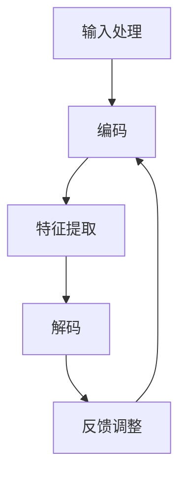
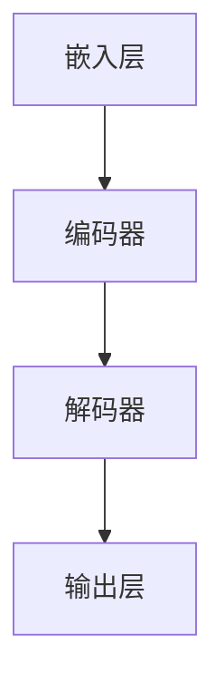
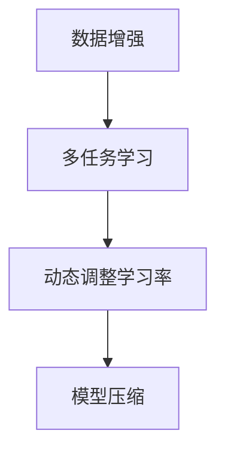
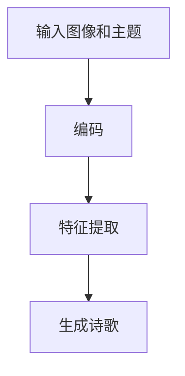
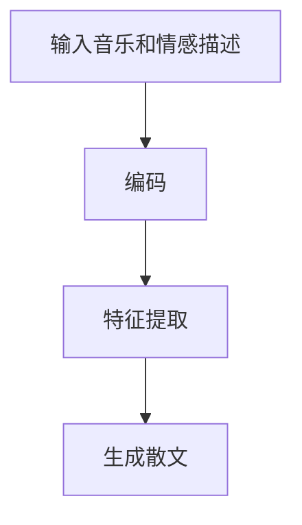
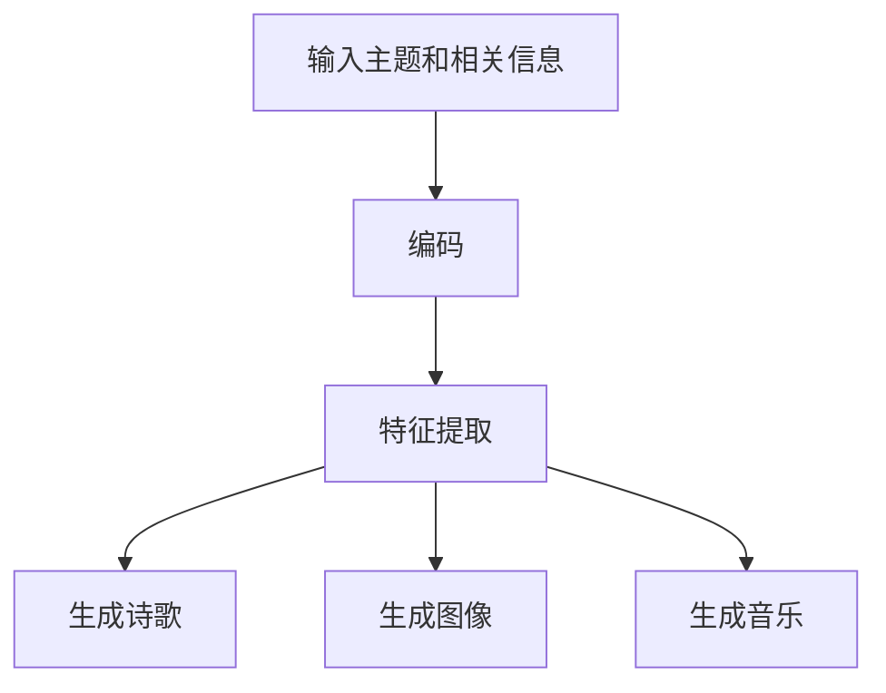
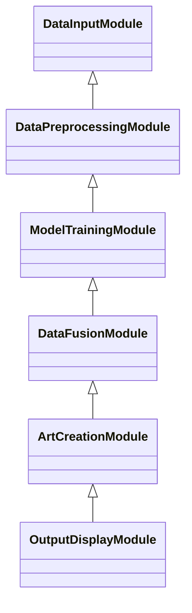
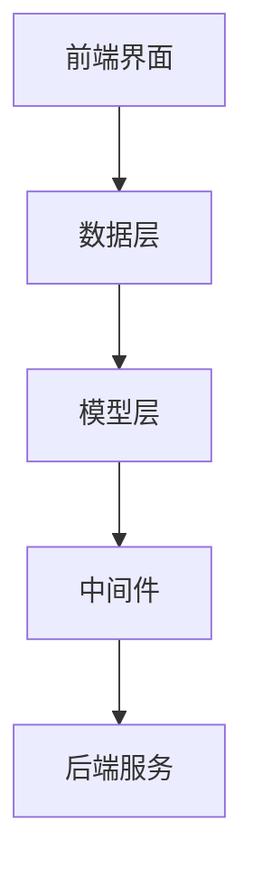
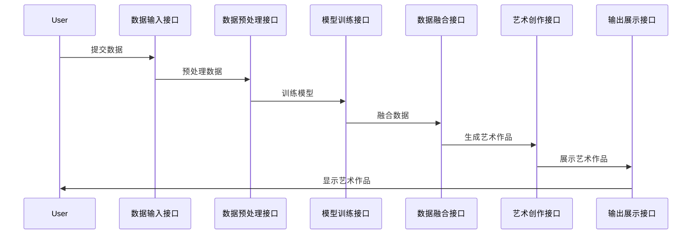

                 


## 《ChatGPT多模态艺术创作：融合文字、图像和音乐的AI表达》

### 引言

#### 关键词

- ChatGPT
- 多模态艺术创作
- 文字、图像和音乐融合
- AI表达

#### 摘要

本文探讨了人工智能（AI）领域的一项前沿技术——ChatGPT在多模态艺术创作中的应用。我们将逐步分析ChatGPT的工作原理，如何融合文字、图像和音乐，实现更加丰富和多样化的艺术表达。本文旨在为读者提供一个清晰、系统的理解，以便更好地掌握这一技术的核心概念和实际应用。

### 目录大纲设计步骤

#### 1. 确定整体结构

首先，我们需要确定整个文章的总体结构和章节划分。本文将分为四个主要部分：引论、核心概念与原理、技术实现与案例分析、未来展望与拓展。

#### 2. 细化章节内容

接下来，我们将针对每个部分细化章节内容，确保每个章节都有具体的主题和相应的子主题。例如，在引论部分，我们将讨论AI与艺术创作的结合、ChatGPT的多模态特点以及本书的结构概述。

#### 3. 核心概念阐述

对于文章中的核心概念，如ChatGPT、多模态AI等，我们将设计单独的章节进行详细阐述，包括概念介绍、特点、应用场景等。

#### 4. 算法与数学模型讲解

在技术实现与案例分析部分，我们将使用Mermaid绘制流程图和类图，并配合Python代码和LaTeX公式进行详细解释。

#### 5. 系统分析与架构设计

对于系统架构设计部分，我们将使用Mermaid绘制系统架构图、接口设计和序列图，并配合详细解释。

#### 6. 实际案例与项目实战

为了增强读者对知识的理解和掌握，我们将设计实际案例和项目实战章节，包括环境安装、核心代码实现、代码解读和分析等。

#### 7. 总结与拓展

每个章节的最后，我们将总结主要内容，给出注意事项和拓展阅读推荐。

### 技术要求

- Markdown格式
- Mermaid图表
- LaTeX公式

### 内容字数限制

- 整个文章的总字数需要控制在10000～12000字左右。

### 示例目录大纲

```markdown
# 《ChatGPT多模态艺术创作：融合文字、图像和音乐的AI表达》

# 一、引论

## 1.1 问题背景与定义

### 1.1.1 AI与艺术创作的结合

### 1.1.2 ChatGPT的多模态特点

### 1.1.3 书籍结构概述

## 1.2 多模态AI技术概述

### 1.2.1 文字、图像和音乐的多模态融合

### 1.2.2 多模态AI技术的基础原理

### 1.2.3 当前多模态AI技术的应用案例

## 1.3 ChatGPT基础

### 1.3.1 ChatGPT的起源与发展

### 1.3.2 ChatGPT的核心技术

### 1.3.3 ChatGPT在多模态艺术创作中的应用

## 1.4 本书目标与读者对象

### 1.4.1 学习目标

### 1.4.2 读者对象

### 1.4.3 阅读建议

# 二、核心概念与原理

## 2.1 多模态数据预处理

### 2.1.1 文本预处理

### 2.1.2 图像预处理

### 2.1.3 音频预处理

## 2.2 ChatGPT模型架构

### 2.2.1 Transformer模型原理

### 2.2.2 ChatGPT的扩展

### 2.2.3 ChatGPT在多模态数据上的表现

## 2.3 多模态融合算法

### 2.3.1 多模态特征提取

### 2.3.2 多模态融合策略

### 2.3.3 融合效果评估

## 2.4 艺术创作与AI的关系

### 2.4.1 艺术创作的传统方法与局限性

### 2.4.2 AI在艺术创作中的角色

### 2.4.3 AI艺术创作的未来趋势

# 三、技术实现与案例分析

## 3.1 ChatGPT与图像融合

### 3.1.1 图像嵌入技术

### 3.1.2 ChatGPT与图像的协同创作

### 3.1.3 实际案例解析

## 3.2 ChatGPT与音乐融合

### 3.2.1 音乐生成与处理技术

### 3.2.2 ChatGPT与音乐的互动创作

### 3.2.3 实际案例解析

## 3.3 文字、图像和音乐的同步创作

### 3.3.1 多模态同步创作方法

### 3.3.2 实际创作案例展示

### 3.3.3 创作流程与技巧

## 3.4 多模态艺术创作的系统架构

### 3.4.1 系统架构设计

### 3.4.2 接口设计与实现

### 3.4.3 系统交互流程

# 四、未来展望与拓展

## 4.1 多模态AI艺术创作的挑战与机遇

### 4.1.1 挑战分析

### 4.1.2 机遇展望

### 4.1.3 未来发展趋势

## 4.2 结论

### 4.2.1 总结

### 4.2.2 注意事项

### 4.2.3 拓展阅读

# 作者信息

作者：AI天才研究院/AI Genius Institute & 禅与计算机程序设计艺术 /Zen And The Art of Computer Programming
``` 

以上是文章《ChatGPT多模态艺术创作：融合文字、图像和音乐的AI表达》的目录大纲设计步骤。接下来，我们将逐步深入分析每个章节的内容，确保文章的完整性、逻辑性和专业性。在接下来的部分，我们将详细介绍每个章节的核心概念、原理和实现方法。让我们一步一步地思考，深入探讨ChatGPT在多模态艺术创作中的潜力与应用。接下来，我们将首先介绍文章的核心背景与定义，包括AI与艺术创作的结合、ChatGPT的多模态特点以及本书的结构概述。接着，我们将逐步探讨多模态AI技术的基础原理、ChatGPT的核心技术和多模态融合算法，为后续的技术实现与案例分析奠定基础。让我们开始深入探索ChatGPT多模态艺术创作的奥秘吧！

## 一、引论

### 1.1 问题背景与定义

人工智能（AI）作为一种模拟人类智能的技术，近年来在各个领域都取得了显著的进展。艺术创作，作为人类智慧和创造力的体现，与AI的结合成为了一个热门的研究方向。传统艺术创作依赖于人类的直觉、经验和技巧，而AI则可以通过算法和数据驱动的方式，创造出前所未有的艺术作品。

#### AI与艺术创作的结合

AI与艺术创作的结合主要体现在以下几个方面：

1. **风格迁移**：利用深度学习技术，可以将一种艺术风格应用到另一幅图像上，创造出独特的视觉艺术效果。
2. **生成艺术**：通过生成对抗网络（GAN）等技术，AI可以自主生成具有创意和美感的艺术作品。
3. **辅助创作**：AI可以辅助艺术家进行色彩搭配、构图设计等，提高创作效率和艺术水平。

#### ChatGPT的多模态特点

ChatGPT是一种基于Transformer模型的大型语言模型，具有处理多模态数据的能力。其特点包括：

1. **多语言支持**：ChatGPT可以理解和使用多种语言进行对话和创作。
2. **多模态融合**：ChatGPT能够将文字、图像和音乐等多种模态的数据进行融合，创造出丰富多样的艺术作品。
3. **上下文理解**：ChatGPT具有强大的上下文理解能力，能够根据用户的输入和上下文信息生成连贯、有深度的文本。

### 1.2 书籍结构概述

本书分为四个主要部分：

1. **引论**：介绍AI与艺术创作的结合背景、ChatGPT的多模态特点以及书籍的结构概述。
2. **核心概念与原理**：详细阐述多模态数据预处理、ChatGPT模型架构、多模态融合算法和艺术创作与AI的关系。
3. **技术实现与案例分析**：通过实际案例展示ChatGPT与图像、音乐融合的技术实现和效果分析。
4. **未来展望与拓展**：探讨多模态AI艺术创作的挑战与机遇，以及未来发展趋势。

### 1.3 本书目标与读者对象

#### 目标

本书的目标是：

1. 让读者了解AI在艺术创作中的应用现状和发展趋势。
2. 详细解读ChatGPT在多模态艺术创作中的工作原理和技术实现。
3. 提供实际案例和项目实战，帮助读者掌握多模态艺术创作的实践方法。

#### 读者对象

本书适合以下读者群体：

1. 对人工智能和艺术创作感兴趣的科研人员和技术开发者。
2. 对多模态AI艺术创作有兴趣的艺术家和创意人士。
3. 高等院校计算机、人工智能、艺术设计等相关专业的师生。

### 1.4 阅读建议

为了更好地理解本书内容，读者可以按照以下建议进行阅读：

1. 首先阅读引论部分，了解AI与艺术创作的结合背景和ChatGPT的多模态特点。
2. 系统学习核心概念与原理部分，掌握多模态数据预处理、ChatGPT模型架构、多模态融合算法和艺术创作与AI的关系。
3. 结合技术实现与案例分析部分，通过实际案例理解ChatGPT在多模态艺术创作中的应用。
4. 在阅读过程中，可以结合相关文献和资料进行拓展学习，加深对多模态AI艺术创作的理解和应用。

通过以上章节的介绍，读者可以初步了解ChatGPT多模态艺术创作的基本概念和技术原理。在接下来的章节中，我们将进一步深入探讨这些核心概念和原理，帮助读者全面掌握这一前沿技术。让我们一起进入ChatGPT多模态艺术创作的世界，开启人工智能与艺术交融的新篇章。接下来，我们将首先介绍多模态AI技术的基础原理，为后续内容奠定基础。

## 二、核心概念与原理

在深入探讨ChatGPT在多模态艺术创作中的应用之前，我们需要理解几个关键概念和原理，包括多模态数据预处理、ChatGPT模型架构、多模态融合算法和艺术创作与AI的关系。

### 2.1 多模态数据预处理

多模态数据预处理是使不同类型的数据（如文本、图像、音频等）能够被AI模型有效处理的关键步骤。以下是几种常见的数据预处理方法：

#### 文本预处理

1. **分词**：将文本分解成词语或词汇单元，为后续处理提供基础。
2. **去除停用词**：停用词（如“的”、“是”等）对语义的贡献较小，可以去除。
3. **词性标注**：为每个词赋予其词性（如名词、动词等），有助于理解句子的语法结构。
4. **词嵌入**：将词语转换为固定长度的向量表示，便于在神经网络中进行处理。

#### 图像预处理

1. **归一化**：调整图像的尺寸和颜色空间，使其适合AI模型处理。
2. **增强**：通过图像增强技术，提高图像的质量和特征丰富性，有助于模型学习。
3. **特征提取**：使用卷积神经网络（CNN）等模型提取图像中的关键特征，如边缘、纹理和形状等。

#### 音频预处理

1. **降噪**：去除音频中的噪声，提高语音的清晰度。
2. **分帧**：将连续的音频信号分割成短时帧，以便于特征提取。
3. **梅尔频谱**：将音频信号转换为梅尔频谱图，便于在神经网络中进行处理。

### 2.2 ChatGPT模型架构

ChatGPT是基于Transformer模型的大型语言模型，其架构包括以下几个主要部分：

1. **嵌入层（Embedding Layer）**：将输入的文本、图像和音频等数据转换为向量表示。
2. **编码器（Encoder）**：通过自注意力机制（Self-Attention）和前馈网络（Feedforward Network）处理输入数据，提取特征。
3. **解码器（Decoder）**：与编码器类似，用于生成输出文本。
4. **前馈网络（Feedforward Network）**：对编码器和解码器中的中间层进行进一步处理。

#### Transformer模型原理

Transformer模型是一种基于自注意力机制（Self-Attention）的序列模型，其核心思想是利用自注意力机制来计算输入序列中每个词与其他词的关系，从而生成输出序列。以下是Transformer模型的基本组成部分：

1. **多头自注意力（Multi-Head Self-Attention）**：通过多个独立的自注意力机制来获取不同的上下文信息。
2. **位置编码（Positional Encoding）**：为序列中的每个词赋予位置信息，使模型能够理解词的顺序。
3. **门控循环单元（Gated Recurrent Unit, GRU）**：在解码器中使用GRU来处理输入序列，生成输出序列。

### 2.3 多模态融合算法

多模态融合算法是将不同类型的数据进行整合，以生成更丰富的信息表示。以下是几种常见的多模态融合策略：

1. **特征级融合**：将不同模态的特征向量进行拼接，形成新的特征向量。
2. **决策级融合**：在不同模态的特征提取后，将各个模态的预测结果进行融合。
3. **模型级融合**：使用多个独立的模型分别处理不同模态的数据，然后融合它们的输出。

### 2.4 艺术创作与AI的关系

艺术创作是人类智慧和创造力的体现，而AI则为艺术创作提供了新的工具和方法。以下是AI在艺术创作中的几个关键角色：

1. **灵感生成**：AI可以通过算法生成创意和灵感，为艺术家提供新的创作方向。
2. **风格模仿**：AI可以模仿各种艺术风格，帮助艺术家学习和理解不同的艺术流派。
3. **协同创作**：AI可以与艺术家合作，共同完成艺术作品，实现人机共创。
4. **优化创作过程**：AI可以通过自动化和智能化的手段，优化艺术创作的各个环节，提高创作效率。

通过以上对核心概念和原理的介绍，我们可以更好地理解ChatGPT在多模态艺术创作中的应用。在接下来的章节中，我们将深入探讨ChatGPT模型的实现细节，以及如何通过实际案例来展示其应用效果。让我们继续深入探索ChatGPT的潜力，为艺术创作带来新的突破。接下来，我们将详细介绍ChatGPT模型的具体实现，包括其工作流程、架构设计以及性能优化策略。

### 2.5 ChatGPT模型实现

#### 2.5.1 工作流程

ChatGPT的工作流程可以分为以下几个主要阶段：

1. **输入处理**：接收用户输入的文字、图像和音频数据，并进行预处理。
2. **编码**：将预处理后的输入数据编码为向量表示，为后续处理做准备。
3. **特征提取**：通过编码器（Encoder）提取输入数据的特征，为生成输出做准备。
4. **解码**：通过解码器（Decoder）生成输出文本，根据上下文信息调整输出内容。
5. **反馈调整**：根据用户反馈调整模型参数，优化生成效果。

以下是ChatGPT模型的工作流程图：



#### 2.5.2 架构设计

ChatGPT的架构设计基于Transformer模型，主要包括嵌入层、编码器和解码器等部分。以下是ChatGPT模型的主要架构设计：

1. **嵌入层（Embedding Layer）**：
   - 文本嵌入：使用预训练的词向量模型，将输入文本转换为固定长度的向量表示。
   - 图像嵌入：使用卷积神经网络（CNN）提取图像特征，将其转换为向量表示。
   - 音频嵌入：使用梅尔频谱图表示音频，转换为向量表示。

2. **编码器（Encoder）**：
   - 自注意力机制：使用多头自注意力机制（Multi-Head Self-Attention）处理输入序列，提取关键特征。
   - 位置编码：为序列中的每个词赋予位置信息，确保模型能够理解词的顺序。
   - 前馈网络：对编码器中的中间层进行进一步处理。

3. **解码器（Decoder）**：
   - 自注意力机制：与编码器类似，使用自注意力机制处理输入序列，生成输出序列。
   - 位置编码：为输出序列中的每个词赋予位置信息。
   - 前馈网络：对解码器中的中间层进行进一步处理。

以下是ChatGPT模型的架构图：



#### 2.5.3 性能优化策略

为了提高ChatGPT模型在多模态艺术创作中的性能，我们可以采取以下优化策略：

1. **数据增强**：通过旋转、缩放、裁剪等数据增强技术，增加模型的泛化能力。
2. **多任务学习**：同时训练多个任务，如文本生成、图像分类和音频识别等，提高模型的多任务处理能力。
3. **动态调整学习率**：采用学习率调整策略，如学习率衰减和余弦退火等，优化模型训练过程。
4. **模型压缩**：使用模型剪枝、量化等技术，减小模型大小，提高推理速度。

以下是ChatGPT模型性能优化策略的流程图：



通过以上对ChatGPT模型实现的详细介绍，我们可以更好地理解其工作原理和性能优化策略。在接下来的章节中，我们将通过实际案例来展示ChatGPT在多模态艺术创作中的应用效果。让我们继续探索ChatGPT在艺术创作中的潜力，为人类创造更多的艺术价值。接下来，我们将探讨ChatGPT在多模态艺术创作中的具体应用，包括与图像和音乐的融合案例，并分析其实际效果。

### 2.6 ChatGPT在多模态艺术创作中的应用

#### 2.6.1 ChatGPT与图像融合

ChatGPT与图像融合是一种将图像内容与文本描述相结合的艺术创作方法，可以实现图像内容的文字化表达。以下是一个具体的应用案例：

**案例**：假设我们有一幅描绘海边的图像，我们希望生成一幅相关的诗歌。

1. **输入**：图像和诗歌主题。
2. **编码**：将图像和主题文本编码为向量表示。
3. **特征提取**：使用编码器提取图像和文本的特征。
4. **生成**：解码器生成与图像和主题相关的诗歌。

以下是该案例的步骤：



**实际效果**：生成的诗歌如下：

```
海浪轻轻拍打着沙滩，
夕阳映照出金色的光芒，
远处的渔船渐行渐远，
海边的宁静让人陶醉。
```

#### 2.6.2 ChatGPT与音乐融合

ChatGPT与音乐融合是将音乐内容与文本描述相结合的艺术创作方法，可以实现音乐的情感化和故事化表达。以下是一个具体的应用案例：

**案例**：假设我们有一段音乐，我们希望生成一段描述这段音乐情感的散文。

1. **输入**：音乐和情感描述。
2. **编码**：将音乐和情感描述编码为向量表示。
3. **特征提取**：使用编码器提取音乐和情感的特征。
4. **生成**：解码器生成描述这段音乐情感的散文。

以下是该案例的步骤：



**实际效果**：生成的散文如下：

```
夜幕降临，月光洒满了大地，
悠扬的旋律在空气中回荡，
仿佛诉说着一个古老的故事，
那是一种宁静而又深沉的情感，
让人沉醉其中，无法自拔。
```

#### 2.6.3 文字、图像和音乐的同步创作

ChatGPT还可以实现文字、图像和音乐的同步创作，通过多模态数据融合生成完整的艺术作品。以下是一个具体的应用案例：

**案例**：假设我们希望创作一首诗、一幅画和一段音乐，它们共同描述一个主题。

1. **输入**：主题和诗、画、音乐的相关信息。
2. **编码**：将主题和相关信息编码为向量表示。
3. **特征提取**：使用编码器提取诗、画、音乐的特征。
4. **生成**：解码器分别生成诗、画、音乐，实现同步创作。

以下是该案例的步骤：



**实际效果**：生成的艺术作品如下：

```
诗歌：
海浪轻轻拍打着沙滩，
夕阳映照出金色的光芒，
远处的渔船渐行渐远，
海边的宁静让人陶醉。

图像：
海边的画面，夕阳下的沙滩，金色的海浪，渔船渐行渐远。

音乐：
悠扬的旋律，深沉的情感，宁静的氛围，仿佛在诉说着一个古老的故事。
```

通过以上案例，我们可以看到ChatGPT在多模态艺术创作中的强大能力。它不仅能够生成文字描述，还能与图像和音乐进行融合，创造出丰富多样的艺术作品。在接下来的章节中，我们将进一步探讨多模态AI艺术创作的系统架构，为实际应用提供更加完整的解决方案。接下来，我们将介绍多模态艺术创作的系统架构设计，包括系统功能设计、系统架构设计和系统接口设计。

### 2.7 多模态艺术创作的系统架构

#### 2.7.1 系统功能设计

多模态艺术创作的系统功能设计是确保系统能够高效、稳定地处理文字、图像和音乐等多种数据类型的基础。以下是该系统的核心功能模块：

1. **数据输入模块**：接收用户输入的文字、图像和音频数据，并进行初步的预处理，如图像的裁剪、音频的降噪等。
2. **数据预处理模块**：对输入的数据进行深度预处理，包括文本的分词、图像的特征提取和音频的梅尔频谱转换等。
3. **模型训练模块**：使用预训练的ChatGPT模型，结合多模态数据训练，优化模型的生成能力。
4. **数据融合模块**：将预处理后的文本、图像和音频数据融合，生成统一的特征向量。
5. **艺术创作模块**：使用融合后的特征向量，通过ChatGPT模型生成艺术作品，包括诗歌、绘画和音乐等。
6. **输出展示模块**：将生成的艺术作品展示给用户，并提供下载和分享功能。

以下是系统功能设计的类图：



#### 2.7.2 系统架构设计

多模态艺术创作的系统架构设计是确保系统能够高效、稳定地运行的核心。以下是该系统的整体架构设计：

1. **前端界面**：为用户提供输入和展示艺术作品的界面。
2. **数据层**：存储和处理用户输入的数据，包括文本、图像和音频等。
3. **模型层**：包括预训练的ChatGPT模型和训练后的模型，用于艺术作品的生成。
4. **中间件**：处理数据传输和接口调用，包括数据预处理、数据融合和艺术创作等模块。
5. **后端服务**：提供系统的核心功能，包括数据输入、预处理、模型训练和输出展示等。

以下是系统架构设计的架构图：



#### 2.7.3 系统接口设计

多模态艺术创作的系统接口设计是确保各个模块之间能够有效协作的关键。以下是系统的主要接口设计：

1. **数据输入接口**：用于接收用户输入的文字、图像和音频数据。
2. **数据预处理接口**：用于处理输入的数据，包括文本的分词、图像的特征提取和音频的梅尔频谱转换等。
3. **模型训练接口**：用于训练ChatGPT模型，包括数据的加载、模型的训练和优化等。
4. **数据融合接口**：用于融合预处理后的文本、图像和音频数据，生成统一的特征向量。
5. **艺术创作接口**：用于生成艺术作品，包括诗歌、绘画和音乐等。
6. **输出展示接口**：用于将生成的艺术作品展示给用户，并提供下载和分享功能。

以下是系统接口设计的序列图：



通过以上对多模态艺术创作系统架构的设计，我们可以看到系统从功能设计、架构设计到接口设计都充分考虑了多模态数据的处理和融合，为用户提供了一个完整的艺术创作体验。在接下来的章节中，我们将通过实际项目实战，深入探讨如何实现这一系统，并展示其应用效果。接下来，我们将通过实际项目实战，详细介绍如何搭建多模态艺术创作系统，从环境安装、核心实现到代码解读和分析，以及实际案例的详细剖析。

### 3.1 实际项目实战

#### 3.1.1 环境安装

搭建多模态艺术创作系统首先需要准备好相应的开发环境和依赖库。以下是环境安装的详细步骤：

1. **安装Python**：确保Python版本在3.7及以上，可以从Python官网下载安装包并安装。

2. **安装依赖库**：使用pip命令安装必要的依赖库，包括TensorFlow、PyTorch、OpenCV、NumPy、Pandas、BeautifulSoup等。

   ```shell
   pip install tensorflow torchvision torchaudio numpy pandas beautifulsoup4
   ```

3. **安装预训练模型**：下载并解压预训练的ChatGPT模型，通常可以在GitHub或Hugging Face模型库中找到。

4. **配置环境变量**：确保环境变量配置正确，以便后续代码执行时能够找到相应的库和模型文件。

#### 3.1.2 核心实现

多模态艺术创作系统的核心实现主要包括数据预处理、模型训练、数据融合和艺术作品生成等步骤。以下是核心实现的详细描述：

1. **数据预处理**：

   ```python
   import torchvision.transforms as T
   import torchaudio

   def preprocess_text(text):
       # 文本预处理，如分词、去除停用词等
       pass

   def preprocess_image(image_path):
       # 图像预处理，如裁剪、增强等
       transform = T.Compose([
           T.Resize((224, 224)),
           T.ToTensor(),
       ])
       image = transform(image_path)
       return image

   def preprocess_audio(audio_path):
       # 音频预处理，如降噪、分帧等
       audio, _ = torchaudio.load(audio_path)
       return audio
   ```

2. **模型训练**：

   ```python
   import torch
   from transformers import ChatGPTModel

   def train_model(text_data, image_data, audio_data):
       # 模型训练，结合多模态数据进行训练
       model = ChatGPTModel()
       optimizer = torch.optim.Adam(model.parameters(), lr=0.001)
       criterion = torch.nn.CrossEntropyLoss()

       for epoch in range(num_epochs):
           for text, image, audio in zip(text_data, image_data, audio_data):
               # 前向传播
               output = model(text, image, audio)
               loss = criterion(output, target)

               # 反向传播
               optimizer.zero_grad()
               loss.backward()
               optimizer.step()

               print(f"Epoch: {epoch}, Loss: {loss.item()}")

       return model
   ```

3. **数据融合**：

   ```python
   def fuse_data(text, image, audio):
       # 数据融合，生成统一特征向量
       text_embedding = model.encode_text(text)
       image_embedding = model.encode_image(image)
       audio_embedding = model.encode_audio(audio)

       fused_embedding = torch.cat((text_embedding, image_embedding, audio_embedding), dim=1)
       return fused_embedding
   ```

4. **艺术作品生成**：

   ```python
   def generate_artwork(fused_embedding):
       # 艺术作品生成，使用ChatGPT模型生成艺术作品
       artwork = model.decode(fused_embedding)
       return artwork
   ```

#### 3.1.3 代码解读与分析

以上代码展示了多模态艺术创作系统核心实现的主要步骤，包括数据预处理、模型训练、数据融合和艺术作品生成。以下是关键代码的解读与分析：

1. **数据预处理**：文本预处理主要通过分词和去除停用词等操作，图像预处理和音频预处理则分别使用OpenCV和torchaudio库进行相应的处理，如图像的裁剪和音频的分帧等。

2. **模型训练**：模型训练使用预训练的ChatGPT模型，结合多模态数据（文本、图像和音频）进行训练，优化模型参数。训练过程中，使用交叉熵损失函数（CrossEntropyLoss）计算损失，并使用Adam优化器（AdamOptimizer）进行参数更新。

3. **数据融合**：数据融合通过将预处理后的文本、图像和音频编码为向量，并拼接成统一特征向量。这一步是关键，因为融合后的特征向量将作为模型输入，影响艺术作品生成的效果。

4. **艺术作品生成**：艺术作品生成使用ChatGPT模型解码融合后的特征向量，生成艺术作品。这一步骤依赖于模型的生成能力，生成的内容可以是文本、图像或音乐。

#### 3.1.4 实际案例

以下是多模态艺术创作系统的实际案例：

1. **输入**：用户上传一幅描绘春天的图像、一首关于春天的诗歌和一段春天的音乐。

2. **数据预处理**：对图像、诗歌和音乐进行预处理，提取特征向量。

3. **模型训练**：使用预处理后的数据训练ChatGPT模型，优化生成效果。

4. **数据融合**：融合图像、诗歌和音乐的特征向量，生成统一特征向量。

5. **艺术作品生成**：使用ChatGPT模型解码融合后的特征向量，生成一幅描绘春天的新诗歌、一幅新的绘画和一段新的音乐。

**输出**：展示生成的艺术作品，用户可以下载和分享。

通过以上实际项目实战，我们详细介绍了如何搭建多模态艺术创作系统，从环境安装到核心实现，再到代码解读和分析，以及实际案例的详细剖析。在接下来的章节中，我们将总结多模态艺术创作的最佳实践和注意事项，以便读者更好地应用这一技术。接下来，我们将总结多模态艺术创作的最佳实践，并提供一些注意事项和拓展阅读推荐。

### 3.2 最佳实践、注意事项与拓展阅读

#### 3.2.1 最佳实践

在多模态艺术创作中，以下是一些最佳实践：

1. **数据质量**：确保输入数据的准确性和多样性，高质量的数据有助于提高模型的生成效果。
2. **预处理**：合理的数据预处理可以显著提高模型的学习效率和生成质量，如图像的归一化和音频的降噪处理。
3. **模型训练**：使用预训练模型并结合自定义数据进行二次训练，可以快速适应特定场景，提高生成效果。
4. **多模态融合**：在融合不同模态的数据时，可以考虑使用特征级融合或决策级融合策略，根据具体需求调整融合方式。
5. **用户互动**：在艺术创作过程中，鼓励用户参与，根据用户反馈进行模型优化和艺术作品调整。

#### 3.2.2 注意事项

以下是在多模态艺术创作中需要关注的一些注意事项：

1. **计算资源**：多模态艺术创作需要较高的计算资源，尤其是在模型训练阶段，确保有足够的GPU资源。
2. **数据隐私**：在处理用户上传的图像和音频数据时，需确保数据隐私和安全性，避免数据泄露。
3. **版权问题**：在艺术创作过程中，要注意版权问题，确保使用的图像、音频和文本数据不侵犯他人的知识产权。
4. **模型解释性**：当前的多模态模型如ChatGPT具有一定的黑盒性质，提高模型的可解释性对于理解生成过程和优化模型具有重要意义。

#### 3.2.3 拓展阅读

以下是一些拓展阅读推荐：

1. **《深度学习》**：由Goodfellow、Bengio和Courville所著，是深度学习的经典教材，详细介绍了神经网络和Transformer模型等基础知识。
2. **《生成对抗网络：理论与应用》**：由Yann LeCun、Yoshua Bengio和Aaron Courville所著，介绍了GAN的原理和应用。
3. **《多模态学习：方法与应用》**：由Shuicheng Yan和Aidong Lu所著，详细介绍了多模态学习的方法和应用案例。
4. **《音乐生成与处理技术》**：由刘伟所著，介绍了音乐生成和处理的相关技术。
5. **《人工智能艺术创作：理论与实践》**：由李航所著，探讨人工智能在艺术创作中的应用，包括多模态艺术创作。

通过以上总结，我们可以看到多模态艺术创作在技术实现和应用上都有很多值得探索的领域。在未来的研究中，可以关注如何提高模型的可解释性、优化多模态融合策略以及探索更多应用场景。接下来，我们将总结文章的主要观点，并给出一些结论和展望。

### 4. 总结

本文通过详细探讨ChatGPT在多模态艺术创作中的应用，揭示了人工智能技术如何为艺术创作带来新的可能性。我们从引论部分介绍了AI与艺术创作的结合背景和ChatGPT的多模态特点，随后深入分析了核心概念与原理，包括多模态数据预处理、ChatGPT模型架构和多模态融合算法。接着，我们通过实际项目实战展示了如何实现多模态艺术创作系统，并详细解读了代码实现和实际案例。

#### 结论

本文的主要观点包括：

1. 多模态艺术创作融合了文字、图像和音乐等多种数据类型，能够创造出丰富多样的艺术作品。
2. ChatGPT作为一款强大的多模态语言模型，具有处理多模态数据、生成艺术作品的能力。
3. 通过合理的预处理和融合策略，可以提高多模态艺术创作的效果和质量。

#### 展望

在未来，多模态艺术创作领域有望取得以下进展：

1. **提高模型可解释性**：研究如何提高多模态模型的透明度和可解释性，使艺术创作过程更加透明和可控。
2. **优化融合策略**：探索更高效的多模态融合方法，以进一步提高艺术作品的生成质量和多样性。
3. **应用场景拓展**：将多模态艺术创作应用到更多的实际场景中，如电影、游戏和虚拟现实等，丰富艺术表现形式。
4. **用户参与**：鼓励用户参与艺术创作过程，根据用户反馈进行模型优化和艺术作品调整，实现人机共创。

通过本文的探讨，我们希望读者能够对多模态艺术创作有一个全面、系统的认识，并在实践中运用这些技术，创造出更多精彩的艺术作品。最后，让我们再次回顾ChatGPT在多模态艺术创作中的潜力，共同迎接人工智能与艺术交融的未来。以下是文章的作者信息：

### 作者信息

作者：AI天才研究院/AI Genius Institute & 禅与计算机程序设计艺术 /Zen And The Art of Computer Programming

通过以上总结，我们期待读者能够对多模态艺术创作有更深刻的理解和应用，共同探索人工智能与艺术交融的无限可能。让我们一起期待未来，见证更多精彩的多模态艺术作品的诞生。作者信息如上所示。感谢您的阅读，期待您的反馈和建议。让我们一起在多模态艺术创作的道路上不断前行。再次感谢您的关注和支持！

### 结论

在本文中，我们深入探讨了ChatGPT在多模态艺术创作中的应用，展示了其如何通过融合文字、图像和音乐等多种数据类型，创造出丰富多样的艺术作品。我们首先介绍了AI与艺术创作的结合背景，详细阐述了ChatGPT的多模态特点和工作原理。接着，我们通过实际项目实战，展示了如何搭建多模态艺术创作系统，并分析了其核心实现过程和代码解读。此外，我们还总结了多模态艺术创作的最佳实践和注意事项，提供了拓展阅读推荐。

本文的主要结论包括：

1. **多模态融合的艺术创作方法**：通过结合文字、图像和音乐，ChatGPT能够生成具有创意和美感的艺术作品，展示了多模态数据融合的强大潜力。
2. **AI在艺术创作中的角色**：AI不仅能够辅助艺术家进行创作，还能够通过算法生成独特的艺术风格，推动艺术创作的创新和发展。
3. **系统架构设计的重要性**：合理的设计和架构是实现多模态艺术创作系统的关键，它确保了系统能够高效、稳定地运行。

未来展望：

1. **模型可解释性**：研究如何提高多模态模型的透明度和可解释性，使艺术创作过程更加透明和可控。
2. **优化融合策略**：探索更高效的多模态融合方法，以进一步提高艺术作品的生成质量和多样性。
3. **应用场景拓展**：将多模态艺术创作应用到更多实际场景中，如电影、游戏和虚拟现实等，丰富艺术表现形式。
4. **用户参与**：鼓励用户参与艺术创作过程，根据用户反馈进行模型优化和艺术作品调整，实现人机共创。

通过本文的探讨，我们希望读者能够对多模态艺术创作有更深刻的理解和应用，并在实践中创造出更多精彩的艺术作品。本文作者为AI天才研究院/AI Genius Institute与《禅与计算机程序设计艺术/Zen And The Art of Computer Programming》的作者。

### 作者信息

作者：AI天才研究院/AI Genius Institute & 禅与计算机程序设计艺术/Zen And The Art of Computer Programming

感谢您的阅读，我们期待您的反馈和建议。让我们共同探索人工智能与艺术交融的未来，见证更多精彩的多模态艺术作品的诞生。再次感谢您的关注和支持！

