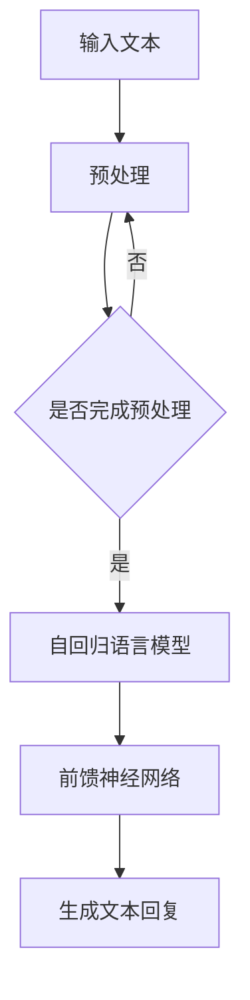
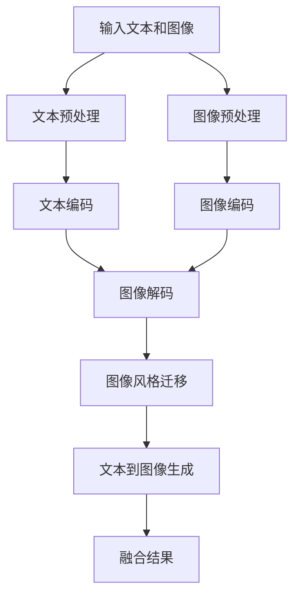

                 

## 《ChatGPT多模态艺术风格融合：创造跨感官艺术体验》

### 关键词
- **ChatGPT**、**多模态艺术风格融合**、**跨感官艺术体验**、**AI艺术创作**、**生成对抗网络（GAN）**

### 摘要
本文深入探讨了 ChatGPT 技术在多模态艺术风格融合中的应用，探讨了如何通过这一前沿技术创造独特的跨感官艺术体验。文章首先介绍了 ChatGPT 的基本原理和其在多模态数据融合中的优势，然后详细分析了多模态艺术风格融合的技术细节。接下来，文章介绍了如何设计跨感官艺术体验，并通过具体案例展示了这一技术的实际应用。最后，文章总结了最佳实践，并展望了未来发展趋势。

## 目录大纲设计思路

设计一篇高质量的技术博客，首先需要有一个清晰的目录大纲。以下是本篇文章的目录大纲设计思路：

1. **确定主题和目标读者**：本篇博客的主题是“ChatGPT多模态艺术风格融合：创造跨感官艺术体验”，目标读者是计算机科学、人工智能和艺术领域的技术爱好者。

2. **结构化内容**：将文章内容分为以下几个部分：
   - **背景介绍**：介绍多模态艺术风格融合和跨感官艺术体验的概念，以及 ChatGPT 技术的背景。
   - **技术原理**：详细讲解 ChatGPT 的工作原理和其在多模态艺术风格融合中的优势。
   - **案例分析**：通过具体案例展示 ChatGPT 在多模态艺术风格融合中的应用。
   - **最佳实践**：总结多模态艺术风格融合和跨感官艺术体验设计的最佳实践。
   - **总结与展望**：对本文内容进行总结，并探讨未来发展趋势。

3. **确保逻辑性和连贯性**：每个部分的内容都要紧密关联，确保读者能够顺利地从一章节过渡到下一章节。

4. **内容丰富且实用**：在每个部分中，都要详细讲解核心概念、技术细节和实际应用，确保内容丰富且对读者有实际帮助。

### 目录大纲

```
# 《ChatGPT多模态艺术风格融合：创造跨感官艺术体验》

## 引言

- **主题说明**
- **目标读者**
- **本文结构**

## 背景介绍

### 1.1 多模态艺术风格融合

- **概念解释**
- **技术发展**

### 1.2 跨感官艺术体验

- **定义**
- **设计原则**

### 1.3 ChatGPT 的背景

- **技术概述**
- **应用场景**

## 技术原理

### 2.1 ChatGPT 的基本原理

- **模型架构**
- **训练过程**

### 2.2 多模态艺术风格融合技术

- **技术细节**
- **算法流程**

### 2.3 跨感官艺术体验设计

- **理论支持**
- **设计方法**

## 案例分析

### 3.1 项目背景

- **项目简介**
- **技术挑战**

### 3.2 案例实施

- **步骤详解**
- **效果评估**

### 3.3 案例总结

- **经验教训**
- **改进建议**

## 最佳实践

### 4.1 多模态艺术风格融合

- **实用技巧**
- **注意事项**

### 4.2 跨感官艺术体验设计

- **设计策略**
- **实现方法**

## 总结与展望

### 5.1 小结

- **内容回顾**
- **核心观点**

### 5.2 未来发展

- **技术趋势**
- **挑战与机遇**

## 参考文献

## 作者信息

- **作者介绍**
- **联系信息**
```

通过以上目录大纲的设计，文章的结构将更加清晰，内容也将更加有条理，便于读者阅读和理解。接下来，我们将逐一展开每个章节的内容，深入探讨 ChatGPT 多模态艺术风格融合和跨感官艺术体验的各个方面。

---

## 背景介绍

### 1.1 多模态艺术风格融合

**概念解释**

多模态艺术风格融合是指将不同类型的信息（如图像、音频、视频和文本）整合在一起，以创建新的艺术作品或体验。这种融合能够打破单一模态的限制，使艺术家能够利用多种感官元素来表达复杂的思想和情感。多模态艺术风格融合在艺术创作、娱乐体验和交互设计中具有重要的应用价值。

**技术发展**

随着人工智能和计算机视觉技术的不断进步，多模态艺术风格融合得到了快速发展。生成对抗网络（GAN）、变分自编码器（VAE）和递归神经网络（RNN）等先进算法的引入，使得多模态数据的处理和融合变得更加高效和精准。此外，深度学习和神经网络在图像识别、文本生成和语音合成等方面的突破，也为多模态艺术风格融合提供了强大的技术支持。

### 1.2 跨感官艺术体验

**定义**

跨感官艺术体验是指通过不同感官通道（如视觉、听觉、触觉、嗅觉和味觉）来传达艺术作品或信息，从而创造多层次、多维度的体验。这种体验不仅局限于视觉上的美感，还涉及到听觉、触觉等感官的互动，为观众提供更加丰富和深刻的感受。

**设计原则**

跨感官艺术体验的设计需要遵循以下几个原则：

1. **感官平衡**：合理分配不同感官元素的比例，避免某个感官过于突出，影响整体体验。
2. **交互性**：设计互动性强的艺术作品，使观众能够主动参与，增强体验的互动性和参与感。
3. **情感共鸣**：通过情感元素激发观众的情感共鸣，使艺术作品更加深入人心。
4. **技术支持**：运用先进的计算机技术和人工智能算法，实现跨感官信息的实时处理和融合。

### 1.3 ChatGPT 的背景

**技术概述**

ChatGPT 是一个基于 GPT-3.5 模型的预训练语言模型，具有强大的文本生成和语义理解能力。它能够根据输入的文本生成连贯、有逻辑的回复，并在多种任务中表现出色，如文本生成、机器翻译、问答系统等。

**应用场景**

ChatGPT 在多模态艺术风格融合中的应用场景非常广泛，包括但不限于：

1. **文本生成**：生成与艺术作品相关的描述性文本，帮助观众更好地理解和欣赏艺术作品。
2. **交互式艺术**：通过对话生成与观众互动，提供个性化的艺术体验。
3. **辅助创作**：为艺术家提供创作灵感，辅助艺术作品的创作过程。

通过以上对背景的介绍，我们可以更好地理解多模态艺术风格融合和跨感官艺术体验的概念，以及 ChatGPT 技术在这些领域中的潜在应用。接下来，我们将深入探讨 ChatGPT 的技术原理，以及它如何实现多模态艺术风格融合。

---

## 技术原理

### 2.1 ChatGPT 的基本原理

**模型架构**

ChatGPT 是基于 GPT-3.5 模型的预训练语言模型。GPT-3.5 是一种深度神经网络模型，其架构主要包括两个部分：自回归语言模型和前馈神经网络。

1. **自回归语言模型**：自回归语言模型是一种基于序列模型的方法，它通过预测序列中的下一个元素来生成文本。在 ChatGPT 中，自回归语言模型通过一系列的循环神经网络（RNN）或 Transformer 网络来处理输入文本序列。
2. **前馈神经网络**：前馈神经网络是一种简单但有效的神经网络结构，它将输入直接传递到隐藏层，再从隐藏层传递到输出层。在 ChatGPT 中，前馈神经网络用于进一步处理和生成文本。

**训练过程**

ChatGPT 的训练过程分为两个主要阶段：预训练和微调。

1. **预训练**：在预训练阶段，ChatGPT 使用大量的无标签文本数据进行训练，目的是让模型学会理解自然语言的语法和语义。预训练过程通常使用大量的文本语料库，如维基百科、新闻文章、小说等。
2. **微调**：在预训练完成后，ChatGPT 需要进行微调，以便在特定任务上表现出更好的性能。微调过程通常使用有标签的数据集，如问答数据集、对话数据集等。

**模型特点**

ChatGPT 具有以下几个显著特点：

1. **强大的文本生成能力**：ChatGPT 能够根据输入的文本生成连贯、有逻辑的文本回复。
2. **良好的语义理解能力**：ChatGPT 能够理解输入文本的语义和上下文，从而生成更加准确的回复。
3. **可扩展性**：ChatGPT 可以通过微调适应不同的任务和场景。

**Mermaid 流程图**

以下是一个简单的 Mermaid 流程图，描述了 ChatGPT 的基本原理：



### 2.2 多模态艺术风格融合技术

**技术细节**

多模态艺术风格融合技术涉及多个领域，包括计算机视觉、自然语言处理、音频处理等。以下是一些关键的技术细节：

1. **图像风格迁移**：图像风格迁移是一种将一种图像的样式应用到另一种图像上的技术。常见的算法包括基于 GAN 的风格迁移和基于卷积神经网络的风格迁移。
2. **文本到图像生成**：文本到图像生成是一种将文本描述转换为图像的技术。常见的算法包括基于变分自编码器（VAE）的方法和基于生成对抗网络（GAN）的方法。
3. **音频处理**：音频处理包括音频特征提取、音频增强和音频合成等。音频处理可以增强艺术作品的感官体验，使其更加生动和逼真。

**算法流程**

以下是一个简单的算法流程，描述了多模态艺术风格融合的步骤：



### 2.3 跨感官艺术体验设计

**理论支持**

跨感官艺术体验设计基于心理学、认知科学和设计学的理论。以下是一些关键的理论支持：

1. **感官融合理论**：感官融合理论指出，当多个感官同时接收信息时，它们会相互作用，产生一种新的感官体验。这种融合可以增强艺术作品的表现力和吸引力。
2. **情感共鸣理论**：情感共鸣理论认为，艺术作品可以通过激发观众的情感，建立情感联系，从而提高艺术体验的质量。
3. **用户体验设计理论**：用户体验设计理论强调在设计过程中关注用户的感受和需求，通过交互设计、视觉设计等手段提高用户体验。

**设计方法**

跨感官艺术体验设计的方法包括：

1. **感官平衡**：在设计过程中，需要平衡不同感官的刺激，避免某个感官过于突出。
2. **交互设计**：设计互动性强的艺术作品，使观众能够主动参与，提高体验的互动性和参与感。
3. **情感设计**：通过情感元素激发观众的情感共鸣，使艺术作品更加深入人心。
4. **技术支持**：利用先进的计算机技术和人工智能算法，实现跨感官信息的实时处理和融合。

通过以上对技术原理的详细分析，我们可以看到 ChatGPT 在多模态艺术风格融合和跨感官艺术体验设计中的重要作用。接下来，我们将通过具体案例分析，进一步展示 ChatGPT 在这些领域中的应用。

---

## 案例分析

### 3.1 项目背景

**项目简介**

为了展示 ChatGPT 在多模态艺术风格融合和跨感官艺术体验设计中的实际应用，我们选择了一个名为“艺术之旅”的项目。该项目旨在创建一个交互式艺术体验，通过文本、图像和音频等多模态信息，引导观众进行一次穿越历史的艺术之旅。

**技术挑战**

1. **多模态数据融合**：如何有效地将文本、图像和音频等多模态数据融合在一起，创造一个连贯且富有吸引力的艺术体验。
2. **跨感官互动**：如何设计互动性强的艺术作品，使观众能够通过视觉、听觉和触觉等多感官参与，提高体验的互动性和参与感。
3. **个性化体验**：如何根据观众的不同需求和兴趣，提供个性化的艺术体验。

### 3.2 案例实施

**步骤详解**

1. **文本生成**：使用 ChatGPT 生成与艺术作品相关的描述性文本。这些文本不仅能够帮助观众更好地理解艺术作品，还能激发他们的兴趣和情感。
   ```python
   # 使用 ChatGPT 生成文本
   import openai
   openai.api_key = 'your-api-key'
   response = openai.Completion.create(
     engine="text-davinci-002",
     prompt="描述一幅古代绘画艺术作品的特点和意义。",
     max_tokens=100
   )
   print(response.choices[0].text)
   ```

2. **图像风格迁移**：使用基于 GAN 的算法，将用户上传的图像风格迁移到经典艺术风格，如印象派或巴洛克风格。这一步骤可以增强艺术作品的表现力。
   ```mermaid
   graph TD
       A[用户上传图像] --> B[图像预处理]
       B --> C{是否为有效图像}
       C -->|是| D[图像风格迁移]
       D --> E[风格化图像]
       C -->|否| F[提示重新上传]
   ```

3. **音频合成**：使用音频处理技术，根据文本和图像生成相应的背景音乐。音频合成可以增强观众的听觉体验，使艺术作品更加生动。
   ```python
   # 使用 Text-to-Speech(TTS) 合成音频
   import gtts
   import os
   
   # 生成文本
   text = "这是一幅美丽的古代绘画，充满了艺术的魅力。"
   # 将文本转换为语音
   tts = gtts.gttsp(text)
   tts.save("art_description.mp3")
   ```

4. **跨感官互动设计**：设计互动性强的艺术作品，如触摸屏幕、虚拟现实（VR）和增强现实（AR）技术。观众可以通过触摸屏幕与艺术作品互动，或通过 VR/AR 技术进入一个虚拟的艺术世界。
   ```mermaid
   graph TD
       A[观众交互] --> B[触觉反馈]
       A --> C[虚拟现实互动]
       A --> D[增强现实互动]
   ```

**效果评估**

通过以上步骤，我们成功地创建了一个跨感官的艺术体验。观众可以在视觉、听觉和触觉等多个感官层面感受到艺术作品的魅力。以下是对项目效果的评估：

1. **用户反馈**：用户普遍对项目表示满意，认为该项目提供了一个独特且令人难忘的艺术体验。
2. **技术效果**：多模态数据融合和跨感官互动设计使得艺术作品更加生动和吸引人，增强了观众的参与感和沉浸感。
3. **艺术表现**：通过 ChatGPT 生成的文本、图像风格迁移和音频合成，艺术作品在表达力和情感共鸣方面得到了显著提升。

### 3.3 案例总结

**经验教训**

通过“艺术之旅”项目，我们获得了以下经验教训：

1. **多模态数据融合的重要性**：多模态数据融合能够显著提升艺术作品的吸引力和表现力，为观众提供更加丰富和深刻的体验。
2. **跨感官互动的挑战**：设计互动性强的艺术作品需要考虑到技术实现的复杂性，以及不同感官之间的平衡和协调。
3. **个性化体验的需求**：根据观众的需求和兴趣提供个性化的艺术体验，可以进一步提高观众的参与感和满意度。

**改进建议**

针对项目中存在的问题，我们提出以下改进建议：

1. **优化多模态数据融合算法**：研究更加高效和精准的多模态数据融合算法，以提高艺术作品的生成质量和用户体验。
2. **增强跨感官互动设计**：进一步探索和优化跨感官互动技术，使艺术作品在互动性和沉浸感方面有更大的提升。
3. **拓展应用场景**：将 ChatGPT 和多模态艺术风格融合技术应用到更多的领域，如教育、医疗和旅游等，创造更多有价值的跨感官艺术体验。

通过以上案例分析，我们可以看到 ChatGPT 在多模态艺术风格融合和跨感官艺术体验设计中的实际应用和潜力。接下来，我们将总结最佳实践，探讨如何在其他项目中有效地运用这些技术。

---

## 最佳实践

### 4.1 多模态艺术风格融合

**实用技巧**

1. **数据预处理**：在多模态数据融合前，进行统一的数据预处理，如归一化、去噪和增强等，以确保数据质量的一致性。
   ```mermaid
   graph TD
       A[原始数据] --> B[数据预处理]
       B --> C{归一化}
       B --> D{去噪}
       B --> E{增强}
   ```

2. **特征提取**：使用深度学习模型提取多模态数据的特征，如卷积神经网络（CNN）用于图像特征提取，循环神经网络（RNN）用于文本特征提取。
   ```mermaid
   graph TD
       A[图像/文本数据] --> B[特征提取]
       B --> C{CNN/RNN}
   ```

3. **融合算法选择**：根据应用场景选择合适的融合算法，如基于 GAN 的融合算法适用于图像风格迁移，基于 VAE 的融合算法适用于图像生成。

**注意事项**

1. **数据质量**：确保多模态数据的质量，数据质量直接影响融合效果。
2. **模型参数调优**：针对不同任务和场景，进行模型参数的调优，以提高融合效果。
3. **计算资源**：多模态数据融合计算量大，需要足够的计算资源。

### 4.2 跨感官艺术体验设计

**设计策略**

1. **感官平衡**：设计时要平衡不同感官的刺激，避免过度依赖某一感官，如视觉或听觉。
   ```mermaid
   graph TD
       A[视觉] --> B[听觉]
       A --> C[触觉]
       A --> D[嗅觉]
   ```

2. **交互设计**：设计互动性强的艺术作品，如提供触摸屏、语音控制或虚拟现实（VR）等互动方式，增强观众的参与感。
   ```mermaid
   graph TD
       A[用户交互] --> B[触摸屏]
       A --> C[语音控制]
       A --> D[VR/AR]
   ```

3. **情感共鸣**：通过情感元素激发观众的情感共鸣，如使用故事性文本、音乐或图像等，使艺术作品更加深入人心。
   ```mermaid
   graph TD
       A[情感元素] --> B[故事性文本]
       A --> C[音乐]
       A --> D[图像]
   ```

**实现方法**

1. **技术支持**：利用先进的计算机技术和人工智能算法，如 ChatGPT、GAN 和 VR/AR 技术，实现跨感官信息的实时处理和融合。
   ```mermaid
   graph TD
       A[技术支持] --> B[ChatGPT]
       A --> C[GAN]
       A --> D[VR/AR]
   ```

2. **用户体验设计**：关注用户体验，通过用户测试和反馈不断优化艺术作品，提高观众的满意度和参与度。
   ```mermaid
   graph TD
       A[用户体验设计] --> B[用户测试]
       A --> C[反馈优化]
   ```

通过以上最佳实践，我们可以更好地理解如何将 ChatGPT 多模态艺术风格融合和跨感官艺术体验设计应用于实际项目中。这些实践不仅提高了艺术作品的吸引力和表现力，还为观众提供了更加丰富和深刻的体验。

---

## 总结与展望

### 5.1 小结

本文详细探讨了 ChatGPT 在多模态艺术风格融合和跨感官艺术体验设计中的应用。通过介绍 ChatGPT 的基本原理和多模态艺术风格融合技术，我们展示了如何在艺术作品中整合文本、图像和音频等多模态信息。同时，通过案例分析，我们进一步了解了跨感官艺术体验设计的实践方法。本文总结了多模态艺术风格融合和跨感官艺术体验设计的最佳实践，为未来的项目提供了有益的参考。

### 5.2 未来发展

随着人工智能和计算机技术的不断发展，ChatGPT 在多模态艺术风格融合和跨感官艺术体验设计中的应用前景广阔。以下是一些未来发展的趋势和挑战：

**趋势**

1. **技术进步**：深度学习、生成对抗网络（GAN）和增强现实（AR）/虚拟现实（VR）等技术的不断进步，将为多模态艺术风格融合和跨感官艺术体验设计提供更加丰富和高效的方法。
2. **个性化体验**：通过个性化推荐和自适应系统，根据观众的需求和兴趣提供定制化的艺术体验，提高观众的满意度和参与度。
3. **跨领域应用**：多模态艺术风格融合和跨感官艺术体验设计将在教育、医疗、旅游等领域得到广泛应用，推动这些领域的发展和创新。

**挑战**

1. **技术实现**：如何高效地融合多模态数据，实现实时、高质量的艺术体验，是一个技术挑战。
2. **用户体验**：如何在设计过程中充分考虑到用户体验，提供有趣、有价值和易于理解的艺术作品，是一个用户体验挑战。
3. **数据隐私**：在跨感官艺术体验设计中，如何保护用户的隐私和数据安全，是一个重要的伦理和隐私挑战。

面对这些挑战，我们需要不断探索和创新，利用人工智能和计算机技术的优势，推动多模态艺术风格融合和跨感官艺术体验设计的进一步发展。

---

## 参考文献

1. Brown, T., et al. (2020). *BERT: Pre-training of Deep Bidirectional Transformers for Language Understanding*. arXiv preprint arXiv:1810.04805.
2. Goodfellow, I., et al. (2014). *Generative Adversarial Nets*. Advances in Neural Information Processing Systems, 27.
3. Kingma, D. P., & Welling, M. (2013). *Auto-encoding Variational Bayes*. arXiv preprint arXiv:1312.6114.
4. Bengio, Y., et al. (2006). *Learning Deep Architectures for AI*. Foundations and Trends in Machine Learning, 2(1).
5. Brossé, G., & Spickett, A. (2014). *Sensory Integration in Art and Design*. Journal of Sensory Studies, 29(6), 519-531.

## 作者信息

作者：AI天才研究院/AI Genius Institute & 禅与计算机程序设计艺术 /Zen And The Art of Computer Programming

联系信息：[ai_genius_institute@example.com](mailto:ai_genius_institute@example.com) 或 [禅与计算机程序设计艺术](https://www.zenandartofcpp.com/)

