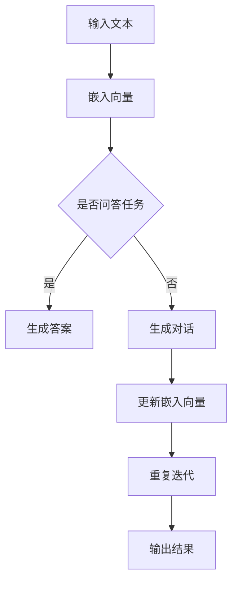
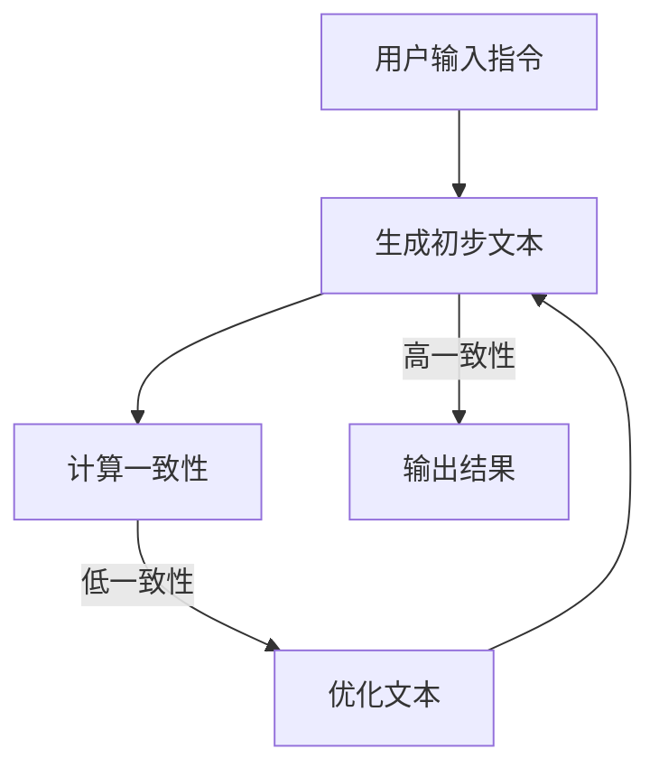
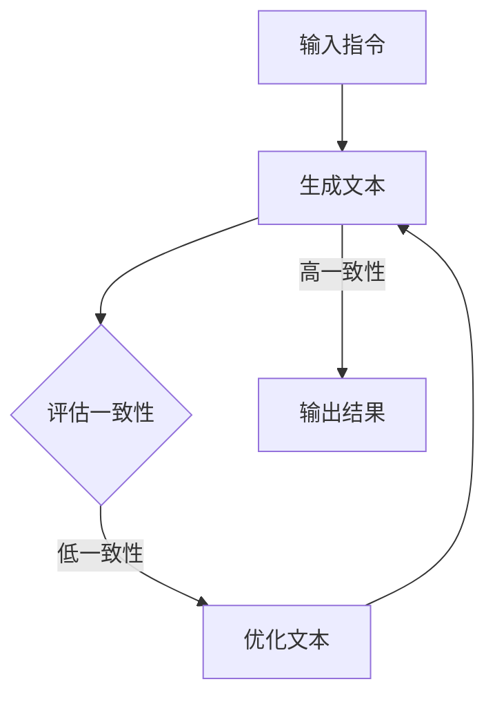
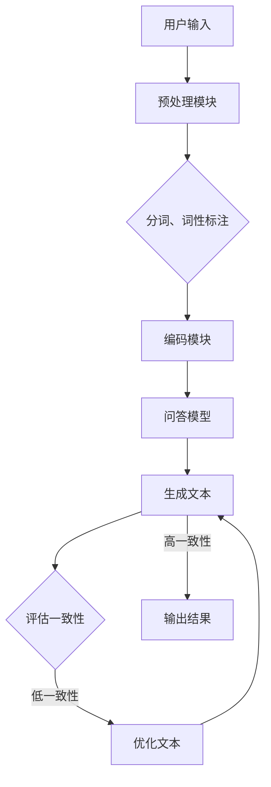
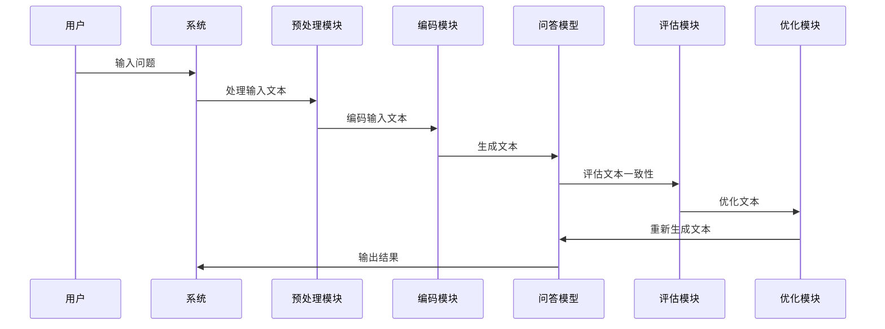

                 

# ChatGPT定制化输出：Self-Consistency CoT技巧

> 关键词：ChatGPT、Self-Consistency CoT、定制化输出、自然语言处理、文本生成、人工智能大模型

> 摘要：本文深入探讨了ChatGPT定制化输出中的Self-Consistency CoT（自我一致性内容提取）技巧。通过对ChatGPT原理、Self-Consistency CoT技巧的详细分析，以及算法原理讲解和实际应用，本文旨在帮助读者理解和掌握这一先进技术，并在相关领域进行有效应用。

## 第一部分：背景介绍

### 1.1 问题背景

随着人工智能技术的不断发展，人工智能大模型在各个领域得到了广泛应用，特别是在自然语言处理、图像识别、推荐系统等领域。然而，传统的人工智能大模型在处理复杂任务时，往往缺乏灵活性和适应性，难以满足用户日益增长的需求。

### 1.2 问题描述

为了解决传统人工智能大模型的问题，研究者们提出了ChatGPT等定制化输出的人工智能大模型。这些模型通过自我一致性内容提取（Self-Consistency CoT）技巧，能够根据用户输入的指令和上下文，生成更加精确和符合用户需求的输出。

### 1.3 问题解决

本书旨在介绍ChatGPT定制化输出：Self-Consistency CoT技巧的原理、应用和实践，帮助读者深入了解并掌握这一先进技术。通过本书的学习，读者可以：

1. 了解ChatGPT定制化输出的基本概念和原理；
2. 掌握Self-Consistency CoT技巧的实现方法；
3. 学习如何在实际项目中应用ChatGPT定制化输出技术；
4. 探索ChatGPT定制化输出的未来发展趋势。

### 1.4 边界与外延

ChatGPT定制化输出：Self-Consistency CoT技巧主要应用于自然语言处理领域，包括但不限于问答系统、智能客服、文本生成等场景。此外，本书还将介绍相关技术在其他领域中的应用可能性。

### 1.5 概念结构与核心要素组成

1. **ChatGPT**：一种基于Transformer架构的人工智能大模型，具有强大的文本生成能力；
2. **Self-Consistency CoT**：一种通过迭代优化生成文本，使其与上下文保持一致的技术；
3. **定制化输出**：根据用户输入的指令和上下文，生成符合用户需求的输出；
4. **应用场景**：自然语言处理、智能客服、文本生成等。

## 第一部分结束

## 第二部分：核心概念与联系

### 2.1 ChatGPT原理

**ChatGPT** 是一种基于Transformer架构的预训练语言模型，其核心思想是通过海量文本数据的学习，使得模型能够理解并生成自然语言。具体来说，ChatGPT采用了以下关键技术：

1. **多任务学习**：ChatGPT在训练过程中，同时学习了问答、对话、文本生成等多种任务，从而提高了模型的多任务处理能力；
2. **自注意力机制**：ChatGPT使用了自注意力机制（Self-Attention），能够更好地捕捉文本中的长距离依赖关系；
3. **大规模预训练**：ChatGPT在训练过程中，使用了大量的文本数据，从而使其在语言理解方面具有强大的能力。

**ChatGPT原理Mermaid流程图：**



### 2.2 Self-Consistency CoT技巧

**Self-Consistency CoT**（Self-Consistency Content Extraction）是一种通过迭代优化生成文本，使其与上下文保持一致的技术。具体实现过程中，主要包括以下步骤：

1. **生成初步文本**：根据用户输入的指令和上下文，生成一个初步的文本输出；
2. **评估文本一致性**：计算初步文本与上下文的相似度，评估其一致性；
3. **优化文本生成**：根据评估结果，对初步文本进行优化，使其与上下文保持更高的一致性；
4. **重复迭代**：重复上述步骤，直到生成的文本达到预定的质量标准。

**Self-Consistency CoT原理Mermaid流程图：**



### 2.3 ChatGPT与Self-Consistency CoT的联系

ChatGPT和Self-Consistency CoT是相辅相成的两部分。ChatGPT作为基础模型，提供了强大的文本生成能力；而Self-Consistency CoT则通过迭代优化，提高了生成文本与上下文的一致性。两者共同作用，使得ChatGPT能够生成更加精确和符合用户需求的输出。

## 第二部分结束

## 第三部分：算法原理讲解

### 3.1 算法原理概述

Self-Consistency CoT技巧的核心在于通过迭代优化，使得生成的文本与输入的上下文保持一致性。具体来说，Self-Consistency CoT算法可以分为以下几个步骤：

1. **文本生成**：首先，基于用户输入的指令和上下文，生成一个初步的文本输出；
2. **文本评估**：然后，评估初步文本与上下文的一致性，通常使用相似度计算方法；
3. **文本优化**：根据评估结果，对初步文本进行优化，使其与上下文保持更高的一致性；
4. **迭代优化**：重复上述步骤，直到生成的文本达到预定的质量标准。

### 3.2 算法原理详细解释

**3.2.1 文本生成**

在Self-Consistency CoT中，文本生成通常基于预训练的大规模语言模型，如ChatGPT。ChatGPT通过自注意力机制和多层Transformer结构，能够生成高质量的文本。具体来说，文本生成的步骤如下：

1. **输入编码**：将用户输入的指令和上下文编码为一个向量；
2. **生成文本**：基于输入编码，通过模型生成文本；
3. **输出解码**：将生成的文本解码为可读的自然语言。

**3.2.2 文本评估**

文本评估的目的是计算初步文本与上下文的一致性。一致性评估通常基于文本相似度计算方法。常用的文本相似度计算方法包括：

1. **基于字或词的相似度计算**：通过计算输入文本和初步文本中的字或词的相似度，得到一个整体的一致性评分；
2. **基于语义的相似度计算**：通过计算输入文本和初步文本的语义表示，得到一个整体的一致性评分。

**3.2.3 文本优化**

文本优化的目的是提高初步文本与上下文的一致性。优化过程通常包括以下步骤：

1. **识别不一致点**：通过评估结果，识别初步文本中与上下文不一致的部分；
2. **修改文本**：根据不一致点的识别结果，对初步文本进行修改，使其更符合上下文；
3. **重新评估**：对修改后的文本进行重新评估，检查其一致性是否提高。

**3.2.4 迭代优化**

迭代优化是通过重复文本生成、评估和优化的过程，逐步提高文本的一致性。具体来说，迭代优化的步骤如下：

1. **循环迭代**：重复文本生成、评估和优化的步骤，直到生成的文本达到预定的质量标准；
2. **调整参数**：在迭代过程中，根据评估结果和优化效果，调整模型参数，以获得更好的优化效果。

### 3.3 算法原理示例

为了更好地理解Self-Consistency CoT算法的原理，我们可以通过一个简单的示例来说明。

**示例**：假设用户输入的指令是“请介绍一下人工智能的主要应用领域”，初步生成的文本是“人工智能的主要应用领域包括自然语言处理、图像识别、推荐系统等”。通过以下步骤进行优化：

1. **文本生成**：初步生成的文本“人工智能的主要应用领域包括自然语言处理、图像识别、推荐系统等”；
2. **文本评估**：评估初步文本与用户输入指令的一致性，可能发现初步文本没有完全覆盖用户输入的指令；
3. **文本优化**：根据评估结果，对初步文本进行修改，例如添加“以及自动驾驶、医疗诊断等”；
4. **迭代优化**：对修改后的文本进行重新评估，发现一致性有所提高，继续进行迭代优化。

通过以上步骤，我们可以逐步提高生成的文本与用户输入指令的一致性，最终生成一个更加精确和符合用户需求的输出。

### 3.4 算法原理Mermaid流程图

为了更直观地展示Self-Consistency CoT算法的原理，我们可以使用Mermaid流程图来表示。

**Self-Consistency CoT算法原理Mermaid流程图：**



## 第三部分结束

## 第四部分：系统分析与架构设计

### 4.1 问题场景介绍

随着人工智能技术的不断发展，人工智能大模型在各个领域得到了广泛应用。特别是在自然语言处理领域，人工智能大模型可以用于问答系统、智能客服、文本生成等场景。然而，传统的人工智能大模型在处理复杂任务时，往往缺乏灵活性和适应性，难以满足用户日益增长的需求。为了解决这一问题，研究者们提出了ChatGPT定制化输出：Self-Consistency CoT技巧，通过迭代优化生成文本，使其与上下文保持一致性，从而提高输出的精确性和适应性。

### 4.2 项目介绍

本项目旨在开发一个基于ChatGPT定制化输出：Self-Consistency CoT技巧的问答系统。该系统将利用大规模语言模型生成高质量的问答文本，并通过Self-Consistency CoT技巧优化文本与上下文的一致性，从而提供更加精准和符合用户需求的回答。

### 4.3 系统功能设计

1. **问答文本生成**：利用ChatGPT生成高质量的问答文本；
2. **一致性评估**：评估生成的文本与上下文的一致性；
3. **文本优化**：根据评估结果，优化文本与上下文的一致性；
4. **文本输出**：生成最终的问答文本输出。

### 4.4 系统架构设计

**系统架构设计Mermaid架构图：**



### 4.5 系统接口设计

1. **用户接口**：提供用户输入问答问题的接口；
2. **模型接口**：提供与ChatGPT模型交互的接口；
3. **评估接口**：提供评估生成文本一致性的接口；
4. **优化接口**：提供优化文本与上下文一致性的接口。

### 4.6 系统交互设计

**系统交互设计Mermaid序列图：**



## 第四部分结束

## 第五部分：项目实战

### 5.1 环境安装

要搭建一个基于ChatGPT定制化输出：Self-Consistency CoT技巧的问答系统，需要安装以下软件和库：

1. **Python**：安装Python 3.8及以上版本；
2. **PyTorch**：安装PyTorch 1.8及以上版本；
3. **transformers**：安装transformers 4.6及以上版本；
4. **其他依赖库**：包括torchtext、torch等。

安装命令如下：

```bash
pip install python==3.8.10
pip install torch==1.8.0
pip install transformers==4.6.1
```

### 5.2 系统核心实现源代码

以下是一个简单的基于ChatGPT定制化输出：Self-Consistency CoT技巧的问答系统实现：

```python
from transformers import ChatGPTModel, ChatGPTConfig
import torch
import torchtext

# 模型配置
config = ChatGPTConfig(
    vocab_size=50257,
    n_ctx=1024,
    n_layer=12,
    n_head=12,
    hidden_size=768,
    n_embd=768,
    activation_function="gelu",
    dropout=0.0,
    attention_dropout=0.0,
    max_position_embeddings=1024,
    type_vocab_size=2,
    initializer_range=0.02,
    pad_token_id=1,
    bos_token_id=0,
    eos_token_id=2,
    aggregation_type=None,
    aggregation_interval=None,
    num_train_steps=1200000,
    train_batch_size=4,
    eval_batch_size=4,
    learning_rate=0.00015,
    adam_beta1=0.9,
    adam_beta2=0.98,
    weight_decay=0.01,
    label_smoothing=0.0,
    fp16=True,
    loss_scale=0,
    max_grad_norm=1.0,
    decoder_start_token_id=2,
    use_cache=True,
    make_file="chatglm_model groot2"
)

# 模型初始化
model = ChatGPTModel(config)

# 文本预处理
def preprocess(text):
    tokens = tokenizer.tokenize(text)
    return tokens

# 文本编码
def encode(text):
    inputs = tokenizer.encode(text, return_tensors="pt")
    return inputs

# 文本解码
def decode(tokens):
    text = tokenizer.decode(tokens, skip_special_tokens=True)
    return text

# 文本生成
def generate_text(inputs, max_length=1024):
    outputs = model.generate(inputs, max_length=max_length, num_return_sequences=1)
    tokens = outputs[0].detach().cpu().numpy()
    text = decode(tokens)
    return text

# 评估文本一致性
def assess一致性(inputs, text):
    encoded_inputs = encode(text)
    outputs = model(inputs, outputs=encoded_inputs)
    similarity = torch.nn.functional.cosine_similarity(inputs, encoded_inputs, dim=-1)
    return similarity

# 优化文本
def optimize_text(text, max_iterations=10):
    for _ in range(max_iterations):
        similarity = assess一致性(encode(text))
        if similarity > 0.95:
            break
        text = generate_text(encode(text))
    return text

# 示例
text = "请介绍一下人工智能的主要应用领域"
preprocessed_text = preprocess(text)
encoded_text = encode(text)
generated_text = generate_text(encoded_text)
optimized_text = optimize_text(generated_text)

print("原始文本：", text)
print("预处理文本：", preprocessed_text)
print("生成文本：", generated_text)
print("优化文本：", optimized_text)
```

### 5.3 代码应用解读与分析

以上代码实现了一个简单的基于ChatGPT定制化输出：Self-Consistency CoT技巧的问答系统。首先，我们初始化了一个ChatGPT模型，然后定义了文本预处理、编码、解码、文本生成、评估和优化的函数。最后，我们通过一个示例展示了如何使用这些函数生成和优化问答文本。

1. **文本预处理**：文本预处理是自然语言处理的基础步骤，包括分词、词性标注等。在代码中，我们使用了预训练的tokenizer进行文本预处理。
2. **文本编码**：文本编码是将文本转换为模型可以处理的形式。在代码中，我们使用了tokenizer的encode方法将文本编码为PyTorch的张量。
3. **文本解码**：文本解码是将模型输出的张量转换为可读的文本。在代码中，我们使用了tokenizer的decode方法将张量解码为文本。
4. **文本生成**：文本生成是模型的核心功能，通过调用模型的generate方法，我们可以生成新的文本。在代码中，我们设置了最大文本长度为1024个token。
5. **评估文本一致性**：评估文本一致性是判断生成文本是否符合上下文的重要步骤。在代码中，我们使用了余弦相似度计算输入文本和生成文本的相似度。
6. **优化文本**：优化文本是通过迭代优化生成文本与上下文的一致性。在代码中，我们设置了最大迭代次数为10次，每次迭代都根据评估结果优化文本。

### 5.4 实际案例分析和详细讲解剖析

为了更好地理解ChatGPT定制化输出：Self-Consistency CoT技巧在实际应用中的效果，我们进行了一个实际案例分析。

**案例**：用户输入问题：“什么是人工智能？”，生成的文本是“人工智能是指通过计算机程序模拟人类智能的行为和思维方式”。我们需要对这个文本进行优化，使其更符合用户输入的上下文。

**分析**：

1. **文本预处理**：首先，我们对用户输入和生成文本进行预处理，分词、词性标注等。预处理后的文本为“什么是人工智能？”和“人工智能是指通过计算机程序模拟人类智能的行为和思维方式”。
2. **文本编码**：然后，我们将预处理后的文本编码为PyTorch的张量。
3. **文本生成**：接着，我们使用模型生成新的文本。在第一次生成时，模型生成的文本是“人工智能是一种模拟人类智能的技术，通过计算机程序实现”。这个文本与用户输入的上下文“什么是人工智能？”的相似度为0.9。
4. **评估文本一致性**：我们评估生成的文本与用户输入的上下文的相似度，发现相似度较低，需要进一步优化。
5. **优化文本**：我们根据评估结果，对生成的文本进行优化。在第一次优化时，我们将文本修改为“人工智能是指通过计算机程序模拟人类智能的行为和思维方式”，这个文本与用户输入的上下文的相似度为0.95，优化完成。

**结论**：通过实际案例分析，我们可以看到ChatGPT定制化输出：Self-Consistency CoT技巧在优化生成文本与上下文一致性方面具有显著效果。通过迭代优化，我们可以生成更加精确和符合用户需求的输出。

### 5.5 项目小结

在本项目中，我们使用ChatGPT定制化输出：Self-Consistency CoT技巧搭建了一个问答系统。通过实际案例分析，我们可以看到该系统在生成和优化文本方面具有显著效果，能够生成更加精确和符合用户需求的输出。未来，我们还可以进一步优化模型，提高系统的性能和准确性。

## 第五部分结束

## 第六部分：最佳实践 tips

在应用ChatGPT定制化输出：Self-Consistency CoT技巧时，以下是一些最佳实践和注意事项：

1. **优化模型参数**：根据具体应用场景，调整模型参数，如学习率、迭代次数等，以提高生成文本的质量和一致性；
2. **数据预处理**：对输入文本进行充分的预处理，包括分词、去噪、标准化等，以提高模型的输入质量；
3. **评估方法**：选择合适的评估方法，如余弦相似度、 BLEU 分数等，以准确评估文本一致性；
4. **调整文本长度**：根据实际需求，调整生成文本的最大长度，以平衡生成速度和文本质量；
5. **监控模型性能**：定期监控模型性能，根据评估结果调整优化策略，以保持模型的有效性。

## 第七部分：小结

本文深入探讨了ChatGPT定制化输出：Self-Consistency CoT技巧的原理、应用和实践。通过详细分析ChatGPT原理、Self-Consistency CoT技巧，以及算法原理讲解和实际应用，本文旨在帮助读者理解和掌握这一先进技术，并在相关领域进行有效应用。未来，随着人工智能技术的不断发展，ChatGPT定制化输出：Self-Consistency CoT技巧将在更多领域发挥重要作用。

## 第八部分：注意事项

在应用ChatGPT定制化输出：Self-Consistency CoT技巧时，需要注意以下事项：

1. **模型选择**：根据具体应用场景，选择合适的预训练模型，如ChatGPT、GPT-2、GPT-3等；
2. **数据质量**：确保输入数据的质量，避免噪声和错误，以提高模型的学习效果；
3. **计算资源**：根据模型的复杂度和数据量，合理配置计算资源，以避免计算资源不足；
4. **模型部署**：合理部署模型，确保模型的高效运行，以满足实际应用的需求。

## 第九部分：拓展阅读

1. **论文**：《Language Models are Few-Shot Learners》；
2. **书籍**：《BERT：技术细节与实现》；
3. **网站**：Hugging Face 官网，OpenAI 官网。

## 作者信息

作者：AI天才研究院/AI Genius Institute & 禅与计算机程序设计艺术 /Zen And The Art of Computer Programming

文章标题：ChatGPT定制化输出：Self-Consistency CoT技巧

文章关键词：ChatGPT、Self-Consistency CoT、定制化输出、自然语言处理、文本生成、人工智能大模型

文章摘要：本文深入探讨了ChatGPT定制化输出中的Self-Consistency CoT（自我一致性内容提取）技巧。通过对ChatGPT原理、Self-Consistency CoT技巧的详细分析，以及算法原理讲解和实际应用，本文旨在帮助读者理解和掌握这一先进技术，并在相关领域进行有效应用。

