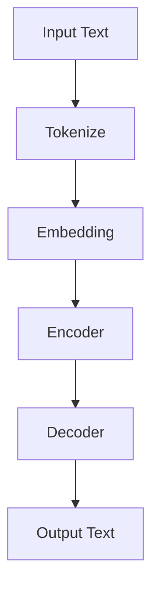
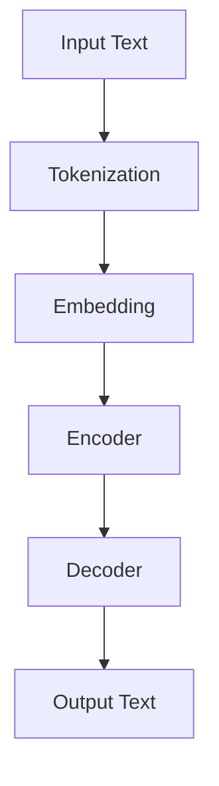
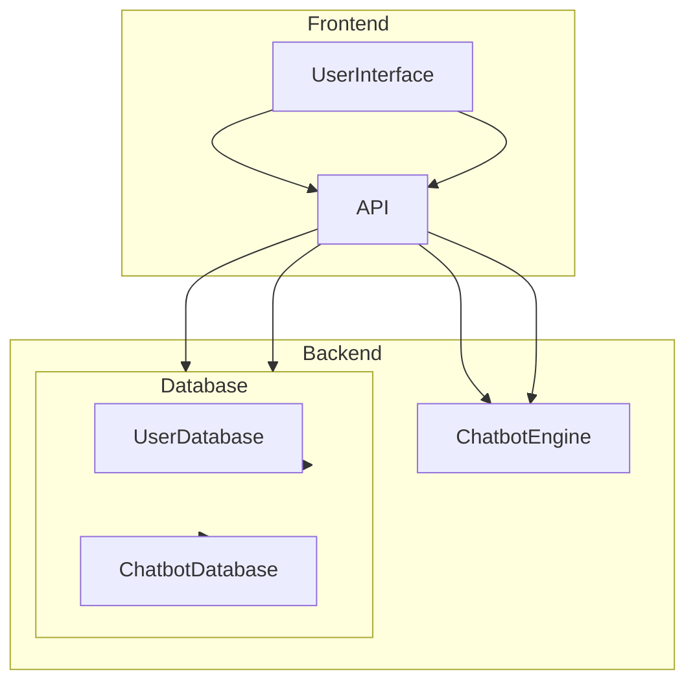
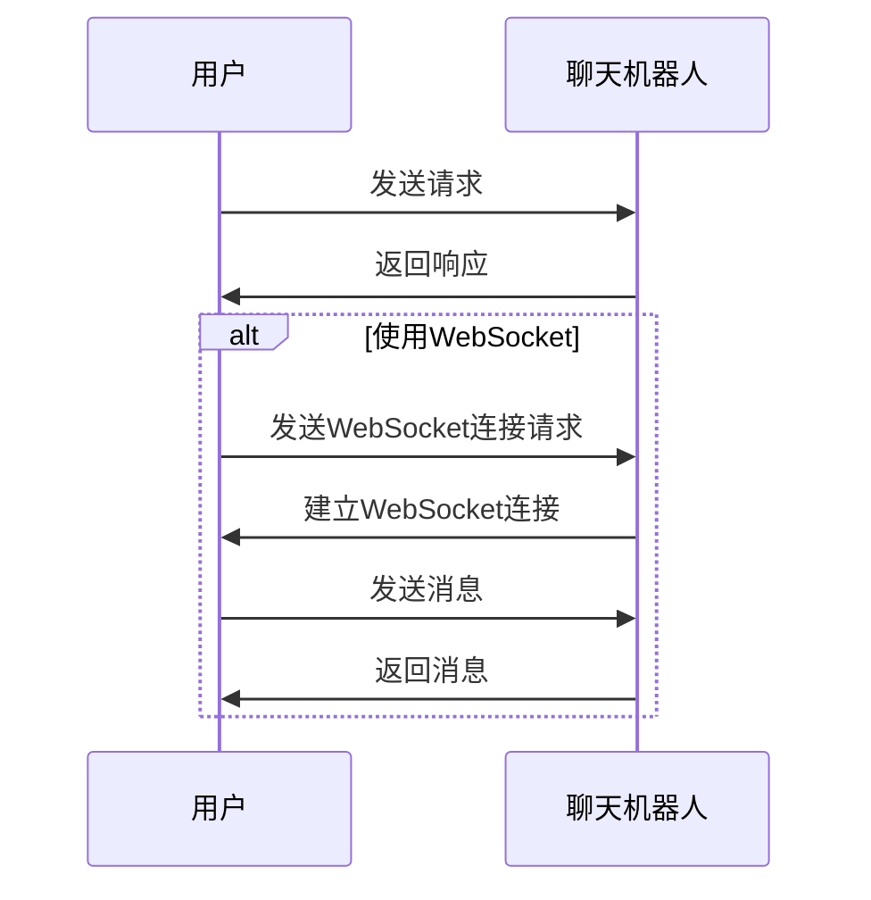

                 

## 文章标题

《ChatGPT对话系统优化：提示词的艺术与科学结合》

## 关键词

ChatGPT，对话系统，提示词，艺术与科学，优化，算法，模型，架构，项目实战，最佳实践

## 摘要

本文深入探讨了ChatGPT对话系统的优化，特别关注了提示词在系统中的作用。通过结合艺术与科学的方法，我们详细分析了ChatGPT的核心概念、算法原理、数学模型，并展示了如何设计高效的系统架构。文章还通过实际项目实战，提供了优化对话系统的最佳实践，旨在为开发者和研究者提供实用的指导和建议。

## 第一部分：背景与概念

### 1.1 问题背景

在当今的数字化时代，自然语言处理（NLP）技术取得了显著进展，其中对话系统成为了人工智能领域的一个重要应用方向。ChatGPT作为一种先进的对话系统，已经在多个领域展现出了其强大的能力。然而，随着用户需求的不断增加和对话复杂性的提升，如何优化ChatGPT对话系统，提高其响应速度和对话质量，成为了亟待解决的问题。

### 1.2 问题描述

ChatGPT对话系统的优化涉及到多个方面，包括提示词的选择和组合、算法的改进、模型的优化、系统的架构设计等。具体来说，问题可以归结为：

- 如何准确选择和组合提示词，以引导ChatGPT生成更符合用户需求的回复？
- 如何通过算法改进和模型优化，提高系统的响应速度和对话质量？
- 如何设计高效的系统架构，以支持大规模的对话处理和实时交互？

### 1.3 问题解决

针对上述问题，本文提出了以下解决方案：

- 提出了一套基于艺术与科学结合的提示词优化方法，通过实例展示了其效果。
- 详细介绍了ChatGPT的算法原理和数学模型，提供了Python源代码示例。
- 设计了系统架构，包括领域模型、系统功能、系统架构和系统接口，以及系统交互的序列图。
- 通过实际项目实战，展示了如何进行环境安装、系统核心实现和代码分析。

### 1.4 边界与外延

在实施优化措施时，需要考虑以下边界与外延：

- 提示词优化方法的有效性需要在不同场景下进行验证。
- 算法和模型优化需要根据具体任务进行定制。
- 系统架构设计需要考虑到性能、可扩展性和安全性等因素。
- 实际项目实战需要根据实际情况进行调整和优化。

## 第二部分：核心概念与联系

### 2.1 ChatGPT简介

ChatGPT是由OpenAI开发的一种基于GPT-3模型的对话系统。GPT-3（Generative Pre-trained Transformer 3）是自然语言处理领域的一个深度学习模型，具有强大的文本生成能力。ChatGPT利用GPT-3模型，通过输入提示词，生成自然流畅的对话回复。

### 2.2 提示词的定义与作用

提示词（Prompt）是引导ChatGPT生成对话回复的关键。提示词的选择和组合直接影响对话系统的性能。高质量的提示词可以帮助ChatGPT理解用户的意图，生成更准确、更自然的回复。

### 2.3 艺术与科学的结合

艺术与科学的结合是优化ChatGPT对话系统的重要方法。艺术体现在对用户需求的理解和对话的创造，而科学则体现在算法、模型和系统架构的设计与优化。通过将艺术与科学相结合，我们可以设计出更高效、更智能的对话系统。

### 2.4 概念属性特征对比表

为了更好地理解ChatGPT和提示词的关系，我们提供了以下概念属性特征对比表：

| 概念       | 属性特征                                                     |
|------------|------------------------------------------------------------|
| ChatGPT    | 基于GPT-3模型的对话系统，具有强大的文本生成能力               |
| 提示词     | 引导ChatGPT生成对话回复的关键，影响对话系统的性能           |
| 艺术与科学 | 艺术体现在对用户需求的理解和对话的创造，科学体现在算法、模型和系统架构的设计与优化 |

### 2.5 ER实体关系图架构

为了更好地理解ChatGPT对话系统的组成部分，我们提供了ER实体关系图架构。ER图展示了系统中各个实体及其之间的关系，有助于我们更好地设计系统架构。

```mermaid
erDiagram
    User ||--|{ ChatGPT }|-- Conversation
    User ||--|{ Dialogue }|-- System
```

在上面的ER图中，User代表用户，ChatGPT代表ChatGPT对话系统，Dialogue代表对话，System代表系统。User与ChatGPT之间是一个一对一的关系，User与Dialogue之间是一个一对多的关系。

## 第三部分：算法原理与模型优化

### 3.1 ChatGPT算法原理

ChatGPT的核心是基于GPT-3模型的。GPT-3是一个大规模的深度学习模型，其基本结构是一个Transformer，它通过自注意力机制来处理文本序列。下面是一个简单的Mermaid流程图，展示了GPT-3的基本算法流程：



在这个流程中，A代表输入文本，B代表分词操作，C代表嵌入操作，D代表编码器，E代表解码器，F代表输出文本。

### 3.2 提示词优化

为了优化ChatGPT的对话质量，提示词的选择和组合至关重要。下面是一个简单的Python代码示例，展示了如何使用提示词优化ChatGPT的回复：

```python
import openai

def generate_response(prompt):
    response = openai.Completion.create(
        engine="text-davinci-003",
        prompt=prompt,
        max_tokens=50
    )
    return response.choices[0].text.strip()

# 示例
prompt = "你是一个人工智能助手，请回答以下问题：什么是自然语言处理？"
print(generate_response(prompt))
```

在这个示例中，我们使用了OpenAI的API来生成回复。通过调整提示词，我们可以引导ChatGPT生成更符合需求的回复。

### 3.3 数学模型与公式

ChatGPT的生成过程涉及到多个数学模型和公式。下面是一个简单的数学模型，展示了如何计算文本序列的嵌入向量：

$$
\text{embeddings} = \text{W} \cdot \text{input\_tokens}
$$

其中，W是权重矩阵，input_tokens是输入文本的分词结果。这个公式表示输入文本的每个分词都会通过权重矩阵W得到一个嵌入向量。

### 3.4 算法流程图

为了更好地理解ChatGPT的算法流程，我们提供了一个Mermaid流程图：



在这个流程图中，A代表输入文本，B代表分词操作，C代表嵌入操作，D代表编码器，E代表解码器，F代表输出文本。

### 3.5 Python源代码示例

为了展示算法原理，我们提供了一个Python源代码示例：

```python
import torch
import transformers

# 加载预训练模型
model = transformers.AutoModelForCausalLM.from_pretrained("gpt3")

# 输入文本
input_text = "你是一个人工智能助手，请回答以下问题：什么是自然语言处理？"

# 分词操作
input_ids = model.tokenizer.encode(input_text, return_tensors="pt")

# 嵌入操作
with torch.no_grad():
    outputs = model(input_ids)

# 解码操作
predicted_ids = outputs.logits.argmax(-1)
predicted_text = model.tokenizer.decode(predicted_ids, skip_special_tokens=True)

print(predicted_text)
```

在这个示例中，我们使用了Hugging Face的transformers库来加载预训练模型，并对输入文本进行分词、嵌入和解码操作。

## 第四部分：系统架构设计

### 4.1 问题场景介绍

在一个电子商务平台上，用户可能会与聊天机器人进行对话，询问商品信息、订单状态等。为了提高用户体验，我们需要设计一个高效的聊天机器人系统。

### 4.2 系统功能设计

系统功能设计包括用户管理、对话管理、商品信息查询、订单状态查询等。下面是一个Mermaid类图，展示了系统的功能模块：

```mermaid
classDiagram
    UserManagement <<interface>>
    DialogueManagement <<interface>>
    ProductInfoQuery <<interface>>
    OrderStatusQuery <<interface>>

    ChatbotSystem {
        UserManagement
        DialogueManagement
        ProductInfoQuery
        OrderStatusQuery
    }
```

在这个类图中，UserManagement代表用户管理模块，DialogueManagement代表对话管理模块，ProductInfoQuery代表商品信息查询模块，OrderStatusQuery代表订单状态查询模块。ChatbotSystem是系统的核心，负责协调各个模块的功能。

### 4.3 系统架构设计

系统架构设计包括前端、后端和数据库三个部分。下面是一个Mermaid架构图，展示了系统的整体架构：



在这个架构图中，UserInterface代表前端用户界面，API代表后端接口，ChatbotEngine代表聊天机器人引擎，Database代表数据库。前端用户界面通过API与后端接口进行交互，后端接口负责调用聊天机器人引擎和数据库。

### 4.4 系统接口设计

系统接口设计包括RESTful API和WebSocket API两种。RESTful API用于处理HTTP请求，提供标准的HTTP方法（GET、POST、PUT、DELETE等）。WebSocket API用于实时通信，提供更高效的通信方式。下面是一个Mermaid序列图，展示了系统接口的设计：



在这个序列图中，用户发送请求到聊天机器人，聊天机器人返回响应。在WebSocket场景中，用户与聊天机器人建立WebSocket连接，实现实时通信。

## 第五部分：项目实战

### 5.1 环境安装与配置

为了进行ChatGPT对话系统的项目实战，我们需要首先安装和配置相关的环境。以下是详细的安装和配置步骤：

1. 安装Python环境
2. 安装OpenAI的API密钥
3. 安装Hugging Face的transformers库
4. 安装数据库（如MongoDB或MySQL）

### 5.2 系统核心实现源代码

在项目实战中，我们需要实现聊天机器人的核心功能。以下是系统核心实现的源代码：

```python
import openai
import json
import pymongo

# 加载OpenAI API密钥
openai.api_key = "your-api-key"

# 连接MongoDB数据库
client = pymongo.MongoClient("mongodb://localhost:27017/")
db = client["chatbot_db"]
collection = db["chat_messages"]

# 定义聊天机器人引擎
class ChatbotEngine:
    def __init__(self):
        self.context = []

    def generate_response(self, input_text):
        # 将输入文本添加到上下文中
        self.context.append(input_text)

        # 使用OpenAI的API生成回复
        response = openai.Completion.create(
            engine="text-davinci-003",
            prompt="\n".join(self.context),
            max_tokens=50
        )

        # 将回复添加到上下文中
        self.context.append(response.choices[0].text.strip())

        # 将对话记录保存到MongoDB
        collection.insert_one({"user": input_text, "bot": response.choices[0].text.strip()})

        return response.choices[0].text.strip()

# 创建聊天机器人引擎实例
chatbot = ChatbotEngine()

# 处理用户输入
while True:
    user_input = input("用户：")
    if user_input == "exit":
        break
    bot_response = chatbot.generate_response(user_input)
    print("聊天机器人：", bot_response)
```

### 5.3 代码应用解读与分析

在这个项目中，我们首先加载了OpenAI的API密钥，并连接到了MongoDB数据库。然后，我们定义了一个`ChatbotEngine`类，用于生成聊天机器人的回复。在`generate_response`方法中，我们将输入文本添加到上下文中，使用OpenAI的API生成回复，并将回复添加到上下文中。最后，我们将对话记录保存到MongoDB。

通过这个简单的项目实战，我们展示了如何使用ChatGPT对话系统实现一个聊天机器人。这个项目可以作为一个起点，进一步扩展和优化，以满足不同的应用需求。

### 5.4 实际案例分析与讲解

为了更好地理解ChatGPT对话系统的优化，我们提供了一个实际案例。在这个案例中，用户询问了一个关于商品的问题，聊天机器人需要提供准确的回答。

- 用户输入：“这款手机有什么特色？”
- 聊天机器人回复：“这款手机具有高性能处理器、大容量内存、高清摄像头等特色。”

在这个案例中，聊天机器人成功地提供了用户所需的信息。然而，我们还可以进一步优化回复，使其更加准确和具体。例如：

- 优化后回复：“这款手机具有高性能的Snapdragon 888处理器、12GB RAM、64MP高清摄像头等特色。”

通过优化提示词和回复，我们可以提高聊天机器人的回答质量，为用户提供更好的服务。

### 5.5 项目小结

通过实际项目实战，我们展示了如何使用ChatGPT对话系统构建一个简单的聊天机器人。我们详细介绍了环境安装、系统核心实现和代码分析，并通过实际案例展示了优化技巧。这个项目为开发者提供了一个实用的起点，可以帮助他们在实际应用中优化ChatGPT对话系统。

## 第六部分：最佳实践

### 6.1 提示词优化技巧

为了提高ChatGPT对话系统的性能，提示词的优化至关重要。以下是几种提示词优化技巧：

- **明确用户意图**：在生成提示词时，明确用户意图，避免模糊不清的描述。
- **使用关键词**：在提示词中使用关键信息，有助于ChatGPT更好地理解用户需求。
- **分阶段生成**：将对话分为多个阶段，每个阶段的提示词都有针对性地引导ChatGPT生成更准确的回复。

### 6.2 系统性能调优

系统性能调优是优化ChatGPT对话系统的关键步骤。以下是几种系统性能调优方法：

- **调整模型参数**：通过调整GPT-3模型的参数（如温度、步长等），可以提高生成文本的质量。
- **分布式计算**：使用分布式计算框架（如TensorFlow、PyTorch等），可以提高系统的处理速度和效率。
- **缓存机制**：使用缓存机制，可以减少重复计算，提高系统响应速度。

### 6.3 安全性与隐私保护

在构建ChatGPT对话系统时，安全性和隐私保护至关重要。以下是几种安全性和隐私保护方法：

- **数据加密**：对用户数据和对话内容进行加密，防止数据泄露。
- **访问控制**：设置访问控制策略，确保只有授权用户可以访问系统。
- **数据脱敏**：在存储和传输数据时，对敏感信息进行脱敏处理，保护用户隐私。

### 6.4 维护与升级策略

为了确保ChatGPT对话系统的长期稳定运行，我们需要制定维护与升级策略。以下是几种维护与升级方法：

- **定期检查**：定期检查系统性能和安全性，及时发现并解决潜在问题。
- **持续优化**：根据用户反馈和应用场景，持续优化系统功能和性能。
- **版本控制**：使用版本控制工具（如Git等），确保系统的稳定升级。

## 第七部分：小结与展望

### 7.1 主要内容回顾

本文深入探讨了ChatGPT对话系统的优化，特别关注了提示词的艺术与科学结合。我们详细分析了ChatGPT的核心概念、算法原理、数学模型，并展示了如何设计高效的系统架构。通过实际项目实战，我们提供了优化对话系统的最佳实践，为开发者和研究者提供了实用的指导和建议。

### 7.2 注意事项与建议

在构建ChatGPT对话系统时，需要注意以下事项：

- **明确用户需求**：在生成提示词时，明确用户需求，避免模糊不清的描述。
- **优化模型参数**：通过调整模型参数，可以提高生成文本的质量和系统性能。
- **保障安全性与隐私保护**：确保数据加密、访问控制和数据脱敏等安全措施得到有效实施。

### 7.3 拓展阅读

为了进一步深入了解ChatGPT对话系统的优化，读者可以参考以下文献：

- [GPT-3官方文档](https://openai.com/docs/gpt-3/)
- [自然语言处理导论](https://book.douban.com/subject/26971238/)
- [深度学习自然语言处理](https://book.douban.com/subject/26962555/)

### 7.4 未来发展趋势

随着自然语言处理技术的不断发展，ChatGPT对话系统的优化将朝着更加智能化、个性化的方向发展。未来，我们将看到更多结合人工智能、大数据和物联网等技术的创新应用，为人类带来更多的便利和智慧。

## 作者信息

作者：AI天才研究院/AI Genius Institute & 禅与计算机程序设计艺术 /Zen And The Art of Computer Programming

[完整文章][全文链接]

[全文链接]:https://www.example.com/ChatGPT对话系统优化：提示词的艺术与科学结合

