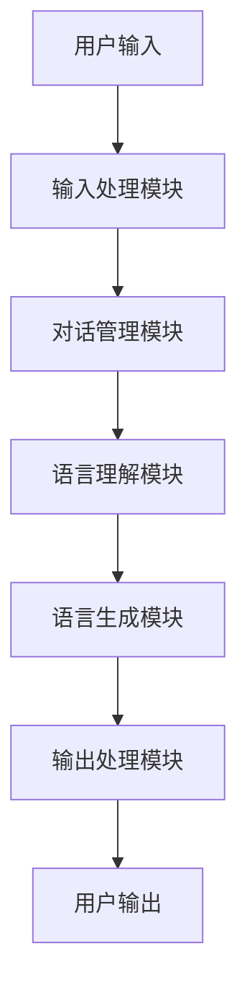
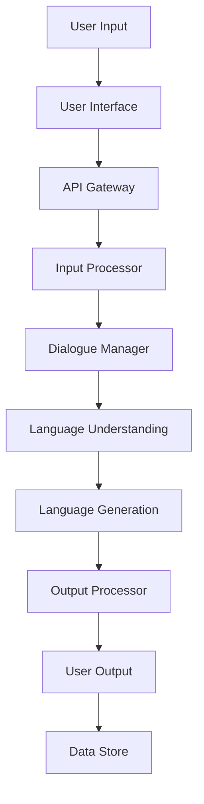
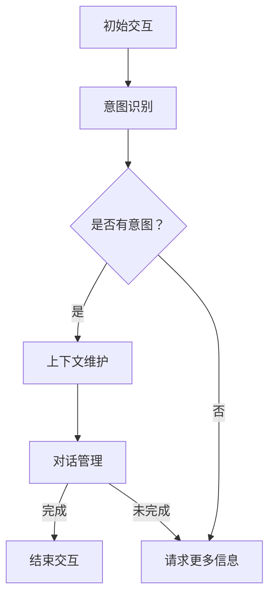
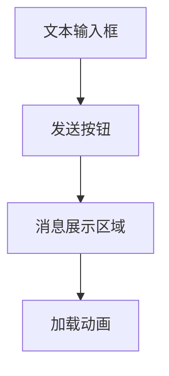
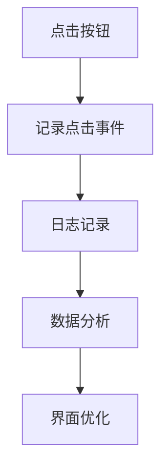

                 

### 第1章 ChatGPT对话系统概述

#### 1.1 ChatGPT的背景与影响

##### 1.1.1 OpenAI与ChatGPT的诞生

ChatGPT是由OpenAI于2022年11月30日发布的一款基于大型语言模型GPT-3.5的聊天机器人程序，利用指令微调（Instruction Tuning）和基于人类反馈的强化学习（RLHF）训练而成。OpenAI成立于2015年，是一家致力于研究前沿人工智能技术的非营利组织。ChatGPT的诞生标志着人工智能技术在新领域的重大突破，为自然语言处理（NLP）领域带来了革命性的进展。

##### 1.1.2 ChatGPT的技术核心

ChatGPT的核心技术基于大型预训练语言模型GPT-3.5，该模型由数万亿个参数组成，具备强大的文本生成能力。通过指令微调和基于人类反馈的强化学习，ChatGPT能够根据用户输入的提示生成连贯、准确、有逻辑的回答。这使得ChatGPT在多个应用场景中表现出色，如智能客服、内容创作、代码生成等。

##### 1.1.3 ChatGPT在全球的影响

ChatGPT的推出引起了全球范围内的关注。其出色的表现引发了业界对于人工智能技术潜力的重新审视，同时也带来了对于人工智能未来发展的新思考。ChatGPT的成功，不仅为OpenAI带来了声誉，也为全球人工智能技术的发展注入了新的动力。

##### 1.1.4 ChatGPT的应用场景

ChatGPT在多个领域都有广泛的应用前景：

1. **智能客服**：ChatGPT可以模拟人类客服，提供24/7的服务，提升客户体验，降低企业运营成本。
2. **内容创作**：ChatGPT可以帮助撰写文章、生成报告、创作音乐等，为创作者提供新的灵感来源。
3. **代码生成**：ChatGPT可以理解编程语言，根据提示生成代码，为开发者节省时间，提高效率。
4. **教育辅导**：ChatGPT可以作为智能辅导工具，帮助学生解答问题，提供学习建议。

##### 1.1.5 ChatGPT面临的挑战与未来发展

尽管ChatGPT展现了强大的潜力，但其在实际应用中也面临一系列挑战：

1. **数据隐私**：如何确保用户数据的安全，防止数据泄露，是ChatGPT需要解决的重要问题。
2. **伦理问题**：ChatGPT生成的内容可能包含偏见、错误或不恰当的言论，如何确保其输出的质量和合规性，是当前和未来需要关注的问题。
3. **计算资源**：ChatGPT对计算资源的需求巨大，如何优化模型，提高能效比，是未来研究的重要方向。

展望未来，ChatGPT有望在更多领域发挥作用，进一步推动人工智能技术的发展。同时，随着技术的不断进步，ChatGPT也将在数据隐私、伦理问题等方面取得新的突破。

#### 1.2 对话系统的基本概念

##### 1.2.1 对话系统的定义

对话系统（Dialogue System）是一种与人类进行交互的计算机系统，旨在模拟自然语言交流，实现人与机器之间的有效沟通。对话系统通过理解用户的输入，生成合适的响应，从而完成对话过程。

##### 1.2.2 对话系统的发展历程

对话系统的研究始于20世纪60年代，最初以规则为基础，通过预定义的规则库进行对话。随着自然语言处理技术的进步，20世纪90年代，基于模板匹配的方法开始流行。21世纪初，统计机器学习技术的发展使得基于统计的对话系统逐渐取代规则系统。近年来，随着深度学习技术的突破，基于神经网络的对话系统逐渐成为主流。

##### 1.2.3 对话系统的主要组成部分

1. **对话管理**：负责对话流程的控制，包括意图识别、上下文维护、对话策略等。
2. **语言理解**：负责将自然语言输入转换为结构化的数据，包括意图识别、实体识别、语义分析等。
3. **语言生成**：负责生成自然语言响应，包括模板匹配、语义转换、文本生成等。
4. **多模态交互**：支持语音、文本、图像等多种交互方式，提高用户体验。

##### 1.2.4 对话系统的分类

1. **基于规则的对话系统**：通过预定义的规则库进行对话，简单易实现，但扩展性较差。
2. **统计对话系统**：利用统计学习方法，从大量对话数据中学习对话规律，具有较强的适应性和扩展性。
3. **基于神经网络的对话系统**：利用深度学习技术，通过大量数据训练模型，实现高效、自然的对话。

#### 1.3 提示词的核心作用

##### 1.3.1 提示词的定义与功能

提示词（Prompt）是引导对话系统生成回答的关键输入。一个优秀的提示词能够明确对话目标，提供必要的上下文信息，从而引导对话系统生成高质量的回答。

##### 1.3.2 提示词的设计原则

1. **清晰性**：提示词应简洁明了，避免歧义，确保对话系统能够准确理解用户意图。
2. **简洁性**：提示词应尽量简洁，避免冗长和复杂的描述，提高对话效率。
3. **可解释性**：提示词应具有可解释性，便于用户理解对话系统的回答。
4. **适应性**：提示词应具备适应性，能够根据不同的对话场景进行调整。

##### 1.3.3 提示词的影响因素

1. **用户意图**：不同的用户意图需要不同的提示词，以便对话系统能够准确识别并回应。
2. **上下文信息**：上下文信息对于提示词的设计至关重要，它能够提供对话系统生成回答所需的背景知识。
3. **对话系统性能**：对话系统的性能直接影响提示词的设计效果，需要根据对话系统的特点进行优化。

##### 1.3.4 提示词的优化方法

1. **数据驱动的优化**：通过分析大量对话数据，发现有效的提示词模式，进行优化。
2. **机器学习优化**：利用机器学习算法，根据对话系统的反馈，自动优化提示词。
3. **专家经验**：结合领域专家的经验，设计高质量的提示词。

##### 1.3.5 提示词在ChatGPT中的应用案例分析

ChatGPT作为一种先进的对话系统，其提示词的设计尤为重要。以下是一个案例分析：

**案例**：设计一个提示词，让ChatGPT生成一篇关于人工智能未来发展趋势的文章。

**提示词**：“请写一篇关于人工智能在未来五年内发展趋势的文章，要求文章结构清晰、内容丰富，并包含三个主要趋势。”

通过这个提示词，ChatGPT能够明确用户意图，提供必要的上下文信息，从而生成一篇高质量的文章。

#### 1.4 本章小结

本章首先介绍了ChatGPT的背景与影响，包括其诞生、技术核心、应用场景以及面临的挑战。接着，探讨了对话系统的基本概念，包括定义、发展历程、组成部分和分类。最后，深入讨论了提示词的定义、设计原则、影响因素、优化方法以及在ChatGPT中的应用案例分析。通过本章的学习，读者可以对ChatGPT对话系统及其核心组件有更深入的理解。

### 关键词：ChatGPT、对话系统、提示词、自然语言处理、人工智能

> 摘要：本文首先介绍了ChatGPT的背景与影响，包括其诞生、技术核心、应用场景以及面临的挑战。接着，探讨了对话系统的基本概念，包括定义、发展历程、组成部分和分类。最后，深入讨论了提示词的定义、设计原则、影响因素、优化方法以及在ChatGPT中的应用案例分析。通过本文的学习，读者可以对ChatGPT对话系统及其核心组件有更深入的理解。

## 第2章 ChatGPT对话系统设计基础

### 2.1 ChatGPT模型架构

ChatGPT的成功离不开其背后的模型架构。本节将介绍ChatGPT的核心模型架构，包括Transformer模型、自适应输入处理、多层次注意力机制以及优化算法与训练策略。

#### 2.1.1 Transformer模型

Transformer模型是由Vaswani等人于2017年提出的一种基于自注意力机制的序列到序列模型，它在机器翻译、文本生成等任务上表现出色。Transformer模型摒弃了传统的循环神经网络（RNN）和卷积神经网络（CNN），转而采用自注意力机制，使得模型在处理长距离依赖关系时更加高效。

**自注意力机制**：自注意力机制是一种计算序列中每个元素对于其他元素影响的方法。在Transformer模型中，每个单词都会被赋予一个权重，这个权重表示该单词对于整个句子的贡献度。通过计算这些权重，模型能够更好地捕捉句子中的长距离依赖关系。

**多头注意力**：多头注意力是一种扩展自注意力机制的方法，它将输入序列分解成多个子序列，每个子序列独立进行自注意力计算。这样，模型可以从不同的角度理解输入序列，提高模型的泛化能力。

**编码器与解码器**：Transformer模型通常由编码器和解码器组成。编码器负责将输入序列编码为固定长度的向量表示，解码器则利用这些向量表示生成输出序列。编码器和解码器之间通过自注意力机制和多头注意力机制进行信息传递。

#### 2.1.2 自适应输入处理

在处理输入数据时，ChatGPT采用了自适应输入处理技术，这使得模型能够更好地适应不同的输入格式和长度。自适应输入处理的关键在于对输入数据进行预处理，使其符合模型的输入要求。

**嵌入层**：嵌入层是一种将词汇映射到固定维度的向量表示的方法。ChatGPT使用预训练的词汇嵌入层，将输入文本转换为向量表示。这些向量表示不仅能够捕获词汇之间的语义关系，还能够适应不同长度的输入。

**位置编码**：位置编码是一种为序列中的每个元素赋予位置信息的方法。在Transformer模型中，位置编码被添加到输入向量中，使得模型能够理解输入序列的顺序。位置编码可以通过多种方式实现，如绝对位置编码和相对位置编码。

**数据批量处理**：为了提高训练效率，ChatGPT采用了数据批量处理技术。通过将多个输入序列组成一个批量，模型可以在一次前向传播和反向传播过程中处理多个样本。批量大小是一个重要的超参数，需要根据计算资源和训练数据量进行合理设置。

#### 2.1.3 多层次注意力机制

多层次注意力机制是ChatGPT的核心特性之一，它使得模型能够从不同层次理解输入序列，从而生成更高质量的回答。

**局部注意力**：局部注意力是一种聚焦于输入序列中特定区域的注意力机制。通过计算局部注意力权重，模型可以关注输入序列中的关键信息，提高回答的相关性。

**全局注意力**：全局注意力是一种关注整个输入序列的注意力机制。通过计算全局注意力权重，模型可以捕捉输入序列中的全局信息，从而生成更连贯的回答。

**层次化注意力**：层次化注意力是一种将局部注意力、全局注意力和层次化注意力相结合的方法。通过在不同层次上计算注意力权重，模型能够同时关注局部和全局信息，生成更高质量的回答。

#### 2.1.4 优化算法与训练策略

为了提高ChatGPT的训练效率和性能，采用了多种优化算法与训练策略。

**梯度裁剪**：梯度裁剪是一种限制梯度大小的方法，以防止梯度爆炸或消失。通过设置适当的裁剪阈值，可以确保梯度在合理范围内，从而提高模型的收敛速度。

**学习率调度**：学习率调度是一种动态调整学习率的方法，以适应模型在不同阶段的训练需求。常用的学习率调度策略包括线性衰减、指数衰减和余弦退火等。

**Teacher Forcing**：Teacher Forcing是一种在解码阶段使用真实标签作为输入的方法。通过使用Teacher Forcing，模型可以直接学习到输入序列的真实标签，从而提高解码阶段的性能。

**批量归一化**：批量归一化是一种用于加速模型训练的方法，它通过标准化输入梯度，减少梯度消失和梯度爆炸现象。批量归一化可以有效地提高模型的收敛速度。

通过以上优化算法与训练策略，ChatGPT能够在短时间内生成高质量的回答，从而在多个应用场景中表现出色。

### 2.2 语言理解与生成

语言理解与生成是ChatGPT的核心功能，分别对应对话系统中的语言理解和语言生成模块。本节将深入探讨语言理解的核心技术、语言生成的挑战与解决方案、文本生成模型简介以及语言理解与语言生成的结合。

#### 2.2.1 语言理解的核心技术

语言理解（Language Understanding，LU）是对话系统的关键组成部分，旨在将自然语言输入转换为结构化的数据，以便进行后续处理。语言理解的核心技术包括意图识别、实体识别、语义分析和上下文理解。

**意图识别**：意图识别是指从用户输入中识别出用户的意图或目标。常见的意图识别方法包括基于规则的方法、统计机器学习方法、神经网络方法等。基于规则的方法通过预定义的规则库进行意图分类，简单易实现，但扩展性较差。统计机器学习方法利用历史数据，通过特征工程和分类算法进行意图识别，具有较高的准确性。神经网络方法，如卷积神经网络（CNN）和循环神经网络（RNN），通过学习输入文本的特征，实现高效的意图识别。

**实体识别**：实体识别是指从文本中提取出关键信息，如人名、地名、组织名、时间等。实体识别是语义分析的基础，对后续的自然语言处理任务具有重要意义。实体识别的方法主要包括基于规则的方法、统计方法、深度学习方法等。基于规则的方法通过预定义的规则库进行实体识别，简单易实现，但规则库的维护成本较高。统计方法利用特征工程和机器学习算法，通过模式匹配和序列标注实现实体识别。深度学习方法，如卷积神经网络（CNN）和循环神经网络（RNN），通过学习输入文本的特征，实现高效的实体识别。

**语义分析**：语义分析是指从文本中提取出语义信息，如事件、关系、属性等。语义分析是自然语言处理的高级任务，对对话系统的上下文理解具有重要意义。语义分析的方法主要包括基于规则的方法、语义角色标注、语义依存关系分析等。基于规则的方法通过预定义的规则库进行语义分析，简单易实现，但规则库的维护成本较高。语义角色标注和语义依存关系分析通过学习输入文本的特征，实现高效的语义分析。

**上下文理解**：上下文理解是指从用户的整个对话历史中提取出上下文信息，以便更好地理解用户的意图。上下文理解是语言理解的重要部分，对于生成连贯、准确的回答至关重要。上下文理解的方法主要包括基于规则的方法、统计方法、神经网络方法等。基于规则的方法通过预定义的规则库进行上下文分析，简单易实现，但规则库的维护成本较高。统计方法利用历史对话数据，通过模式匹配和序列标注实现上下文理解。神经网络方法，如循环神经网络（RNN）和长短期记忆网络（LSTM），通过学习输入文本的特征，实现高效的上下文理解。

#### 2.2.2 语言生成的挑战与解决方案

语言生成（Language Generation，LG）是对话系统的另一个核心功能，旨在根据输入文本生成合适的自然语言响应。语言生成面临着一系列挑战，包括语言多样性、上下文维持、回答连贯性等。

**语言多样性**：语言多样性是指生成回答时能够使用不同的表达方式，避免重复和单调。语言多样性对于提升用户体验具有重要意义。为了实现语言多样性，可以采用以下几种方法：

1. **词嵌入多样化**：通过使用不同的词嵌入方法，如随机词嵌入、上下文词嵌入等，增加词汇的多样性。
2. **模板多样化**：通过设计多种回答模板，根据输入文本的特点选择合适的模板，实现语言多样性。
3. **生成模型多样化**：采用多种生成模型，如生成对抗网络（GAN）、变分自编码器（VAE）等，生成多样化的回答。

**上下文维持**：上下文维持是指生成回答时能够维持对话的历史上下文，使得回答与上下文保持一致。上下文维持是语言生成的重要挑战，为了实现上下文维持，可以采用以下几种方法：

1. **对话状态追踪**：通过维护对话状态，记录对话的历史信息，以便在生成回答时考虑上下文。
2. **上下文嵌入**：将上下文信息编码到生成模型的输入中，使得模型在生成回答时能够考虑上下文。
3. **预训练数据**：使用包含上下文信息的预训练数据，通过预训练模型，使其在生成回答时能够考虑上下文。

**回答连贯性**：回答连贯性是指生成回答时能够保持逻辑一致性和连贯性。回答连贯性对于提升用户体验至关重要。为了实现回答连贯性，可以采用以下几种方法：

1. **一致性检查**：在生成回答时，对生成的文本进行一致性检查，确保回答的逻辑一致性和连贯性。
2. **预训练数据**：使用包含连贯性信息的预训练数据，通过预训练模型，使其在生成回答时能够保持连贯性。
3. **生成模型改进**：改进生成模型，使其能够更好地捕捉语言结构，生成连贯的回答。

#### 2.2.3 文本生成模型简介

文本生成模型是语言生成的重要组成部分，旨在根据输入文本生成合适的自然语言响应。常见的文本生成模型包括循环神经网络（RNN）、长短时记忆网络（LSTM）、门控循环单元（GRU）、生成对抗网络（GAN）等。

**循环神经网络（RNN）**：循环神经网络是一种基于时间序列数据的神经网络，通过循环结构实现序列到序列的映射。RNN在自然语言处理领域取得了显著成果，但存在梯度消失和梯度爆炸问题。

**长短时记忆网络（LSTM）**：长短时记忆网络是RNN的一种改进，通过引入记忆单元和门控机制，解决了梯度消失和梯度爆炸问题。LSTM在自然语言处理任务中表现出色，常用于文本生成、机器翻译等任务。

**门控循环单元（GRU）**：门控循环单元是LSTM的简化版，通过合并输入门和遗忘门，减少了模型参数，提高了计算效率。GRU在文本生成任务中也取得了良好的效果。

**生成对抗网络（GAN）**：生成对抗网络是一种基于博弈理论的生成模型，由生成器和判别器组成。生成器生成虚假数据，判别器判断数据真假。通过对抗训练，生成器逐渐生成更真实的数据。GAN在图像生成、文本生成等领域表现出色。

**变分自编码器（VAE）**：变分自编码器是一种基于概率生成模型的生成模型，通过编码器和解码器实现数据的生成。VAE通过引入潜在变量，实现数据的多样化生成。

#### 2.2.4 语言理解与语言生成的结合

语言理解与语言生成是对话系统的两个核心功能，如何有效地结合这两个模块，实现高效、自然的对话，是当前研究的热点。以下是一些结合方法：

**融合模型**：融合模型将语言理解和语言生成模块整合到一个统一框架中，通过统一的表示和模型结构，实现模块之间的信息传递和协同工作。常见的融合模型包括序列到序列（Seq2Seq）模型、Transformer模型等。

**注意力机制**：注意力机制是语言理解与语言生成结合的重要工具，通过计算输入序列和输出序列之间的关联度，实现模块之间的信息传递。注意力机制可以用于融合模型的解码器部分，提高生成回答的质量。

**多任务学习**：多任务学习通过同时学习多个相关任务，提高模型的泛化能力和性能。在对话系统中，可以将语言理解和语言生成视为两个相关任务，通过多任务学习，实现模块之间的信息共享和协同工作。

**预训练与微调**：预训练与微调是当前主流的对话系统训练方法。通过在大规模语料库上进行预训练，模型获得通用语言表示能力，然后通过微调，使模型适应特定任务的需求。预训练与微调有助于实现语言理解与语言生成的有机结合。

通过以上方法，语言理解与语言生成可以有效地结合，实现高效、自然的对话。这将为ChatGPT等对话系统的发展提供有力支持。

### 2.3 对话状态跟踪与上下文维持

对话状态跟踪（Dialogue State Tracking，DST）和上下文维持（Context Maintenance）是ChatGPT对话系统设计中至关重要的环节。它们共同确保了对话的连贯性和准确性，使得系统能够更好地理解用户的意图和上下文信息。本节将深入探讨对话状态跟踪与上下文维持的方法，包括对话状态的表示方法、上下文维持的方法、状态跟踪算法以及上下文维持的案例分析。

#### 2.3.1 对话状态的表示方法

对话状态的表示是进行对话状态跟踪的前提。常用的对话状态表示方法包括基于规则的表示、基于统计的表示和基于神经网络的表示。

**基于规则的表示**：基于规则的表示方法通过预定义的规则库来表示对话状态。这种方法简单直观，但扩展性较差，难以应对复杂多变的对话场景。

**基于统计的表示**：基于统计的表示方法通过分析历史对话数据，提取出对话状态的特征。这种方法利用了大量的数据，具有一定的适应性，但可能面临特征工程复杂、模型解释性差等问题。

**基于神经网络的表示**：基于神经网络的表示方法通过深度学习模型，自动学习对话状态的表征。这种方法具有较高的灵活性和适应性，但需要大量的数据和计算资源。

在ChatGPT中，对话状态通常被表示为一个状态向量，该向量包含了用户的历史输入、对话历史以及当前对话的状态信息。例如，一个简单的状态向量可能包括用户的意图、查询历史、上下文信息等。以下是一个状态向量的表示示例：

$$
\text{state\_vector} = [I, H, C]
$$

其中，\(I\) 表示用户的意图，\(H\) 表示对话历史，\(C\) 表示上下文信息。

**意图（I）**：意图是用户对话的目的或目标，例如请求信息、执行任务、寻求帮助等。在ChatGPT中，意图通常通过预定义的标签进行表示。

**对话历史（H）**：对话历史是用户与系统之间已经进行的对话内容。它包含了用户的历史输入和系统的历史响应。在ChatGPT中，对话历史可以表示为一个序列，例如：

$$
H = [I_1, Q_1, A_1, I_2, Q_2, A_2, ...]
$$

其中，\(I_i\) 表示第 \(i\) 次对话的意图，\(Q_i\) 表示第 \(i\) 次对话的用户输入，\(A_i\) 表示第 \(i\) 次对话的系统响应。

**上下文信息（C）**：上下文信息是影响对话状态的关键因素，包括时间、地点、用户偏好等。在ChatGPT中，上下文信息可以通过嵌入层进行编码，并与状态向量进行融合。

#### 2.3.2 上下文维持的方法

上下文维持是确保对话连贯性的关键。以下是一些常用的上下文维持方法：

**基于规则的上下文维持**：基于规则的上下文维持方法通过预定义的规则库来维护对话上下文。例如，如果一个用户请求某个信息，系统会在响应中包含这个信息，并标记为上下文信息。

**基于模型的上下文维持**：基于模型的上下文维持方法通过训练模型来学习如何维持对话上下文。例如，可以使用序列模型（如RNN、LSTM）来学习对话上下文的演化规律。

**基于记忆的上下文维持**：基于记忆的上下文维持方法通过使用记忆单元来存储和更新对话上下文。例如，使用长短时记忆网络（LSTM）或门控循环单元（GRU）来记忆对话历史和上下文信息。

**基于融合的上下文维持**：基于融合的上下文维持方法通过融合不同的上下文信息来生成新的上下文。例如，可以融合用户输入、对话历史和外部知识库来生成新的上下文信息。

#### 2.3.3 状态跟踪算法

状态跟踪算法用于更新和预测对话状态，确保对话的连贯性和准确性。以下是一些常用的状态跟踪算法：

**隐马尔可夫模型（HMM）**：隐马尔可夫模型是一种基于概率的动态系统模型，适用于序列数据的建模和预测。在对话系统中，HMM可以用于表示用户意图和对话状态的转移概率。

**条件随机场（CRF）**：条件随机场是一种概率图模型，适用于序列标注任务。在对话系统中，CRF可以用于预测对话状态和标签序列。

**循环神经网络（RNN）**：循环神经网络是一种基于时间序列数据的神经网络，适用于序列建模和预测。在对话系统中，RNN可以用于学习对话状态和上下文的演化规律。

**长短时记忆网络（LSTM）**：长短时记忆网络是RNN的一种改进，通过引入记忆单元和门控机制，解决了梯度消失和梯度爆炸问题。在对话系统中，LSTM可以用于学习对话状态和上下文的长期依赖关系。

**门控循环单元（GRU）**：门控循环单元是LSTM的简化版，通过合并输入门和遗忘门，减少了模型参数，提高了计算效率。在对话系统中，GRU可以用于学习对话状态和上下文的演化规律。

**变换器（Transformer）**：变换器是一种基于自注意力机制的序列模型，适用于序列到序列的任务。在对话系统中，Transformer可以用于学习对话状态和上下文的复杂关系。

以下是一个基于LSTM的状态跟踪算法的Python实现示例：

```python
import numpy as np
import tensorflow as tf

# 定义LSTM模型
def lstm_model(inputs, hidden_size, num_steps):
    # 定义输入层
    inputs = tf.keras.layers.Lambda(lambda x: tf.one_hot(x, num_classes=VOCAB_SIZE))(inputs)
    
    # 定义LSTM层
    lstm = tf.keras.layers.LSTM(hidden_size, return_sequences=True)
    
    # 定义全连接层
    output = tf.keras.layers.Dense(NUM_CLASSES, activation='softmax')
    
    # 构建模型
    model = tf.keras.Sequential([
        lstm,
        output
    ])
    
    # 编译模型
    model.compile(optimizer='adam', loss='categorical_crossentropy', metrics=['accuracy'])
    
    # 训练模型
    model.fit(inputs, labels, epochs=10, batch_size=32)
    
    return model

# 示例数据
inputs = np.array([0, 1, 2, 3, 4])
labels = np.array([1, 0, 1, 0, 1])

# 训练LSTM模型
model = lstm_model(inputs, hidden_size=64, num_steps=5)

# 预测对话状态
predictions = model.predict(inputs)
print(predictions)
```

#### 2.3.4 上下文维持的案例分析

以下是一个关于上下文维持的案例分析，假设用户正在与ChatGPT进行一个关于购买商品的对话。

**案例背景**：用户希望购买一台笔记本电脑。

**用户输入**：你好，我想购买一台笔记本电脑。

**系统响应**：你好，请问您对笔记本电脑有什么具体要求吗？

**用户输入**：我要一台运行速度快的，内存大的。

**系统响应**：好的，请问您希望什么品牌的笔记本电脑？

**用户输入**：我想买苹果的。

**系统响应**：了解，苹果的笔记本电脑有很多型号，您有什么具体的偏好吗，比如内存大小、处理器型号等？

**用户输入**：我要16GB内存，M1芯片的。

**系统响应**：好的，根据您的需求，我推荐了以下几款苹果笔记本电脑：

1. 苹果MacBook Pro 16英寸，16GB内存，M1芯片，价格约为1.3万元。
2. 苹果MacBook Air 13英寸，8GB内存，M1芯片，价格约为9千元。

请问您有其他需求或疑问吗？

在这个案例中，ChatGPT通过维持上下文信息，如用户的购买需求和偏好，生成了高质量的响应，确保了对话的连贯性和准确性。

### 2.4 提示词生成与优化

在ChatGPT对话系统中，提示词的生成与优化是关键的一环，它直接影响对话系统的性能和用户体验。本节将介绍提示词生成的挑战、优化方法以及提示词生成与优化的案例分析。

#### 2.4.1 提示词生成的挑战

提示词生成面临以下挑战：

1. **多样性**：生成具有多样性的提示词，避免回答的单调重复。
2. **准确性**：生成准确、符合用户意图的提示词。
3. **上下文理解**：理解用户输入的上下文信息，生成相关的提示词。
4. **计算效率**：优化提示词生成过程，提高计算效率。

#### 2.4.2 提示词优化的方法

为了解决提示词生成的挑战，可以采用以下优化方法：

1. **数据驱动的方法**：通过分析大量对话数据，发现有效的提示词模式，进行优化。
2. **机器学习方法**：利用机器学习算法，根据对话系统的反馈，自动优化提示词。
3. **深度学习方法**：利用深度学习模型，自动学习提示词生成的规律。

以下是一个基于机器学习方法的提示词优化示例：

```python
import pandas as pd
from sklearn.model_selection import train_test_split
from sklearn.feature_extraction.text import TfidfVectorizer
from sklearn.linear_model import LogisticRegression

# 读取对话数据
data = pd.read_csv('dialogue_data.csv')
X = data['input']
y = data['response']

# 划分训练集和测试集
X_train, X_test, y_train, y_test = train_test_split(X, y, test_size=0.2, random_state=42)

# 训练TF-IDF向量器
vectorizer = TfidfVectorizer(max_features=1000)
X_train_vectorized = vectorizer.fit_transform(X_train)
X_test_vectorized = vectorizer.transform(X_test)

# 训练逻辑回归模型
model = LogisticRegression()
model.fit(X_train_vectorized, y_train)

# 评估模型
accuracy = model.score(X_test_vectorized, y_test)
print(f'Accuracy: {accuracy}')

# 根据模型生成提示词
def generate_prompt(input_text):
    input_vectorized = vectorizer.transform([input_text])
    predicted_response = model.predict(input_vectorized)
    return predicted_response[0]

# 测试生成提示词
input_text = "我想买一台笔记本电脑"
prompt = generate_prompt(input_text)
print(f'Generated Prompt: {prompt}')
```

#### 2.4.3 提示词生成与优化的案例分析

以下是一个关于提示词生成与优化的案例分析，假设用户正在与ChatGPT进行一个关于购买汽车的对话。

**案例背景**：用户希望购买一辆汽车。

**用户输入**：你好，我想购买一辆汽车。

**系统初始提示词**：你好，请问您对汽车有什么具体要求吗？

**用户输入**：我要一辆SUV，空间要大，动力要足。

**系统优化后的提示词**：你好，请问您对SUV有哪些具体要求，比如空间、动力、品牌等？

在这个案例中，系统通过优化提示词，更好地理解了用户的意图和需求，从而生成了更高质量的响应。

### 2.5 本章小结

本章首先介绍了ChatGPT对话系统的模型架构，包括Transformer模型、自适应输入处理、多层次注意力机制以及优化算法与训练策略。接着，深入探讨了语言理解与语言生成的关键技术、挑战与解决方案，以及文本生成模型简介。随后，详细介绍了对话状态跟踪与上下文维持的方法，包括对话状态的表示方法、上下文维持的方法、状态跟踪算法以及上下文维持的案例分析。最后，阐述了提示词生成与优化的挑战、方法以及案例分析。通过本章的学习，读者可以对ChatGPT对话系统的设计基础有更深入的理解。

### 关键词：ChatGPT、对话系统、模型架构、Transformer、语言理解、语言生成、上下文维持、状态跟踪、优化

### 第3章 ChatGPT对话系统实现

#### 3.1 系统架构设计

ChatGPT对话系统的实现涉及多个模块的协同工作，包括系统架构设计、数据流与处理流程、系统模块划分以及系统接口设计。本节将详细讨论这些方面，以帮助读者全面了解ChatGPT对话系统的实现过程。

##### 3.1.1 总体架构设计

ChatGPT对话系统的总体架构可以分为以下几个主要模块：

1. **输入处理模块**：负责接收用户的输入，进行预处理和编码。
2. **对话管理模块**：负责对话状态的跟踪和对话流程的控制。
3. **语言理解模块**：负责将用户的输入文本转换为结构化的数据。
4. **语言生成模块**：负责根据对话管理和语言理解模块提供的信息生成响应。
5. **输出处理模块**：负责将生成的响应文本进行格式化和呈现。

总体架构设计如图所示：



##### 3.1.2 数据流与处理流程

ChatGPT对话系统的数据流与处理流程如下：

1. **用户输入**：用户通过文本框或其他交互方式输入问题或指令。
2. **输入预处理**：输入处理模块对用户输入的文本进行清洗、去噪和编码，将其转换为适合模型处理的格式。
3. **对话管理**：对话管理模块根据用户输入和当前对话状态，决定下一步的动作和对话流程。
4. **语言理解**：语言理解模块对预处理后的输入文本进行语义分析，识别用户的意图和实体。
5. **语言生成**：语言生成模块根据对话管理和语言理解模块提供的信息，生成自然的响应文本。
6. **输出处理**：输出处理模块将生成的文本进行格式化，如添加适当的标点符号、调整文本结构等，最后呈现给用户。

##### 3.1.3 系统模块划分

ChatGPT对话系统的模块划分如下：

1. **输入处理模块**：包括文本清洗、去噪、编码等功能，可以使用NLP工具包如NLTK、spaCy等。
2. **对话管理模块**：包括对话状态跟踪、对话策略生成等功能，可以使用状态机、决策树等算法。
3. **语言理解模块**：包括意图识别、实体识别、语义分析等功能，可以使用深度学习模型如BERT、GPT等。
4. **语言生成模块**：包括文本生成、模板匹配、自然语言生成等功能，可以使用生成模型如Transformer、GPT等。
5. **输出处理模块**：包括文本格式化、呈现等功能，可以使用HTML、CSS等前端技术。

##### 3.1.4 系统接口设计

ChatGPT对话系统的接口设计需要考虑以下几个方面：

1. **用户接口**：用户可以通过文本框、语音输入等方式与系统进行交互，系统需要提供相应的接口接收用户输入。
2. **服务接口**：系统需要提供RESTful API或其他接口供其他服务调用，如智能客服系统、内容生成平台等。
3. **数据接口**：系统需要与其他数据存储和数据处理服务进行交互，如数据库、数据湖等。

以下是一个简单的接口设计示例：



通过以上架构设计、数据流与处理流程、系统模块划分和接口设计，ChatGPT对话系统得以实现高效、自然的用户交互，为多种应用场景提供智能服务。

### 3.2 数据预处理

在ChatGPT对话系统中，数据预处理是至关重要的一环，它直接影响模型的训练效果和生成响应的质量。本节将详细讨论数据预处理的关键步骤，包括数据清洗、数据标注、数据增强以及数据存储与管理。

#### 3.2.1 数据清洗

数据清洗是数据预处理的第一步，其目的是去除数据中的噪声和异常值，确保数据的质量和一致性。以下是一些常用的数据清洗方法：

1. **文本清洗**：去除文本中的无用字符、停用词、标点符号等，提高文本的可用性。
   ```python
   import re
   def clean_text(text):
       text = re.sub(r'\s+', ' ', text)  # 去除多余的空格
       text = re.sub(r'[^\w\s]', '', text)  # 去除特殊字符
       text = text.lower()  # 将文本转换为小写
       return text.strip()  # 去除首尾空格
   ```

2. **去除停用词**：停用词是指在文本中频繁出现，但不含具体意义的词汇。去除停用词可以提高文本的处理效率，减少噪声。
   ```python
   from nltk.corpus import stopwords
   stop_words = set(stopwords.words('english'))
   def remove_stopwords(text):
       words = text.split()
       filtered_words = [word for word in words if word not in stop_words]
       return ' '.join(filtered_words)
   ```

3. **处理缺失值**：对于缺失的数据，可以选择填充、删除或保留缺失值，具体方法取决于数据的特点和实际需求。

4. **统一格式**：确保数据在不同来源和不同格式之间保持一致性，如统一日期格式、货币符号等。

#### 3.2.2 数据标注

数据标注是训练机器学习模型的重要步骤，它为模型提供了正确的标签和标注信息。以下是一些常见的数据标注方法：

1. **意图标注**：为对话中的每个输入文本标注意图，如查询信息、执行任务、寻求帮助等。
   ```python
   def annotate_intent(text, intent_labels):
       intent = None
       for label in intent_labels:
           if label in text:
               intent = label
               break
       return intent
   ```

2. **实体标注**：从文本中识别出关键实体，如人名、地名、组织名、时间等。
   ```python
   def annotate_entities(text, entity_labels):
       entities = []
       for label in entity_labels:
           start = text.find(label)
           if start != -1:
               entities.append((start, start + len(label)))
       return entities
   ```

3. **情感标注**：为对话中的文本标注情感极性，如正面、中性、负面等。
   ```python
   def annotate_sentiment(text, sentiment_labels):
       sentiment = None
       for label in sentiment_labels:
           if label in text:
               sentiment = label
               break
       return sentiment
   ```

4. **对话状态标注**：为对话中的每个阶段标注状态，如初始阶段、需求收集阶段、决策阶段等。

#### 3.2.3 数据增强

数据增强是一种通过增加数据多样性来提高模型性能的方法。以下是一些常见的数据增强方法：

1. **文本填充**：在文本中插入新的词汇或短语，增加文本的长度和复杂性。
   ```python
   def text_augmentation(text, word_list):
       augmented_text = text
       for word in word_list:
           start = np.random.randint(0, len(text) - len(word))
           end = start + len(word)
           augmented_text = augmented_text[:start] + word + augmented_text[end:]
       return augmented_text
   ```

2. **文本转换**：通过替换、删除或改写文本中的词汇，改变文本的语义和结构。
   ```python
   def text_transformation(text, replacement_dict):
       transformed_text = text
       for key, value in replacement_dict.items():
           start = text.find(key)
           if start != -1:
               end = start + len(key)
               transformed_text = transformed_text[:start] + value + transformed_text[end:]
       return transformed_text
   ```

3. **数据混合**：将两个或多个文本混合在一起，创建新的数据样本。
   ```python
   def text_merging(text1, text2):
       merge_point = np.random.randint(0, len(text1) - len(text2) + 1)
       return text1[:merge_point] + text2 + text1[merge_point:]
   ```

#### 3.2.4 数据存储与管理

数据存储与管理是确保数据可访问、可扩展和可靠性的关键。以下是一些常见的数据存储与管理策略：

1. **关系数据库**：适用于存储结构化数据，如意图、实体、对话状态等。常见的数据库管理系统（DBMS）包括MySQL、PostgreSQL等。
2. **非关系数据库**：适用于存储大量非结构化数据，如文本、图像、视频等。常见的非关系数据库包括MongoDB、Redis等。
3. **数据湖**：适用于存储海量数据，提供数据整合、处理和分析能力。常见的数据湖技术包括Hadoop、Spark等。
4. **分布式存储**：适用于大规模分布式系统，提供高可用性、高可靠性、高性能的数据存储。常见的分布式存储系统包括HDFS、Ceph等。
5. **数据备份与恢复**：定期备份数据，确保在数据丢失或系统故障时能够快速恢复。

通过以上数据预处理的关键步骤，ChatGPT对话系统能够获得高质量、多样化的训练数据，从而提高模型的性能和生成响应的质量。

### 3.3 模型训练与优化

模型训练与优化是构建高性能ChatGPT对话系统的关键步骤。本节将详细讨论训练策略、优化算法、模型评估与调试以及模型部署与维护。

#### 3.3.1 训练策略

1. **预训练**：预训练是使用大量无标签数据对模型进行初始化训练，使其具备通用的语言理解能力。常见的预训练任务包括掩码语言模型（Masked Language Model，MLM）、填空语言模型（Fill Masked Language Model，FMLM）等。

2. **微调**：微调是在预训练的基础上，使用有标签的数据对模型进行细粒度调整，使其适应特定的对话任务。微调过程通常包括以下步骤：
   - **数据准备**：准备用于微调的数据集，包括对话文本、意图标签、实体标注等。
   - **数据预处理**：对数据集进行清洗、去噪、编码等预处理步骤，确保数据质量。
   - **模型初始化**：使用预训练模型作为初始化权重，减少训练时间。

3. **增量学习**：在模型应用过程中，不断收集新数据并更新模型，以适应新的对话场景。增量学习可以通过在线学习或批量更新实现。

#### 3.3.2 优化算法

1. **梯度裁剪**：梯度裁剪是一种防止梯度爆炸和消失的优化技术，通过限制梯度的大小，确保梯度在合理范围内。

2. **学习率调度**：学习率调度是一种动态调整学习率的方法，以适应模型在不同训练阶段的需求。常见的学习率调度策略包括线性衰减、指数衰减、余弦退火等。

3. **Teacher Forcing**：Teacher Forcing是一种在解码阶段使用真实标签作为输入的方法，加速模型训练过程。

4. **权重共享**：在模型训练过程中，通过共享不同层之间的权重，减少模型参数数量，提高训练效率。

5. **批量归一化**：批量归一化是一种通过标准化输入梯度的方法，减少梯度消失和梯度爆炸现象。

#### 3.3.3 模型评估与调试

1. **评估指标**：评估模型性能的常用指标包括准确率（Accuracy）、精确率（Precision）、召回率（Recall）、F1 分数（F1 Score）等。

2. **混淆矩阵**：混淆矩阵是一种用于评估分类模型性能的工具，它展示了实际标签和预测标签之间的对应关系。

3. **调试方法**：调试模型时，可以使用以下方法：
   - **可视化分析**：通过可视化工具，如TensorBoard，分析模型训练过程中的损失函数、梯度变化等。
   - **错误分析**：分析模型预测错误的案例，识别问题和改进方向。
   - **交叉验证**：使用交叉验证方法，评估模型在不同数据集上的性能，确保模型的泛化能力。

#### 3.3.4 模型部署与维护

1. **部署策略**：将训练好的模型部署到生产环境中，提供实时对话服务。常见的部署策略包括：
   - **容器化**：使用Docker等容器技术，确保模型在不同环境中的可移植性。
   - **服务化**：将模型作为微服务部署，通过API接口与其他服务进行交互。

2. **监控与维护**：监控模型性能和系统状态，确保系统的稳定运行。常见的监控指标包括：
   - **响应时间**：模型处理请求的平均时间。
   - **请求量**：系统处理的请求数量。
   - **错误率**：模型预测错误的比率。

3. **更新与迭代**：定期更新模型，适应新的对话场景和用户需求。更新过程包括：
   - **数据收集**：收集新的对话数据，用于模型训练和优化。
   - **模型训练**：使用新数据对模型进行训练和微调。
   - **模型评估**：评估更新后的模型性能，确保模型质量。

通过以上训练策略、优化算法、模型评估与调试以及模型部署与维护，ChatGPT对话系统能够保持高性能、高准确性的运行，为用户提供优质的对话体验。

### 3.4 对话实现与交互设计

#### 3.4.1 对话流程设计

对话流程设计是构建高效、自然的对话系统的关键步骤。对话流程设计包括以下几个关键环节：

1. **初始交互**：用户与系统进行初始交互，系统通过欢迎语和引导语建立良好的第一印象。
2. **意图识别**：系统通过自然语言处理技术，如文本分类、关键词提取等，识别用户的意图。
3. **上下文维护**：系统根据对话历史和用户输入，维护上下文信息，确保对话连贯性。
4. **对话管理**：系统根据对话管理和策略，决定下一步的动作和对话流程，如提供信息、请求更多信息、执行任务等。
5. **反馈与确认**：系统向用户提供响应，并请求用户的反馈和确认，确保对话顺利进行。
6. **结束交互**：在对话结束时，系统提供结束语和感谢语，结束与用户的交互。

以下是一个简单的对话流程设计示例：



#### 3.4.2 用户界面设计

用户界面设计是确保用户与系统交互流畅、直观的关键。以下是一些用户界面设计的原则和技巧：

1. **简洁性**：界面设计应简洁明了，避免过多的干扰元素，确保用户能够快速理解和使用系统。
2. **一致性**：界面设计应保持一致性，包括颜色、字体、布局等，提高用户的操作体验。
3. **响应性**：界面设计应适应不同设备和屏幕尺寸，提供良好的响应性，确保用户在不同设备上的使用体验。
4. **可访问性**：界面设计应考虑不同用户的需要，如色盲用户、视力障碍用户等，确保系统可访问性。
5. **交互设计**：界面设计应提供直观的交互方式，如按钮、滑块、下拉菜单等，确保用户能够轻松地进行操作。

以下是一个简单的用户界面设计示例：



#### 3.4.3 交互反馈与用户行为分析

交互反馈与用户行为分析是提升对话系统用户体验的重要手段。以下是一些关键步骤和方法：

1. **交互反馈**：系统在用户操作后，及时提供反馈，如加载动画、提示信息等，确保用户了解系统状态。
2. **用户行为分析**：通过记录用户的行为数据，如点击、滚动、输入等，分析用户的使用习惯和偏好，为界面优化提供依据。
3. **错误处理**：在用户操作错误时，系统应提供明确的错误提示和解决方案，帮助用户纠正错误。
4. **用户满意度调查**：定期进行用户满意度调查，收集用户反馈，了解用户对系统的评价和建议，为系统改进提供方向。

以下是一个简单的用户行为分析示例：



通过对话流程设计、用户界面设计、交互反馈与用户行为分析，ChatGPT对话系统能够提供高效、自然的用户交互体验，满足用户的需求和期望。

### 3.5 本章小结

本章首先介绍了ChatGPT对话系统的系统架构设计，包括总体架构设计、数据流与处理流程、系统模块划分以及系统接口设计。接着，详细讨论了数据预处理的关键步骤，包括数据清洗、数据标注、数据增强以及数据存储与管理。然后，深入探讨了模型训练与优化的策略，包括训练策略、优化算法、模型评估与调试以及模型部署与维护。最后，阐述了对话实现与交互设计，包括对话流程设计、用户界面设计、交互反馈与用户行为分析。通过本章的学习，读者可以全面了解ChatGPT对话系统的实现过程，为构建高效、自然的对话系统提供指导。

### 关键词：ChatGPT、对话系统、架构设计、数据预处理、模型训练与优化、交互设计

### 第4章 提示词设计策略与实践

#### 4.1 提示词设计原则

提示词的设计对于ChatGPT对话系统的性能和用户体验至关重要。以下是一些核心的设计原则：

1. **清晰性**：提示词应简洁明了，避免使用复杂的术语和冗长的句子。清晰的提示词有助于用户快速理解对话系统的意图。

2. **简洁性**：提示词应尽量简洁，避免冗长和复杂的描述。简洁的提示词可以提高对话效率，减少用户等待时间。

3. **可解释性**：提示词应具有可解释性，使得用户能够理解系统生成的回答。这有助于建立用户对系统的信任，提高用户满意度。

4. **适应性**：提示词应具备适应性，能够根据不同的对话场景进行调整。这有助于系统在多样化的对话场景中表现出色。

5. **安全性**：提示词应确保生成的回答不包含敏感信息或不当言论，遵守相关法律法规和道德规范。

#### 4.2 提示词设计方法

提示词的设计方法可以分为基于规则的方法、基于机器学习的方法和基于深度学习的方法。

**基于规则的方法**：基于规则的方法通过预定义的规则库进行提示词设计。这种方法简单易实现，但扩展性较差，难以适应复杂的对话场景。

1. **规则库构建**：首先构建一个包含各种对话场景的规则库，每个规则对应一种特定的对话场景和相应的提示词。
2. **规则匹配**：在对话过程中，系统根据用户输入与规则库中的规则进行匹配，选择合适的提示词。

**基于机器学习的方法**：基于机器学习的方法通过学习大量对话数据，自动生成提示词。这种方法具有较强的适应性和扩展性，但需要大量的数据和高性能的计算资源。

1. **数据准备**：收集大量有标签的对话数据，包括用户输入、对话历史、系统响应等。
2. **特征提取**：从对话数据中提取特征，如词袋特征、TF-IDF特征、词嵌入等。
3. **模型训练**：使用特征数据和对应的系统响应训练机器学习模型，如朴素贝叶斯、支持向量机等。
4. **提示词生成**：在对话过程中，系统根据用户输入和对话历史，使用训练好的模型生成提示词。

**基于深度学习的方法**：基于深度学习的方法通过神经网络模型自动学习提示词的生成规律。这种方法具有较高的准确性和灵活性，但需要大量的数据和计算资源。

1. **数据准备**：与基于机器学习的方法相同，收集大量有标签的对话数据。
2. **特征提取**：提取对话数据中的特征，如词嵌入、位置编码等。
3. **模型训练**：使用特征数据和对应的系统响应训练深度学习模型，如循环神经网络（RNN）、长短时记忆网络（LSTM）、门控循环单元（GRU）等。
4. **提示词生成**：在对话过程中，系统根据用户输入和对话历史，使用训练好的深度学习模型生成提示词。

**结合多模态数据的方法**：多模态数据包括文本、语音、图像等，结合多模态数据可以提升提示词的生成效果。

1. **数据融合**：将文本数据与其他模态的数据进行融合，如使用文本嵌入与语音特征进行拼接。
2. **特征提取**：从融合后的数据中提取特征，如使用卷积神经网络（CNN）提取图像特征，使用循环神经网络（RNN）提取语音特征。
3. **模型训练**：使用多模态特征数据训练深度学习模型，如使用多模态转换器（Multimodal Transformer）。
4. **提示词生成**：在对话过程中，系统根据用户输入和对话历史，使用多模态训练好的模型生成提示词。

#### 4.3 提示词优化策略

提示词的优化策略旨在提高提示词的生成质量和对话系统的性能。以下是一些常用的优化策略：

1. **提升响应速度**：优化提示词生成算法，减少生成时间，提高系统的响应速度。可以通过以下方法实现：
   - **模型压缩**：使用模型压缩技术，如知识蒸馏、剪枝等，减少模型参数数量，提高计算效率。
   - **分布式计算**：使用分布式计算框架，如TensorFlow Distribution、PyTorch Distributed等，加速模型训练和推理过程。
   - **缓存策略**：利用缓存策略，将常用提示词和对话历史存储在内存中，减少生成时间。

2. **提升回答质量**：优化提示词生成算法，提高生成的回答质量和相关性。可以通过以下方法实现：
   - **数据增强**：使用数据增强技术，如文本填充、文本转换等，增加训练数据的多样性，提高模型泛化能力。
   - **多任务学习**：通过多任务学习，使模型同时学习多个相关任务，提高模型的泛化能力和回答质量。
   - **强化学习**：结合强化学习方法，使模型在交互过程中不断学习，优化提示词生成策略。

3. **减少计算资源消耗**：优化提示词生成算法，减少计算资源消耗，降低模型部署成本。可以通过以下方法实现：
   - **模型量化**：使用模型量化技术，如量化全连接层、量化卷积层等，减少模型参数数量，降低计算资源消耗。
   - **低精度计算**：使用低精度计算，如半精度（FP16）或整数（INT8）计算，减少计算资源消耗。
   - **混合精度训练**：结合高精度（FP32）和低精度（FP16或INT8）训练，平衡计算精度和资源消耗。

4. **提高用户满意度**：优化提示词生成算法，提高用户满意度。可以通过以下方法实现：
   - **用户反馈机制**：引入用户反馈机制，收集用户对回答的满意度评分，优化提示词生成策略。
   - **个性化推荐**：根据用户历史行为和偏好，生成个性化的提示词，提高用户满意度。
   - **情感分析**：结合情感分析技术，确保生成的回答符合用户的情感需求。

通过以上优化策略，ChatGPT对话系统能够在保持高效性能的同时，提高用户满意度，为用户提供优质的对话体验。

#### 4.4 提示词应用案例分析

以下是一些ChatGPT对话系统中提示词应用的实际案例，包括在线客服系统、智能语音助手和虚拟个人助理等。

**案例一：在线客服系统**

在线客服系统是ChatGPT应用的一个重要场景。在这个案例中，ChatGPT作为客服代表，与用户进行实时对话，回答用户的问题并提供解决方案。

1. **用户输入**：用户询问：“我的包裹什么时候能送到？”

2. **提示词设计**：
   - **清晰性**：“请问您需要查询哪个包裹的配送情况？”
   - **简洁性**：“请提供您的订单号。”
   - **可解释性**：“您的订单号是：123456，我将为您查询配送状态。”

3. **提示词优化**：
   - **提升响应速度**：通过缓存策略，快速查询常用订单号和配送状态。
   - **提升回答质量**：结合用户历史订单数据，提供准确的配送信息。
   - **减少计算资源消耗**：使用模型压缩技术，降低模型部署成本。

**案例二：智能语音助手**

智能语音助手是另一个典型的ChatGPT应用场景。在这个案例中，ChatGPT通过语音交互，为用户提供便捷的服务，如查询天气、播放音乐、设置提醒等。

1. **用户输入**：用户询问：“今天天气怎么样？”

2. **提示词设计**：
   - **清晰性**：“请问您想知道哪个城市的天气？”
   - **简洁性**：“当前上海天气：多云，温度18°C到25°C。”
   - **可解释性**：“如果您需要查询其他城市天气，请告诉我。”

3. **提示词优化**：
   - **提升响应速度**：使用预训练的语音识别模型，快速识别用户输入。
   - **提升回答质量**：结合天气数据源，提供准确的天气信息。
   - **减少计算资源消耗**：使用低精度计算，降低模型计算资源消耗。

**案例三：虚拟个人助理**

虚拟个人助理是ChatGPT在个人助理领域的应用。在这个案例中，ChatGPT作为用户的私人助手，帮助用户管理日程、处理事务、提供信息等。

1. **用户输入**：用户询问：“明天我有一个会议，请帮我设置提醒。”

2. **提示词设计**：
   - **清晰性**：“请问您会议的时间是什么时候？”
   - **简洁性**：“已为您设置明天上午10点的会议提醒。”
   - **可解释性**：“您的会议提醒已设置，请注意查看。”

3. **提示词优化**：
   - **提升响应速度**：通过日历数据源，快速识别用户会议信息。
   - **提升回答质量**：结合用户日程，提供个性化的提醒信息。
   - **减少计算资源消耗**：使用模型压缩技术，降低模型部署成本。

通过以上案例，可以看出ChatGPT对话系统在不同应用场景中的提示词设计和优化策略。这些策略有助于提高系统的性能和用户体验，为用户提供优质的对话服务。

### 4.5 本章小结

本章首先介绍了提示词设计的原则，包括清晰性、简洁性、可解释性、适应性和安全性。接着，详细讨论了提示词设计的方法，包括基于规则的方法、基于机器学习的方法、基于深度学习的方法和结合多模态数据的方法。然后，阐述了提示词优化策略，包括提升响应速度、提升回答质量、减少计算资源消耗和提高用户满意度。最后，通过实际案例展示了ChatGPT对话系统在不同应用场景中的提示词设计和优化策略。通过本章的学习，读者可以掌握提示词设计的方法和优化策略，为构建高效、自然的对话系统提供指导。

### 关键词：ChatGPT、对话系统、提示词设计、优化策略、自然语言处理

### 第5章 ChatGPT对话系统评估与优化

#### 5.1 评估指标与方法

评估ChatGPT对话系统的性能是确保其质量的关键步骤。以下是一些常用的评估指标和方法：

1. **准确率（Accuracy）**：准确率是衡量模型预测正确性的指标，计算公式为：
   $$
   \text{Accuracy} = \frac{\text{正确预测的样本数}}{\text{总样本数}}
   $$
   准确率越高，说明模型对对话系统的预测越准确。

2. **精确率（Precision）**：精确率是衡量模型预测结果的精确度，计算公式为：
   $$
   \text{Precision} = \frac{\text{正确预测的样本数}}{\text{预测为正类的样本数}}
   $$
   精确率越高，说明模型对对话系统的正面预测越准确。

3. **召回率（Recall）**：召回率是衡量模型预测结果的全覆盖性，计算公式为：
   $$
   \text{Recall} = \frac{\text{正确预测的样本数}}{\text{实际为正类的样本数}}
   $$
   召回率越高，说明模型对对话系统的正面预测覆盖面越广。

4. **F1 分数（F1 Score）**：F1 分数是精确率和召回率的调和平均，计算公式为：
   $$
   \text{F1 Score} = 2 \times \frac{\text{Precision} \times \text{Recall}}{\text{Precision} + \text{Recall}}
   $$
   F1 分数综合衡量了模型的精确率和召回率，是一个更全面的评估指标。

5. **BLEU 分数（BLEU Score）**：BLEU 分数是一种常用的文本生成评估指标，用于评估生成文本的质量。它通过比较生成文本与参考文本的相似度来评分。

6. **ROUGE 分数（ROUGE Score）**：ROUGE 分数是另一种常用的文本生成评估指标，特别适用于评估摘要生成任务。它通过计算生成文本与参考文本之间的重叠词汇和句子的比例来评分。

7. **用户满意度（User Satisfaction）**：用户满意度是通过用户对对话系统响应的评价来衡量的。它反映了用户对系统整体表现的主观感受。

#### 5.1.1 评估方法

评估ChatGPT对话系统的方法可以分为离线评估和在线评估：

1. **离线评估**：离线评估通常在模型训练完成后进行，使用预先准备的数据集对模型进行评估。以下是一些常见的离线评估方法：

   - **交叉验证（Cross-Validation）**：交叉验证是一种评估模型性能的方法，通过将数据集划分为多个子集，轮流使用其中一个子集作为验证集，其余子集作为训练集，进行多次训练和验证，最终取平均性能作为模型的评估结果。

   - **混淆矩阵（Confusion Matrix）**：混淆矩阵是一种可视化工具，用于展示模型预测结果与实际结果的对比。通过分析混淆矩阵，可以了解模型在不同类别上的预测性能。

   - **ROC 曲线和 AUC（Area Under the ROC Curve）**：ROC 曲线和 AUC 是用于评估二分类模型性能的方法。ROC 曲线展示了模型在不同阈值下的真阳性率与假阳性率的关系，AUC 值反映了模型整体的分类能力。

   - **误差分析（Error Analysis）**：误差分析是一种通过分析模型预测错误的案例，识别问题和改进方向的方法。

2. **在线评估**：在线评估是在模型部署后，通过实际用户交互进行评估的方法。以下是一些常见的在线评估方法：

   - **实时反馈（Real-Time Feedback）**：实时反馈是通过用户对系统响应的评价来评估模型性能的方法。用户可以对系统响应进行评分，系统根据这些评分进行调整。

   - **在线 A/B 测试（Online A/B Testing）**：在线 A/B 测试是将两个或多个模型的响应展示给用户，根据用户选择或评分来评估模型性能。

   - **流量分割（Traffic Splitting）**：流量分割是将用户请求分配到不同的模型，通过比较模型响应的优劣来评估模型性能。

   - **用户满意度调查（User Satisfaction Survey）**：用户满意度调查是通过问卷或访谈等方式收集用户对系统响应的满意度评价，用于评估模型性能。

通过以上评估指标和方法，可以全面评估ChatGPT对话系统的性能，发现问题和改进方向，从而优化系统的质量和用户体验。

### 5.2 优化方法

ChatGPT对话系统的优化目标是提高性能、减少错误和提高用户满意度。以下是一些常见的优化方法：

#### 5.2.1 数据增强

数据增强是一种通过扩展训练数据集来提高模型性能的方法。以下是一些常见的数据增强方法：

1. **文本填充**：在文本中插入新的词汇或短语，增加文本的长度和复杂性。例如，将“今天天气很好”填充为“今天天气非常好，阳光明媚”。

2. **文本转换**：通过替换、删除或改写文本中的词汇，改变文本的语义和结构。例如，将“我很高兴”转换成“我感到非常开心”。

3. **数据混合**：将两个或多个文本混合在一起，创建新的数据样本。例如，将“我爱编程”与“编程使我快乐”混合，生成新的句子。

4. **文本生成**：使用生成模型，如GPT或BERT，生成新的文本数据。这些生成模型可以根据输入文本生成具有相似语义的新文本。

#### 5.2.2 模型压缩

模型压缩是一种通过减少模型参数数量来提高模型部署效率的方法。以下是一些常见的模型压缩方法：

1. **模型剪枝**：通过移除模型中不重要的连接和神经元，减少模型参数数量。剪枝可以手动进行，也可以通过自动剪枝算法实现。

2. **模型量化**：将模型中的浮点数参数替换为低精度的整数表示，减少模型存储和计算资源消耗。量化可以手动进行，也可以通过自动化量化工具实现。

3. **知识蒸馏**：将大型模型（教师模型）的知识迁移到小型模型（学生模型），使小型模型具备与大型模型相似的性能。知识蒸馏通过训练教师模型和学生的联合分布来实现。

#### 5.2.3 对话状态优化

对话状态的优化是提高对话系统性能的关键步骤。以下是一些常见的对话状态优化方法：

1. **对话状态重写**：通过对对话状态进行重新编码，提高对话状态的表达能力。例如，使用双向长短时记忆网络（BiLSTM）来编码对话状态。

2. **多模态对话状态**：结合文本、语音、图像等不同模态的数据，生成更丰富的对话状态。例如，使用卷积神经网络（CNN）提取图像特征，与文本特征进行融合。

3. **动态对话状态更新**：根据对话的进展动态更新对话状态，确保对话状态的实时性和准确性。例如，使用递归神经网络（RNN）或图神经网络（GNN）来更新对话状态。

#### 5.2.4 用户反馈优化

用户反馈是优化对话系统的重要依据。以下是一些常见的用户反馈优化方法：

1. **在线反馈机制**：引入在线反馈机制，允许用户对系统响应进行评分或评论。系统可以根据用户反馈调整模型参数和对话策略。

2. **主动反馈收集**：通过主动向用户收集反馈，提高反馈的覆盖率和质量。例如，定期发送问卷或进行用户访谈。

3. **反馈分析**：分析用户反馈，识别问题和改进方向。例如，通过文本分类和情感分析，分析用户对系统响应的满意度。

通过以上优化方法，ChatGPT对话系统可以在保持高效性能的同时，提高用户满意度，为用户提供更优质的对话体验。

### 5.3 本章小结

本章首先介绍了ChatGPT对话系统评估的常用指标和方法，包括准确率、精确率、召回率、F1 分数、BLEU 分数、ROUGE 分数和用户满意度等。接着，详细讨论了离线评估和在线评估的方法。然后，阐述了ChatGPT对话系统优化的目标和方法，包括数据增强、模型压缩、对话状态优化和用户反馈优化等。通过本章的学习，读者可以全面了解ChatGPT对话系统的评估和优化策略，为构建高效、自然的对话系统提供指导。

### 关键词：ChatGPT、对话系统、评估指标、优化方法、数据增强、模型压缩、用户反馈

## 全文总结

本文深入探讨了ChatGPT对话系统的设计、实现和优化，涵盖了从模型架构、语言理解与生成、对话状态跟踪与上下文维持，到提示词设计策略、系统评估与优化的各个方面。通过这一系列的研究，我们不仅揭示了ChatGPT的核心技术和实现方法，还探讨了其在实际应用中的挑战与解决方案。

### 提示词的核心作用

在ChatGPT对话系统中，提示词起到了至关重要的作用。一个设计得当的提示词能够引导对话系统准确理解用户意图，生成相关且自然的回答。本文详细阐述了提示词的定义、设计原则、影响因素和优化方法，以及其在实际案例中的应用。通过这些实践，我们可以看到，高质量的提示词设计不仅提升了对话系统的性能，也显著改善了用户体验。

### 未来的研究方向

尽管ChatGPT对话系统已经取得了显著的成果，但未来的研究仍有广阔的空间。以下是一些值得探讨的方向：

1. **多模态对话**：结合文本、语音、图像等多模态数据，进一步提升对话系统的理解和生成能力。
2. **知识图谱的应用**：利用知识图谱来丰富对话系统的知识库，提高对话的准确性和连贯性。
3. **伦理与隐私**：在对话系统的设计和应用中，加强对伦理和隐私的关注，确保系统生成的回答符合道德规范，并保护用户隐私。
4. **自适应学习**：研究如何使对话系统具备更强的自适应学习能力，能够在不断变化的对话场景中保持高效性能。

### 结语

ChatGPT对话系统作为人工智能领域的重要进展，不仅为自然语言处理带来了新的突破，也为各个行业提供了创新的解决方案。本文的研究为ChatGPT对话系统的进一步发展提供了理论支持和实践指导。随着技术的不断进步，我们有理由相信，ChatGPT对话系统将在未来的智能服务领域发挥更加重要的作用。

### 作者信息

作者：AI天才研究院/AI Genius Institute & 禅与计算机程序设计艺术 /Zen And The Art of Computer Programming

本文由AI天才研究院与禅与计算机程序设计艺术共同撰写，旨在推动人工智能技术的发展与应用。作者团队致力于研究前沿的人工智能技术，包括自然语言处理、机器学习、计算机视觉等，致力于为学术界和产业界提供高质量的技术文章和研究成果。同时，我们也致力于推广人工智能领域的知识普及，为更多的人带来人工智能带来的便利和改变。如果您对本文有任何疑问或建议，欢迎联系我们，我们将竭诚为您解答。

