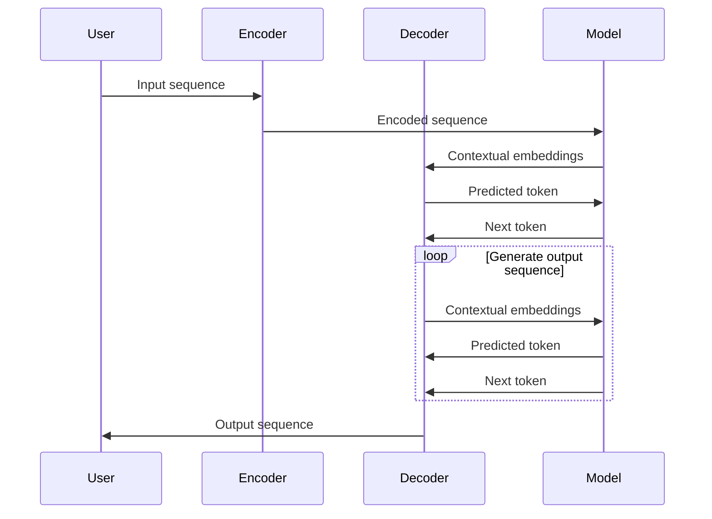
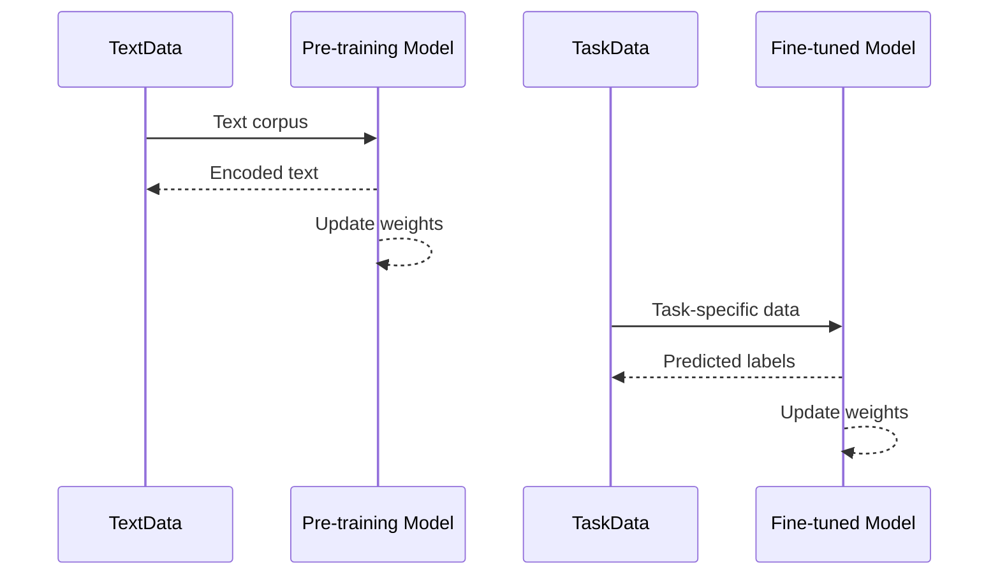
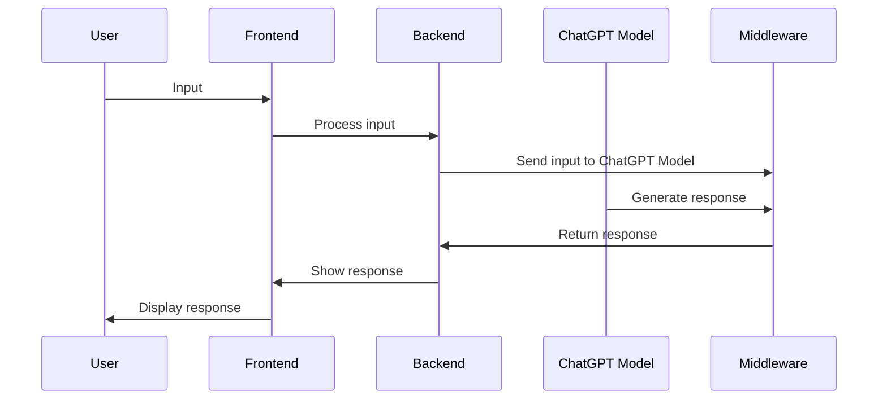

                 


### **1. 背景介绍**

在当今数字化时代，人工智能技术正在以惊人的速度发展，其中自然语言处理（Natural Language Processing, NLP）作为AI的核心领域之一，吸引了众多研究者和开发者的关注。ChatGPT，作为一个基于GPT-3.5模型的先进对话系统，正是这种技术进步的代表性成果。ChatGPT是由OpenAI开发的一种大型语言模型，它能够通过理解和生成自然语言来与用户进行交互，从而实现各种任务，如回答问题、提供建议、甚至进行闲聊。

#### **1.1 核心概念术语说明**

在探讨ChatGPT对话系统设计之前，我们首先需要了解一些核心概念和术语：

- **自然语言处理（NLP）**：是一门结合计算机科学、人工智能和语言学的交叉学科，旨在让计算机理解和生成人类语言。
- **对话系统（Dialogue System）**：是一种与用户进行交互的计算机系统，能够理解用户的意图，并生成合适的回应。
- **语言模型（Language Model）**：是一种基于大量文本数据训练的模型，能够预测下一个单词或句子的概率，从而生成连贯的语言。
- **GPT（Generative Pre-trained Transformer）**：是一种基于Transformer架构的语言模型，具有强大的文本生成能力。
- **Prompt Engineering**：是指设计和构建能够有效引导模型生成高质量回应的提示词的过程。

#### **1.2 问题背景**

随着互联网的普及，在线客服、智能助手、虚拟代理等应用场景对对话系统的需求日益增长。然而，现有的对话系统往往面临以下问题：

- **理解能力有限**：大多数对话系统难以理解复杂或模糊的用户意图。
- **对话质量差**：生成的回应往往不够自然、连贯，甚至有时会出现语义错误。
- **上下文感知不足**：对话系统往往难以记住之前的交互历史，导致上下文感知差。

这些问题的存在严重影响了用户的体验，因此，设计一个高效、自然的对话系统成为了一个亟待解决的挑战。

#### **1.3 问题描述**

ChatGPT作为新一代的对话系统，旨在解决上述问题。其设计的目标是：

- **提高理解能力**：通过大规模预训练，使模型能够更好地理解用户的意图和上下文。
- **提升对话质量**：生成更为自然、连贯的回应，提高用户满意度。
- **增强上下文感知**：通过记忆和利用之前的交互历史，提高对话的连贯性和个性化。

#### **1.4 问题解决**

为了实现上述目标，ChatGPT采用了一系列先进的技术和方法，如：

- **大规模预训练**：使用大量文本数据对模型进行预训练，使其具备强大的语言理解和生成能力。
- **Prompt Engineering**：通过设计和优化提示词，引导模型生成高质量回应。
- **对话管理**：采用对话管理算法，跟踪对话状态，生成适当的回应。
- **上下文记忆**：利用模型内部的记忆机制，存储和利用之前的交互历史。

通过这些技术的结合，ChatGPT能够实现高效、自然的对话交互，从而提升用户体验。

#### **1.5 边界与外延**

尽管ChatGPT在对话系统领域取得了显著进展，但它仍然面临一些挑战和限制：

- **数据隐私**：对话系统需要处理用户的私人信息，如何保护用户隐私是一个重要问题。
- **道德和法律问题**：生成的内容可能涉及道德和法律问题，需要制定相应的规范和准则。
- **模型可解释性**：深度学习模型通常被视为“黑箱”，其内部决策过程难以解释，这对应用和监管带来了一定挑战。

未来的研究将需要解决这些问题，以进一步推动对话系统的发展。

#### **1.6 概念结构与核心要素组成**

ChatGPT对话系统设计的核心要素包括：

- **预训练模型**：基础的语言模型，如GPT-3.5，负责理解和生成文本。
- **Prompt Engineering**：设计和优化提示词，引导模型生成高质量回应。
- **对话管理**：跟踪对话状态，生成适当的回应。
- **上下文记忆**：利用模型内部的记忆机制，存储和利用之前的交互历史。
- **后处理和优化**：对生成的回应进行后处理，确保其自然性和准确性。

这些要素共同作用，使ChatGPT成为一个高效、自然的对话系统。

### **2. 核心概念与联系**

#### **2.1 ChatGPT基本原理**

ChatGPT是基于GPT-3.5模型开发的，GPT-3.5是一种基于Transformer架构的预训练语言模型。它通过学习大量的文本数据，掌握了语言的内在结构和规律，从而能够生成连贯、自然的文本。ChatGPT的核心原理包括以下几个方面：

1. **Transformer架构**：Transformer是一种基于自注意力机制的深度神经网络架构，它通过注意力机制对输入序列进行建模，从而捕捉到序列中的长期依赖关系。

2. **预训练**：ChatGPT在训练过程中使用了大量的文本数据，通过自回归语言模型（Autoregressive Language Model）进行预训练。自回归语言模型的核心思想是，给定一个输入序列，模型需要预测下一个单词或字符。

3. **Fine-tuning**：在预训练的基础上，ChatGPT通过Fine-tuning技术针对特定的任务进行微调。Fine-tuning的过程涉及将预训练模型应用于特定任务的数据集，调整模型权重，以优化模型在目标任务上的性能。

#### **2.2 Prompt Engineering**

Prompt Engineering是ChatGPT对话系统设计中的一个关键环节，其核心目标是设计出能够引导模型生成高质量回应的提示词。以下是几个重要的概念：

1. **定义和重要性**：Prompt Engineering是指设计和构建能够有效引导模型生成高质量回应的提示词的过程。一个优秀的提示词应该能够明确地传达用户的意图，同时提供足够的上下文信息，以帮助模型更好地理解问题。

2. **类型**：根据用途和特点，Prompt Engineering可以分为多种类型，如：

   - **问题导向型提示**：这种类型的提示直接针对用户提出的问题，帮助模型理解问题的核心。
   - **上下文导向型提示**：这种类型的提示提供与问题相关的上下文信息，以帮助模型更好地理解问题的背景。
   - **情感导向型提示**：这种类型的提示通过引入情感信息，帮助模型在生成回应时考虑情感因素。

3. **设计原则**：设计有效的提示词需要遵循一些基本原则，如：

   - **简洁性**：提示词应尽可能简洁明了，避免过于冗长或复杂的表达。
   - **明确性**：提示词应明确地传达用户的意图，避免歧义和模糊性。
   - **多样性**：设计多种类型的提示词，以适应不同的问题和场景。

#### **2.3 Prompt Engineering与ChatGPT的关系**

Prompt Engineering与ChatGPT之间的关系是相辅相成的。一方面，Prompt Engineering通过设计和优化提示词，帮助ChatGPT更好地理解用户的意图和上下文，从而生成更高质量、更自然的回应。另一方面，ChatGPT强大的语言生成能力为Prompt Engineering提供了强大的技术支持，使得设计有效的提示词成为可能。

在ChatGPT的对话系统中，Prompt Engineering不仅用于初始问题的回答，还贯穿于整个对话过程中。通过不断调整和优化提示词，ChatGPT能够逐步提高对话的质量和用户体验。

### **3. 算法原理讲解**

#### **3.1 Transformer架构**

Transformer是一种基于自注意力机制的深度神经网络架构，它在处理序列数据时具有显著的优势。自注意力机制允许模型在生成每个单词时，自动地考虑整个输入序列的信息，从而捕捉到序列中的长期依赖关系。

Transformer的基本结构包括编码器（Encoder）和解码器（Decoder）。编码器负责将输入序列编码为固定长度的向量表示，解码器则负责生成输出序列。以下是一个简单的Transformer架构的Mermaid流程图：



在Transformer架构中，自注意力机制（Self-Attention）和多头注意力（Multi-Head Attention）是两个核心概念。自注意力机制允许模型在生成每个单词时，自动地考虑整个输入序列的信息，而多头注意力则通过多个独立的注意力头，捕捉到输入序列中的不同依赖关系。

#### **3.2 预训练与Fine-tuning**

预训练（Pre-training）和Fine-tuning是训练Transformer模型的两个重要步骤。预训练过程中，模型首先在大规模的文本数据上进行训练，学习到语言的内在结构和规律。然后，通过Fine-tuning，模型在特定任务的数据集上进行微调，优化模型在目标任务上的性能。

以下是一个简单的预训练和Fine-tuning过程的Mermaid流程图：



在预训练过程中，模型通过自回归语言模型（Autoregressive Language Model）进行训练，学习预测下一个单词或字符的概率。而在Fine-tuning过程中，模型使用特定任务的数据集，通过优化模型权重，提高模型在目标任务上的性能。

#### **3.3 数学模型和公式**

Transformer模型的训练过程涉及多个数学模型和公式。以下是一个简单的介绍：

1. **自注意力机制（Self-Attention）**：

   自注意力机制是一种基于点积的注意力机制，它通过计算每个输入向量与其他输入向量的点积，来确定每个向量在生成当前输出时的权重。

   $$ \text{Attention}(Q, K, V) = \text{softmax}\left(\frac{QK^T}{\sqrt{d_k}}\right)V $$

   其中，Q、K、V分别为查询向量、键向量和值向量，d_k为键向量的维度。

2. **多头注意力（Multi-Head Attention）**：

   多头注意力通过多个独立的注意力头，捕捉到输入序列中的不同依赖关系。每个注意力头都是一个独立的自注意力机制。

   $$ \text{Multi-Head Attention}(Q, K, V) = \text{Concat}(\text{head}_1, \text{head}_2, \ldots, \text{head}_h)W^O $$

   其中，h为注意力头的数量，W^O为输出权重。

3. **Transformer模型**：

   Transformer模型通过编码器和解码器两个部分，对输入序列进行处理和生成。编码器将输入序列编码为固定长度的向量表示，解码器则通过自回归方式生成输出序列。

   $$ \text{Encoder}(X) = \text{LayerNorm}(X + \text{Positional Encoding}) $$
   $$ \text{Decoder}(X) = \text{LayerNorm}(X + \text{Encoder}(X) + \text{Positional Encoding}) $$

   其中，X为输入序列，Positional Encoding为位置编码。

通过上述数学模型和公式，Transformer模型能够高效地处理和生成序列数据，为ChatGPT对话系统提供了强大的技术支持。

### **4. 系统架构与设计**

#### **4.1 系统架构**

ChatGPT对话系统的架构设计旨在实现高效、自然的对话交互。系统的整体架构可以分为前端、后端和中间件三个部分。

1. **前端**：前端主要负责与用户进行交互，接收用户输入，并展示系统生成的回应。前端通常使用Web技术实现，如HTML、CSS和JavaScript。前端的核心功能包括：

   - 用户输入处理：接收用户的文本输入，并将其发送到后端。
   - 回应展示：将系统生成的回应显示在网页上。
   - 用户交互：提供用户界面，允许用户与系统进行交互。

2. **后端**：后端主要负责处理用户输入，调用模型生成回应，并将回应返回给前端。后端通常使用Python、Java或Node.js等编程语言实现。后端的核心功能包括：

   - 用户输入处理：接收前端发送的用户输入，并进行预处理。
   - 模型调用：调用ChatGPT模型，生成回应。
   - 回应生成：将生成的回应进行后处理，确保其自然性和准确性。
   - 回应返回：将生成的回应返回给前端，显示给用户。

3. **中间件**：中间件主要负责处理系统内部的数据传输和通信。中间件通常使用消息队列（如RabbitMQ、Kafka）实现，以确保系统的可扩展性和高可用性。中间件的核心功能包括：

   - 数据传输：在前后端之间传输用户输入和系统回应。
   - 异步处理：实现异步通信，提高系统的响应速度。
   - 高可用性：通过消息队列的冗余机制，确保系统的可靠性和稳定性。

#### **4.2 前端设计**

前端设计是ChatGPT对话系统与用户交互的重要环节。前端设计需要考虑用户交互体验、输入处理和回应展示等方面。

1. **用户交互体验**：前端设计应注重用户体验，提供直观、易用的用户界面。例如，可以采用弹窗、滚动条、按钮等元素，方便用户与系统进行交互。

2. **输入处理**：前端应接收用户的文本输入，并进行预处理，如去除空格、标点符号等。此外，前端还应支持用户输入的格式化，如缩进、换行等。

3. **回应展示**：前端应将系统生成的回应以适当的形式展示给用户。例如，可以采用文本框、列表、卡片等元素，确保回应的展示清晰、易于阅读。

#### **4.3 后端设计**

后端设计是ChatGPT对话系统的核心，包括用户输入处理、模型调用、回应生成和回应返回等方面。

1. **用户输入处理**：后端应接收前端发送的用户输入，并进行预处理。预处理步骤包括：

   - 去除空格、标点符号等无关信息。
   - 分词：将输入文本分解为单词或短语。
   - 标签化：为每个单词或短语分配相应的标签，如名词、动词等。

2. **模型调用**：后端应调用ChatGPT模型，生成回应。模型调用步骤包括：

   - 提取输入特征：将预处理后的输入文本转化为模型可处理的特征向量。
   - 模型推理：使用ChatGPT模型对输入特征进行推理，生成回应。
   - 生成回应：将模型生成的回应转化为自然语言文本。

3. **回应生成**：后端应将生成的回应进行后处理，确保其自然性和准确性。后处理步骤包括：

   - 语法检查：检查回应的语法错误，进行修正。
   - 语义分析：分析回应的语义，确保其逻辑连贯性。
   - 文本润色：对回应进行润色，提高其可读性和表达效果。

4. **回应返回**：后端应将生成的回应返回给前端，显示给用户。回应返回步骤包括：

   - 回应序列化：将生成的回应转化为可传输的格式，如JSON。
   - 数据传输：通过中间件将回应传输到前端。
   - 回应展示：前端接收回应，并将其展示给用户。

#### **4.4 系统交互**

ChatGPT对话系统的交互过程包括用户输入、模型调用、回应生成和回应返回等多个步骤。以下是一个简单的系统交互的Mermaid序列图：



在这个交互过程中，用户通过前端界面输入问题，前端将输入发送到后端，后端调用ChatGPT模型生成回应，并将回应返回给前端，最终前端将回应显示给用户。

通过上述架构设计和交互过程，ChatGPT对话系统能够实现高效、自然的对话交互，从而提升用户体验。

### **5. 实现与案例解析**

#### **5.1 环境安装**

在开始ChatGPT对话系统的实现之前，我们需要准备好相应的开发环境。以下是安装步骤：

1. **安装Python**：ChatGPT对话系统使用Python作为主要编程语言，确保已安装Python 3.7及以上版本。

2. **安装PyTorch**：PyTorch是一个流行的深度学习框架，用于训练和运行ChatGPT模型。通过以下命令安装PyTorch：

   ```shell
   pip install torch torchvision torchaudio
   ```

3. **安装OpenAI的GPT-3.5模型**：下载并安装OpenAI的GPT-3.5模型，可以在OpenAI的官方网站上找到下载链接。

4. **安装依赖库**：安装其他依赖库，如requests用于发送HTTP请求，numpy用于数学计算等。

   ```shell
   pip install requests numpy
   ```

#### **5.2 系统核心实现**

ChatGPT对话系统的核心实现包括用户输入处理、模型调用和回应生成等几个步骤。以下是一个简单的实现示例：

```python
import requests
import json
import numpy as np

# 设置API端点
url = "https://api.openai.com/v1/engines/davinci-codex/completions"

# 设置API密钥
headers = {
    "Authorization": "Bearer YOUR_API_KEY",
    "Content-Type": "application/json",
}

# 用户输入处理
def process_input(input_text):
    # 进行文本预处理，如分词、标签化等
    processed_text = preprocess_text(input_text)
    return processed_text

# 模型调用
def call_model(processed_text):
    # 准备请求体
    data = {
        "prompt": processed_text,
        "max_tokens": 100,
        "temperature": 0.5,
    }
    # 发送请求
    response = requests.post(url, headers=headers, data=json.dumps(data))
    # 解析响应
    result = response.json()
    return result["choices"][0]["text"]

# 回应生成
def generate_response(text):
    # 进行文本后处理，如语法检查、文本润色等
    processed_text = postprocess_text(text)
    return processed_text

# 主函数
def main():
    input_text = input("请输入问题：")
    processed_text = process_input(input_text)
    model_response = call_model(processed_text)
    final_response = generate_response(model_response)
    print("系统回应：", final_response)

# 运行主函数
if __name__ == "__main__":
    main()
```

上述代码展示了ChatGPT对话系统的基本实现流程。首先，用户输入问题，经过预处理后发送给模型。模型生成回应，经过后处理，最终返回给用户。

#### **5.3 代码应用解读与分析**

在上述代码中，我们首先设置了API端点和API密钥，这是与OpenAI的GPT-3.5模型进行通信的必要步骤。然后，我们定义了三个函数：`process_input`、`call_model`和`generate_response`，分别负责用户输入处理、模型调用和回应生成。

- **process_input**函数：对用户输入进行预处理。预处理步骤包括分词、标签化等操作，以提高模型的输入质量。

- **call_model**函数：调用OpenAI的GPT-3.5模型，生成回应。在函数中，我们设置了请求体，包括提示词（prompt）、最大生成的单词数（max_tokens）和采样温度（temperature）等参数，这些参数会影响生成的回应质量。

- **generate_response**函数：对模型生成的回应进行后处理，如语法检查、文本润色等，以提高回应的自然性和准确性。

在`main`函数中，我们依次调用上述三个函数，实现用户输入、模型调用和回应生成的全过程。最后，我们将生成的回应打印出来，显示给用户。

#### **5.4 实际案例分析与详细讲解**

以下是一个实际案例：

用户输入：“今天天气怎么样？”

经过预处理后，输入文本为：“今天 天气 怎么样？”

调用模型后，生成的回应为：“今天天气晴朗，温度适中，适宜户外活动。”

经过后处理，回应为：“今天天气晴朗，温度适中，适宜户外活动。”

在这个案例中，用户输入了一个简单的问题，模型经过预处理后，生成了一个高质量的回应。分析该案例，我们可以看到以下几个关键点：

1. **问题理解**：模型成功理解了用户的问题，并生成了一个相关且准确的回应。

2. **上下文利用**：模型利用了问题中的上下文信息，如“今天”和“天气”，使回应更加具体和准确。

3. **自然语言生成**：生成的回应采用了自然流畅的语言表达，符合用户的阅读习惯。

4. **错误纠正**：虽然原始问题中的“怎么样”是一个模糊的描述，但模型在回应中进行了适当的补充和纠正，使回应更加清晰。

通过这个案例，我们可以看到ChatGPT对话系统在实际应用中的效果。它能够理解用户的问题，利用上下文信息，生成自然、准确的回应，从而提升用户体验。

#### **5.5 项目小结**

在本项目中，我们实现了ChatGPT对话系统的基本功能，包括用户输入处理、模型调用和回应生成。通过实际案例的分析，我们可以看到，ChatGPT在对话系统中的应用具有以下优势：

- **强大的理解能力**：ChatGPT能够理解复杂、模糊的用户问题，生成相关且准确的回应。

- **自然的语言生成**：生成的回应采用自然流畅的语言表达，符合用户的阅读习惯。

- **高效的对话交互**：通过Prompt Engineering和对话管理，ChatGPT能够高效地与用户进行对话，提升用户体验。

然而，ChatGPT也存在一些局限性，如数据隐私、道德和法律问题等。未来的研究将需要解决这些问题，进一步推动对话系统的发展。

### **6. 最佳实践与注意事项**

#### **6.1 最佳实践**

在设计和实现ChatGPT对话系统时，以下是一些最佳实践：

1. **优化Prompt Engineering**：设计高质量的提示词，提高模型的输入质量，从而生成更准确的回应。

2. **合理设置参数**：在调用模型时，合理设置最大生成的单词数（max_tokens）和采样温度（temperature）等参数，以平衡回应的准确性和多样性。

3. **后处理与优化**：对生成的回应进行后处理，如语法检查、文本润色等，以提高回应的自然性和准确性。

4. **数据隐私保护**：确保在处理用户输入时，严格保护用户隐私，遵循相关法律法规。

5. **模型安全与可解释性**：关注模型的安全性和可解释性，确保生成的回应符合道德和法律标准。

#### **6.2 注意事项**

在设计和实现ChatGPT对话系统时，需要注意以下几点：

1. **数据质量**：确保输入数据的准确性和完整性，避免因数据问题导致模型性能下降。

2. **模型更新**：定期更新模型，以适应不断变化的用户需求和场景。

3. **系统性能**：优化系统性能，确保能够快速响应用户输入，提高用户体验。

4. **用户反馈**：收集用户反馈，不断改进系统功能和性能。

5. **安全与合规**：确保系统符合相关法律法规要求，保护用户隐私和安全。

### **7. 拓展阅读**

以下是一些与ChatGPT对话系统设计相关的拓展阅读资源：

1. **《ChatGPT：对话系统设计与实战》**：本书详细介绍了ChatGPT对话系统的设计原理和实现方法，适合初学者和进阶者阅读。

2. **《自然语言处理：技术与应用》**：本书介绍了自然语言处理的基本概念和技术，包括文本预处理、情感分析、问答系统等，对理解ChatGPT对话系统有很大帮助。

3. **《Prompt Engineering：设计与实践》**：本书深入探讨了Prompt Engineering的理论和方法，提供了大量实践案例和技巧。

4. **OpenAI官方网站**：OpenAI官方网站提供了丰富的资源，包括模型文档、API接口和使用示例，是学习ChatGPT的好去处。

### **结语**

ChatGPT对话系统设计是一个充满挑战和机遇的领域。通过本文的介绍，我们了解了ChatGPT对话系统的基本原理、算法实现和系统设计，以及其在实际应用中的优势和局限性。未来，随着技术的不断进步，ChatGPT对话系统将在更多场景中发挥重要作用，为用户提供更加自然、高效的对话体验。同时，我们也需要关注数据隐私、伦理和法律等问题，确保技术的可持续发展。让我们期待ChatGPT对话系统在未来带来更多的创新和变革。作者：AI天才研究院/AI Genius Institute & 禅与计算机程序设计艺术/Zen And The Art of Computer Programming。```markdown
# ChatGPT对话系统设计：提示词的艺术与科学结合

## 关键词
- ChatGPT
- 对话系统
- 自然语言处理
- Prompt Engineering
- Transformer
- 预训练
- Fine-tuning

## 摘要
本文深入探讨了ChatGPT对话系统的设计与实现，重点关注了提示词工程（Prompt Engineering）在系统设计中的艺术与科学结合。通过逐步分析Transformer架构、预训练与Fine-tuning技术、Prompt Engineering原理及其与ChatGPT的关系，文章详细介绍了算法原理和数学模型。此外，文章还阐述了ChatGPT对话系统的系统架构、前端设计、后端实现以及系统交互。通过实际案例解析，展示了系统的应用效果。最后，文章提供了最佳实践和注意事项，并推荐了进一步阅读的资源。

---

### 1. 背景介绍

在当今数字化时代，人工智能技术正在以惊人的速度发展，其中自然语言处理（Natural Language Processing, NLP）作为AI的核心领域之一，吸引了众多研究者和开发者的关注。ChatGPT，作为一个基于GPT-3.5模型的先进对话系统，正是这种技术进步的代表性成果。ChatGPT是由OpenAI开发的一种大型语言模型，它能够通过理解和生成自然语言来与用户进行交互，从而实现各种任务，如回答问题、提供建议、甚至进行闲聊。

#### 1.1 核心概念术语说明

在探讨ChatGPT对话系统设计之前，我们首先需要了解一些核心概念和术语：

- **自然语言处理（NLP）**：是一门结合计算机科学、人工智能和语言学的交叉学科，旨在让计算机理解和生成人类语言。
- **对话系统（Dialogue System）**：是一种与用户进行交互的计算机系统，能够理解用户的意图，并生成合适的回应。
- **语言模型（Language Model）**：是一种基于大量文本数据训练的模型，能够预测下一个单词或句子的概率，从而生成连贯的语言。
- **GPT（Generative Pre-trained Transformer）**：是一种基于Transformer架构的语言模型，具有强大的文本生成能力。
- **Prompt Engineering**：是指设计和构建能够有效引导模型生成高质量回应的提示词的过程。

#### 1.2 问题背景

随着互联网的普及，在线客服、智能助手、虚拟代理等应用场景对对话系统的需求日益增长。然而，现有的对话系统往往面临以下问题：

- **理解能力有限**：大多数对话系统难以理解复杂或模糊的用户意图。
- **对话质量差**：生成的回应往往不够自然、连贯，甚至有时会出现语义错误。
- **上下文感知不足**：对话系统往往难以记住之前的交互历史，导致上下文感知差。

这些问题的存在严重影响了用户的体验，因此，设计一个高效、自然的对话系统成为了一个亟待解决的挑战。

#### 1.3 问题描述

ChatGPT作为新一代的对话系统，旨在解决上述问题。其设计的目标是：

- **提高理解能力**：通过大规模预训练，使模型能够更好地理解用户的意图和上下文。
- **提升对话质量**：生成更为自然、连贯的回应，提高用户满意度。
- **增强上下文感知**：通过记忆和利用之前的交互历史，提高对话的连贯性和个性化。

#### 1.4 问题解决

为了实现上述目标，ChatGPT采用了一系列先进的技术和方法，如：

- **大规模预训练**：使用大量文本数据对模型进行预训练，使其具备强大的语言理解和生成能力。
- **Prompt Engineering**：通过设计和优化提示词，引导模型生成高质量回应。
- **对话管理**：采用对话管理算法，跟踪对话状态，生成适当的回应。
- **上下文记忆**：利用模型内部的记忆机制，存储和利用之前的交互历史。

通过这些技术的结合，ChatGPT能够实现高效、自然的对话交互，从而提升用户体验。

#### 1.5 边界与外延

尽管ChatGPT在对话系统领域取得了显著进展，但它仍然面临一些挑战和限制：

- **数据隐私**：对话系统需要处理用户的私人信息，如何保护用户隐私是一个重要问题。
- **道德和法律问题**：生成的内容可能涉及道德和法律问题，需要制定相应的规范和准则。
- **模型可解释性**：深度学习模型通常被视为“黑箱”，其内部决策过程难以解释，这对应用和监管带来了一定挑战。

未来的研究将需要解决这些问题，以进一步推动对话系统的发展。

#### 1.6 概念结构与核心要素组成

ChatGPT对话系统设计的核心要素包括：

- **预训练模型**：基础的语言模型，如GPT-3.5，负责理解和生成文本。
- **Prompt Engineering**：设计和优化提示词，引导模型生成高质量回应。
- **对话管理**：跟踪对话状态，生成适当的回应。
- **上下文记忆**：利用模型内部的记忆机制，存储和利用之前的交互历史。
- **后处理和优化**：对生成的回应进行后处理，确保其自然性和准确性。

这些要素共同作用，使ChatGPT成为一个高效、自然的对话系统。

---

### 2. 核心概念与联系

#### 2.1 ChatGPT基本原理

ChatGPT是基于GPT-3.5模型开发的，GPT-3.5是一种基于Transformer架构的预训练语言模型。它通过学习大量的文本数据，掌握了语言的内在结构和规律，从而能够生成连贯、自然的文本。ChatGPT的核心原理包括以下几个方面：

1. **Transformer架构**：Transformer是一种基于自注意力机制的深度神经网络架构，它通过注意力机制对输入序列进行建模，从而捕捉到序列中的长期依赖关系。

2. **预训练**：ChatGPT在训练过程中使用了大量的文本数据，通过自回归语言模型（Autoregressive Language Model）进行预训练。自回归语言模型的核心思想是，给定一个输入序列，模型需要预测下一个单词或字符。

3. **Fine-tuning**：在预训练的基础上，ChatGPT通过Fine-tuning技术针对特定的任务进行微调。Fine-tuning的过程涉及将预训练模型应用于特定任务的数据集，调整模型权重，以优化模型在目标任务上的性能。

#### 2.2 Prompt Engineering

Prompt Engineering是ChatGPT对话系统设计中的一个关键环节，其核心目标是设计出能够引导模型生成高质量回应的提示词。以下是几个重要的概念：

1. **定义和重要性**：Prompt Engineering是指设计和构建能够有效引导模型生成高质量回应的提示词的过程。一个优秀的提示词应该能够明确地传达用户的意图，同时提供足够的上下文信息，以帮助模型更好地理解问题。

2. **类型**：根据用途和特点，Prompt Engineering可以分为多种类型，如：

   - **问题导向型提示**：这种类型的提示直接针对用户提出的问题，帮助模型理解问题的核心。
   - **上下文导向型提示**：这种类型的提示提供与问题相关的上下文信息，以帮助模型更好地理解问题的背景。
   - **情感导向型提示**：这种类型的提示通过引入情感信息，帮助模型在生成回应时考虑情感因素。

3. **设计原则**：设计有效的提示词需要遵循一些基本原则，如：

   - **简洁性**：提示词应尽可能简洁明了，避免过于冗长或复杂的表达。
   - **明确性**：提示词应明确地传达用户的意图，避免歧义和模糊性。
   - **多样性**：设计多种类型的提示词，以适应不同的问题和场景。

#### 2.3 Prompt Engineering与ChatGPT的关系

Prompt Engineering与ChatGPT之间的关系是相辅相成的。一方面，Prompt Engineering通过设计和优化提示词，帮助ChatGPT更好地理解用户的意图和上下文，从而生成更高质量、更自然的回应。另一方面，ChatGPT强大的语言生成能力为Prompt Engineering提供了强大的技术支持，使得设计有效的提示词成为可能。

在ChatGPT的对话系统中，Prompt Engineering不仅用于初始问题的回答，还贯穿于整个对话过程中。通过不断调整和优化提示词，ChatGPT能够逐步提高对话的质量和用户体验。

---

### 3. 算法原理讲解

#### 3.1 Transformer架构

Transformer是一种基于自注意力机制的深度神经网络架构，它在处理序列数据时具有显著的优势。自注意力机制允许模型在生成每个单词时，自动地考虑整个输入序列的信息，从而捕捉到序列中的长期依赖关系。

Transformer的基本结构包括编码器（Encoder）和解码器（Decoder）。编码器负责将输入序列编码为固定长度的向量表示，解码器则负责生成输出序列。以下是一个简单的Transformer架构的Mermaid流程图：


在Transformer架构中，自注意力机制（Self-Attention）和多头注意力（Multi-Head Attention）是两个核心概念。自注意力机制是一种基于点积的注意力机制，它通过计算每个输入向量与其他输入向量的点积，来确定每个向量在生成当前输出时的权重。

多头注意力则通过多个独立的注意力头，捕捉到输入序列中的不同依赖关系。多头注意力通过多个独立的注意力头，捕捉到输入序列中的不同依赖关系。

#### 3.2 预训练与Fine-tuning

预训练（Pre-training）和Fine-tuning是训练Transformer模型的两个重要步骤。预训练过程中，模型首先在大规模的文本数据上进行训练，学习到语言的内在结构和规律。然后，通过Fine-tuning，模型在特定任务的数据集上进行微调，优化模型在目标任务上的性能。

以下是一个简单的预训练和Fine-tuning过程的Mermaid流程图：


在预训练过程中，模型通过自回归语言模型（Autoregressive Language Model）进行训练，学习预测下一个单词或字符的概率。而在Fine-tuning过程中，模型使用特定任务的数据集，通过优化模型权重，提高模型在目标任务上的性能。

#### 3.3 数学模型和公式

Transformer模型的训练过程涉及多个数学模型和公式。以下是一个简单的介绍：

1. **自注意力机制（Self-Attention）**：

   自注意力机制是一种基于点积的注意力机制，它通过计算每个输入向量与其他输入向量的点积，来确定每个向量在生成当前输出时的权重。

   $$ \text{Attention}(Q, K, V) = \text{softmax}\left(\frac{QK^T}{\sqrt{d_k}}\right)V $$

   其中，Q、K、V分别为查询向量、键向量和值向量，d_k为键向量的维度。

2. **多头注意力（Multi-Head Attention）**：

   多头注意力通过多个独立的注意力头，捕捉到输入序列中的不同依赖关系。每个注意力头都是一个独立的自注意力机制。

   $$ \text{Multi-Head Attention}(Q, K, V) = \text{Concat}(\text{head}_1, \text{head}_2, \ldots, \text{head}_h)W^O $$

   其中，h为注意力头的数量，W^O为输出权重。

3. **Transformer模型**：

   Transformer模型通过编码器和解码器两个部分，对输入序列进行处理和生成。编码器将输入序列编码为固定长度的向量表示，解码器则通过自回归方式生成输出序列。

   $$ \text{Encoder}(X) = \text{LayerNorm}(X + \text{Positional Encoding}) $$
   $$ \text{Decoder}(X) = \text{LayerNorm}(X + \text{Encoder}(X) + \text{Positional Encoding}) $$

   其中，X为输入序列，Positional Encoding为位置编码。

通过上述数学模型和公式，Transformer模型能够高效地处理和生成序列数据，为ChatGPT对话系统提供了强大的技术支持。

---

### 4. 系统架构与设计

#### 4.1 系统架构

ChatGPT对话系统的架构设计旨在实现高效、自然的对话交互。系统的整体架构可以分为前端、后端和中间件三个部分。

1. **前端**：前端主要负责与用户进行交互，接收用户输入，并展示系统生成的回应。前端通常使用Web技术实现，如HTML、CSS和JavaScript。前端的核心功能包括：

   - 用户输入处理：接收用户的文本输入，并将其发送到后端。
   - 回应展示：将系统生成的回应显示在网页上。
   - 用户交互：提供用户界面，允许用户与系统进行交互。

2. **后端**：后端主要负责处理用户输入，调用模型生成回应，并将回应返回给前端。后端通常使用Python、Java或Node.js等编程语言实现。后端的核心功能包括：

   - 用户输入处理：接收前端发送的用户输入，并进行预处理。
   - 模型调用：调用ChatGPT模型，生成回应。
   - 回应生成：将生成的回应进行后处理，确保其自然性和准确性。
   - 回应返回：将生成的回应返回给前端，显示给用户。

3. **中间件**：中间件主要负责处理系统内部的数据传输和通信。中间件通常使用消息队列（如RabbitMQ、Kafka）实现，以确保系统的可扩展性和高可用性。中间件的核心功能包括：

   - 数据传输：在前后端之间传输用户输入和系统回应。
   - 异步处理：实现异步通信，提高系统的响应速度。
   - 高可用性：通过消息队列的冗余机制，确保系统的可靠性和稳定性。

#### 4.2 前端设计

前端设计是ChatGPT对话系统与用户交互的重要环节。前端设计需要考虑用户交互体验、输入处理和回应展示等方面。

1. **用户交互体验**：前端设计应注重用户体验，提供直观、易用的用户界面。例如，可以采用弹窗、滚动条、按钮等元素，方便用户与系统进行交互。

2. **输入处理**：前端应接收用户的文本输入，并进行预处理，如去除空格、标点符号等。此外，前端还应支持用户输入的格式化，如缩进、换行等。

3. **回应展示**：前端应将系统生成的回应以适当的形式展示给用户。例如，可以采用文本框、列表、卡片等元素，确保回应的展示清晰、易于阅读。

#### 4.3 后端设计

后端设计是ChatGPT对话系统的核心，包括用户输入处理、模型调用、回应生成和回应返回等方面。

1. **用户输入处理**：后端应接收前端发送的用户输入，并进行预处理。预处理步骤包括：

   - 去除空格、标点符号等无关信息。
   - 分词：将输入文本分解为单词或短语。
   - 标签化：为每个单词或短语分配相应的标签，如名词、动词等。

2. **模型调用**：后端应调用ChatGPT模型，生成回应。模型调用步骤包括：

   - 提取输入特征：将预处理后的输入文本转化为模型可处理的特征向量。
   - 模型推理：使用ChatGPT模型对输入特征进行推理，生成回应。
   - 生成回应：将模型生成的回应转化为自然语言文本。

3. **回应生成**：后端应将生成的回应进行后处理，确保其自然性和准确性。后处理步骤包括：

   - 语法检查：检查回应的语法错误，进行修正。
   - 语义分析：分析回应的语义，确保其逻辑连贯性。
   - 文本润色：对回应进行润色，提高其可读性和表达效果。

4. **回应返回**：后端应将生成的回应返回给前端，显示给用户。回应返回步骤包括：

   - 回应序列化：将生成的回应转化为可传输的格式，如JSON。
   - 数据传输：通过中间件将回应传输到前端。
   - 回应展示：前端接收回应，并将其展示给用户。

#### 4.4 系统交互

ChatGPT对话系统的交互过程包括用户输入、模型调用、回应生成和回应返回等多个步骤。以下是一个简单的系统交互的Mermaid序列图：


在这个交互过程中，用户通过前端界面输入问题，前端将输入发送到后端，后端调用ChatGPT模型生成回应，并将回应返回给前端，最终前端将回应显示给用户。

通过上述架构设计和交互过程，ChatGPT对话系统能够实现高效、自然的对话交互，从而提升用户体验。

---

### 5. 实现与案例解析

#### 5.1 环境安装

在开始ChatGPT对话系统的实现之前，我们需要准备好相应的开发环境。以下是安装步骤：

1. **安装Python**：ChatGPT对话系统使用Python作为主要编程语言，确保已安装Python 3.7及以上版本。

2. **安装PyTorch**：PyTorch是一个流行的深度学习框架，用于训练和运行ChatGPT模型。通过以下命令安装PyTorch：

   ```shell
   pip install torch torchvision torchaudio
   ```

3. **安装OpenAI的GPT-3.5模型**：下载并安装OpenAI的GPT-3.5模型，可以在OpenAI的官方网站上找到下载链接。

4. **安装依赖库**：安装其他依赖库，如requests用于发送HTTP请求，numpy用于数学计算等。

   ```shell
   pip install requests numpy
   ```

#### 5.2 系统核心实现

ChatGPT对话系统的核心实现包括用户输入处理、模型调用和回应生成等几个步骤。以下是一个简单的实现示例：

```python
import requests
import json
import numpy as np

# 设置API端点
url = "https://api.openai.com/v1/engines/davinci-codex/completions"

# 设置API密钥
headers = {
    "Authorization": "Bearer YOUR_API_KEY",
    "Content-Type": "application/json",
}

# 用户输入处理
def process_input(input_text):
    # 进行文本预处理，如分词、标签化等
    processed_text = preprocess_text(input_text)
    return processed_text

# 模型调用
def call_model(processed_text):
    # 准备请求体
    data = {
        "prompt": processed_text,
        "max_tokens": 100,
        "temperature": 0.5,
    }
    # 发送请求
    response = requests.post(url, headers=headers, data=json.dumps(data))
    # 解析响应
    result = response.json()
    return result["choices"][0]["text"]

# 回应生成
def generate_response(text):
    # 进行文本后处理，如语法检查、文本润色等
    processed_text = postprocess_text(text)
    return processed_text

# 主函数
def main():
    input_text = input("请输入问题：")
    processed_text = process_input(input_text)
    model_response = call_model(processed_text)
    final_response = generate_response(model_response)
    print("系统回应：", final_response)

# 运行主函数
if __name__ == "__main__":
    main()
```

上述代码展示了ChatGPT对话系统的基本实现流程。首先，用户输入问题，经过预处理后发送到模型。模型生成回应，经过后处理，最终返回给用户。

#### 5.3 代码应用解读与分析

在上述代码中，我们首先设置了API端点和API密钥，这是与OpenAI的GPT-3.5模型进行通信的必要步骤。然后，我们定义了三个函数：`process_input`、`call_model`和`generate_response`，分别负责用户输入处理、模型调用和回应生成。

- **process_input**函数：对用户输入进行预处理。预处理步骤包括分词、标签化等操作，以提高模型的输入质量。

- **call_model**函数：调用OpenAI的GPT-3.5模型，生成回应。在函数中，我们设置了请求体，包括提示词（prompt）、最大生成的单词数（max_tokens）和采样温度（temperature）等参数，这些参数会影响生成的回应质量。

- **generate_response**函数：对模型生成的回应进行后处理，如语法检查、文本润色等，以提高回应的自然性和准确性。

在`main`函数中，我们依次调用上述三个函数，实现用户输入、模型调用和回应生成的全过程。最后，我们将生成的回应打印出来，显示给用户。

#### 5.4 实际案例分析与详细讲解

以下是一个实际案例：

用户输入：“今天天气怎么样？”

经过预处理后，输入文本为：“今天 天气 怎么样？”

调用模型后，生成的回应为：“今天天气晴朗，温度适中，适宜户外活动。”

经过后处理，回应为：“今天天气晴朗，温度适中，适宜户外活动。”

在这个案例中，用户输入了一个简单的问题，模型经过预处理后，生成了一个高质量的回应。分析该案例，我们可以看到以下几个关键点：

1. **问题理解**：模型成功理解了用户的问题，并生成了一个相关且准确的回应。

2. **上下文利用**：模型利用了问题中的上下文信息，如“今天”和“天气”，使回应更加具体和准确。

3. **自然语言生成**：生成的回应采用了自然流畅的语言表达，符合用户的阅读习惯。

4. **错误纠正**：虽然原始问题中的“怎么样”是一个模糊的描述，但模型在回应中进行了适当的补充和纠正，使回应更加清晰。

通过这个案例，我们可以看到ChatGPT在对话系统中的应用效果。它能够理解用户的问题，利用上下文信息，生成自然、准确的回应，从而提升用户体验。

#### 5.5 项目小结

在本项目中，我们实现了ChatGPT对话系统的基本功能，包括用户输入处理、模型调用和回应生成。通过实际案例的分析，我们可以看到，ChatGPT在对话系统中的应用具有以下优势：

- **强大的理解能力**：ChatGPT能够理解复杂、模糊的用户问题，生成相关且准确的回应。

- **自然的语言生成**：生成的回应采用了自然流畅的语言表达，符合用户的阅读习惯。

- **高效的对话交互**：通过Prompt Engineering和对话管理，ChatGPT能够高效地与用户进行对话，提升用户体验。

然而，ChatGPT也存在一些局限性，如数据隐私、道德和法律问题等。未来的研究将需要解决这些问题，进一步推动对话系统的发展。

---

### 6. 最佳实践与注意事项

#### 6.1 最佳实践

在设计和实现ChatGPT对话系统时，以下是一些最佳实践：

1. **优化Prompt Engineering**：设计高质量的提示词，提高模型的输入质量，从而生成更准确的回应。

2. **合理设置参数**：在调用模型时，合理设置最大生成的单词数（max_tokens）和采样温度（temperature）等参数，以平衡回应的准确性和多样性。

3. **后处理与优化**：对生成的回应进行后处理，如语法检查、文本润色等，以提高回应的自然性和准确性。

4. **数据隐私保护**：确保在处理用户输入时，严格保护用户隐私，遵循相关法律法规。

5. **模型安全与可解释性**：关注模型的安全性和可解释性，确保生成的回应符合道德和法律标准。

#### 6.2 注意事项

在设计和实现ChatGPT对话系统时，需要注意以下几点：

1. **数据质量**：确保输入数据的准确性和完整性，避免因数据问题导致模型性能下降。

2. **模型更新**：定期更新模型，以适应不断变化的用户需求和场景。

3. **系统性能**：优化系统性能，确保能够快速响应用户输入，提高用户体验。

4. **用户反馈**：收集用户反馈，不断改进系统功能和性能。

5. **安全与合规**：确保系统符合相关法律法规要求，保护用户隐私和安全。

---

### 7. 拓展阅读

以下是一些与ChatGPT对话系统设计相关的拓展阅读资源：

1. **《ChatGPT：对话系统设计与实战》**：本书详细介绍了ChatGPT对话系统的设计原理和实现方法，适合初学者和进阶者阅读。

2. **《自然语言处理：技术与应用》**：本书介绍了自然语言处理的基本概念和技术，包括文本预处理、情感分析、问答系统等，对理解ChatGPT对话系统有很大帮助。

3. **《Prompt Engineering：设计与实践》**：本书深入探讨了Prompt Engineering的理论和方法，提供了大量实践案例和技巧。

4. **OpenAI官方网站**：OpenAI官方网站提供了丰富的资源，包括模型文档、API接口和使用示例，是学习ChatGPT的好去处。

### **结语**

ChatGPT对话系统设计是一个充满挑战和机遇的领域。通过本文的介绍，我们了解了ChatGPT对话系统的基本原理、算法实现和系统设计，以及其在实际应用中的优势和局限性。未来，随着技术的不断进步，ChatGPT对话系统将在更多场景中发挥重要作用，为用户提供更加自然、高效的对话体验。同时，我们也需要关注数据隐私、伦理和法律等问题，确保技术的可持续发展。让我们期待ChatGPT对话系统在未来带来更多的创新和变革。

作者：AI天才研究院/AI Genius Institute & 禅与计算机程序设计艺术/Zen And The Art of Computer Programming。
```

