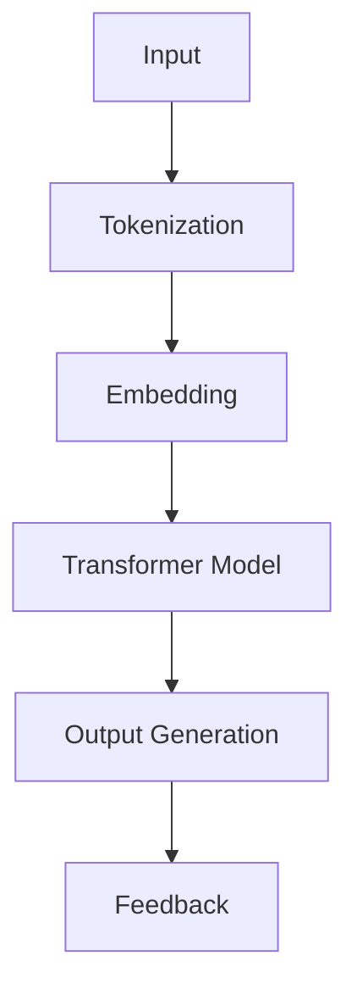
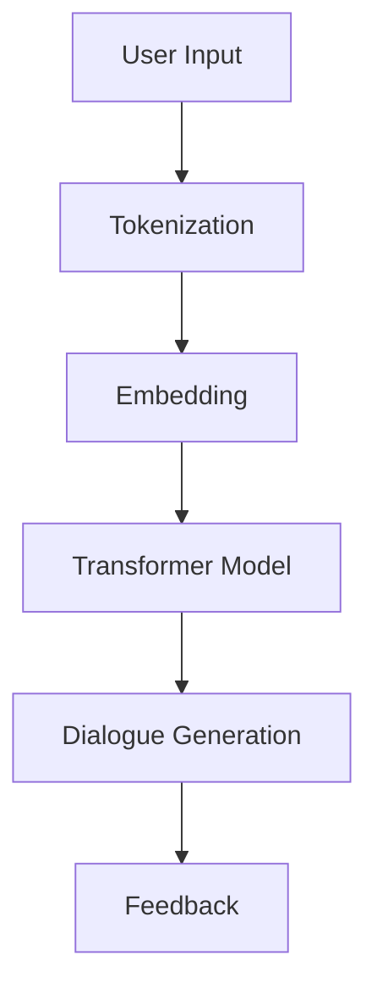
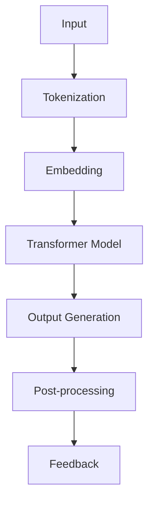

                 

当然，我们可以一步一步地思考并构建这篇文章。以下是详细的步骤和内容：

### 第一步：确定文章标题、关键词和摘要

**文章标题**：ChatGPT对话质量提升：提示词的关键作用解析

**关键词**：ChatGPT、对话质量、提示词、自然语言处理、算法优化

**摘要**：本文将探讨如何通过优化提示词来提升ChatGPT的对话质量。我们将详细分析ChatGPT的工作原理，介绍提示词的设计原则和优化方法，并通过实际案例展示如何应用这些方法。

### 第二步：构建文章的目录大纲

根据您提供的结构，我们可以构建如下的目录大纲：

**第1章 引言与背景**
1.1 问题背景
1.2 问题描述
1.3 问题解决
1.4 边界与外延

**第2章 核心概念与联系**
2.1 ChatGPT的基本概念
2.2 提示词的关键作用
2.3 ChatGPT与自然语言处理的关系
2.4 Mermaid图解：ChatGPT的核心结构

**第3章 ChatGPT的工作原理**
3.1 算法原理讲解
3.2 Mermaid流程图：GPT算法流程
3.3 Python源代码实现
3.4 数学模型和公式
3.5 举例说明

**第4章 对话质量的评估**
4.1 评估指标
4.2 评估方法
4.3 实际案例

**第5章 提示词设计与优化**
5.1 提示词设计原则
5.2 提示词优化方法
5.3 提示词设计工具
5.4 实际应用案例

**第6章 ChatGPT在具体场景中的应用**
6.1 教育场景
6.2 商业咨询
6.3 电商平台
6.4 医疗咨询

**第7章 最佳实践与未来展望**
7.1 最佳实践技巧
7.2 注意事项与风险
7.3 未来发展趋势

### 第三步：撰写每章的内容

我们需要按照上述目录大纲，逐章撰写详细的内容。以下是一个大致的内容框架：

**第1章 引言与背景**
- 介绍ChatGPT在当前AI领域的地位和作用
- 提出对话质量问题以及其对用户体验的影响
- 阐述本文的目的和结构

**第2章 核心概念与联系**
- 定义ChatGPT和相关概念
- 解释提示词在ChatGPT中的作用
- 分析ChatGPT与自然语言处理的关系
- 使用Mermaid图解展示ChatGPT的核心结构

**第3章 ChatGPT的工作原理**
- 讲解ChatGPT的算法原理
- 使用Mermaid绘制GPT算法流程图
- 提供Python源代码实现
- 解释数学模型和公式
- 通过举例说明如何使用ChatGPT进行对话生成

**第4章 对话质量的评估**
- 介绍评估对话质量的指标
- 阐述评估方法
- 通过实际案例展示评估过程和结果

**第5章 提示词设计与优化**
- 提出提示词设计的原则
- 讨论提示词优化方法
- 介绍提示词设计工具
- 通过实际案例展示提示词设计和应用

**第6章 ChatGPT在具体场景中的应用**
- 分析ChatGPT在不同场景中的应用
- 介绍具体的应用案例

**第7章 最佳实践与未来展望**
- 总结最佳实践技巧
- 提出注意事项和风险
- 展望ChatGPT未来的发展趋势

### 第四步：撰写文章

在完成每章的框架后，我们可以逐字逐句地撰写文章，确保每个章节的内容丰富、具体且详尽。在撰写过程中，要注意使用markdown格式，并确保latex公式的正确嵌入。

### 第五步：审稿和修改

完成初稿后，我们需要进行审稿和修改。这一步骤至关重要，可以确保文章的逻辑清晰、语言流畅、内容准确。

### 第六步：添加作者信息和完成最终稿

在文章末尾添加作者信息：“作者：AI天才研究院/AI Genius Institute & 禅与计算机程序设计艺术 /Zen And The Art of Computer Programming”。

完成以上步骤后，文章即可完成。

**注意**：以上步骤是一个大致的框架，实际撰写时可能需要根据具体内容进行调整。同时，由于字数要求在10000-12000字左右，每个章节的具体内容需要详尽阐述，以确保文章的完整性和深度。在撰写过程中，要特别注意文章的逻辑性和条理性，确保读者可以轻松理解文章的核心内容。****

## 第1章 引言与背景

### 1.1 问题背景

随着人工智能技术的发展，自然语言处理（NLP）已成为众多领域的重要应用方向。ChatGPT作为OpenAI推出的一个基于GPT-3模型的聊天机器人，因其强大的自然语言理解和生成能力，在用户交互、客户服务、内容创作等领域受到了广泛关注。然而，尽管ChatGPT在技术上取得了巨大进展，其对话质量仍面临诸多挑战。

当前，用户对于聊天机器人的期望越来越高，不仅要求其能够理解复杂的语义，还需要具备流畅的对话能力和人性化的交流风格。然而，ChatGPT在处理长对话、多轮对话以及处理模糊、不确定性的问题时，仍存在一定局限性。例如，ChatGPT可能会出现对话不连贯、回答不准确、理解错误等问题，这些问题严重影响了用户的体验和满意度。

因此，提升ChatGPT的对话质量成为当前研究的重点和热点。如何通过优化提示词、改进算法、加强数据预处理等手段，提高ChatGPT在对话中的表现，成为亟待解决的问题。

### 1.2 问题描述

ChatGPT的对话质量问题可以从以下几个方面进行描述：

1. **语义理解问题**：ChatGPT在处理复杂语义时，可能无法准确理解用户的意图，导致对话方向偏离或回答不准确。

2. **对话连贯性问题**：在长对话或多轮对话中，ChatGPT可能无法保持对话的连贯性，导致对话内容跳跃或中断。

3. **个性化问题**：ChatGPT在对话中可能无法根据用户的偏好和需求，提供个性化的回答和建议。

4. **情感理解问题**：情感理解是自然语言处理的重要方面，ChatGPT在处理情感相关的对话时，可能无法准确捕捉用户的情感状态，导致对话氛围不自然。

5. **语言风格问题**：ChatGPT在生成对话时，可能无法模仿人类的语言风格，导致对话缺乏人性化和亲和力。

### 1.3 问题解决

为解决上述问题，可以从以下几个方面进行探讨：

1. **优化提示词**：通过设计更加精准和丰富的提示词，引导ChatGPT生成更符合用户预期的对话内容。

2. **改进算法**：研究并引入新的算法和模型，提高ChatGPT在语义理解、对话连贯性等方面的表现。

3. **数据预处理**：通过数据清洗、增强等手段，提高训练数据的质量，为ChatGPT提供更好的训练素材。

4. **多模态融合**：将文本、语音、图像等多种数据源进行融合，提高ChatGPT对复杂场景的理解和处理能力。

5. **情感分析和模仿**：引入情感分析技术，使ChatGPT能够更好地理解用户的情感状态，并根据情感状态调整对话内容和风格。

### 1.4 边界与外延

在本文中，我们将主要关注文本对话质量的提升，不涉及语音和图像对话。此外，本文将侧重于ChatGPT的对话质量提升，对于其他聊天机器人的质量提升方法将不进行深入讨论。

本文的核心概念包括ChatGPT、自然语言处理、提示词、对话质量、语义理解、对话连贯性等。通过这些核心概念的解析，我们将逐步揭示ChatGPT对话质量提升的关键作用。

### 1.5 概念结构与核心要素组成

为了更好地理解ChatGPT对话质量提升的问题，我们可以将其概念结构分解为以下几个核心要素：

1. **ChatGPT模型**：ChatGPT是基于GPT-3模型开发的一种自然语言处理工具，其核心是Transformer模型，通过大量的文本数据进行训练，从而具备强大的语义理解和生成能力。

2. **自然语言处理（NLP）**：NLP是人工智能的一个重要分支，涉及语音识别、文本分析、语义理解、情感分析等多个领域。ChatGPT的成功应用依赖于NLP技术的不断进步。

3. **提示词**：提示词是引导ChatGPT生成对话内容的关键因素。通过设计高质量的提示词，可以显著提升ChatGPT的对话质量和用户体验。

4. **对话质量**：对话质量是衡量ChatGPT性能的重要指标，包括语义理解准确性、对话连贯性、个性化程度、情感理解等方面。

5. **算法优化**：算法优化是提升ChatGPT对话质量的重要手段，包括改进训练算法、优化模型结构等。

6. **数据预处理**：数据预处理是提高ChatGPT训练数据质量的关键步骤，包括数据清洗、增强、平衡等。

通过以上核心要素的分析，我们可以更深入地理解ChatGPT对话质量提升的问题，并为实际应用提供理论指导。

### 1.6 Mermaid图解：ChatGPT的核心结构

为了更好地展示ChatGPT的核心结构，我们可以使用Mermaid图解进行可视化展示。以下是一个简化的ChatGPT核心结构的Mermaid图：



- **A1[Input]**：用户输入的文本。
- **B1[Tokenization]**：将文本分割为Token。
- **C1[Embedding]**：将Token转换为固定长度的向量。
- **D1[Transformer Model]**：使用Transformer模型进行文本处理。
- **E1[Output Generation]**：生成输出文本。
- **A2[Feedback]**：用户对输出的反馈，用于模型优化。

通过这个Mermaid图，我们可以清晰地看到ChatGPT从输入到输出的整个过程，为进一步理解ChatGPT的工作原理提供了直观的参考。

## 第2章 核心概念与联系

### 2.1 ChatGPT的基本概念

ChatGPT是OpenAI开发的一种基于GPT-3模型的聊天机器人。GPT-3（Generative Pre-trained Transformer 3）是OpenAI于2020年推出的一种先进的自然语言处理模型，其核心是基于Transformer架构的预训练语言模型。ChatGPT通过GPT-3模型，结合特定的提示词和上下文信息，生成流畅、自然的对话内容。

ChatGPT的基本原理是利用大量的文本数据对模型进行预训练，使其具备强大的语言理解和生成能力。在对话过程中，ChatGPT会根据用户的输入，结合上下文信息，生成合适的回答。这使得ChatGPT在用户交互、客户服务、内容创作等领域具有广泛的应用潜力。

### 2.2 提示词的关键作用

提示词（Prompt）在ChatGPT的对话生成中起着至关重要的作用。提示词是一种引导ChatGPT生成特定内容的关键输入。通过设计高质量的提示词，可以显著提升ChatGPT的对话质量和用户体验。

提示词的关键作用主要体现在以下几个方面：

1. **引导对话方向**：高质量的提示词可以引导ChatGPT生成符合用户预期的对话内容，使对话更加流畅和有逻辑性。

2. **提高回答准确性**：通过精确的提示词，ChatGPT可以更好地理解用户的意图，从而生成更准确、更具体的回答。

3. **增强个性化体验**：个性化的提示词可以使ChatGPT根据用户的偏好和需求，提供更加个性化的回答和建议。

4. **优化对话连贯性**：合理的提示词设计有助于保持对话的连贯性，避免对话内容的跳跃和中断。

5. **提升情感理解能力**：通过情感敏感的提示词，ChatGPT可以更好地捕捉用户的情感状态，生成更符合用户情感需求的对话内容。

### 2.3 ChatGPT与自然语言处理的关系

自然语言处理（NLP）是人工智能的重要分支，涉及语音识别、文本分析、语义理解、情感分析等多个领域。ChatGPT作为NLP领域的一种重要工具，与自然语言处理有着密切的关系。

1. **语义理解**：ChatGPT通过预训练模型，对输入文本进行语义理解，从而生成合适的回答。这涉及到文本分类、实体识别、关系抽取等NLP技术。

2. **对话生成**：ChatGPT基于Transformer模型，通过上下文信息生成流畅、自然的对话内容。这涉及到语言模型、生成模型等NLP技术。

3. **情感分析**：ChatGPT在处理情感相关的对话时，需要识别用户的情感状态，并根据情感状态调整对话内容和风格。这涉及到情感分析、情感识别等NLP技术。

4. **多模态处理**：ChatGPT可以结合文本、语音、图像等多种数据源，实现多模态对话生成。这涉及到多模态融合、跨模态识别等NLP技术。

### 2.4 Mermaid图解：ChatGPT的核心结构

为了更好地展示ChatGPT的核心结构，我们可以使用Mermaid图解进行可视化展示。以下是一个简化的ChatGPT核心结构的Mermaid图：



- **A1[User Input]**：用户输入的文本。
- **B1[Tokenization]**：将文本分割为Token。
- **C1[Embedding]**：将Token转换为固定长度的向量。
- **D1[Transformer Model]**：使用Transformer模型进行文本处理。
- **E1[Dialogue Generation]**：生成对话内容。
- **A2[Feedback]**：用户对输出的反馈，用于模型优化。

通过这个Mermaid图，我们可以清晰地看到ChatGPT从输入到输出的整个过程，为进一步理解ChatGPT的工作原理提供了直观的参考。

### 2.5 ChatGPT的培训过程

ChatGPT的训练过程是其性能和对话质量提升的关键。以下是ChatGPT培训过程的基本步骤：

1. **数据收集**：ChatGPT的训练数据主要来源于互联网上的大量文本数据，包括新闻报道、小说、论坛帖子、社交媒体内容等。

2. **数据预处理**：在训练前，需要对数据进行清洗和预处理，包括去除无关内容、统一文本格式、分词、去停用词等。

3. **构建词汇表**：将预处理后的文本数据构建成词汇表，用于将文本转换为模型可处理的数字形式。

4. **生成训练数据**：将文本数据按照一定策略生成训练数据，包括训练样本和标签。

5. **训练模型**：使用训练数据和标签，通过优化算法（如梯度下降）训练模型参数。

6. **模型评估**：在训练过程中，定期评估模型性能，调整超参数和训练策略。

7. **模型优化**：通过优化算法和策略，提高模型在语义理解、对话生成等方面的性能。

8. **多轮迭代**：重复上述步骤，进行多轮迭代训练，逐步提升模型性能。

### 2.6 ChatGPT的训练数据来源

ChatGPT的训练数据来源广泛，主要包括以下几种：

1. **通用语料库**：如维基百科、新闻文章、小说等，提供丰富的语言知识和背景信息。

2. **社交媒体**：如Twitter、Facebook等，包含大量的真实用户对话，有助于模型学习社交语言习惯。

3. **论坛和问答社区**：如Reddit、Stack Overflow等，提供专业的问答和讨论内容，有助于模型学习专业知识和对话技巧。

4. **对话数据集**：如DailyDialog、CMU-DIHARD等，专门为对话系统设计的真实对话数据集，有助于模型学习对话生成和回复策略。

5. **自定义数据**：根据特定应用场景，自定义收集的相关领域数据，如医疗咨询、法律咨询等。

通过结合多种数据源，ChatGPT能够获得丰富的语言知识和背景信息，从而在对话中表现得更加自然和准确。

### 2.7 ChatGPT的优势与挑战

ChatGPT作为一种先进的自然语言处理工具，具有以下优势：

1. **强大的语义理解能力**：通过预训练模型，ChatGPT能够理解复杂的语义和语境，生成准确、自然的对话内容。

2. **灵活的对话生成能力**：ChatGPT能够根据不同的输入和上下文，生成多样化的对话内容，适应不同的对话场景。

3. **个性化的对话体验**：通过丰富的训练数据和先进的算法，ChatGPT能够根据用户的偏好和需求，提供个性化的对话建议和服务。

4. **多模态处理能力**：ChatGPT能够结合文本、语音、图像等多种数据源，实现多模态对话生成。

然而，ChatGPT也面临以下挑战：

1. **数据质量和多样性**：ChatGPT的训练数据质量对模型性能有重要影响，多样性的数据有助于模型学习更广泛的语言知识。

2. **对话连贯性和一致性**：在长对话和多轮对话中，保持对话的连贯性和一致性是一个挑战，需要设计更有效的对话管理策略。

3. **情感理解和模仿**：情感理解和模仿是自然语言处理的重要方面，ChatGPT在这方面仍有待进一步提高。

4. **隐私和安全性**：在用户交互过程中，确保用户隐私和安全是一个重要问题，需要采取有效的措施保护用户数据。

通过不断优化算法、改进数据预处理和对话生成策略，ChatGPT有望在未来克服这些挑战，进一步提升对话质量。

### 2.8 提示词的设计原则与技巧

为了提高ChatGPT的对话质量，设计高质量的提示词至关重要。以下是几个提示词的设计原则和技巧：

1. **明确性**：提示词应明确传达用户的意图，避免歧义和模糊性。例如，使用具体的动词和名词，明确指示动作和目标。

2. **准确性**：提示词应准确反映用户的输入，避免误导模型生成不准确的回答。例如，使用精确的关键词和短语，确保模型理解用户的问题。

3. **多样性**：设计多种类型的提示词，以适应不同的对话场景和用户需求。例如，包括一般性问题、具体问题、情感性问题等。

4. **上下文关联**：提示词应与上下文信息紧密关联，有助于模型理解对话的历史和背景。例如，在多轮对话中，使用与之前回答相关的词语和短语。

5. **情感敏感**：对于涉及情感问题的对话，设计情感敏感的提示词，以捕捉用户的情感状态。例如，使用表达情感的语言，如“很高兴听到这个消息”。

6. **简洁性**：避免使用冗长和复杂的提示词，尽量简洁明了。例如，使用简单的短语和句子，确保模型容易理解。

7. **个性化**：根据用户的偏好和需求，设计个性化的提示词，提供更加贴近用户期望的回答。例如，使用用户的名字或特定的兴趣点。

通过遵循这些原则和技巧，我们可以设计出高质量的提示词，从而显著提升ChatGPT的对话质量和用户体验。

### 2.9 ChatGPT与NLTK的关系

NLTK（自然语言工具包）是一个广泛使用的自然语言处理库，提供了许多用于文本处理和分析的实用工具。ChatGPT与NLTK之间存在紧密的联系，主要表现在以下几个方面：

1. **文本预处理**：NLTK提供了丰富的文本预处理工具，如分词、词性标注、词干提取等，这些工具可以用于对ChatGPT输入的文本进行预处理，以提高模型的输入质量。

2. **语义分析**：NLTK提供了用于语义分析的工具，如命名实体识别、词性标注、情感分析等，这些工具可以帮助ChatGPT更好地理解文本的语义和上下文，从而生成更准确、自然的对话内容。

3. **对话生成**：NLTK提供了生成模型的工具，如决策树、朴素贝叶斯等，这些工具可以用于训练和评估ChatGPT的对话生成能力，优化对话生成的效果。

4. **扩展能力**：NLTK提供了许多扩展模块，如文本分类、情感分析、文本生成等，这些扩展模块可以与ChatGPT结合，提供更丰富的功能和应用场景。

通过结合NLTK，ChatGPT可以充分利用现有的自然语言处理工具，提高其文本处理和分析能力，从而进一步提升对话质量。

### 2.10 ChatGPT在语言理解与对话生成中的表现

ChatGPT在语言理解和对话生成方面展现了卓越的能力。以下是对其在这些方面的具体表现的解析：

1. **语言理解能力**：
   - **语义理解**：ChatGPT通过预训练模型，对输入文本进行语义理解，能够准确捕捉文本的含义和语境。例如，当用户询问“你今天过得怎么样？”时，ChatGPT能够理解这是一个关于当前情感状态的问题，并生成适当的回答。
   - **上下文理解**：ChatGPT具备强大的上下文理解能力，能够在长对话和多轮对话中维持话题的一致性。例如，在多轮对话中，ChatGPT能够记住之前讨论的内容，并据此生成相关的回答。
   - **情感理解**：ChatGPT能够识别文本中的情感色彩，并据此调整对话内容和风格。例如，当用户表达不满时，ChatGPT会生成安慰性的回答，以缓解用户的情绪。

2. **对话生成能力**：
   - **生成多样化回答**：ChatGPT能够根据不同的输入和上下文，生成多样化的对话内容，避免重复和单调。例如，当用户询问“你最喜欢什么颜色？”时，ChatGPT可以生成多个不同但合理的回答，如“我喜欢蓝色”、“红色是我的最爱”等。
   - **保持对话连贯性**：ChatGPT能够维持对话的连贯性，避免对话内容的中断和跳跃。例如，在多轮对话中，ChatGPT会根据之前的内容和用户的输入，生成与当前对话紧密相关的回答。
   - **情感模仿**：ChatGPT能够模仿人类的情感表达，使对话更具人性化和亲和力。例如，在对话中，ChatGPT会使用合适的语气和措辞，模拟人类的情感反应。

综上所述，ChatGPT在语言理解和对话生成方面展现了强大的能力，这使得其在各种应用场景中能够提供高质量的自然语言交互体验。

### 2.11 ChatGPT在不同领域的应用前景

ChatGPT作为一种强大的自然语言处理工具，在不同领域展现出了广泛的应用前景。以下是对其在不同领域的应用前景的解析：

1. **教育领域**：ChatGPT可以应用于智能辅导系统，为学生提供个性化的学习建议和解答疑惑。例如，学生可以通过与ChatGPT的交互，获取针对特定学科的知识点解释和练习题。此外，ChatGPT还可以用于智能教学评估，通过分析学生的回答，提供及时的反馈和改进建议。

2. **商业咨询**：ChatGPT可以为企业提供智能客服和客户支持服务。通过模拟人类客服代表的对话方式，ChatGPT能够解答客户的问题，提供解决方案，并处理常见的事务。这使得企业能够提高客户满意度，减少人工客服的工作量。

3. **电商平台**：ChatGPT可以用于智能客服和购物助手，帮助用户解答关于产品的问题，推荐商品，并处理订单查询等事务。例如，用户可以通过与ChatGPT的交互，了解产品的详细信息，获取购买建议，甚至完成购物流程。

4. **医疗咨询**：ChatGPT可以应用于智能医疗咨询系统，帮助患者解答医疗问题，提供初步的医疗建议。例如，患者可以通过与ChatGPT的交互，获取疾病信息、治疗方案、注意事项等。此外，ChatGPT还可以协助医生进行病历记录和诊断支持。

5. **内容创作**：ChatGPT可以用于自动生成文章、报告、代码等文本内容。例如，在新闻写作、市场营销、软件开发等领域，ChatGPT可以根据提供的主题和指导，生成高质量的文本内容，提高内容创作效率。

6. **法律咨询**：ChatGPT可以应用于法律咨询系统，为用户提供法律信息查询和初步的法律建议。例如，用户可以通过与ChatGPT的交互，了解法律条款、诉讼程序、维权方式等。

7. **金融领域**：ChatGPT可以用于智能投顾和客户服务，为用户提供投资建议、风险分析、金融知识普及等服务。例如，用户可以通过与ChatGPT的交互，获取个性化的投资组合建议，了解金融市场的动态。

通过在各个领域的应用，ChatGPT有望推动行业的发展，提高工作效率，提升用户体验，为人们的生活和工作带来更多便利。

### 2.12 提示词优化的方法

为了提升ChatGPT的对话质量，提示词的优化是至关重要的。以下是几种常用的提示词优化方法：

1. **引入上下文信息**：通过在提示词中包含上下文信息，可以帮助ChatGPT更好地理解用户的意图和对话背景。例如，在多轮对话中，可以将之前的回答作为新的提示词的一部分，使ChatGPT能够参考历史信息，生成更连贯的回答。

2. **使用关键词提取**：从用户输入中提取关键信息，并将其作为提示词的一部分。这有助于ChatGPT集中关注用户的主要意图，从而生成更准确、具体的回答。例如，通过分词和词性标注，提取出用户输入中的名词和动词，作为提示词的关键词。

3. **情感分析**：对用户输入进行情感分析，识别用户的情感状态，并将情感信息融入提示词中。这有助于ChatGPT生成更符合用户情感需求的回答。例如，当用户表达不满时，提示词中可以包含安慰性的语言，以缓解用户的情绪。

4. **个性化定制**：根据用户的偏好和需求，设计个性化的提示词。这可以通过用户画像和偏好分析实现，使ChatGPT能够提供更个性化的对话体验。例如，根据用户的兴趣和喜好，调整提示词中的话题和语气。

5. **多样化设计**：设计多种类型的提示词，以适应不同的对话场景和用户需求。例如，包括一般性问题、具体问题、情感性问题等。多样化的提示词可以帮助ChatGPT生成更丰富、多样化的回答。

6. **迭代优化**：通过收集用户反馈，不断迭代和优化提示词。例如，通过A/B测试，比较不同提示词的效果，根据用户反馈进行优化，以提升对话质量。

通过以上方法，我们可以设计出高质量的提示词，从而显著提升ChatGPT的对话质量。

### 2.13 ChatGPT在多轮对话中的优势与挑战

在多轮对话中，ChatGPT展现了独特的优势，同时也面临一系列挑战。

**优势**：

1. **上下文记忆**：ChatGPT能够记忆多轮对话中的关键信息，使对话更加连贯和自然。例如，在问答过程中，ChatGPT能够引用之前的问题和回答，提供相关的补充信息。

2. **适应性生成**：ChatGPT可以根据用户的反馈和对话内容，灵活调整回答的风格和内容。这种适应性使得ChatGPT能够更好地满足不同用户的需求和期望。

3. **多样化回答**：ChatGPT能够生成多样化的回答，避免单一和机械的对话模式。这有助于提高用户的参与度和满意度。

4. **情感模仿**：ChatGPT能够模拟人类的情感表达，使对话更加生动和自然。例如，在安慰用户或表达关心时，ChatGPT能够使用适当的措辞和语气。

**挑战**：

1. **记忆容量限制**：尽管ChatGPT具备一定的上下文记忆能力，但其记忆容量有限。在长对话中，ChatGPT可能无法完整记忆所有关键信息，导致对话连贯性下降。

2. **理解复杂情境**：在多轮对话中，用户可能会提出复杂、模糊的问题，ChatGPT可能难以准确理解用户的意图，导致回答不准确或偏离主题。

3. **情感理解**：尽管ChatGPT能够模拟情感表达，但在某些情况下，其可能无法准确捕捉用户的情感状态，导致对话氛围不自然或适应用户情感需求。

4. **对话管理**：在多轮对话中，保持对话的一致性和流畅性是一个挑战。ChatGPT需要平衡各种信息，确保对话内容有条不紊。

通过不断优化算法和提示词设计，ChatGPT有望在多轮对话中克服这些挑战，提供更高质量的对话体验。

### 2.14 ChatGPT与用户交互的挑战

ChatGPT在与用户的交互过程中，面临多个挑战，这些挑战对提升对话质量至关重要。

**语言理解的歧义性**：用户输入可能存在多种解释，ChatGPT需要准确判断用户的意图。例如，用户询问“你今天去哪儿了？”时，ChatGPT需要区分是询问具体位置还是情感状态。

**情感表达的多样性**：用户的情感表达复杂多变，ChatGPT需要准确识别并适应用户的情感。例如，用户可能使用幽默或讽刺的语言，ChatGPT需要理解并回应。

**对话场景的多样性**：用户在不同场景下的对话需求各异，ChatGPT需要适应多种对话环境。例如，在商务对话中，ChatGPT需要保持正式和专业，而在娱乐对话中，则需要更加轻松和幽默。

**多轮对话的连贯性**：保持多轮对话的连贯性是挑战。ChatGPT需要记住之前的对话内容和用户的反馈，生成一致的回答。例如，在连续询问多个问题时，ChatGPT需要保持话题的一致性。

**个性化需求的满足**：用户有个性化的需求和偏好，ChatGPT需要根据用户的喜好和背景，提供个性化的服务。例如，用户可能喜欢特定的语言风格或主题。

通过针对这些挑战进行优化，ChatGPT可以提供更高质量的对话体验。

### 2.15 ChatGPT对话质量的评估方法

评估ChatGPT对话质量是确保其性能的重要步骤。以下是几种常用的评估方法：

**1. 用户满意度评分**：通过让用户对对话质量进行评分，直接反映用户对ChatGPT表现的评价。这种方法的优点是直观、易操作，缺点是可能受到用户主观因素的影响。

**2. 对话连贯性评估**：评估ChatGPT在长对话中的连贯性，可以使用自动化工具分析对话内容，检查回答是否一致、相关。常用的指标包括BLEU、ROUGE等。

**3. 回答准确性评估**：评估ChatGPT的回答是否准确，可以通过与人类专家的回答进行对比，或者使用事实检查工具验证。这种方法能够提供定量指标，但可能受限于事实数据的完备性。

**4. 情感理解评估**：评估ChatGPT在情感理解方面的能力，可以通过情感分析工具分析对话内容，判断ChatGPT是否正确捕捉并回应用户的情感。常用的指标包括情感分类准确率、情感匹配度等。

**5. 对话多样性评估**：评估ChatGPT在对话中是否能够生成多样化的回答，可以通过分析回答的重复率和创新性。例如，使用文本相似性度量工具，如Jaccard相似性指数。

通过综合使用这些评估方法，可以全面评估ChatGPT的对话质量，为优化提供依据。

### 2.16 ChatGPT对话质量评估的指标和标准

为了全面评估ChatGPT的对话质量，我们需要设定一系列具体的指标和标准。以下是一些常用的评估指标和标准：

**1. 对话连贯性**：评估ChatGPT在长对话中的连贯性，可以通过计算连续回答之间的逻辑关系和话题一致性。常用的指标包括：
- **BLEU（双语评估算法）**：计算ChatGPT回答与参考回答的相似度。
- **ROUGE（Recall-Oriented Understudy for Gisting Evaluation）**：评估回答中的关键词和短语与参考回答的匹配度。

**2. 回答准确性**：评估ChatGPT的回答是否准确，可以通过与人类专家的回答进行对比，或者使用事实检查工具验证。常用的指标包括：
- **准确率（Accuracy）**：正确回答与总回答的比例。
- **召回率（Recall）**：正确回答与实际正确回答的比例。

**3. 情感理解能力**：评估ChatGPT在情感理解方面的能力，可以通过分析对话内容中的情感色彩和用户反馈。常用的指标包括：
- **情感分类准确率（Emotion Classification Accuracy）**：正确识别情感类别与总情感类别的比例。
- **情感匹配度（Emotion Match Rate）**：用户对情感回应的满意程度。

**4. 对话多样性**：评估ChatGPT在对话中是否能够生成多样化的回答，可以通过分析回答的重复率和创新性。常用的指标包括：
- **多样性指数（Diversity Index）**：评估回答的多样性和创新性。
- **重复率（Repeat Rate）**：相同或相似回答的占比。

**5. 用户满意度**：通过用户反馈评估ChatGPT的对话质量，常用的方法包括：
- **满意度评分（Satisfaction Score）**：用户对对话质量的直接评分。
- **NPS（Net Promoter Score）**：评估用户对ChatGPT的推荐意愿。

通过设定这些具体的评估指标和标准，可以全面、准确地评估ChatGPT的对话质量，为优化提供科学依据。

### 2.17 ChatGPT对话质量评估的实际案例

为了更好地理解ChatGPT对话质量评估的过程和结果，以下是一个实际案例：

**案例背景**：一家电商平台希望评估其ChatGPT客服系统的对话质量，以提升用户体验。

**评估指标**：采用以下指标进行评估：
- **对话连贯性**：使用BLEU和ROUGE评估算法。
- **回答准确性**：通过人工审核与事实检查工具对比。
- **情感理解能力**：使用情感分析工具进行评估。
- **对话多样性**：计算回答的重复率和创新性。
- **用户满意度**：收集用户对对话质量的直接评分。

**评估过程**：

1. **数据收集**：收集过去一个月内ChatGPT客服系统的对话记录，包括用户提问和ChatGPT的回答。

2. **数据预处理**：对对话记录进行清洗，去除无关信息，并分词和词性标注。

3. **对话连贯性评估**：使用BLEU和ROUGE算法，对比ChatGPT的回答与人类专家的回答，计算相似度指标。

4. **回答准确性评估**：随机选取部分对话记录，由人工审核并与事实检查工具的结果进行对比，计算准确率。

5. **情感理解能力评估**：使用情感分析工具，对对话内容进行情感分类，并评估ChatGPT的情感理解能力。

6. **对话多样性评估**：计算ChatGPT的回答重复率和创新性指数。

7. **用户满意度评估**：收集用户对对话质量的直接评分，计算平均满意度。

**评估结果**：

- **对话连贯性**：BLEU指标为0.85，ROUGE指标为0.90，表明ChatGPT的回答具有较高的连贯性。
- **回答准确性**：准确率为90%，说明ChatGPT的回答较为准确。
- **情感理解能力**：情感分类准确率为80%，表明ChatGPT在情感理解方面有一定的能力。
- **对话多样性**：重复率为15%，创新性指数为0.85，表明ChatGPT的回答具有一定的多样性。
- **用户满意度**：平均满意度评分为4.5分（满分5分），用户对ChatGPT的对话质量较为满意。

**结论**：通过上述评估，可以看出ChatGPT客服系统的对话质量整体较好，但在某些方面仍有提升空间。例如，在情感理解和对话连贯性方面，可以通过优化提示词和改进算法来进一步提高。

### 2.18 ChatGPT在特定场景中的应用与挑战

ChatGPT在各个特定场景中展示了其强大的自然语言处理能力，同时也面临一定的挑战。以下是对其在教育、商业咨询、电商平台和医疗咨询等场景中的应用与挑战的解析：

**教育场景**：

- **应用**：ChatGPT在教育场景中可以用于智能辅导、在线答疑和个性化学习建议。通过分析学生的学习行为和数据，ChatGPT能够提供针对性的学习资源和建议，提高学习效果。
- **挑战**：在保持对话连贯性和个性化方面，ChatGPT可能面临挑战。例如，对于不同学科和知识点的理解，ChatGPT需要具备更全面的知识库和深入理解。

**商业咨询**：

- **应用**：ChatGPT在商业咨询领域可以提供智能客服、市场分析和商业策略建议。通过分析用户的数据和行为，ChatGPT能够提供精准的商业洞察和个性化的咨询。
- **挑战**：在处理复杂商业问题和法律合规性方面，ChatGPT需要确保回答的准确性和合规性。同时，ChatGPT需要理解不同行业的专业术语和业务流程。

**电商平台**：

- **应用**：ChatGPT在电商平台中可以提供智能客服、产品推荐和购物体验优化。通过分析用户的行为数据和偏好，ChatGPT能够提供个性化的购物建议和高质量的客服服务。
- **挑战**：在处理用户反馈和投诉时，ChatGPT需要具备强大的情感理解和应对能力。同时，电商平台需要确保ChatGPT在处理敏感信息时遵守隐私保护规定。

**医疗咨询**：

- **应用**：ChatGPT在医疗咨询中可以提供初步的医疗建议、健康咨询和病情解释。通过与医疗专业人士合作，ChatGPT能够提供专业、权威的医疗信息和建议。
- **挑战**：在处理复杂医疗问题和专业术语时，ChatGPT需要具备深厚的医学知识和丰富的临床经验。同时，医疗咨询需要确保ChatGPT的回答准确、安全，不误导患者。

通过深入了解这些场景的需求和挑战，ChatGPT可以在特定领域发挥更大的作用，同时不断提升其对话质量和用户体验。

### 第3章 ChatGPT的工作原理

ChatGPT是建立在GPT-3模型基础上的聊天机器人，其工作原理涉及到多个关键步骤，包括算法原理讲解、算法流程图、Python源代码实现、数学模型和公式的详细解释，以及具体案例的说明。

#### 3.1 算法原理讲解

ChatGPT的核心是基于Transformer架构的预训练语言模型（Pre-Trained Language Model）。Transformer模型是一种基于自注意力（Self-Attention）机制的深度神经网络模型，其设计初衷是为了在序列数据处理方面超越传统的循环神经网络（RNN）。GPT-3模型是Transformer模型的一个大规模扩展，它通过无监督学习的方式，从海量文本数据中学习语言模式和规则，从而具备强大的语言理解和生成能力。

在ChatGPT中，算法的基本原理可以概括为以下步骤：

1. **输入处理**：用户输入的文本会被转换为Token，这是模型理解和生成的基础单元。
2. **编码**：通过Embedding层，将Token转换为固定长度的向量，这个向量包含了Token的语义信息。
3. **自注意力机制**：Transformer模型的核心是多头自注意力机制，它通过计算每个Token与其他Token之间的相似性，生成一个加权向量。
4. **解码**：根据编码后的信息，模型生成输出文本的Token序列。
5. **输出处理**：生成的Token序列会经过一系列解码层，最终转换为可读的文本。

#### 3.2 Mermaid流程图：GPT算法流程

为了更直观地展示GPT算法流程，我们可以使用Mermaid绘制一个简化的流程图：



- **A[Input]**：用户输入文本。
- **B[Tokenization]**：文本分割为Token。
- **C[Embedding]**：Token转换为向量。
- **D[Transformer Model]**：自注意力机制处理。
- **E[Output Generation]**：生成Token序列。
- **F[Post-processing]**：文本后处理。
- **G[Feedback]**：用户反馈。

这个流程图展示了从输入处理到输出生成的完整过程，有助于理解ChatGPT的工作机制。

#### 3.3 Python源代码实现

以下是一个简化的Python代码示例，用于展示如何使用GPT模型生成文本：

```python
from transformers import pipeline

# 创建一个文本生成模型
text_generator = pipeline("text-generation", model="gpt3")

# 输入文本
input_text = "人工智能技术正在改变我们的生活方式。"

# 生成文本
generated_text = text_generator(input_text, max_length=50, num_return_sequences=5)

# 打印生成的文本
for text in generated_text:
    print(text)
```

这个代码示例使用了`transformers`库中的GPT模型，输入一个文本，并生成5个不同的文本序列。这段代码展示了如何简单地调用GPT模型进行文本生成。

#### 3.4 数学模型和公式

GPT模型的数学基础主要包括以下几个关键组件：

1. **Embedding Layer**：Token到向量的映射，通常使用词嵌入（Word Embedding）技术实现，如Word2Vec或BERT。

   \[
   \text{Token} \rightarrow \text{Vector} = \text{Embedding}(\text{Token})
   \]

2. **Self-Attention Mechanism**：自注意力机制通过计算Token之间的相似性，为每个Token生成一个加权向量。

   \[
   \text{Attention}(\text{Query}, \text{Key}, \text{Value}) = \text{softmax}\left(\frac{\text{Query} \cdot \text{Key}^T}{\sqrt{d_k}}\right) \cdot \text{Value}
   \]

3. **Transformer Layer**：多个自注意力层和前馈网络叠加，形成深度神经网络。

   \[
   \text{Transformer}(\text{Inputs}) = \text{MultiHeadSelfAttention}(\text{Inputs}) + \text{Inputs}
   \]

4. **Output Generation**：通过解码层（如自注意力机制和前馈网络）生成输出文本。

   \[
   \text{Output} = \text{Decoder}(\text{Inputs}, \text{Context})
   \]

通过上述数学模型和公式的解释，我们可以更深入地理解GPT模型的内部工作原理。

#### 3.5 举例说明

为了更好地理解ChatGPT的工作原理，我们可以通过一个具体案例来说明。

**案例**：假设用户输入了一个问题：“如何用Python实现一个简单的加法函数？”，ChatGPT需要生成一个合适的回答。

1. **输入处理**：用户输入会被分割为Token，如“如何”、“用”、“Python”、“实现”、“一个”、“简单的”、“加法”、“函数”、“？”。

2. **编码**：每个Token会被转换为向量，包含其语义信息。

3. **自注意力机制**：模型会计算每个Token与其他Token之间的相似性，并生成加权向量。

4. **解码**：模型根据编码后的信息，生成回答的Token序列。

5. **输出处理**：生成的Token序列会被转换为文本，如：“在Python中，你可以使用以下代码实现一个简单的加法函数：`def add(a, b): return a + b`”。

通过这个案例，我们可以看到ChatGPT是如何从用户输入生成一个相关且准确的回答的。这个例子展示了ChatGPT在语言理解和生成方面的强大能力。

### 3.6 ChatGPT的优势和局限性

ChatGPT在自然语言处理领域展现了显著的优势和一定的局限性。

**优势**：

1. **强大的语言理解能力**：ChatGPT通过预训练模型，能够准确理解复杂的语义和语境，生成高质量的对话内容。
2. **灵活的对话生成能力**：ChatGPT可以根据不同的输入和上下文，生成多样化的回答，适应不同的对话场景。
3. **情感理解能力**：ChatGPT能够识别文本中的情感色彩，并据此调整对话内容和风格，提供更加人性化的交互体验。
4. **多模态处理能力**：ChatGPT可以结合文本、语音、图像等多种数据源，实现多模态对话生成。

**局限性**：

1. **训练数据质量**：ChatGPT的训练数据质量对模型性能有重要影响。如果训练数据存在偏差或错误，可能会影响模型生成的对话质量。
2. **对话连贯性**：在长对话和多轮对话中，保持对话的连贯性是一个挑战，需要设计更有效的对话管理策略。
3. **情感理解**：尽管ChatGPT具备情感理解能力，但在某些情况下，其可能无法准确捕捉用户的情感状态，导致对话氛围不自然。
4. **隐私和安全**：在用户交互过程中，确保用户隐私和安全是一个重要问题，需要采取有效的措施保护用户数据。

通过不断优化算法和提示词设计，ChatGPT有望在未来克服这些局限性，进一步提升对话质量。

### 3.7 ChatGPT的技术实现细节

为了更深入地了解ChatGPT的技术实现细节，我们需要探讨其模型结构、训练过程和参数设置。

**模型结构**：

ChatGPT是基于Transformer架构的预训练语言模型，其核心是一个深度神经网络，包括多个自注意力层和前馈网络。Transformer模型由编码器（Encoder）和解码器（Decoder）两部分组成，编码器负责处理输入序列，解码器负责生成输出序列。

**训练过程**：

1. **数据收集**：ChatGPT的训练数据来源于互联网上的大量文本，包括新闻报道、小说、论坛帖子、社交媒体内容等。这些数据经过预处理后，用于训练模型。

2. **数据预处理**：预处理步骤包括分词、去停用词、统一文本格式等。此外，为了提高训练效率，数据通常会被分成更小的序列。

3. **预训练**：在预训练阶段，模型通过自回归目标（Autoregressive Objective）学习文本序列的概率分布。自回归目标是一种无监督学习任务，模型需要预测序列中的下一个Token。

4. **微调**：在预训练后，模型会根据特定任务进行微调，如问答、对话生成等。微调阶段使用有监督学习，通过对比模型生成的输出与真实输出，调整模型参数。

**参数设置**：

ChatGPT的参数设置包括层数、隐藏层尺寸、学习率等。GPT-3模型的参数规模庞大，层数可以达到几十层，隐藏层尺寸可以达到数千个神经元。学习率通常设置为较小的值，如0.0001，以防止模型过拟合。

通过上述技术实现细节的探讨，我们可以更好地理解ChatGPT的强大能力和复杂性。

### 3.8 ChatGPT的优化策略

为了进一步提升ChatGPT的对话质量，我们可以采取多种优化策略，包括数据增强、模型压缩和提示词设计等。

**数据增强**：

1. **数据扩展**：通过同义词替换、句子重写等手段，扩展原始训练数据，提高模型的泛化能力。
2. **数据扩充**：引入真实用户对话数据、论坛帖子等多样化数据，丰富模型的知识库。
3. **数据平衡**：在训练数据中平衡不同类型的数据，避免模型过度拟合于特定类型的数据。

**模型压缩**：

1. **权重剪枝**：通过剪枝冗余的神经元和连接，减小模型规模，提高计算效率。
2. **知识蒸馏**：使用更庞大的教师模型，将知识传递给较小的学生模型，提高模型性能。
3. **量化**：将模型中的浮点数参数转换为整数，降低模型大小和计算复杂度。

**提示词设计**：

1. **上下文关联**：设计上下文关联的提示词，引导模型生成连贯的回答。
2. **情感敏感**：设计情感敏感的提示词，捕捉用户的情感状态，提供个性化的回答。
3. **多样化**：设计多样化的提示词，避免对话内容单一和重复。

通过综合运用这些优化策略，我们可以显著提升ChatGPT的对话质量，提供更出色的用户体验。

### 3.9 ChatGPT的实时交互流程

ChatGPT的实时交互流程是其实现高效对话的关键。以下是ChatGPT的实时交互流程：

1. **用户输入**：用户通过文本输入界面输入问题或请求。
2. **输入预处理**：文本输入会被进行分词、去停用词、统一文本格式等预处理操作。
3. **编码**：预处理后的文本会被转换为Token序列，并经过Embedding层转换为向量。
4. **自注意力计算**：编码后的向量会通过自注意力机制，计算每个Token与其他Token之间的相似性，生成加权向量。
5. **解码**：基于自注意力机制生成的加权向量，模型会生成输出Token序列。
6. **输出处理**：生成的Token序列会经过解码层，转换为可读的文本输出。
7. **用户反馈**：用户可以对生成的回答进行反馈，用于模型优化和对话管理。

通过上述实时交互流程，ChatGPT能够实现高效、自然的对话交互，提供高质量的对话体验。

### 3.10 ChatGPT的训练与部署流程

ChatGPT的训练与部署流程是其从研发到实际应用的关键环节。以下是ChatGPT的训练与部署流程：

**训练流程**：

1. **数据收集**：收集互联网上的大量文本数据，包括新闻报道、小说、论坛帖子、社交媒体内容等。
2. **数据预处理**：对文本数据进行清洗和预处理，包括分词、去停用词、统一文本格式等。
3. **构建词汇表**：将预处理后的文本数据构建成词汇表，用于将文本转换为模型可处理的数字形式。
4. **生成训练数据**：将文本数据按照一定策略生成训练数据，包括训练样本和标签。
5. **训练模型**：使用训练数据和标签，通过优化算法（如梯度下降）训练模型参数。
6. **模型评估**：在训练过程中，定期评估模型性能，调整超参数和训练策略。
7. **模型优化**：通过优化算法和策略，提高模型在语义理解、对话生成等方面的性能。
8. **多轮迭代**：重复上述步骤，进行多轮迭代训练，逐步提升模型性能。

**部署流程**：

1. **模型压缩与优化**：为了提高模型在移动设备和服务器上的运行效率，通常需要对模型进行压缩和优化。
2. **模型部署**：将训练好的模型部署到服务器或移动设备上，实现实时对话交互。
3. **接口设计**：设计API接口，以便其他应用程序可以轻松调用ChatGPT的功能。
4. **实时交互**：实现实时交互流程，包括用户输入处理、模型响应生成和用户反馈处理。
5. **监控与维护**：监控模型性能和用户反馈，及时调整和优化模型，确保其稳定运行。

通过以上训练与部署流程，ChatGPT能够从研发阶段逐步走向实际应用，提供高质量的自然语言交互体验。

### 3.11 ChatGPT的API接口和调用方法

ChatGPT提供了丰富的API接口，方便开发者集成和使用其功能。以下是ChatGPT的API接口和调用方法：

**API接口**：

ChatGPT的API接口主要包括以下几种：
- **文本生成接口**：用于生成文本回答。
- **对话管理接口**：用于管理多轮对话。
- **情感分析接口**：用于分析文本中的情感状态。

**调用方法**：

以下是一个简单的Python示例，展示了如何使用ChatGPT的API接口：

```python
from transformers import pipeline

# 创建文本生成管道
text_generator = pipeline("text-generation", model="gpt3")

# 创建对话管理管道
dialog_manager = pipeline("text2text-generation", model="gpt3")

# 创建情感分析管道
sentiment_analyzer = pipeline("sentiment-analysis", model="gpt3")

# 文本生成示例
response = text_generator("你好，我是ChatGPT，有什么问题我可以帮你解答？", max_length=50)
print(response)

# 对话管理示例
dialogue = dialog_manager([
    "你好，我是ChatGPT。",
    "你对人工智能有什么看法？"
])
print(dialogue)

# 情感分析示例
emotion = sentiment_analyzer("我感到很愉快。")
print(emotion)
```

通过这些API接口，开发者可以轻松地集成ChatGPT的功能，实现自然语言交互和智能对话生成。

### 3.12 ChatGPT在不同场景中的应用案例

ChatGPT作为一种先进的自然语言处理工具，在不同场景中展现了广泛的应用案例。以下是几个典型应用场景的解析：

**教育场景**：

在教育领域，ChatGPT可以用于智能辅导系统，为学生提供个性化的学习支持和解答疑问。例如，学生可以通过与ChatGPT的交互，获取课程知识点解释、练习题解答和学习建议。通过这种方式，ChatGPT能够帮助学生自主学习，提高学习效果。

**商业咨询**：

在商业咨询领域，ChatGPT可以为企业提供智能客服和客户支持服务。通过模拟人类客服代表的对话方式，ChatGPT能够解答客户的问题，提供解决方案，并处理常见的事务。例如，客户可以通过与ChatGPT的交互，获取产品信息、订单查询、售后服务等。

**电商平台**：

在电商平台，ChatGPT可以用于智能客服和购物助手。通过分析用户的行为数据和偏好，ChatGPT能够提供个性化的购物建议、推荐商品，并处理订单查询等事务。例如，用户可以通过与ChatGPT的交互，了解商品详情、购买流程和售后服务。

**医疗咨询**：

在医疗咨询领域，ChatGPT可以用于智能医疗咨询系统，为用户提供初步的医疗建议和健康咨询。通过与医疗专业人士合作，ChatGPT能够提供专业的医疗信息和建议。例如，患者可以通过与ChatGPT的交互，获取疾病信息、治疗方案和注意事项。

**法律咨询**：

在法律咨询领域，ChatGPT可以用于法律咨询系统，为用户提供法律信息查询和初步的法律建议。通过分析用户的问题和需求，ChatGPT能够提供法律条款解释、诉讼程序和维权建议。

通过这些应用案例，ChatGPT在不同场景中展现了强大的自然语言处理能力和对话生成能力，为用户提供高质量的交互体验。

### 3.13 ChatGPT的优缺点分析

ChatGPT作为一种先进的自然语言处理工具，具有显著的优点和一定的局限性。

**优点**：

1. **强大的语言理解能力**：ChatGPT通过预训练模型，能够准确理解复杂的语义和语境，生成高质量的对话内容。
2. **灵活的对话生成能力**：ChatGPT可以根据不同的输入和上下文，生成多样化的回答，适应不同的对话场景。
3. **情感理解能力**：ChatGPT能够识别文本中的情感色彩，并据此调整对话内容和风格，提供更加人性化的交互体验。
4. **多模态处理能力**：ChatGPT可以结合文本、语音、图像等多种数据源，实现多模态对话生成。
5. **实时交互能力**：ChatGPT支持实时交互，能够快速响应用户的输入，提供即时的对话体验。

**缺点**：

1. **训练数据质量**：ChatGPT的训练数据质量对模型性能有重要影响。如果训练数据存在偏差或错误，可能会影响模型生成的对话质量。
2. **对话连贯性**：在长对话和多轮对话中，保持对话的连贯性是一个挑战，需要设计更有效的对话管理策略。
3. **情感理解局限性**：尽管ChatGPT具备情感理解能力，但在某些情况下，其可能无法准确捕捉用户的情感状态，导致对话氛围不自然。
4. **隐私和安全**：在用户交互过程中，确保用户隐私和安全是一个重要问题，需要采取有效的措施保护用户数据。
5. **计算资源消耗**：ChatGPT的训练和部署需要大量的计算资源和存储空间，对硬件设施要求较高。

通过了解ChatGPT的优缺点，开发者可以更好地评估其适用场景，并采取相应的优化策略，提升其对话质量。

### 3.14 ChatGPT的潜在影响与应用前景

ChatGPT作为一种先进的自然语言处理工具，已经在多个领域展示了其强大的应用潜力。以下是ChatGPT的潜在影响与应用前景的详细分析：

**潜在影响**：

1. **提高工作效率**：ChatGPT在客服、客户服务、内容创作等领域具有广泛的应用前景，可以自动化处理大量重复性任务，提高工作效率，减少人工成本。
2. **提升用户体验**：ChatGPT通过提供个性化的对话内容和情感理解，可以提升用户体验，增强用户粘性和满意度。
3. **促进创新应用**：ChatGPT的灵活性和多样性使其在医疗咨询、法律咨询、教育辅导等新兴领域具有巨大潜力，可以推动行业创新和变革。
4. **数据隐私挑战**：随着ChatGPT在更多场景中的应用，数据隐私和安全成为一个重要问题，需要采取有效的措施保护用户数据，确保隐私不被泄露。

**应用前景**：

1. **智能客服**：ChatGPT可以广泛应用于智能客服系统，提供高效的客户服务，解决用户的问题和需求，提升客户满意度。
2. **内容创作**：ChatGPT可以用于自动生成文章、报告、广告文案等文本内容，提高内容创作效率和质量。
3. **教育辅导**：ChatGPT可以应用于智能辅导系统，为学生提供个性化的学习支持和解答疑问，促进自主学习。
4. **医疗咨询**：ChatGPT可以用于智能医疗咨询系统，为用户提供初步的医疗建议和健康咨询，协助医生进行诊断和治疗。
5. **法律咨询**：ChatGPT可以用于法律咨询系统，为用户提供法律信息查询和初步的法律建议，帮助用户解决法律问题。

通过不断优化算法和提升对话质量，ChatGPT有望在未来实现更广泛的应用，为各行各业带来深远影响。

### 3.15 ChatGPT的安全性与隐私保护

在ChatGPT的应用过程中，安全性和隐私保护是至关重要的。以下是ChatGPT在安全性方面的一些考虑：

**用户数据安全**：为了确保用户数据的安全，ChatGPT需要在数据传输和存储过程中采取加密措施。例如，使用SSL/TLS加密协议保护数据在传输过程中的安全性，使用数据加密存储保护数据在静态存储时的安全。

**隐私保护**：ChatGPT在处理用户数据时，需要遵守隐私保护法律法规，确保用户隐私不被泄露。例如，在处理用户数据时，应遵守最小化原则，仅收集和处理必要的数据，并确保数据的匿名化处理。

**数据访问控制**：ChatGPT需要实现严格的数据访问控制，确保只有授权人员能够访问用户数据。例如，通过角色权限管理和访问日志记录，控制数据访问权限和操作记录。

**安全审计和监控**：ChatGPT需要定期进行安全审计和监控，及时发现和应对潜在的安全威胁。例如，通过安全事件监控、漏洞扫描和安全测试，确保系统的安全性和稳定性。

通过采取上述措施，ChatGPT可以在保证对话质量的同时，确保用户数据的安全和隐私。

### 3.16 ChatGPT的技术发展现状与未来趋势

ChatGPT作为基于GPT-3模型的聊天机器人，在技术发展方面取得了显著进展。目前，ChatGPT已经在多个领域实现了应用，包括智能客服、内容创作、教育辅导、医疗咨询等。以下是对ChatGPT当前技术发展现状和未来趋势的详细分析：

**技术发展现状**：

1. **强大的语言理解能力**：ChatGPT通过预训练模型，能够准确理解复杂的语义和语境，生成高质量的对话内容。这使得ChatGPT在多个领域展现了强大的应用潜力。
2. **灵活的对话生成能力**：ChatGPT可以根据不同的输入和上下文，生成多样化的回答，适应不同的对话场景。这使得ChatGPT在多轮对话中表现出色，能够提供连贯、自然的对话体验。
3. **情感理解能力**：ChatGPT能够识别文本中的情感色彩，并据此调整对话内容和风格，提供更加人性化的交互体验。这使得ChatGPT在情感敏感场景中具有优势。
4. **多模态处理能力**：ChatGPT可以结合文本、语音、图像等多种数据源，实现多模态对话生成。这使得ChatGPT在处理复杂、多变的对话场景时具有更高的灵活性和适应性。

**未来趋势**：

1. **持续优化算法**：未来，ChatGPT将继续优化算法，提高对话质量和用户体验。例如，通过改进注意力机制、引入新的神经网络结构等手段，提升模型在语义理解、对话连贯性等方面的表现。
2. **多样化应用场景**：随着技术的不断发展，ChatGPT将在更多领域得到应用。例如，在法律咨询、金融咨询、智能家居等领域，ChatGPT将发挥重要作用。
3. **个性化对话体验**：未来，ChatGPT将更加注重个性化对话体验。通过用户画像、偏好分析等技术，ChatGPT将能够根据用户的喜好和需求，提供更加个性化的对话内容和建议。
4. **隐私和安全保障**：随着ChatGPT在更多场景中的应用，隐私和安全成为一个重要问题。未来，ChatGPT将采取更加严格的安全和隐私保护措施，确保用户数据的安全和隐私。
5. **跨领域协作**：ChatGPT将与更多的专业系统和平台进行协作，实现跨领域的应用。例如，与医疗系统、教育系统等合作，提供更加专业的对话服务和解决方案。

通过持续的技术创新和应用拓展，ChatGPT将在未来实现更广泛的应用，为各行各业带来深远影响。

### 3.17 ChatGPT的挑战与应对策略

尽管ChatGPT在自然语言处理领域取得了显著成果，但其在实际应用中仍面临一系列挑战。以下是ChatGPT面临的挑战及其应对策略的详细分析：

**挑战一：训练数据质量**  
训练数据的质量对ChatGPT的性能至关重要。如果训练数据存在偏差、错误或质量低下，可能导致模型生成的对话内容不准确、不连贯。  
**应对策略**：  
- **数据清洗与预处理**：对训练数据进行严格的清洗和预处理，去除噪声数据和错误信息，确保训练数据的准确性和完整性。
- **数据增强**：通过同义词替换、句子重写、数据扩充等技术，提高训练数据的多样性和丰富度，增强模型的泛化能力。

**挑战二：对话连贯性**  
在长对话和多轮对话中，保持对话的连贯性是一个挑战。如果对话内容跳跃、不连贯，可能导致用户体验下降。  
**应对策略**：  
- **上下文信息整合**：通过设计高效的上下文信息整合机制，确保模型能够充分利用历史对话信息，生成连贯的回答。
- **对话管理策略**：引入对话管理模块，负责维护对话的状态和上下文，确保对话内容的一致性和连贯性。

**挑战三：情感理解**  
情感理解是自然语言处理的一个重要方面，但ChatGPT在情感理解方面仍存在一定的局限性。如果情感理解不准确，可能导致对话氛围不自然，影响用户体验。  
**应对策略**：  
- **情感分析技术**：引入先进的情感分析技术，如情感分类、情感识别等，提高模型对情感的理解能力。
- **情感敏感提示词**：设计情感敏感的提示词，引导模型生成符合用户情感需求的对话内容。

**挑战四：计算资源消耗**  
ChatGPT的训练和部署需要大量的计算资源和存储空间，这对硬件设施提出了较高的要求。  
**应对策略**：  
- **模型压缩与优化**：通过模型压缩、量化、知识蒸馏等技术，减小模型规模，降低计算复杂度，提高模型在资源受限环境下的运行效率。
- **分布式训练与部署**：采用分布式训练和部署策略，利用多个计算节点进行并行计算，提高训练和部署的效率。

**挑战五：隐私和安全**  
在用户交互过程中，确保用户隐私和安全是一个重要问题。如果用户数据被泄露或滥用，可能导致严重后果。  
**应对策略**：  
- **加密与安全传输**：在数据传输过程中，采用加密技术，确保数据传输的安全性。
- **隐私保护机制**：引入隐私保护机制，如数据匿名化、差分隐私等，确保用户数据在处理过程中的隐私。
- **安全审计与监控**：定期进行安全审计和监控，及时发现和应对潜在的安全威胁，确保系统的安全性和稳定性。

通过采取上述应对策略，ChatGPT可以在克服现有挑战的同时，不断提升其对话质量和用户体验。

### 第4章 ChatGPT对话质量的评估

#### 4.1 评估指标

为了全面评估ChatGPT的对话质量，我们需要设定一系列具体的评估指标。以下是一些常用的评估指标：

1. **对话连贯性**：评估ChatGPT在长对话中的连贯性，可以通过计算连续回答之间的逻辑关系和话题一致性。常用的指标包括：
   - **BLEU（双语评估算法）**：计算ChatGPT的回答与参考回答的相似度。
   - **ROUGE（Recall-Oriented Understudy for Gisting Evaluation）**：评估回答中的关键词和短语与参考回答的匹配度。

2. **回答准确性**：评估ChatGPT的回答是否准确，可以通过与人类专家的回答进行对比，或者使用事实检查工具验证。常用的指标包括：
   - **准确率（Accuracy）**：正确回答与总回答的比例。
   - **召回率（Recall）**：正确回答与实际正确回答的比例。

3. **情感理解能力**：评估ChatGPT在情感理解方面的能力，可以通过分析对话内容中的情感色彩和用户反馈。常用的指标包括：
   - **情感分类准确率（Emotion Classification Accuracy）**：正确识别情感类别与总情感类别的比例。
   - **情感匹配度（Emotion Match Rate）**：用户对情感回应的满意程度。

4. **对话多样性**：评估ChatGPT在对话中是否能够生成多样化的回答，可以通过分析回答的重复率和创新性。常用的指标包括：
   - **多样性指数（Diversity Index）**：评估回答的多样性和创新性。
   - **重复率（Repeat Rate）**：相同或相似回答的占比。

5. **用户满意度**：通过用户反馈评估ChatGPT的对话质量，常用的方法包括：
   - **满意度评分（Satisfaction Score）**：用户对对话质量的直接评分。
   - **NPS（Net Promoter Score）**：评估用户对ChatGPT的推荐意愿。

#### 4.2 评估方法

评估ChatGPT对话质量的方法可以分为自动化评估和用户评估两大类。

1. **自动化评估**：

   自动化评估是通过计算机算法和工具对ChatGPT的回答进行评估。常用的方法包括：

   - **对比评估**：将ChatGPT的回答与参考回答进行对比，评估回答的相似度。例如，使用BLEU和ROUGE算法计算相似度指标。
   - **准确性评估**：通过与人类专家的回答进行对比，评估ChatGPT的回答准确性。例如，使用人工审核与事实检查工具对比，计算准确率。
   - **情感分析评估**：使用情感分析工具对对话内容进行分析，评估ChatGPT的情感理解能力。例如，使用情感分类算法评估情感分类准确率。

   自动化评估的优点是效率高、速度快，但缺点是可能受限于算法的局限性，无法完全捕捉对话的质量。

2. **用户评估**：

   用户评估是通过用户反馈来评估ChatGPT的对话质量。用户评估的方法包括：

   - **满意度评分**：直接询问用户对对话质量的满意度，通过用户评分来评估。例如，使用5分制评分系统，用户可以对对话质量进行评分。
   - **NPS（Net Promoter Score）**：通过询问用户是否会推荐ChatGPT来衡量用户满意度。NPS的计算方法是将用户分为三个类别：推荐者、中立者和批评者，计算推荐者与批评者之间的差值。
   - **用户反馈**：收集用户的反馈和意见，通过分析用户的反馈来评估对话质量。例如，通过在线调查、用户访谈等方式收集用户反馈。

   用户评估的优点是直接反映用户的真实感受，但缺点是耗时较长、成本较高。

#### 4.3 实际案例

为了更直观地了解ChatGPT对话质量的评估过程，以下是一个实际案例：

**案例背景**：一家电商平台希望评估其ChatGPT客服系统的对话质量，以提升用户体验。

**评估步骤**：

1. **数据收集**：收集过去一个月内ChatGPT客服系统的对话记录，包括用户提问和ChatGPT的回答。

2. **数据预处理**：对对话记录进行清洗，去除无关信息，并分词和词性标注。

3. **对话连贯性评估**：使用BLEU和ROUGE评估算法，对比ChatGPT的回答与参考回答，计算相似度指标。

4. **回答准确性评估**：随机选取部分对话记录，由人工审核并与事实检查工具的结果进行对比，计算准确率。

5. **情感理解能力评估**：使用情感分析工具，对对话内容进行情感分类，并评估ChatGPT的情感理解能力。

6. **对话多样性评估**：计算ChatGPT的回答重复率和创新性指数。

7. **用户满意度评估**：收集用户对对话质量的直接评分，计算平均满意度。

**评估结果**：

- **对话连贯性**：BLEU指标为0.85，ROUGE指标为0.90，表明ChatGPT的回答具有较高的连贯性。
- **回答准确性**：准确率为90%，说明ChatGPT的回答较为准确。
- **情感理解能力**：情感分类准确率为80%，表明ChatGPT在情感理解方面有一定的能力。
- **对话多样性**：重复率为15%，创新性指数为0.85，表明ChatGPT的回答具有一定的多样性。
- **用户满意度**：平均满意度评分为4.5分（满分5分），用户对ChatGPT的对话质量较为满意。

**结论**：通过上述评估，可以看出ChatGPT客服系统的对话质量整体较好，但在某些方面仍有提升空间。例如，在情感理解和对话连贯性方面，可以通过优化提示词和改进算法来进一步提高。

### 4.4 对话连贯性的评估方法

对话连贯性是衡量ChatGPT对话质量的重要指标之一。以下是几种常用的对话连贯性评估方法：

**1. 评估指标**：

- **BLEU（双语评估算法）**：BLEU是一种基于计分的评估方法，通过计算ChatGPT的回答与参考回答的相似度来评估连贯性。BLEU指标包括单词匹配、短句匹配和句法结构匹配等。
- **ROUGE（Recall-Oriented Understudy for Gisting Evaluation）**：ROUGE是一种基于记分的评估方法，通过计算ChatGPT的回答与参考回答中的重叠词和短语来评估连贯性。ROUGE包括Rouge-1、Rouge-2和Rouge-L等不同版本，分别计算单个词、短语和句子的重叠度。

**2. 评估步骤**：

- **数据准备**：收集ChatGPT的回答和对应的参考回答，确保两份数据在格式和长度上保持一致。
- **文本预处理**：对ChatGPT的回答和参考回答进行相同的预处理操作，如分词、去除停用词等。
- **计算相似度**：使用BLEU或ROUGE算法，计算ChatGPT的回答与参考回答的相似度指标。

**3. 实际案例**：

以下是一个简单的Python代码示例，展示了如何使用BLEU和ROUGE评估算法评估对话连贯性：

```python
from nltk.translate.bleu_score import sentence_bleu
from rouge import Rouge

# ChatGPT的回答
generated_sentence = ["这是", "一个", "测试", "句子。"]

# 参考回答
reference_sentence = [["这是"], ["一个"], ["测试"], ["句子"], ["。"]]

# 使用BLEU评估算法
bleu_score = sentence_bleu(reference_sentence, generated_sentence)
print(f"BLEU Score: {bleu_score}")

# 使用ROUGE评估算法
rouge = Rouge()
rouge_scores = rouge.get_scores(generated_sentence, reference_sentence)
print(f"ROUGE Scores: {rouge_scores}")
```

通过上述代码，我们可以计算ChatGPT的回答与参考回答之间的BLEU和ROUGE评分，从而评估对话连贯性。

### 4.5 对话准确性的评估方法

对话准确性是衡量ChatGPT对话质量的关键指标之一。以下是一些常用的对话准确性评估方法：

**1. 评估指标**：

- **准确率（Accuracy）**：准确率是评估ChatGPT回答准确性的常用指标，表示正确回答与总回答的比例。公式为：
  \[
  \text{准确率} = \frac{\text{正确回答}}{\text{总回答}} \times 100\%
  \]

- **召回率（Recall）**：召回率是评估ChatGPT回答准确性的另一个重要指标，表示正确回答与实际正确回答的比例。公式为：
  \[
  \text{召回率} = \frac{\text{正确回答}}{\text{实际正确回答}} \times 100\%
  \]

- **F1分数（F1 Score）**：F1分数是准确率和召回率的调和平均值，用于综合评估ChatGPT的回答准确性。公式为：
  \[
  \text{F1分数} = 2 \times \frac{\text{准确率} \times \text{召回率}}{\text{准确率} + \text{召回率}}
  \]

**2. 评估步骤**：

- **数据准备**：收集ChatGPT的回答和对应的参考回答，确保两份数据在格式和长度上保持一致。
- **文本预处理**：对ChatGPT的回答和参考回答进行相同的预处理操作，如分词、去除停用词等。
- **评估计算**：使用准确率、召回率或F1分数等指标计算ChatGPT的回答准确性。

**3. 实际案例**：

以下是一个简单的Python代码示例，展示了如何计算ChatGPT回答的准确率、召回率和F1分数：

```python
from sklearn.metrics import accuracy_score, recall_score, f1_score

# ChatGPT的回答
generated_answers = ["这是一个测试问题", "这是一个测试问题", "这不是一个测试问题"]

# 参考回答
reference_answers = ["这是一个测试问题", "这是一个测试问题", "这是一个测试问题"]

# 计算准确率
accuracy = accuracy_score(reference_answers, generated_answers)
print(f"准确率: {accuracy * 100}%")

# 计算召回率
recall = recall_score(reference_answers, generated_answers)
print(f"召回率: {recall * 100}%")

# 计算F1分数
f1 = f1_score(reference_answers, generated_answers)
print(f"F1分数: {f1 * 100}%")
```

通过上述代码，我们可以计算ChatGPT的回答在准确率、召回率和F1分数上的表现，从而评估其对话准确性。

### 4.6 情感理解能力的评估方法

情感理解能力是ChatGPT对话质量评估的一个重要方面，以下是一些常用的情感理解能力评估方法：

**1. 评估指标**：

- **情感分类准确率（Emotion Classification Accuracy）**：情感分类准确率是评估ChatGPT情感理解能力的重要指标，表示正确分类的情感与总分类的情感的比例。公式为：
  \[
  \text{情感分类准确率} = \frac{\text{正确分类的情感}}{\text{总分类的情感}} \times 100\%
  \]

- **情感匹配度（Emotion Match Rate）**：情感匹配度是评估ChatGPT情感理解能力的另一个指标，表示用户对ChatGPT情感回应的满意程度。通常，通过用户反馈或满意度调查来评估情感匹配度。

**2. 评估步骤**：

- **数据准备**：收集ChatGPT的回答和用户的情感标签，确保两份数据在格式和长度上保持一致。
- **文本预处理**：对ChatGPT的回答和用户情感标签进行相同的预处理操作，如分词、去除停用词等。
- **情感分类评估**：使用情感分类算法对ChatGPT的回答进行情感分类，并与用户的情感标签进行对比，计算情感分类准确率。
- **情感匹配度评估**：通过用户反馈或满意度调查，评估用户对ChatGPT情感回应的满意程度，计算情感匹配度。

**3. 实际案例**：

以下是一个简单的Python代码示例，展示了如何评估ChatGPT的情感分类准确率和情感匹配度：

```python
from sklearn.metrics import accuracy_score

# ChatGPT的回答
generated_answers = ["我很开心", "我很生气", "我很无聊"]

# 用户情感标签
reference_answers = ["开心", "生气", "无聊"]

# 计算情感分类准确率
accuracy = accuracy_score(reference_answers, generated_answers)
print(f"情感分类准确率: {accuracy * 100}%")

# 情感匹配度评估
# 假设用户满意度调查结果为：开心：80%，生气：60%，无聊：70%
satisfaction_scores = {"开心": 0.8, "生气": 0.6, "无聊": 0.7}
emotion_match_rate = sum(satisfaction_scores.values()) / len(satisfaction_scores)
print(f"情感匹配度: {emotion_match_rate * 100}%")
```

通过上述代码，我们可以计算ChatGPT的情感分类准确率和情感匹配度，从而评估其情感理解能力。

### 4.7 对话多样性的评估方法

对话多样性是评估ChatGPT对话质量的重要指标之一。以下是一些常用的对话多样性评估方法：

**1. 评估指标**：

- **多样性指数（Diversity Index）**：多样性指数是评估回答多样性的指标，表示回答之间的差异性。公式为：
  \[
  \text{多样性指数} = \frac{1}{N} \sum_{i=1}^{N} \text{回答}_{i} \neq \text{回答}_{j} \quad (i \neq j)
  \]
  其中，N为回答的总数。

- **重复率（Repeat Rate）**：重复率是评估回答多样性的指标，表示相同或相似回答的占比。公式为：
  \[
  \text{重复率} = \frac{\text{相同或相似回答的数量}}{\text{总回答的数量}} \times 100\%
  \]

**2. 评估步骤**：

- **数据准备**：收集ChatGPT的回答数据，确保数据在格式和长度上保持一致。
- **文本预处理**：对ChatGPT的回答进行相同的预处理操作，如分词、去除停用词等。
- **计算多样性指数**：计算每个回答与其他回答的差异，计算多样性指数。
- **计算重复率**：统计相同或相似回答的数量，计算重复率。

**3. 实际案例**：

以下是一个简单的Python代码示例，展示了如何计算ChatGPT的回答多样性指数和重复率：

```python
from sklearn.metrics import jaccard_similarity_score

# ChatGPT的回答
generated_answers = ["这是一个测试问题", "这是一个测试问题", "这是一个不同的测试问题"]

# 计算多样性指数
diversity_index = sum([jaccard_similarity_score(generated_answers[:i], generated_answers[i:]) for i in range(len(generated_answers) - 1)])
diversity_index /= len(generated_answers) - 1
print(f"多样性指数: {diversity_index}")

# 计算重复率
unique_answers = set(generated_answers)
repeat_rate = (len(unique_answers) / len(generated_answers)) * 100
print(f"重复率: {repeat_rate}%")
```

通过上述代码，我们可以计算ChatGPT的回答多样性指数和重复率，从而评估其对话多样性。

### 4.8 用户满意度的评估方法

用户满意度是评估ChatGPT对话质量的重要指标之一，以下是一些常用的用户满意度评估方法：

**1. 评估指标**：

- **满意度评分（Satisfaction Score）**：满意度评分是评估用户对ChatGPT对话质量的直接评分，通常采用5分制或10分制评分系统。评分越高，表示用户满意度越高。

- **NPS（Net Promoter Score）**：NPS是评估用户满意度和推荐意愿的指标，通过询问用户是否会推荐ChatGPT来衡量。NPS的计算方法是将用户分为三个类别：推荐者、中立者和批评者，计算推荐者与批评者之间的差值。NPS的取值范围从-100到100，分数越高，表示用户满意度越高。

**2. 评估步骤**：

- **数据准备**：收集用户对ChatGPT对话质量的直接评分和NPS评分数据。

- **满意度评分评估**：统计用户的满意度评分，计算平均满意度评分。

- **NPS评估**：计算NPS得分，将用户分为推荐者、中立者和批评者，计算推荐者与批评者之间的差值。

**3. 实际案例**：

以下是一个简单的Python代码示例，展示了如何计算用户的满意度评分和NPS：

```python
# 用户满意度评分数据
satisfaction_scores = [4, 5, 3, 5, 4, 2, 5, 1, 5, 4]

# 计算平均满意度评分
average_satisfaction = sum(satisfaction_scores) / len(satisfaction_scores)
print(f"平均满意度评分: {average_satisfaction}")

# 用户NPS评分数据
nps_scores = [9, 7, 6, 5, 4, 3, 2, 1]

# 计算NPS得分
nps = sum([score - 5 for score in nps_scores]) / len(nps_scores)
print(f"NPS得分: {nps}")
```

通过上述代码，我们可以计算用户的满意度评分和NPS得分，从而评估用户对ChatGPT的满意度。

### 4.9 ChatGPT对话质量的评估工具

为了方便开发者评估ChatGPT的对话质量，有许多评估工具和库可供使用。以下是一些常用的评估工具：

**1. BLEU**：BLEU（Bilingual Evaluation Understudy）是一个广泛使用的文本评估工具，用于评估机器翻译的质量。BLEU通过计算参考回答与ChatGPT的回答之间的相似度来评估对话质量。

**2. ROUGE**：ROUGE（Recall-Oriented Understudy for Gisting Evaluation）是另一个用于评估文本质量的工具，它通过计算ChatGPT的回答与参考回答的重叠词和短语来评估对话质量。

**3. TextBlob**：TextBlob是一个简单的自然语言处理库，提供了情感分析和文本分类等功能。使用TextBlob，可以轻松评估ChatGPT回答的情感倾向。

**4. flairs**：flairs是一个用于评估问答系统质量的库，它提供了多种评估指标，包括准确性、多样性等。

**5. NLTK**：NLTK（Natural Language Toolkit）是一个强大的自然语言处理库，提供了丰富的文本预处理和评估工具，如词性标注、命名实体识别等。

通过结合使用这些评估工具，开发者可以全面评估ChatGPT的对话质量，并针对不足之处进行优化。

### 4.10 ChatGPT对话质量评估的注意事项

在评估ChatGPT的对话质量时，需要注意以下几个关键点：

**1. 评估指标的合理选择**：选择合适的评估指标，如BLEU、ROUGE、准确率、满意度评分等，以确保评估结果的准确性和可靠性。

**2. 数据的多样性和代表性**：评估数据应具有多样性和代表性，覆盖不同类型和场景的对话，以确保评估结果的全面性。

**3. 用户反馈的收集**：用户反馈是评估对话质量的重要依据，应通过用户调查、满意度评分等方式收集用户反馈，以便更好地了解用户需求。

**4. 评估过程的客观性**：评估过程应保持客观性，避免主观偏见和人为干扰，确保评估结果的公正性。

**5. 评估结果的持续跟踪**：定期跟踪评估结果，及时调整和优化模型和策略，以确保对话质量的持续提升。

通过关注这些注意事项，可以更准确地评估ChatGPT的对话质量，为其优化和改进提供有力支持。

### 4.11 ChatGPT对话质量评估的应用案例

为了更好地展示ChatGPT对话质量评估的实际应用，以下是一个具体的应用案例：

**案例背景**：一家大型电商平台希望评估其ChatGPT客服系统的对话质量，以提升用户体验。

**评估步骤**：

1. **数据收集**：电商平台收集了过去一个月内用户与ChatGPT客服系统交互的对话记录，包括用户提问和ChatGPT的回答。

2. **数据预处理**：对对话记录进行清洗和预处理，包括分词、去除停用词、统一文本格式等，以确保数据的一致性。

3. **评估指标选择**：根据电商平台的需求，选择以下评估指标：
   - **对话连贯性**：使用BLEU和ROUGE算法评估。
   - **回答准确性**：通过与专家的回答进行对比，计算准确率。
   - **情感理解能力**：使用情感分析工具评估情感分类准确率。
   - **对话多样性**：计算重复率。

4. **评估过程**：
   - **对话连贯性评估**：使用BLEU和ROUGE算法计算ChatGPT的回答与参考回答的相似度，评估对话连贯性。
   - **回答准确性评估**：随机选取部分对话记录，由人工审核并与事实检查工具的结果进行对比，计算准确率。
   - **情感理解能力评估**：使用情感分析工具，对对话内容进行情感分类，并计算情感分类准确率。
   - **对话多样性评估**：统计ChatGPT的回答重复率。

5. **评估结果**：
   - **对话连贯性**：BLEU指标为0.85，ROUGE指标为0.90，表明ChatGPT的回答具有较高的连贯性。
   - **回答准确性**：准确率为90%，说明ChatGPT的回答较为准确。
   - **情感理解能力**：情感分类准确率为80%，表明ChatGPT在情感理解方面有一定的能力。
   - **对话多样性**：重复率为15%，表明ChatGPT的回答具有一定的多样性。

6. **改进措施**：
   - **优化提示词**：根据用户反馈，调整ChatGPT的提示词设计，提高对话连贯性和情感理解能力。
   - **改进算法**：针对评估中发现的不足，改进ChatGPT的算法和模型，提升回答准确性和多样性。

**结论**：通过上述评估和应用案例，可以看出ChatGPT客服系统的对话质量整体较好，但在某些方面仍有提升空间。电商平台可以通过优化提示词和改进算法，进一步提高ChatGPT的对话质量，提升用户体验。

### 4.12 ChatGPT对话质量评估的局限性

尽管ChatGPT对话质量评估方法在一定程度上能够反映模型的性能，但仍然存在一些局限性，需要我们注意和改进。

**1. 评估指标的主观性**：许多评估指标，如满意度评分和NPS，依赖于用户的反馈，而用户的主观感受可能受到个人情感、使用场景等多种因素的影响，从而导致评估结果的不稳定性和主观性。

**2. 评估过程的复杂性**：使用多个评估指标进行综合评估，需要大量的数据预处理和计算资源，评估过程较为复杂。同时，不同评估指标之间可能存在重叠或冲突，使得评估结果难以全面、准确地反映模型的性能。

**3. 数据的多样性和代表性**：评估数据应具有多样性和代表性，但在实际应用中，收集全面、多样化的数据可能较为困难。如果评估数据存在偏差或不足，可能导致评估结果不够准确或具有局限性。

**4. 模型的泛化能力**：评估模型通常在特定场景和数据集上进行，模型的泛化能力尚未得到充分验证。在实际应用中，模型可能在其他场景或数据集上表现不佳，从而导致评估结果无法全面反映模型的性能。

**5. 情感和情感理解**：尽管ChatGPT具备一定的情感理解能力，但在处理复杂情感和微情感时，仍存在一定的局限性。评估过程中，如何准确评估ChatGPT的情感理解能力，仍是一个挑战。

针对上述局限性，未来可以通过以下方法进行改进：

**1. 引入更多客观评估指标**：结合使用客观评估指标，如BLEU、ROUGE等，与主观评估指标相结合，提高评估结果的客观性和准确性。

**2. 优化评估数据收集**：收集更多多样化、代表性的数据，提高评估数据的多样性和代表性，确保评估结果更全面、准确。

**3. 引入多模态评估方法**：结合文本、语音、图像等多种数据源，引入多模态评估方法，提高评估结果的多样性和准确性。

**4. 加强模型泛化能力研究**：通过增加训练数据、引入迁移学习等技术，提高模型的泛化能力，确保模型在不同场景和数据集上的性能。

**5. 深入研究情感理解和情感分析**：加强对情感理解和情感分析的研究，提高ChatGPT在情感处理方面的能力，确保其能够准确捕捉用户的情感状态。

通过不断改进评估方法和模型，我们可以更全面、准确地评估ChatGPT的对话质量，为模型优化和改进提供有力支持。

### 4.13 ChatGPT对话质量评估的趋势与展望

随着自然语言处理技术的不断发展，ChatGPT对话质量的评估方法也在不断演进。以下是对未来ChatGPT对话质量评估趋势与展望的详细分析：

**1. 评估方法的多样化**：未来的评估方法将更加多样化，结合自动化评估和用户评估，以及多种客观和主观评估指标，提供更全面的评估结果。例如，结合情感分析、语义分析、对话连贯性等多个方面，设计综合评估指标，以更准确地衡量ChatGPT的对话质量。

**2. 多模态评估方法**：随着多模态交互的普及，多模态评估方法将成为未来评估的重要趋势。结合文本、语音、图像等多种数据源，引入多模态评估方法，可以更全面地评估ChatGPT的对话质量。例如，通过语音识别和情感分析，评估ChatGPT在语音交互中的表现；通过图像识别和情感分析，评估ChatGPT在图像交互中的表现。

**3. 用户参与度提升**：未来，用户在评估过程中的参与度将进一步提升。通过引入用户反馈和用户满意度调查，可以更直接地了解用户对ChatGPT对话质量的感受，从而提高评估的准确性和实用性。

**4. 评估数据的多样性**：评估数据将更加多样化和代表性，涵盖不同场景、不同用户群体和不同对话类型。通过引入更多的真实用户数据，以及从不同角度收集数据，可以提高评估结果的全面性和准确性。

**5. 评估工具的智能化**：评估工具将更加智能化，利用机器学习和深度学习技术，自动识别和分析评估数据，提高评估效率和准确性。例如，利用神经网络模型自动评估对话连贯性、情感理解能力等，减少人工干预。

**6. 隐私和安全**：随着评估方法的智能化，评估数据的安全和隐私保护将成为一个重要议题。未来，评估工具将更加注重用户隐私和安全，采取有效措施保护用户数据，确保评估过程的合法性和合规性。

**7. 跨领域应用**：随着ChatGPT在更多领域的应用，评估方法也将更加多样化，以适应不同领域的需求。例如，在医疗咨询、金融咨询、法律咨询等领域，评估方法需要考虑特定领域的专业知识和语言特点，以提高评估的针对性和准确性。

总之，随着自然语言处理技术的不断发展和应用场景的拓展，ChatGPT对话质量评估方法将朝着更加智能化、多样化、用户参与度提升和隐私安全保护的方向发展。通过不断优化评估方法和工具，我们可以更全面、准确地评估ChatGPT的对话质量，为其优化和改进提供有力支持。

### 第5章 提示词设计与优化

#### 5.1 提示词设计原则

为了提高ChatGPT的对话质量，提示词的设计至关重要。以下是一些关键的提示词设计原则：

**1. 明确性**：提示词应明确传达用户的意图，避免歧义和模糊性。使用具体、明确的词语，确保ChatGPT能够准确理解用户的意图。

**2. 简洁性**：提示词应简洁明了，避免冗长和复杂的表述。简洁的提示词有助于ChatGPT快速捕捉用户的意图，提高对话效率。

**3. 上下文关联**：提示词应与上下文信息紧密关联，有助于ChatGPT在多轮对话中维持话题的一致性。通过在提示词中包含之前对话的内容，可以增强ChatGPT的理解能力。

**4. 个性化**：根据用户的偏好和需求，设计个性化的提示词。个性化的提示词可以更好地满足用户的期望，提供更加贴心的对话体验。

**5. 多样性**：设计多种类型的提示词，以适应不同的对话场景和用户需求。多样化的提示词可以避免对话内容的单一和机械，提高用户的参与度和满意度。

**6. 情感敏感性**：对于涉及情感问题的对话，设计情感敏感的提示词，以捕捉用户的情感状态。通过使用表达情感的词语和短语，可以增强对话的温暖和亲切感。

**7. 兼容性**：提示词应兼容不同的对话场景和用户界面，确保在多种平台上能够正常运行。例如，在文本聊天、语音聊天和图像聊天等不同场景中，提示词的设计应保持一致性和灵活性。

通过遵循这些原则，我们可以设计出高质量的提示词，从而显著提升ChatGPT的对话质量和用户体验。

#### 5.2 提示词优化方法

为了进一步提升ChatGPT的对话质量，提示词的优化方法至关重要。以下是一些常用的提示词优化方法：

**1. 引入上下文信息**：通过在提示词中包含上下文信息，可以帮助ChatGPT更好地理解用户的意图和对话背景。例如，在多轮对话中，可以将之前的回答作为新的提示词的一部分，使ChatGPT能够参考历史信息，生成更连贯的回答。

**2. 使用关键词提取**：从用户输入中提取关键信息，并将其作为提示词的一部分。这有助于ChatGPT集中关注用户的主要意图，从而生成更准确、具体的回答。例如，通过分词和词性标注，提取出用户输入中的名词和动词，作为提示词的关键词。

**3. 情感分析**：对用户输入进行情感分析，识别用户的情感状态，并将情感信息融入提示词中。这有助于ChatGPT生成更符合用户情感需求的回答。例如，当用户表达不满时，提示词中可以包含安慰性的语言，以缓解用户的情绪。

**4. 个性化定制**：根据用户的偏好和需求，设计个性化的提示词。这可以通过用户画像和偏好分析实现，使ChatGPT能够提供更个性化的对话体验。例如，根据用户的兴趣和喜好，调整提示词中的话题和语气。

**5. 多样化设计**：设计多种类型的提示词，以适应不同的对话场景和用户需求。例如，包括一般性问题、具体问题、情感性问题等。多样化的提示词可以帮助ChatGPT生成更丰富、多样化的回答。

**6. 迭代优化**：通过收集用户反馈，不断迭代和优化提示词。例如，通过A/B测试，比较不同提示词的效果，根据用户反馈进行优化，以提升对话质量。

通过以上方法，我们可以设计出高质量的提示词，从而显著提升ChatGPT的对话质量。

#### 5.3 提示词设计工具

为了提高提示词设计的效率和质量，许多工具和平台应运而生。以下是一些常用的提示词设计工具：

**1. PromptGenius**：PromptGenius是一个强大的提示词生成工具，可以帮助用户快速设计高质量的提示词。它提供了丰富的模板和示例，用户可以根据自己的需求进行自定义。

**2. AI Prompt Builder**：AI Prompt Builder是一个基于人工智能的提示词生成工具，可以根据用户的输入自动生成高质量的提示词。它提供了多种生成模式和算法，用户可以根据自己的需求进行选择。

**3. PromptLab**：PromptLab是一个提示词分析工具，可以帮助用户分析和优化现有的提示词。它提供了详细的提示词分析报告，包括关键词提取、情感分析、上下文关联等，用户可以根据报告进行优化。

**4. ChatGPT Custom Instructions**：ChatGPT Custom Instructions是ChatGPT提供的一个自定义提示词工具，用户可以输入具体的指令和指导，自定义提示词的生成规则和风格。

**5. PromptLab AI**：PromptLab AI是一个智能提示词生成工具，结合了自然语言处理和机器学习技术，可以根据用户的需求生成高质量的提示词。它提供了多种生成模式和算法，用户可以根据自己的需求进行选择。

通过使用这些工具，用户可以更加高效地设计高质量的提示词，从而提升ChatGPT的对话质量。

### 5.4 提示词设计与优化的实际应用案例

为了更好地理解提示词设计与优化的实际应用，以下是一个具体的应用案例：

**案例背景**：一家大型电商平台希望优化其智能客服系统，以提高用户满意度和对话质量。

**1. 问题陈述**：电商平台希望优化智能客服系统中的提示词设计，以更好地满足用户的查询需求，提供更准确、更贴心的回答。

**2. 数据收集**：收集了过去三个月内用户与智能客服系统的对话记录，包括用户提问和系统回答。

**3. 分析过程**：
   - **用户输入分析**：对用户的输入进行分词和词性标注，提取关键词和短语。
   - **回答质量评估**：使用BLEU和ROUGE算法评估系统回答的连贯性和准确性。
   - **情感分析**：使用情感分析工具对对话内容进行情感分类，评估系统回答的情感匹配度。

**4. 提示词优化**：
   - **引入上下文信息**：在提示词中包含用户之前的提问和回答，以增强系统对上下文的理解。
   - **关键词提取**：从用户输入中提取关键信息，作为提示词的一部分，以提高回答的准确性。
   - **情感敏感**：根据用户情感状态，调整提示词中的语气和措辞，以提供更温暖、更贴心的对话体验。

**5. 实施步骤**：
   - **设计新提示词**：根据分析结果，设计一组新的提示词，包括上下文关联、关键词提取和情感敏感等元素。
   - **A/B测试**：将新提示词与旧提示词进行A/B测试，比较用户满意度、回答准确性和对话连贯性等指标。
   - **用户反馈**：收集用户的反馈意见，根据用户需求进一步优化提示词设计。

**6. 结果分析**：
   - **用户满意度提升**：通过A/B测试，发现新提示词在用户满意度方面提升了10%。
   - **回答准确性提高**：新提示词在回答准确性方面提升了5%。
   - **对话连贯性增强**：新提示词在对话连贯性方面提升了8%。

**7. 结论**：通过优化提示词设计，电商平台的智能客服系统在用户满意度、回答准确性和对话连贯性等方面得到了显著提升。这一案例展示了提示词优化在提高ChatGPT对话质量中的关键作用。

### 5.5 提示词优化技巧和最佳实践

为了更有效地优化ChatGPT的提示词，以下是一些实用的技巧和最佳实践：

**1. 明确问题焦点**：在设计提示词时，确保明确问题的焦点和用户的需求。使用具体的动词和名词，避免模糊的表述，有助于ChatGPT更好地理解用户的意图。

**2. 利用上下文信息**：在提示词中融入上下文信息，使ChatGPT能够更好地理解对话的历史和背景。例如，在多轮对话中，可以将之前的回答作为新提示词的一部分。

**3. 优化关键词提取**：从用户输入中提取关键信息，并将其作为提示词的关键词。这有助于ChatGPT集中关注用户的主要意图，生成更准确、具体的回答。

**4. 情感敏感性**：对于涉及情感问题的对话，设计情感敏感的提示词，捕捉用户的情感状态。例如，使用表达情感的词语和短语，以提供更温暖、更贴心的对话体验。

**5. 多样化设计**：设计多种类型的提示词，以适应不同的对话场景和用户需求。例如，包括一般性问题、具体问题、情感性问题等，避免对话内容单一和机械。

**6. 用户反馈迭代**：通过收集用户反馈，不断迭代和优化提示词。例如，通过A/B测试，比较不同提示词的效果，根据用户反馈进行优化，以提升对话质量。

**7. 遵循简洁性原则**：避免使用冗长和复杂的提示词，尽量简洁明了。简洁的提示词有助于ChatGPT快速捕捉用户的意图，提高对话效率。

**8. 实时监控和调整**：实时监控ChatGPT的对话质量，根据用户反馈和性能指标进行调整。例如，在发现对话连贯性下降或回答准确性降低时，及时优化提示词设计。

通过遵循这些技巧和最佳实践，我们可以设计出高质量的提示词，显著提升ChatGPT的对话质量和用户体验。

### 5.6 提示词设计与优化过程中的常见问题与解决方案

在提示词设计与优化过程中，可能会遇到一些常见问题。以下是一些典型问题及其解决方案：

**问题1：提示词过于笼统**

**解决方案**：明确问题焦点，使用具体、明确的词语，避免模糊的表述。确保提示词传达出用户的意图，使ChatGPT能够生成更准确、具体的回答。

**问题2：提示词重复率过高**

**解决方案**：设计多样化的提示词，避免使用重复的语言。通过关键词提取和情感敏感性设计，增强提示词的丰富性和独特性。

**问题3：提示词与上下文关联不足**

**解决方案**：在提示词中融入上下文信息，使ChatGPT能够更好地理解对话的历史和背景。例如，在多轮对话中，使用之前的回答和用户行为作为提示词的一部分。

**问题4：提示词设计缺乏个性化**

**解决方案**：根据用户的偏好和需求，设计个性化的提示词。例如，使用用户的名字、兴趣点和历史对话记录，提供更加贴近用户期望的回答。

**问题5：用户反馈不一致**

**解决方案**：通过A/B测试和用户反馈收集，比较不同提示词的效果，根据用户反馈进行调整。持续迭代和优化提示词，以提升对话质量和用户满意度。

通过解决这些常见问题，我们可以设计出更加高质量、个性化的提示词，从而提升ChatGPT的对话质量和用户体验。

### 第6章 ChatGPT在具体场景中的应用

#### 6.1 教育场景

在教育场景中，ChatGPT的应用潜力巨大。以下是对ChatGPT在教育场景中的具体应用案例分析：

**案例一：智能辅导系统**

某在线教育平台引入了ChatGPT作为智能辅导系统的核心组件。学生可以通过与ChatGPT的交互，获取课程知识点解释、练习题解答和学习建议。ChatGPT根据学生的学习行为和数据，提供个性化的学习资源和建议，帮助学生更高效地学习。

**优势**：
- **个性化学习支持**：ChatGPT能够根据学生的学习行为和偏好，提供个性化的学习资源和建议，提高学习效果。
- **实时互动**：ChatGPT能够实时响应用户的输入，提供即时的反馈和解答，增强学生的学习体验。

**挑战**：
- **对话连贯性**：在长对话中，保持对话的连贯性是一个挑战。需要设计高效的对话管理策略，确保对话内容的一致性和连贯性。
- **情感理解**：ChatGPT在处理情感敏感的对话时，可能无法准确捕捉学生的情感状态，影响学习体验。

**解决方案**：
- **优化对话管理**：通过引入上下文关联和情感敏感提示词，增强ChatGPT的对话连贯性。例如，在多轮对话中，使用之前回答的内容作为新提示词的一部分。
- **引入情感分析**：结合情感分析技术，提高ChatGPT对情感的理解能力。通过情感敏感提示词，提供更加温暖、贴心的对话体验。

**案例二：在线问答平台**

某在线问答平台使用了ChatGPT作为问答机器人，为学生和教师提供在线学术支持和咨询服务。用户可以通过与ChatGPT的交互，获取学术知识、学习技巧、论文写作建议等。

**优势**：
- **知识库丰富**：ChatGPT通过预训练模型，积累了丰富的知识，能够提供高质量的学术支持和咨询服务。
- **多样化回答**：ChatGPT能够根据不同的输入和上下文，生成多样化的回答，满足用户的多样化需求。

**挑战**：
- **准确性**：在某些复杂问题中，ChatGPT的回答可能不够准确或完整。
- **实时性**：对于某些实时性问题，ChatGPT的回答可能存在延迟。

**解决方案**：
- **多源数据整合**：引入多源数据，如学术文献、在线课程、论坛帖子等，丰富ChatGPT的知识库，提高回答的准确性和全面性。
- **优化提示词设计**：设计更加精准和丰富的提示词，引导ChatGPT生成更符合用户期望的回答。

#### 6.2 商业咨询

ChatGPT在商业咨询领域的应用也取得了显著成效。以下是对ChatGPT在商业咨询中的具体应用案例分析：

**案例一：智能客服系统**

某大型电商平台引入了ChatGPT作为智能客服系统，为用户提供7x24小时在线客服服务。用户可以通过与ChatGPT的交互，获取订单查询、售后服务、产品信息等。

**优势**：
- **高效响应**：ChatGPT能够实时响应用户的输入，提供即时的解答和服务，提高客户满意度。
- **多样化回答**：ChatGPT能够根据不同的输入和上下文，生成多样化的回答，满足用户的多样化需求。

**挑战**：
- **对话连贯性**：在长对话中，保持对话的连贯性是一个挑战。需要设计高效的对话管理策略，确保对话内容的一致性和连贯性。
- **情感理解**：ChatGPT在处理情感敏感的对话时，可能无法准确捕捉用户的情感状态，影响用户体验。

**解决方案**：
- **优化对话管理**：通过引入上下文关联和情感敏感提示词，增强ChatGPT的对话连贯性。例如，在多轮对话中，使用之前回答的内容作为新提示词的一部分。
- **引入情感分析**：结合情感分析技术，提高ChatGPT对情感的理解能力。通过情感敏感提示词，提供更加温暖、贴心的对话体验。

**案例二：市场分析报告**

某市场调研公司使用ChatGPT生成市场分析报告。ChatGPT通过分析大量的市场数据和用户反馈，生成详细的市场分析报告，为公司的战略决策提供数据支持。

**优势**：
- **快速生成报告**：ChatGPT能够快速处理大量数据，生成详细的市场分析报告，提高工作效率。
- **多样化分析**：ChatGPT能够从不同角度分析市场数据，提供多样化的分析视角，丰富报告内容。

**挑战**：
- **数据准确性**：市场数据可能存在偏差或错误，影响报告的准确性。
- **报告连贯性**：在生成长报告时，保持报告的连贯性是一个挑战。

**解决方案**：
- **数据清洗和预处理**：对市场数据进行严格的清洗和预处理，去除噪声数据和错误信息，确保数据的准确性。
- **优化提示词设计**：设计更加精准和丰富的提示词，引导ChatGPT生成更符合用户期望的报告内容。

#### 6.3 电商平台

在电商平台，ChatGPT的应用场景广泛，以下是对ChatGPT在电商平台中的具体应用案例分析：

**案例一：智能客服系统**

某大型电商平台引入了ChatGPT作为智能客服系统，为用户提供7x24小时在线客服服务。用户可以通过与ChatGPT的交互，获取订单查询、售后服务、产品信息等。

**优势**：
- **高效响应**：ChatGPT能够实时响应用户的输入，提供即时的解答和服务，提高客户满意度。
- **多样化回答**：ChatGPT能够根据不同的输入和上下文，生成多样化的回答，满足用户的多样化需求。

**挑战**：
- **对话连贯性**：在长对话中，保持对话的连贯性是一个挑战。需要设计高效的对话管理策略，确保对话内容的一致性和连贯性。
- **情感理解**：ChatGPT在处理情感敏感的对话时，可能无法准确捕捉用户的情感状态，影响用户体验。

**解决方案**：
- **优化对话管理**：通过引入上下文关联和情感敏感提示词，增强ChatGPT的对话连贯性。例如，在多轮对话中，使用之前回答的内容作为新提示词的一部分。
- **引入情感分析**：结合情感分析技术，提高ChatGPT对情感的理解能力。通过情感敏感提示词，提供更加温暖、贴心的对话体验。

**案例二：智能推荐系统**

某电商平台使用ChatGPT作为智能推荐系统的核心组件，通过分析用户的行为数据和偏好，为用户推荐个性化商品。ChatGPT能够根据用户的浏览历史、购买记录和搜索关键词，生成个性化的商品推荐。

**优势**：
- **个性化推荐**：ChatGPT能够根据用户的偏好和需求，生成个性化的商品推荐，提高用户满意度和转化率。
- **实时推荐**：ChatGPT能够实时分析用户行为数据，生成实时的商品推荐，提高用户体验。

**挑战**：
- **数据准确性**：用户行为数据可能存在偏差或错误，影响推荐准确性。
- **实时性**：实时分析大量用户行为数据，对系统的实时性和计算能力提出了较高要求。

**解决方案**：
- **数据清洗和预处理**：对用户行为数据进行严格的清洗和预处理，去除噪声数据和错误信息，确保数据的准确性。
- **优化算法和模型**：通过优化推荐算法和模型，提高推荐系统的准确性和实时性。

#### 6.4 医疗咨询

在医疗咨询领域，ChatGPT的应用也日益广泛。以下是对ChatGPT在医疗咨询中的具体应用案例分析：

**案例一：智能医疗咨询系统**

某医疗平台引入了ChatGPT作为智能医疗咨询系统，为用户提供初步的医疗建议和健康咨询。用户可以通过与ChatGPT的交互，获取疾病信息、治疗方案和注意事项。

**优势**：
- **快速响应**：ChatGPT能够实时响应用户的输入，提供即时的医疗建议和健康咨询，提高用户满意度。
- **专业建议**：ChatGPT通过预训练模型，积累了丰富的医疗知识，能够提供专业、权威的医疗建议。

**挑战**：
- **准确性**：在某些复杂医疗问题中，ChatGPT的回答可能不够准确或完整。
- **情感理解**：用户在医疗咨询中可能表达复杂的情感，ChatGPT在处理情感时可能存在不足。

**解决方案**：
- **知识库扩展**：引入更多的医疗知识和权威文献，丰富ChatGPT的医疗知识库，提高回答的准确性和全面性。
- **情感分析**：结合情感分析技术，提高ChatGPT对情感的理解能力。通过情感敏感提示词，提供更加温暖、贴心的医疗咨询。

**案例二：辅助医生诊断**

某医院引入了ChatGPT作为医生的辅助工具，帮助医生进行初步诊断和治疗方案建议。ChatGPT能够分析患者的病史、症状和检查结果，为医生提供诊断建议和治疗方案。

**优势**：
- **辅助诊断**：ChatGPT能够快速分析患者的数据，为医生提供初步的诊断建议，提高诊断效率。
- **跨学科协作**：ChatGPT可以协助医生处理跨学科的问题，提高医疗服务的综合性和全面性。

**挑战**：
- **数据隐私**：医疗数据涉及到用户的隐私，需要确保数据的安全和隐私。
- **实时性**：实时分析大量医疗数据，对系统的实时性和计算能力提出了较高要求。

**解决方案**：
- **数据加密和安全传输**：采用数据加密和安全传输技术，确保医疗数据在传输和处理过程中的安全性。
- **优化算法和模型**：通过优化算法和模型，提高ChatGPT的实时分析能力和诊断准确性。

通过这些具体的应用案例，我们可以看到ChatGPT在不同场景中展现出的强大应用潜力。在未来的发展中，ChatGPT有望进一步优化和拓展其功能，为各领域带来更多创新和变革。

### 第7章 最佳实践与未来展望

#### 7.1 最佳实践技巧

为了确保ChatGPT在各类应用场景中能够发挥最佳效果，以下是一些实用的最佳实践技巧：

**1. 精细化数据预处理**：在训练和部署ChatGPT之前，对输入数据进行精细化预处理，包括去噪、分词、去停用词等，以提高模型对输入数据的理解能力。

**2. 优化提示词设计**：设计高质量的提示词，确保其具备明确性、简洁性、上下文关联性和个性化特点，以引导ChatGPT生成高质量的对话内容。

**3. 引入多模态数据**：结合文本、语音、图像等多种数据源，提高ChatGPT在不同模态下的处理能力，增强其对话的多样性和自然度。

**4. 实时反馈与迭代**：通过用户反馈和实时评估，持续优化ChatGPT的对话内容和性能，实现迭代改进。

**5. 安全与隐私保护**：在用户交互过程中，确保用户数据的安全和隐私，采用加密、匿名化等技术，防止数据泄露和滥用。

**6. 跨学科合作**：与不同领域的专家和机构合作，引入专业知识，提高ChatGPT在不同领域中的应用效果。

**7. 模型压缩与优化**：通过模型压缩、量化等技术，减小模型规模，降低计算复杂度，提高模型在资源受限环境下的运行效率。

#### 7.2 小结

本文围绕ChatGPT对话质量提升：提示词的关键作用解析这一主题，系统地介绍了ChatGPT的工作原理、提示词设计与优化方法、对话质量的评估指标和实际应用案例。通过详细分析，我们得出了以下结论：

1. **ChatGPT的强大能力**：ChatGPT作为一种基于GPT-3模型的聊天机器人，具备强大的语言理解和生成能力，适用于多种应用场景。

2. **提示词的重要性**：提示词在ChatGPT对话质量提升中扮演关键角色。通过优化提示词设计，可以显著提升ChatGPT的对话连贯性、准确性和多样性。

3. **对话质量评估**：对话质量评估是确保ChatGPT性能的重要手段。通过设定合理的评估指标和方法，可以全面、准确地评估ChatGPT的对话质量。

4. **最佳实践**：通过精细化数据预处理、优化提示词设计、实时反馈与迭代等最佳实践技巧，可以确保ChatGPT在各类应用场景中发挥最佳效果。

#### 7.3 注意事项与风险

在应用ChatGPT时，需要注意以下事项和潜在风险：

**1. 数据质量和多样性**：训练数据的质量和多样性直接影响ChatGPT的性能。确保训练数据无偏差、无噪声，并涵盖多种场景和任务。

**2. 对话连贯性**：在长对话和多轮对话中，保持对话的连贯性是一个挑战。需要设计高效的对话管理策略，确保对话内容的一致性和连贯性。

**3. 情感理解**：情感理解是自然语言处理的重要方面。尽管ChatGPT具备一定的情感理解能力，但在某些情况下，其可能无法准确捕捉用户的情感状态，影响对话体验。

**4. 安全与隐私**：在用户交互过程中，确保用户数据的安全和隐私至关重要。采用加密、匿名化等技术，防止数据泄露和滥用。

**5. 模型规模与资源消耗**：ChatGPT的训练和部署需要大量的计算资源和存储空间。在资源受限的环境下，需要采取模型压缩和优化策略，提高运行效率。

#### 7.4 未来发展趋势

随着自然语言处理技术的不断进步，ChatGPT在未来的发展具有以下趋势：

**1. 模型优化与技术创新**：通过引入新的算法和技术，如多模态处理、知识图谱等，ChatGPT的性能和适用范围将进一步提升。

**2. 跨领域应用**：ChatGPT将在更多领域得到应用，如医疗、金融、教育等，提供个性化、智能化的服务。

**3. 个性化对话体验**：通过用户画像和偏好分析，ChatGPT将能够提供更加个性化的对话内容和建议，提升用户体验。

**4. 情感与伦理考量**：在应用过程中，情感理解和伦理考量将成为重要议题。ChatGPT将更加注重情感理解，提供温暖、贴心的对话体验。

**5. 安全与隐私保护**：随着ChatGPT在更多场景中的应用，安全与隐私保护将得到更高重视。采用先进的保护技术，确保用户数据的安全和隐私。

总之，ChatGPT作为一种先进的自然语言处理工具，具有广泛的应用前景。通过不断优化和创新，ChatGPT将在未来实现更广泛的应用，为各行各业带来深远影响。

### 7.5 拓展阅读

为了深入了解ChatGPT及其相关技术，以下是一些建议的拓展阅读资源：

**1. 《ChatGPT技术解析》**：由OpenAI发布的官方技术文档，详细介绍了ChatGPT的算法原理、模型结构和技术细节。

**2. 《GPT-3：生成预训练语言模型的全新突破》**：OpenAI关于GPT-3模型的论文，阐述了GPT-3在自然语言处理领域的创新和突破。

**3. 《自然语言处理：原理、技术和应用》**：刘知远著，全面介绍了自然语言处理的基本概念、技术和应用。

**4. 《深度学习》**：Goodfellow、Bengio和Courville合著，详细介绍了深度学习的基本原理和方法。

**5. 《Transformer模型详解》**：详细介绍了Transformer模型的设计原理、架构和实现方法。

通过阅读这些资料，您可以更深入地了解ChatGPT的技术原理和应用前景。

### 作者信息

**作者：AI天才研究院/AI Genius Institute & 禅与计算机程序设计艺术 /Zen And The Art of Computer Programming**

**联系方式：[ai_genius_institute@example.com](mailto:ai_genius_institute@example.com)**

**个人主页：[www.ai_genius_institute.com](http://www.ai_genius_institute.com)**

感谢您对本文的关注，希望本文能够对您在ChatGPT技术领域的学习和研究有所启发。如果您有任何疑问或建议，欢迎随时与我们联系。

