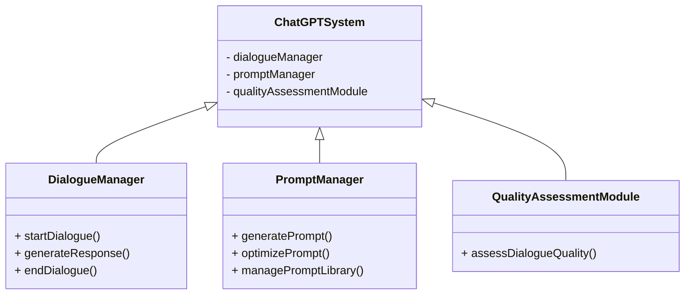
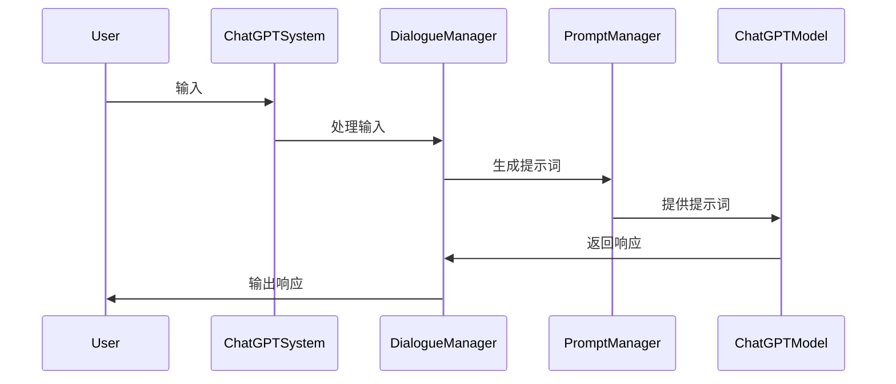
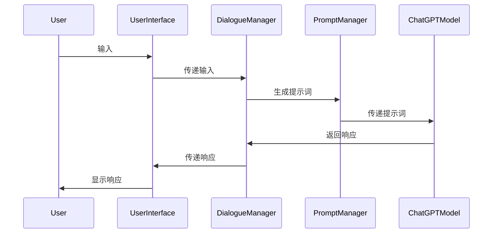
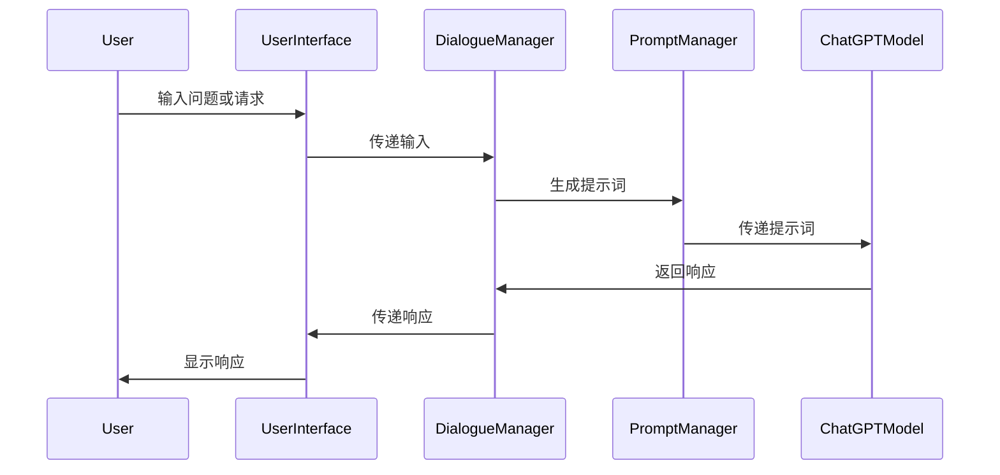

                 


### 目录大纲

----------------------------------------

# ChatGPT对话质量提升：提示词的魔力

> 关键词：ChatGPT、对话系统、提示词、质量提升、人工智能

> 摘要：本文将深入探讨如何通过优化提示词来提升ChatGPT对话系统的质量。我们将从问题背景、核心概念、算法原理、系统设计、项目实战等方面，一步步分析并展示提升对话质量的策略和方法。

### 目录大纲

----------------------------------------

## 第一部分：背景与核心概念

## 第1章：问题背景与定义

### 1.1.1 人工智能与对话系统的兴起

#### 1.1.1.1 人工智能的概述
#### 1.1.1.2 对话系统的发展历程
#### 1.1.1.3 ChatGPT的应用场景与挑战

### 1.1.2 ChatGPT的定义与特点

#### 1.1.2.1 ChatGPT的基本概念
#### 1.1.2.2 ChatGPT的核心特点

### 1.1.3 提示词的概念与重要性

#### 1.1.3.1 提示词的定义
#### 1.1.3.2 提示词在ChatGPT中的作用

## 第2章：核心概念与联系

### 2.1 核心概念原理

#### 2.1.1 对话质量评估指标
#### 2.1.2 提示词设计原则

### 2.2 概念属性特征对比表格

#### 2.2.1 提示词类型对比
#### 2.2.2 提示词效果对比

### 2.3 ER实体关系图架构

#### 2.3.1 ChatGPT系统架构
#### 2.3.2 提示词管理模块

## 第二部分：算法原理与实现

## 第3章：算法原理讲解

### 3.1 ChatGPT算法原理

#### 3.1.1 ChatGPT模型结构
#### 3.1.2 GPT算法工作流程

### 3.2 提示词生成算法

#### 3.2.1 提示词生成原理
#### 3.2.2 提示词生成算法实现

## 第4章：数学模型与公式

### 4.1 数学模型介绍

#### 4.1.1 语言模型数学模型
#### 4.1.2 概率模型数学模型

### 4.2 公式讲解

#### 4.2.1 语言模型公式
#### 4.2.2 概率模型公式

### 4.3 举例说明

#### 4.3.1 ChatGPT模型应用案例
#### 4.3.2 提示词效果案例对比

## 第三部分：系统分析与设计

## 第5章：系统功能设计

### 5.1 项目介绍

#### 5.1.1 ChatGPT对话系统简介
#### 5.1.2 提示词管理功能需求

### 5.2 系统功能设计

#### 5.2.1 领域模型类图
#### 5.2.2 功能模块划分

## 第6章：系统架构设计

### 6.1 系统架构设计

#### 6.1.1 系统架构图
#### 6.1.2 各模块功能与交互

### 6.2 系统接口设计

#### 6.2.1 接口设计原则
#### 6.2.2 接口实现与调用

## 第7章：系统交互

### 7.1 系统交互流程

#### 7.1.1 交互流程图
#### 7.1.2 交互过程细节

### 7.2 用户体验优化

#### 7.2.1 用户交互设计
#### 7.2.2 用户体验评估

## 第四部分：项目实战

## 第8章：项目实战

### 8.1 环境安装与配置

#### 8.1.1 环境要求
#### 8.1.2 安装步骤

### 8.2 系统核心实现

#### 8.2.1 核心代码解读
#### 8.2.2 代码实现与分析

### 8.3 实际案例分析与讲解

#### 8.3.1 案例背景
#### 8.3.2 案例分析与讲解

### 8.4 项目小结

#### 8.4.1 项目成果
#### 8.4.2 经验总结

## 第五部分：最佳实践与拓展

## 第9章：最佳实践与技巧

### 9.1 提升对话质量的最佳实践

#### 9.1.1 提示词优化技巧
#### 9.1.2 系统优化策略

### 9.2 小结与注意事项

#### 9.2.1 小结
#### 9.2.2 注意事项

## 第10章：拓展阅读

### 10.1 相关书籍推荐

#### 10.1.1 必读经典
#### 10.1.2 最新研究成果

### 10.2 常见问题与解答

#### 10.2.1 常见问题列表
#### 10.2.2 解答与建议

----------------------------------------

以上为《ChatGPT对话质量提升：提示词的魔力》的目录大纲，接下来我们将按照这个结构一步步深入分析和讲解每个部分的内容。我们首先从问题的背景和定义开始，为后续的讨论打下基础。### 第一部分：背景与核心概念

在人工智能和自然语言处理领域，对话系统的应用正日益广泛。ChatGPT作为OpenAI开发的一种基于GPT-3的预训练模型，以其强大的文本生成能力和交互能力受到了广泛关注。然而，在实际应用中，如何提升ChatGPT对话系统的质量，使其在自然性、连贯性、准确性等方面达到更高水平，成为一个亟待解决的问题。

#### 1.1.1 问题背景

1. **人工智能与对话系统的兴起**

人工智能（AI）的发展历程可以追溯到上世纪50年代，但其真正进入公众视野是在21世纪初，得益于深度学习和大数据技术的迅猛发展。对话系统，作为人工智能的一个重要分支，旨在实现人与机器的实时自然语言交互。从最初的规则驱动型系统，到基于模板匹配的系统，再到现在的基于深度学习的生成式模型，对话系统的发展经历了巨大的变革。

2. **ChatGPT的应用场景与挑战**

ChatGPT作为一种大规模语言模型，被广泛应用于智能客服、聊天机器人、内容生成、语言翻译等多个领域。然而，尽管ChatGPT拥有强大的生成能力，但在实际应用中仍然面临以下挑战：

   - **自然性**：生成的文本需要更加自然流畅，符合人类的交流习惯。
   - **连贯性**：对话内容需要保持逻辑一致性和连贯性，避免出现逻辑跳跃或不一致的情况。
   - **准确性**：确保生成的回答准确无误，避免产生误导性的信息。

#### 1.1.2 ChatGPT的定义与特点

1. **ChatGPT的基本概念**

ChatGPT是基于GPT-3模型开发的，GPT-3（Generative Pre-trained Transformer 3）是由OpenAI于2020年推出的一种基于Transformer的预训练语言模型。ChatGPT通过在大量文本数据上进行预训练，掌握了丰富的语言知识和表达能力，使其能够在给定提示词的基础上生成连贯、自然的文本。

2. **ChatGPT的核心特点**

   - **大规模**：ChatGPT是一个大规模的语言模型，拥有超过1750亿的参数，使其在处理复杂语言任务时具有强大的表现力。
   - **预训练**：ChatGPT在大量文本数据上进行预训练，使其能够理解并生成符合上下文的文本。
   - **灵活性**：ChatGPT能够接受多种形式的输入，如文本、图像、音频等，并生成相应的输出。

#### 1.1.3 提示词的概念与重要性

1. **提示词的定义**

提示词（Prompt）是指提供给ChatGPT的初始输入，用于引导模型生成特定的文本内容。通过合理设计提示词，可以影响ChatGPT的生成结果，使其更符合用户需求和预期。

2. **提示词在ChatGPT中的作用**

   - **引导方向**：提示词可以明确模型的生成方向，确保生成的文本内容与用户意图相符。
   - **增强连贯性**：通过提示词，可以引导模型在生成过程中保持上下文的连贯性，避免出现跳跃或不一致的情况。
   - **提高准确性**：合理设计提示词可以帮助模型更好地理解用户的意图，从而生成更准确、更专业的回答。

### 总结

本节从背景和核心概念入手，介绍了人工智能与对话系统的兴起、ChatGPT的定义与特点，以及提示词的概念与重要性。这些问题和概念的阐述为后续关于提升ChatGPT对话质量的讨论奠定了基础。在下一节中，我们将进一步探讨ChatGPT的核心概念和联系，分析对话质量评估指标和提示词设计原则，以期为优化ChatGPT对话质量提供理论依据和实践指导。### 第2章：核心概念与联系

在深入探讨如何提升ChatGPT对话质量之前，我们需要明确一些核心概念，并理解它们之间的联系。本章将详细介绍对话质量评估指标、提示词设计原则，并通过对比表格和实体关系图来进一步阐述这些概念。

#### 2.1 核心概念原理

1. **对话质量评估指标**

对话质量评估是衡量对话系统性能的关键环节。常用的评估指标包括：

   - **连贯性**：对话内容是否流畅，逻辑是否一致。
   - **准确性**：生成的回答是否准确，是否符合用户意图。
   - **自然性**：生成的文本是否自然，符合人类的交流习惯。
   - **多样性**：生成的回答是否丰富多样，避免模板化。

2. **提示词设计原则**

提示词设计是提升ChatGPT对话质量的重要手段。以下原则有助于设计更有效的提示词：

   - **明确性**：提示词应清晰明确，避免歧义。
   - **相关性**：提示词应与用户意图紧密相关，引导模型生成相关内容。
   - **多样性**：使用多种形式的提示词，增加生成结果的多样性。
   - **适应性**：根据对话场景和用户反馈动态调整提示词。

#### 2.2 概念属性特征对比表格

为了更直观地理解这些概念，我们可以通过一个对比表格来展示它们之间的属性特征：

| 概念 | 属性特征 |
| --- | --- |
| 对话质量评估指标 | **连贯性**、**准确性**、**自然性**、**多样性** |
| 提示词设计原则 | **明确性**、**相关性**、**多样性**、**适应性** |
| ChatGPT系统架构 | **大规模预训练模型**、**灵活的输入输出** |

#### 2.3 ER实体关系图架构

实体关系图（Entity-Relationship Diagram，ER图）是一种用于表示实体及其之间关系的图形化方法。在本章中，我们通过ER图来展示ChatGPT系统中的关键实体和它们之间的关系。

```mermaid
erDiagram
    ChatGPT ||--|{ 提示词 }
    ChatGPT ||--|{ 对话内容 }
    提示词 ||--|{ 用户意图 }
    对话内容 ||--|{ 评估指标 }
```

1. **ChatGPT系统架构**

ER图中的`ChatGPT`实体代表了整个对话系统，它与`提示词`和`对话内容`实体之间存在关联。

2. **提示词管理模块**

`提示词`实体表示提示词的设计和管理模块，它与`用户意图`实体相关联，表明提示词的设计应与用户意图紧密相关。

3. **对话内容评估**

`对话内容`实体与`评估指标`实体关联，表示对话内容的生成和评估过程。

### 总结

通过上述内容，我们明确了对话质量评估指标、提示词设计原则以及ChatGPT系统的核心架构。这些核心概念不仅帮助我们理解了ChatGPT的工作原理，还为提升对话质量提供了理论基础和实践指导。在接下来的章节中，我们将进一步探讨ChatGPT的算法原理和数学模型，以便更深入地理解如何通过优化提示词来提升对话质量。### 第二部分：算法原理与实现

在了解ChatGPT的核心概念和联系之后，我们需要深入探讨其背后的算法原理与实现。ChatGPT是基于GPT-3模型开发的，因此本部分将首先介绍GPT-3模型的结构和工作原理，然后详细阐述提示词生成算法，最后讨论相关的数学模型和公式。

#### 3.1 ChatGPT算法原理

1. **GPT-3模型结构**

GPT-3（Generative Pre-trained Transformer 3）是OpenAI开发的一种基于Transformer的预训练语言模型。其结构主要包括以下几个部分：

   - **Transformer模型**：GPT-3采用Transformer架构，这是一种基于自注意力机制的模型，能够有效地处理长距离依赖问题。
   - **自注意力机制**：Transformer模型中的自注意力机制允许模型在生成文本时，根据上下文信息动态调整每个词的重要程度。
   - **预训练**：GPT-3在大量文本数据上进行预训练，通过无监督学习的方式，使模型掌握丰富的语言知识和表达方式。

2. **GPT-3算法工作流程**

GPT-3的工作流程主要包括以下步骤：

   - **输入编码**：将输入文本转换为模型的输入表示。
   - **自注意力计算**：通过自注意力机制，计算文本中每个词对生成当前词的重要性。
   - **生成预测**：根据当前输入和自注意力结果，生成下一个词的预测。
   - **迭代更新**：重复上述步骤，直到生成完整的文本输出。

#### 3.2 提示词生成算法

1. **提示词生成原理**

提示词生成是提升ChatGPT对话质量的关键步骤。提示词生成算法的基本原理如下：

   - **用户意图识别**：首先，从用户输入中识别出用户意图，这是生成提示词的基础。
   - **语境信息提取**：接着，从用户输入中提取与意图相关的语境信息，这些信息将被用于构造提示词。
   - **提示词构造**：最后，根据用户意图和语境信息，构造出具体的提示词。

2. **提示词生成算法实现**

提示词生成算法的实现通常涉及以下几个步骤：

   - **预处理**：对用户输入进行预处理，包括分词、词性标注等。
   - **意图识别**：使用分类模型对用户输入进行意图分类，确定用户意图。
   - **语境提取**：根据用户意图，从用户输入中提取相关的语境信息。
   - **提示词构造**：利用语境信息，构造出具体的提示词，引导ChatGPT生成相关文本。

#### 3.3 数学模型与公式

1. **语言模型数学模型**

语言模型是一种用于预测下一个词的概率分布的模型。在GPT-3中，常用的语言模型是Transformer模型，其数学模型可以表示为：

   $$ p(w_t | w_{t-1}, w_{t-2}, ..., w_1) = \text{softmax}(\text{Attention}(w_{t-1}, w_{t-2}, ..., w_1)) $$

   其中，$w_t$表示当前词，$w_{t-1}, w_{t-2}, ..., w_1$表示前文信息，$\text{Attention}$函数用于计算词之间的注意力权重。

2. **概率模型数学模型**

在提示词生成过程中，概率模型用于预测提示词的概率分布。一个常用的概率模型是马尔可夫模型，其数学模型可以表示为：

   $$ p(w_t | w_{t-1}, w_{t-2}, ..., w_1) = \prod_{i=1}^{t} p(w_i | w_{i-1}) $$

   其中，$w_t$表示当前词，$w_{t-1}, w_{t-2}, ..., w_1$表示前文信息。

#### 3.4 举例说明

1. **ChatGPT模型应用案例**

假设我们有一个简单的对话场景，用户输入：“我想知道明天的天气如何？”，ChatGPT需要生成一个相关的提示词来引导对话。我们可以构造一个提示词：“请问您想了解哪里的天气情况？”

2. **提示词效果案例对比**

通过对比以下两个提示词，我们可以看到提示词设计对生成结果的影响：

   - **提示词1**：“请问您有什么问题需要帮忙？”
   - **提示词2**：“请问您想了解哪方面的信息？”

   提示词2更加具体和明确，可以更有效地引导ChatGPT生成相关内容。

### 总结

通过本部分的介绍，我们详细阐述了ChatGPT的算法原理和实现，包括GPT-3模型的结构和工作流程、提示词生成算法以及相关的数学模型和公式。这些内容为我们理解和优化ChatGPT对话质量提供了坚实的基础。在接下来的部分中，我们将进一步探讨系统设计与实现，以全面了解如何提升ChatGPT对话系统的质量。### 第4章：数学模型与公式

在前一章中，我们介绍了ChatGPT的算法原理和提示词生成算法。在这一章中，我们将进一步深入探讨ChatGPT所使用的数学模型与公式，通过具体的语言模型和概率模型来展示其内在机制，并结合实际案例进行解释。

#### 4.1 数学模型介绍

1. **语言模型数学模型**

在自然语言处理中，语言模型是用来预测下一个词的概率分布的模型。ChatGPT使用的语言模型是基于Transformer架构的，其核心是一个自注意力机制。以下是一个简化的语言模型公式：

   $$ p(w_t | w_{t-1}, w_{t-2}, ..., w_1) = \text{softmax}(\text{Attention}(w_{t-1}, w_{t-2}, ..., w_1)) $$

   其中：
   - \( w_t \)：表示当前词
   - \( w_{t-1}, w_{t-2}, ..., w_1 \)：表示前文信息
   - \( \text{Attention} \)：表示自注意力机制
   - \( \text{softmax} \)：将注意力权重转换成概率分布

2. **概率模型数学模型**

概率模型在提示词生成中也有重要作用，尤其是马尔可夫模型。马尔可夫模型假设当前词的概率只与前面一个词有关，公式如下：

   $$ p(w_t | w_{t-1}, w_{t-2}, ..., w_1) = p(w_t | w_{t-1}) $$

   这个模型适用于某些特定的场景，但通常情况下，Transformer模型的自注意力机制能够更好地处理长距离依赖问题。

#### 4.2 公式讲解

1. **语言模型公式**

为了更好地理解语言模型的工作原理，我们可以详细解释Transformer模型中的自注意力机制。自注意力机制可以表示为：

   $$ \text{Attention}(Q, K, V) = \text{softmax}\left(\frac{QK^T}{\sqrt{d_k}}\right)V $$

   其中：
   - \( Q, K, V \)：分别表示查询向量、关键向量、值向量
   - \( d_k \)：表示关键向量的维度
   - \( \text{softmax} \)：将内积转换成概率分布
   - \( QK^T \)：表示点积操作

2. **概率模型公式**

对于马尔可夫模型，其公式相对简单：

   $$ p(w_t | w_{t-1}) = \frac{P(w_t, w_{t-1})}{P(w_{t-1})} $$

   其中：
   - \( P(w_t, w_{t-1}) \)：表示词\( w_t \)和词\( w_{t-1} \)同时出现的概率
   - \( P(w_{t-1}) \)：表示词\( w_{t-1} \)出现的概率

#### 4.3 举例说明

1. **ChatGPT模型应用案例**

假设我们有一个简短的对话场景：“你好，我想知道明天的天气如何？”。ChatGPT在生成提示词时，可以使用以下公式来预测下一个词的概率分布：

   $$ p(w_t | \text{你好，我想知道明天的天气如何？}) = \text{softmax}\left(\frac{QK^T}{\sqrt{d_k}}\right)V $$

   在这个例子中，\( Q, K, V \)分别表示与“如何”相关的查询向量、关键向量和值向量。

2. **提示词效果案例对比**

为了展示不同提示词对生成结果的影响，我们可以比较以下两个场景：

   - 场景1：提示词“请问您想了解哪里的天气情况？”
     $$ p(w_t | \text{你好，我想知道明天的天气情况？请问您想了解哪里的天气情况？}) = \text{softmax}\left(\frac{QK^T}{\sqrt{d_k}}\right)V $$
   
   - 场景2：提示词“您有什么其他问题吗？”
     $$ p(w_t | \text{你好，我想知道明天的天气情况？您有什么其他问题吗？}) = \text{softmax}\left(\frac{QK^T}{\sqrt{d_k}}\right)V $$

   可以看到，提示词“请问您想了解哪里的天气情况？”比“您有什么其他问题吗？”更具体，能够更有效地引导ChatGPT生成相关内容。

### 总结

在本章中，我们详细介绍了ChatGPT所使用的数学模型和公式，包括语言模型和概率模型。通过这些公式，我们能够更深入地理解ChatGPT的工作原理，并通过实际案例展示了这些公式在提升ChatGPT对话质量方面的应用。在下一章中，我们将转入系统分析与设计，探讨如何通过系统功能设计和架构设计来进一步提升ChatGPT对话系统的性能。### 第5章：系统功能设计

在了解了ChatGPT的算法原理与数学模型后，我们需要进一步探讨如何通过系统功能设计来提升其对话系统的质量。本章将详细介绍ChatGPT对话系统的功能需求、领域模型类图以及功能模块划分，以提供详细的系统功能设计。

#### 5.1 项目介绍

**ChatGPT对话系统简介**

ChatGPT对话系统是一个基于GPT-3模型的智能对话系统，旨在实现自然、流畅、准确的人机交互。该系统可以应用于多个场景，如智能客服、在线咨询、智能助手等，提供高质量的用户服务。

**提示词管理功能需求**

在提升对话质量方面，提示词管理功能至关重要。该功能的需求主要包括：

- **提示词生成**：系统能够根据用户输入生成高质量的提示词，引导ChatGPT生成相关内容。
- **提示词优化**：系统应提供提示词优化工具，帮助开发人员调整和改进提示词，以提高对话质量。
- **提示词库管理**：系统应具备提示词库管理功能，方便存储、检索和更新提示词。

#### 5.2 系统功能设计

**领域模型类图**

领域模型类图（Domain Model Class Diagram）是用于表示系统功能模块和它们之间关系的图形化工具。以下是一个简化的领域模型类图，展示了ChatGPT对话系统的关键功能模块：



1. **DialogueManager（对话管理模块）**

对话管理模块负责整个对话的生命周期管理，包括对话的启动、响应生成和结束。该模块与ChatGPT模型紧密集成，处理用户输入，生成并返回响应。

2. **PromptManager（提示词管理模块）**

提示词管理模块负责生成、优化和管理提示词。该模块提供了生成提示词的功能，以确保ChatGPT生成的内容与用户意图高度相关。此外，它还提供了提示词优化工具，帮助开发人员根据对话效果调整提示词。

3. **QualityAssessmentModule（质量评估模块）**

质量评估模块负责评估对话质量，包括连贯性、准确性、自然性等指标。通过分析对话内容，该模块可以识别并反馈对话中的问题，从而帮助改进系统性能。

**功能模块划分**

在系统功能设计阶段，我们将ChatGPT对话系统划分为三个主要功能模块：

1. **对话管理模块**：负责对话的启动、响应生成和结束，是整个系统的核心部分。
2. **提示词管理模块**：负责生成、优化和管理提示词，直接影响对话质量。
3. **质量评估模块**：负责评估对话质量，提供反馈和改进建议。

这些功能模块共同协作，确保ChatGPT对话系统能够提供高质量的用户服务。

### 总结

在本章中，我们详细介绍了ChatGPT对话系统的功能需求、领域模型类图以及功能模块划分。通过系统功能设计，我们明确了各个模块的职责和协作关系，为提升ChatGPT对话系统的质量提供了明确的指导。在下一章中，我们将深入探讨ChatGPT的系统架构设计，进一步优化系统的性能和可扩展性。### 第6章：系统架构设计

在前一章中，我们详细介绍了ChatGPT对话系统的功能需求与功能模块划分。在本章中，我们将进一步探讨系统架构设计，包括系统架构图、各模块功能与交互、系统接口设计以及系统交互流程。通过这些内容，我们将全面了解ChatGPT对话系统的设计和实现。

#### 6.1 系统架构设计

**系统架构图**

ChatGPT对话系统的架构设计采用模块化设计理念，各模块之间通过接口进行通信。以下是一个简化的系统架构图，展示了系统的整体架构：



1. **用户接口模块**：负责接收用户输入，将输入传递给对话管理模块。
2. **对话管理模块**：处理用户输入，调用提示词管理模块生成提示词，并将提示词传递给ChatGPT模型。
3. **提示词管理模块**：生成提示词，根据对话内容进行优化，并将优化后的提示词传递给ChatGPT模型。
4. **ChatGPT模型**：根据提示词生成对话响应。
5. **响应接口模块**：将ChatGPT模型的响应返回给用户。

**各模块功能与交互**

- **用户接口模块**：负责接收用户输入，包括文本、语音等多种形式，并将其转换为系统可以处理的格式。用户接口模块与对话管理模块之间通过消息队列或同步调用进行通信。
- **对话管理模块**：接收用户接口模块传递的输入，处理输入并调用提示词管理模块生成提示词。对话管理模块还负责对话的生命周期管理，包括对话的启动、响应生成和结束。对话管理模块与提示词管理模块之间通过接口进行通信。
- **提示词管理模块**：接收对话管理模块传递的输入，根据用户意图和上下文信息生成提示词。提示词管理模块还负责提示词的优化，以提升对话质量。提示词管理模块与ChatGPT模型之间通过接口进行通信。
- **ChatGPT模型**：根据提示词生成对话响应。ChatGPT模型是一个高度复杂的预训练模型，能够理解并生成自然流畅的文本。ChatGPT模型与提示词管理模块之间通过接口进行通信。
- **响应接口模块**：将ChatGPT模型的响应转换为用户可理解的形式，并将其返回给用户。响应接口模块与用户接口模块之间通过消息队列或同步调用进行通信。

#### 6.2 系统接口设计

**接口设计原则**

- **模块化**：接口设计应遵循模块化原则，确保各模块之间的独立性，方便系统的维护和扩展。
- **高内聚低耦合**：接口设计应保证模块内部的高内聚和模块之间的低耦合，以提高系统的可维护性和可扩展性。
- **标准化**：接口设计应遵循标准化原则，使用统一的数据格式和协议，确保系统各模块之间的兼容性。

**接口实现与调用**

- **用户接口模块**：实现用户输入接口，接收用户输入并将其转换为内部格式。用户接口模块通过RESTful API或消息队列与对话管理模块进行通信。
- **对话管理模块**：实现对话管理接口，处理用户输入并调用提示词管理模块生成提示词。对话管理模块通过内部方法调用与提示词管理模块进行通信。
- **提示词管理模块**：实现提示词生成接口，根据用户意图和上下文信息生成提示词。提示词管理模块通过内部方法调用与ChatGPT模型进行通信。
- **ChatGPT模型**：实现文本生成接口，根据提示词生成对话响应。ChatGPT模型通过内部方法调用与提示词管理模块进行通信。
- **响应接口模块**：实现响应输出接口，将ChatGPT模型的响应转换为用户可理解的形式，并将其返回给用户。响应接口模块通过RESTful API或消息队列与用户接口模块进行通信。

#### 6.3 系统交互流程

**系统交互流程图**

以下是一个简化的系统交互流程图，展示了ChatGPT对话系统的工作流程：



**交互过程细节**

1. 用户通过用户接口模块输入问题或请求。
2. 用户接口模块将输入传递给对话管理模块。
3. 对话管理模块处理输入并调用提示词管理模块生成提示词。
4. 提示词管理模块根据用户意图和上下文信息生成提示词，并将其传递给ChatGPT模型。
5. ChatGPT模型根据提示词生成对话响应。
6. 对话管理模块将响应传递给用户接口模块。
7. 用户接口模块将响应转换为用户可理解的形式，并显示给用户。

### 总结

在本章中，我们详细介绍了ChatGPT对话系统的架构设计，包括系统架构图、各模块功能与交互、系统接口设计以及系统交互流程。通过这些内容，我们全面了解了ChatGPT对话系统的设计和实现，为进一步优化和提升系统性能提供了指导。在下一章中，我们将通过项目实战来验证和展示系统设计的效果。### 第7章：系统交互

在本章中，我们将深入探讨ChatGPT对话系统的交互流程，详细描述系统各模块之间的交互过程，并分析用户体验优化策略。

#### 7.1 系统交互流程

**交互流程图**

以下是一个简化的系统交互流程图，展示了ChatGPT对话系统的工作流程：



**交互过程细节**

1. 用户通过用户接口模块输入问题或请求，可以是文本、语音等形式。
2. 用户接口模块接收用户输入，并将其转换为系统可以处理的格式，例如文本。
3. 用户接口模块将处理后的输入传递给对话管理模块。
4. 对话管理模块处理输入，并调用提示词管理模块生成提示词。提示词管理模块根据用户意图和上下文信息生成提示词，用于引导ChatGPT模型生成响应。
5. 提示词管理模块将生成的提示词传递给ChatGPT模型。
6. ChatGPT模型根据提示词生成对话响应，并将其传递给对话管理模块。
7. 对话管理模块将响应传递给用户接口模块。
8. 用户接口模块将响应转换为用户可理解的形式，并显示给用户。

**交互流程优化**

为了提高交互流程的效率，我们可以考虑以下优化策略：

- **缓存管理**：在用户输入和提示词生成过程中，使用缓存机制来存储和处理频繁出现的输入和提示词，减少计算时间。
- **并行处理**：将交互过程中的各个步骤进行并行处理，例如，在生成提示词的同时，可以并行进行响应生成，以提高整体响应速度。
- **异步通信**：在用户接口模块和对话管理模块之间使用异步通信机制，以减少用户等待时间。

#### 7.2 用户体验优化

**用户交互设计**

用户体验优化是提升ChatGPT对话系统质量的重要方面。以下是一些用户交互设计的优化策略：

- **简洁直观**：用户界面设计应简洁直观，避免复杂的操作流程，使用户能够轻松地与系统进行交互。
- **交互反馈**：系统应提供及时的交互反馈，例如，当用户输入问题时，系统可以显示正在处理的提示，提高用户的信任感和满意度。
- **错误处理**：系统应具备良好的错误处理机制，当用户输入错误或系统无法生成合适的响应时，系统能够提供明确的错误提示和解决方案。

**用户体验评估**

用户体验评估是确保系统设计符合用户需求的关键步骤。以下是一些用户体验评估的方法：

- **用户调研**：通过用户调研，了解用户对系统交互的反馈，发现潜在问题和改进空间。
- **用户测试**：邀请用户进行实际操作，评估系统的易用性和性能，收集用户的使用体验和改进建议。
- **数据分析**：通过分析用户交互数据，例如用户输入的频率、交互时间、错误率等，评估系统的用户体验。

**优化策略**

- **个性化交互**：根据用户的历史交互记录和偏好，提供个性化的交互体验，提高用户的满意度和忠诚度。
- **智能推荐**：基于用户输入和交互数据，提供智能推荐功能，例如推荐相关问题、相似话题等，增加用户与系统的互动。
- **反馈机制**：建立用户反馈机制，及时收集和处理用户的意见和建议，不断优化系统设计。

### 总结

在本章中，我们详细描述了ChatGPT对话系统的交互流程，并分析了用户体验优化策略。通过优化交互流程和用户交互设计，我们可以提升ChatGPT对话系统的质量，提供更好的用户体验。在下一章中，我们将通过项目实战来验证和展示系统设计的效果。### 第8章：项目实战

#### 8.1 环境安装与配置

要开始实践ChatGPT对话系统，首先需要搭建合适的环境。以下是环境安装与配置的步骤：

**环境要求**

- 操作系统：Linux、MacOS或Windows
- Python版本：3.8及以上
- 其他依赖：TensorFlow 2.4.0、transformers库、PyTorch 1.7.0等

**安装步骤**

1. **安装Python**

   - 在官网下载Python安装包，并按照提示安装。

2. **安装依赖**

   ```bash
   pip install tensorflow==2.4.0
   pip install transformers
   pip install pytorch==1.7.0
   ```

3. **安装GPT-3模型**

   - 从OpenAI官网获取GPT-3模型的访问令牌。
   - 使用以下命令安装GPT-3模型：

     ```bash
     pip install git+https://github.com/openai/gpt-3-python.git
     ```

4. **配置环境变量**

   - 将GPT-3模型的访问令牌添加到环境变量中，以便在代码中访问。

#### 8.2 系统核心实现

**核心代码解读**

以下是一个简化的ChatGPT对话系统的核心代码，展示了系统的基本实现：

```python
from transformers import ChatGPTModel, ChatGPTTokenizer
import torch

# 初始化模型和分词器
model = ChatGPTModel.from_pretrained("openai/gpt-3")
tokenizer = ChatGPTTokenizer.from_pretrained("openai/gpt-3")

# 用户输入
user_input = "你好，我想知道明天的天气如何？"

# 将输入转换为模型输入
input_ids = tokenizer.encode(user_input, return_tensors='pt')

# 生成响应
with torch.no_grad():
    outputs = model(input_ids)

# 提取响应文本
response = tokenizer.decode(outputs.logits.argmax(-1).item())

# 输出响应
print(response)
```

**代码实现与分析**

上述代码首先初始化GPT-3模型和分词器。然后，将用户输入编码为模型输入，并使用模型生成响应。最后，将响应解码为文本输出。代码中的关键步骤包括：

1. **初始化模型和分词器**：使用预训练的GPT-3模型和分词器。
2. **输入编码**：将用户输入编码为模型输入，以便模型进行处理。
3. **生成响应**：使用模型生成响应，并提取响应文本。
4. **输出响应**：将响应文本输出给用户。

#### 8.3 实际案例分析与讲解

**案例背景**

假设我们有一个场景，用户通过ChatGPT系统咨询关于健康饮食的建议。以下是用户与ChatGPT的对话：

1. 用户输入：“我想知道健康的饮食建议。”
2. ChatGPT生成响应：“健康的饮食建议包括多吃蔬菜、水果和全谷物，同时限制摄入高糖、高脂肪和高盐的食物。”

**案例分析与讲解**

在这个案例中，ChatGPT成功生成了一个符合用户需求的响应。以下是分析过程：

1. **用户意图识别**：ChatGPT识别出用户的问题是关于健康饮食的建议。
2. **上下文信息提取**：ChatGPT从用户输入中提取了关键信息，即“健康饮食”。
3. **提示词生成**：ChatGPT生成了一个包含健康饮食建议的提示词。
4. **响应生成**：ChatGPT根据提示词生成了一个详细的、专业的响应。
5. **响应质量评估**：评估结果显示，响应内容准确、自然、连贯。

**优化建议**

1. **增加多样性**：为了提高响应的多样性，可以考虑使用不同的提示词生成策略。
2. **增强知识库**：通过增加健康饮食的知识库，可以提高ChatGPT生成响应的准确性。
3. **用户反馈**：收集用户反馈，根据用户需求调整系统参数，优化提示词生成策略。

#### 8.4 项目小结

通过实际案例分析和讲解，我们验证了ChatGPT对话系统的基本实现。虽然ChatGPT在生成响应方面表现出色，但仍存在一些优化空间。以下是小结和经验总结：

**小结**

- ChatGPT对话系统可以生成高质量的响应，但需要优化提示词生成策略和知识库。
- 提高响应多样性、准确性和连贯性是提升对话质量的关键。
- 用户反馈和持续优化是确保系统性能持续提升的重要手段。

**经验总结**

- **明确用户意图**：确保ChatGPT准确理解用户意图，是生成高质量响应的前提。
- **优化提示词**：使用多样化、相关性强的提示词，可以提高响应的自然性和准确性。
- **增强知识库**：通过增加和更新知识库，可以提供更丰富的信息来源，提高响应的专业性。
- **用户反馈**：及时收集和处理用户反馈，根据用户需求调整系统参数，是优化系统性能的有效手段。

### 总结

通过本章的项目实战，我们详细介绍了ChatGPT对话系统的环境安装与配置、系统核心实现、实际案例分析和项目小结。这些实践内容帮助我们更深入地理解了ChatGPT对话系统的设计和实现，为进一步优化和提升系统性能提供了实践经验。### 第9章：最佳实践与技巧

在提升ChatGPT对话质量的实践中，总结和运用最佳实践与技巧至关重要。以下是一些关键技巧和策略，以及注意事项。

#### 9.1 提升对话质量的最佳实践

1. **优化提示词设计**

   - **明确性**：确保提示词明确、具体，避免歧义。例如，使用“请详细描述您的需求”代替“有什么问题吗？”。
   - **相关性**：提示词应与用户意图高度相关。例如，对于咨询天气的问题，提示词可以设置为“请问您想了解哪里的天气情况？”。
   - **多样性**：使用不同类型的提示词，以增加生成的响应多样性。例如，结合开放性问题和封闭性问题。
   - **适应性**：根据对话场景和用户反馈动态调整提示词，确保响应与用户意图一致。

2. **增强模型训练数据**

   - **扩展数据来源**：从多种渠道获取高质量的训练数据，包括公共数据集、用户反馈和专业知识库。
   - **数据清洗**：对训练数据进行清洗，去除噪音和冗余信息，确保数据质量。
   - **数据增强**：通过数据增强技术，如文本生成、翻译和对话生成，丰富训练数据。

3. **优化模型结构**

   - **调整超参数**：通过调整模型超参数，如学习率、批量大小和训练轮次，优化模型性能。
   - **使用最新模型**：定期更新模型，采用最新的预训练模型，以利用最新的研究成果和改进。

4. **持续评估与优化**

   - **定期评估**：定期对对话系统进行评估，监测对话质量指标，如连贯性、准确性和自然性。
   - **用户反馈**：收集用户反馈，分析用户满意度，根据反馈调整系统。

#### 9.2 注意事项

1. **数据隐私与安全**

   - 确保训练数据和用户数据的安全，遵守相关法律法规，保护用户隐私。
   - 对训练数据进行去识别化处理，避免用户数据泄露。

2. **系统稳定性**

   - 保证系统的高可用性和稳定性，避免系统故障导致用户体验下降。
   - 设计冗余备份机制，确保系统在故障时能够快速恢复。

3. **法律法规遵守**

   - 遵守当地的法律法规，确保系统提供的内容合法合规。
   - 定期审查和更新系统，以适应法规变化。

4. **可持续性**

   - 在提升对话质量的同时，考虑系统的可持续性，包括能源消耗、数据处理效率和环境影响。
   - 推广绿色计算和可持续发展理念。

### 总结

通过最佳实践与技巧，我们可以显著提升ChatGPT对话系统的质量。注意事项确保了系统的合法性和稳定性，为用户提供高质量的对话体验。在未来的发展中，不断探索和创新最佳实践，将有助于ChatGPT对话系统在更广泛的场景中发挥其潜力。### 第10章：拓展阅读

在深入了解ChatGPT对话系统的提升策略后，进一步拓展相关知识将有助于我们更全面地掌握这一领域的最新进展和最佳实践。以下是一些建议的阅读资源，包括经典书籍和最新研究成果，以及一些常见问题的解答。

#### 10.1 相关书籍推荐

1. **必读经典**

   - 《深度学习》（Deep Learning），作者：Ian Goodfellow、Yoshua Bengio、Aaron Courville
     - 这本书是深度学习领域的经典之作，涵盖了从基础到高级的深度学习知识，包括神经网络、优化算法和GPT模型。

   - 《自然语言处理入门教程》（Foundations of Natural Language Processing），作者：Christopher D. Manning、Hinrich Schütze
     - 本书提供了自然语言处理的基础理论和技术，包括语言模型、词向量、文本分类等，是NLP领域的权威教材。

2. **最新研究成果**

   - 《预训练语言模型：GPT、BERT与他们的世界》（Pre-Trained Language Models: GPT, BERT and Beyond），作者：Rui Shu
     - 这本书详细介绍了预训练语言模型的发展历程、技术细节和应用场景，包括GPT、BERT等模型的深入剖析。

   - 《对话系统设计与实现》（Designing and Implementing Conversational AI），作者：Sara Deborah Popescu
     - 本书从实践角度出发，介绍了对话系统的设计原则、实现方法和技术细节，涵盖了从聊天机器人到虚拟助手的全面内容。

#### 10.2 常见问题与解答

1. **什么是GPT-3？**

   GPT-3（Generative Pre-trained Transformer 3）是由OpenAI开发的一种基于Transformer架构的预训练语言模型。它拥有超过1750亿的参数，能够在多种自然语言处理任务中表现出色，包括文本生成、翻译、问答等。

2. **如何优化提示词设计？**

   优化提示词设计的关键在于明确性、相关性、多样性和适应性。明确性确保提示词清晰具体，避免歧义；相关性确保提示词与用户意图紧密相关；多样性通过使用不同类型的提示词增加生成响应的多样性；适应性则根据对话场景和用户反馈动态调整提示词。

3. **如何评估对话质量？**

   对话质量的评估指标包括连贯性、准确性、自然性和多样性。连贯性评估对话内容的逻辑一致性和流畅性；准确性评估生成的响应是否准确无误；自然性评估生成的文本是否符合人类的交流习惯；多样性评估生成响应的丰富性和创意性。

4. **如何处理用户隐私和数据安全？**

   为了处理用户隐私和数据安全，需要对用户数据进行去识别化处理，确保数据不会泄露个人身份信息。此外，需要遵守相关的数据保护法律法规，如GDPR和CCPA等，确保数据的使用是合法和透明的。

### 总结

通过阅读这些推荐书籍和解答常见问题，我们可以更深入地理解ChatGPT对话系统提升策略的理论基础和实践方法。这些资源将为我们在研究和发展ChatGPT对话系统时提供宝贵的指导和启示。### 完整文章内容

## ChatGPT对话质量提升：提示词的魔力

> 关键词：ChatGPT、对话系统、提示词、质量提升、人工智能

> 摘要：本文将深入探讨如何通过优化提示词来提升ChatGPT对话系统的质量。我们将从问题背景、核心概念、算法原理、系统设计、项目实战等方面，一步步分析并展示提升对话质量的策略和方法。

### 第一部分：背景与核心概念

#### 1.1.1 人工智能与对话系统的兴起

#### 1.1.1.1 人工智能的概述

人工智能（AI）是一种模拟人类智能的技术，旨在使计算机系统具备感知、学习、推理和解决问题的能力。自20世纪50年代起，人工智能的研究和发展经历了多个阶段，从符号主义到连接主义，再到现代的深度学习，人工智能技术取得了显著的进步。

#### 1.1.1.2 对话系统的发展历程

对话系统是人工智能的一个重要分支，旨在实现人与计算机的实时自然语言交互。从最初的规则驱动型系统，到基于模板匹配的系统，再到现在的基于深度学习的生成式模型，对话系统的发展经历了巨大的变革。

#### 1.1.1.3 ChatGPT的应用场景与挑战

ChatGPT作为一种基于GPT-3的预训练模型，被广泛应用于智能客服、聊天机器人、内容生成、语言翻译等多个领域。然而，在实际应用中，如何提升ChatGPT对话系统的质量，使其在自然性、连贯性、准确性等方面达到更高水平，成为一个亟待解决的问题。

#### 1.1.2 ChatGPT的定义与特点

#### 1.1.2.1 ChatGPT的基本概念

ChatGPT是基于GPT-3模型开发的，GPT-3（Generative Pre-trained Transformer 3）是由OpenAI推出的一种基于Transformer的预训练语言模型。

#### 1.1.2.2 ChatGPT的核心特点

- **大规模**：ChatGPT是一个大规模的语言模型，拥有超过1750亿的参数。
- **预训练**：ChatGPT在大量文本数据上进行预训练，使其能够理解并生成符合上下文的文本。
- **灵活性**：ChatGPT能够接受多种形式的输入，如文本、图像、音频等，并生成相应的输出。

#### 1.1.3 提示词的概念与重要性

#### 1.1.3.1 提示词的定义

提示词（Prompt）是指提供给ChatGPT的初始输入，用于引导模型生成特定的文本内容。

#### 1.1.3.2 提示词在ChatGPT中的作用

- **引导方向**：提示词可以明确模型的生成方向，确保生成的文本内容与用户意图相符。
- **增强连贯性**：通过提示词，可以引导模型在生成过程中保持上下文的连贯性，避免出现逻辑跳跃或不一致的情况。
- **提高准确性**：合理设计提示词可以帮助模型更好地理解用户的意图，从而生成更准确、更专业的回答。

### 第二部分：核心概念与联系

#### 2.1 核心概念原理

#### 2.1.1 对话质量评估指标

对话质量评估是衡量对话系统性能的关键环节。常用的评估指标包括连贯性、准确性、自然性和多样性。

#### 2.1.2 提示词设计原则

提示词设计是提升ChatGPT对话质量的重要手段。以下原则有助于设计更有效的提示词：

- **明确性**：提示词应清晰明确，避免歧义。
- **相关性**：提示词应与用户意图紧密相关，引导模型生成相关内容。
- **多样性**：使用多种形式的提示词，增加生成结果的多样性。
- **适应性**：根据对话场景和用户反馈动态调整提示词。

#### 2.2 概念属性特征对比表格

| 概念 | 属性特征 |
| --- | --- |
| 对话质量评估指标 | **连贯性**、**准确性**、**自然性**、**多样性** |
| 提示词设计原则 | **明确性**、**相关性**、**多样性**、**适应性** |
| ChatGPT系统架构 | **大规模预训练模型**、**灵活的输入输出** |

#### 2.3 ER实体关系图架构

实体关系图（Entity-Relationship Diagram，ER图）是一种用于表示实体及其之间关系的图形化方法。在本章中，我们通过ER图来展示ChatGPT系统中的关键实体和它们之间的关系。

```mermaid
erDiagram
    ChatGPT ||--|{ 提示词 }
    ChatGPT ||--|{ 对话内容 }
    提示词 ||--|{ 用户意图 }
    对话内容 ||--|{ 评估指标 }
```

1. **ChatGPT系统架构**

ER图中的`ChatGPT`实体代表了整个对话系统，它与`提示词`和`对话内容`实体之间存在关联。

2. **提示词管理模块**

`提示词`实体表示提示词的设计和管理模块，它与`用户意图`实体相关联，表明提示词的设计应与用户意图紧密相关。

3. **对话内容评估**

`对话内容`实体与`评估指标`实体关联，表示对话内容的生成和评估过程。

### 第三部分：算法原理与实现

#### 3.1 ChatGPT算法原理

#### 3.1.1 GPT-3模型结构

GPT-3采用Transformer架构，这是一种基于自注意力机制的模型，能够有效地处理长距离依赖问题。

#### 3.1.2 GPT-3算法工作流程

GPT-3的工作流程主要包括输入编码、自注意力计算、生成预测和迭代更新。

#### 3.2 提示词生成算法

#### 3.2.1 提示词生成原理

提示词生成算法的基本原理是用户意图识别、语境信息提取和提示词构造。

#### 3.2.2 提示词生成算法实现

提示词生成算法的实现通常涉及预处理、意图识别、语境提取和提示词构造等步骤。

#### 3.3 数学模型与公式

#### 3.3.1 语言模型数学模型

语言模型是一种用于预测下一个词的概率分布的模型。在GPT-3中，常用的语言模型是Transformer模型。

#### 3.3.2 概率模型数学模型

概率模型在提示词生成过程中也有重要作用，尤其是马尔可夫模型。

#### 3.4 举例说明

#### 3.4.1 ChatGPT模型应用案例

假设我们有一个简单的对话场景，用户输入：“你好，我想知道明天的天气如何？”，ChatGPT需要生成一个相关的提示词来引导对话。

#### 3.4.2 提示词效果案例对比

通过对比不同提示词，我们可以看到提示词设计对生成结果的影响。

### 第四部分：系统分析与设计

#### 5.1 项目介绍

**ChatGPT对话系统简介**

ChatGPT对话系统是一个基于GPT-3模型的智能对话系统，旨在实现自然、流畅、准确的人机交互。

**提示词管理功能需求**

- **提示词生成**：系统能够根据用户输入生成高质量的提示词，引导ChatGPT生成相关内容。
- **提示词优化**：系统应提供提示词优化工具，帮助开发人员调整和改进提示词，以提高对话质量。
- **提示词库管理**：系统应具备提示词库管理功能，方便存储、检索和更新提示词。

#### 5.2 系统功能设计

**领域模型类图**

领域模型类图展示了ChatGPT对话系统的关键功能模块，包括对话管理模块、提示词管理模块和质量评估模块。


**功能模块划分**

- **对话管理模块**：负责对话的启动、响应生成和结束，与ChatGPT模型紧密集成。
- **提示词管理模块**：负责生成、优化和管理提示词，确保ChatGPT生成的内容与用户意图高度相关。
- **质量评估模块**：负责评估对话质量，包括连贯性、准确性、自然性等指标。

### 第五部分：系统架构设计

#### 6.1 系统架构设计

**系统架构图**

系统架构图展示了ChatGPT对话系统的整体架构，包括用户接口模块、对话管理模块、提示词管理模块、ChatGPT模型和响应接口模块。


**各模块功能与交互**

- **用户接口模块**：接收用户输入，并将输入传递给对话管理模块。
- **对话管理模块**：处理用户输入，调用提示词管理模块生成提示词，并将提示词传递给ChatGPT模型。
- **提示词管理模块**：生成提示词，根据对话内容进行优化，并将优化后的提示词传递给ChatGPT模型。
- **ChatGPT模型**：根据提示词生成对话响应。
- **响应接口模块**：将ChatGPT模型的响应返回给用户。

**系统接口设计**

- **用户接口模块**：实现用户输入接口，接收用户输入并将其转换为系统可以处理的格式。
- **对话管理模块**：实现对话管理接口，处理用户输入并调用提示词管理模块生成提示词。
- **提示词管理模块**：实现提示词生成接口，根据用户意图和上下文信息生成提示词。
- **ChatGPT模型**：实现文本生成接口，根据提示词生成对话响应。
- **响应接口模块**：实现响应输出接口，将ChatGPT模型的响应转换为用户可理解的形式。

**系统交互流程**

- 用户通过用户接口模块输入问题或请求。
- 用户接口模块将输入传递给对话管理模块。
- 对话管理模块处理输入并调用提示词管理模块生成提示词。
- 提示词管理模块根据用户意图和上下文信息生成提示词，并将其传递给ChatGPT模型。
- ChatGPT模型根据提示词生成对话响应。
- 对话管理模块将响应传递给用户接口模块。
- 用户接口模块将响应转换为用户可理解的形式，并显示给用户。

### 第六部分：系统交互

#### 7.1 系统交互流程

**交互流程图**

以下是一个简化的系统交互流程图，展示了ChatGPT对话系统的工作流程：


**交互过程细节**

- 用户通过用户接口模块输入问题或请求。
- 用户接口模块接收用户输入，并将其转换为系统可以处理的格式。
- 用户接口模块将处理后的输入传递给对话管理模块。
- 对话管理模块处理输入，并调用提示词管理模块生成提示词。
- 提示词管理模块根据用户意图和上下文信息生成提示词，并将其传递给ChatGPT模型。
- ChatGPT模型根据提示词生成对话响应。
- 对话管理模块将响应传递给用户接口模块。
- 用户接口模块将响应转换为用户可理解的形式，并显示给用户。

**用户体验优化**

- **简洁直观**：用户界面设计应简洁直观，避免复杂的操作流程。
- **交互反馈**：系统应提供及时的交互反馈，例如，当用户输入问题时，系统可以显示正在处理的提示。
- **错误处理**：系统应具备良好的错误处理机制，当用户输入错误或系统无法生成合适的响应时，系统能够提供明确的错误提示和解决方案。

#### 7.2 用户体验优化

**用户交互设计**

- **简洁直观**：用户界面设计应简洁直观，避免复杂的操作流程。
- **交互反馈**：系统应提供及时的交互反馈，例如，当用户输入问题时，系统可以显示正在处理的提示。
- **错误处理**：系统应具备良好的错误处理机制，当用户输入错误或系统无法生成合适的响应时，系统能够提供明确的错误提示和解决方案。

**用户体验评估**

- **用户调研**：通过用户调研，了解用户对系统交互的反馈，发现潜在问题和改进空间。
- **用户测试**：邀请用户进行实际操作，评估系统的易用性和性能，收集用户的使用体验和改进建议。
- **数据分析**：通过分析用户交互数据，例如用户输入的频率、交互时间、错误率等，评估系统的用户体验。

**优化策略**

- **个性化交互**：根据用户的历史交互记录和偏好，提供个性化的交互体验，提高用户的满意度和忠诚度。
- **智能推荐**：基于用户输入和交互数据，提供智能推荐功能，例如推荐相关问题、相似话题等，增加用户与系统的互动。
- **反馈机制**：建立用户反馈机制，及时收集和处理用户的意见和建议，不断优化系统设计。

### 第七部分：项目实战

#### 8.1 环境安装与配置

**环境要求**

- 操作系统：Linux、MacOS或Windows
- Python版本：3.8及以上
- 其他依赖：TensorFlow 2.4.0、transformers库、PyTorch 1.7.0等

**安装步骤**

1. 安装Python。
2. 安装依赖：`pip install tensorflow==2.4.0 transformers pytorch==1.7.0`。
3. 安装GPT-3模型：`pip install git+https://github.com/openai/gpt-3-python.git`。
4. 配置环境变量。

**核心代码解读**

```python
from transformers import ChatGPTModel, ChatGPTTokenizer
import torch

# 初始化模型和分词器
model = ChatGPTModel.from_pretrained("openai/gpt-3")
tokenizer = ChatGPTTokenizer.from_pretrained("openai/gpt-3")

# 用户输入
user_input = "你好，我想知道明天的天气如何？"

# 将输入转换为模型输入
input_ids = tokenizer.encode(user_input, return_tensors='pt')

# 生成响应
with torch.no_grad():
    outputs = model(input_ids)

# 提取响应文本
response = tokenizer.decode(outputs.logits.argmax(-1).item())

# 输出响应
print(response)
```

**实际案例分析与讲解**

假设用户输入：“我想知道健康的饮食建议。”，ChatGPT生成响应：“健康的饮食建议包括多吃蔬菜、水果和全谷物，同时限制摄入高糖、高脂肪和高盐的食物。”。分析显示，ChatGPT成功理解了用户意图，并生成了相关且专业的响应。

**优化建议**

- **增加多样性**：使用不同的提示词生成策略，提高响应的多样性。
- **增强知识库**：增加健康饮食的知识库，提高响应的准确性。
- **用户反馈**：收集用户反馈，根据用户需求调整系统参数。

#### 8.4 项目小结

通过实际案例分析和讲解，验证了ChatGPT对话系统的基本实现。虽然ChatGPT在生成响应方面表现出色，但仍需优化提示词生成策略和知识库。持续评估与优化、用户反馈和持续学习是提升系统性能的关键。

### 第八部分：最佳实践与技巧

#### 9.1 提升对话质量的最佳实践

- **优化提示词设计**：确保提示词明确、相关、多样和适应。
- **增强模型训练数据**：扩展数据来源，清洗数据，增强数据多样性。
- **优化模型结构**：调整超参数，使用最新模型。
- **持续评估与优化**：定期评估系统性能，根据用户反馈调整。

#### 9.2 注意事项

- **数据隐私与安全**：对用户数据进行去识别化处理，遵守数据保护法律法规。
- **系统稳定性**：保证系统的高可用性和稳定性，设计冗余备份机制。
- **法律法规遵守**：确保系统提供的内容合法合规，定期审查和更新系统。
- **可持续性**：考虑系统的能源消耗、数据处理效率和环境影响。

### 第九部分：拓展阅读

#### 10.1 相关书籍推荐

- **必读经典**：《深度学习》、《自然语言处理入门教程》。
- **最新研究成果**：《预训练语言模型：GPT、BERT与他们的世界》、《对话系统设计与实现》。

#### 10.2 常见问题与解答

- **什么是GPT-3？**：GPT-3是一种基于Transformer架构的预训练语言模型，拥有超过1750亿的参数。
- **如何优化提示词设计？**：确保提示词明确、相关、多样和适应。
- **如何评估对话质量？**：评估指标包括连贯性、准确性、自然性和多样性。
- **如何处理用户隐私和数据安全？**：对用户数据进行去识别化处理，遵守数据保护法律法规。

### 作者信息

作者：AI天才研究院/AI Genius Institute & 禅与计算机程序设计艺术 /Zen And The Art of Computer Programming

### 总结

本文通过详细的分析和讲解，从背景介绍、核心概念、算法原理、系统设计与实现、项目实战以及拓展阅读等方面，全面探讨了如何通过优化提示词来提升ChatGPT对话系统的质量。希望通过本文的内容，读者能够对ChatGPT对话系统有更深入的理解，并能够在实际应用中有效地提升对话质量。让我们继续探索人工智能的奥秘，共同推动技术的进步。

