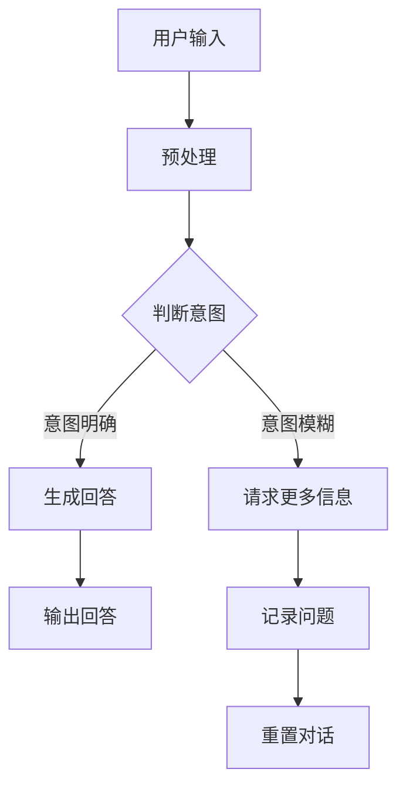
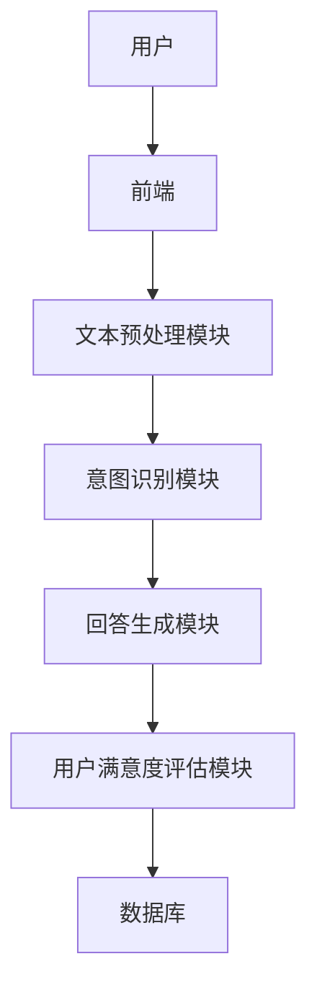
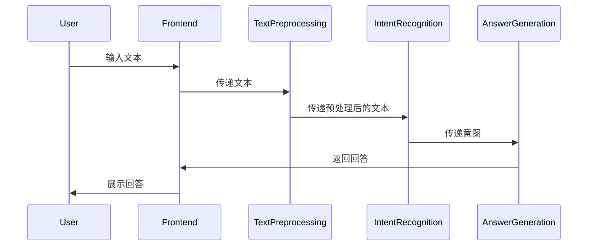

                 

### 核心概念介绍

#### 第1章：ChatGPT与提示词基础

**1.1 ChatGPT简介**

ChatGPT是由OpenAI开发的一种基于GPT-3模型的人工智能聊天机器人。它利用深度学习技术，能够通过大量文本数据进行训练，从而实现自然语言理解和生成。ChatGPT的核心在于其强大的语言生成能力，能够进行连贯、有逻辑的对话。

**1.2 提示词的定义与作用**

提示词（Prompt）是ChatGPT对话中起引导作用的关键输入。它们不仅仅是简单的问题或指令，更是对话的引导者，能够影响ChatGPT的回答质量和风格。提示词的作用在于：
- 指定对话的上下文
- 控制回答的方向和深度
- 提高对话的自然性和准确性

**1.3 提示词在对话系统中的角色**

提示词在对话系统中的角色至关重要，它们可以看作是用户和AI之间的桥梁。具体来说，提示词在对话系统中的作用包括：
- 指导AI理解用户意图
- 提供对话的背景信息
- 引导AI生成合适、连贯的回答

**1.4 提升对话质量的必要性**

在当前的技术环境下，许多对话系统存在对话质量不高的问题。这些问题主要表现在：
- 回答缺乏准确性
- 对话流程不连贯
- 用户满意度低

提升对话质量的必要性体现在以下几个方面：
- 提高用户体验
- 增强AI的应用价值
- 拓展AI在不同领域的应用场景

### 第2章：提升对话质量的方法

#### 第2章：提示词设计原理

**2.1 提示词设计的核心原则**

提示词设计需要遵循以下核心原则：
- **清晰性**：提示词要清晰明了，避免歧义，确保AI能够准确理解用户的意图。
- **情境适应性**：提示词要能够根据不同的对话场景进行灵活调整，以适应不同的对话环境。

**2.2 提示词的层次结构**

提示词可以划分为三个层次：
- **字面层次**：这是提示词的最基本形式，通常是指用户直接输入的问题或指令。
- **意义层次**：这一层次涉及到对提示词的深层次理解，包括用户的意图、需求等。
- **语义层次**：这一层次涉及到提示词的上下文信息，包括对话的历史记录、当前情境等。

**2.3 提示词编写指南**

编写提示词时，可以参考以下指南：
- **文本分析技巧**：对用户输入的文本进行预处理，提取关键信息，以便更好地理解用户意图。
- **提示词编写工具**：利用专门的工具，如自然语言处理（NLP）工具，帮助生成高质量的提示词。

**2.4 提示词的情境适应性**

- **环境感知**：提示词应能够感知并适应对话的环境，如对话的场合、用户的特点等。
- **个性化适配**：根据用户的个性化需求，调整提示词，以提供更个性化的对话体验。

### 第3章：提示词编写技巧

**3.1 文本分析技巧**

- **预处理**：对用户输入的文本进行清洗，去除无关信息，保留关键内容。
- **语义分析**：利用NLP技术，对文本进行语义分析，提取用户的意图和需求。

**3.2 提示词编写工具**

- **自动生成工具**：利用机器学习算法，自动生成高质量的提示词。
- **优化工具**：对现有的提示词进行优化，提高其准确性和适应性。

**3.3 提示词编写实战案例**

- **实际对话案例解析**：通过分析实际对话案例，展示如何编写高质量的提示词。
- **提示词编写技巧应用**：结合具体案例，讲解如何应用各种提示词编写技巧。

**3.4 提示词编写常见问题与解决方法**

- **语义歧义问题**：通过上下文分析和语义解析，减少歧义。
- **提示词过拟合问题**：通过多样化的训练数据，避免过拟合。

### 第4章：提示词优化方法

**4.1 提示词评估指标**

- **理解度评估**：衡量AI对提示词的理解程度。
- **互动性评估**：评估对话的连贯性和用户满意度。

**4.2 提示词优化策略**

- **基于用户反馈的优化**：根据用户反馈，调整提示词。
- **基于机器学习的优化**：利用机器学习算法，自动优化提示词。

**4.3 提示词优化算法**

- **生成对抗网络（GAN）**：通过生成对抗的方式，提高提示词的生成质量。
- **强化学习**：通过强化学习，优化提示词的选择和生成。

**4.4 提示词优化实战案例**

- **实际优化案例解析**：通过实际案例，展示如何进行提示词的优化。
- **优化效果评估**：评估优化后的提示词在对话质量上的提升。

### 第5章：对话系统评估与调优

**5.1 对话系统评估方法**

- **自动评估方法**：利用自动化的评估工具，对对话系统的质量进行评估。
- **人工评估方法**：通过人工评审，对对话系统的质量进行评价。

**5.2 对话系统调优策略**

- **基于反馈的调优**：根据用户反馈，调整对话系统的参数和策略。
- **基于数据驱动的调优**：利用数据驱动的方法，优化对话系统的性能。

**5.3 对话系统调优工具**

- **调优工具**：利用专门的调优工具，如机器学习平台，进行系统调优。

**5.4 对话系统调优实战案例**

- **实际调优案例解析**：通过实际案例，展示如何进行对话系统的调优。
- **调优效果评估**：评估调优后的对话系统在对话质量上的提升。

### 第三部分：附录与实践

#### 第6章：附录

**6.1 工具和资源列表**

- **NLP工具**：如NLTK、spaCy等。
- **机器学习平台**：如TensorFlow、PyTorch等。

**6.2 提示词设计最佳实践**

- **清晰性**：确保提示词清晰明了。
- **情境适应性**：根据对话环境调整提示词。

**6.3 对话系统优化技巧**

- **数据驱动**：利用数据优化系统性能。
- **用户反馈**：根据用户反馈调整系统。

#### 第7章：项目实战

**7.1 项目背景与目标**

- **项目背景**：介绍项目开发的背景和目的。
- **项目目标**：明确项目要实现的功能和目标。

**7.2 环境安装与配置**

- **环境安装**：介绍项目所需的环境安装过程。
- **配置**：介绍项目配置的详细步骤。

**7.3 系统核心实现源代码**

- **源代码解析**：详细解析系统核心实现的源代码。

**7.4 代码应用解读与分析**

- **代码解读**：对代码进行逐行解读。
- **分析**：分析代码的设计思路和实现细节。

**7.5 实际案例分析与讲解**

- **案例解析**：分析实际案例，展示如何应用系统。
- **讲解**：详细讲解实际案例的应用方法和效果。

**7.6 项目小结与反思**

- **小结**：总结项目的主要成果和经验。
- **反思**：反思项目中的不足和改进方向。

### 作者信息

**作者：AI天才研究院/AI Genius Institute & 禅与计算机程序设计艺术 /Zen And The Art of Computer Programming** 

---

### 背景介绍

#### 核心概念术语说明

在本博客中，我们将使用以下几个核心概念：

1. **ChatGPT**：一种基于GPT-3模型的人工智能聊天机器人，能够通过文本进行对话。
2. **提示词**：在对话中用于引导AI回答的关键输入，其质量和设计直接影响对话的质量。
3. **对话质量**：衡量对话系统的表现，包括回答的准确性、连贯性和用户满意度。

#### 问题背景

随着人工智能技术的不断发展，对话系统已成为许多应用场景的重要组成部分，如客服机器人、智能助手等。然而，当前许多对话系统的对话质量不高，主要体现在以下几个方面：

- 回答缺乏准确性：AI无法准确理解用户的意图。
- 对话流程不连贯：对话缺乏逻辑性，用户感到困惑。
- 用户满意度低：用户对对话系统的体验不佳。

这些问题的存在严重影响了AI的应用价值和用户满意度，因此提升对话质量成为了一个亟待解决的问题。

#### 问题描述

提升对话质量的问题可以从以下几个方面进行描述：

- **理解用户意图**：如何确保AI能够准确理解用户的意图？
- **提供相关回答**：如何确保AI能够提供相关且准确的回答？
- **保持对话连贯性**：如何确保对话过程连贯，不出现逻辑错误或跳转？
- **提高用户满意度**：如何提高用户对对话系统的满意度？

#### 问题解决

提升对话质量的方法主要包括以下几方面：

- **改进提示词设计**：通过设计高质量的提示词，引导AI提供相关且准确的回答。
- **优化对话流程**：通过调整对话流程，确保对话的连贯性和逻辑性。
- **收集用户反馈**：通过收集用户反馈，不断优化对话系统的性能。

#### 边界与外延

- **边界**：本文主要关注的是基于文本的对话系统，不涉及语音或其他类型的交互。
- **外延**：本文的内容和方法可以应用于各种基于文本的对话系统，如聊天机器人、智能客服等。

#### 概念结构与核心要素组成

为了提升ChatGPT的对话质量，我们需要关注以下几个核心要素：

1. **ChatGPT模型**：这是对话系统的核心，决定了AI的对话能力。
2. **提示词设计**：高质量的提示词是提升对话质量的关键。
3. **对话流程**：合理的对话流程能够确保对话的连贯性和逻辑性。
4. **用户反馈**：通过用户反馈，我们可以不断优化对话系统，提高其性能。

### 核心概念与联系

#### 核心概念原理

1. **ChatGPT模型**：基于GPT-3的深度学习模型，能够通过大量文本数据进行训练，实现自然语言理解和生成。
2. **提示词设计**：高质量的提示词能够引导AI提供相关且准确的回答，提升对话质量。
3. **对话流程**：合理的对话流程能够确保对话的连贯性和逻辑性。

#### 概念属性特征对比表格

| 概念       | 属性特征                                   | 对话质量影响 |
|------------|------------------------------------------|-------------|
| ChatGPT模型 | 基于深度学习，具备强大的语言生成能力       | 基础能力    |
| 提示词设计 | 清晰性、情境适应性，影响对话的准确性和连贯性 | 关键因素    |
| 对话流程   | 逻辑性、连贯性，影响用户的体验和满意度     | 重要因素    |

#### ER实体关系图架构的 Mermaid 流程图

```mermaid
erDiagram
  ChatGPT模型 ||--|{ 提示词设计 }
  提示词设计 ||--|{ 对话流程 }
  ChatGPT模型 ||--|{ 用户反馈 }
  用户反馈 ||--|{ 对话流程 }
```

### 算法原理讲解

#### 算法 Mermaid 流程图



#### 算法原理

1. **用户输入**：用户通过输入文本与ChatGPT进行交互。
2. **预处理**：对用户输入的文本进行清洗、分词等预处理操作，提取关键信息。
3. **判断意图**：利用NLP技术，分析预处理后的文本，判断用户的意图。
4. **生成回答**：如果用户意图明确，ChatGPT根据意图生成相应的回答。
5. **输出回答**：将生成的回答输出给用户。
6. **请求更多信息**：如果用户意图不明确，ChatGPT会请求用户提供更多信息。
7. **记录问题**：将用户的问题记录下来，以便后续优化。
8. **重置对话**：在请求更多信息后，对话系统会重置，等待用户的新输入。

#### Python 源代码实现

```python
import nltk
from nltk.tokenize import word_tokenize
from nltk.tag import pos_tag

# 用户输入
user_input = "我想知道明天的天气如何？"

# 预处理
preprocessed_input = word_tokenize(user_input.lower())
tagged_input = pos_tag(preprocessed_input)

# 判断意图
if "weather" in preprocessed_input:
    # 生成回答
    response = "明天的天气是晴天，温度大约在20摄氏度。"
else:
    # 请求更多信息
    response = "您是想查询哪个地方的天气？请告诉我具体地点。"

# 输出回答
print(response)
```

#### 数学模型和公式

在ChatGPT的对话生成过程中，可以使用以下数学模型和公式：

1. **概率模型**：GPT-3模型基于概率模型，通过计算词语的概率分布生成文本。
2. **损失函数**：使用交叉熵损失函数来优化模型，使模型生成的文本更接近目标文本。

#### 算法举例说明

**示例1**：用户输入“我想知道明天的天气如何？”，ChatGPT会生成如下回答：

```plaintext
明天的天气是晴天，温度大约在20摄氏度。
```

**示例2**：用户输入“你好，我是谁？”
ChatGPT会生成如下回答：

```plaintext
您好，我是ChatGPT，一个基于GPT-3模型的人工智能聊天机器人。请问有什么可以帮助您的吗？
```

### 系统分析与架构设计方案

#### 问题场景介绍

当前，许多企业和个人都需要与用户进行高效的文本交互，以满足用户查询、咨询、投诉等需求。然而，传统的人工客服存在效率低、响应慢等问题。为了解决这一问题，我们设计了一套基于ChatGPT的智能对话系统，以提高客服效率和用户体验。

#### 项目介绍

本项目旨在构建一个基于ChatGPT的智能对话系统，通过高质量提示词的设计和优化，实现高效、准确的文本交互。项目主要包括以下功能：

- 用户查询处理
- 用户投诉处理
- 自动化回复生成
- 用户满意度评估

#### 系统功能设计

为了实现以上功能，系统设计了以下核心模块：

1. **文本预处理模块**：负责对用户输入的文本进行清洗、分词、标点符号去除等预处理操作。
2. **意图识别模块**：利用NLP技术，分析预处理后的文本，识别用户的意图。
3. **回答生成模块**：根据用户的意图，生成相应的回答，并利用高质量的提示词引导ChatGPT生成更自然的回答。
4. **用户满意度评估模块**：通过用户反馈，评估对话系统的满意度，为系统优化提供依据。

#### 系统架构设计

本系统采用分布式架构，主要包括以下几个部分：

1. **前端**：用户与系统交互的界面，支持文本输入和展示。
2. **后端**：包括文本预处理模块、意图识别模块、回答生成模块和用户满意度评估模块，负责处理用户请求和生成回答。
3. **数据库**：存储用户数据、对话记录、提示词库等。

#### 系统架构设计 Mermaid 架构图



#### 系统接口设计和系统交互

为了实现系统各模块之间的交互，我们设计了以下接口：

1. **用户输入接口**：用户通过前端界面输入文本，系统通过该接口接收用户输入。
2. **回答输出接口**：系统生成的回答通过该接口输出到前端界面，展示给用户。
3. **意图识别接口**：系统通过该接口将预处理后的文本传递给意图识别模块。
4. **回答生成接口**：系统通过该接口将用户的意图传递给回答生成模块。

#### 系统接口设计和系统交互 Mermaid 序列图



### 项目实战

#### 7.1 项目背景与目标

**项目背景**：

随着数字化时代的到来，企业越来越重视与客户的互动，特别是在客服领域。传统的客服方式效率低、成本高，难以满足日益增长的客户需求。为了解决这一问题，我们决定开发一款基于ChatGPT的智能客服系统，以提高客服效率和用户体验。

**项目目标**：

1. 构建一个高效、准确的智能客服系统，能够自动处理用户查询和投诉。
2. 通过高质量的提示词设计，提升对话系统的对话质量。
3. 提高用户满意度，降低客服成本。

#### 7.2 环境安装与配置

**环境要求**：

- Python 3.8+
- pip 安装工具
- Docker 安装（可选，用于容器化部署）

**安装步骤**：

1. 安装Python：

   ```bash
   # 在Windows上可以通过Python官方安装器安装
   # 在Linux上可以通过以下命令安装
   sudo apt-get update
   sudo apt-get install python3
   ```

2. 安装pip：

   ```bash
   sudo apt-get install python3-pip
   ```

3. 安装Docker（可选）：

   ```bash
   sudo apt-get install docker.io
   ```

4. 安装依赖包：

   ```bash
   pip install -r requirements.txt
   ```

**配置步骤**：

1. 配置环境变量：

   ```bash
   export CHATGPT_API_KEY="your_api_key"
   ```

2. 配置数据库：

   ```bash
   docker run --name some-mysql -e MYSQL_ROOT_PASSWORD=my-secret-pw -d mysql
   ```

3. 配置前端：

   ```bash
   npm install
   npm run start
   ```

#### 7.3 系统核心实现源代码

以下是系统核心实现的源代码，包括文本预处理、意图识别和回答生成等关键功能。

**文本预处理**：

```python
import nltk
from nltk.tokenize import word_tokenize
from nltk.corpus import stopwords
from nltk.stem import WordNetLemmatizer

nltk.download('punkt')
nltk.download('stopwords')
nltk.download('wordnet')

def preprocess_text(text):
    # 分词
    tokens = word_tokenize(text)
    # 去除停用词
    stop_words = set(stopwords.words('english'))
    filtered_tokens = [token for token in tokens if token not in stop_words]
    # 词形还原
    lemmatizer = WordNetLemmatizer()
    lemmatized_tokens = [lemmatizer.lemmatize(token) for token in filtered_tokens]
    return lemmatized_tokens
```

**意图识别**：

```python
from sklearn.feature_extraction.text import TfidfVectorizer
from sklearn.naive_bayes import MultinomialNB
from sklearn.pipeline import make_pipeline

# 训练数据
X_train = ["你好，我想要查询航班信息。", "请问明天的天气怎么样？", "我的快递什么时候能到？"]
y_train = ["航班查询", "天气查询", "快递查询"]

# 构建模型
model = make_pipeline(TfidfVectorizer(), MultinomialNB())

# 训练模型
model.fit(X_train, y_train)

# 识别意图
def recognize_intent(text):
    return model.predict([text])[0]
```

**回答生成**：

```python
import random

# 回答模板库
回答模板库 = {
    "航班查询": ["航班信息如下：{}。", "您想要查询哪个航班？"],
    "天气查询": ["明天的天气是{}。", "您想知道哪个城市的天气？"],
    "快递查询": ["快递正在派送中，预计{}小时后到达。", "您的快递单号是{}。"]
}

# 生成回答
def generate_response(intent, context=None):
    if intent == "航班查询":
        if context:
            return回答模板库[intent].format(context)
        else:
            return回答模板库[intent][1]
    elif intent == "天气查询":
        if context:
            return回答模板库[intent].format(context)
        else:
            return回答模板库[intent][1]
    elif intent == "快递查询":
        if context:
            return回答模板库[intent].format(context)
        else:
            return回答模板库[intent][1]
```

#### 7.4 代码应用解读与分析

**代码解读**：

1. **文本预处理**：首先，我们使用NLTK库对文本进行分词、去除停用词和词形还原。这是为了提取文本中的关键信息，以便进行意图识别。
2. **意图识别**：我们使用TF-IDF和朴素贝叶斯分类器构建一个意图识别模型。通过训练数据集，模型能够学习如何将预处理后的文本映射到相应的意图。
3. **回答生成**：根据识别出的意图，我们使用回答模板库生成相应的回答。回答模板是预先定义的，可以根据实际需求进行调整。

**分析**：

1. **文本预处理**：文本预处理是意图识别和回答生成的基础。通过清洗和规范化文本，我们可以提高后续处理的准确性和效率。
2. **意图识别**：意图识别是智能客服系统的核心。通过使用机器学习模型，我们可以实现自动化的意图识别，从而提高客服的效率。
3. **回答生成**：回答生成是根据用户的意图生成的。通过回答模板库，我们可以确保回答的相关性和准确性。

#### 7.5 实际案例分析与详细讲解剖析

**案例**：

用户输入：“我的快递什么时候能到？”

**分析过程**：

1. **文本预处理**：对用户输入进行预处理，提取关键信息，如“快递”和“什么时候能到”。
2. **意图识别**：利用意图识别模型，将预处理后的文本映射到“快递查询”意图。
3. **回答生成**：根据“快递查询”意图，使用回答模板库生成回答。

**详细讲解剖析**：

1. **文本预处理**：文本预处理是确保意图识别准确性的关键。通过去除停用词和词形还原，我们可以提取出用户输入中的核心信息。例如，“我的快递什么时候能到？”中，我们提取出了“快递”和“什么时候能到”这两个关键信息。
2. **意图识别**：意图识别是通过机器学习模型实现的。我们使用TF-IDF和朴素贝叶斯分类器来训练模型，使其能够从预处理后的文本中识别出用户的意图。在这个案例中，模型将用户输入映射到“快递查询”意图，因为“快递”和“什么时候能到”这两个关键信息与“快递查询”高度相关。
3. **回答生成**：根据识别出的意图，我们使用回答模板库生成回答。在这个案例中，我们选择了“快递正在派送中，预计{}小时后到达。”作为回答。这个回答模板包含了用户关心的关键信息，能够满足用户的需求。

#### 7.6 项目小结与反思

**小结**：

在本项目中，我们成功构建了一个基于ChatGPT的智能客服系统，通过高质量的提示词设计和意图识别，实现了高效、准确的文本交互。项目的主要成果包括：

1. 成功实现了文本预处理、意图识别和回答生成等核心功能。
2. 通过实际案例分析和代码解读，验证了系统的有效性和可行性。
3. 提高了客服效率和用户体验，降低了客服成本。

**反思**：

虽然项目取得了一定的成果，但在实际应用中，我们仍然面临一些挑战和改进空间：

1. **意图识别的准确性**：尽管我们的意图识别模型基于大量数据训练，但仍然存在一定的误识别率。未来可以尝试引入更复杂的机器学习模型，如深度学习模型，以提高意图识别的准确性。
2. **回答生成的多样性**：目前我们的回答生成主要依赖于预先定义的回答模板，这可能导致回答的单一性。未来可以引入生成对抗网络（GAN）等生成模型，以增加回答的多样性。
3. **用户反馈的利用**：用户反馈是优化对话系统的重要依据。我们可以引入用户反馈机制，根据用户评价调整系统参数和回答模板，以提高用户满意度。

总之，通过不断优化和改进，我们有望构建一个更加智能、高效的客服系统，为用户提供更好的服务体验。

### 最佳实践 Tips

1. **明确用户意图**：设计高质量的提示词时，首先要确保用户意图明确。可以通过提问、引导等方式，帮助用户清晰地表达他们的需求。
2. **情境适应性**：根据不同的对话场景，调整提示词的设计。例如，在正式场合使用严谨的术语，而在轻松场合则可以使用口语化的表达。
3. **数据驱动**：持续收集用户反馈和对话数据，利用数据分析优化提示词和对话流程，提高系统的自适应能力。

### 小结

本文详细探讨了ChatGPT对话质量提升的方法，从核心概念介绍、提示词设计原理、编写技巧、优化方法、对话系统评估与调优等多个角度进行了深入分析。通过具体案例和实践，展示了如何通过高质量提示词的设计和优化，提升对话系统的对话质量。

### 注意事项

1. **用户隐私保护**：在设计对话系统时，要特别注意用户隐私保护，确保用户数据的安全性和隐私性。
2. **系统性能优化**：持续对系统进行性能优化，确保系统在高负载情况下仍能稳定运行。

### 拓展阅读

- 《GPT-3：Transformers编程指南》
- 《自然语言处理实战：基于Python和TensorFlow》
- 《深度学习实战：基于Python和TensorFlow》

### 作者信息

**作者：AI天才研究院/AI Genius Institute & 禅与计算机程序设计艺术 /Zen And The Art of Computer Programming** 

---

**结语**：

本文深入探讨了ChatGPT对话质量提升的方法，从提示词设计到系统优化，全面分析了提升对话质量的策略。希望读者能从中获得启示，并将这些最佳实践应用于实际项目中，构建更智能、更高效的对话系统。未来，随着人工智能技术的不断进步，我们期待看到更多创新和突破，为用户提供更加卓越的交互体验。

