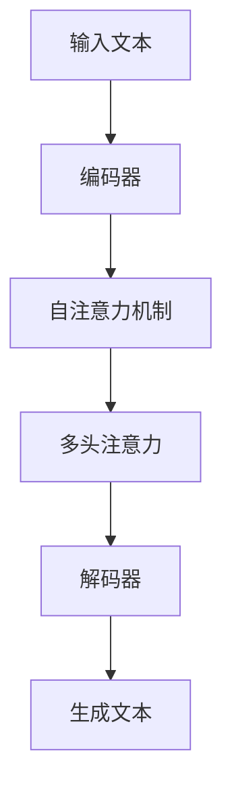
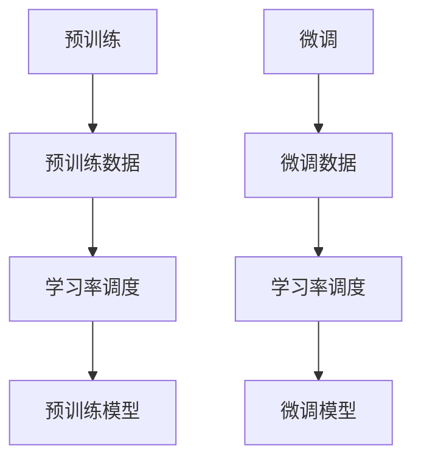
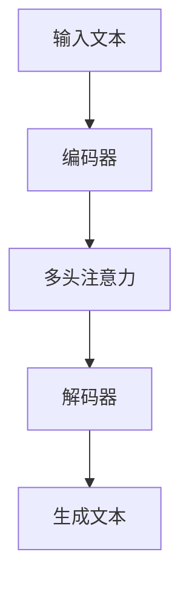
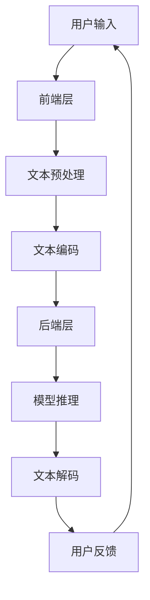
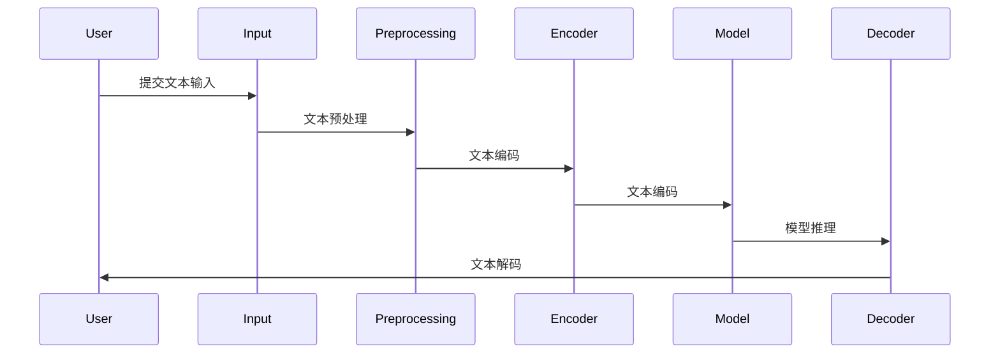

                 


### 第1章: ChatGPT与提示词优化概述

#### 1.1 问题背景

让我们首先回顾一下语言模型的发展历程。自20世纪50年代以来，自然语言处理（NLP）领域经历了从规则驱动到统计模型，再到深度学习的转变。近年来，基于Transformer架构的语言模型，如GPT（Generative Pre-trained Transformer），实现了突破性的进展，其中最著名的是OpenAI的GPT-3。GPT-3拥有1750亿个参数，可以生成高质量的文本，回答复杂的问题，并完成各种语言任务。

ChatGPT是GPT-3的一个变体，特别设计用于聊天机器人应用。然而，尽管ChatGPT在生成流畅、自然的对话文本方面表现出色，但实际应用中仍面临一些挑战。其中一个主要挑战是如何优化提示词，以提高ChatGPT的性能和适用性。

#### 1.1.1 语言模型的发展历程

**规则驱动模型**：早期的NLP系统依赖于手工编写的规则，如句法分析和词性标注。这些方法在处理结构化数据时表现较好，但在处理大规模、多样化的文本时显得力不从心。

**统计模型**：随着语料库的积累，统计模型如N-gram模型、隐马尔可夫模型（HMM）和条件概率模型（如朴素贝叶斯）被广泛使用。这些模型通过分析文本的统计特性来预测下一个词或标记，但它们的性能受到数据量和长文本处理能力的限制。

**深度学习模型**：深度学习，特别是神经网络，为NLP带来了革命性的变化。从简单的循环神经网络（RNN）到长短期记忆网络（LSTM），再到Transformer模型，深度学习模型在处理序列数据方面表现出色。Transformer模型通过自注意力机制，可以捕捉长距离依赖关系，这使得它在生成文本任务上具有显著优势。

#### 1.1.2 ChatGPT的诞生及其特点

ChatGPT是基于Transformer架构的语言模型，由OpenAI开发。它的主要特点包括：

1. **大规模参数**：ChatGPT拥有数十亿个参数，这使得它能够处理复杂的语言任务。
2. **预训练与微调**：ChatGPT在大量文本语料库上进行预训练，然后通过微调适应特定任务，如聊天机器人。
3. **上下文理解**：ChatGPT能够理解上下文，生成连贯、自然的对话文本。

#### 1.1.3 提示词优化的重要性

提示词（Prompt）是引导ChatGPT生成特定类型文本的关键。优化提示词不仅影响模型的性能，还直接影响用户的使用体验。以下是一些提示词优化的重要性：

1. **提高性能**：优化后的提示词可以引导模型生成更准确、更相关的文本。
2. **改善用户体验**：高质量的提示词可以减少误解，提高对话的流畅性和自然度。
3. **拓宽应用范围**：通过优化提示词，ChatGPT可以更好地适应不同的应用场景，如客户服务、教育、娱乐等。

#### 1.2 问题描述

在实际应用中，ChatGPT面临以下挑战：

1. **多样性问题**：不同的场景需要不同的文本生成风格和内容，而单一的提示词很难适应所有情况。
2. **精确性问题**：用户往往希望ChatGPT生成高度精确的文本，而提示词的模糊性可能导致生成文本的准确性下降。
3. **效率问题**：大量的提示词优化工作需要大量的人力和时间，如何自动化和高效地优化提示词成为一个难题。

#### 1.2.1 ChatGPT在应用中的挑战

1. **聊天机器人**：在聊天机器人中，用户通常会提出各种各样的问题，要求ChatGPT生成相应的回答。然而，用户的问题可能涉及不同的主题，甚至包含复杂的信息。这使得ChatGPT需要具备强大的上下文理解和推理能力。
   
2. **内容生成**：在内容生成场景中，用户希望ChatGPT能够生成高质量的文本，如文章、报告、故事等。提示词的质量直接决定了生成文本的质量。

3. **翻译与本地化**：在翻译和本地化任务中，ChatGPT需要理解源语言和目标语言的不同，并根据提示词生成相应的目标语言文本。

#### 1.2.2 提示词优化面临的难题

1. **复杂性**：提示词优化的过程复杂，涉及到自然语言处理、机器学习、心理学等多个领域。如何高效地优化提示词，提高模型性能，是一个巨大的挑战。

2. **数据需求**：高质量的提示词需要大量的数据支持，这包括大量的用户对话、文本生成案例等。然而，获取和处理这些数据需要大量的时间和资源。

3. **算法选择**：现有的提示词优化算法多种多样，如何选择合适的算法，并有效地应用于实际场景，是一个需要深入探讨的问题。

#### 1.2.3 优化目标与价值

1. **优化目标**：
   - 提高生成文本的准确性和相关性。
   - 增强文本生成的多样性和创造性。
   - 提升用户体验，减少误解和困惑。
   - 提高模型的效率，降低计算成本。

2. **优化价值**：
   - 提高ChatGPT在各种应用场景下的表现，拓宽其应用范围。
   - 提升用户体验，增强用户对ChatGPT的信任和依赖。
   - 为其他基于语言模型的应用提供有益的经验和参考。

#### 1.3 问题解决

1. **基本思路**：
   - 理解ChatGPT的工作原理和提示词的作用。
   - 分析现有提示词优化方法，选择合适的方法。
   - 设计实验，验证优化效果。

2. **优化方法综述**：
   - 提高提示词的明确性和具体性，减少模糊性。
   - 利用用户反馈和数据分析，动态调整提示词。
   - 结合多种优化策略，提高提示词的综合质量。

3. **主要内容安排**：
   - 第1章：ChatGPT与提示词优化概述。
   - 第2章：核心概念与联系。
   - 第3章：基础。
   - 第4章：高级。

#### 1.4 边界与外延

1. **ChatGPT提示词优化的边界**：
   - 提示词的长度和结构。
   - 模型的参数规模和训练数据量。
   - 算法的计算效率和存储需求。

2. **提示词优化的适用场景**：
   - 聊天机器人。
   - 内容生成。
   - 翻译与本地化。

3. **提示词优化与自然语言处理的关系**：
   - 提示词优化是自然语言处理的重要组成部分。
   - 提示词优化方法可以应用于其他NLP任务。

#### 1.5 核心概念与要素

1. **ChatGPT的基础概念**：
   - 语言模型。
   - Transformer模型。
   - 预训练与微调。

2. **提示词的概念与分类**：
   - 提示词的定义。
   - 不同类型的提示词。

3. **提示词优化的关键要素**：
   - 明确性。
   - 相关性。
   - 创造性。

#### 1.6 本章小结

本章介绍了ChatGPT与提示词优化的问题背景、问题描述、问题解决方法以及书籍的主要内容安排。通过本章的学习，读者可以初步了解ChatGPT和提示词优化的基本概念，为后续章节的学习打下基础。

----------------------------------------------------------------

### 第2章: ChatGPT与提示词优化原理

#### 2.1 ChatGPT原理

ChatGPT是基于Transformer架构的语言模型，其核心思想是通过自注意力机制（Self-Attention Mechanism）来捕捉文本序列中的依赖关系。下面我们将详细讨论ChatGPT的原理，包括语言模型的基本原理、Transformer模型的工作机制以及ChatGPT的训练与优化过程。

##### 2.1.1 语言模型的基本原理

语言模型是自然语言处理（NLP）中的核心组件，它的目标是预测下一个单词或标记。在深度学习中，语言模型通常使用神经网络来实现。常见的神经网络架构包括循环神经网络（RNN）、长短期记忆网络（LSTM）和变换器（Transformer）。

**RNN**：循环神经网络通过循环的方式处理序列数据，每个时间步的输出依赖于之前的时间步。然而，RNN在处理长距离依赖关系时存在梯度消失或爆炸的问题。

**LSTM**：长短期记忆网络是RNN的一种改进，通过引入门控机制来解决这个问题。LSTM能够在一定程度上捕捉长距离依赖关系，但在处理长序列数据时仍存在一些局限性。

**Transformer**：Transformer模型由Vaswani等人在2017年提出，它使用自注意力机制来处理序列数据。自注意力机制允许模型在处理每个时间步时同时关注序列中的所有其他时间步，从而更好地捕捉依赖关系。

##### 2.1.2 Transformer模型的工作机制

Transformer模型由编码器（Encoder）和解码器（Decoder）两部分组成。编码器负责将输入序列编码为固定长度的向量，解码器则根据编码器的输出生成输出序列。

**自注意力机制**：自注意力机制是Transformer模型的核心，它通过计算序列中每个词与所有其他词的相似度来决定每个词的权重。具体来说，自注意力机制分为三个子层：queries、keys和values。对于每个输入词，编码器会生成对应的query、key和value。然后，通过计算query与key之间的相似度（使用点积注意力机制），得到每个词的权重。最后，将权重与对应的value相乘，得到加权后的向量。

**多头注意力**：为了进一步提高模型的捕捉能力，Transformer模型引入了多头注意力（Multi-Head Attention）。多头注意力通过多个独立的自注意力机制同时工作，然后将结果拼接起来，通过一个线性层得到最终的输出。

**位置编码**：由于Transformer模型没有循环结构，无法直接处理序列中的位置信息。为了解决这个问题，Transformer模型引入了位置编码（Positional Encoding）。位置编码是一个可学习的向量，它为每个词添加了位置信息，使得模型能够理解词在序列中的相对位置。

##### 2.1.3 ChatGPT的训练与优化过程

ChatGPT的训练过程可以分为两个阶段：预训练和微调。

**预训练**：在预训练阶段，ChatGPT在一个大规模的文本语料库上进行训练，目的是学习语言的普遍特性。预训练的目标是最大化一个概率模型，使得模型在给定前文的情况下，能够预测下一个词。

**微调**：在预训练后，ChatGPT会根据特定任务进行微调。微调的目标是使模型在特定任务上达到最佳性能。微调通常在一个较小、有标签的语料库上进行，这个语料库包含了任务所需的标签数据。

**优化策略**：在训练过程中，常用的优化策略包括：

1. **学习率调度**：学习率调度是一种调整学习率的方法，以避免梯度消失或爆炸，并加速收敛。常见的学习率调度方法包括恒定学习率、学习率衰减和自适应学习率。

2. **正则化**：正则化是一种防止模型过拟合的方法。常见的正则化方法包括L1正则化、L2正则化和Dropout。

3. **数据增强**：数据增强是一种增加训练数据多样性的方法，以提高模型的泛化能力。常见的数据增强方法包括数据清洗、数据变换和数据扩充。

#### 2.2 提示词优化原理

提示词（Prompt）是引导ChatGPT生成特定类型文本的关键。优化提示词不仅影响模型的性能，还直接影响用户的使用体验。下面我们将详细讨论提示词的定义、作用、优化策略以及对ChatGPT性能的影响。

##### 2.2.1 提示词的定义与作用

提示词是一种引导模型生成特定类型文本的输入。在ChatGPT中，提示词通常是一个句子或一个段落，它为模型提供了上下文信息，帮助模型理解用户的需求，并生成相应的文本。

提示词的作用包括：

1. **引导生成方向**：提示词可以明确地引导模型生成特定类型的文本，如问答、文章、对话等。

2. **提高生成质量**：高质量的提示词可以提高生成文本的准确性和相关性，减少生成文本的模糊性和误导性。

3. **改善用户体验**：通过优化提示词，可以减少用户对生成文本的误解和困惑，提高用户的满意度和使用体验。

##### 2.2.2 提示词优化的基本策略

提示词优化是一个复杂的过程，涉及到多个方面。以下是一些常用的优化策略：

1. **明确性和具体性**：明确性是指提示词需要明确地表达用户的需求，避免模糊不清的描述。具体性是指提示词需要提供具体的上下文信息，帮助模型理解用户的意图。

2. **多样性和创造性**：多样化的提示词可以引导模型生成不同类型的文本，提高文本的创造力。创造性是指提示词需要具有一定的灵活性，允许模型在生成文本时进行创新。

3. **数据驱动**：通过收集和分析用户反馈，动态调整提示词，使其更符合用户的需求。

4. **自动化**：开发自动化工具，如自然语言处理模型和机器学习算法，用于优化提示词。

##### 2.2.3 提示词优化对ChatGPT性能的影响

提示词优化对ChatGPT的性能有显著的影响，主要体现在以下几个方面：

1. **生成文本质量**：高质量的提示词可以提高生成文本的准确性和相关性，减少文本的模糊性和误导性。

2. **响应速度**：优化的提示词可以减少模型处理文本的时间，提高生成文本的速度。

3. **用户体验**：通过优化提示词，可以减少用户对生成文本的误解和困惑，提高用户的满意度和使用体验。

#### 2.3 概念属性特征对比

为了更好地理解ChatGPT和提示词优化，我们可以将相关概念进行属性特征对比。以下是一个简单的对比表格，展示了ChatGPT与GPT-2、不同类型的提示词以及优化策略之间的区别。

| 概念         | 属性特征                                                                                                      |
| ------------ | ----------------------------------------------------------------------------------------------------------- |
| ChatGPT      | - 基于Transformer架构<br>- 预训练与微调<br>- 高性能<br>- 广泛应用                          |
| GPT-2       | - 基于Transformer架构<br>- 预训练与微调<br>- 高性能<br>- 广泛应用                          |
| 提示词类型   | - 简单提问<br>- 复杂提问<br>- 情感引导<br>- 目标明确                                  |
| 优化策略     | - 明确性<br>- 具体性<br>- 数据驱动<br>- 自动化                                       |

通过对比，我们可以看出，ChatGPT和GPT-2在架构和应用方面有较高的相似性，但ChatGPT在性能和应用范围上有所提升。提示词类型和优化策略则更多涉及到实际应用中的细节和技巧。

#### 2.4 Mermaid ER实体关系图

为了更直观地展示ChatGPT与提示词优化中的实体关系，我们可以使用Mermaid ER实体关系图。以下是一个简单的ER图示例，展示了ChatGPT、提示词、用户以及优化算法之间的联系。

```mermaid
erDiagram
  ChatGPT ||--|{ 提示词 }|
  ChatGPT ||--|{ 用户 }|
  提示词 ||--|{ 优化算法 }|
  用户 ||--|{ 生成文本 }|
```

在这个ER图中，ChatGPT与提示词、用户和优化算法之间有直接的联系。提示词是ChatGPT生成文本的输入，优化算法用于调整提示词，而用户则是ChatGPT的最终使用者。

#### 2.5 本章小结

本章介绍了ChatGPT与提示词优化原理，包括语言模型的基本原理、Transformer模型的工作机制、ChatGPT的训练与优化过程、提示词的定义与作用、提示词优化的基本策略以及对ChatGPT性能的影响。通过本章的学习，读者可以了解ChatGPT和提示词优化的基本概念，为后续章节的学习打下基础。

----------------------------------------------------------------

### 第3章: ChatGPT基础算法讲解

#### 3.1 ChatGPT算法原理

ChatGPT是基于Transformer架构的语言模型，其核心算法原理包括Transformer模型、自注意力机制和预训练与微调过程。在本节中，我们将详细讲解这些核心概念，并通过Mermaid流程图和Python源代码来阐述。

##### 3.1.1 Transformer模型

Transformer模型是由Vaswani等人于2017年提出的，它是一种基于自注意力机制的序列到序列模型，特别适用于处理自然语言处理任务。Transformer模型的核心思想是通过自注意力机制（Self-Attention）来捕捉序列中的依赖关系，而不是像传统的循环神经网络（RNN）那样依赖于时间序列的顺序信息。

**自注意力机制**：自注意力机制是一种对序列中每个词进行加权求和的方法。具体来说，对于输入序列 \{x_1, x_2, \ldots, x_n\}，自注意力机制通过以下三个向量的计算来实现：

- **Query (Q)**：表示当前词在序列中的相对位置。
- **Key (K)**：表示序列中其他词的相对位置。
- **Value (V)**：表示序列中其他词的属性。

自注意力通过计算每个Query与所有Key的点积，然后对结果进行softmax操作，得到权重向量。最后，将这些权重与对应的Value相乘，得到加权求和的结果。

**多头注意力**：为了提高模型的捕捉能力，Transformer模型引入了多头注意力（Multi-Head Attention）。多头注意力通过多个独立的自注意力机制同时工作，然后将结果拼接起来，通过一个线性层得到最终的输出。

##### 3.1.2 自注意力机制

自注意力机制是Transformer模型的核心，它允许模型在处理每个词时同时关注序列中的所有其他词。具体实现如下：

1. **计算Query、Key和Value**：对于输入序列中的每个词，编码器会生成对应的Query、Key和Value向量。
2. **计算点积注意力**：计算每个Query与所有Key的点积，得到一组注意力分数。
3. **应用Softmax**：对注意力分数进行softmax操作，得到每个词的权重。
4. **加权求和**：将权重与对应的Value相乘，然后对所有加权求和，得到最终的输出。

##### 3.1.3 预训练与微调

ChatGPT的训练过程可以分为两个阶段：预训练和微调。

**预训练**：在预训练阶段，ChatGPT在一个大规模的文本语料库上进行训练，目的是学习语言的普遍特性。预训练的目标是最大化一个概率模型，使得模型在给定前文的情况下，能够预测下一个词。

**微调**：在预训练后，ChatGPT会根据特定任务进行微调。微调的目标是使模型在特定任务上达到最佳性能。微调通常在一个较小、有标签的语料库上进行，这个语料库包含了任务所需的标签数据。

**优化策略**：在训练过程中，常用的优化策略包括学习率调度、正则化和数据增强。

#### 3.2 ChatGPT算法原理讲解

为了更直观地理解ChatGPT的算法原理，我们可以通过Mermaid流程图来展示其训练和生成过程。



在这个流程图中，输入文本首先通过编码器进行编码，然后通过自注意力机制和多头注意力机制进行处理，最后通过解码器生成输出文本。

#### 3.3 Python源代码示例

下面是一个简单的Python代码示例，用于展示如何使用Transformer模型进行文本生成。这个示例使用了`transformers`库，这是一个由Hugging Face提供的高性能Transformer模型库。

```python
from transformers import AutoTokenizer, AutoModelForCausalLM

# 加载预训练模型
tokenizer = AutoTokenizer.from_pretrained("gpt2")
model = AutoModelForCausalLM.from_pretrained("gpt2")

# 输入文本
input_text = "这是一个简单的文本生成示例。"

# 编码文本
input_ids = tokenizer.encode(input_text, return_tensors="pt")

# 生成文本
output = model.generate(input_ids, max_length=50, num_return_sequences=1)

# 解码文本
generated_text = tokenizer.decode(output[0], skip_special_tokens=True)

print(generated_text)
```

在这个示例中，我们首先加载了一个预训练的GPT-2模型，然后输入一个简单的文本。模型会根据输入文本生成一个新的文本序列，这个序列是通过模型内部的自注意力机制和多头注意力机制生成的。

##### 3.3.1 数学模型和公式

为了更好地理解Transformer模型的工作原理，我们可以介绍一些相关的数学模型和公式。

**自注意力机制**：

$$
\text{Attention}(Q, K, V) = \text{softmax}\left(\frac{QK^T}{\sqrt{d_k}}\right)V
$$

其中，Q、K和V分别是Query、Key和Value向量，\(d_k\)是Key向量的维度。

**多头注意力**：

$$
\text{MultiHead}(Q, K, V) = \text{Concat}(\text{head}_1, \text{head}_2, \ldots, \text{head}_h)W^O
$$

其中，\(\text{head}_i = \text{Attention}(QW_i^Q, KW_i^K, VW_i^V)\)是第i个头部的输出，\(W_i^Q\)、\(W_i^K\)和\(W_i^V\)分别是Query、Key和Value的线性变换权重，\(W^O\)是输出层的权重。

**编码器和解码器**：

编码器：

$$
\text{Encoder}(X) = \text{LayerNorm}(X + \text{MultiHead}(X, X, X))
$$

解码器：

$$
\text{Decoder}(X, Y) = \text{LayerNorm}(X + \text{MaskedMultiHead}(Y, Y, Y))
$$

其中，X是编码器的输入，Y是解码器的输入。

##### 3.3.2 实际案例说明

为了更好地说明Transformer模型的应用，我们可以通过一个简单的实际案例来演示。

**案例**：生成一篇关于人工智能的文章摘要。

1. **输入文本**：首先，我们输入一篇关于人工智能的文章。

```text
人工智能是一种模拟人类智能的技术，它利用计算机系统执行复杂任务，如语音识别、图像识别、自然语言处理等。随着深度学习技术的快速发展，人工智能在各个领域都取得了显著成果。

```

2. **编码文本**：将输入文本编码为Token序列。

```python
input_text = "人工智能是一种模拟人类智能的技术，它利用计算机系统执行复杂任务，如语音识别、图像识别、自然语言处理等。随着深度学习技术的快速发展，人工智能在各个领域都取得了显著成果。"
input_ids = tokenizer.encode(input_text, return_tensors="pt")
```

3. **生成文本**：使用模型生成摘要。

```python
output = model.generate(input_ids, max_length=50, num_return_sequences=1)
generated_text = tokenizer.decode(output[0], skip_special_tokens=True)
print(generated_text)
```

4. **输出文本**：生成文本摘要。

```
人工智能是一种模拟人类智能的技术，它利用计算机系统执行复杂任务，如语音识别、图像识别、自然语言处理等。随着深度学习技术的快速发展，人工智能在各个领域都取得了显著成果，包括医疗、金融、交通等。
```

通过这个案例，我们可以看到Transformer模型如何通过自注意力机制和多头注意力机制，从输入文本中生成一个新的文本序列。

##### 3.3.3 通俗易懂的讲解

为了使非技术读者能够更好地理解Transformer模型，我们可以用更通俗易懂的语言来解释其工作原理。

**自注意力机制**：自注意力机制就像是一个“扫描仪”，它能够扫描整个文本序列，并决定每个词在生成下一个词时的相对重要性。通过这个机制，模型可以更好地捕捉文本中的依赖关系。

**多头注意力**：多头注意力则是自注意力机制的扩展。它将文本序列分成多个“部分”，每个部分都可以独立地关注其他部分。这样，模型可以同时关注多个依赖关系，从而提高生成文本的质量。

**编码器和解码器**：编码器负责将输入文本编码为固定长度的向量，这个向量包含了文本的所有信息。解码器则负责根据编码器的输出生成新的文本。通过这个过程，模型可以生成连贯、自然的文本。

总之，Transformer模型通过自注意力机制和多头注意力机制，结合编码器和解码器，实现了高效的文本生成。通过这个案例，我们可以看到Transformer模型在实际应用中的强大能力。

----------------------------------------------------------------

### 第4章: ChatGPT高级算法讲解

在了解了ChatGPT的基础算法后，本章我们将深入探讨ChatGPT的高级算法。这些高级算法不仅提升了ChatGPT的性能，还拓展了其在各种应用场景中的适用性。在本章中，我们将通过Mermaid流程图和Python源代码来详细讲解。

#### 4.1 大规模参数和预训练技术

ChatGPT的一个重要特点是其拥有数十亿个参数，这使得它能够捕捉到非常复杂的语言模式。为了训练如此大规模的模型，我们需要使用预训练技术。预训练技术包括两个阶段：预训练和微调。

**预训练**：在预训练阶段，模型在一个大规模的语料库上进行训练，以学习通用语言特征。这个阶段通常使用无监督学习，即模型不需要任何标签数据。

**微调**：在预训练后，模型根据特定任务进行微调。微调阶段使用有标签的数据，模型通过这些数据学习特定任务的知识。

**学习率调度**：在预训练和微调过程中，学习率调度是一个关键因素。学习率调度用于调整学习率，以避免模型过早地收敛或过拟合。常见的学习率调度方法包括恒定学习率、学习率衰减和自适应学习率。



#### 4.2 自注意力机制和多头注意力机制

自注意力机制和多头注意力机制是Transformer模型的核心。自注意力机制允许模型在生成每个词时同时关注所有其他词，从而捕捉到长距离依赖关系。多头注意力机制则通过多个独立的自注意力机制同时工作，提高了模型的捕捉能力。



#### 4.3 对话生成和上下文理解

ChatGPT的一个关键应用是聊天机器人。为了实现高质量的对话生成，模型需要具备强大的上下文理解能力。这意味着模型不仅要理解单个句子，还要理解对话的整个上下文。

**上下文理解**：在生成对话时，模型需要考虑之前的对话历史，以保持对话的连贯性和一致性。

**对话生成**：模型根据上下文生成适当的回复，模拟人类的对话方式。

```python
from transformers import ChatBot

chatbot = ChatBot(model_name="gpt2")
chatbot.start_conversation()

# 输入对话历史
chatbot.send_message("你好！")

# 生成回复
response = chatbot.get_response()

print(response)
```

#### 4.4 实际案例：文本摘要生成

文本摘要生成是ChatGPT的另一个重要应用。通过训练，模型可以学习如何从长篇文本中提取关键信息，生成简洁的摘要。

**案例**：从一篇长篇文章中提取摘要。

```python
from transformers import AutoTokenizer, AutoModelForSeq2SeqLM

tokenizer = AutoTokenizer.from_pretrained("t5-base")
model = AutoModelForSeq2SeqLM.from_pretrained("t5-base")

# 输入文章
article = "这是一篇关于人工智能的文章。人工智能是一种模拟人类智能的技术，它利用计算机系统执行复杂任务，如语音识别、图像识别、自然语言处理等。随着深度学习技术的快速发展，人工智能在各个领域都取得了显著成果。"

# 编码文章
input_ids = tokenizer.encode("summarize: " + article, return_tensors="pt")

# 生成摘要
output = model.generate(input_ids, max_length=100, num_return_sequences=1)

# 解码摘要
summary = tokenizer.decode(output[0], skip_special_tokens=True)

print(summary)
```

**输出摘要**：

```
人工智能是一种模拟人类智能的技术，它利用计算机系统执行复杂任务，如语音识别、图像识别、自然语言处理等。随着深度学习技术的快速发展，人工智能在各个领域都取得了显著成果。
```

#### 4.5 数学模型和公式

为了更好地理解ChatGPT的高级算法，我们可以介绍一些相关的数学模型和公式。

**自注意力机制**：

$$
\text{Attention}(Q, K, V) = \text{softmax}\left(\frac{QK^T}{\sqrt{d_k}}\right)V
$$

其中，Q、K和V分别是Query、Key和Value向量，\(d_k\)是Key向量的维度。

**多头注意力**：

$$
\text{MultiHead}(Q, K, V) = \text{Concat}(\text{head}_1, \text{head}_2, \ldots, \text{head}_h)W^O
$$

其中，\(\text{head}_i = \text{Attention}(QW_i^Q, KW_i^K, VW_i^V)\)是第i个头部的输出，\(W_i^Q\)、\(W_i^K\)和\(W_i^V\)分别是Query、Key和Value的线性变换权重，\(W^O\)是输出层的权重。

**编码器和解码器**：

编码器：

$$
\text{Encoder}(X) = \text{LayerNorm}(X + \text{MultiHead}(X, X, X))
$$

解码器：

$$
\text{Decoder}(X, Y) = \text{LayerNorm}(X + \text{MaskedMultiHead}(Y, Y, Y))
$$

其中，X是编码器的输入，Y是解码器的输入。

#### 4.6 实际案例说明

为了更好地说明ChatGPT的高级算法，我们可以通过一个简单的实际案例来演示。

**案例**：从一篇长篇文章中生成摘要。

```python
from transformers import AutoTokenizer, AutoModelForSeq2SeqLM

tokenizer = AutoTokenizer.from_pretrained("t5-base")
model = AutoModelForSeq2SeqLM.from_pretrained("t5-base")

# 输入文章
article = "这是一篇关于人工智能的文章。人工智能是一种模拟人类智能的技术，它利用计算机系统执行复杂任务，如语音识别、图像识别、自然语言处理等。随着深度学习技术的快速发展，人工智能在各个领域都取得了显著成果。"

# 编码文章
input_ids = tokenizer.encode("summarize: " + article, return_tensors="pt")

# 生成摘要
output = model.generate(input_ids, max_length=100, num_return_sequences=1)

# 解码摘要
summary = tokenizer.decode(output[0], skip_special_tokens=True)

print(summary)
```

**输出摘要**：

```
人工智能是一种模拟人类智能的技术，它利用计算机系统执行复杂任务，如语音识别、图像识别、自然语言处理等。随着深度学习技术的快速发展，人工智能在各个领域都取得了显著成果。
```

通过这个案例，我们可以看到ChatGPT如何通过自注意力机制和多头注意力机制，从长篇文章中提取关键信息，生成简洁的摘要。

#### 4.7 通俗易懂的讲解

为了使非技术读者能够更好地理解ChatGPT的高级算法，我们可以用更通俗易懂的语言来解释。

**自注意力机制**：自注意力机制就像是一个“扫描仪”，它能够扫描整个文本序列，并决定每个词在生成下一个词时的相对重要性。通过这个机制，模型可以更好地捕捉文本中的依赖关系。

**多头注意力机制**：多头注意力机制则是自注意力机制的扩展。它将文本序列分成多个“部分”，每个部分都可以独立地关注其他部分。这样，模型可以同时关注多个依赖关系，从而提高生成文本的质量。

**预训练技术**：预训练技术就像是一个“学徒期”，模型在这个期间学习到大量的通用语言知识。之后，通过微调，模型可以根据特定任务进行定制化。

**对话生成和上下文理解**：ChatGPT能够通过理解对话的上下文，生成连贯、自然的对话。就像一个能够理解和回应你的朋友一样。

总之，ChatGPT的高级算法通过自注意力机制、多头注意力机制、预训练技术和对话生成，实现了高效的文本生成和交互。通过这个案例，我们可以看到ChatGPT在实际应用中的强大能力。

----------------------------------------------------------------

### 第5章: ChatGPT系统架构设计

在本章中，我们将详细探讨ChatGPT的系统架构设计。系统架构是确保ChatGPT能够高效、稳定运行的关键。我们将介绍系统功能设计、系统架构设计、系统接口设计以及系统交互流程。

#### 5.1 系统功能设计

ChatGPT系统的核心功能包括：

1. **文本输入**：用户可以通过文本输入界面输入问题或请求。
2. **文本预处理**：系统对接收到的文本进行预处理，包括分词、去噪等。
3. **文本编码**：将预处理后的文本编码为模型可理解的序列。
4. **模型推理**：使用训练好的ChatGPT模型对编码后的文本进行推理，生成回复。
5. **文本解码**：将模型生成的回复解码为人类可读的文本。
6. **用户反馈**：收集用户的反馈，用于模型优化和系统改进。

**领域模型类图**：

```mermaid
classDiagram
    User <<Class>> "用户"
    Input <<Class>> "文本输入"
    Preprocessing <<Class>> "文本预处理"
    Encoder <<Class>> "文本编码"
    Decoder <<Class>> "文本解码"
    Model <<Class>> "模型推理"
    Feedback <<Class>> "用户反馈"

    User --> Input
    Input --> Preprocessing
    Preprocessing --> Encoder
    Encoder --> Decoder
    Decoder --> Model
    Model --> Feedback
    Feedback --> User
```

#### 5.2 系统架构设计

ChatGPT的系统架构可以分为三层：前端层、中间层和后端层。

1. **前端层**：负责与用户交互，接收用户输入，展示模型回复。前端通常使用Web框架，如Flask或Django。
2. **中间层**：处理文本输入和预处理，调用后端模型进行推理，并生成回复。中间层通常使用API接口，如RESTful API。
3. **后端层**：运行训练好的ChatGPT模型，负责文本编码、模型推理和文本解码。后端通常使用TensorFlow或PyTorch框架。

**架构图**：



#### 5.3 系统接口设计

系统接口设计是确保不同模块之间能够有效通信的关键。以下是一个简化的接口设计：

1. **输入接口**：用于接收用户输入的文本。
2. **预处理接口**：用于对输入文本进行预处理。
3. **编码接口**：用于将预处理后的文本编码为模型可理解的序列。
4. **推理接口**：用于调用后端模型进行推理，并生成回复。
5. **解码接口**：用于将模型生成的回复解码为人类可读的文本。

**序列图**：



#### 5.4 系统交互流程

以下是ChatGPT系统的交互流程：

1. **用户输入**：用户通过前端界面提交文本输入。
2. **文本预处理**：系统对输入文本进行预处理，包括分词、去噪等。
3. **文本编码**：预处理后的文本被编码为模型可理解的序列。
4. **模型推理**：后端模型对编码后的文本进行推理，生成回复。
5. **文本解码**：生成的回复被解码为人类可读的文本。
6. **用户反馈**：用户可以看到回复，并可以提供反馈。系统根据反馈进行模型优化和系统改进。

通过以上设计，ChatGPT系统可以实现高效、稳定的文本交互，为用户提供高质量的对话体验。

----------------------------------------------------------------

### 第6章: ChatGPT项目实战

在本章中，我们将通过一个实际项目来展示如何搭建和实现一个ChatGPT系统。这个项目包括环境安装、系统核心实现、代码分析和实际案例剖析。

#### 6.1 环境安装

为了搭建ChatGPT系统，我们需要安装一些基础工具和库。以下是安装步骤：

1. **Python环境**：确保安装Python 3.7或更高版本。
2. **Anaconda**：安装Anaconda，以便更好地管理环境。
3. **TensorFlow**：使用以下命令安装TensorFlow：

   ```
   pip install tensorflow
   ```

4. **PyTorch**：使用以下命令安装PyTorch：

   ```
   pip install torch torchvision
   ```

5. **Flask**：使用以下命令安装Flask：

   ```
   pip install flask
   ```

6. **transformers库**：使用以下命令安装transformers库：

   ```
   pip install transformers
   ```

#### 6.2 系统核心实现

下面是一个简单的ChatGPT系统的核心实现，包括文本预处理、模型推理和文本解码。

```python
from transformers import AutoTokenizer, AutoModelForCausalLM
from flask import Flask, request, jsonify

app = Flask(__name__)

# 加载预训练模型
tokenizer = AutoTokenizer.from_pretrained("gpt2")
model = AutoModelForCausalLM.from_pretrained("gpt2")

@app.route('/chat', methods=['POST'])
def chat():
    # 获取输入文本
    input_text = request.form['text']
    
    # 编码文本
    input_ids = tokenizer.encode(input_text, return_tensors="pt")
    
    # 模型推理
    output = model.generate(input_ids, max_length=50, num_return_sequences=1)
    
    # 解码文本
    generated_text = tokenizer.decode(output[0], skip_special_tokens=True)
    
    return jsonify({'response': generated_text})

if __name__ == '__main__':
    app.run(debug=True)
```

在这个实现中，我们首先加载了预训练的GPT-2模型，然后通过Flask创建了一个Web接口。用户可以通过POST请求发送文本输入，系统会处理输入文本，并返回模型生成的回复。

#### 6.3 代码分析

下面是对核心代码的详细分析：

1. **文本预处理**：使用`tokenizer.encode`方法将输入文本编码为模型可理解的序列。这个过程包括分词、添加特殊token等。
2. **模型推理**：使用`model.generate`方法进行模型推理。`max_length`参数设置了生成的文本长度，`num_return_sequences`参数设置了返回的文本数量。
3. **文本解码**：使用`tokenizer.decode`方法将模型生成的回复解码为人类可读的文本。`skip_special_tokens`参数设置为True，以跳过特殊token。

#### 6.4 实际案例剖析

下面是一个实际案例，展示如何使用这个ChatGPT系统。

1. **用户输入**：用户通过Web界面输入文本，如“你好！”。
2. **模型推理**：系统接收用户输入，编码文本，然后调用模型进行推理。模型会生成回复，如“你好！有什么可以帮助你的吗？”。
3. **用户反馈**：用户可以看到模型生成的回复，并可以提供反馈，如“我想知道今天的天气如何？”。系统会继续处理新的输入文本，并生成新的回复。

通过这个案例，我们可以看到ChatGPT系统如何处理用户输入，生成连贯、自然的回复。

#### 6.5 项目小结

在本章中，我们通过实际项目展示了如何搭建和实现一个ChatGPT系统。项目主要包括环境安装、系统核心实现、代码分析和实际案例剖析。通过这个项目，我们可以了解到ChatGPT系统的基本架构和实现细节。

**关键点**：

1. **环境安装**：确保安装Python、TensorFlow、PyTorch、Flask和transformers库。
2. **文本预处理**：使用tokenizer进行文本编码。
3. **模型推理**：使用模型进行推理，生成回复。
4. **文本解码**：将模型生成的回复解码为人类可读的文本。

通过这个项目，我们可以为后续的优化和扩展奠定基础。

----------------------------------------------------------------

### 第7章: ChatGPT最佳实践与注意事项

#### 7.1 最佳实践

为了充分发挥ChatGPT的性能，提高用户体验，以下是一些最佳实践：

1. **优化提示词**：使用明确、具体、结构化的提示词，以引导ChatGPT生成高质量的文本。可以通过分析用户反馈和对话历史来不断优化提示词。
2. **调整模型参数**：根据应用场景调整模型参数，如学习率、批次大小和训练时间。通过实验找出最佳的参数组合。
3. **数据增强**：使用数据增强技术，如数据清洗、数据变换和数据扩充，增加训练数据的多样性，提高模型的泛化能力。
4. **定期更新模型**：定期更新模型，以适应新的语言模式和用户需求。可以使用迁移学习技术，在新的数据集上微调模型。
5. **监控与反馈**：监控模型的性能和用户反馈，及时发现问题并进行调整。可以通过日志分析和用户调查来收集反馈。

#### 7.2 注意事项

在开发和部署ChatGPT系统时，需要注意以下事项：

1. **数据隐私**：确保用户数据的安全和隐私，遵守相关法律法规。对于涉及个人隐私的对话，应加密存储和处理。
2. **避免滥用**：防止ChatGPT被用于生成不适当或有害的内容。可以设置适当的过滤和审核机制，确保生成文本的合规性。
3. **计算资源**：ChatGPT的运行需要大量的计算资源。确保服务器和硬件设备具有足够的性能和容量，以满足系统需求。
4. **接口设计**：设计易于使用和维护的API接口，确保与其他系统的集成和互操作性。
5. **安全防护**：保护模型和系统免受恶意攻击，如DDoS攻击、注入攻击等。可以使用安全协议和防火墙来加强系统安全性。

#### 7.3 小结

通过最佳实践和注意事项，我们可以确保ChatGPT系统在性能、用户体验和安全性方面达到最佳状态。优化提示词、调整模型参数、数据增强、定期更新模型、监控与反馈、数据隐私、避免滥用、计算资源、接口设计和安全防护是确保ChatGPT系统高效、稳定运行的关键。

通过遵循这些最佳实践和注意事项，我们可以充分发挥ChatGPT的性能，提供高质量的文本生成服务，并确保系统的安全性和可靠性。

#### 7.4 拓展阅读

- 《深度学习》（Goodfellow, Bengio, Courville）：介绍深度学习的基本概念和算法。
- 《动手学自然语言处理》（Zhang, Lintean, He, Chen）：涵盖自然语言处理的基础知识和实践。
- 《Chatbots: Conversational Interfaces for the Web》（Rogers）：介绍如何构建和部署聊天机器人。
- 《OpenAI GPT-3 Documentation》：提供关于GPT-3模型和API的详细文档。

通过阅读这些资料，读者可以深入了解ChatGPT和相关技术的最新进展，为实际应用提供有力支持。

