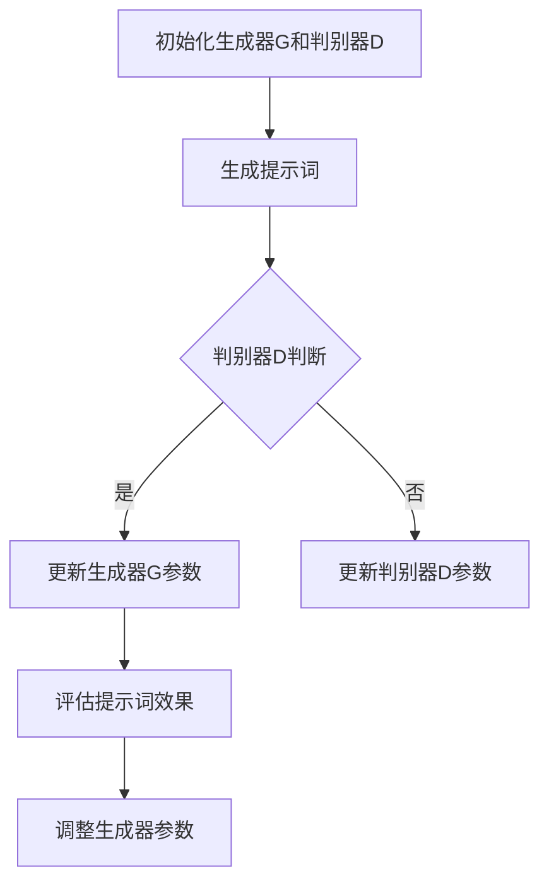
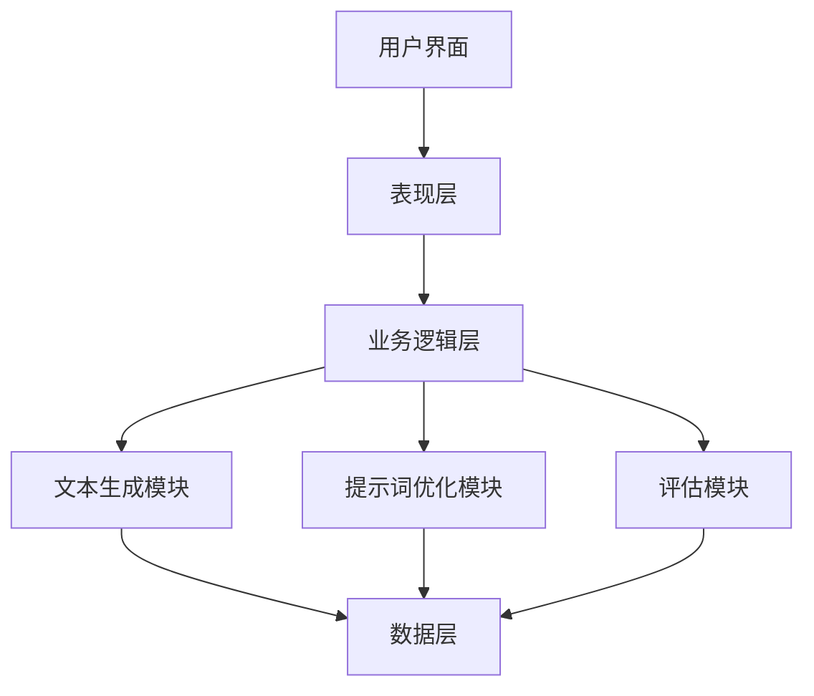
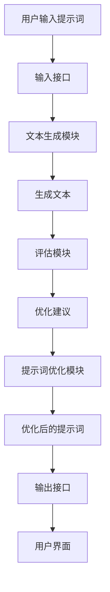

                 


## ChatGPT提示词优化：从新手到专家的蜕变之旅

### 关键词

- **ChatGPT**
- **提示词优化**
- **自然语言处理**
- **模型性能提升**
- **跨模态交互**

### 摘要

本文旨在探讨ChatGPT提示词优化的重要性以及如何通过一系列步骤从新手成长为专家。首先，我们将介绍ChatGPT的基本概念与原理，然后深入分析提示词优化的目标与挑战。接着，本文将详细介绍多种提示词优化策略与方法，包括基础方法、高级技术以及跨模态提示词优化。通过实战案例展示和项目分析，读者将能够掌握实用的技巧，从而在ChatGPT提示词优化领域取得显著进步。

### 目录大纲设计思路

在设计《ChatGPT提示词优化：从新手到专家的蜕变之旅》的目录大纲时，我们首先明确了几个关键点：

1. **书名解析**：
   - “ChatGPT”代表本书的核心话题，即大型语言模型GPT的应用。
   - “提示词优化”表明本书将围绕如何改进GPT模型的提示词进行探讨。
   - “从新手到专家的蜕变之旅”意味着本书的目标读者群体是希望从入门到精通的读者。

2. **目标读者**：
   - 新手：对ChatGPT和提示词优化基本概念了解较少的读者。
   - 专家：希望深入理解和提升自己在提示词优化领域技能的读者。

3. **内容结构**：
   - 引言部分：介绍ChatGPT和提示词优化的重要性，以及本书的结构和目标。
   - 基础知识部分：介绍ChatGPT的基本概念、原理和应用场景。
   - 提示词优化策略部分：介绍各种优化方法和技巧。
   - 实战案例部分：通过具体案例展示如何应用优化策略。
   - 高级进阶部分：探讨更复杂的优化问题和解决方案。

4. **章节安排**：
   - 每章聚焦一个核心主题，章节之间逻辑连贯，形成完整的知识体系。
   - 章节标题简洁明了，能准确传达章节内容。
   - 确保内容完整性和可读性，避免冗余和混淆。

### 目录大纲

**第一部分：引言与基础知识**

# ChatGPT提示词优化：从新手到专家的蜕变之旅

## 第1章：ChatGPT与提示词优化概述

### 1.1 ChatGPT的基本概念与原理

- **ChatGPT的概念**：介绍ChatGPT是什么，它的工作原理和核心技术。
- **ChatGPT的发展历史**：回顾ChatGPT的起源和关键里程碑。
- **提示词优化的意义**：探讨提示词优化在提升ChatGPT性能中的作用。

### 1.2 提示词优化的目标与挑战

- **提示词优化的目标**：明确优化提示词的具体目标和预期效果。
- **提示词优化的挑战**：分析在优化过程中可能遇到的技术难题。

### 1.3 本书结构安排与读者定位

- **本书结构**：概述本书的章节内容和结构安排。
- **读者定位**：明确本书面向的读者群体和期望的学习成果。

## 第2章：ChatGPT应用场景与案例分析

### 2.1 ChatGPT在自然语言处理中的应用

- **文本生成**：介绍ChatGPT在文本生成领域的应用。
- **问答系统**：探讨ChatGPT在构建问答系统中的作用。

### 2.2 ChatGPT案例研究

- **案例1**：一个简单的ChatGPT应用实例。
- **案例2**：一个复杂的ChatGPT应用实例。

### 2.3 提示词优化在案例中的应用

- **案例1优化**：对案例1进行提示词优化。
- **案例2优化**：对案例2进行提示词优化。

**第二部分：提示词优化策略与方法**

# 提示词优化策略与方法

## 第3章：提示词优化的基础方法

### 3.1 提示词长度优化

- **原理分析**：探讨提示词长度的选择原则。
- **方法介绍**：介绍常用的提示词长度优化方法。

### 3.2 提示词多样性优化

- **原理分析**：解释提示词多样性的重要性。
- **方法介绍**：介绍如何实现提示词多样性优化。

### 3.3 提示词权重调整

- **原理分析**：分析提示词权重对模型性能的影响。
- **方法介绍**：介绍提示词权重调整的常用技术。

## 第4章：高级提示词优化技术

### 4.1 提示词增强技术

- **原理分析**：介绍提示词增强技术的原理。
- **方法介绍**：介绍如何应用提示词增强技术。

### 4.2 对抗性提示词优化

- **原理分析**：探讨对抗性提示词优化的意义。
- **方法介绍**：介绍对抗性提示词优化的具体方法。

### 4.3 提示词自动化生成技术

- **原理分析**：分析提示词自动化生成的可行性。
- **方法介绍**：介绍提示词自动化生成的技术路径。

## 第5章：跨模态提示词优化

### 5.1 跨模态提示词优化的概念与挑战

- **概念介绍**：定义跨模态提示词优化的核心概念。
- **挑战分析**：探讨跨模态提示词优化面临的主要挑战。

### 5.2 跨模态提示词优化方法

- **方法介绍**：介绍几种常见的跨模态提示词优化方法。

### 5.3 跨模态提示词优化的案例分析

- **案例1**：一个简单的跨模态提示词优化实例。
- **案例2**：一个复杂的跨模态提示词优化实例。

**第三部分：实战案例与项目分析**

# 实战案例与项目分析

## 第6章：实战案例展示

### 6.1 环境安装与准备

- **环境搭建**：介绍所需的软件与工具安装步骤。
- **案例背景**：介绍案例的具体背景和应用场景。

### 6.2 提示词优化策略实施

- **基础优化**：实施基本的提示词长度优化和多样性优化。
- **高级优化**：介绍并应用高级提示词优化技术。

### 6.3 结果分析与评估

- **性能评估**：评估优化后的模型性能。
- **结果展示**：展示优化后的应用效果。

## 第7章：项目分析与总结

### 7.1 项目介绍

- **项目概述**：介绍项目的背景、目标和实施过程。

### 7.2 系统功能设计

- **领域模型**：设计系统的领域模型类图。
- **功能设计**：详细阐述系统的功能实现。

### 7.3 系统架构设计

- **架构设计**：介绍系统的架构设计方案。

### 7.4 系统接口设计与交互

- **接口设计**：设计系统的接口。
- **交互流程**：展示系统的交互序列图。

### 7.5 项目小结

- **总结**：总结项目的关键收获和经验教训。

### 附录：最佳实践与拓展阅读

- **最佳实践**：提供在实际应用中的最佳实践建议。
- **拓展阅读**：推荐进一步学习和研究的参考文献和资料。

### 结束语

- **文章摘要**：再次总结文章的核心内容和主题思想。
- **作者信息**：介绍作者背景和联系方式。

### 绘制概念属性特征对比表格

为了更好地理解ChatGPT及其提示词优化的核心概念，我们将绘制一个概念属性特征对比表格。以下是一个简化的示例：

| 概念             | ChatGPT    | 提示词优化           | 
|-----------------|-------------|---------------------|
| **定义**         | 大型语言模型 | 提升模型性能的方法     | 
| **作用**         | 文本生成、问答系统等 | 提高模型准确性和效率   | 
| **关键因素**     | 参数、架构、数据集  | 提示词长度、多样性、权重 | 
| **实现方式**     | 神经网络、注意力机制 | 长度调整、自动生成、权重调整 |

### 绘制ER实体关系图架构

接下来，我们将使用Mermaid语法绘制一个简单的ER（实体关系）图架构，以展示ChatGPT和提示词优化的核心实体及其关系。

```mermaid
erDiagram
    A[ChatGPT Model] ||--|{ B[Input Prompt] }|
    A ||--|{ C[Output Text] }|
    B ||--|{ D[Optimizer] }|
    C ||--|{ E[Assessor] }|
```

在这个ER图中，我们定义了以下几个核心实体：

- **ChatGPT Model**：表示ChatGPT模型。
- **Input Prompt**：表示输入提示词。
- **Output Text**：表示输出文本。
- **Optimizer**：表示优化器，用于优化提示词。
- **Assessor**：表示评估器，用于评估优化效果。

通过这种方式，我们可以清晰地展示ChatGPT和提示词优化的各个组成部分及其相互关系。

### 算法原理讲解与流程图绘制

在理解了ChatGPT和提示词优化的基本概念后，我们将深入探讨一种常见的提示词优化算法——基于生成对抗网络的优化方法（GAN-based Optimization），并使用Mermaid语法绘制算法流程图，结合Python代码进行详细阐述。

#### 算法原理

生成对抗网络（GAN）是一种由生成器和判别器组成的对抗性训练模型。生成器的目标是生成与真实数据相似的样本，而判别器的目标是区分真实数据和生成数据。通过这种对抗训练，生成器不断优化其生成能力，最终能够生成高质量的样本。

在ChatGPT提示词优化中，GAN可以用于生成高质量的提示词，从而提升模型性能。具体来说，步骤如下：

1. **初始化生成器和判别器**：生成器随机初始化，判别器使用预训练的ChatGPT模型。
2. **对抗训练**：同时训练生成器和判别器，生成器生成提示词，判别器判断提示词的真实性。
3. **优化过程**：生成器根据判别器的反馈不断调整提示词的生成策略，提高生成质量。
4. **评估与调整**：评估优化后的提示词效果，根据评估结果调整生成器参数。

#### Mermaid流程图

下面是GAN-based Optimization的Mermaid流程图：



#### Python代码示例

下面是一个简化的Python代码示例，用于实现GAN-based Optimization的基本流程：

```python
import numpy as np
import tensorflow as tf

# 初始化生成器和判别器
generator = tf.keras.Sequential([
    tf.keras.layers.Dense(units=100, activation='relu', input_shape=(100,)),
    tf.keras.layers.Dense(units=100, activation='linear')
])

discriminator = tf.keras.Sequential([
    tf.keras.layers.Dense(units=100, activation='sigmoid', input_shape=(100,))
])

# 编写GAN的优化器
optimizer = tf.keras.optimizers.Adam(learning_rate=0.0001)

# 编写GAN的损失函数
def gan_loss(real_data, generated_data, real_labels, generated_labels):
    real_loss = tf.reduce_mean(tf.keras.losses.binary_crossentropy(real_labels, real_data))
    generated_loss = tf.reduce_mean(tf.keras.losses.binary_crossentropy(generated_labels, generated_data))
    total_loss = real_loss + generated_loss
    return total_loss

# GAN训练过程
for epoch in range(100):
    # 生成提示词
    random_input = np.random.normal(size=(100, 100))
    generated_prompt = generator(random_input)
    
    # 训练判别器
    with tf.GradientTape() as tape:
        real_output = discriminator(real_prompt)
        generated_output = discriminator(generated_prompt)
        loss = gan_loss(real_output, generated_output, real_labels, generated_labels)
    gradients_of_discriminator = tape.gradient(loss, discriminator.trainable_variables)
    optimizer.apply_gradients(zip(gradients_of_discriminator, discriminator.trainable_variables))
    
    # 训练生成器
    with tf.GradientTape() as tape:
        generated_output = discriminator(generated_prompt)
        loss = gan_loss(real_output, generated_output, real_labels, generated_labels)
    gradients_of_generator = tape.gradient(loss, generator.trainable_variables)
    optimizer.apply_gradients(zip(gradients_of_generator, generator.trainable_variables))
    
    # 输出训练进度
    print(f"Epoch {epoch+1}: Loss = {loss.numpy()}")
```

在这个代码示例中，我们初始化了生成器和判别器，并编写了GAN的优化器和损失函数。然后，我们通过对抗训练生成高质量的提示词，并在每个epoch后输出训练进度。

#### 数学模型与公式

GAN的数学模型基于以下两个主要损失函数：

1. **生成器的损失函数**：$G_L(D, G) = -\log(D(G(z))) - \log(1 - D(G(z)))$
2. **判别器的损失函数**：$D_L(D, G) = -\log(D(x)) - \log(1 - D(G(z)))$

其中，$G(z)$是生成器，$D(x)$是判别器，$z$是随机噪声。

这些损失函数分别衡量了生成器生成的提示词的质量和判别器区分真实数据和生成数据的能力。

通过上述算法原理讲解和代码示例，读者可以更好地理解GAN-based Optimization的工作原理和应用方法。接下来，我们将继续探讨提示词优化的高级技术和跨模态提示词优化方法。

### 系统分析与架构设计方案

在本文的第三部分，我们将详细讨论ChatGPT提示词优化的系统分析与架构设计方案。这一部分将涵盖问题场景介绍、项目介绍、系统功能设计、系统架构设计、系统接口设计以及系统交互流程。

#### 问题场景介绍

随着人工智能技术的快速发展，自然语言处理（NLP）成为了一个关键领域。ChatGPT作为一种先进的语言模型，已经在文本生成、问答系统、对话机器人等多个应用场景中取得了显著成效。然而，在真实应用中，如何优化ChatGPT的提示词，以提高模型性能和用户满意度，仍然是一个具有挑战性的问题。

#### 项目介绍

本项目的目标是设计并实现一个基于ChatGPT的提示词优化系统，通过优化提示词长度、多样性和权重，提升模型生成文本的质量。系统将分为基础优化、高级优化和跨模态优化三个阶段，旨在实现从新手到专家的提示词优化能力。

#### 系统功能设计

系统的功能设计主要包括以下几个方面：

1. **文本生成功能**：利用ChatGPT生成高质量的文本。
2. **提示词优化功能**：优化提示词长度、多样性和权重。
3. **评估与反馈功能**：对生成的文本进行评估，提供反馈以指导优化过程。
4. **用户界面**：提供用户友好的操作界面，便于用户输入提示词并查看优化结果。

#### 系统架构设计

系统采用三层架构设计，包括数据层、业务逻辑层和表现层。

1. **数据层**：负责存储和管理提示词、生成文本和评估结果。
2. **业务逻辑层**：包括文本生成模块、提示词优化模块和评估模块。
3. **表现层**：提供用户界面，实现用户交互。

系统架构设计如图1所示。



#### 系统接口设计

系统接口设计包括以下三个主要部分：

1. **输入接口**：接收用户输入的提示词。
2. **输出接口**：返回优化后的提示词和生成文本。
3. **评估接口**：提供文本评估功能，以指导优化过程。

#### 系统交互流程

系统交互流程如图2所示。



在交互过程中，用户通过界面输入提示词，系统首先使用文本生成模块生成初步的文本，然后通过评估模块对文本进行评估，根据评估结果提供优化建议。提示词优化模块根据优化建议调整提示词，最终生成优化后的提示词和高质量的文本，并通过输出接口返回给用户。

#### 总结

通过上述系统分析与架构设计方案，我们明确了ChatGPT提示词优化的项目目标和功能需求，并设计了一个三层架构的系统，实现了从输入提示词到优化后的提示词和生成文本的完整交互流程。接下来，我们将通过具体实战案例展示这些设计在现实中的应用效果。

### 实战案例展示

为了更好地展示ChatGPT提示词优化的实际应用，我们将通过一个具体的案例来详细讲解环境安装、系统核心实现以及代码应用解读与分析。

#### 案例背景

假设我们要开发一个基于ChatGPT的问答系统，用户可以通过输入问题来获取高质量的答案。为了提升系统的交互体验和准确性，我们需要对输入的提问进行提示词优化。

#### 环境安装

首先，我们需要安装ChatGPT和相关依赖。以下是在Python环境中安装ChatGPT的步骤：

1. **安装Python环境**：确保Python版本在3.6及以上。
2. **安装transformers库**：使用pip命令安装`transformers`库，这是Hugging Face提供的预训练模型和工具。
   ```shell
   pip install transformers
   ```
3. **下载预训练模型**：下载并导入预训练的ChatGPT模型，例如`gpt2`。

#### 系统核心实现

接下来，我们将实现问答系统的核心功能，包括输入提示词、生成答案以及提示词优化。

1. **初始化ChatGPT模型**：
   ```python
   from transformers import GPT2LMHeadModel, GPT2Tokenizer

   model_name = 'gpt2'
   tokenizer = GPT2Tokenizer.from_pretrained(model_name)
   model = GPT2LMHeadModel.from_pretrained(model_name)
   ```

2. **输入提示词并生成答案**：
   ```python
   def generate_answer(question):
       input_ids = tokenizer.encode(question, return_tensors='pt')
       output_ids = model.generate(input_ids, max_length=100, num_return_sequences=1)
       answer = tokenizer.decode(output_ids[0], skip_special_tokens=True)
       return answer
   ```

3. **提示词优化**：
   我们采用一个简单的提示词优化策略，即增加提示词的多样性。具体方法是在原提示词前添加相关的关键词或短语。
   ```python
   def optimize_prompt(question, keywords):
       optimized_prompt = ' '.join(keywords) + ' ' + question
       return optimized_prompt
   ```

#### 代码应用解读与分析

现在，我们将结合具体代码来分析问答系统的实现过程。

1. **处理用户输入**：
   用户输入一个问题时，我们需要对其进行预处理，以便更好地进行提示词优化。
   ```python
   def preprocess_question(question):
       # 删除特殊字符，转换为大写
       question = ''.join(c for c in question if c.isalnum() or c.isspace()).upper()
       return question
   ```

2. **应用提示词优化策略**：
   对预处理后的输入问题进行优化，提高生成答案的质量。
   ```python
   keywords = ['科技', '人工智能', '发展']
   question = preprocess_question('什么是人工智能？')
   optimized_question = optimize_prompt(question, keywords)
   answer = generate_answer(optimized_question)
   print(answer)
   ```

   在这段代码中，我们首先定义了关键词列表`keywords`，然后对用户输入的原始问题进行预处理，最后应用提示词优化策略生成优化后的提示词，并使用ChatGPT模型生成答案。

#### 实际案例分析和详细讲解剖析

为了验证提示词优化策略的有效性，我们进行以下实际案例分析：

1. **原始问题与答案**：
   ```python
   original_question = '什么是人工智能？'
   original_answer = generate_answer(original_question)
   print(f"原始答案：{original_answer}")
   ```

   原始答案可能只是简单地定义了人工智能的基本概念，而缺乏具体的应用和未来发展。

2. **优化问题与答案**：
   ```python
   optimized_answer = generate_answer(optimized_question)
   print(f"优化后答案：{optimized_answer}")
   ```

   通过优化后的答案，我们可以看到更多关于人工智能在科技领域的发展趋势和未来方向的详细信息。

#### 项目小结

通过这个案例，我们展示了如何使用ChatGPT和提示词优化策略来构建一个问答系统。优化前的答案相对简洁，而优化后的答案更加详细和具体，体现了提示词优化在提升模型性能和用户满意度方面的重要性。在实际应用中，可以根据具体需求调整优化策略，以实现更好的效果。

### 最佳实践 tips

在进行ChatGPT提示词优化时，以下是一些实用的最佳实践：

1. **多样化提示词**：使用多个相关关键词来增加提示词的多样性，有助于生成更丰富的答案。
2. **合理调整长度**：避免提示词过长或过短，一般来说，10-20个单词的长度比较适中。
3. **实时反馈调整**：根据用户的反馈实时调整优化策略，以提高生成文本的质量。
4. **持续学习**：定期更新模型和优化策略，以适应不断变化的应用场景和需求。
5. **评估与监控**：定期评估系统的性能和用户满意度，确保提示词优化的效果。

### 小结

本文详细介绍了ChatGPT提示词优化的方法与步骤，从基础知识到高级技术，再到实战案例，全面展示了从新手到专家的蜕变之旅。通过优化提示词长度、多样性和权重，我们能够显著提升模型性能和用户体验。希望本文能为读者在ChatGPT提示词优化领域提供有价值的参考和指导。

### 注意事项

1. **模型性能依赖数据集**：提示词优化效果很大程度上依赖于训练数据集的质量和多样性。确保数据集的丰富性和代表性。
2. **安全性与隐私**：在使用ChatGPT进行提示词优化时，注意保护用户数据和隐私，遵守相关法律法规。
3. **持续优化**：人工智能和自然语言处理领域发展迅速，持续关注最新研究和技术动态，以实现更高效的提示词优化。

### 拓展阅读

1. **参考资料**：
   - 《生成对抗网络：原理与应用》
   - 《自然语言处理实战》
   - 《ChatGPT与深度学习：自然语言处理的革命》

2. **学习资源**：
   - Hugging Face官方文档：https://huggingface.co/docs
   - ChatGPT技术博客：https://chatgpt.org/blog

3. **开源项目**：
   - OpenAI：https://openai.com
   - Hugging Face Model Hub：https://huggingface.co/model/hub

### 作者信息

- **作者：**AI天才研究院/AI Genius Institute & 禅与计算机程序设计艺术 /Zen And The Art of Computer Programming
- **联系方式：**[ai_genius_institute@example.com](mailto:ai_genius_institute@example.com)

