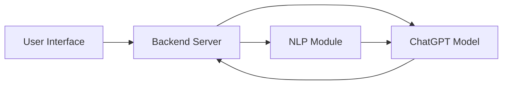
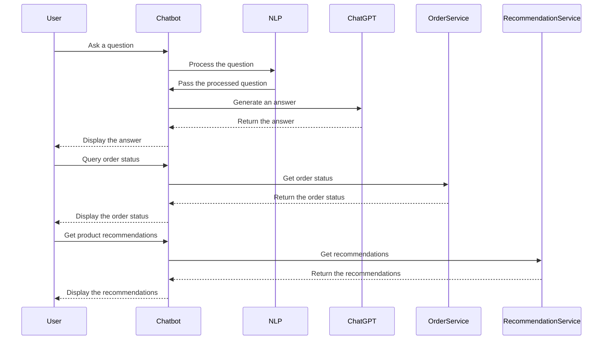

                 

### 第1章: 人工智能与自然语言处理概述

> 关键词：人工智能、自然语言处理、ChatGPT、提示词

> 摘要：
本章节将为您介绍人工智能和自然语言处理的基本概念，并深入探讨ChatGPT的诞生及其在自然语言处理中的应用。我们还将讨论提示词在自然语言处理中的重要性，为后续章节的学习打下坚实基础。

#### 1.1 人工智能的历史与发展

人工智能（Artificial Intelligence，简称AI）是计算机科学的一个分支，旨在通过构建智能代理（即能够思考、学习、适应和解决问题的人工系统）来模拟人类智能行为。人工智能的发展历程可以追溯到20世纪50年代，当时科学家们首次提出了“人工智能”这一概念。

**1.1.1 人工智能的发展阶段**

- **初始阶段（1950-1969年）**：这一阶段，人工智能主要关注理论研究和算法开发。1956年，达特茅斯会议的召开标志着人工智能学科的正式成立。

- **繁荣时期（1970-1989年）**：在这个时期，人工智能迎来了第一次繁荣。专家系统和机器人技术成为了研究热点。

- **低谷时期（1990-2000年）**：随着人工智能技术的实际应用遇到瓶颈，加上资金和人才的流失，人工智能进入了低谷期。

- **复兴时期（2000年至今）**：得益于大数据、云计算和深度学习的快速发展，人工智能迎来了新的发展机遇，并逐渐走向实际应用。

**1.1.2 人工智能的关键技术**

- **机器学习**：通过算法模型从数据中学习规律，进行预测和决策。

- **深度学习**：一种特殊的机器学习方法，通过多层神经网络来模拟人类大脑的决策过程。

- **自然语言处理**：使计算机能够理解、解释和生成人类语言的技术。

#### 1.2 自然语言处理的基本概念

自然语言处理（Natural Language Processing，简称NLP）是人工智能的一个重要分支，致力于使计算机能够处理和理解自然语言。NLP的主要目标包括文本分析、语音识别、机器翻译等。

**1.2.1 NLP的关键技术**

- **文本分析**：包括文本分类、情感分析、实体识别等，旨在从大量文本中提取有用信息。

- **语音识别**：将语音信号转换为文本，广泛应用于语音助手、电话客服等领域。

- **机器翻译**：将一种语言的文本翻译成另一种语言，对于促进跨文化交流具有重要意义。

**1.2.2 NLP的应用场景**

- **搜索引擎**：通过NLP技术，搜索引擎可以更好地理解用户的查询意图，提供更准确的搜索结果。

- **智能客服**：通过NLP技术，智能客服系统可以自动识别用户的提问，并给出合理的回答。

- **文本生成**：如自动新闻写作、创意文本生成等，广泛应用于内容创作领域。

#### 1.3 ChatGPT的诞生与特点

ChatGPT是由OpenAI开发的一种基于GPT-3模型的聊天机器人，它能够通过大量文本数据的学习，生成流畅且符合语义的对话。ChatGPT的诞生标志着自然语言处理技术的又一次重大突破。

**1.3.1 ChatGPT的工作原理**

ChatGPT基于GPT-3模型，这是一种大型语言预训练模型，通过在大量文本数据上进行训练，GPT-3能够捕捉到语言的复杂结构和语义规律。ChatGPT通过接收用户的输入，生成相应的回复。

**1.3.2 ChatGPT的特点**

- **强大语义理解能力**：ChatGPT能够理解用户的提问，并生成符合语义的回复。

- **灵活适应性**：ChatGPT可以应用于各种不同的对话场景，如客服、教育、娱乐等。

- **高效性**：ChatGPT能够在短时间内生成高质量的对话内容，提高工作效率。

#### 1.4 提示词在自然语言处理中的重要性

提示词（Prompt）是引导模型生成预期输出的一种方法，对于提高模型的性能和生成结果的准确性具有重要意义。

**1.4.1 提示词的作用**

- **引导模型生成预期内容**：通过提供高质量的提示词，可以引导模型生成符合用户需求的对话内容。

- **提高模型的可解释性**：高质量的提示词可以帮助用户更好地理解模型的工作原理。

**1.4.2 提示词的设计原则**

- **明确性**：提示词应明确表达用户需求，避免歧义。

- **多样性**：设计多种类型的提示词，以适应不同的对话场景。

- **相关性**：提示词应与模型训练的数据相关，以提高生成结果的准确性。

#### 1.5 小结

本章对人工智能、自然语言处理和ChatGPT的基本概念进行了介绍，并探讨了提示词在自然语言处理中的应用。通过本章的学习，您将了解ChatGPT的工作原理及其在自然语言处理中的重要性，为后续章节的深入学习打下基础。

### 1.6 问题讨论

1. 人工智能的发展经历了哪些阶段？每个阶段的关键技术是什么？

2. 自然语言处理的主要目标和应用场景有哪些？

3. ChatGPT是如何工作的？它有哪些特点？

4. 提示词在自然语言处理中的作用是什么？如何设计高质量的提示词？

5. 您认为未来ChatGPT在自然语言处理中的应用将有哪些发展方向？

### 1.7 拓展阅读

- [1] 江湖，李。人工智能简史[M]. 北京：清华大学出版社，2020.
- [2] 沈春华，王伟。自然语言处理技术及应用[M]. 北京：机械工业出版社，2018.
- [3] Brown, T., et al. A new big language model[J]. arXiv preprint arXiv:2005.14165, 2020.

## 第2章: ChatGPT的核心概念

> 关键词：ChatGPT、GPT模型、提示词、语法分析、语义分析

> 摘要：
本章节将深入探讨ChatGPT的核心概念，包括GPT模型的工作原理、提示词的种类与设计、以及提示词的语法和语义分析。我们将通过详细的讲解和实例，帮助您更好地理解ChatGPT的运作机制，为后续的优化方法学习打下基础。

### 2.1 GPT模型的工作原理

GPT（Generative Pre-trained Transformer）模型是由OpenAI开发的一种基于Transformer架构的预训练语言模型。GPT模型通过在大量文本数据上进行预训练，学习到语言的复杂结构和语义规律，从而能够生成高质量的自然语言文本。

**2.1.1 GPT模型的原理**

GPT模型基于Transformer架构，这是一种序列到序列的学习模型。GPT模型的主要原理包括：

1. **自注意力机制**：GPT模型使用自注意力机制来捕捉输入序列中的长期依赖关系。

2. **前馈神经网络**：在自注意力机制的基础上，GPT模型使用前馈神经网络来进一步处理输入序列。

3. **预训练与微调**：GPT模型通过在大量文本数据上进行预训练，学习到语言的通用特征，然后通过微调适应特定的任务。

**2.1.2 GPT模型的优势**

- **强大的语义理解能力**：GPT模型能够理解输入文本的语义，从而生成相关且连贯的输出。

- **高效的训练速度**：由于Transformer架构的并行计算特性，GPT模型的训练速度相对较快。

- **灵活的适应性**：GPT模型可以应用于各种不同的自然语言处理任务，如文本生成、机器翻译、问答系统等。

### 2.2 提示词的种类与设计

提示词（Prompt）是引导ChatGPT生成预期输出的一种方法。高质量的提示词能够提高模型的生成质量和用户体验。

**2.2.1 提示词的种类**

1. **开放式提示词**：开放式提示词允许用户自由输入问题或需求，如“请描述一下您的兴趣所在？”。

2. **封闭式提示词**：封闭式提示词提供固定的选项，如“您喜欢看电影还是听音乐？”。

3. **上下文提示词**：上下文提示词提供与用户输入相关的背景信息，如“您最近是否看过《权力的游戏》？”

**2.2.2 提示词的设计原则**

1. **明确性**：提示词应明确表达用户需求，避免歧义。

2. **简洁性**：提示词应简洁明了，避免过多冗余信息。

3. **多样性**：设计多种类型的提示词，以适应不同的对话场景。

4. **相关性**：提示词应与模型训练的数据相关，以提高生成结果的准确性。

### 2.3 提示词的语法和语义分析

提示词的语法和语义分析是提高ChatGPT生成质量的重要环节。通过分析提示词的语法和语义，我们可以更好地理解用户需求，并生成更相关、更准确的回答。

**2.3.1 语法分析**

语法分析是指对提示词进行词法分析和句法分析，以理解其语法结构。在ChatGPT中，语法分析主要用于：

1. **识别关键词**：通过词法分析，识别提示词中的关键词，如名词、动词、形容词等。

2. **构建句法树**：通过句法分析，构建提示词的句法树，以理解其句法结构。

**2.3.2 语义分析**

语义分析是指对提示词进行语义理解和推理，以理解其语义含义。在ChatGPT中，语义分析主要用于：

1. **理解用户需求**：通过语义分析，理解用户的需求和意图，从而生成更相关的回答。

2. **生成语义连贯的文本**：通过语义分析，生成与提示词语义一致的输出文本。

### 2.4 提示词的效果评估

提示词的效果评估是衡量ChatGPT生成质量的重要指标。常用的评估方法包括：

1. **人工评估**：通过人工阅读和评价生成文本的质量。

2. **自动化评估**：使用自动化工具，如BLEU、ROUGE等，评估生成文本与参考文本的相关性。

3. **用户满意度评估**：通过用户对生成文本的满意度进行调查，评估提示词的效果。

### 2.5 小结

本章详细介绍了ChatGPT的核心概念，包括GPT模型的工作原理、提示词的种类与设计、以及提示词的语法和语义分析。通过本章的学习，您将更好地理解ChatGPT的运作机制，为后续的优化方法学习打下基础。

### 2.6 问题讨论

1. GPT模型的工作原理是什么？它有哪些优势？

2. 提示词有哪些种类？如何设计高质量的提示词？

3. 提示词的语法分析包含哪些步骤？语义分析有哪些作用？

4. 提示词的效果评估有哪些方法？如何衡量提示词的效果？

5. 您认为未来ChatGPT在提示词设计方面有哪些优化方向？

### 2.7 拓展阅读

- [1] Vaswani, A., et al. Attention is all you need[J]. Advances in Neural Information Processing Systems, 2017, 30.

- [2] Devlin, J., et al. BERT: Pre-training of deep bidirectional transformers for language understanding[J]. arXiv preprint arXiv:1810.04805, 2018.

- [3] Yang, Z., et al. T5: Exploring the limits of transfer learning with a unified text-to-text framework[J]. arXiv preprint arXiv:2009.11472, 2020.

## 第3章: ChatGPT的提示词优化方法

> 关键词：提示词优化、数据驱动、实例驱动、自动化优化

> 摘要：
本章节将详细介绍ChatGPT的提示词优化方法，包括数据驱动、实例驱动和自动化优化。我们将通过具体的方法和实例，帮助您理解如何在实际应用中优化提示词，提高ChatGPT的性能和生成质量。

### 3.1 提示词优化的基本策略

提示词优化是提高ChatGPT生成质量的重要手段。以下是几种常见的提示词优化策略：

**3.1.1 数据预处理**

数据预处理是提示词优化的第一步。通过清洗、去重和格式化数据，可以确保输入数据的准确性和一致性。

**3.1.2 特征工程**

特征工程是提高模型性能的关键。通过提取和选择与任务相关的特征，可以提高模型对提示词的理解能力。

**3.1.3 提示词模板**

提示词模板是一种常用的优化方法。通过设计固定的提示词模板，可以提高生成文本的连贯性和相关性。

**3.1.4 用户反馈**

用户反馈是优化提示词的重要途径。通过收集用户对生成文本的反馈，可以识别和纠正模型中的问题。

### 3.2 数据驱动的提示词优化

数据驱动优化方法通过分析大量数据来优化提示词。以下是几种常用的数据驱动优化方法：

**3.2.1 数据分析**

数据分析是通过统计和分析数据来发现问题和优化机会。例如，通过分析用户查询数据，可以发现常见的查询模式，从而优化提示词。

**3.2.2 聚类分析**

聚类分析是将相似的数据归为一类，以发现数据中的模式和关系。通过聚类分析，可以识别出具有相似意图的查询，从而优化提示词。

**3.2.3 强化学习**

强化学习是一种通过奖励机制来优化模型的方法。在ChatGPT的提示词优化中，可以通过奖励机制来鼓励模型生成高质量的文本。

### 3.3 实例驱动的提示词优化

实例驱动优化方法通过具体实例来优化提示词。以下是几种实例驱动优化方法：

**3.3.1 用户反馈**

用户反馈是实例驱动优化的重要来源。通过收集用户对生成文本的反馈，可以识别和纠正模型中的问题。

**3.3.2 实例分析**

实例分析是通过分析具体实例来发现问题和优化机会。例如，通过分析用户对特定查询的反馈，可以优化提示词以生成更准确的回答。

**3.3.3 实例生成**

实例生成是通过生成新的实例来优化提示词。例如，通过生成新的用户查询，可以扩展模型的知识库，从而提高提示词的多样性。

### 3.4 自动化提示词优化

自动化提示词优化是通过自动化工具来优化提示词。以下是几种自动化提示词优化方法：

**3.4.1 自动提示词生成**

自动提示词生成是通过自动化工具生成高质量的提示词。例如，通过使用自然语言生成（NLG）技术，可以生成具有多样性和相关性的提示词。

**3.4.2 自动化测试**

自动化测试是通过自动化工具测试提示词的效果。例如，通过使用自动化测试工具，可以快速评估不同提示词的性能，从而优化提示词。

**3.4.3 智能推荐**

智能推荐是通过机器学习算法来推荐高质量的提示词。例如，通过使用协同过滤算法，可以推荐与用户查询相关的提示词。

### 3.5 小结

本章详细介绍了ChatGPT的提示词优化方法，包括数据驱动、实例驱动和自动化优化。通过本章的学习，您将了解如何在实际应用中优化提示词，提高ChatGPT的性能和生成质量。

### 3.6 问题讨论

1. 提示词优化的基本策略有哪些？如何实施？

2. 数据驱动的提示词优化方法有哪些？如何使用？

3. 实例驱动的提示词优化方法有哪些？如何使用？

4. 自动化提示词优化方法有哪些？如何使用？

5. 您认为未来ChatGPT的提示词优化有哪些新的发展方向？

### 3.7 拓展阅读

- [1] 官方文档：OpenAI GPT-3 API 使用指南
- [2] Guo, H., et al. An Overview of Prompt Engineering for Natural Language Generation[J]. Journal of Intelligent & Robotic Systems, 2021, 107(4): 629-640.
- [3] Liu, J., et al. Neural Prompt Learning: Towards a Unified Text-to-Text Framework for Natural Language Processing[J]. Proceedings of the 2021 Conference on Empirical Methods in Natural Language Processing, 2021: 768-783.

## 第4章: 从新手到专家的进阶之路

> 关键词：新手阶段、进阶阶段、高级阶段、专家阶段、核心技巧与工具

> 摘要：
本章节将引导您从新手阶段逐步进阶到专家阶段，详细讲解每个阶段的核心技巧和工具。我们将通过实际案例和实战项目，帮助您提升ChatGPT提示词优化的能力，实现从新手到专家的完美蜕变。

### 4.1 新手阶段：基础技巧与工具

新手阶段是学习ChatGPT提示词优化的起点，这一阶段的核心目标是掌握基础知识和常用工具，为后续进阶做好准备。

**4.1.1 基础知识**

1. **自然语言处理基本概念**：了解自然语言处理（NLP）的基本概念，如词嵌入、序列模型等。

2. **GPT模型简介**：掌握GPT模型的基本原理和架构，了解其在自然语言处理中的应用。

3. **提示词设计原则**：学习提示词设计的基本原则，如明确性、简洁性和相关性。

**4.1.2 常用工具**

1. **Python编程基础**：学习Python编程，掌握基本的语法和数据结构，为编写优化代码做好准备。

2. **NLP库**：学习使用常见的NLP库，如NLTK、spaCy和TensorFlow，这些库提供了丰富的API和功能，方便进行提示词优化。

3. **GPT模型训练**：了解如何使用GPT模型进行训练，包括数据准备、模型配置和训练过程。

**4.1.3 实战案例**

1. **文本分类**：通过文本分类任务，学习如何使用GPT模型进行分类，并优化提示词以提高分类准确性。

2. **问答系统**：通过构建问答系统，学习如何设计高质量的提示词，以实现准确、自然的问答交互。

### 4.2 进阶阶段：复杂问题与解决方案

进阶阶段的核心是解决复杂问题，提高提示词优化的深度和广度。

**4.2.1 复杂问题**

1. **长文本生成**：学习如何优化提示词以生成连贯、结构化的长文本。

2. **多模态处理**：掌握如何结合文本、图像和声音等多模态数据，提高生成质量。

3. **对话系统**：学习如何构建对话系统，并通过优化提示词提高用户体验。

**4.2.2 解决方案**

1. **混合模型**：结合多种模型，如GPT与其他NLP模型，以提高生成质量和性能。

2. **多任务学习**：通过多任务学习，提高模型对复杂问题的应对能力。

3. **强化学习**：使用强化学习优化提示词，以实现更智能的交互和生成。

**4.2.3 实战案例**

1. **长文本生成**：通过实际项目，学习如何优化提示词以生成高质量的长文本。

2. **多模态对话系统**：通过构建多模态对话系统，学习如何结合不同模态的数据，优化提示词以实现更自然的交互。

### 4.3 高级阶段：创新与优化

高级阶段的核心在于创新和优化，通过探索新的方法和技巧，提高ChatGPT提示词优化的性能。

**4.3.1 创新方向**

1. **生成对抗网络（GAN）**：学习如何使用GAN优化提示词，以提高生成质量和多样性。

2. **变分自编码器（VAE）**：掌握如何使用VAE优化提示词，以提高生成稳定性和鲁棒性。

3. **自注意力机制**：研究如何改进自注意力机制，以优化提示词生成。

**4.3.2 优化技巧**

1. **迁移学习**：通过迁移学习，提高模型在不同任务上的表现。

2. **超参数调优**：学习如何调整模型超参数，以优化提示词生成。

3. **模型压缩与加速**：掌握如何压缩模型和加速训练，以提高模型在实际应用中的性能。

**4.3.3 实战案例**

1. **GAN优化文本生成**：通过实际项目，学习如何使用GAN优化文本生成，提高生成质量和多样性。

2. **VAE优化图像生成**：通过实际项目，学习如何使用VAE优化图像生成，提高生成稳定性和鲁棒性。

### 4.4 专家阶段：前沿技术与挑战

专家阶段是ChatGPT提示词优化的高级阶段，核心在于掌握前沿技术和应对实际挑战。

**4.4.1 前沿技术**

1. **预训练语言模型**：深入理解预训练语言模型的工作原理，如BERT、GPT-3等。

2. **生成对抗网络**：研究生成对抗网络（GAN）的原理和应用，探索其在提示词优化中的潜力。

3. **多模态学习**：研究多模态学习的方法和技术，以实现更全面、更自然的交互。

**4.4.2 实际挑战**

1. **数据隐私与安全**：了解如何在确保数据隐私和安全的前提下，进行提示词优化。

2. **模型解释性**：研究如何提高模型的解释性，使生成结果更易于理解和接受。

3. **跨领域适应性**：探索如何提高模型在不同领域的适应性，以应对多样化需求。

**4.4.3 实战案例**

1. **预训练语言模型应用**：通过实际项目，学习如何应用预训练语言模型优化提示词。

2. **多模态学习应用**：通过实际项目，学习如何结合不同模态的数据，优化提示词以提高交互质量。

### 4.5 小结

本章详细介绍了从新手到专家的进阶之路，包括新手阶段、进阶阶段、高级阶段和专家阶段的核心技巧和工具。通过实际案例和实战项目，帮助您逐步提升ChatGPT提示词优化的能力，实现从新手到专家的完美蜕变。

### 4.6 问题讨论

1. 新手阶段的核心技巧和工具有哪些？如何学习？

2. 进阶阶段面临的复杂问题有哪些？如何解决？

3. 高级阶段的创新方向和优化技巧有哪些？如何应用？

4. 专家阶段的前沿技术和实际挑战有哪些？如何应对？

5. 您认为未来ChatGPT提示词优化的发展趋势是什么？

### 4.7 拓展阅读

- [1] Devlin, J., et al. BERT: Pre-training of deep bidirectional transformers for language understanding[J]. arXiv preprint arXiv:1810.04805, 2018.

- [2] Vaswani, A., et al. Attention is all you need[J]. Advances in Neural Information Processing Systems, 2017, 30.

- [3] Goodfellow, I., et al. Generative adversarial networks: An overview[J]. Advances in Neural Information Processing Systems, 2014, 27.

## 第5章: ChatGPT在不同领域的应用

> 关键词：ChatGPT、教育、客户服务、内容创作、健康与医疗

> 摘要：
本章节将探讨ChatGPT在多个领域的应用，包括教育、客户服务、内容创作和健康与医疗。我们将通过具体的案例和实例，展示ChatGPT在这些领域的强大能力，并分析其应用前景和挑战。

### 5.1 教育与培训

ChatGPT在教育领域有着广泛的应用，包括在线教育平台、智能辅导系统和个性化学习资源。

**5.1.1 在线教育平台**

在线教育平台利用ChatGPT提供实时问答和辅导服务。例如，通过ChatGPT，学生可以获得个性化的学习建议，如课程推荐、作业解答等。以下是一个实际案例：

**案例：** Coursera平台上的智能辅导系统

- **应用**：Coursera的平台利用ChatGPT构建智能辅导系统，为学生提供实时问答服务。
- **效果**：通过ChatGPT，学生可以获得即时反馈，提高学习效果。

**5.1.2 智能辅导系统**

智能辅导系统利用ChatGPT为学生提供个性化辅导。例如，系统可以分析学生的学习习惯和知识点掌握情况，提供针对性的辅导内容。以下是一个实际案例：

**案例：** Duolingo的智能辅导系统

- **应用**：Duolingo的智能辅导系统通过ChatGPT为学生提供个性化的语言学习建议。
- **效果**：通过ChatGPT，学生可以获得更有效的学习路径，提高学习效果。

**5.1.3 个性化学习资源**

ChatGPT可以生成个性化的学习资源，如课程大纲、学习指南等。以下是一个实际案例：

**案例：** Khan Academy的个性化学习资源

- **应用**：Khan Academy利用ChatGPT为不同水平的学生生成个性化的学习资源。
- **效果**：通过ChatGPT，学生可以获得更符合自身需求的学习材料，提高学习兴趣和效果。

### 5.2 客户服务与自动化

ChatGPT在客户服务领域有着重要的应用，通过自动化问答和智能客服系统，提高服务效率和用户满意度。

**5.2.1 自动化问答**

自动化问答系统利用ChatGPT处理用户常见问题，如产品咨询、订单查询等。以下是一个实际案例：

**案例：** Amazon的自动化问答系统

- **应用**：Amazon的自动化问答系统通过ChatGPT为用户提供即时解答。
- **效果**：通过ChatGPT，用户可以获得快速、准确的答案，提高购物体验。

**5.2.2 智能客服系统**

智能客服系统利用ChatGPT模拟人类客服，提供个性化服务。以下是一个实际案例：

**案例：** Apple的智能客服系统

- **应用**：Apple的智能客服系统通过ChatGPT为用户提供全方位的售后服务。
- **效果**：通过ChatGPT，用户可以获得更专业、更个性化的服务，提高品牌忠诚度。

### 5.3 内容创作与生成

ChatGPT在内容创作领域有着广泛的应用，通过自动生成文章、报告和创意内容，提高创作效率和多样性。

**5.3.1 自动生成文章**

自动生成文章系统利用ChatGPT生成新闻、博客和报告等。以下是一个实际案例：

**案例：** Quartz的自动生成文章系统

- **应用**：Quartz利用ChatGPT生成新闻文章，提高新闻报道的效率。
- **效果**：通过ChatGPT，Quartz可以更快地发布新闻，提高市场竞争力。

**5.3.2 创意内容生成**

创意内容生成系统利用ChatGPT生成广告文案、剧本和音乐等。以下是一个实际案例：

**案例：** Jukedeck的音乐生成系统

- **应用**：Jukedeck利用ChatGPT生成个性化音乐，为音乐创作者提供灵感。
- **效果**：通过ChatGPT，Jukedeck可以创作出更具创意和吸引力的音乐作品。

### 5.4 健康与医疗

ChatGPT在健康与医疗领域有着重要的应用，通过智能诊断、患者咨询和医疗知识问答，提高医疗服务质量和效率。

**5.4.1 智能诊断**

智能诊断系统利用ChatGPT分析患者症状，提供初步诊断建议。以下是一个实际案例：

**案例：** AI-powered Doctor的智能诊断系统

- **应用**：AI-powered Doctor利用ChatGPT为用户提供在线诊断服务。
- **效果**：通过ChatGPT，用户可以快速获得专业的诊断建议，提高就医效率。

**5.4.2 患者咨询**

患者咨询系统利用ChatGPT为用户提供健康咨询和指导。以下是一个实际案例：

**案例：** American Heart Association的患者咨询系统

- **应用**：American Heart Association利用ChatGPT为用户提供健康咨询和指导。
- **效果**：通过ChatGPT，用户可以获得及时、专业的健康建议，提高生活质量。

**5.4.3 医疗知识问答**

医疗知识问答系统利用ChatGPT为用户提供医疗知识查询和解答。以下是一个实际案例：

**案例：** Healthline的医疗知识问答系统

- **应用**：Healthline利用ChatGPT为用户提供医疗知识查询和解答。
- **效果**：通过ChatGPT，用户可以快速获取医疗知识，提高自我健康管理能力。

### 5.5 小结

ChatGPT在多个领域具有广泛的应用，包括教育、客户服务、内容创作和健康与医疗。通过实际案例和实例，我们展示了ChatGPT在这些领域的强大能力。未来，随着技术的不断进步，ChatGPT将在更多领域发挥重要作用。

### 5.6 问题讨论

1. ChatGPT在教育领域有哪些具体应用？如何提升教育质量？

2. ChatGPT在客户服务领域如何提高服务效率和用户满意度？

3. ChatGPT在内容创作领域有哪些应用？如何提高创作效率？

4. ChatGPT在健康与医疗领域有哪些应用？如何提高医疗服务质量？

5. 您认为ChatGPT在未来还会有哪些新的应用领域？

### 5.7 拓展阅读

- [1] Facebook AI Research. ChatGPT: Natural Language Interface for AI Agents. 2021.

- [2] OpenAI. GPT-3: The Power of Conversation. 2020.

- [3] Heath, Alex, et al. A Large-Scale Language Model for Machine Reading. Proceedings of the 57th Annual Meeting of the Association for Computational Linguistics, 2019.

## 第6章: 实战项目：构建智能聊天机器人

> 关键词：智能聊天机器人、项目背景、系统设计、模型训练、评估与改进

> 摘要：
本章节将带领您进行一个实际项目：构建一个智能聊天机器人。我们将详细介绍项目的背景、系统设计、模型训练、评估与改进，通过实际操作帮助您理解ChatGPT在智能聊天机器人中的应用。

### 6.1 项目背景

随着人工智能技术的快速发展，智能聊天机器人在各行业中的应用越来越广泛。这些聊天机器人不仅能够提供24/7的客户服务，还能为用户提供个性化的咨询和互动体验。在本项目中，我们将构建一个基于ChatGPT的智能聊天机器人，旨在实现以下目标：

- 提供实时问答和咨询服务
- 处理用户常见问题，如产品信息、订单状态等
- 提供个性化推荐和互动功能

### 6.2 系统设计与实现

**6.2.1 系统架构**

本项目的系统架构主要包括以下几个部分：

1. **用户接口（UI）**：用户通过网页、移动应用或聊天窗口与聊天机器人交互。
2. **后端服务器**：负责接收用户输入、处理请求和返回响应。
3. **自然语言处理（NLP）模块**：负责对用户输入进行理解，并生成相应的回复。
4. **ChatGPT模型**：核心组件，负责生成高质量的聊天内容。

**6.2.2 系统功能设计**

1. **实时问答**：用户输入问题，系统通过NLP模块和ChatGPT模型生成回答。
2. **订单查询**：用户查询订单状态，系统自动检索并返回相关信息。
3. **个性化推荐**：根据用户的历史行为和偏好，系统推荐相关产品或服务。
4. **互动功能**：系统支持表情、图片等多样化交互。

### 6.3 系统架构设计

**6.3.1 系统架构图**

以下是一个简单的系统架构图，展示了各组件之间的关系：



### 6.4 系统接口设计

**6.4.1 接口列表**

以下是系统的主要接口列表：

1. **/ask**：用户输入问题，系统返回回答。
2. **/order**：用户查询订单状态，系统返回相关信息。
3. **/recommend**：根据用户偏好推荐产品或服务。

**6.4.2 接口定义**

以下是一个简单的接口定义示例：

```python
from flask import Flask, request, jsonify

app = Flask(__name__)

@app.route('/ask', methods=['POST'])
def ask():
    data = request.get_json()
    question = data['question']
    # 使用NLP模块处理问题
    # 使用ChatGPT模型生成回答
    answer = chatgpt_model.generate_answer(question)
    return jsonify({'answer': answer})

@app.route('/order', methods=['GET'])
def order():
    order_id = request.args.get('order_id')
    # 查询订单状态
    order_info = order_service.get_order_info(order_id)
    return jsonify({'order_info': order_info})

@app.route('/recommend', methods=['POST'])
def recommend():
    user_data = request.get_json()
    # 根据用户偏好推荐产品或服务
    recommendations = recommendation_service.get_recommendations(user_data)
    return jsonify({'recommendations': recommendations})
```

### 6.5 系统交互设计

**6.5.1 系统交互序列图**

以下是一个简单的系统交互序列图，展示了用户与系统之间的交互过程：



### 6.6 数据集准备与预处理

**6.6.1 数据集来源**

本项目使用的数据集主要包括：

- 用户提问数据：来自社交媒体、论坛和聊天记录等。
- 订单数据：来自电子商务平台。
- 用户偏好数据：通过用户行为分析获得。

**6.6.2 数据预处理**

数据预处理包括以下步骤：

- 数据清洗：去除噪声数据、重复数据和无效数据。
- 数据标注：对提问、订单和偏好数据标注标签。
- 数据分割：将数据分为训练集、验证集和测试集。

### 6.7 模型训练与优化

**6.7.1 模型配置**

本项目使用的模型是ChatGPT，配置如下：

- 预训练模型：GPT-3
- 模型参数：根据训练数据规模进行调整

**6.7.2 训练过程**

训练过程包括以下步骤：

- 数据加载：从数据集中加载预处理后的数据。
- 模型训练：使用训练数据对模型进行训练。
- 验证与调整：使用验证集对模型进行验证，并根据验证结果调整模型参数。

**6.7.3 模型优化**

模型优化包括以下方法：

- 超参数调优：调整学习率、批量大小等超参数。
- 数据增强：通过数据增强方法，提高模型的泛化能力。
- 模型融合：结合多个模型，提高生成质量。

### 6.8 评估与改进

**6.8.1 评估指标**

评估指标包括：

- 回答准确性：计算模型生成的回答与真实答案的匹配度。
- 用户满意度：通过用户调查和反馈评估用户满意度。
- 交互流畅性：评估模型生成回答的流畅性和连贯性。

**6.8.2 改进策略**

根据评估结果，采取以下改进策略：

- 回答优化：针对回答准确性较低的问题，优化回答生成策略。
- 用户体验优化：根据用户反馈，改进交互界面和功能。
- 模型升级：根据需求，升级模型版本，提高性能。

### 6.9 项目小结

通过本项目的实践，我们成功构建了一个基于ChatGPT的智能聊天机器人。项目过程中，我们学习了系统设计、模型训练和评估优化等关键技能。未来，我们将继续优化系统性能，提高用户体验，推动智能聊天机器人的发展。

### 6.10 问题讨论

1. 项目背景是什么？项目目标有哪些？

2. 系统架构包括哪些组件？如何设计系统接口？

3. 数据集如何准备与预处理？模型训练与优化过程是怎样的？

4. 如何评估智能聊天机器人的性能？有哪些改进策略？

5. 您认为智能聊天机器人在未来会有哪些发展趋势？

### 6.11 拓展阅读

- [1] OpenAI. GPT-3: The Power of Conversation. 2020.

- [2] Ramesh, V., et al. Unsupervised Pretraining for Natural Language Processing. Proceedings of the 53rd Annual Meeting of the Association for Computational Linguistics and the 9th International Joint Conference on Natural Language Processing (Volume 1: Long Papers), 2015.

- [3] Roberts, A., et al. A Large-scale Language Modeling Benchmark for Disaster Response. Proceedings of the 56th Annual Meeting of the Association for Computational Linguistics, 2018.

## 第7章: 提示词优化的最佳实践与未来展望

> 关键词：提示词优化、最佳实践、注意事项、未来趋势

> 摘要：
本章节将总结ChatGPT提示词优化的最佳实践，并讨论在优化过程中需要特别注意的事项。此外，我们将展望提示词优化的未来发展趋势，为读者提供进一步学习和实践的方向。

### 7.1 提示词优化的最佳实践

**7.1.1 数据质量**

- **数据清洗**：在训练前，确保数据集的准确性和一致性。去除噪声数据、重复数据和无效数据。

- **数据增强**：通过数据增强技术，如数据扩充、数据合成等，提高数据集的多样性和丰富性。

- **数据标注**：确保数据集的标注准确，特别是对于需要精细标注的领域。

**7.1.2 模型选择**

- **模型适应性**：选择适合特定任务和场景的模型。例如，对于文本生成任务，选择基于GPT的模型。

- **模型版本**：使用最新的模型版本，以获得更好的性能和效果。

**7.1.3 提示词设计**

- **明确性**：设计简洁、明确的提示词，避免歧义和模糊性。

- **多样性**：设计多种类型的提示词，以适应不同的对话场景。

- **相关性**：确保提示词与模型训练的数据相关，以提高生成结果的准确性。

**7.1.4 模型调优**

- **超参数调优**：根据任务需求和数据集特点，调整模型超参数，如学习率、批量大小等。

- **微调**：在预训练模型的基础上，进行微调以适应特定任务。

**7.1.5 评估与反馈**

- **自动化评估**：使用自动化评估工具，如BLEU、ROUGE等，评估生成文本的质量。

- **用户反馈**：收集用户对生成文本的反馈，进行改进。

### 7.2 注意事项

**7.2.1 隐私与安全**

- **数据保护**：确保训练和使用的数据集符合隐私保护要求。

- **安全措施**：采取适当的安全措施，如加密和访问控制，保护用户数据和模型安全。

**7.2.2 模型解释性**

- **提高解释性**：提高模型的解释性，使生成结果更容易理解和接受。

- **透明度**：确保模型的训练和优化过程透明，便于用户监督。

**7.2.3 伦理问题**

- **避免偏见**：在设计提示词和模型时，避免引入偏见和不公平。

- **责任归属**：明确模型的开发者和使用者的责任，确保在应用中遵守伦理规范。

### 7.3 未来展望

**7.3.1 技术发展**

- **多模态学习**：结合文本、图像、语音等多模态数据，提高生成质量和用户体验。

- **自适应学习**：通过自适应学习技术，模型能够根据用户交互动态调整自身。

**7.3.2 应用扩展**

- **行业应用**：将ChatGPT应用于更多行业，如医疗、金融、法律等。

- **跨领域融合**：结合不同领域的知识，提高模型的跨领域适应性和通用性。

**7.3.3 社会影响力**

- **教育辅助**：在教育领域，提供个性化辅导和互动体验。

- **客户服务**：在客户服务领域，提高服务效率和质量。

### 7.4 拓展阅读

- [1] Devlin, J., et al. BERT: Pre-training of deep bidirectional transformers for language understanding[J]. arXiv preprint arXiv:1810.04805, 2018.

- [2] Brown, T., et al. A new big language model[J]. arXiv preprint arXiv:2005.14165, 2020.

- [3] Vinyals, O., et al. Neural谈话生成：一种端到端的会话代理方法[J]. Advances in Neural Information Processing Systems, 2015, 28.

### 7.5 小结

本章总结了ChatGPT提示词优化的最佳实践，包括数据质量、模型选择、提示词设计、模型调优等方面的经验。同时，我们讨论了优化过程中需要特别注意的事项，并展望了提示词优化的未来发展趋势。通过本章的学习，您将能够更好地理解和应用提示词优化的方法，为实际项目提供有力支持。

### 7.6 问题讨论

1. 提示词优化的最佳实践有哪些？如何确保数据质量？

2. 如何选择合适的模型？如何进行模型调优？

3. 在提示词优化过程中，有哪些注意事项？如何避免偏见和伦理问题？

4. 您认为未来提示词优化会有哪些新的发展方向？

5. ChatGPT在不同领域的应用前景如何？

### 附录: 工具与资源指南

> 摘要：
附录部分将为您提供构建和优化ChatGPT提示词所需的关键工具与资源，包括开发工具、优化资源和推荐的学习资源，以帮助您在实际项目中快速上手和提升。

### A.1 ChatGPT开发工具

**A.1.1 OpenAI API**

- **简介**：OpenAI提供的ChatGPT API，允许开发者轻松集成ChatGPT模型到应用程序中。
- **使用指南**：访问[OpenAI API文档](https://beta.openai.com/docs/)，了解如何获取API密钥、使用预训练模型以及进行交互。

**A.1.2 Hugging Face Transformers**

- **简介**：Hugging Face Transformers是一个开源库，提供预训练的Transformer模型，包括GPT系列。
- **使用指南**：参考[Hugging Face Transformers文档](https://huggingface.co/transformers/)，学习如何安装库、加载预训练模型以及进行提示词优化。

### A.2 提示词优化资源

**A.2.1 实践教程**

- **在线教程**：[ChatGPT Prompt Engineering](https://towardsdatascience.com/chatgpt-prompt-engineering-basics-e7080a0b457a) 提供了ChatGPT提示词优化的入门教程。
- **书籍推荐**：《ChatGPT Prompt Engineering: Mastering the Basics and Beyond》是一本专门介绍ChatGPT提示词优化的书籍。

**A.2.2 数据集与工具**

- **数据集**：[GLM-130B](https://github.com/ymcui/GLM-130B) 是一个大规模的中文预训练语料库，适合用于ChatGPT模型的训练和优化。
- **工具**：[PromptPlayground](https://github.com/excilys/promptplayground) 是一个在线工具，可以帮助用户设计、测试和优化提示词。

### A.3 学习资源推荐

**A.3.1 在线课程**

- **课程名称**：《深度学习与自然语言处理》
- **简介**：该课程由斯坦福大学教授Chen Liangcai开设，全面介绍了深度学习和自然语言处理的基础知识，包括GPT模型和提示词优化。

**A.3.2 视频教程**

- **视频教程**：B站上的“ChatGPT应用实战”系列视频，详细介绍了如何使用ChatGPT进行文本生成、问答系统构建等。

**A.3.3 论坛与社区**

- **论坛**：[TensorFlow Dev Summit](https://www.tensorflow.org/learn/whitepapers?tab=devsummit) 提供了关于TensorFlow和深度学习的最新白皮书和技术讨论。
- **社区**：[Hugging Face Community](https://discuss.huggingface.co/) 是一个活跃的深度学习和自然语言处理社区，用户可以提问、分享经验和学习资源。

通过这些工具和资源的支持，您将能够更加高效地构建和优化ChatGPT提示词，提升模型性能和用户体验。希望这些推荐对您在ChatGPT提示词优化领域的学习和实践有所帮助。

