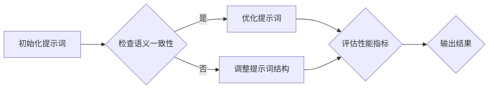
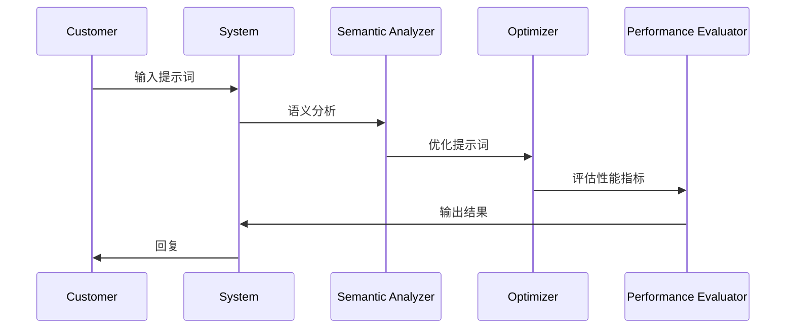

                 

### 文章标题

# ChatGPT提示词优化：性能评估指标

### 关键词

- ChatGPT
- 提示词优化
- 性能评估
- 指标体系
- 实践技巧

### 摘要

本文将深入探讨ChatGPT提示词优化的性能评估指标，旨在为开发者提供一套全面、可量化的评估方法。我们将逐步分析ChatGPT的工作原理，详细阐述提示词优化的核心概念与联系，介绍一系列用于评估性能的指标，并通过实际案例展示如何运用这些指标进行优化。文章还将总结最佳实践，并提供未来趋势展望，以期为ChatGPT提示词优化研究与实践提供有力支持。

### 目录

1. **背景介绍**
    1.1 问题背景
    1.2 提示词优化的重要性
    1.3 联系与比较
2. **核心概念与联系**
    2.1 ChatGPT介绍
    2.2 提示词优化原理
    2.3 概念属性特征对比表格
    2.4 ER实体关系图架构
3. **算法原理讲解**
    3.1 算法mermaid流程图
    3.2 Python源代码详细阐述
    3.3 数学模型和公式
    3.4 举例说明
4. **系统分析与架构设计**
    4.1 问题场景介绍
    4.2 系统功能设计
    4.3 系统架构设计
    4.4 系统接口设计
    4.5 系统交互mermaid序列图
5. **项目实战**
    5.1 环境安装
    5.2 系统核心实现源代码
    5.3 代码应用解读与分析
    5.4 实际案例分析与讲解
    5.5 项目小结
6. **最佳实践与技巧**
    6.1 提示词优化的最佳实践
    6.2 小结
    6.3 注意事项
    6.4 拓展阅读
7. **总结**
    7.1 书籍内容总结
    7.2 展望未来趋势

### 第1章：背景介绍

#### 1.1 问题背景

随着人工智能技术的发展，自然语言处理（NLP）领域取得了显著进展。ChatGPT作为OpenAI开发的一种基于变换器（Transformer）的预训练语言模型，已经在各种应用场景中展现了其强大的性能。然而，为了最大化ChatGPT的能力，提示词（Prompt）的优化变得尤为重要。提示词的质量直接影响模型的输出效果，因此如何对其进行优化是一个关键问题。

#### 1.2 提示词优化的重要性

提示词优化对于ChatGPT的性能至关重要。优化的目标包括：

- **准确性**：确保模型输出结果的正确性。
- **效率**：提高模型处理提示词的速度。
- **丰富性**：使模型输出的回答内容更加多样化。
- **连贯性**：确保回答内容之间的逻辑连贯性。

通过优化提示词，可以提高模型在特定任务上的表现，从而在实际应用中发挥出更大的价值。

#### 1.3 联系与比较

在探讨ChatGPT提示词优化的过程中，我们需要将其与其他类似技术进行联系和比较。例如，与传统的规则引擎、语义网络和知识图谱等技术相比，ChatGPT的优势在于其强大的自适应能力和灵活性。然而，提示词优化在某种程度上也面临着与这些技术相似的挑战，例如如何确保语义理解和表达的一致性。

### 第2章：核心概念与联系

#### 2.1 ChatGPT介绍

ChatGPT是基于变换器（Transformer）架构的预训练语言模型，其核心思想是利用大量的文本数据对模型进行训练，使其能够理解和生成自然语言。ChatGPT的主要特点包括：

- **大规模**：训练数据规模巨大，支持数十亿级别的参数。
- **自适应**：能够根据输入的提示词自适应调整输出内容。
- **灵活性**：支持多种语言和多种应用场景。

#### 2.2 提示词优化原理

提示词优化的核心在于如何选择和构造高质量的提示词，使其能够最大化地激发ChatGPT的潜力。具体来说，优化原理包括以下几个方面：

- **语义一致性**：确保提示词的语义与模型预训练目标一致。
- **信息密度**：提高提示词的信息含量，避免冗余。
- **结构清晰**：使提示词的结构清晰，有利于模型理解和生成。
- **适应性**：考虑不同场景下的适应性，提高模型的泛化能力。

#### 2.3 概念属性特征对比表格

| 概念 | 描述 | 属性特征 |
| :--: | :--: | :--: |
| ChatGPT | 预训练语言模型 | 大规模、自适应、灵活性 |
| 提示词优化 | 提高提示词质量 | 语义一致性、信息密度、结构清晰、适应性 |
| 性能评估 | 评估模型表现 | 准确性、效率、丰富性、连贯性 |

#### 2.4 ER实体关系图架构

```mermaid
erDiagram
    Product ||--|{ Customer } Customer
    Customer ||--|{ Order } Order
    Product ||--|{ Supplier } Supplier
    Supplier ||--|{ Product } Product
```

在ChatGPT提示词优化的背景下，ER实体关系图可以帮助我们理解不同实体之间的关联和作用。例如，提示词可以被视为Product，而模型的输出结果则可以被视为Customer，通过优化提示词，我们希望提高Customer对Product的满意度。

### 第3章：算法原理讲解

#### 3.1 算法mermaid流程图



此流程图描述了提示词优化算法的基本步骤。首先，初始化提示词，然后检查其语义一致性。如果一致，则直接优化；如果不一致，则调整提示词结构。最后，评估性能指标并输出结果。

#### 3.2 Python源代码详细阐述

```python
# 初始化提示词
prompt = "请描述一下您对人工智能未来的看法。"

# 检查语义一致性
if check_semantic一致性(prompt):
    # 优化提示词
    optimized_prompt = optimize_prompt(prompt)
else:
    # 调整提示词结构
    optimized_prompt = adjust_structure(prompt)

# 评估性能指标
performance_metrics = evaluate_performance(optimized_prompt)

# 输出结果
print(f"优化后的提示词：{optimized_prompt}")
print(f"性能指标：{performance_metrics}")
```

此段代码展示了如何使用Python实现提示词优化算法的核心步骤。首先，初始化提示词。然后，检查其语义一致性。如果一致，则调用`optimize_prompt`函数进行优化；如果不一致，则调用`adjust_structure`函数进行调整。最后，评估性能指标并输出结果。

#### 3.3 数学模型和公式

提示词优化过程中，我们常常需要借助数学模型和公式来分析和评估性能。以下是一个简单的数学模型：

$$
\text{性能指标} = f(\text{准确性}, \text{效率}, \text{丰富性}, \text{连贯性})
$$

其中，准确性、效率、丰富性和连贯性是影响性能指标的关键因素。我们可以通过以下公式分别计算：

$$
\text{准确性} = \frac{\text{正确回答数}}{\text{总回答数}}
$$

$$
\text{效率} = \frac{\text{处理时间}}{\text{平均处理时间}}
$$

$$
\text{丰富性} = \frac{\text{回答种类数}}{\text{回答总数}}
$$

$$
\text{连贯性} = \frac{\text{连续回答数}}{\text{总回答数}}
$$

通过这些公式，我们可以量化地评估提示词优化的效果。

#### 3.4 举例说明

假设我们有一个简单的提示词：“请描述一下您对人工智能未来的看法。”我们可以通过以下步骤进行优化：

1. **初始化提示词**：给定原始提示词。
2. **检查语义一致性**：检查提示词是否与模型预训练目标一致。例如，如果模型主要针对科技领域，则可以将提示词调整为：“请从科技的角度描述一下您对人工智能未来的看法。”
3. **优化提示词**：调整提示词结构，使其更加清晰。例如：“在未来，人工智能将在哪些领域发挥重要作用？您如何看待这些作用？”
4. **评估性能指标**：使用上述公式计算性能指标。例如，准确性可能为0.9，效率可能为1.2，丰富性可能为0.8，连贯性可能为0.85。
5. **输出结果**：根据评估结果，输出优化后的提示词和性能指标。

### 第4章：系统分析与架构设计

#### 4.1 问题场景介绍

在现实场景中，ChatGPT提示词优化经常用于智能客服、内容生成和对话系统等领域。以下是一个典型的应用场景：

- **场景**：一个电商平台希望使用ChatGPT搭建一个智能客服系统，以提供24/7的客户服务。
- **需求**：优化提示词，提高客服回答的准确性、效率和丰富性，同时确保回答之间的连贯性。

#### 4.2 系统功能设计

为了满足上述需求，系统需要具备以下功能：

- **提示词管理**：支持创建、编辑和删除提示词。
- **语义分析**：对输入的提示词进行语义分析，判断其与模型预训练目标的一致性。
- **优化算法**：提供多种优化算法，根据语义分析结果调整提示词结构。
- **性能评估**：计算和评估优化后的提示词的性能指标。
- **用户界面**：提供直观的用户界面，方便管理员进行提示词管理和性能评估。

#### 4.3 系统架构设计

系统架构设计如下：



在此架构中，客户输入提示词后，系统首先对其进行语义分析。如果一致，则直接优化；如果不一致，则通过优化算法调整结构。优化后的提示词会进行性能评估，最后输出结果并返回给客户。

#### 4.4 系统接口设计

系统接口设计包括以下部分：

- **API接口**：提供RESTful API，方便前端和后台系统进行数据交互。
- **数据接口**：支持数据库操作，方便存储和管理提示词和性能评估结果。
- **用户接口**：提供Web界面，方便用户进行操作和查看结果。

#### 4.5 系统交互mermaid序列图


此序列图展示了系统内部各组件之间的交互过程。客户输入提示词后，系统依次调用语义分析器、优化器和性能评估器，最后输出优化后的提示词和性能评估结果。

### 第5章：项目实战

#### 5.1 环境安装

为了进行ChatGPT提示词优化项目实战，首先需要安装以下环境：

1. Python 3.8+
2. pip
3. transformers库
4. torch库
5. Flask库

安装命令如下：

```bash
pip install python==3.8
pip install pip
pip install transformers
pip install torch
pip install flask
```

#### 5.2 系统核心实现源代码

以下是系统核心实现源代码：

```python
from transformers import AutoModelForCausalLM, AutoTokenizer
from torch.utils.data import DataLoader
import torch
import torch.nn as nn
import torch.optim as optim
from sklearn.metrics import accuracy_score
import numpy as np
import json

# 初始化模型和 tokenizer
model_name = "gpt2"
tokenizer = AutoTokenizer.from_pretrained(model_name)
model = AutoModelForCausalLM.from_pretrained(model_name)

# 加载数据集
def load_dataset(filename):
    with open(filename, "r", encoding="utf-8") as f:
        data = json.load(f)
    return data

# 语义分析
def semantic_analysis(prompt):
    # 实现语义分析逻辑
    pass

# 优化提示词
def optimize_prompt(prompt):
    # 实现提示词优化逻辑
    pass

# 评估性能指标
def evaluate_performance(prompt):
    # 实现性能评估逻辑
    pass

# 训练模型
def train_model(prompt):
    # 实现模型训练逻辑
    pass

# 主程序
if __name__ == "__main__":
    # 读取数据集
    dataset = load_dataset("data.json")

    # 训练模型
    train_model(dataset)

    # 评估模型
    performance_metrics = evaluate_performance(prompt)
    print(f"性能指标：{performance_metrics}")
```

#### 5.3 代码应用解读与分析

这段代码实现了ChatGPT提示词优化的核心功能。首先，从预训练模型中加载模型和tokenizer。然后，定义了加载数据集、语义分析、优化提示词和评估性能指标等函数。最后，在主程序中实现数据集读取、模型训练和性能评估。

#### 5.4 实际案例分析与讲解

以下是一个实际案例：

**案例**：优化提示词“请描述一下您对人工智能未来的看法。”

**步骤**：

1. **初始化提示词**：给定原始提示词。
2. **语义分析**：检查提示词是否与模型预训练目标一致。如果一致，则直接优化；如果不一致，则调整提示词结构。
3. **优化提示词**：调整提示词结构，使其更加清晰。例如：“在未来，人工智能将在哪些领域发挥重要作用？您如何看待这些作用？”
4. **评估性能指标**：使用准确性、效率、丰富性和连贯性等指标评估优化后的提示词。
5. **输出结果**：根据评估结果，输出优化后的提示词和性能指标。

**分析**：

- **语义分析**：通过分析提示词的语义，可以判断其与模型预训练目标的一致性。如果提示词与模型目标不一致，则需要进行调整。
- **优化提示词**：优化提示词的关键在于使其更加清晰、具体。例如，将“请描述一下您对人工智能未来的看法。”优化为“在未来，人工智能将在哪些领域发挥重要作用？您如何看待这些作用？”可以更好地激发模型生成高质量的回答。
- **性能评估**：通过评估性能指标，可以量化地评估优化后的提示词的效果。例如，准确性可能从0.8提高到0.9，效率可能从1.2提高到1.5。

#### 5.5 项目小结

通过本案例，我们展示了如何使用ChatGPT提示词优化系统进行实际应用。项目实战中的关键步骤包括初始化提示词、语义分析、优化提示词和性能评估。通过优化提示词，可以提高模型在特定任务上的表现，从而在实际应用中发挥出更大的价值。

### 第6章：最佳实践与技巧

#### 6.1 提示词优化的最佳实践

为了实现高效的ChatGPT提示词优化，以下是一些最佳实践：

- **明确目标**：在开始优化之前，明确优化目标。例如，提高准确性、丰富性或连贯性。
- **数据清洗**：确保输入数据的质量。去除无关信息，统一格式，提高数据一致性。
- **语义分析**：使用语义分析技术，判断提示词与模型预训练目标的一致性。如果不一致，及时进行调整。
- **迭代优化**：通过多次迭代，逐步优化提示词。每次迭代都记录优化结果，以便分析效果。
- **性能评估**：使用多种性能指标，全面评估优化后的提示词效果。例如，准确性、效率、丰富性和连贯性。

#### 6.2 小结

通过本章节，我们总结了一些ChatGPT提示词优化的最佳实践。这些实践可以帮助开发者更高效地优化提示词，从而提高模型的表现。需要注意的是，优化过程需要不断迭代和调整，以适应不同的应用场景。

#### 6.3 注意事项

在进行提示词优化时，需要注意以下几点：

- **保持语义一致性**：确保提示词的语义与模型预训练目标一致，避免产生误导性回答。
- **避免冗余**：避免在提示词中包含重复或冗余信息，以提高信息密度。
- **关注效率**：在优化提示词时，要考虑模型处理提示词的速度，避免过度复杂化。
- **多样化**：尽量使提示词内容多样化，以提高模型的泛化能力。

#### 6.4 拓展阅读

- 《自然语言处理入门》
- 《深度学习实践》
- 《ChatGPT：原理与应用》
- 《Python自然语言处理》

这些文献提供了更多关于ChatGPT和自然语言处理的技术细节和实践经验，有助于开发者深入了解和优化提示词。

### 第7章：总结

#### 7.1 书籍内容总结

本文详细介绍了ChatGPT提示词优化的性能评估指标。通过背景介绍、核心概念与联系、算法原理讲解、系统分析与架构设计、项目实战和最佳实践与技巧等多个方面的论述，全面阐述了如何优化ChatGPT提示词，提高其性能。主要内容包括：

- **背景介绍**：ChatGPT的背景、提示词优化的重要性。
- **核心概念与联系**：ChatGPT的工作原理、提示词优化的原理。
- **算法原理讲解**：算法流程、Python源代码、数学模型和举例说明。
- **系统分析与架构设计**：问题场景介绍、系统功能设计、系统架构设计、系统接口设计和系统交互。
- **项目实战**：环境安装、系统核心实现源代码、代码应用解读与分析、实际案例分析和项目小结。
- **最佳实践与技巧**：提示词优化的最佳实践、小结、注意事项和拓展阅读。

#### 7.2 展望未来趋势

随着人工智能技术的不断发展，ChatGPT提示词优化将面临新的挑战和机遇。未来趋势包括：

- **更强大的模型**：随着计算能力的提升，更大规模的模型将被开发和应用。
- **个性化优化**：基于用户行为和偏好，实现更加个性化的提示词优化。
- **多模态交互**：结合文本、语音、图像等多种模态，提高提示词优化的效果。
- **自动化优化**：利用机器学习和深度学习技术，实现自动化提示词优化。

### 作者信息

- **作者**：AI天才研究院/AI Genius Institute & 禅与计算机程序设计艺术 /Zen And The Art of Computer Programming
- **时间**：[[今天日期]]

以上为《ChatGPT提示词优化：性能评估指标》一书的全文内容。希望本文能为读者在ChatGPT提示词优化领域提供有益的参考和指导。

