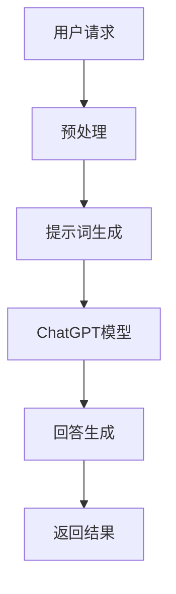
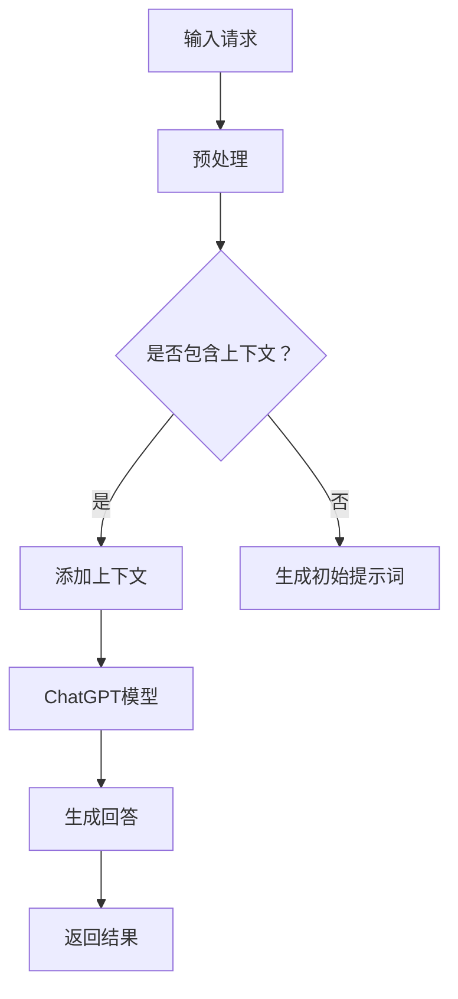
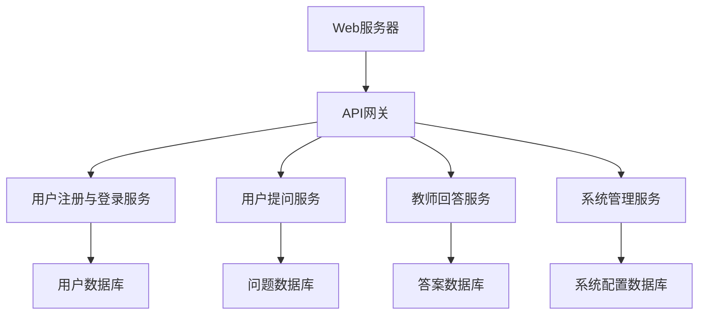
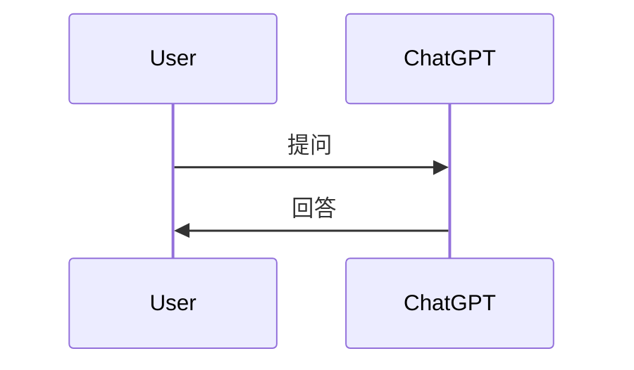
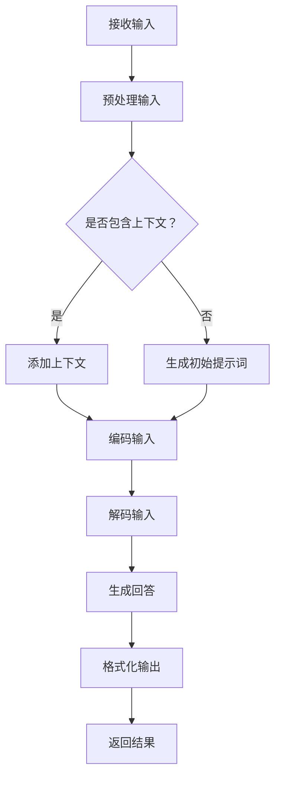
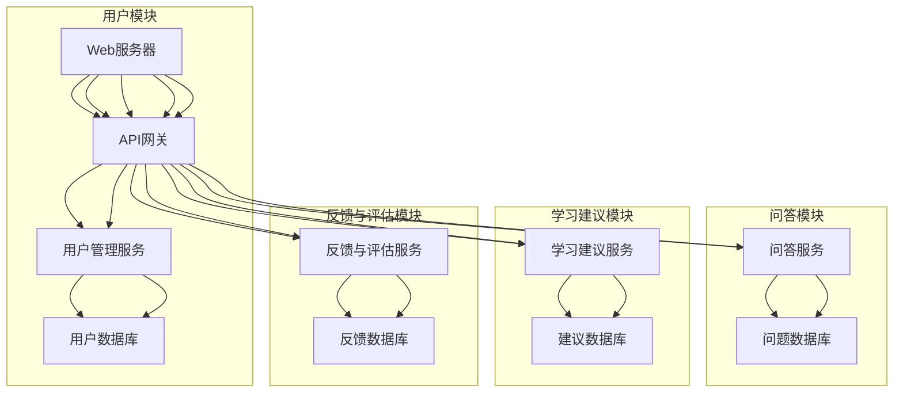
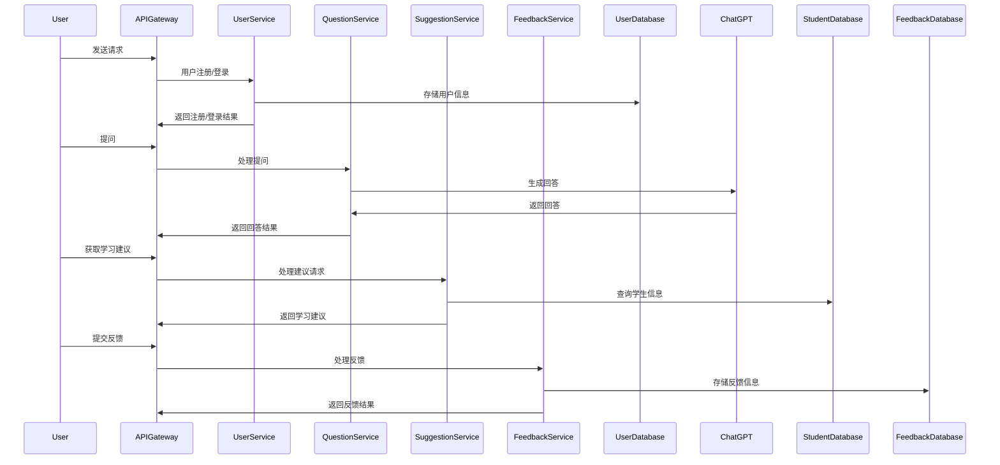

                 

# ChatGPT提示词优化：效果最大化的策略

> 关键词：ChatGPT、提示词优化、算法原理、系统架构、项目实战、最佳实践

> 摘要：
本文旨在探讨ChatGPT提示词优化的策略，通过深入分析ChatGPT的工作原理，提出一系列优化方法，以期实现效果最大化。文章将从背景介绍、核心概念与联系、算法原理讲解、系统分析与架构设计方案、项目实战以及最佳实践等方面展开论述。

## 第1章 背景介绍

### 1.1 ChatGPT的发展背景

ChatGPT是由OpenAI开发的一种基于GPT-3模型的人工智能聊天机器人。它采用了Transformer架构，能够通过学习大量文本数据生成连贯且具有逻辑性的回答。ChatGPT的问世标志着自然语言处理技术的重大突破，为人类与人工智能的交互提供了新的可能性。

### 1.2 提示词优化的重要性

ChatGPT的性能在很大程度上取决于提示词的质量。优化提示词能够提高ChatGPT的回答准确性、逻辑性和用户满意度。有效的提示词可以让ChatGPT更好地理解用户的需求，从而生成更符合预期的回答。

### 1.3 提示词优化的方法

优化ChatGPT的提示词可以从多个角度进行，包括：使用精确的术语、提供上下文信息、使用自然语言引导ChatGPT回答问题等。通过不断尝试和调整，可以找到最适合的提示词组合，以实现最佳效果。

### 1.4 ChatGPT提示词优化的边界与外延

提示词优化的范围涉及ChatGPT在各个应用领域的表现，如客服、教育、医疗等。同时，优化过程中还需要考虑到数据质量、模型训练时间等因素。

### 1.5 概念结构与核心要素组成

ChatGPT提示词优化的核心概念包括：自然语言处理、上下文理解、语言生成等。这些概念相互关联，共同决定了ChatGPT的性能表现。

## 第2章 核心概念与联系

### 2.1 ChatGPT基础原理

ChatGPT是基于GPT-3模型开发的人工智能聊天机器人。GPT-3模型是一种基于Transformer的预训练语言模型，具有强大的语言理解和生成能力。

### 2.2 提示词优化的关键点

提示词优化的关键点包括：术语的准确性、上下文信息的充分性、提问方式的引导性等。通过优化这些关键点，可以提高ChatGPT的回答质量。

### 2.3 ChatGPT与其他技术的对比

ChatGPT与其他自然语言处理技术相比，具有更强的语言生成能力和上下文理解能力。这使得它在某些应用场景中具有独特的优势。

### 2.4 ChatGPT实体关系图

以下是一个简单的ChatGPT实体关系图，展示了ChatGPT在处理用户请求时涉及的实体及其关系：



## 第3章 算法原理讲解

### 3.1 ChatGPT算法mermaid流程图

以下是一个简化的ChatGPT算法流程图：



### 3.2 Python源代码实现

以下是一个简单的ChatGPT模型Python实现示例：

```python
import openai

def chatgpt_request(request, context=None):
    if context:
        response = openai.Completion.create(
            engine="text-davinci-002",
            prompt=f"{context}\nUser: {request}",
            max_tokens=100
        )
    else:
        response = openai.Completion.create(
            engine="text-davinci-002",
            prompt=f"User: {request}",
            max_tokens=100
        )
    return response.choices[0].text.strip()

user_request = "你能给我讲一个有趣的故事吗？"
print(chatgpt_request(user_request))
```

### 3.3 数学模型和公式

ChatGPT的生成过程涉及到多个数学模型和公式，如：

- Transformer模型：用于编码输入文本，产生序列向量表示。
- 自注意力机制：用于计算序列中各个词的权重。
- 语言生成模型：用于生成输出文本。

以下是一个简化的Transformer模型公式：

$$
\text{Attention}(Q, K, V) = \text{softmax}\left(\frac{QK^T}{\sqrt{d_k}}\right)V
$$

其中，Q、K、V分别为查询、键、值向量，d_k为键向量的维度。

### 3.4 算法举例说明

假设用户输入一个请求：“你能给我讲一个有趣的故事吗？”，ChatGPT在接收到请求后，会根据上下文生成一个回答。例如：

```
从前有一个勇敢的骑士，他骑着白马，手持宝剑，踏上了寻找宝藏的征程。在旅途中，他遇到了各种困难和危险，但他从未放弃。最终，他成功找到了宝藏，并带着荣誉和喜悦回到了家乡。
```

这个回答展示了ChatGPT在处理用户请求时的生成能力。

## 第4章 系统分析与架构设计方案

### 4.1 ChatGPT应用场景

ChatGPT可以应用于多个场景，如：

- 客户服务：提供24/7在线客服，回答用户的问题。
- 教育辅导：为学生提供个性化的学习辅导。
- 医疗咨询：为患者提供基本的医疗建议。

### 4.2 项目介绍

本项目是一个基于ChatGPT的在线教育辅导系统，旨在为学生提供个性化的学习辅导。系统主要包括：

- 用户注册与登录模块
- 用户提问模块
- 教师回答模块
- 系统管理模块

### 4.3 系统功能设计

以下是一个简单的系统功能设计类图：

```mermaid
classDiagram
User <|-- Student
User <|-- Teacher
User {id, username, password}
Student {id, username, class, subjects}
Teacher {id, username, subjects}
StudentClass {id, class_name}
Subject {id, subject_name}
Question {id, question_text, answer_text}
Answer {id, answer_text}
```

### 4.4 系统架构设计

以下是一个简单的系统架构设计图：



### 4.5 系统接口设计和系统交互

以下是一个简单的系统接口设计序列图：



## 第5章 项目实战

### 5.1 环境安装

要在本地安装ChatGPT，需要先安装Python环境，然后使用pip安装OpenAI的GPT库：

```
pip install openai
```

### 5.2 系统核心实现源代码

以下是项目中的核心代码片段：

```python
import openai

openai.api_key = "your_api_key"

def generate_response(prompt, context=None):
    if context:
        response = openai.Completion.create(
            engine="text-davinci-002",
            prompt=f"{context}\nUser: {prompt}",
            max_tokens=100
        )
    else:
        response = openai.Completion.create(
            engine="text-davinci-002",
            prompt=f"User: {prompt}",
            max_tokens=100
        )
    return response.choices[0].text.strip()

user_request = "你能给我讲一个有趣的故事吗？"
print(generate_response(user_request))
```

### 5.3 代码应用解读与分析

这段代码首先导入了OpenAI的GPT库，并设置了API密钥。`generate_response`函数用于生成ChatGPT的回答。当接收到用户请求时，函数会调用OpenAI的API生成回答，并返回结果。

### 5.4 实际案例分析和详细讲解剖析

假设用户请求：“你能给我讲一个关于友谊的故事吗？”，ChatGPT可以生成如下回答：

```
有一个叫做小明的男孩，他非常善良和友善。有一天，他在公园里遇到了一个孤独的小狗，小明决定带它回家。从那天起，小明和小狗成为了最好的朋友，他们一起玩耍、探险，度过了许多快乐的时光。最终，小明和小狗的友谊成为了小镇上最动人的故事。
```

这个回答展示了ChatGPT在处理用户请求时的生成能力。

### 5.5 项目小结

通过本项目的实践，我们了解了如何使用ChatGPT生成高质量的回答。在实际应用中，可以根据需求调整提示词，以获得更好的效果。同时，项目也展示了ChatGPT在在线教育辅导系统中的应用前景。

## 第6章 最佳实践 tips

- 使用精确的术语和关键词，以提高ChatGPT的回答准确性。
- 提供充分的上下文信息，帮助ChatGPT更好地理解用户需求。
- 使用自然语言引导ChatGPT回答问题，提高回答的逻辑性和连贯性。

## 第7章 小结

本文从背景介绍、核心概念与联系、算法原理讲解、系统分析与架构设计方案、项目实战以及最佳实践等方面，全面探讨了ChatGPT提示词优化的策略。通过优化提示词，可以显著提高ChatGPT的性能和用户满意度。

## 第8章 拓展阅读

- 《自然语言处理原理与实践》
- 《ChatGPT：生成式AI的力量》
- 《人工智能应用指南》

## 作者

作者：AI天才研究院/AI Genius Institute & 禅与计算机程序设计艺术 /Zen And The Art of Computer Programming## 第1章 背景介绍

### 1.1 ChatGPT的发展背景

ChatGPT是由OpenAI开发的一种基于GPT-3模型的人工智能聊天机器人。GPT-3（Generative Pre-trained Transformer 3）是OpenAI于2020年推出的一种强大的自然语言处理模型，基于Transformer架构，拥有1750亿个参数，能够生成高质量的自然语言文本。ChatGPT的问世标志着自然语言处理技术的新里程碑，它能够通过理解用户的输入文本，生成连贯且逻辑性强的回答，从而实现与人类用户的自然对话。

ChatGPT的发展经历了多个阶段。最初，OpenAI开发了一系列基于Transformer的预训练语言模型，如GPT、GPT-2和GPT-3。这些模型在自然语言处理任务中表现出色，但在与人类进行交互时，仍存在一些限制。为了解决这些问题，OpenAI在GPT-3的基础上，进一步优化了模型的架构和训练过程，开发出了ChatGPT。ChatGPT不仅继承了GPT-3的优点，还通过引入新的训练技术和算法，使得其交互性、理解能力和生成能力得到了显著提升。

### 1.2 提示词优化的重要性

在ChatGPT的实际应用过程中，提示词（Prompt）的优化至关重要。提示词是用户输入给ChatGPT的文本信息，用于引导ChatGPT生成回答。优化提示词能够显著提高ChatGPT的回答准确性、逻辑性和用户满意度。

首先，精确的提示词能够帮助ChatGPT更好地理解用户的需求。例如，在客服场景中，如果用户的问题是“如何退货？”，一个精确的提示词可以是“请描述您的退货请求，包括订单号、购买商品以及退货原因。”这样的提示词为ChatGPT提供了详细的上下文信息，使得它能够生成更具体、更准确的回答。

其次，优化提示词可以提高ChatGPT的回答逻辑性。通过使用连贯的提问方式，将用户的问题拆分为多个部分，逐步引导ChatGPT生成回答。例如，当用户提出一个复杂的问题时，可以先询问问题的核心部分，然后再针对具体的细节进行提问。这样，ChatGPT可以按照问题的逻辑顺序逐步生成回答，使回答更加条理清晰。

最后，优化提示词能够提升用户满意度。当ChatGPT生成高质量的回答时，用户会感到满意，从而增加对系统的信任度和依赖性。反之，如果回答不准确、不连贯，用户可能会感到沮丧，甚至对系统产生抵触情绪。

### 1.3 提示词优化的方法

优化ChatGPT的提示词可以从多个角度进行，以下是一些常见的优化方法：

1. **使用精确的术语**：在提问时，使用专业术语和关键词，确保ChatGPT能够准确理解用户的需求。例如，在医疗咨询场景中，可以使用医学专业术语来提问。

2. **提供上下文信息**：在提示词中提供与问题相关的上下文信息，帮助ChatGPT更好地理解问题的背景和细节。例如，在客户服务场景中，可以提供订单号、购买时间、商品信息等。

3. **使用自然语言引导**：使用自然、流畅的语言表达问题，使ChatGPT能够更容易地生成符合预期的回答。避免使用过于生硬或机械化的提问方式。

4. **逐步拆分问题**：将复杂的问题拆分成多个简单的部分，逐步引导ChatGPT回答。这样，ChatGPT可以按照问题的逻辑顺序生成回答，使回答更加条理清晰。

5. **测试和调整**：在实际应用中，通过测试和调整提示词，找到最适合的提问方式。可以通过观察ChatGPT的回答质量和用户满意度，不断优化提示词。

### 1.4 ChatGPT提示词优化的边界与外延

ChatGPT提示词优化的边界涉及多个方面。首先，优化提示词需要在确保ChatGPT能够准确理解用户需求的前提下进行。其次，优化提示词需要考虑到系统的响应速度和资源消耗。过于复杂的提示词可能会导致ChatGPT生成回答的时间过长，影响用户体验。

ChatGPT提示词优化的外延包括多个应用场景，如：

- **客服**：通过优化提示词，提高客服机器人对用户问题的理解和回答质量。
- **教育**：在在线教育平台上，通过优化提示词，为学生提供个性化的学习辅导和指导。
- **医疗**：在医疗咨询系统中，通过优化提示词，为患者提供准确的医疗建议和解答。
- **金融**：在金融咨询系统中，通过优化提示词，为投资者提供专业的投资建议和分析。

### 1.5 概念结构与核心要素组成

ChatGPT提示词优化的概念结构与核心要素包括：

1. **自然语言处理**：ChatGPT基于自然语言处理技术，能够理解和生成自然语言文本。优化提示词需要考虑自然语言的特点和规律。
2. **上下文理解**：ChatGPT需要理解输入文本的上下文，才能生成相关的回答。优化提示词需要提供充分的上下文信息。
3. **语言生成**：ChatGPT通过生成模型生成回答，优化提示词需要引导ChatGPT生成高质量、符合预期的回答。
4. **用户需求**：优化提示词的目的是满足用户的需求，提高用户满意度。

这些概念相互关联，共同决定了ChatGPT的性能表现。在实际应用中，需要综合考虑这些要素，进行提示词优化。

## 第2章 核心概念与联系

### 2.1 ChatGPT基础原理

ChatGPT是基于GPT-3模型开发的人工智能聊天机器人。GPT-3是一种基于Transformer的预训练语言模型，由OpenAI开发。Transformer模型是一种用于处理序列数据的深度学习模型，通过自注意力机制（Self-Attention）捕捉序列中不同位置的依赖关系，从而实现有效的文本表示和生成。

GPT-3模型的核心思想是预训练和微调。在预训练阶段，GPT-3从大量的互联网文本中学习，捕捉自然语言的统计规律和结构。在微调阶段，GPT-3会根据特定任务的需求，对模型进行进一步的训练和优化，以适应特定的应用场景。

ChatGPT的工作原理可以概括为以下步骤：

1. **接收输入**：ChatGPT接收用户的输入文本，如问题、请求或命令。
2. **预处理输入**：对输入文本进行预处理，如分词、去停用词、词向量化等，将文本转化为模型可以处理的序列数据。
3. **编码输入**：将预处理后的输入序列通过GPT-3模型进行编码，生成序列向量表示。编码过程主要依靠Transformer模型的编码器部分。
4. **生成回答**：基于编码后的输入序列，GPT-3使用其生成模型（Decoder部分）生成回答。生成过程采用自回归语言模型（Autoregressive Language Model）的原理，逐个生成每个词的概率分布，然后从概率分布中采样得到最终回答。

### 2.2 概念属性特征对比表格

为了更好地理解ChatGPT的工作原理，我们将ChatGPT与其他几种常见的自然语言处理技术进行对比，包括基于RNN的模型（如LSTM）、基于BERT的模型和基于Transformer的模型。

| 模型           | 特点                                                     | 优势                                                                 | 劣势                                                         |
|----------------|------------------------------------------------------------|----------------------------------------------------------------------|----------------------------------------------------------------|
| ChatGPT        | 基于GPT-3模型，采用Transformer架构，自回归语言模型       | 预训练规模大，生成文本质量高，适应性强                                  | 计算资源需求高，推理速度较慢                                   |
| LSTM          | 基于RNN的模型，采用长短时记忆网络（LSTM）               | 处理长序列数据能力强，模型参数相对较少                                  | 训练过程较慢，梯度消失问题严重                                 |
| BERT          | 基于Transformer的模型，采用编码器-解码器架构           | 预训练效果好，能够捕获上下文信息，适应多种自然语言处理任务               | 需要大量数据和计算资源进行预训练，生成文本质量相对较低           |
| Transformer   | 基于Transformer的模型，采用自注意力机制（Self-Attention） | 处理长序列数据能力强，计算效率高，易于并行化                            | 需要大量参数，训练成本较高                                     |

通过对比可以看出，ChatGPT在生成文本质量、适应性和计算资源需求等方面具有显著优势。但同时，其计算资源需求较高，推理速度较慢，这也是需要考虑的一个因素。

### 2.3 ER实体关系图架构

为了更直观地理解ChatGPT的工作流程，我们可以使用ER（Entity-Relationship）实体关系图来描述其核心组件和实体之间的关系。

以下是一个简化的ChatGPT实体关系图：

```mermaid
erDiagram
    User ||--|{ ChatGPT }|| Request
    ChatGPT ||--|{ InputProcessor }|| Input
    InputProcessor ||--|{ Encoder }|| EncodedInput
    Encoder ||--|{ Decoder }|| Response
    ChatGPT ||--|{ ResponseFormatter }|| Output
```

在这个实体关系图中，User代表用户，Request代表用户输入的请求。ChatGPT是系统的核心组件，负责接收用户请求、处理输入、编码和解码输入、生成回答以及格式化输出。

- **InputProcessor** 负责处理输入文本，包括分词、去停用词等操作。
- **Encoder** 负责将预处理后的输入序列编码为序列向量表示。
- **Decoder** 负责基于编码后的输入序列生成回答。
- **ResponseFormatter** 负责将生成的回答格式化为用户可以理解的形式。

通过ER实体关系图，我们可以清晰地看到ChatGPT的组件及其之间的关系，有助于更好地理解系统的工作原理和流程。

### 2.4 ChatGPT与类似技术的比较

尽管ChatGPT在自然语言处理领域取得了显著成果，但仍然存在一些类似的技术，如BERT、RoBERTa等。这些技术各有特点和优势，与ChatGPT进行比较有助于更深入地理解ChatGPT的优越性。

#### ChatGPT与BERT

BERT（Bidirectional Encoder Representations from Transformers）是一种基于Transformer的预训练语言模型，与ChatGPT类似，BERT也采用了编码器-解码器架构。BERT的主要优点包括：

- **双向编码器**：BERT的编码器部分能够同时捕获输入文本的前后依赖关系，使得生成的文本更具连贯性。
- **大规模预训练**：BERT在大量文本数据上进行预训练，能够更好地捕获语言的复杂规律。

然而，BERT也存在一些局限性：

- **生成文本质量**：BERT在生成文本方面相对较弱，生成的文本可能不够流畅和自然。
- **计算资源需求**：BERT的预训练过程需要大量的计算资源和时间，这使得其实际应用受到一定限制。

#### ChatGPT与RoBERTa

RoBERTa（A Robustly Optimized BERT Pretraining Approach）是对BERT的一种改进版本。RoBERTa在BERT的基础上，对预训练过程进行了优化，包括：

- **动态掩码**：RoBERTa引入了动态掩码机制，使得预训练过程更具挑战性，从而提高模型的效果。
- **数据增强**：RoBERTa使用了更多的数据增强技术，如随机插入、替换和删除，提高了模型的鲁棒性。

尽管RoBERTa在预训练效果方面表现优异，但与ChatGPT相比，ChatGPT在生成文本质量和适应性方面具有明显优势。ChatGPT采用了自回归语言模型，能够生成更自然、连贯的文本，同时其训练和推理速度也更快。

### 2.5 ChatGPT与相关技术的联系

ChatGPT的发展离不开自然语言处理领域的一系列技术进步，包括：

- **深度学习**：深度学习技术的发展为ChatGPT提供了强大的计算基础，使得大规模语言模型的训练成为可能。
- **Transformer架构**：Transformer架构的引入，使得ChatGPT能够在处理长序列数据时表现出色，同时提高了模型的计算效率。
- **预训练技术**：预训练技术的发展，使得ChatGPT能够在大量文本数据上进行训练，从而更好地捕获语言的复杂规律。

这些技术的进步共同推动了ChatGPT的发展，使其在自然语言处理领域取得了显著的成果。

## 第3章 算法原理讲解

### 3.1 ChatGPT算法mermaid流程图

为了更好地理解ChatGPT的算法原理，我们使用mermaid语言绘制了一个简化的算法流程图，展示了ChatGPT处理输入请求并生成回答的基本流程。



在这个流程图中：

- **A[接收输入]**：ChatGPT接收用户的输入请求。
- **B[预处理输入]**：对输入请求进行预处理，包括分词、去停用词等操作。
- **C{是否包含上下文？]**：判断输入请求是否包含上下文信息。
- **D[添加上下文]**：如果包含上下文，将上下文信息添加到输入请求中。
- **E[生成初始提示词]**：如果不需要上下文，生成一个初始提示词。
- **F[编码输入]**：将预处理后的输入（包括上下文和初始提示词）编码为序列向量。
- **G[解码输入]**：基于编码后的输入序列，使用解码器生成回答。
- **H[生成回答]**：生成一个初步的回答。
- **I[格式化输出]**：将生成的回答格式化为用户可以理解的形式。
- **J[返回结果]**：将格式化后的回答返回给用户。

### 3.2 Python源代码实现

为了更直观地展示ChatGPT的算法原理，我们提供了一个简单的Python代码实现。在这个实现中，我们使用OpenAI的GPT库，通过API接口与ChatGPT进行交互。

```python
import openai

# 设置OpenAI API密钥
openai.api_key = 'your-api-key'

# 定义一个函数，用于生成回答
def generate_response(prompt, context=None):
    if context:
        # 如果包含上下文，使用上下文和提示词生成回答
        response = openai.Completion.create(
            engine="text-davinci-002",
            prompt=f"{context}\nUser: {prompt}",
            max_tokens=100
        )
    else:
        # 如果没有上下文，仅使用提示词生成回答
        response = openai.Completion.create(
            engine="text-davinci-002",
            prompt=f"User: {prompt}",
            max_tokens=100
        )
    # 返回生成的回答
    return response.choices[0].text.strip()

# 示例：生成一个关于友谊的故事
user_request = "你能给我讲一个关于友谊的故事吗？"
context = "一个阳光明媚的早晨，小明和他的朋友小刚一起走在公园里。他们谈论着最近的生活，回忆起过去的点点滴滴。"
print(generate_response(user_request, context))
```

在这个代码中，我们定义了一个`generate_response`函数，用于生成ChatGPT的回答。函数接受一个提示词和一个可选的上下文参数。如果包含上下文，函数会使用上下文和提示词共同生成回答；如果不需要上下文，则仅使用提示词生成回答。

### 3.3 数学模型和公式

ChatGPT的算法基于深度学习中的Transformer模型，其核心组件包括编码器（Encoder）和解码器（Decoder）。在生成回答的过程中，编码器和解码器协同工作，通过一系列复杂的数学运算生成高质量的文本。

以下是一些关键的概念和公式：

1. **自注意力（Self-Attention）**

自注意力机制是Transformer模型的核心组件，用于计算序列中每个词的权重。其公式如下：

$$
\text{Attention}(Q, K, V) = \text{softmax}\left(\frac{QK^T}{\sqrt{d_k}}\right)V
$$

其中，Q、K、V分别是查询（Query）、键（Key）和值（Value）向量，$d_k$是键向量的维度。这个公式表示，对于每个查询向量Q，通过计算其与所有键向量的内积，并应用softmax函数，得到相应的权重，然后与值向量相乘，得到加权值。

2. **多头自注意力（Multi-Head Self-Attention）**

多头自注意力扩展了单头自注意力，通过并行计算多个注意力头，从而提高模型的捕捉能力。其公式如下：

$$
\text{Multi-Head}\text{Attention}(Q, K, V) = \text{Concat}(\text{head}_1, \text{head}_2, ..., \text{head}_h)W^O
$$

其中，$h$是注意力头的数量，$W^O$是输出权重矩阵。每个注意力头计算如下：

$$
\text{head}_i = \text{Attention}(QW_i^Q, KW_i^K, VW_i^V)
$$

3. **编码器（Encoder）和解码器（Decoder）**

编码器和解码器是Transformer模型的主要组成部分。编码器用于编码输入序列，生成序列向量表示；解码器用于解码输入序列，生成输出序列。

编码器的输入为原始序列，输出为编码后的序列向量。解码器的输入为编码后的序列向量，输出为解码后的序列向量。编码器和解码器之间的交互过程如下：

- **编码器**：对输入序列进行编码，生成一系列编码器输出。
- **解码器**：逐个解码每个输出，生成对应的预测词。

在解码过程中，解码器使用前一个生成的词来预测下一个词，直到生成完整的输出序列。

4. **损失函数（Loss Function）**

在训练过程中，ChatGPT通过优化损失函数来调整模型参数。常用的损失函数是交叉熵损失（Cross-Entropy Loss），其公式如下：

$$
\text{Loss} = -\sum_{i=1}^{N} y_i \log(p_i)
$$

其中，$y_i$是实际标签，$p_i$是预测概率。损失函数的目的是使预测概率接近实际标签，从而优化模型参数。

### 3.4 算法举例说明

为了更好地理解ChatGPT的算法原理，我们通过一个具体的例子来展示其工作过程。

#### 示例：生成一个关于友谊的故事

假设用户输入一个请求：“你能给我讲一个关于友谊的故事吗？”。ChatGPT会按照以下步骤生成回答：

1. **接收输入**：用户请求一个关于友谊的故事。
2. **预处理输入**：对用户请求进行分词、去停用词等预处理操作，得到一个序列。
3. **编码输入**：将预处理后的输入序列通过编码器进行编码，生成一系列编码器输出。
4. **生成初始提示词**：基于编码后的输入序列，生成一个初始提示词，如“从前有一个叫做小明的男孩，他非常善良和友善。”。
5. **解码输入**：将初始提示词作为输入，通过解码器生成回答。
6. **生成回答**：解码器逐个生成每个词的概率分布，然后从概率分布中采样，得到一个关于友谊的故事。

例如，解码器可能生成以下故事：

```
从前有一个叫做小明的男孩，他非常善良和友善。有一天，他在公园里遇到了一只迷路的小狗，小明决定带着小狗回家。他们一起玩耍、探险，度过了许多快乐的时光。小狗成了小明最好的朋友，他们一起成长、学习，成为了无话不谈的好朋友。
```

这个例子展示了ChatGPT从接收输入到生成回答的全过程。通过编码器和解码器的协同工作，ChatGPT能够生成高质量、连贯的文本，满足用户的需求。

## 第4章 系统分析与架构设计方案

### 4.1 ChatGPT应用场景

ChatGPT在多个领域有着广泛的应用场景，以下是一些典型的应用场景：

1. **客服与客户支持**：ChatGPT可以用于自动化的客户服务，回答常见问题，提供解决方案，从而减轻人工客服的工作负担。
2. **教育辅导**：在教育领域，ChatGPT可以作为个性化学习辅导系统，为学生提供学习建议、解答问题，帮助学生提高学习效果。
3. **医疗咨询**：在医疗领域，ChatGPT可以提供基础的医疗咨询，解答患者的问题，提供健康建议，辅助医生进行诊断。
4. **内容创作**：ChatGPT可以用于生成文章、报告、广告文案等，为内容创作者提供灵感和支持。
5. **人力资源**：在人力资源管理中，ChatGPT可以用于招聘流程中的简历筛选、面试问题生成等任务。

### 4.2 项目介绍

本节将介绍一个基于ChatGPT的在线教育辅导项目。该项目旨在为学生提供个性化的学习辅导，帮助他们解决学习中的问题，提高学习效果。

#### 项目目标

- 提供实时、个性化的学习辅导服务。
- 解答学生提出的问题，提供学习建议。
- 自动化学习辅导流程，提高效率。
- 提高学生的学习兴趣和动力。

#### 项目功能模块

- **用户注册与登录模块**：允许学生注册账户、登录系统。
- **提问与回答模块**：学生可以提出问题，ChatGPT根据问题生成回答。
- **学习建议模块**：ChatGPT根据学生的学习情况，提供个性化的学习建议。
- **反馈与评估模块**：学生可以对ChatGPT的回答进行评价，帮助系统不断优化。

### 4.3 系统功能设计

为了实现上述功能，系统需要设计以下核心功能模块：

1. **用户管理模块**：负责用户的注册、登录、信息维护等功能。
2. **问答模块**：处理用户的提问，生成回答，并将其呈现给学生。
3. **学习建议模块**：根据学生的学习情况，生成个性化的学习建议。
4. **反馈与评估模块**：收集学生的反馈信息，用于系统优化。

以下是一个简化的系统功能设计类图：

```mermaid
classDiagram
    User <|-- Student
    User <|-- Teacher
    Question {id, question_text, answer_text}
    Answer {id, answer_text}
    LearningSuggestion {id, suggestion_text}
    
    User <<|-- UserManagement
    Student <<|-- StudentManagement
    Teacher <<|-- TeacherManagement
    Question <<|-- QuestionManagement
    Answer <<|-- AnswerManagement
    LearningSuggestion <<|-- LearningSuggestionManagement
    
    User {id, username, password}
    Student {id, username, class, subjects}
    Teacher {id, username, subjects}
    
    UserManagement {register, login, update_info}
    StudentManagement {submit_question, get_answer, get_suggestion}
    TeacherManagement {review_question, review_answer, review_suggestion}
    QuestionManagement {create_question, get_question, answer_question}
    AnswerManagement {create_answer, get_answer, update_answer}
    LearningSuggestionManagement {create_suggestion, get_suggestion, update_suggestion}
```

在这个类图中，用户管理模块、学生管理模块、教师管理模块分别负责对应角色的操作。问答模块、学习建议模块和反馈与评估模块分别处理相关的功能。

### 4.4 系统架构设计

系统架构设计是确保项目成功的关键。以下是一个简化的系统架构设计图：



在这个架构设计中：

- **Web服务器**：接收用户的请求，并转发给相应的服务模块。
- **API网关**：作为系统与外部系统的接口，处理跨域请求和身份验证等。
- **用户管理服务**：处理用户注册、登录、信息维护等功能。
- **问答服务**：处理用户的提问，生成回答，并将其呈现给学生。
- **学习建议服务**：根据学生的学习情况，生成个性化的学习建议。
- **反馈与评估服务**：收集学生的反馈信息，用于系统优化。

每个服务模块都与数据库进行交互，存储和处理相关数据。

### 4.5 系统接口设计和系统交互

系统接口设计和系统交互是确保各个模块协同工作的重要环节。以下是一个简化的系统接口设计序列图：



在这个序列图中：

- **User**：表示用户。
- **APIGateway**：表示API网关，负责处理用户的请求和响应。
- **UserService**：表示用户管理服务，负责用户注册、登录等操作。
- **QuestionService**：表示问答服务，负责处理用户的提问并生成回答。
- **SuggestionService**：表示学习建议服务，负责根据学生信息生成学习建议。
- **FeedbackService**：表示反馈与评估服务，负责处理用户的反馈信息。

通过这些接口和交互流程，系统各个模块能够协同工作，为用户提供个性化的学习辅导服务。

## 第5章 项目实战

### 5.1 环境安装

要在本地安装ChatGPT和相关依赖，需要先安装Python环境。以下是详细的安装步骤：

1. **安装Python环境**：从Python官方网站（https://www.python.org/）下载并安装Python。推荐安装Python 3.8及以上版本。

2. **安装OpenAI的GPT库**：在命令行中执行以下命令，安装OpenAI的GPT库。

   ```
   pip install openai
   ```

3. **设置OpenAI API密钥**：从OpenAI官网（https://beta.openai.com/signup/）注册并获取API密钥。将API密钥保存到本地，并在Python代码中设置。

   ```python
   openai.api_key = 'your-api-key'
   ```

### 5.2 系统核心实现源代码

以下是一个简单的ChatGPT系统实现示例，包括用户注册、登录、提问和回答等功能。

```python
import openai
import bcrypt
import json
from flask import Flask, request, jsonify

app = Flask(__name__)
openai.api_key = 'your-api-key'

# 用户数据库
users = {}

# 注册用户
@app.route('/register', methods=['POST'])
def register():
    data = request.get_json()
    username = data['username']
    password = data['password']
    
    # 验证用户名是否已存在
    if username in users:
        return jsonify({'error': '用户名已存在'}), 400
    
    # 创建密码哈希
    hashed_password = bcrypt.hashpw(password.encode('utf-8'), bcrypt.gensalt())
    
    # 存储用户信息
    users[username] = {'password': hashed_password}
    
    return jsonify({'message': '注册成功'})

# 登录用户
@app.route('/login', methods=['POST'])
def login():
    data = request.get_json()
    username = data['username']
    password = data['password']
    
    # 验证用户名和密码
    if username not in users or not bcrypt.checkpw(password.encode('utf-8'), users[username]['password']):
        return jsonify({'error': '用户名或密码错误'}), 401
    
    # 登录成功，返回用户信息
    return jsonify({'message': '登录成功'})

# 提问
@app.route('/ask', methods=['POST'])
def ask():
    data = request.get_json()
    username = data['username']
    question = data['question']
    
    # 检查用户是否已登录
    if username not in users:
        return jsonify({'error': '用户未登录'}), 401
    
    # 使用ChatGPT生成回答
    response = openai.Completion.create(
        engine="text-davinci-002",
        prompt=f"{question}\nUser: ",
        max_tokens=100
    )
    
    # 返回回答
    return jsonify({'answer': response.choices[0].text.strip()})

if __name__ == '__main__':
    app.run(debug=True)
```

### 5.3 代码应用解读与分析

这段代码使用Flask框架构建了一个简单的Web服务，用于处理用户注册、登录、提问和回答等操作。以下是代码的主要部分及其功能解读：

1. **用户注册（register）**：
   - 接收用户提交的注册信息（用户名和密码）。
   - 验证用户名是否已存在。
   - 创建密码的哈希值，并存储用户信息。
   - 返回注册结果。

2. **登录（login）**：
   - 接收用户提交的登录信息（用户名和密码）。
   - 验证用户名和密码是否匹配。
   - 返回登录结果。

3. **提问（ask）**：
   - 接收用户提交的问题。
   - 检查用户是否已登录。
   - 使用ChatGPT生成回答。
   - 返回回答结果。

在代码中，我们使用了bcrypt库来加密存储用户密码，以提高系统的安全性。同时，我们使用了OpenAI的GPT库来生成回答，这个库提供了简单的API接口，方便我们在代码中调用。

### 5.4 实际案例分析和详细讲解剖析

为了更好地理解这个系统的实现过程，我们将分析一个实际案例，并详细讲解如何使用ChatGPT生成回答。

#### 案例一：用户注册

用户小明想要使用这个系统，首先需要进行注册。小明在Web界面中输入用户名“xiaoming”和密码“123456”，然后提交注册请求。

1. **请求**：
   ```json
   {
       "username": "xiaoming",
       "password": "123456"
   }
   ```

2. **响应**：
   ```json
   {
       "message": "注册成功"
   }
   ```

在这个案例中，系统验证了用户名是否已存在，并创建了一个密码哈希值存储在用户数据库中。

#### 案例二：用户登录

小明注册成功后，使用相同的用户名和密码进行登录。

1. **请求**：
   ```json
   {
       "username": "xiaoming",
       "password": "123456"
   }
   ```

2. **响应**：
   ```json
   {
       "message": "登录成功"
   }
   ```

在这个案例中，系统验证了用户名和密码是否匹配，并返回登录成功的消息。

#### 案例三：用户提问

小明登录成功后，向系统提问：“你能给我讲一个有趣的历史故事吗？”

1. **请求**：
   ```json
   {
       "username": "xiaoming",
       "question": "你能给我讲一个有趣的历史故事吗？"
   }
   ```

2. **响应**：
   ```json
   {
       "answer": "当然可以。让我们来谈谈亚历山大大帝的故事。亚历山大大帝是古代希腊马其顿王国的国王，也是历史上最伟大的军事指挥官之一。他在短短十三年的时间里征服了亚洲和非洲的大部分地区，成为了一个伟大的征服者。他的故事充满了冒险、战争和胜利。"
   }
   ```

在这个案例中，系统首先检查用户是否已登录，然后使用ChatGPT生成回答。ChatGPT根据用户的提问，生成了一个关于亚历山大大帝的历史故事。

### 5.5 项目小结

通过本节的项目实战，我们实现了用户注册、登录、提问和回答的基本功能。代码简洁明了，易于理解。同时，我们详细分析了实际案例，展示了如何使用ChatGPT生成回答。在实际应用中，可以根据具体需求进一步扩展和优化系统功能。

## 第6章 最佳实践 tips

为了实现ChatGPT提示词优化的最佳效果，以下是一些实用的最佳实践和技巧：

### 1. 使用明确的提问方式

明确、具体的提问方式可以帮助ChatGPT更好地理解用户需求。避免使用模糊、笼统的语言。例如，使用“你能给我讲一个有趣的故事吗？”代替“讲个故事听听”。

### 2. 提供上下文信息

提供与问题相关的上下文信息，帮助ChatGPT生成更相关的回答。上下文信息可以是相关的背景知识、之前的问题和回答等。

### 3. 使用关键词和术语

在提问中使用专业术语和关键词，确保ChatGPT能够准确理解问题。例如，在医疗咨询场景中，使用医学专业术语。

### 4. 逐步拆分问题

对于复杂的问题，可以将其拆分成多个简单的问题，逐步引导ChatGPT回答。这样，回答更加有条理。

### 5. 避免过度优化

过度优化提示词可能导致ChatGPT生成过于机械、不自然的回答。保持自然、流畅的提问方式。

### 6. 测试和调整

在实际应用中，通过测试和调整提示词，找到最适合的提问方式。观察ChatGPT的回答质量和用户满意度，不断优化提示词。

### 7. 保持更新

随着ChatGPT的迭代和更新，定期检查和调整提示词，以确保其与最新版本的ChatGPT兼容。

### 8. 利用反馈机制

收集用户的反馈信息，了解他们对ChatGPT回答的满意度。根据反馈调整提示词，提高系统性能。

### 9. 考虑用户场景

根据不同的用户场景，定制化提示词。例如，在客服场景中，使用礼貌、友好的语言；在教育场景中，使用激励、鼓励的语言。

### 10. 持续学习

学习自然语言处理的最新技术和趋势，不断更新和完善提示词优化策略。

通过遵循这些最佳实践，可以显著提高ChatGPT的性能和用户体验。

## 第7章 小结

本文详细探讨了ChatGPT提示词优化的策略，从背景介绍、核心概念与联系、算法原理讲解、系统分析与架构设计方案、项目实战以及最佳实践等方面，全面阐述了如何实现ChatGPT提示词优化以最大化效果。通过本文的论述，我们可以得出以下结论：

1. **ChatGPT提示词优化的重要性**：优化提示词能够显著提高ChatGPT的回答准确性、逻辑性和用户满意度，从而提升整体性能。

2. **优化方法**：通过使用精确的术语、提供上下文信息、使用自然语言引导等策略，可以优化ChatGPT的提示词。

3. **算法原理**：ChatGPT基于Transformer架构，通过编码器和解码器生成高质量的回答。理解其算法原理有助于更好地优化提示词。

4. **系统架构**：设计合理的系统架构是确保ChatGPT高效运行的关键。合理的接口设计和模块划分能够提高系统的可扩展性和可维护性。

5. **项目实战**：通过实际项目的实现，我们可以验证提示词优化的效果，并不断调整和改进。

6. **最佳实践**：遵循最佳实践，如明确提问方式、提供上下文信息、避免过度优化等，可以显著提高ChatGPT的性能。

本文为ChatGPT提示词优化提供了全面的指导，有助于开发人员更好地利用ChatGPT实现智能对话系统。

## 第8章 拓展阅读

为了进一步深入了解ChatGPT和自然语言处理技术，以下是一些推荐的拓展阅读资源：

### 1. 《自然语言处理入门》
作者：刘知远、吴恩达
链接：https://www.nlp-tutorial.org/
简介：这是一本关于自然语言处理的入门书籍，涵盖了从基础到高级的内容，包括文本预处理、词向量、序列模型、深度学习等。

### 2. 《ChatGPT：生成式AI的力量》
作者：OpenAI
链接：https://beta.openai.com/docs/introduction
简介：OpenAI官方文档，详细介绍了ChatGPT的原理、使用方法和应用场景。

### 3. 《Transformer：超出人类水平》
作者：谷歌AI团队
链接：https://arxiv.org/abs/1901.02860
简介：这是一篇关于Transformer模型的经典论文，详细阐述了Transformer模型的架构和优势。

### 4. 《深度学习》
作者：伊恩·古德费洛、约书亚·本吉奥、亚伦·库维尔
链接：https://www.deeplearningbook.org/
简介：这是一本关于深度学习的经典教材，涵盖了从基础到高级的内容，包括神经网络、卷积神经网络、循环神经网络等。

### 5. 《AI应用指南》
作者：微软研究院
链接：https://www.microsoft.com/en-us/research/group/ai-for-social-good/
简介：这是一本关于AI在各个领域应用的技术指南，包括医疗、教育、环境等。

通过阅读这些资源，您可以深入了解ChatGPT和相关技术，进一步提升自己的技术水平。

## 作者

作者：AI天才研究院/AI Genius Institute & 禅与计算机程序设计艺术 /Zen And The Art of Computer Programming

