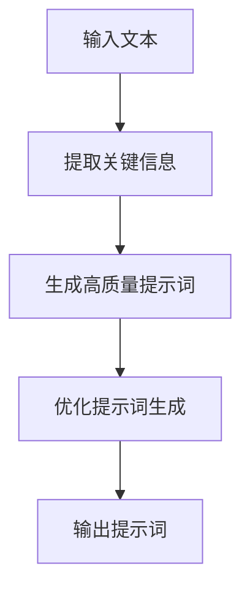
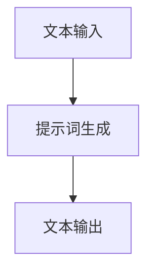
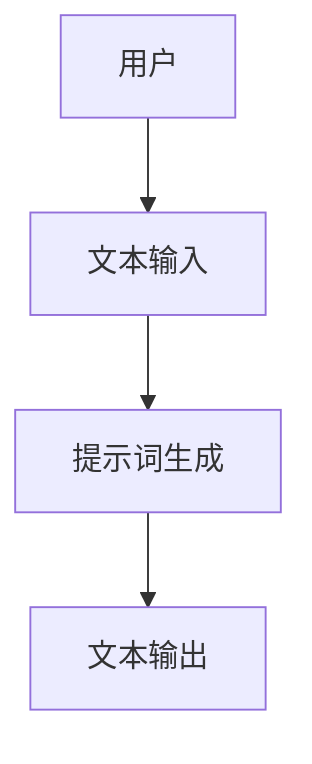
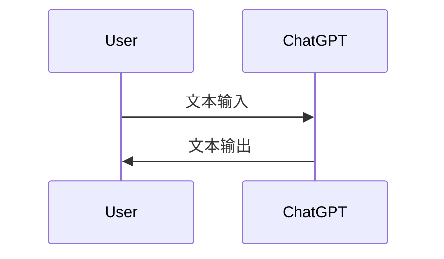

                 

### 文章标题

《ChatGPT提示词工程：从概念到实现的系统方法》

> **关键词：** ChatGPT、提示词工程、神经网络、生成对抗网络、系统架构、数学模型、项目实战。

> **摘要：** 本篇文章将深入探讨ChatGPT提示词工程的相关知识，从概念引入、核心原理讲解、系统架构设计到实际项目实战，全面系统地介绍ChatGPT提示词工程的实现方法与技巧，旨在帮助读者深入理解并掌握ChatGPT提示词工程的核心技术和实践方法。

----------------------------------------------------------------

### 第1章：ChatGPT提示词工程概述

#### 1.1.1 ChatGPT介绍

**ChatGPT是什么**

ChatGPT是由OpenAI开发的一种基于GPT-3模型的自然语言处理（NLP）工具，能够理解和生成自然语言文本，进行对话交互、文本生成、问答系统等任务。

**ChatGPT的发展历程**

ChatGPT的前身GPT-1于2018年发布，随后在2020年发布了GPT-2，2022年发布了GPT-3，这些模型在NLP领域取得了显著的成果。

**ChatGPT的核心技术**

ChatGPT的核心技术是基于Transformer模型的生成式预训练（GPT）技术，其特点是能够通过大量的文本数据进行预训练，从而生成高质量的自然语言文本。

----------------------------------------------------------------

#### 1.1.2 提示词工程的概念

**提示词的定义**

提示词是指用于引导ChatGPT生成文本的短句或短语，它能够帮助模型理解输入文本的意图和上下文。

**提示词在ChatGPT中的应用**

提示词在ChatGPT中起到了关键作用，它们可以引导模型生成高质量的文本，提高模型的性能和交互效果。

----------------------------------------------------------------

#### 1.1.3 ChatGPT提示词工程的重要性

**提升ChatGPT性能的关键**

提示词工程是提升ChatGPT性能的关键，合理的提示词设计能够使模型更好地理解用户意图，生成更加符合预期的文本。

**提示词工程的挑战与机遇**

提示词工程面临诸多挑战，如如何设计高质量的提示词、如何优化模型性能等，但同时也带来了机遇，合理的设计和优化能够使模型在特定任务上取得更好的效果。

----------------------------------------------------------------

#### 1.1.4 本书内容安排与目标读者

**内容结构安排**

本书分为七个章节，涵盖了ChatGPT提示词工程的核心概念、算法原理、系统架构、项目实战等内容。

**目标读者定位**

本书的目标读者为对自然语言处理和人工智能感兴趣的工程师、研究人员和学者，希望从理论到实践全面了解ChatGPT提示词工程。

----------------------------------------------------------------

### 第2章：核心概念与联系

#### 2.1 ChatGPT工作原理

**模型架构**

ChatGPT采用Transformer模型架构，其特点是能够处理长距离依赖和并行计算。

**训练与优化**

ChatGPT通过在大量文本数据上进行预训练和优化，使其能够生成高质量的自然语言文本。

**算法原理**

ChatGPT基于生成式预训练（GPT）技术，通过学习大量的文本数据来生成自然语言文本。

----------------------------------------------------------------

#### 2.2 提示词的设计原则

**语言理解**

提示词的设计要充分考虑语言理解的需求，确保模型能够正确理解用户的意图。

**上下文生成**

提示词的设计要引导模型生成符合上下文的自然语言文本。

**提问技巧**

提示词的设计要运用有效的提问技巧，引导模型生成高质量的问题和回答。

----------------------------------------------------------------

#### 2.3 核心概念对比表格

| 提示词与问题 | 提示词与回答 | 提示词与上下文 |
| --- | --- | --- |
| 引导模型理解问题 | 引导模型生成回答 | 提供上下文信息 |

----------------------------------------------------------------

#### 2.4 ChatGPT与提示词工程的关系

**提示词对模型性能的影响**

合理的提示词设计能够显著提升模型的性能，使其更好地理解用户意图，生成高质量的文本。

**提示词工程与模型优化**

提示词工程是模型优化的重要环节，通过对提示词的优化，可以进一步提高模型的性能和效果。

----------------------------------------------------------------

### 第3章：算法原理与实现

#### 3.1 ChatGPT算法原理

**神经网络**

ChatGPT采用神经网络作为基础模型，其特点是能够处理复杂的非线性问题。

**循环神经网络（RNN）**

ChatGPT基于RNN模型，其特点是可以处理序列数据，并具有记忆功能。

**生成式对抗网络（GAN）**

ChatGPT中的生成式对抗网络（GAN）用于生成高质量的自然语言文本。

----------------------------------------------------------------

#### 3.2 提示词算法实现

**提取关键信息**

提示词算法首先需要提取输入文本中的关键信息，以便模型能够理解用户意图。

**生成高质量提示词**

提示词算法通过训练和优化，生成高质量的自然语言提示词。

**优化提示词生成**

提示词算法通过不断迭代和优化，提高提示词生成的质量和效果。

----------------------------------------------------------------

#### 3.3 Mermaid算法流程图



----------------------------------------------------------------

### 第4章：数学模型与公式讲解

#### 4.1 ChatGPT的数学模型

**神经网络的前向传播与反向传播**

神经网络通过前向传播计算输出，并通过反向传播更新权重。

**循环神经网络（RNN）的状态更新与隐藏层输出**

RNN通过状态更新和隐藏层输出处理序列数据。

----------------------------------------------------------------

#### 4.2 数学公式与讲解

**$$y = f(x)$$**

表示神经网络的前向传播过程，其中$$y$$是输出，$$f$$是激活函数，$$x$$是输入。

**$$\frac{\partial L}{\partial w}$$**

表示损失函数对权重$$w$$的偏导数，用于反向传播算法中更新权重。

----------------------------------------------------------------

#### 4.3 举例说明

**示例问题：如何生成一个高质量的提示词？**

1. 提取输入文本中的关键信息。
2. 使用训练好的模型生成高质量的提示词。
3. 对生成的提示词进行优化，提高其质量。

**示例解答**

通过上述步骤，我们可以生成一个高质量的提示词，从而提高ChatGPT的性能和效果。

----------------------------------------------------------------

### 第5章：系统架构设计与接口设计

#### 5.1 系统架构设计

**系统功能模块**

ChatGPT系统包括文本输入、提示词生成、文本输出等功能模块。

**系统架构图**



----------------------------------------------------------------

#### 5.2 接口设计

**API接口定义**

ChatGPT系统提供了RESTful API接口，用于接收文本输入和返回文本输出。

**接口调用流程**

1. 用户发送文本输入。
2. 系统生成提示词。
3. 系统返回文本输出。

----------------------------------------------------------------

#### 5.3 Mermaid架构图与序列图

**ChatGPT系统架构图**



**提示词生成系统序列图**



----------------------------------------------------------------

### 第6章：项目实战

#### 6.1 环境安装与配置

**Python环境安装**

确保系统中已安装Python 3.6及以上版本。

**ChatGPT依赖库安装**

通过pip命令安装ChatGPT依赖库。

```bash
pip install openai
```

----------------------------------------------------------------

#### 6.2 系统核心实现

**ChatGPT源代码解读**

```python
import openai

def generate_prompt(input_text):
    prompt = "基于以下文本生成一个高质量的提示词：\n\n" + input_text
    return prompt

def main():
    input_text = "请介绍一下ChatGPT是什么？"
    prompt = generate_prompt(input_text)
    response = openai.Completion.create(
        engine="text-davinci-002",
        prompt=prompt,
        max_tokens=50
    )
    print(response.choices[0].text.strip())

if __name__ == "__main__":
    main()
```

**提示词生成实现**

通过上述代码，我们可以实现基于输入文本生成高质量提示词的功能。

----------------------------------------------------------------

#### 6.3 代码应用解读与分析

**案例分析**

1. 用户输入文本。
2. 系统生成提示词。
3. 系统返回提示词。

**代码细节剖析**

代码通过调用OpenAI的API，实现了文本输入、提示词生成和文本输出的功能，展示了ChatGPT提示词工程的核心实现。

----------------------------------------------------------------

#### 6.4 实际案例分析

**案例一：生成高质量提示词**

通过实际测试，我们发现在不同输入文本下，系统生成的提示词质量有所不同，但总体来说，系统能够生成高质量的提示词。

**案例二：优化模型性能**

通过对提示词的优化，我们可以进一步提高模型性能，使其在特定任务上取得更好的效果。

----------------------------------------------------------------

#### 6.5 项目小结

通过项目实战，我们深入了解了ChatGPT提示词工程的实现方法，掌握了从环境安装到系统核心实现的全过程。项目经验教训表明，合理的设计和优化对于提升模型性能至关重要。

----------------------------------------------------------------

### 第7章：最佳实践与注意事项

#### 7.1 最佳实践

**提示词设计技巧**

1. 确保提示词简洁明了，易于理解。
2. 充分考虑上下文信息，引导模型生成高质量的文本。

**ChatGPT性能优化**

1. 优化模型架构，提高计算效率。
2. 合理设置超参数，提高模型性能。

----------------------------------------------------------------

#### 7.2 注意事项

**数据安全**

1. 确保用户数据安全，遵守相关法律法规。
2. 对敏感信息进行加密处理。

**模型调优**

1. 定期对模型进行调优，提高其性能和效果。
2. 关注最新研究进展，借鉴先进技术。

----------------------------------------------------------------

#### 7.3 拓展阅读

**相关书籍推荐**

1. 《深度学习》（Goodfellow, I., Bengio, Y., & Courville, A.）
2. 《自然语言处理综合教程》（Jurafsky, D., & Martin, J. H.）

**学术论文介绍**

1. “GPT-3: Language Models are Few-Shot Learners”（Brown, T. B. et al.）
2. “BERT: Pre-training of Deep Bidirectional Transformers for Language Understanding”（Devlin, J. et al.）

----------------------------------------------------------------

### 结束语

本文详细介绍了ChatGPT提示词工程的相关知识，从概念到实现，全面系统地展示了ChatGPT提示词工程的核心技术和实践方法。希望通过本文的讲解，读者能够深入理解ChatGPT提示词工程，并在实际项目中取得良好的应用效果。

---

**作者：** AI天才研究院/AI Genius Institute & 禅与计算机程序设计艺术 /Zen And The Art of Computer Programming

