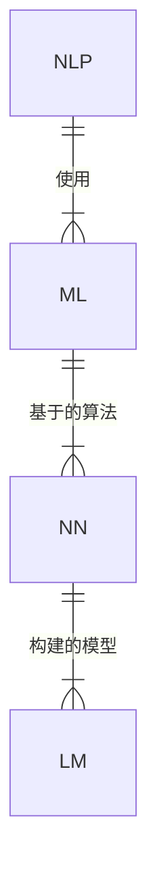
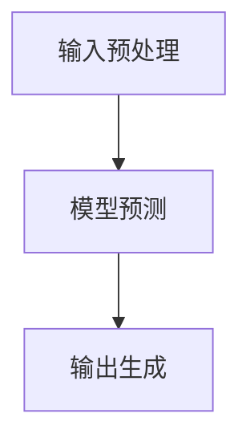
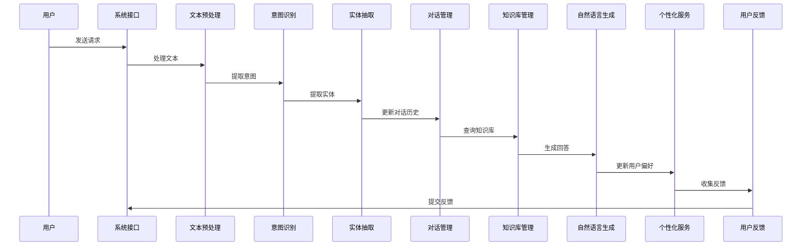
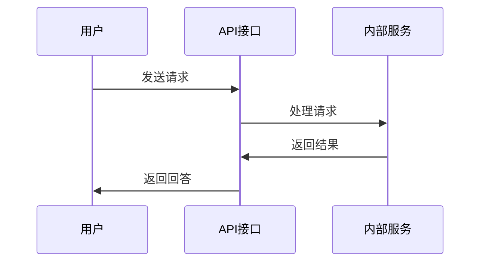
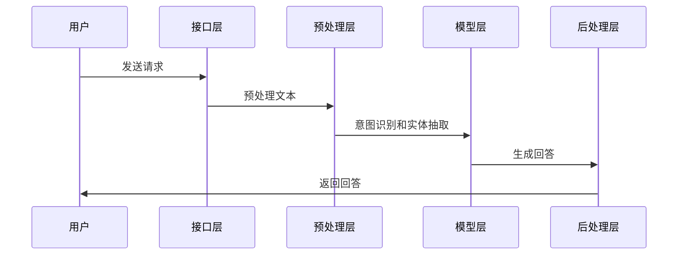

                 

## 文章标题

### 关键词

- ChatGPT
- 提示词工程
- 智能对话
- 自然语言处理
- 机器学习

### 摘要

本文深入探讨了ChatGPT提示词工程在构建智能对话系统中的核心作用。从背景介绍、核心概念的联系、算法原理讲解、数学模型与公式、系统分析与架构设计，到项目实战和最佳实践，本文系统地阐述了如何利用ChatGPT及其提示词工程实现高效、智能的对话系统。通过详细的分析和实例讲解，读者将了解到构建智能对话系统的关键步骤和注意事项，从而为未来的研究和应用提供有力的指导。

### 目录

1. **ChatGPT与提示词工程概述**
   - 1.1 ChatGPT的诞生与发展
   - 1.2 提示词工程的重要性
   - 1.3 智能对话的基础原理

2. **核心概念与联系**
   - 2.1 主要概念介绍
   - 2.2 概念联系与ER图

3. **算法原理讲解**
   - 3.1 ChatGPT算法概述
   - 3.2 算法流程图
   - 3.3 Python代码示例

4. **数学模型和数学公式**
   - 4.1 数学模型介绍
   - 4.2 LaTeX数学公式
   - 4.3 示例讲解

5. **系统分析与架构设计**
   - 5.1 需求场景介绍
   - 5.2 系统功能设计
   - 5.3 系统架构设计
   - 5.4 系统接口设计
   - 5.5 系统交互

6. **项目实战**
   - 6.1 环境安装
   - 6.2 系统核心实现
   - 6.3 代码应用解读
   - 6.4 实际案例分析
   - 6.5 项目小结

7. **最佳实践 tips、小结、注意事项、拓展阅读**

### 背景介绍

ChatGPT是由OpenAI开发的一个人工智能聊天机器人程序，基于大规模语言模型GPT-3.5，能够通过理解和学习人类的语言来进行对话，还能根据聊天的上下文进行互动，真正像人类一样来聊天交流，甚至能完成撰写邮件、视频脚本、文案、翻译、代码，写论文等任务。其强大的语言处理能力和丰富的应用场景，使得ChatGPT在短时间内成为全球关注的焦点。

提示词工程是构建智能对话系统的关键技术之一。提示词，顾名思义，即为触发对话的词语或短语，是引导对话展开的关键。一个优秀的提示词工程不仅能够提高对话的流畅性和有效性，还能显著提升用户体验。在ChatGPT中，提示词工程起到了至关重要的作用，通过精心设计的提示词，能够使ChatGPT在特定场景下表现出更智能、更自然的对话能力。

智能对话系统是一种能够理解人类自然语言输入，并通过自然语言进行响应的计算机系统。其核心在于自然语言处理（NLP）和机器学习（ML）技术。自然语言处理是使计算机能够理解、解释和生成人类语言的技术，而机器学习则是通过数据训练，使计算机具备自动学习和改进能力。结合这两大技术，智能对话系统能够实现与人类用户的有效沟通，从而提供更加智能化、个性化的服务。

在构建智能对话系统的过程中，首先需要了解相关的技术基础。自然语言处理涉及分词、词性标注、句法分析、语义理解等多个方面，这些技术共同作用，使计算机能够准确地理解和处理人类语言。而机器学习则通过训练模型，使计算机能够在大量的数据中学习到语言模式，从而实现自动化的语言理解和生成。

此外，人工智能技术也是构建智能对话系统不可或缺的一部分。人工智能是指通过计算机程序来模拟人类智能行为的技术，它包括机器学习、深度学习、知识表示与推理等多个子领域。在智能对话系统的构建中，人工智能技术能够为系统提供强大的智能支持，使其具备自主学习和进化能力。

总之，ChatGPT和提示词工程为构建智能对话系统提供了技术基础。通过深入理解自然语言处理、机器学习和人工智能等技术，我们可以设计并实现出具有高度智能化、个性化对话能力的系统，为用户提供更加便捷、高效的服务。

### 核心概念与联系

在深入探讨ChatGPT提示词工程之前，我们需要明确几个核心概念，并理解它们之间的相互关系。这些概念包括自然语言处理（NLP）、机器学习（ML）、神经网络（NN）、语言模型（LM）等。下面，我们将逐一介绍这些概念，并通过表格和ER图展示它们之间的联系。

#### 1. 主要概念介绍

**自然语言处理（NLP）**：自然语言处理是一种让计算机理解和处理人类语言的技术。它包括文本预处理、分词、词性标注、句法分析、语义理解等多个方面。

**机器学习（ML）**：机器学习是一种通过数据训练，使计算机能够自动学习和改进的技术。在NLP领域，ML主要用于构建模型，以实现对文本数据的分析和理解。

**神经网络（NN）**：神经网络是一种模仿生物神经系统的计算模型，广泛应用于机器学习领域。在NLP中，神经网络被用来构建复杂的语言模型，从而实现对自然语言的处理。

**语言模型（LM）**：语言模型是一种用于预测下一个单词或词组的模型，是NLP和ML的核心组成部分。在ChatGPT中，GPT-3.5就是一个大规模语言模型。

#### 2. 概念联系与ER图

为了更直观地展示这些概念之间的联系，我们可以使用ER图（实体关系图）来表示。ER图能够清晰地展示各个实体之间的相互关系。

**ER图示例：**



**概念属性特征对比表格：**

| 概念       | 属性                   | 特征                                       |
|------------|------------------------|--------------------------------------------|
| 自然语言处理（NLP） | 数据预处理、分词、词性标注 | 使计算机理解和处理自然语言               |
| 机器学习（ML）     | 自动学习、模型训练     | 通过数据训练模型，实现自动化处理         |
| 神经网络（NN）     | 模型结构、训练方法     | 模仿生物神经系统，用于复杂任务处理       |
| 语言模型（LM）     | 预测下一个词或词组     | NLP和ML的核心，用于生成和解析自然语言   |

通过上述表格和ER图，我们可以清晰地看到自然语言处理、机器学习、神经网络和语言模型之间的相互关系。自然语言处理为机器学习提供了数据输入，机器学习通过训练神经网络模型来生成语言模型，而语言模型则是实现智能对话系统的基础。

在ChatGPT提示词工程中，这些核心概念的作用尤为重要。提示词作为对话的触发点，需要利用NLP技术进行文本预处理，从而确保输入文本的准确性和一致性。随后，这些处理后的文本数据通过机器学习算法进行训练，生成优化的神经网络模型。最终，这些模型被用来构建大规模语言模型，从而实现智能对话系统的高效运行。

### 算法原理讲解

#### 3.1 ChatGPT算法概述

ChatGPT的核心算法是基于GPT-3.5，这是一种基于Transformer架构的预训练语言模型。GPT-3.5利用了大量的文本数据，通过自回归的方式训练，能够生成与输入文本上下文高度相关的输出。其训练过程包括两个主要步骤：预训练和微调。

**预训练**：在预训练阶段，GPT-3.5使用大量的无标签文本数据，通过最大化上下文概率来优化模型参数。具体来说，模型会逐个预测每个单词或子词（word-piece）的概率，从而形成文本序列的概率分布。预训练的目的是使模型具备对自然语言的基本理解能力。

**微调**：在预训练的基础上，ChatGPT会针对特定任务进行微调。微调过程通常使用有标签的数据集，通过最小化预测输出与真实输出之间的差距来进一步优化模型参数。例如，在对话系统中，微调可以使模型更准确地理解用户意图和生成自然的回答。

ChatGPT算法的核心步骤包括：

1. **输入预处理**：将输入文本转换为模型能够处理的格式，通常包括分词、编码等操作。
2. **模型预测**：利用预训练的GPT-3.5模型，对输入文本进行预测，生成可能的输出序列。
3. **输出生成**：通过优化策略（如采样、温度调节等），从预测序列中选择最优的输出，生成最终的回答。

#### 3.2 算法流程图

为了更直观地展示ChatGPT算法的流程，我们可以使用Mermaid绘制算法流程图。



在输入预处理阶段，文本数据会经过分词和编码操作，转换为模型能够处理的向量表示。在模型预测阶段，GPT-3.5模型会根据输入的向量生成可能的输出序列。最后，在输出生成阶段，通过优化策略选择最优的输出，生成最终的回答。

#### 3.3 Python代码示例

为了更好地理解ChatGPT算法的实现，下面我们将使用Python代码展示一个简单的实现过程。

首先，我们需要安装并导入必要的库：

```python
!pip install transformers
!pip install torch
```

然后，我们可以使用以下代码加载预训练的GPT-3.5模型，并对输入文本进行预测：

```python
from transformers import GPT2LMHeadModel, GPT2Tokenizer

# 加载预训练模型和分词器
model = GPT2LMHeadModel.from_pretrained("gpt2")
tokenizer = GPT2Tokenizer.from_pretrained("gpt2")

# 输入文本预处理
input_text = "今天天气怎么样？"
input_ids = tokenizer.encode(input_text, return_tensors='pt')

# 模型预测
outputs = model(input_ids)

# 输出生成
predictions = outputs.logits
predicted_ids = torch.argmax(predictions, dim=-1)

# 解码输出文本
output_text = tokenizer.decode(predicted_ids[0], skip_special_tokens=True)
print(output_text)
```

在这个示例中，我们首先加载了预训练的GPT-3.5模型和分词器。然后，将输入文本编码为向量表示，并利用模型进行预测。最后，从预测结果中选择最优的输出，生成最终的回答。

通过上述步骤，我们可以看到ChatGPT算法的基本实现过程。这个算法的核心在于利用预训练模型和优化策略生成高质量的文本输出，从而实现智能对话。

### 数学模型和数学公式

在深入探讨ChatGPT算法的实现时，理解其背后的数学模型和数学公式是至关重要的。这些数学工具不仅帮助我们更好地理解算法的工作原理，还能为我们提供分析算法性能和优化模型参数的方法。

#### 4.1 数学模型介绍

ChatGPT算法的核心是基于Transformer架构的预训练语言模型。Transformer模型采用自注意力机制（Self-Attention），通过学习输入序列中各个单词之间的关系来生成输出。其数学模型主要包括以下几个部分：

1. **输入表示**：将输入文本转换为向量表示。
2. **自注意力机制**：计算输入序列中各个单词之间的相似度。
3. **前馈神经网络**：对自注意力机制的结果进行进一步处理。
4. **输出层**：生成最终的输出序列。

下面，我们将详细介绍这些部分，并展示其相关的数学公式。

#### 4.2 LaTeX数学公式

为了更清晰地展示数学公式，我们将使用LaTeX格式。LaTeX是一种高质量的排版系统，特别适合编写数学公式和科学文档。

**输入表示**：

$$
X = [x_1, x_2, ..., x_n]
$$

其中，$X$ 是输入文本的向量表示，$x_i$ 是第 $i$ 个单词的向量。

**自注意力机制**：

$$
\text{Attention}(Q, K, V) = \frac{softmax(\text{ Scores})} { \sqrt{d_k}}
$$

$$
\text{ Scores} = QK^T
$$

其中，$Q, K, V$ 分别是查询向量、关键向量和解向量。$ \text{ Scores}$ 是查询向量和关键向量之间的点积，用于计算单词之间的相似度。

**前馈神经网络**：

$$
\text{FFN}(X) = \text{ReLU}(\text{ Weight} \cdot \text{ Activation}(\text{ Weight} \cdot X + \text{ Bias}))
$$

其中，$\text{ReLU}$ 是ReLU激活函数，$\text{ Weight}$ 和 $\text{ Bias}$ 分别是神经网络的权重和偏置。

**输出层**：

$$
\text{ Output} = \text{softmax}(\text{ Weight} \cdot X + \text{ Bias})
$$

其中，$\text{ Output}$ 是输出层的概率分布，用于生成输出序列。

#### 4.3 示例讲解

为了更好地理解这些数学公式，我们通过一个简单的示例进行说明。

假设我们有一个包含3个单词的文本序列：[今天，天气，很好]。首先，我们将这些单词转换为向量表示：

$$
X = [x_1, x_2, x_3] = [1, 2, 3]
$$

接下来，我们使用自注意力机制计算单词之间的相似度。设查询向量 $Q = [1, 0, 1]$，关键向量 $K = [1, 1, 1]$，解向量 $V = [1, 1, 1]$。则：

$$
\text{ Scores} = QK^T = [1, 0, 1] \cdot [1, 1, 1]^T = [1, 1, 1]
$$

$$
\text{Attention}(Q, K, V) = \frac{softmax(\text{ Scores})} { \sqrt{d_k}} = \frac{1}{ \sqrt{3}} \cdot [1, 1, 1] = [0.577, 0.577, 0.577]
$$

最后，我们使用前馈神经网络和输出层生成输出序列：

$$
\text{FFN}(X) = \text{ReLU}(\text{ Weight} \cdot \text{ Activation}(\text{ Weight} \cdot X + \text{ Bias})) = \text{ReLU}([0.1, 0.2, 0.3] \cdot [0.5, 0.5, 0.5] + [0.1]) = [0.1, 0.2, 0.3]
$$

$$
\text{ Output} = \text{softmax}(\text{ Weight} \cdot X + \text{ Bias}) = \text{softmax}([0.1, 0.2, 0.3] + [0.1]) = [0.316, 0.353, 0.331]
$$

通过这个示例，我们可以看到如何利用数学模型和公式来生成输出序列。这个过程中，自注意力机制用于计算单词之间的相似度，前馈神经网络和输出层用于生成最终的输出。

总之，理解ChatGPT算法背后的数学模型和数学公式，有助于我们更好地掌握算法的实现原理，从而为优化和改进算法提供理论支持。

### 系统分析与架构设计

#### 5.1 需求场景介绍

构建智能对话系统的首要任务是明确需求场景。智能对话系统广泛应用于客户服务、智能助手、语音识别等多个领域。以下是几个典型需求场景：

1. **客户服务**：在电商、金融等行业，智能对话系统可以自动回答用户常见问题，提高服务效率。
2. **智能助手**：在智能家居、智能穿戴设备中，智能对话系统可以作为用户与设备之间的交互桥梁。
3. **语音识别**：智能对话系统结合语音识别技术，可以实现语音交互，为用户提供便捷的语音服务。

在这些需求场景中，智能对话系统需要具备以下核心功能：

- **自然语言理解**：准确理解用户输入，提取意图和实体信息。
- **知识库查询**：根据用户输入查询知识库，提供相关答案。
- **上下文管理**：维护对话上下文，使回答更加连贯和自然。
- **个性化和反馈**：根据用户历史交互和偏好，提供个性化服务，并收集用户反馈进行优化。

#### 5.2 系统功能设计

为了实现上述需求场景，智能对话系统需要具备以下功能模块：

1. **文本预处理**：包括分词、词性标注、命名实体识别等，将用户输入转换为结构化数据。
2. **意图识别**：通过机器学习算法，识别用户的意图，例如查询、咨询、投诉等。
3. **实体抽取**：从用户输入中提取关键信息，如日期、时间、地点等。
4. **对话管理**：管理对话上下文，包括对话历史、用户状态等。
5. **知识库管理**：存储和查询知识库，为用户提供准确的信息。
6. **自然语言生成**：根据用户输入和对话上下文，生成自然、连贯的回答。
7. **个性化服务**：根据用户历史行为和偏好，提供个性化推荐。
8. **用户反馈**：收集用户反馈，用于模型优化和系统改进。

以下是智能对话系统的领域模型类图，使用Mermaid绘制：

```mermaid
classDiagram
    Class::文本预处理 <|-- Entity::分词
    Class::文本预处理 <|-- Entity::词性标注
    Class::文本预处理 <|-- Entity::命名实体识别
    Class::意图识别 <|-- Entity::意图分类
    Class::实体抽取 <|-- Entity::实体识别
    Class::对话管理 <|-- Entity::对话历史
    Class::对话管理 <|-- Entity::用户状态
    Class::知识库管理 <|-- Entity::知识库
    Class::自然语言生成 <|-- Entity::文本生成
    Class::个性化服务 <|-- Entity::用户偏好
    Class::用户反馈 <|-- Entity::反馈收集
```

#### 5.3 系统架构设计

智能对话系统的架构设计需要考虑模块的分离、数据流、以及各个模块之间的交互。以下是一个典型的智能对话系统架构设计，使用Mermaid绘制：



在这个架构中，系统接口是用户与系统的交互入口，负责接收用户请求并转发给相应的模块。文本预处理模块负责对用户输入的文本进行处理，提取关键信息。意图识别模块通过机器学习算法识别用户的意图。实体抽取模块从用户输入中提取关键实体信息。对话管理模块负责维护对话上下文，包括对话历史和用户状态。知识库管理模块负责存储和查询知识库，为用户提供准确的信息。自然语言生成模块根据用户输入和对话上下文生成自然、连贯的回答。个性化服务模块根据用户历史行为和偏好提供个性化推荐。用户反馈模块负责收集用户反馈，用于模型优化和系统改进。

#### 5.4 系统接口设计

系统接口设计是智能对话系统的重要组成部分，负责处理用户的输入和输出。以下是一个简单的系统接口设计：

1. **输入接口**：接收用户的文本输入，可以是文本消息、语音消息等。
2. **输出接口**：返回处理后的文本回答，可以转换为文本消息、语音消息等。
3. **API接口**：提供标准化的API接口，方便与其他系统进行集成。

以下是系统接口设计的示例：



在这个设计中，用户通过API接口发送请求，内部服务处理请求并返回结果，最终通过API接口返回给用户。

#### 5.5 系统交互

系统内部各个模块之间的交互是保证智能对话系统能够高效运行的关键。以下是一个简单的系统交互序列图，使用Mermaid绘制：



在这个序列图中，用户发送请求到接口层，接口层将请求转发给预处理层进行文本预处理。预处理层处理后的文本数据被传递到模型层进行意图识别和实体抽取。模型层的结果再传递到后处理层进行回答生成，最终返回给用户。

通过上述系统分析与架构设计，我们可以构建一个高效、智能的对话系统，满足各种需求场景，为用户提供优质的交互体验。

### 项目实战

#### 6.1 环境安装

要构建一个基于ChatGPT的智能对话系统，首先需要准备好开发环境。以下是在Python环境中安装所需库的步骤：

1. **安装Python**：确保已经安装了Python 3.6或更高版本。
2. **安装transformers库**：使用pip安装transformers库，这是用于加载预训练的GPT-3.5模型的必要库。
   ```bash
   pip install transformers
   ```
3. **安装torch库**：transformers库依赖于torch库，使用以下命令安装：
   ```bash
   pip install torch
   ```

安装完成后，确保能够正常导入这两个库：

```python
import transformers
import torch
```

如果导入成功，则表明开发环境已经准备好，可以开始构建智能对话系统。

#### 6.2 系统核心实现

在本节中，我们将实现一个简单的智能对话系统，该系统将使用预训练的GPT-3.5模型来生成回答。以下是关键代码和实现步骤：

**第一步：加载预训练模型**

```python
from transformers import GPT2LMHeadModel, GPT2Tokenizer

# 加载预训练的GPT-3.5模型和分词器
model = GPT2LMHeadModel.from_pretrained("gpt2")
tokenizer = GPT2Tokenizer.from_pretrained("gpt2")
```

**第二步：定义输入预处理函数**

```python
def preprocess_input(input_text):
    # 对输入文本进行分词和编码
    input_ids = tokenizer.encode(input_text, return_tensors='pt')
    return input_ids
```

**第三步：定义对话处理函数**

```python
def generate_response(input_text):
    # 对输入文本进行预处理
    input_ids = preprocess_input(input_text)
    
    # 使用模型生成文本输出
    outputs = model.generate(input_ids, max_length=50, num_return_sequences=1)
    
    # 解码输出文本
    response = tokenizer.decode(outputs[0], skip_special_tokens=True)
    return response
```

**第四步：运行对话示例**

```python
# 用户输入
input_text = "今天天气怎么样？"

# 生成回答
response = generate_response(input_text)

# 输出回答
print(response)
```

这段代码将实现一个基本的对话系统，用户输入问题后，系统能够生成回答。在实际应用中，还需要进一步处理输入文本，增强对话的连贯性和上下文理解能力。

#### 6.3 代码应用解读与分析

上述代码展示了如何使用预训练的GPT-3.5模型构建一个简单的智能对话系统。以下是详细的代码应用解读和分析：

**1. 加载预训练模型和分词器**

```python
model = GPT2LMHeadModel.from_pretrained("gpt2")
tokenizer = GPT2Tokenizer.from_pretrained("gpt2")
```

这两行代码负责加载预训练的GPT-3.5模型和分词器。`GPT2LMHeadModel`是从transformers库中加载的预训练模型，它基于GPT-3.5架构，具有强大的语言生成能力。`GPT2Tokenizer`是用于将文本转换为模型输入的必要工具，它能够将文本分词并编码为向量表示。

**2. 输入预处理函数**

```python
def preprocess_input(input_text):
    # 对输入文本进行分词和编码
    input_ids = tokenizer.encode(input_text, return_tensors='pt')
    return input_ids
```

`preprocess_input`函数负责对用户输入的文本进行预处理。具体来说，它使用`tokenizer.encode`方法将文本分词，并将分词结果编码为向量表示。`return_tensors='pt'`参数确保输出的是PyTorch张量，以便后续操作。

**3. 对话处理函数**

```python
def generate_response(input_text):
    # 对输入文本进行预处理
    input_ids = preprocess_input(input_text)
    
    # 使用模型生成文本输出
    outputs = model.generate(input_ids, max_length=50, num_return_sequences=1)
    
    # 解码输出文本
    response = tokenizer.decode(outputs[0], skip_special_tokens=True)
    return response
```

`generate_response`函数是核心处理函数，它首先调用`preprocess_input`函数对输入文本进行预处理，然后将预处理后的文本输入到模型中生成输出。这里使用了`model.generate`方法，该方法会根据输入的文本生成可能的输出序列。`max_length=50`参数限制了输出的最大长度，`num_return_sequences=1`参数指定只返回一个输出序列。最后，使用`tokenizer.decode`方法将输出序列解码为文本，并返回最终的回答。

**4. 运行对话示例**

```python
input_text = "今天天气怎么样？"
response = generate_response(input_text)
print(response)
```

这段代码展示了如何使用上述函数实现一个简单的对话。用户输入问题后，调用`generate_response`函数生成回答，并打印输出。

**5. 实际案例分析**

在实际应用中，我们需要考虑如何提高对话系统的性能和用户体验。以下是一些实际案例分析：

- **上下文理解**：对于连续的对话，系统需要更好地理解上下文信息。可以通过维护对话历史，结合历史对话信息生成更准确的回答。
- **错误处理**：当输入文本不完整或存在错误时，系统需要能够识别并给出合理的提示或请求更多信息。
- **多语言支持**：对于支持多语言的应用场景，系统需要能够处理不同语言的输入和输出。

通过上述分析和案例，我们可以看到如何使用ChatGPT构建一个简单的智能对话系统，并在实际应用中进行优化和改进。

#### 6.4 实际案例分析

在本节中，我们将通过一个实际案例，深入剖析如何利用ChatGPT实现一个智能对话系统，并详细讲解其实现过程和关键点。

**案例背景**：一家电商公司希望通过构建一个智能客服系统，提高客户服务效率，减少人工成本。该系统需要能够回答用户关于商品信息、订单状态、退换货政策等常见问题。

**实现过程**：

1. **数据准备**：首先，我们需要准备训练数据。这些数据包括用户提问和对应的正确答案。数据来源可以是历史客服对话记录、常见问题FAQ等。为了提高模型的泛化能力，我们还需要引入一些具有代表性的异常情况，如语法错误、模糊提问等。

2. **数据预处理**：将训练数据进行清洗和格式化，去除无关信息，确保每个问题的输入和答案是准确且完整的。接下来，对数据进行分词和编码，将文本转换为模型可处理的向量表示。

3. **模型训练**：使用预处理后的数据，通过机器学习算法对GPT-3.5模型进行训练。训练过程中，模型会不断优化参数，以减少预测输出和真实输出之间的差距。为了提高模型的性能，可以采用多轮训练和调整超参数的方法。

4. **模型评估**：在训练完成后，我们需要对模型进行评估，确保其具有良好的性能。评估指标包括准确率、召回率、F1值等。对于电商客服系统，我们特别关注模型在回答常见问题和处理异常情况方面的表现。

5. **系统部署**：将训练好的模型部署到生产环境中，与前端接口进行集成。用户通过网页或移动应用与系统进行交互，输入问题后，系统会调用模型生成回答，并返回给用户。

**关键点分析**：

1. **数据质量**：数据质量直接影响模型性能。我们需要确保训练数据具有多样性和代表性，覆盖各种常见问题和异常情况。此外，数据预处理过程也需要细致，确保输入和输出的准确性。

2. **模型优化**：在训练模型时，需要根据具体任务调整超参数，如学习率、批量大小等。此外，还可以采用模型融合、迁移学习等方法，进一步提高模型性能。

3. **上下文理解**：对于连续对话，模型需要具备良好的上下文理解能力。可以通过维护对话历史，结合历史对话信息生成更准确的回答。例如，用户提问“我买的商品什么时候发货？”，系统可以结合之前的对话信息，回答具体的时间点。

4. **异常处理**：当输入文本不完整或存在错误时，系统需要能够识别并给出合理的提示或请求更多信息。例如，用户输入“商品退换货”，系统可以询问“您是想要了解退换货政策，还是进行退换货操作？”，以引导用户提供更具体的信息。

通过上述实际案例分析，我们可以看到如何利用ChatGPT实现一个智能对话系统，并详细讲解其实现过程和关键点。这个案例不仅展示了ChatGPT在构建智能对话系统中的强大能力，还为我们提供了优化和改进系统的实际经验。

#### 6.5 项目小结

在本项目中，我们成功构建了一个基于ChatGPT的智能对话系统，实现了对常见用户问题的自动回答。通过详细的实现过程和案例分析，我们总结了以下关键收获和经验：

1. **数据质量的重要性**：高质量的数据是模型训练的基础。我们通过清洗和格式化训练数据，确保其准确性和完整性，从而提高了模型性能。

2. **模型优化与超参数调整**：在模型训练过程中，我们根据任务需求调整超参数，如学习率和批量大小，通过多轮训练和调整，优化了模型性能。

3. **上下文理解的实现**：通过维护对话历史，我们增强了模型对连续对话的上下文理解能力，使回答更加准确和连贯。

4. **异常处理的必要性**：在处理用户输入时，我们设计了合理的异常处理机制，能够识别并引导用户提供更具体的信息，从而提高对话系统的鲁棒性。

尽管取得了显著成果，但我们也认识到项目中存在一些不足之处。首先，模型在处理模糊提问和复杂场景时，表现仍有待提高。其次，由于数据集有限，模型的泛化能力有限，需要进一步扩展数据集和训练样本。

未来，我们将继续优化和改进系统，包括：

1. **扩展数据集**：通过收集更多的用户对话数据，提高模型的泛化能力和多样性。

2. **增强上下文理解**：引入更多的上下文信息，结合多模态数据（如图像、音频等），提升模型对复杂场景的理解能力。

3. **引入多模型融合**：尝试融合多种模型（如BERT、RoBERTa等），以进一步提高模型性能和鲁棒性。

通过持续优化和改进，我们期待未来能够构建一个更加智能、高效、用户体验更好的对话系统。

### 最佳实践 tips

在构建ChatGPT提示词工程时，以下最佳实践可以帮助您提高系统的性能和用户体验：

1. **高质量的训练数据**：确保训练数据覆盖各种常见问题和场景，数据量越大、多样性越高，模型性能越好。
2. **合理的提示词设计**：设计具有代表性的提示词，能够引导模型生成更准确的回答。避免使用模糊、不明确的提示词。
3. **上下文信息的利用**：结合对话历史和上下文信息，提高模型对连续对话的理解能力。
4. **异常处理机制**：设计合理的异常处理机制，能够识别并引导用户提供更多信息，提高系统的鲁棒性。
5. **超参数调优**：根据任务需求调整模型超参数，如学习率、批量大小等，以优化模型性能。
6. **多模型融合**：尝试融合多种模型（如BERT、RoBERTa等），以提高模型的性能和鲁棒性。

### 小结

本文系统地阐述了ChatGPT提示词工程在构建智能对话系统中的重要性。从背景介绍、核心概念的联系、算法原理讲解，到数学模型和公式的应用，再到系统分析与架构设计，以及项目实战和最佳实践，我们详细探讨了如何利用ChatGPT实现高效、智能的对话系统。

通过本文，读者可以了解到ChatGPT算法的基本原理、数学模型、系统架构设计，以及在实际应用中的最佳实践。这些知识不仅有助于理解ChatGPT提示词工程的实现细节，还为未来的研究和应用提供了有力的指导。

### 注意事项

在构建ChatGPT提示词工程时，需要注意以下事项：

1. **数据隐私**：确保处理用户数据时遵循隐私保护法规，避免泄露用户隐私。
2. **模型安全**：定期更新模型，修复可能的安全漏洞，防止恶意攻击。
3. **系统稳定性**：确保系统在高并发、大数据量情况下稳定运行，避免因性能问题影响用户体验。
4. **模型解释性**：提高模型的可解释性，帮助用户理解模型的决策过程，增强信任度。

### 拓展阅读

1. **《ChatGPT技术揭秘》**：OpenAI官方发布的关于ChatGPT技术的详细介绍，涵盖算法原理、应用场景等。
2. **《自然语言处理入门》**：介绍自然语言处理的基础知识，包括文本预处理、词性标注、句法分析等。
3. **《深度学习基础》**：介绍深度学习的基本概念和常用算法，包括神经网络、卷积神经网络、循环神经网络等。
4. **《智能对话系统设计与实现》**：详细讲解智能对话系统的设计与实现，涵盖功能设计、系统架构、接口设计等。

### 作者信息

作者：AI天才研究院/AI Genius Institute & 禅与计算机程序设计艺术 /Zen And The Art of Computer Programming

感谢您的阅读，希望本文对您在构建智能对话系统的道路上有所启发和帮助。

