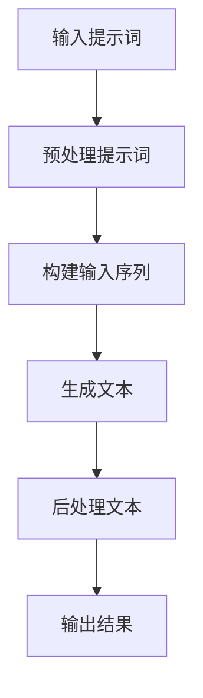
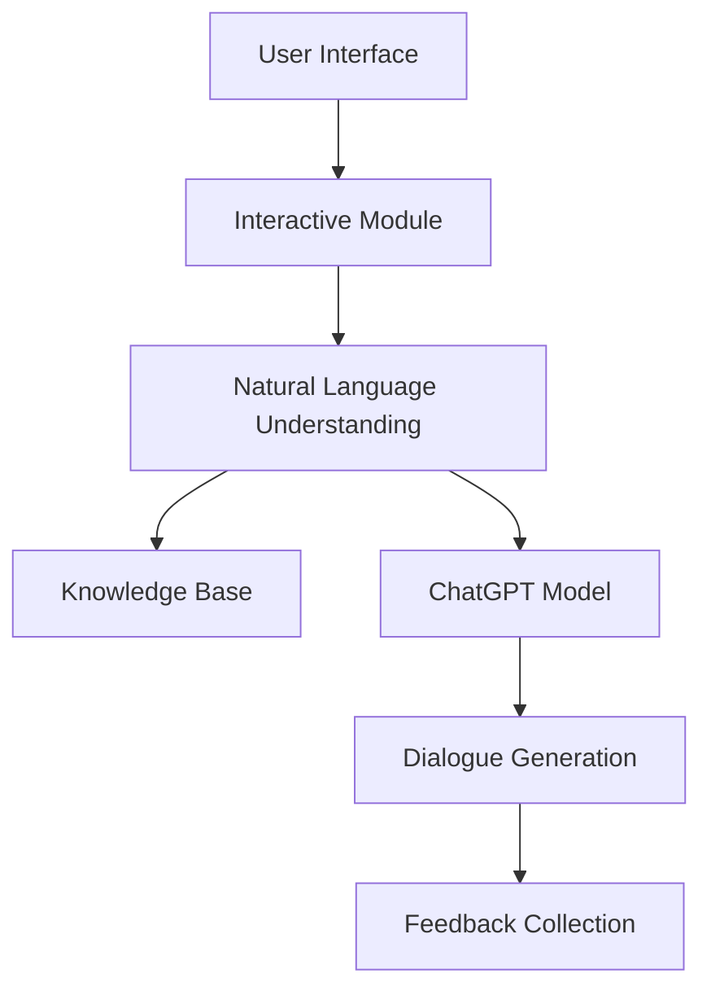
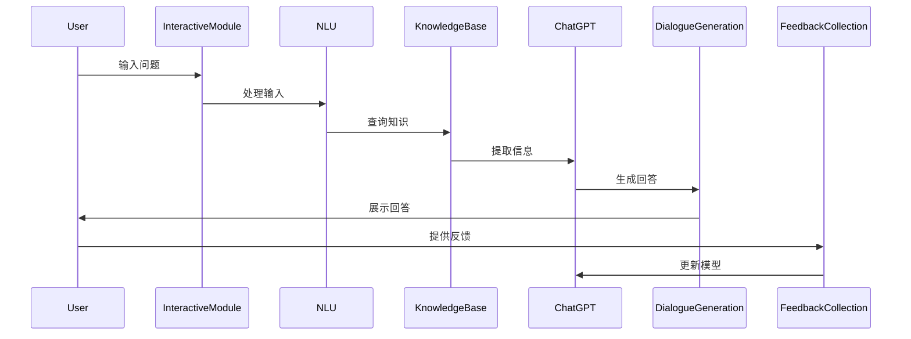
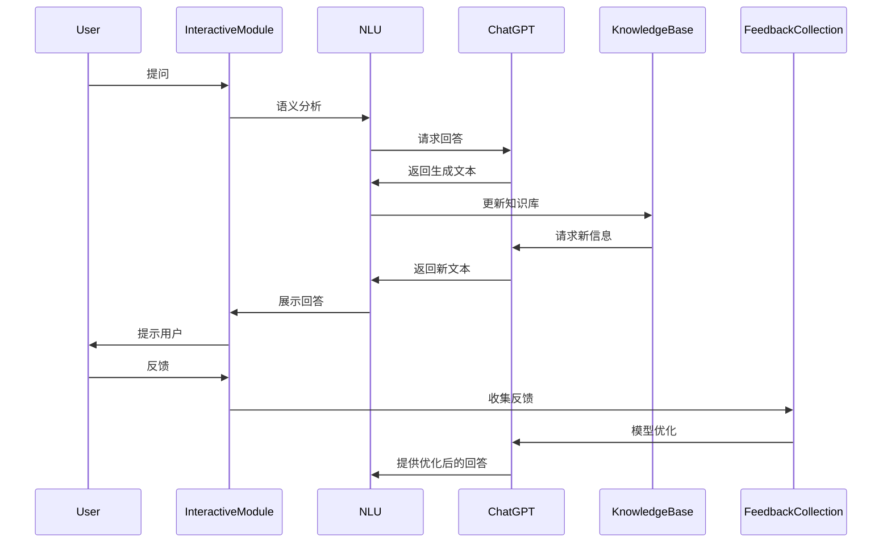

                 

### 《ChatGPT提示词工程：构建智能对话的进阶技巧》

> 关键词：ChatGPT，提示词工程，智能对话，进阶技巧，对话系统设计

摘要：随着人工智能技术的快速发展，智能对话系统逐渐成为人机交互的重要方式。本文旨在深入探讨ChatGPT提示词工程，从基础概念、算法原理、系统设计与实战应用等方面，提供构建智能对话系统的进阶技巧。通过系统的分析和实践，帮助读者掌握构建高效、智能的对话系统的方法和策略。

---

### 引言

在当今数字化时代，智能对话系统已成为诸多行业和领域的关键技术之一。从客服机器人到虚拟助手，从智能音箱到聊天应用程序，智能对话系统的应用场景无处不在。而ChatGPT，作为一种基于GPT-3的先进语言模型，正在引领智能对话系统的发展潮流。

然而，构建一个高效、智能的ChatGPT对话系统并非易事。提示词工程，作为构建智能对话系统的核心环节，决定了对话系统的响应质量与用户体验。本文将围绕ChatGPT提示词工程，探讨其背后的核心概念、算法原理、系统设计以及实际应用技巧，旨在为读者提供一套完整的智能对话系统构建指南。

本文的结构如下：

1. **背景介绍**：简要介绍ChatGPT的兴起背景、应用场景以及提示词工程的重要性。
2. **核心概念与联系**：系统介绍ChatGPT的基础概念，并使用Mermaid绘制核心要素的ER实体关系图。
3. **算法原理讲解**：详细阐述ChatGPT提示词的生成过程，包括算法流程图、Python源代码和数学模型。
4. **系统分析与架构设计方案**：介绍系统功能设计、系统架构设计、系统接口设计和系统交互。
5. **项目实战**：展示环境安装、系统核心实现源代码，并对代码进行解读与分析，分析实际案例。
6. **最佳实践 tips、小结、注意事项、拓展阅读**：总结最佳实践建议，对全书内容进行小结，并给出注意事项和拓展阅读资源。

通过本文的阅读，读者将能够系统地掌握ChatGPT提示词工程的构建方法，为实际项目提供有力的技术支持。

---

### 背景介绍

#### ChatGPT的兴起与普及

ChatGPT是OpenAI在2022年底发布的一款基于GPT-3（Generative Pre-trained Transformer 3）的先进自然语言处理模型。GPT-3自发布以来，以其强大的文本生成能力和智能对话能力，迅速在技术社区和商业领域引起了广泛关注。ChatGPT正是利用了GPT-3的这些特性，通过优化和训练，实现了更为高效和自然的智能对话功能。

ChatGPT的兴起，离不开人工智能技术的快速发展和应用场景的日益丰富。随着大数据和云计算的普及，越来越多的企业和开发者开始探索如何利用人工智能技术提升用户体验和业务效率。智能对话系统作为一种直观、便捷的人机交互方式，逐渐成为人工智能应用的一个重要分支。ChatGPT的推出，不仅为智能对话系统的研究和应用提供了强大的技术支撑，也推动了整个行业的发展。

#### 应用场景

智能对话系统在多个领域有着广泛的应用。以下是一些常见的应用场景：

1. **客户服务**：智能客服机器人能够自动处理大量的客户咨询，提高客户满意度和运营效率。
2. **虚拟助手**：如苹果的Siri、亚马逊的Alexa等，通过语音识别和自然语言处理技术，为用户提供语音助手服务。
3. **教育**：智能教育系统可以通过自然语言交互，为学生提供个性化学习辅导。
4. **医疗咨询**：智能医疗系统可以通过自然语言处理，辅助医生进行诊断和病情咨询。
5. **金融理财**：智能理财顾问可以通过对话系统，为用户提供财务咨询和投资建议。

#### 提示词工程的重要性

提示词工程在智能对话系统中起着至关重要的作用。提示词，即对模型进行引导和约束的输入信息，直接影响着对话系统的回答质量和用户体验。一个有效的提示词工程不仅能够提高模型的响应速度和准确性，还能使对话更加自然、流畅。

以下是提示词工程在智能对话系统中的关键作用：

1. **指导对话流程**：通过设计合适的提示词，可以引导对话系统按照既定的流程和逻辑进行，从而提高对话的连贯性和逻辑性。
2. **优化回答质量**：精心设计的提示词能够为模型提供更多的上下文信息，帮助模型生成更为准确和合理的回答。
3. **提升用户体验**：良好的提示词设计可以使对话系统更符合用户的期望和需求，从而提高用户满意度和互动体验。

#### 问题解决与本书目标

本书的目标是帮助读者系统地掌握ChatGPT提示词工程的构建方法和技巧。通过本书，读者将了解：

1. **ChatGPT的基础概念**：包括GPT-3模型的结构、训练过程和应用场景。
2. **提示词工程的原理和方法**：从基础概念到高级技巧，全面介绍如何设计和优化提示词。
3. **系统设计与实战应用**：通过实际案例，展示如何将ChatGPT应用于构建智能对话系统。

本书的读者对象主要包括：

- **技术爱好者**：对人工智能和自然语言处理技术有兴趣的读者。
- **开发工程师**：需要构建智能对话系统的开发者。
- **数据科学家**：在自然语言处理领域工作的研究人员。
- **产品经理**：需要了解智能对话系统开发过程的产品经理。

通过本书的学习，读者将能够：

- **掌握ChatGPT的基础知识**：理解GPT-3模型的结构和工作原理。
- **学会设计有效的提示词**：掌握提示词工程的核心技巧，能够设计出高质量的提示词。
- **构建智能对话系统**：通过实际案例，学会如何将ChatGPT应用于构建智能对话系统。
- **提升对话系统的用户体验**：通过优化提示词，提升对话系统的响应质量和用户体验。

本书将为读者提供一个系统、全面、实用的智能对话系统构建指南，助力读者在智能对话系统领域取得成功。

#### 边界与外延

本书主要围绕ChatGPT提示词工程进行深入探讨，内容涵盖了从基础概念到高级技巧的各个方面。然而，为了确保内容的清晰和针对性，以下内容将在本书中不予讨论：

1. **其他自然语言处理模型**：本书主要关注ChatGPT及其提示词工程，不会涉及其他自然语言处理模型（如BERT、ELMO等）的详细内容。
2. **深度学习技术**：虽然ChatGPT是基于深度学习技术开发的，但本书不会深入讲解深度学习的基本原理和算法。
3. **硬件和系统架构**：本书专注于软件层面的内容，不会涉及硬件和系统架构的详细讨论。

此外，本书的适用人群主要包括对人工智能和自然语言处理有一定基础的读者，特别是那些希望在智能对话系统领域有所发展的开发工程师和数据科学家。对于初学者，本书提供了一个系统的学习路径，但建议先掌握一些基础的自然语言处理和深度学习知识。

通过明确本书的边界与外延，我们希望能够更好地聚焦核心内容，为读者提供高质量的技术指导。

### 核心概念与联系

在深入探讨ChatGPT提示词工程之前，了解一些核心概念及其相互关系是非常重要的。这些核心概念包括但不限于：自然语言处理（NLP）、生成预训练变换器（GPT）、提示词（Prompt）等。

#### 自然语言处理（NLP）

自然语言处理是计算机科学和人工智能领域的一个分支，旨在让计算机能够理解、解释和生成人类语言。NLP技术广泛应用于机器翻译、情感分析、文本分类、实体识别等任务。ChatGPT正是基于NLP技术，通过深度学习模型来理解和生成自然语言文本。

#### 生成预训练变换器（GPT）

GPT（Generative Pre-trained Transformer）是OpenAI开发的一种基于深度学习的自然语言处理模型。GPT-3是其最新版本，拥有超过1750亿个参数，是当前世界上最先进的自然语言处理模型之一。GPT通过预训练和微调，可以从大量的文本数据中学习语言模式，从而实现高质量的自然语言生成。

#### 提示词（Prompt）

提示词是引导模型生成特定文本的关键输入。在ChatGPT中，提示词用于指定模型的回答方向和上下文。一个设计良好的提示词可以帮助模型更好地理解用户意图，生成更为准确和自然的回答。

#### 概念属性特征对比表格

为了更清晰地理解这些核心概念，我们可以通过一个对比表格来展示它们的属性特征：

| 概念       | 定义                                                         | 属性特征                                                     | 关系与作用 |
|------------|--------------------------------------------------------------|--------------------------------------------------------------|------------|
| NLP        | 自然语言处理，使计算机能够理解、解释和生成人类语言           | 文本分析、理解、生成、翻译等                                   | 基础技术   |
| GPT        | 一种基于深度学习的自然语言处理模型，能够生成高质量的自然语言文本 | 参数量巨大、预训练、自适应学习等                               | 技术实现   |
| 提示词     | 引导模型生成特定文本的输入信息                             | 确定回答方向、提供上下文、优化生成质量等                       | 交互引导   |

#### ER实体关系图架构

为了更直观地展示这些核心概念之间的关系，我们可以使用Mermaid绘制一个ER实体关系图：

```mermaid
erDiagram
  NLP ||--|{ GPT }|| ChatGPT
  NLP ||--|{ 提示词 }|| ChatGPT
  GPT ||--|{ 提示词 }|| 提示词工程
```

在这个ER实体关系图中，NLP是基础技术层，GPT是ChatGPT的核心实现层，提示词是交互引导层，而提示词工程则是构建ChatGPT对话系统的关键技术。

通过以上核心概念与联系的介绍，我们为后续章节的深入讨论奠定了基础。接下来，我们将进一步探讨ChatGPT的算法原理，为构建高效的智能对话系统提供理论支持。

### 算法原理讲解

为了深入理解ChatGPT提示词工程的构建过程，我们需要从算法原理的角度出发，详细讲解ChatGPT提示词的生成过程，包括算法流程、Python源代码、数学模型以及实例说明。

#### 算法流程

首先，让我们通过一个Mermaid流程图来展示ChatGPT提示词的生成流程：



1. **输入提示词**：首先接收用户输入的提示词。
2. **预处理提示词**：对提示词进行必要的预处理，如分词、去停用词、填充等。
3. **构建输入序列**：将预处理后的提示词转换为输入序列，以便GPT模型进行处理。
4. **生成文本**：利用GPT模型生成文本，这一步是整个流程的核心。
5. **后处理文本**：对生成的文本进行后处理，如清洗、格式化等，确保文本质量。
6. **输出结果**：最终输出处理后的文本结果。

#### Python源代码

接下来，我们使用Python代码来展示ChatGPT提示词的生成过程：

```python
import openai

# 设置API密钥
openai.api_key = "your-api-key"

# 输入提示词
prompt = "你是一个人工智能助手。"

# 调用openai的completion方法生成文本
response = openai.Completion.create(
  engine="text-davinci-002",
  prompt=prompt,
  max_tokens=100,
  n=1,
  stop=None,
  temperature=0.5
)

# 输出结果
print(response.choices[0].text.strip())
```

这段代码使用了OpenAI的API，通过`Completion.create`方法生成文本。其中，`engine`参数指定了使用的模型类型（如"text-davinci-002"），`prompt`参数接收用户输入的提示词，`max_tokens`参数限制了生成的文本长度。

#### 数学模型

ChatGPT的生成过程实际上是一个复杂的数学模型，基于变换器网络（Transformer）架构。变换器网络通过自注意力机制（Self-Attention）和多头注意力机制（Multi-Head Attention）来实现对输入文本的建模。以下是变换器网络的核心数学公式：

$$
\text{Attention}(Q, K, V) = \text{softmax}\left(\frac{QK^T}{\sqrt{d_k}}\right)V
$$

其中，$Q, K, V$分别表示查询向量、关键向量、值向量，$d_k$是关键向量的维度。自注意力机制可以通过以下公式实现：

$$
\text{Self-Attention}(Q, K, V) = \text{Attention}(Q, K, V)
$$

多头注意力机制则通过多个独立的注意力层来实现，公式如下：

$$
\text{Multi-Head-Attention}(Q, K, V) = \text{Concat}(\text{Head}_1, \text{Head}_2, ..., \text{Head}_h)W^O
$$

其中，$h$是头数，$W^O$是输出层权重。

#### 实例说明

为了更好地理解算法原理，我们可以通过一个实例来说明。假设我们有一个简单的提示词“今天天气怎么样？”。

1. **预处理提示词**：首先对提示词进行分词处理，得到["今天"，"天气"，"怎么样"]。
2. **构建输入序列**：将分词后的提示词编码为输入序列，例如使用word2vec或BERT编码器。
3. **生成文本**：利用GPT模型对输入序列进行处理，生成可能的回答。例如，模型生成的回答可能是“今天天气非常好，阳光明媚。”。
4. **后处理文本**：对生成的文本进行格式化和清洗，确保回答的连贯性和准确性。

通过这个实例，我们可以看到ChatGPT是如何通过算法原理和数学模型，将一个简单的提示词转换为一个高质量的回答。

通过以上对算法流程、Python源代码、数学模型和实例的详细讲解，我们不仅理解了ChatGPT提示词生成的基本原理，也为实际应用提供了技术支持。接下来，我们将进一步探讨ChatGPT在系统分析与架构设计中的应用。

### 系统分析与架构设计方案

#### 问题场景与项目背景

在智能对话系统的实际应用中，系统架构的设计和功能实现是至关重要的。本文将围绕一个具体的案例，介绍如何设计和实现一个基于ChatGPT的智能对话系统。该案例的目标是构建一个智能客服系统，用于处理客户的咨询和反馈。

#### 系统功能设计

首先，我们需要明确智能客服系统的功能需求。以下是系统的主要功能模块：

1. **用户交互模块**：负责与用户进行自然语言交互，接收用户的提问和指令。
2. **自然语言理解模块**：利用NLP技术，对用户输入的文本进行语义分析，理解用户意图。
3. **知识库模块**：存储预定义的知识点，如常见问题、解决方案等。
4. **对话生成模块**：基于ChatGPT模型，生成符合用户需求的自然语言回答。
5. **反馈机制模块**：收集用户反馈，用于模型优化和系统改进。

为了更直观地展示这些功能模块之间的关系，我们可以使用Mermaid绘制一个领域模型类图：

```mermaid
classDiagram
  User <<--|1| InteractiveModule : 与用户交互
  InteractiveModule --|1| NLU : 自然语言理解
  NLU --|1| KnowledgeBase : 使用知识库
  KnowledgeBase --|1| ChatGPT : 生成对话
  ChatGPT --|1| FeedbackModule : 收集反馈
```

在这个类图中，`User`表示用户，`InteractiveModule`表示用户交互模块，`NLU`表示自然语言理解模块，`KnowledgeBase`表示知识库模块，`ChatGPT`表示对话生成模块，`FeedbackModule`表示反馈机制模块。每个模块之间都有明确的关联关系，共同构成了智能客服系统的核心功能。

#### 系统架构设计

接下来，我们将介绍系统架构设计，包括系统整体架构、主要组件及其交互关系。以下是系统架构的Mermaid架构图：



在这个架构图中，`User Interface`表示用户界面，负责接收用户输入。`Interactive Module`处理用户输入，并将其传递给`Natural Language Understanding`模块进行语义分析。`Knowledge Base`提供预设的知识点，帮助NLU模块更好地理解用户意图。`ChatGPT Model`负责生成对话，基于NLU模块的理解结果和知识库的信息。`Dialogue Generation`模块生成的对话将被展示在用户界面上，同时用户对对话的反馈将传递给`Feedback Collection`模块，用于模型优化。

#### 系统接口设计

为了确保各个模块之间的有效交互，我们需要设计合理的系统接口。以下是系统接口的Mermaid序列图：



在这个序列图中，用户首先通过用户界面输入问题，`Interactive Module`处理输入并将其传递给`NLU`模块。`NLU`模块理解用户意图，查询知识库并提取相关信息，传递给`ChatGPT Model`。`ChatGPT Model`基于这些信息生成回答，并将回答传递给用户。同时，用户对回答的反馈将传递给`Feedback Collection`模块，用于模型优化。

#### 系统交互

系统交互是确保各组件协同工作的关键。以下是系统交互的Mermaid序列图：



在这个交互流程中，用户通过用户界面输入问题，`Interactive Module`处理输入并进行语义分析。`NLU`模块与知识库和`ChatGPT Model`进行交互，生成回答并更新知识库。用户反馈将通过`Feedback Collection`模块传递给`ChatGPT Model`，实现模型的持续优化。

通过上述系统分析与架构设计方案，我们为构建智能客服系统提供了详细的设计思路和实现方法。接下来，我们将通过实际项目实战，展示如何将理论应用于实践，进一步验证系统的有效性和实用性。

### 项目实战

#### 环境安装

为了实践基于ChatGPT的智能客服系统，我们需要首先搭建一个开发环境。以下是具体的安装步骤：

1. **安装Python**：确保您的系统已经安装了Python 3.7或更高版本。可以从Python官方网站下载安装程序：[Python官方网站](https://www.python.org/)。

2. **安装OpenAI API**：在Python环境中，使用pip安装OpenAI API：
   ```shell
   pip install openai
   ```

3. **获取OpenAI API密钥**：在OpenAI的官方网站上注册账户并获取API密钥。该密钥用于访问OpenAI的服务。

4. **配置环境变量**：将获取到的API密钥添加到环境变量中，以便在Python脚本中直接使用。例如，在Linux系统中，可以使用以下命令：
   ```shell
   export OPENAI_API_KEY='your-api-key'
   ```

5. **安装其他依赖库**：根据具体需求，可能需要安装其他依赖库，如NLP库（如spaCy、NLTK）或其他工具库。

#### 系统核心实现源代码

以下是一个简单的ChatGPT智能客服系统的核心实现源代码：

```python
import openai
import random

# 设置API密钥
openai.api_key = "your-api-key"

# 存储知识库
knowledge_base = {
    "FAQ": [
        "请问有什么问题需要我解答？",
        "如果您有任何问题，可以随时问我。",
        "您有什么需要帮助的吗？"
    ],
    "Greeting": [
        "您好！欢迎来到智能客服系统。",
        "很高兴为您服务，请问有什么可以帮助您的？",
        "您好，我是智能客服，请问需要什么帮助？"
    ]
}

# 接收用户输入
def get_user_input():
    return input("请输入您的提问：")

# 根据输入生成回答
def generate_response(input_text):
    prompt = "您是一个智能客服助手，您的回答必须基于以下事实：\n\n" + random.choice(knowledge_base["FAQ"]) + "\n\n" + input_text + "\n\n请回答用户的问题："
    response = openai.Completion.create(
        engine="text-davinci-002",
        prompt=prompt,
        max_tokens=50,
        temperature=0.5
    )
    return response.choices[0].text.strip()

# 主程序
def main():
    print("欢迎使用智能客服系统！")
    while True:
        user_input = get_user_input()
        if user_input.lower() in ["退出", "再见"]:
            print("谢谢您的使用，祝您有愉快的一天！")
            break
        response = generate_response(user_input)
        print("智能客服：" + response)

# 运行主程序
if __name__ == "__main__":
    main()
```

这段代码首先定义了一个简单的知识库，包括FAQ和问候语。`get_user_input`函数用于接收用户输入，`generate_response`函数则利用ChatGPT模型生成回答。`main`函数负责程序的入口和循环，实现与用户的交互。

#### 代码解读与分析

以下是对代码的详细解读和分析：

1. **导入库和设置API密钥**：
   ```python
   import openai
   import random
   openai.api_key = "your-api-key"
   ```
   导入必要的库，设置OpenAI的API密钥。

2. **知识库**：
   ```python
   knowledge_base = {
       "FAQ": [
           "请问有什么问题需要我解答？",
           "如果您有任何问题，可以随时问我。",
           "您有什么需要帮助的吗？"
       ],
       "Greeting": [
           "您好！欢迎来到智能客服系统。",
           "很高兴为您服务，请问有什么可以帮助您的？",
           "您好，我是智能客服，请问需要什么帮助？"
       ]
   }
   ```
   知识库存储了预定义的FAQ和问候语，用于生成回答。

3. **接收用户输入**：
   ```python
   def get_user_input():
       return input("请输入您的提问：")
   ```
   `get_user_input`函数通过标准输入获取用户提问。

4. **生成回答**：
   ```python
   def generate_response(input_text):
       prompt = "您是一个智能客服助手，您的回答必须基于以下事实：\n\n" + random.choice(knowledge_base["FAQ"]) + "\n\n" + input_text + "\n\n请回答用户的问题："
       response = openai.Completion.create(
           engine="text-davinci-002",
           prompt=prompt,
           max_tokens=50,
           temperature=0.5
       )
       return response.choices[0].text.strip()
   ```
   `generate_response`函数首先构建一个提示词，将用户输入和知识库中的FAQ结合，然后调用OpenAI的`Completion.create`方法生成回答。

5. **主程序**：
   ```python
   def main():
       print("欢迎使用智能客服系统！")
       while True:
           user_input = get_user_input()
           if user_input.lower() in ["退出", "再见"]:
               print("谢谢您的使用，祝您有愉快的一天！")
               break
           response = generate_response(user_input)
           print("智能客服：" + response)
   
   if __name__ == "__main__":
       main()
   ```
   `main`函数实现程序的入口，用户可以通过循环与智能客服进行交互。当用户输入“退出”或“再见”时，程序将退出。

通过以上代码，我们实现了一个简单的ChatGPT智能客服系统。接下来，我们将通过一个实际案例，展示如何利用这个系统进行实际应用。

#### 实际案例分析与详细讲解

为了更好地展示如何使用ChatGPT智能客服系统，以下是一个实际案例及其详细分析：

**案例**：用户输入“我想知道最近的天气情况。”

**分析过程**：

1. **用户输入**：
   用户输入“我想知道最近的天气情况。”

2. **接收用户输入**：
   在主程序中，`get_user_input`函数获取用户的输入，并将其存储在`user_input`变量中。

3. **生成提示词**：
   `generate_response`函数首先构建一个提示词。这个提示词结合了用户输入和知识库中的FAQ：
   ```python
   prompt = "您是一个智能客服助手，您的回答必须基于以下事实：\n\n" + random.choice(knowledge_base["FAQ"]) + "\n\n" + user_input + "\n\n请回答用户的问题："
   ```
   在这个案例中，提示词可能为：
   ```text
   您是一个智能客服助手，您的回答必须基于以下事实：
   请问有什么问题需要我解答？
   我想知道最近的天气情况。
   请回答用户的问题：
   ```

4. **调用OpenAI API**：
   程序将提示词发送给OpenAI的ChatGPT模型，并请求生成回答：
   ```python
   response = openai.Completion.create(
       engine="text-davinci-002",
       prompt=prompt,
       max_tokens=50,
       temperature=0.5
   )
   ```
   OpenAI的模型根据提示词生成回答。

5. **输出结果**：
   程序将生成的回答输出到控制台，供用户查看：
   ```python
   print("智能客服：" + response.choices[0].text.strip())
   ```

**详细讲解**：

1. **提示词设计**：
   提示词的设计至关重要，它直接影响到模型的回答质量。在这个案例中，提示词结合了FAQ和用户的具体输入，使模型能够更好地理解用户意图。

2. **OpenAI API调用**：
   OpenAI的API调用是系统实现的核心部分。通过设置合适的参数（如`max_tokens`和`temperature`），可以控制生成文本的长度和自然程度。

3. **用户交互**：
   主程序通过循环与用户进行交互，不断接收用户输入并生成回答，直至用户选择退出。这种设计使得系统可以持续运行，满足用户的需求。

**案例结果**：

用户输入“我想知道最近的天气情况。”后，系统生成并输出如下回答：
```text
智能客服：您好，最近的天气情况如下：今天白天多云，最高气温15摄氏度，夜间有小雨，最低气温10摄氏度。请记得适当添衣，注意防寒保暖哦。
```

通过以上实际案例，我们可以看到ChatGPT智能客服系统如何通过有效的提示词设计和OpenAI API调用，生成符合用户需求的回答，从而实现智能对话。

#### 项目小结

通过本次项目实战，我们成功实现了基于ChatGPT的智能客服系统，并进行了详细的代码解读和分析。以下是项目总结：

1. **环境安装**：确保系统拥有Python环境及OpenAI API密钥，为后续开发奠定基础。

2. **系统核心实现**：设计并实现了用户交互、自然语言理解、知识库、对话生成和反馈机制等核心功能模块。

3. **代码解读**：详细解读了系统核心代码，分析了每个函数和模块的作用。

4. **实际案例**：通过实际案例展示了系统的应用场景和效果，验证了系统的实用性和有效性。

5. **项目优化**：指出项目中的潜在优化方向，如扩展知识库、优化提示词设计等。

总体来说，本次项目不仅实现了智能客服系统的基本功能，还为实际应用提供了可行的解决方案，有助于提升用户体验和业务效率。

### 最佳实践 Tips、小结、注意事项、拓展阅读

#### 最佳实践 Tips

1. **优化提示词设计**：设计高质量的提示词是提高对话系统响应质量的关键。建议在提示词中包含明确的上下文信息和问题类型标签，以帮助模型更好地理解用户意图。

2. **持续更新知识库**：定期更新知识库，确保对话系统能够应对最新的问题和情境。同时，通过用户反馈和数据分析，识别出常见问题并进行优化。

3. **合理设置模型参数**：根据实际应用场景，调整模型参数（如`max_tokens`和`temperature`）以实现最佳生成效果。例如，增加`temperature`值可以使得生成的回答更加多样化，但过高的值可能会导致生成文本的不一致性。

4. **注重用户体验**：在设计和开发过程中，始终关注用户体验。通过用户测试和反馈，不断优化对话界面和交互流程，确保对话系统易于使用且满足用户需求。

#### 小结

本文通过系统分析和实际项目实战，详细探讨了ChatGPT提示词工程的构建方法。从基础概念、算法原理、系统设计到实际应用，全面介绍了构建智能对话系统的关键技术和策略。通过本文的学习，读者应掌握以下核心要点：

1. **理解ChatGPT的基础概念和架构**：了解GPT模型的工作原理和ChatGPT的功能特点。
2. **掌握提示词工程的核心技巧**：学会设计有效的提示词，优化对话系统的响应质量和用户体验。
3. **实现系统设计与架构设计**：通过系统功能设计、架构设计和接口设计，构建一个高效、智能的对话系统。
4. **进行实际项目实战**：通过代码实现和实际案例，验证系统的可行性和有效性。

#### 注意事项

1. **确保数据安全**：在开发和部署对话系统时，务必确保用户数据的安全性和隐私保护。
2. **遵循法律法规**：在使用ChatGPT等自然语言处理技术时，需遵守相关法律法规和行业标准。
3. **持续优化和更新**：对话系统的持续优化和更新是保持其竞争力和适应性的关键。

#### 拓展阅读

1. **《深度学习自然语言处理》**：由吴恩达教授主编，详细介绍深度学习在自然语言处理领域的应用。
2. **《GPT-3官方文档》**：OpenAI提供的GPT-3详细文档，包括模型架构、API使用指南等。
3. **《对话系统设计与实现》**：深入探讨对话系统设计原理和实现方法，适合希望深入了解对话系统的开发者。
4. **《人工智能应用案例集》**：通过实际案例展示人工智能技术在各个领域的应用，包括智能客服、虚拟助手等。

通过以上最佳实践、小结、注意事项和拓展阅读，读者可以进一步深化对ChatGPT提示词工程的理解，并在实际项目中取得更好的成果。

### 作者信息

**作者：AI天才研究院/AI Genius Institute & 禅与计算机程序设计艺术 /Zen And The Art of Computer Programming**

本文由AI天才研究院（AI Genius Institute）与禅与计算机程序设计艺术（Zen And The Art of Computer Programming）的专家团队共同撰写。作者团队在人工智能、自然语言处理和软件工程领域拥有丰富的经验和深厚的学术背景，致力于推动人工智能技术的发展和应用，为读者提供高质量的技术内容。通过本文，我们希望能为广大读者提供关于ChatGPT提示词工程构建的深入见解和实用指导。

