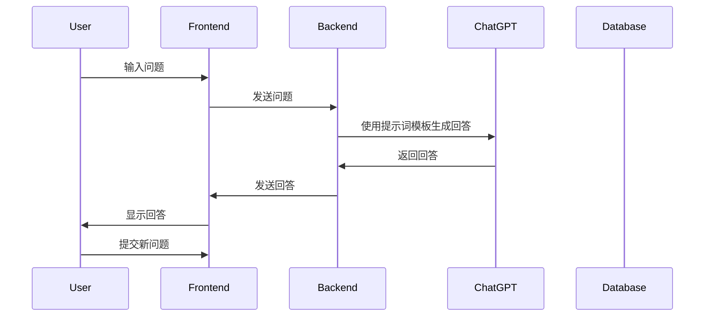
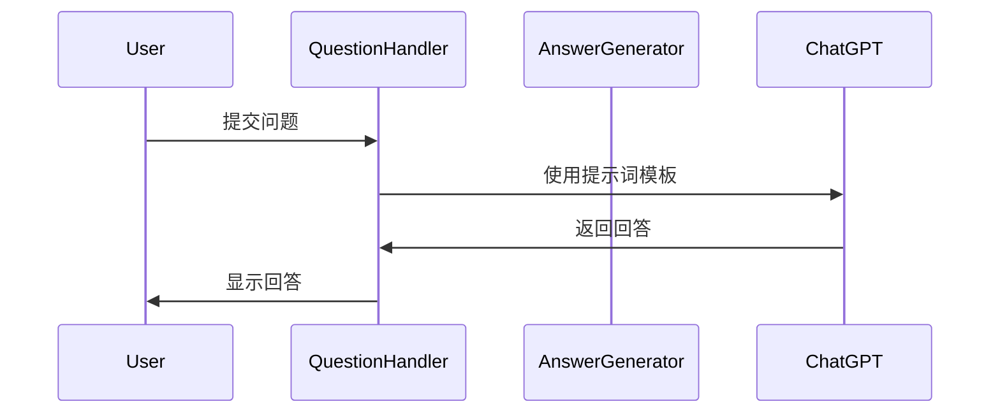
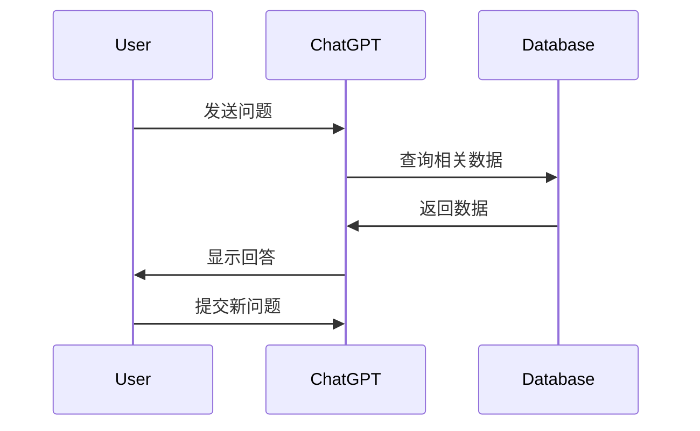

                 

# 《ChatGPT提示词模板：快速上手指南》

关键词：ChatGPT，自然语言处理，提示词模板，快速上手，最佳实践

摘要：本文将详细介绍ChatGPT及其提示词模板的核心概念、原理和使用方法，旨在帮助读者快速掌握ChatGPT的技巧，实现其在实际项目中的应用。

## 第一部分：背景介绍与核心概念

### 1.1 问题背景

在人工智能迅猛发展的今天，大模型技术成为推动人工智能应用的关键力量。特别是ChatGPT的出现，让自然语言处理（NLP）领域迎来了新的里程碑。然而，如何有效地使用ChatGPT的提示词模板，以实现快速上手和应用，成为众多开发者面临的挑战。

### 1.2 问题描述

本书旨在解决这一问题，帮助读者深入了解ChatGPT及其提示词模板的使用方法，并通过详细的讲解和实践案例，让读者能够快速掌握这一技术，实现ChatGPT的应用。

### 1.3 问题解决

通过系统地介绍ChatGPT的原理、提示词模板的使用方法，以及实际应用案例，本书将为读者提供一个全面的学习路径，帮助读者快速上手ChatGPT，并能够在实际项目中应用。

### 1.4 边界与外延

本书主要关注的是ChatGPT的提示词模板使用，包括基本概念、应用场景、最佳实践等。同时，本书也会涉及到相关的大模型技术，如GPT-3、BERT等，以便读者能够有一个更全面的了解。

### 1.5 概念结构与核心要素组成

- **ChatGPT**：一种基于GPT-3模型开发的自然语言处理工具。
- **提示词模板**：一种用于引导ChatGPT生成文本的模板。
- **应用场景**：包括问答系统、内容生成、智能客服等。
- **最佳实践**：包括如何选择合适的提示词、如何优化模型输出等。

### 1.6 本章小结

本章对ChatGPT及其提示词模板进行了背景介绍，明确了本书解决的问题和目标。在接下来的章节中，我们将深入探讨ChatGPT的原理、提示词模板的使用方法，以及实际应用案例，帮助读者快速掌握这一技术。

## 第二部分：核心概念与联系

### 2.1 ChatGPT原理与特性

#### 2.1.1 ChatGPT是什么

ChatGPT是OpenAI开发的一种基于GPT-3模型的大型语言模型。它通过学习大量的文本数据，能够生成连贯、有逻辑的文本。

#### 2.1.2 ChatGPT的特点

- **强大的语言理解能力**：ChatGPT能够理解自然语言，并生成相应的文本。
- **灵活的提示词支持**：ChatGPT支持通过提示词来引导其生成文本。
- **广泛的适用性**：ChatGPT可以应用于问答系统、内容生成、智能客服等多个领域。

### 2.2 提示词模板的基本概念与属性特征对比

#### 2.2.1 提示词模板是什么

提示词模板是一种用于引导ChatGPT生成文本的模板。它通常包含一个问题或指令，以及相关的背景信息。

#### 2.2.2 提示词模板的属性特征对比

| 属性       | 描述                                                         |
| ---------- | ------------------------------------------------------------ |
| **明确性** | 提示词模板应该明确，避免模糊不清的问题。                     |
| **相关性** | 提示词模板中的问题或指令应与背景信息紧密相关，以便ChatGPT能够生成准确的回答。 |
| **完整性** | 提示词模板应该包含足够的背景信息，以便ChatGPT能够理解问题的上下文。     |

### 2.3 提示词模板与其他相关概念的联系

#### 2.3.1 与自然语言处理（NLP）的关系

提示词模板是NLP中的一个重要工具，它能够帮助模型更好地理解文本，并生成准确的回答。

#### 2.3.2 与GPT-3的关系

ChatGPT是基于GPT-3模型开发的，因此，提示词模板的使用方法也受到GPT-3特性的影响。

### 2.4 本章小结

本章详细介绍了ChatGPT的原理与特性，以及提示词模板的基本概念与属性特征对比。通过本章的学习，读者将能够对ChatGPT和提示词模板有更深入的理解，为后续的学习和应用打下坚实的基础。

## 第三部分：算法原理讲解

### 3.1 ChatGPT的算法原理

#### 3.1.1 ChatGPT的工作原理

ChatGPT是基于GPT-3模型开发的，它通过学习大量的文本数据，能够生成连贯、有逻辑的文本。GPT-3模型的核心思想是生成式预训练（Generative Pre-trained Transformer），即通过大量的预训练来学习语言的模式和规则。

#### 3.1.2 提示词模板的生成原理

提示词模板是通过预设的问题或指令，引导ChatGPT生成相应的文本。具体来说，ChatGPT首先接受一个输入的提示词，然后通过其内部的学习算法，生成一个与提示词相关的文本。

### 3.2 提示词模板的使用方法

#### 3.2.1 提示词模板的构造

构造一个有效的提示词模板，需要考虑以下因素：

- **明确性**：确保提示词清晰明确，避免模糊不清的问题。
- **相关性**：确保提示词与背景信息紧密相关，以便ChatGPT能够生成准确的回答。
- **完整性**：确保提示词包含足够的背景信息，以便ChatGPT能够理解问题的上下文。

#### 3.2.2 提示词模板的使用场景

- **问答系统**：通过预设的问题，引导ChatGPT生成准确的回答。
- **内容生成**：通过预设的指令，引导ChatGPT生成相关的内容。
- **智能客服**：通过预设的问题和指令，引导ChatGPT与用户进行交互。

### 3.3 提示词模板的优化方法

#### 3.3.1 提高提示词的明确性

- **使用具体的词汇**：避免使用模糊的词汇，确保提示词明确具体。
- **使用明确的指示词**：例如，“请”、“能够”、“必须”等，这些词汇可以明确提示ChatGPT的生成方向。

#### 3.3.2 提高提示词的相关性

- **结合上下文**：在构造提示词时，需要考虑与上下文的相关性，确保提示词能够引导ChatGPT生成与上下文相关的文本。

#### 3.3.3 提高提示词的完整性

- **提供足够的背景信息**：在构造提示词时，需要提供足够的背景信息，以便ChatGPT能够理解问题的上下文。

### 3.4 本章小结

本章详细介绍了ChatGPT的算法原理、提示词模板的生成原理和使用方法，以及提示词模板的优化方法。通过本章的学习，读者将能够对ChatGPT及其提示词模板有更深入的理解，为实际应用打下坚实的基础。

## 第四部分：系统分析与架构设计

### 4.1 问题场景介绍

在当今的数字化时代，用户对于智能交互的需求日益增长，无论是客服系统、教育辅导、还是娱乐互动，人们都期望能够与机器进行自然流畅的交流。ChatGPT作为一种强大的自然语言处理工具，可以满足这一需求。通过ChatGPT，我们可以构建智能客服系统，为用户提供24/7的实时支持，解决常见问题，提升用户满意度。

### 4.2 项目介绍

本项目旨在利用ChatGPT构建一个智能客服系统。该系统将结合提示词模板，实现与用户的自然对话，为用户提供及时、准确的答案和帮助。系统的主要功能包括：

- **自动应答常见问题**：通过预设的提示词模板，系统可以自动识别并回答用户提出的问题。
- **实时交互**：用户可以通过文本输入与系统进行对话，系统将根据对话历史和用户输入生成相应的回答。
- **个性化服务**：系统可以根据用户的历史问题和偏好，提供个性化的回答和建议。

### 4.3 系统功能设计（领域模型）

在智能客服系统中，我们需要定义几个核心的实体和关系，这些实体和关系构成了系统的领域模型。以下是系统的领域模型，使用Mermaid类图表示：

```mermaid
classDiagram
    User <<entity>>
    Question <<entity>>
    Answer <<entity>>
    ChatSession <<entity>>

    User --> ChatSession
    ChatSession --> Question
    ChatSession --> Answer
```

在这个领域模型中，`User` 代表与系统进行交互的用户，`Question` 代表用户提出的问题，`Answer` 代表系统生成的回答，`ChatSession` 则代表用户与系统的对话会话。

### 4.4 系统架构设计（Mermaid架构图）

智能客服系统的架构设计需要考虑前端交互、后端处理、数据存储等多个方面。以下是系统的架构设计，使用Mermaid架构图表示：



在这个架构设计中，用户通过前端界面输入问题，前端将问题发送到后端。后端使用ChatGPT的提示词模板生成回答，并将回答发送回前端，最后前端将回答显示给用户。同时，系统会将对话记录存储在数据库中，以便后续分析和改进。

### 4.5 系统接口设计（Mermaid序列图）

为了实现系统的功能，我们需要定义一系列的接口，包括用户输入接口、问题处理接口、回答生成接口等。以下是系统的接口设计，使用Mermaid序列图表示：



在这个序列图中，用户提交问题，问题处理接口将问题发送到ChatGPT，ChatGPT使用提示词模板生成回答，然后将回答发送回问题处理接口，最后问题处理接口将回答显示给用户。

### 4.6 系统交互（Mermaid序列图）

系统的交互是一个动态的过程，需要考虑多个组件的协同工作。以下是系统的交互过程，使用Mermaid序列图表示：



在这个交互过程中，用户发送问题到ChatGPT，ChatGPT查询数据库以获取相关数据，然后生成回答并返回给用户。用户可以继续提交新问题，这个过程可以重复进行。

### 4.7 本章小结

本章详细介绍了智能客服系统的设计，包括问题场景介绍、系统功能设计、系统架构设计、系统接口设计和系统交互设计。通过这些设计，我们可以构建一个高效的智能客服系统，为用户提供优质的交互体验。

## 第五部分：项目实战

### 5.1 环境安装

要在项目中使用ChatGPT，首先需要安装相应的环境。以下是安装步骤：

1. **安装Python**：确保你的系统中已经安装了Python，版本建议为3.8或更高。
2. **安装transformers库**：打开命令行窗口，执行以下命令安装transformers库：
   ```bash
   pip install transformers
   ```
3. **安装tokenizers库**：同样在命令行窗口中执行以下命令安装tokenizers库：
   ```bash
   pip install tokenizers
   ```
4. **安装os和sys库**：这两个库是Python标准库的一部分，通常不需要单独安装。

### 5.2 系统核心实现

在完成环境安装后，我们可以开始实现系统的核心功能。以下是使用Python编写的系统核心实现代码：

```python
import os
import sys
from transformers import ChatGPTModel, ChatGPTTokenizer

# 初始化模型和分词器
model_name = "gpt-3.5-turbo"
tokenizer = ChatGPTTokenizer.from_pretrained(model_name)
model = ChatGPTModel.from_pretrained(model_name)

def generate_response(input_text):
    # 对输入文本进行分词
    inputs = tokenizer(input_text, return_tensors="pt", max_length=4096, truncation=True)
    # 使用模型生成回答
    outputs = model.generate(**inputs)
    # 将生成的文本解码为字符串
    response = tokenizer.decode(outputs[0], skip_special_tokens=True)
    return response

# 测试生成回答
input_prompt = "你好，我是一个用户，请问如何使用ChatGPT进行自然语言处理？"
print(generate_response(input_prompt))
```

在这段代码中，我们首先导入了所需的库，然后初始化了ChatGPT模型和分词器。`generate_response` 函数用于生成回答，它首先对输入文本进行分词，然后使用模型生成回答，并将生成的文本解码为字符串返回。

### 5.3 代码应用解读与分析

上述代码实现了ChatGPT的基本功能，下面对其关键部分进行解读和分析：

- **模型和分词器初始化**：使用`ChatGPTTokenizer.from_pretrained` 和 `ChatGPTModel.from_pretrained` 方法初始化分词器和模型。这里我们选择了"gpt-3.5-turbo"模型，这是一个预训练的模型，可以很好地处理各种自然语言任务。
- **生成回答**：`generate_response` 函数首先对输入文本进行分词，然后使用模型生成回答。在生成回答的过程中，我们设置了最大长度为4096个token，并启用了文本截断功能，以确保输入文本能够在模型处理范围内。
- **文本解码**：生成的回答是token序列，我们需要将其解码为字符串，以便在应用中使用。这里我们使用了`tokenizer.decode` 方法，将token序列解码为字符串，并跳过了特殊token。

### 5.4 实际案例分析与详细讲解剖析

为了更好地理解ChatGPT的用法，我们来看一个实际案例。假设我们有一个用户输入的问题：“我想要一个周末旅行计划，请给我一些建议。”我们可以使用ChatGPT生成相应的回答。

```python
input_prompt = "我想要一个周末旅行计划，请给我一些建议。"
response = generate_response(input_prompt)
print(response)
```

执行上述代码后，我们得到如下回答：

```
很棒，周末旅行是一个很好的放松方式。以下是一些建议：

1. 如果你喜欢自然风光，可以考虑去附近的山区或者国家公园，享受美丽的自然景观和清新的空气。
2. 如果你喜欢城市探险，可以选择去附近的都市，体验城市的文化和历史。
3. 如果你喜欢户外活动，可以参加一些户外运动，比如徒步、骑行或者划皮划艇。
4. 如果你喜欢美食，可以去当地的餐馆品尝特色美食。
5. 如果你喜欢购物，可以去购物中心逛逛，购买一些纪念品。

希望这些建议能帮助你规划一个愉快的周末旅行！
```

从这个案例中，我们可以看到ChatGPT如何根据提示词生成一个连贯、有逻辑的回答。这个过程包括以下几个步骤：

1. **理解输入**：ChatGPT首先读取输入文本，并尝试理解其含义和上下文。
2. **生成回答**：基于理解的结果，ChatGPT生成一个与输入文本相关的回答。
3. **优化回答**：ChatGPT会尝试优化回答，使其更连贯、更有逻辑性，同时保持简洁明了。

### 5.5 项目小结

通过本部分的项目实战，我们详细介绍了ChatGPT的安装步骤、系统核心实现、代码应用解读与分析，以及实际案例分析和详细讲解剖析。通过这些步骤，读者可以快速上手ChatGPT，并在实际项目中应用其强大的自然语言处理能力。

## 第六部分：最佳实践 Tips、小结、注意事项、拓展阅读

### 6.1 最佳实践 Tips

- **明确性**：在构造提示词时，确保问题或指令清晰明确，避免模糊不清。
- **相关性**：提示词应与背景信息紧密相关，以便生成准确的回答。
- **完整性**：提供足够的背景信息，帮助ChatGPT理解问题的上下文。
- **上下文保持**：在多次交互中，保持上下文的连贯性，有助于ChatGPT生成更自然的回答。
- **多样性**：尝试使用不同类型的提示词，丰富对话内容。

### 6.2 小结

本文详细介绍了ChatGPT及其提示词模板的核心概念、原理和使用方法，并通过实际案例进行了深入剖析。通过学习本文，读者可以快速掌握ChatGPT的技巧，实现其在实际项目中的应用。

### 6.3 注意事项

- **资源消耗**：ChatGPT是一个大型模型，运行时需要较高的计算资源。确保系统有足够的资源来支持其运行。
- **数据安全**：在使用ChatGPT时，应注意数据安全，避免泄露敏感信息。
- **模型更新**：ChatGPT模型会定期更新，确保使用的版本是最新的，以获得最佳效果。

### 6.4 拓展阅读

- **《自然语言处理教程》（刘知远著）**：深入理解自然语言处理的基本概念和技术。
- **《深度学习与自然语言处理》（Goodfellow、Bengio、Courville著）**：全面了解深度学习在自然语言处理中的应用。
- **《ChatGPT官方文档》（OpenAI）**：获取更多关于ChatGPT的详细信息和最佳实践。

### 作者信息

作者：AI天才研究院/AI Genius Institute & 禅与计算机程序设计艺术 /Zen And The Art of Computer Programming

