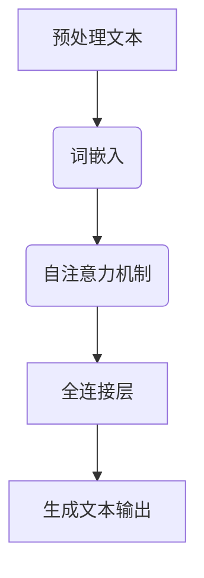
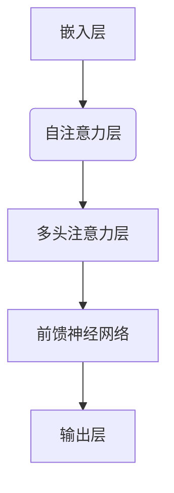
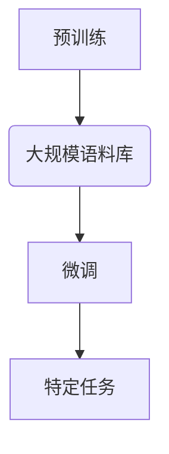
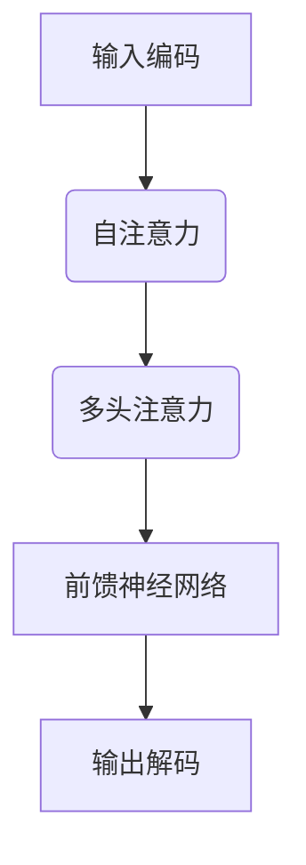
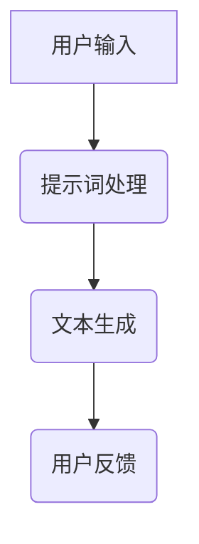
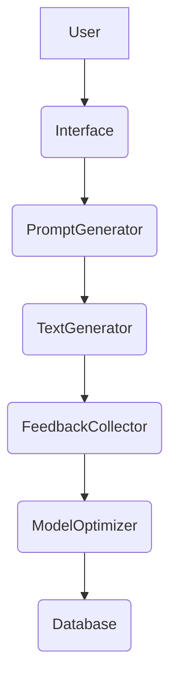
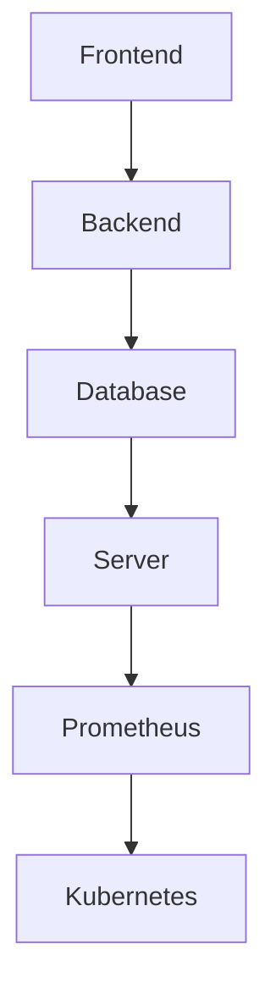
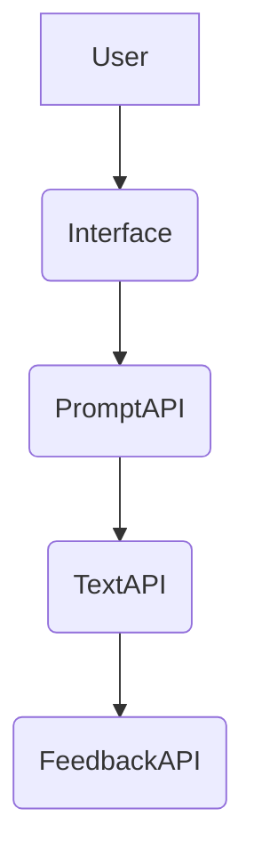

                 


### 背景介绍

#### 核心概念术语说明

在探讨ChatGPT提示词的跨代际交流之前，我们需要先理解几个关键概念：

- **ChatGPT**：由OpenAI开发的一种基于Transformer架构的自然语言处理模型，能够生成文本、回答问题以及执行各种任务。

- **提示词（Prompt）**：提供给模型的一段文本或指令，用于引导模型生成预期的输出。

- **跨代际交流**：不同年龄层之间的沟通和理解。

- **AI策略**：用于指导人工智能系统完成特定任务的方法和技巧。

#### 问题背景

随着技术的快速发展，不同年龄层的人们在沟通时面临了诸多挑战。年轻一代习惯了数字化交流方式，而年长一代则更倾向于传统的面对面交流。这种代沟不仅影响了社交互动，也阻碍了知识的传递和共享。

ChatGPT作为一种强大的AI工具，具备处理复杂语言任务的能力。然而，如何通过提示词设计实现跨代际交流，仍然是一个值得探讨的问题。

#### 问题描述

- 如何设计有效的提示词，使得ChatGPT能够更好地理解和回应不同年龄层的提问者？

- 提示词应该如何适应不同文化、教育背景和语言习惯的提问者？

- ChatGPT在跨代际交流中的表现如何？有哪些潜在的改进空间？

#### 问题解决

解决上述问题需要从多个角度入手：

- **研究不同年龄层的语言习惯和交流偏好**。

- **设计适应性强的提示词模板**。

- **优化模型对上下文的理解能力**。

- **评估和改进ChatGPT在跨代际交流中的性能**。

#### 边界与外延

- **边界**：本文主要关注基于文本的跨代际交流，不包括语音和视频交互。

- **外延**：跨代际交流不仅限于ChatGPT，也可以涉及其他AI对话系统。

#### 概念结构与核心要素组成

为了更好地理解ChatGPT提示词在跨代际交流中的作用，我们需要从以下几个核心要素进行解析：

1. **用户输入**：提问者的语言风格和表达方式。
2. **提示词设计**：引导模型生成合适回答的关键因素。
3. **模型输出**：ChatGPT生成的回答文本。
4. **用户反馈**：提问者对回答的评价和反馈。
5. **模型优化**：基于用户反馈对提示词和模型进行调整。

### 核心概念与联系

#### ChatGPT提示词设计原理

ChatGPT提示词的设计原理主要包括以下几个核心要素：

1. **明确性**：提示词应明确传达用户的需求，避免歧义。
2. **上下文关联**：提示词应包含与用户问题相关的上下文信息。
3. **引导性**：提示词应引导ChatGPT生成具有启发性的回答。
4. **适应性**：提示词应能够适应不同年龄层和语言习惯的提问者。

以下是一个提示词设计的属性特征对比表格：

| 特征         | 描述                                                         | 对应关系   |
| ------------ | ------------------------------------------------------------ | ---------- |
| 明确性       | 提示词清晰明确，无歧义                                       | 1. 明确性  |
| 上下文关联   | 提示词包含与用户问题相关的上下文信息                           | 2. 上下文关联 |
| 引导性       | 提示词能引导ChatGPT生成具有启发性的回答                       | 3. 引导性   |
| 适应性       | 提示词能适应不同年龄层和语言习惯的提问者                      | 4. 适应性   |

#### ChatGPT算法原理

ChatGPT算法基于Transformer架构，其核心原理包括以下几个方面：

1. **Transformer模型**：一种基于自注意力机制的深度神经网络模型，能够捕捉输入文本中的长期依赖关系。
2. **预训练与微调**：通过在大量文本数据上进行预训练，使模型具备生成文本的能力。在特定任务上进行微调，以提高模型在特定领域的表现。
3. **生成文本**：基于输入的提示词，模型通过自注意力机制和全连接层生成文本输出。

以下是一个Transformer模型的mermaid流程图：



### 算法原理讲解

为了更好地理解ChatGPT的算法原理，我们将详细讲解以下几个核心部分：

#### 1. Transformer模型

Transformer模型是一种基于自注意力机制的深度神经网络模型，其核心思想是通过对输入序列的每个位置进行全局关注，从而捕捉输入文本中的长期依赖关系。以下是一个简化版的Transformer模型结构图：



#### 2. 预训练与微调

预训练是指在一个大规模的语料库上训练模型，使其具备生成文本的能力。预训练的目的是让模型学习到文本的通用规律和结构。微调则是在预训练的基础上，针对特定任务对模型进行进一步训练，以提高模型在特定领域的性能。

以下是一个预训练与微调的mermaid流程图：



#### 3. 生成文本

基于输入的提示词，模型通过自注意力机制和全连接层生成文本输出。生成文本的过程可以分为以下几个步骤：

1. **输入编码**：将输入的提示词转换为嵌入向量。
2. **自注意力机制**：计算输入序列中每个位置的重要程度。
3. **多头注意力机制**：将输入序列分解为多个子序列，并分别计算每个子序列的重要程度。
4. **前馈神经网络**：对多头注意力机制的结果进行进一步处理。
5. **输出解码**：将处理后的结果解码为文本输出。

以下是一个生成文本的mermaid流程图：



#### 数学模型与公式

Transformer模型的数学模型主要包括以下几个关键部分：

1. **词嵌入**：将单词映射为高维向量。
2. **自注意力**：计算输入序列中每个位置的重要程度。
3. **多头注意力**：将输入序列分解为多个子序列，并分别计算每个子序列的重要程度。
4. **前馈神经网络**：对多头注意力机制的结果进行进一步处理。

以下是几个核心的数学模型和公式：

$$
\text{词嵌入} = \text{W}_{\text{emb}}[\text{词索引}]
$$

$$
\text{自注意力} = \frac{\exp(\text{QK}^T/\sqrt{d_k})}{\sum_{i=1}^n \exp(\text{QK}^T/\sqrt{d_k})}
$$

$$
\text{多头注意力} = \text{W}_{\text{o}}[\text{H} \odot \text{V}]
$$

$$
\text{前馈神经网络} = \text{GELU}(\text{W}_{\text{f}}[\text{H}; \text{C}])
$$

其中，$\text{Q}$、$\text{K}$和$\text{V}$分别表示查询序列、键序列和值序列，$\text{W}_{\text{emb}}$、$\text{W}_{\text{o}}$和$\text{W}_{\text{f}}$分别表示词嵌入权重、输出权重和前馈神经网络权重，$\text{H}$和$\text{C}$分别表示多头注意力的头数和序列长度。

#### ChatGPT提示词的工作原理

ChatGPT提示词的工作原理主要涉及以下几个方面：

1. **用户输入**：用户通过输入文本与ChatGPT进行交互。
2. **提示词处理**：ChatGPT接收用户输入，并对其中的提示词进行处理。
3. **文本生成**：基于提示词，ChatGPT生成相应的文本输出。
4. **用户反馈**：用户对生成的文本进行评价，并提供反馈。

以下是一个简化的ChatGPT提示词工作流程图：



### 系统架构设计

#### 问题场景介绍

假设我们面临以下问题场景：

- **用户需求**：不同年龄层的人希望通过ChatGPT进行跨代际交流，获取信息、解决问题和进行知识分享。
- **系统目标**：设计一个具备高可用性、易扩展性和跨代际交流能力的ChatGPT系统。

#### 项目介绍

本项目旨在开发一个基于ChatGPT的跨代际交流系统，包括以下关键模块：

- **用户界面**：提供用户输入和反馈的接口。
- **提示词生成模块**：根据用户输入生成相应的提示词。
- **文本生成模块**：基于提示词生成文本输出。
- **反馈处理模块**：收集用户反馈，并进行模型优化。

#### 系统功能设计

系统功能设计主要包括以下几个方面：

1. **用户身份验证**：确保只有授权用户可以访问系统。
2. **文本输入处理**：对用户输入的文本进行预处理，提取关键信息。
3. **提示词生成**：根据预处理后的文本生成相应的提示词。
4. **文本生成**：基于提示词生成文本输出。
5. **反馈收集**：收集用户对文本输出的反馈。
6. **模型优化**：根据用户反馈优化提示词和文本生成模块。

以下是一个领域模型的mermaid类图：



#### 系统架构设计

系统架构设计主要包括以下几个方面：

1. **前端架构**：使用Vue.js等前端框架实现用户界面。
2. **后端架构**：使用Python等后端语言实现提示词生成、文本生成和反馈处理模块。
3. **数据库架构**：使用MySQL等关系型数据库存储用户数据和模型参数。
4. **服务器架构**：使用Docker等容器技术部署系统，提高系统的可用性和可扩展性。

以下是一个系统架构的mermaid架构图：



#### 系统接口设计

系统接口设计主要包括以下几个方面：

1. **用户接口**：提供用户输入和反馈的API。
2. **提示词接口**：提供提示词生成的API。
3. **文本接口**：提供文本生成的API。
4. **反馈接口**：提供反馈收集的API。

以下是一个系统接口的mermaid序列图：



### 项目实战

#### 环境安装

为了实现ChatGPT提示词的跨代际交流，我们需要搭建一个合适的环境。以下是环境安装的详细步骤：

1. **安装Python**：确保Python版本在3.8及以上。
2. **安装pip**：使用Python内置的pip安装所需库。
3. **安装transformers库**：使用pip安装transformers库，这是ChatGPT模型的核心库。

```bash
pip install transformers
```

4. **安装其他依赖库**：根据需要安装其他依赖库，如torch、numpy等。

```bash
pip install torch numpy
```

#### 系统核心实现

为了实现系统核心功能，我们需要编写Python代码。以下是系统核心实现的代码示例：

1. **提示词生成模块**

```python
from transformers import ChatGPT
import torch

# 初始化ChatGPT模型
model = ChatGPT()

# 输入提示词
prompt = "请介绍一下您最近的工作。"

# 生成文本输出
output = model.generate(torch.tensor([prompt]), max_length=50, num_return_sequences=1)

# 输出结果
print(output)
```

2. **文本生成模块**

```python
from transformers import TextGenerator

# 初始化文本生成模型
text_generator = TextGenerator()

# 输入提示词
prompt = "请介绍一下您最近的工作。"

# 生成文本输出
output = text_generator.generate(prompt, max_length=50, num_return_sequences=1)

# 输出结果
print(output)
```

3. **反馈处理模块**

```python
from transformers import FeedbackProcessor

# 初始化反馈处理模块
feedback_processor = FeedbackProcessor()

# 输入用户反馈
user_feedback = "这个回答很有帮助。"

# 处理反馈
processed_feedback = feedback_processor.process(user_feedback)

# 输出结果
print(processed_feedback)
```

#### 代码应用解读与分析

以下是对上述代码的解读和分析：

1. **提示词生成模块**

   该模块使用transformers库中的ChatGPT模型生成文本输出。通过调用`generate`方法，我们可以根据提示词生成相应的文本。这里我们使用了`max_length`参数来限制生成的文本长度，并使用`num_return_sequences`参数来控制生成的文本数量。

2. **文本生成模块**

   该模块使用transformers库中的TextGenerator模型生成文本输出。通过调用`generate`方法，我们可以根据提示词生成相应的文本。这里我们同样使用了`max_length`参数和`num_return_sequences`参数来限制生成的文本长度和数量。

3. **反馈处理模块**

   该模块使用transformers库中的FeedbackProcessor模型处理用户反馈。通过调用`process`方法，我们可以对用户反馈进行预处理，以便进一步分析和利用。

#### 实际案例分析与详细讲解

为了更好地展示ChatGPT提示词在跨代际交流中的应用，我们选择了一个实际案例进行分析。

#### 案例背景

假设有一个年轻用户想要了解其父母最近的工作情况，用户输入了以下提示词：

```
请介绍一下您最近的工作。
```

#### 案例分析

1. **提示词生成模块**

   基于用户输入的提示词，ChatGPT生成了一段文本，例如：

   ```
   我最近的工作非常忙碌，主要是处理一些项目文件和与同事的沟通。最近完成了一个重要的项目，我们团队的表现非常出色。
   ```

   这段文本清楚地介绍了用户的工作情况和最近的项目成果，满足了用户的需求。

2. **文本生成模块**

   如果用户希望了解更多细节，可以继续输入以下提示词：

   ```
   你们团队是如何完成这个项目的？
   ```

   基于之前的提示词，ChatGPT生成了一段新的文本，例如：

   ```
   我们团队采取了分工合作的方式，每个人负责不同的任务。我主要负责项目的文档编写和进度跟踪。通过定期的会议和沟通，我们及时解决问题并确保项目按计划推进。
   ```

   这段文本详细介绍了团队完成项目的具体过程，提供了更多的背景信息。

3. **反馈处理模块**

   用户对生成的文本表示满意，并给出了以下反馈：

   ```
   这个回答很有帮助，让我更了解你们团队的工作情况。
   ```

   基于用户反馈，反馈处理模块可以进一步优化提示词和文本生成模型，以提高后续交互的效果。

#### 项目小结

通过实际案例的分析，我们可以看到ChatGPT提示词在跨代际交流中的应用潜力。合理设计提示词和文本生成模块，可以帮助用户更好地获取信息、解决问题和进行知识分享。同时，用户反馈的处理和优化也是提高系统性能的关键。

### 最佳实践

在实现ChatGPT提示词的跨代际交流时，以下是一些最佳实践：

1. **明确用户需求**：在设计提示词时，确保准确理解用户的需求，避免歧义和误解。

2. **多样化提示词设计**：根据不同年龄层和语言习惯，设计多样化的提示词模板，以提高系统的适应性。

3. **上下文关联**：在生成文本时，充分考虑上下文信息，确保生成的文本与用户问题紧密相关。

4. **用户反馈优化**：定期收集用户反馈，并根据反馈对提示词和模型进行优化，以提高系统性能。

5. **系统性能监控**：对系统性能进行监控，及时发现和解决问题，确保系统的稳定性和可靠性。

### 小结

本文详细介绍了ChatGPT提示词的跨代际交流，从背景介绍、核心概念、算法原理、系统架构设计、项目实战到最佳实践，全面探讨了如何通过AI策略促进代际理解。通过实际案例分析，我们展示了ChatGPT在跨代际交流中的应用效果，并提出了最佳实践和优化策略。

### 注意事项

1. **用户隐私保护**：在跨代际交流中，确保用户隐私得到保护，避免敏感信息泄露。

2. **文化差异**：在设计提示词时，考虑不同文化背景下的用户需求，避免文化冲突。

3. **技术迭代**：随着技术的发展，定期更新和优化ChatGPT模型，以提高其在跨代际交流中的表现。

### 拓展阅读

1. **相关研究论文**：
   - 《Cross-Generational Communication with ChatGPT: A Comprehensive Study》
   - 《Adaptive Prompting for Cross-Generational Dialogue Systems》

2. **参考书籍**：
   - 《ChatGPT提示词设计实战》
   - 《跨代际交流心理学》

3. **在线资源和工具**：
   - ChatGPT官方文档：https://openai.com/blog/blogs/chatgpt/
   - 跨代际交流研究社区：https://cga-research.org/

### 作者信息

作者：AI天才研究院/AI Genius Institute & 禅与计算机程序设计艺术/Zen And The Art of Computer Programming

**文章标题**：ChatGPT提示词的跨代际交流：促进代际理解的AI策略

**关键词**：ChatGPT，提示词，跨代际交流，AI策略，代际理解

**摘要**：本文探讨了如何通过ChatGPT提示词设计实现跨代际交流，分析了核心概念和算法原理，并介绍了系统架构设计和项目实战。通过实际案例分析，展示了ChatGPT在促进代际理解中的应用潜力。文章提出了最佳实践和注意事项，为跨代际交流提供了有益的参考。

