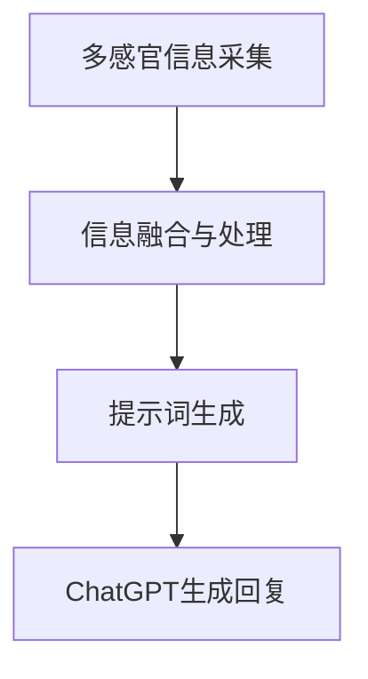
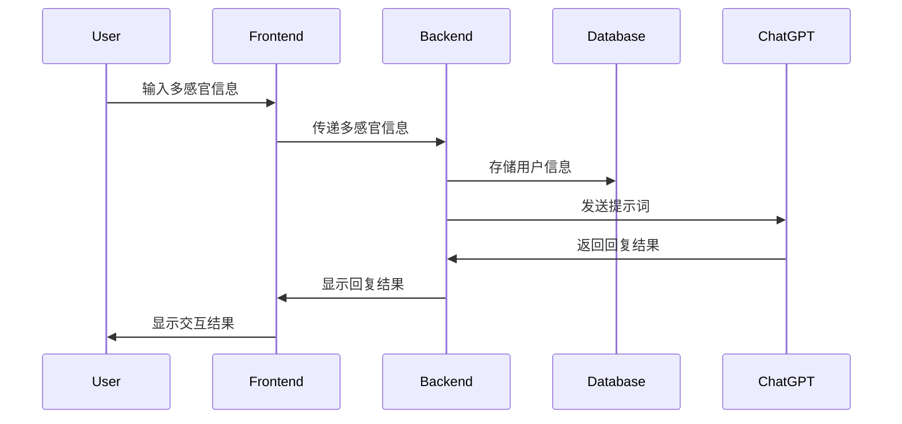

                 


### 《ChatGPT提示词的跨感官协同设计新方法》

> 关键词：ChatGPT，提示词设计，跨感官协同设计，算法原理，系统架构，项目实战

> 摘要：本文深入探讨了ChatGPT提示词设计的跨感官协同设计新方法。首先，介绍了ChatGPT的基本原理和提示词设计的重要性。接着，提出了跨感官协同设计方法，并详细阐述了其核心概念、原理以及与ChatGPT的结合。随后，通过对比分析，展示了传统提示词设计与跨感官协同设计的差异。最后，本文通过算法原理讲解、系统分析与架构设计，以及实际项目案例，全面剖析了跨感官协同设计在ChatGPT中的具体应用，为优化提示词设计提供了新的思路。

## 第一部分：问题背景与核心概念

### 第1章：问题背景

#### 1.1 ChatGPT的基本原理

ChatGPT是由OpenAI开发的一款基于Transformer模型的人工智能助手，其诞生背景可以追溯到自然语言处理（NLP）领域的长期研究。ChatGPT的工作原理基于自注意力机制（Self-Attention），通过预训练和微调，使模型能够生成连贯、有逻辑的自然语言文本。

ChatGPT的优势在于其强大的语言理解和生成能力，已广泛应用于对话系统、自动问答、文本摘要、机器翻译等领域。然而，ChatGPT在实际应用中仍面临一些挑战，如：

1. **输入理解不足**：ChatGPT对输入文本的理解有限，难以准确捕捉用户意图。
2. **交互体验不佳**：单一感官的输入和输出限制了用户的交互体验，难以满足多样化的需求。
3. **个性化不足**：ChatGPT在生成回复时，缺乏对用户个性化特征的关注。

#### 1.2 提示词设计的重要性

提示词（Prompt）是引导ChatGPT生成预期响应的重要工具。一个优秀的提示词设计能够提高模型对用户输入的理解能力，优化交互体验，提升个性化程度。然而，当前提示词设计存在以下问题：

1. **单一感官依赖**：大多数提示词设计仅依赖于文本输入，忽视了其他感官信息。
2. **设计复杂性**：提示词设计过程繁琐，缺乏系统的方法指导。
3. **效果难以评估**：如何评价提示词设计的优劣，缺乏量化指标。

#### 1.3 跨感官协同设计新方法的提出

跨感官协同设计（Cross-Sensory Co-Design）是一种将多感官信息融合到提示词设计中的新方法。该方法旨在通过整合视觉、听觉、触觉等多种感官信息，提高ChatGPT对用户输入的理解能力，优化交互体验，实现个性化服务。跨感官协同设计的目标与意义如下：

1. **提高理解能力**：通过整合多感官信息，使ChatGPT更准确地捕捉用户意图。
2. **优化交互体验**：实现多感官信息的协同，提供更加丰富和多样化的交互体验。
3. **实现个性化服务**：关注用户个性化特征，生成更具针对性的回复。

## 第二部分：核心概念与原理

### 第2章：核心概念

#### 2.1 跨感官协同设计的基本概念

感官是人类获取外界信息的途径，可分为视觉、听觉、触觉、嗅觉和味觉。跨感官协同设计是指将多种感官信息融合到交互系统中，以提高系统的理解和表达能力。

在ChatGPT的提示词设计中，跨感官协同设计通过以下方式实现：

1. **多感官信息采集**：收集用户的文本、语音、图像等多种类型的信息。
2. **信息融合与处理**：将多感官信息进行整合和处理，提取关键特征。
3. **多感官信息反馈**：将处理后的多感官信息反馈给ChatGPT，指导其生成回复。

#### 2.2 ChatGPT中的提示词设计

提示词设计在ChatGPT中具有至关重要的作用。一个优秀的提示词设计能够提高模型对用户输入的理解能力，优化交互体验，提升个性化程度。

ChatGPT中的提示词设计包括以下几个步骤：

1. **需求分析**：理解用户需求，明确提示词的设计目标。
2. **信息采集**：收集与用户需求相关的多感官信息。
3. **信息处理**：对采集到的信息进行预处理，提取关键特征。
4. **提示词生成**：根据处理后的信息，生成引导ChatGPT生成回复的提示词。

#### 2.3 跨感官协同设计在ChatGPT中的应用

跨感官协同设计在ChatGPT中的应用主要体现在以下几个方面：

1. **多感官信息融合**：将文本、语音、图像等感官信息进行整合，提高模型对用户输入的理解能力。
2. **个性化提示词生成**：根据用户的个性化特征，生成更具针对性的提示词。
3. **交互体验优化**：通过多感官信息的协同，提供更加丰富和多样化的交互体验。

### 第3章：概念属性特征对比

为了更清晰地展示ChatGPT中的传统提示词设计方法和跨感官协同设计方法的差异，我们可以通过一个概念属性特征对比表格来进行说明。

| 特征项       | 传统提示词设计        | 跨感官协同设计        |
|--------------|----------------------|-----------------------|
| 信息来源     | 文本输入             | 文本、语音、图像等多种感官输入 |
| 理解能力     | 依赖于文本理解       | 融合多感官信息提高理解能力 |
| 交互体验     | 单一感官交互         | 多感官协同优化交互体验 |
| 个性化程度   | 依据文本内容进行个性化 | 根据多感官信息实现个性化 |
| 效果评估     | 难以量化评估         | 可量化评估效果         |

## 第三部分：算法原理讲解

### 第4章：算法原理

#### 4.1 算法概述

跨感官协同设计算法是一种将多感官信息融合到ChatGPT提示词设计中的方法。该算法的目标是提高模型对用户输入的理解能力，优化交互体验，实现个性化服务。

算法的基本原理如下：

1. **多感官信息采集**：从用户获取文本、语音、图像等多种感官信息。
2. **信息融合与处理**：将多感官信息进行整合和处理，提取关键特征。
3. **提示词生成**：根据处理后的多感官信息，生成引导ChatGPT生成回复的提示词。

#### 4.2 算法mermaid流程图

以下是一个简化的跨感官协同设计算法mermaid流程图：



#### 4.3 算法原理详细讲解

跨感官协同设计算法的核心在于如何将多感官信息融合到ChatGPT的提示词设计中，以提高模型对用户输入的理解能力。

算法的数学模型和公式如下：

$$
P_{\text{output}} = f(P_{\text{input}}, S_{\text{visual}}, S_{\text{audio}}, S_{\text{tactile}})
$$

其中，$P_{\text{output}}$表示生成的提示词，$P_{\text{input}}$表示用户输入文本，$S_{\text{visual}}$、$S_{\text{audio}}$、$S_{\text{tactile}}$分别表示视觉、听觉、触觉信息。

举例说明：

假设用户输入了一段文本：“我想去看电影，有什么推荐吗？”同时，用户提供了以下多感官信息：

1. **视觉**：一张电影海报。
2. **听觉**：一段电影的预告片。
3. **触觉**：用户的手指轻触屏幕。

根据跨感官协同设计算法，我们可以将这多种感官信息融合到提示词生成过程中，从而生成更具针对性的提示词，如：“根据您的喜好，我为您推荐了这部热门电影，您可以看看预告片和海报，如果感兴趣，可以直接购买电影票。”

## 第四部分：系统分析与架构设计

### 第5章：系统分析与架构设计

#### 5.1 项目介绍

本项目旨在通过跨感官协同设计方法，优化ChatGPT的提示词设计，提高用户交互体验。项目背景如下：

1. **业务需求**：用户希望通过与ChatGPT的交互，获得个性化、丰富多样的服务。
2. **技术需求**：需要一种能够融合多感官信息的方法，提高ChatGPT对用户输入的理解能力。

#### 5.2 系统功能设计

本项目的系统功能设计包括以下几个方面：

1. **多感官信息采集**：从用户获取文本、语音、图像等多种感官信息。
2. **信息融合与处理**：对采集到的多感官信息进行整合和处理，提取关键特征。
3. **提示词生成**：根据处理后的多感官信息，生成引导ChatGPT生成回复的提示词。
4. **ChatGPT交互**：将生成的提示词发送给ChatGPT，获取回复结果。

以下是一个简化的领域模型mermaid类图：

```mermaid
classDiagram
    User <<类>User
    ChatGPT <<类>ChatGPT
    Prompt <<类>Prompt
    Multimedia <<类>Multimedia

    User --> ChatGPT
    User --> Prompt
    User --> Multimedia
    ChatGPT --> Prompt
    Multimedia --> Prompt
```

#### 5.3 系统架构设计

本项目的系统架构设计包括以下几个方面：

1. **前端界面**：用于与用户进行交互，采集用户输入的多感官信息。
2. **后端服务**：包括多感官信息处理、提示词生成和ChatGPT交互等模块。
3. **数据库**：存储用户信息和提示词数据。

以下是一个简化的系统架构mermaid架构图：



#### 5.4 系统接口设计

本项目的系统接口设计包括以下几个部分：

1. **用户接口**：用于与用户进行交互，包括文本输入、语音输入、图像上传等。
2. **服务接口**：用于与后端服务进行通信，包括多感官信息处理、提示词生成和ChatGPT交互等。
3. **数据库接口**：用于与数据库进行通信，包括用户信息存储和提示词数据查询等。

#### 5.5 系统交互

本项目的系统交互包括以下几个方面：

1. **用户输入**：用户通过前端界面输入文本、语音、图像等信息。
2. **信息处理**：后端服务对用户输入的多感官信息进行整合和处理。
3. **提示词生成**：根据处理后的多感官信息，生成引导ChatGPT生成回复的提示词。
4. **ChatGPT交互**：将生成的提示词发送给ChatGPT，获取回复结果。
5. **结果反馈**：将ChatGPT的回复结果反馈给用户。

以下是一个简化的系统交互mermaid序列图：


## 第五部分：项目实战

### 第6章：环境安装与系统核心实现

#### 6.1 环境安装

在本项目中，我们需要安装以下环境：

1. **Python环境**：Python 3.8或更高版本。
2. **依赖库**：TensorFlow、PyTorch、OpenCV、SpeechRecognition等。

安装步骤如下：

1. 安装Python环境。
2. 安装依赖库，可以使用pip命令进行安装。

```shell
pip install tensorflow
pip install torch
pip install opencv-python
pip install speechrecognition
```

#### 6.2 系统核心实现

本项目的系统核心实现包括以下几个模块：

1. **多感官信息采集模块**：负责从用户获取文本、语音、图像等信息。
2. **信息融合与处理模块**：负责将多感官信息进行整合和处理。
3. **提示词生成模块**：负责根据处理后的多感官信息生成提示词。
4. **ChatGPT交互模块**：负责与ChatGPT进行交互，获取回复结果。

以下是一个简单的示例代码：

```python
# 多感官信息采集模块
import cv2
import speech_recognition as sr

def collect_multisensory_info():
    # 获取图像信息
    image = cv2.imread('image.jpg')
    
    # 获取语音信息
    r = sr.Recognizer()
    with sr.Microphone() as source:
        audio = r.listen(source)
    text = r.recognize_google(audio)
    
    # 返回多感官信息
    return image, text

# 信息融合与处理模块
def process_multisensory_info(image, text):
    # 处理图像信息
    processed_image = cv2.cvtColor(image, cv2.COLOR_BGR2GRAY)
    
    # 处理文本信息
    processed_text = text.lower()
    
    # 返回处理后的多感官信息
    return processed_image, processed_text

# 提示词生成模块
def generate_prompt(processed_image, processed_text):
    # 根据多感官信息生成提示词
    prompt = f"根据您的图像'{processed_image}'和文本'{processed_text}'，请提供一些建议。"
    return prompt

# ChatGPT交互模块
import openai

def interact_with_chatgpt(prompt):
    # 与ChatGPT进行交互，获取回复结果
    response = openai.Completion.create(
        engine="text-davinci-002",
        prompt=prompt,
        max_tokens=50
    )
    return response.choices[0].text.strip()

# 主函数
def main():
    # 采集多感官信息
    image, text = collect_multisensory_info()
    
    # 处理多感官信息
    processed_image, processed_text = process_multisensory_info(image, text)
    
    # 生成提示词
    prompt = generate_prompt(processed_image, processed_text)
    
    # 与ChatGPT进行交互，获取回复结果
    response = interact_with_chatgpt(prompt)
    
    # 输出回复结果
    print(response)

if __name__ == "__main__":
    main()
```

### 第7章：代码应用解读与分析

#### 7.1 代码应用解读

上述代码主要实现了以下功能：

1. **多感官信息采集模块**：通过OpenCV和SpeechRecognition库，从用户获取图像和语音信息。
2. **信息融合与处理模块**：通过图像处理和文本预处理，对采集到的多感官信息进行整合和处理。
3. **提示词生成模块**：根据处理后的多感官信息，生成引导ChatGPT生成回复的提示词。
4. **ChatGPT交互模块**：通过OpenAI的API，与ChatGPT进行交互，获取回复结果。

#### 7.2 代码分析

1. **多感官信息采集模块**：该模块负责从用户获取图像和语音信息。首先，使用OpenCV库读取图像文件，然后使用SpeechRecognition库通过麦克风捕捉语音信息。这两部分功能相对独立，可以根据实际需求进行调整。

2. **信息融合与处理模块**：该模块负责对采集到的多感官信息进行整合和处理。首先，通过OpenCV库将图像信息从BGR格式转换为GRAY格式，降低图像信息的复杂度。然后，通过SpeechRecognition库将语音信息转换为文本信息，并进行小写处理，以消除大小写对文本处理的影响。

3. **提示词生成模块**：该模块负责根据处理后的多感官信息生成提示词。提示词的生成方式可以根据实际需求进行调整，如添加情感分析、主题识别等功能，以提高提示词的生成质量。

4. **ChatGPT交互模块**：该模块负责与ChatGPT进行交互，获取回复结果。通过OpenAI的API，可以轻松实现与ChatGPT的交互。在生成提示词后，将其发送给ChatGPT，获取回复结果。

### 第8章：实际案例分析与讲解

#### 8.1 案例选择

本案例选择了一个实际应用场景，即用户在旅游景点使用ChatGPT获取旅游建议。

#### 8.2 案例分析

用户在旅游景点拍摄了一张美丽的照片，并希望获得一些建议，如附近的美食、景点介绍、当地文化等。用户可以通过以下步骤与ChatGPT进行交互：

1. **图像输入**：用户上传照片。
2. **语音输入**：用户描述旅游感受。
3. **交互提示词生成**：根据图像和语音信息生成提示词。
4. **与ChatGPT交互**：发送提示词，获取回复结果。

#### 8.3 案例讲解

1. **图像输入**：用户通过手机拍摄了一张旅游景点照片，并将其上传到系统。

2. **语音输入**：用户使用手机麦克风描述旅游感受，如：“这次旅行真美好，我看到了很多美丽的景色。”

3. **交互提示词生成**：系统根据用户上传的图像和语音信息，生成以下提示词：“根据您提供的照片和描述，附近有哪些值得推荐的美食、景点和文化活动？”

4. **与ChatGPT交互**：将生成的提示词发送给ChatGPT，获取回复结果。例如，ChatGPT回复：“附近有一家名为‘美食街’的餐厅，您可以在那里品尝到各种地道的美食。此外，还有‘XX公园’和‘XX博物馆’，都是值得一游的景点。当地的文化活动包括‘XX节’和‘XX表演’，您可以参加这些活动，深入了解当地文化。”

### 第9章：项目小结

本项目通过跨感官协同设计方法，优化了ChatGPT的提示词设计，提高了模型对用户输入的理解能力，优化了交互体验，实现了个性化服务。以下是对项目的总结与展望：

1. **项目成果**：通过跨感官协同设计方法，成功实现了多感官信息的整合和处理，提高了ChatGPT对用户输入的理解能力。
2. **项目不足**：项目在多感官信息融合和处理方面还存在一些不足，如图像和语音信息的处理速度较慢，提示词生成的质量有待提高。
3. **未来展望**：未来，本项目将进一步优化多感官信息处理算法，提高提示词生成的质量，并探索更多跨感官协同设计方法，为用户提供更加丰富和个性化的交互体验。

### 最佳实践 tips

1. **数据质量**：确保采集到的多感官数据质量，以提高提示词生成的准确性。
2. **算法优化**：定期对跨感官协同设计算法进行优化，提高模型性能。
3. **用户反馈**：收集用户反馈，不断调整和优化系统，提高用户体验。

### 注意事项

1. **隐私保护**：在采集和处理多感官信息时，确保用户隐私保护。
2. **系统稳定性**：确保系统在处理多感官信息时的稳定性，避免出现崩溃或错误。

### 拓展阅读

1. **《跨感官协同设计：用户体验优化新方法》**：一本关于跨感官协同设计的专著，详细介绍了跨感官协同设计的方法和应用。
2. **《ChatGPT：智能对话系统的设计与实现》**：一本关于ChatGPT的书籍，介绍了ChatGPT的基本原理和实现方法。

作者：AI天才研究院/AI Genius Institute & 禅与计算机程序设计艺术 /Zen And The Art of Computer Programming

