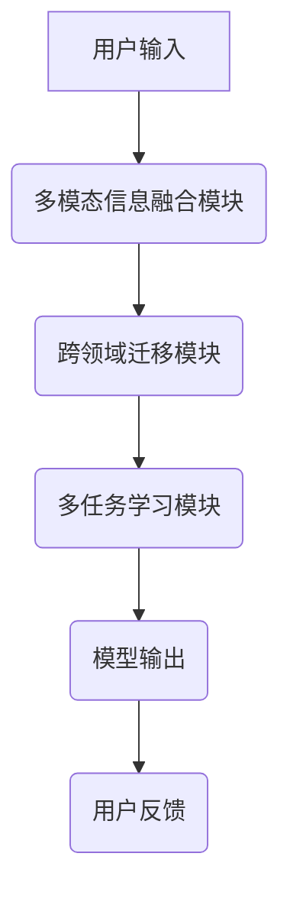
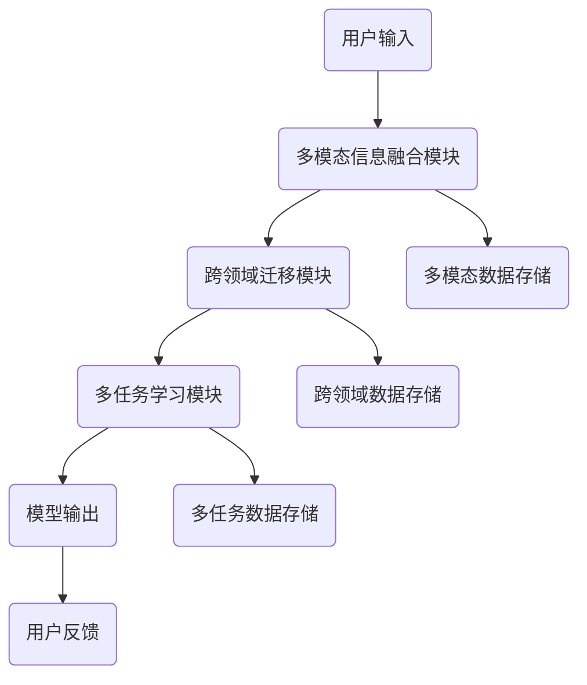
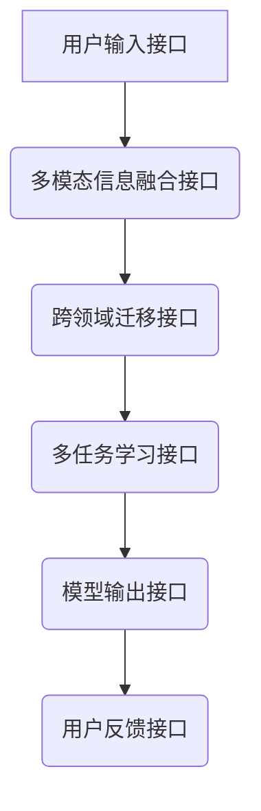
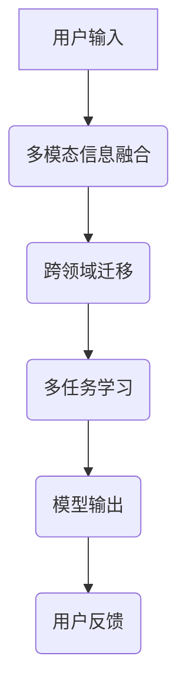

                 


# ChatGPT提示词的跨维度语言模型设计新方法

关键词：ChatGPT，自然语言处理，多模态融合，跨领域迁移，多任务学习，提示词设计

摘要：本文针对ChatGPT提示词设计问题，提出了跨维度语言模型设计新方法。通过多模态融合、跨领域迁移和多任务学习等技术，探讨了提高ChatGPT性能和应用效果的有效途径。本文旨在为ChatGPT提示词设计提供理论基础和方法指导。

## 第一部分：背景介绍

### 1.1 问题背景

近年来，随着人工智能技术的快速发展，自然语言处理（NLP）领域取得了显著的进展。ChatGPT作为一种基于GPT-3模型的聊天机器人，因其强大的自然语言理解和生成能力，受到了广泛关注。然而，在实际应用中，如何为ChatGPT设计高效、精准的提示词，成为了提高其性能的关键。

### 1.2 问题描述

设计有效的ChatGPT提示词，需要考虑多个维度，包括语言模型的特点、用户需求、应用场景等。此外，提示词的设计还需遵循一定的原则，如简洁性、明确性、多样性等。

### 1.3 问题解决

本书将围绕ChatGPT提示词的设计，探讨跨维度语言模型的新方法。通过分析现有方法，提出一种基于多模态融合、跨领域迁移、多任务学习等技术的综合设计方案，旨在提高ChatGPT的性能和应用效果。

### 1.4 边界与外延

本书主要针对ChatGPT这一具体应用场景，探讨提示词设计的方法。然而，书中提出的方法和思路也可借鉴应用于其他聊天机器人、智能客服、语音助手等领域。

### 1.5 概念结构与核心要素组成

#### 1.5.1 核心概念

- 提示词：引导ChatGPT进行有效对话的词语或短语。
- 语言模型：用于预测文本的生成模型。
- 多模态融合：将文本、图像、音频等多种模态信息进行融合，以提升模型性能。
- 跨领域迁移：将一个领域的知识迁移到另一个领域，以提升模型泛化能力。
- 多任务学习：同时学习多个任务，以提高模型性能。

#### 1.5.2 概念属性特征对比表格

| 概念      | 特点                                                     |
| --------- | -------------------------------------------------------- |
| 提示词    | 引导对话、简洁明了、多样性                             |
| 语言模型  | 文本生成、上下文理解、自适应能力                      |
| 多模态融合 | 提升模型性能、多模态信息互补、拓展应用场景            |
| 跨领域迁移 | 模型泛化、知识共享、提高模型适应能力                  |
| 多任务学习 | 提升模型性能、多任务协同、降低模型复杂度              |

## 1.6 本章小结

本章对ChatGPT提示词的设计问题进行了详细背景介绍，阐述了核心概念和概念属性特征对比表格。接下来，我们将进一步探讨ChatGPT提示词设计的理论基础、方法与技术实现。

----------------------------------------------------------------

## 第二部分：核心概念与联系

### 2.1 跨维度语言模型设计理论基础

#### 2.1.1 语言模型原理

语言模型是一种概率模型，用于预测给定输入文本序列的概率。常见的语言模型有基于N-gram模型、神经网络模型和生成式模型等。N-gram模型通过统计相邻单词的频率来预测下一个单词，而神经网络模型则通过学习文本的特征来生成文本。生成式模型如GPT模型，通过生成文本的概率分布来生成文本。

#### 2.1.2 多模态融合原理

多模态融合是将不同模态的信息进行整合，以提高模型性能。常见的多模态融合方法有基于特征的融合、基于模型的融合和基于数据的融合等。例如，将文本与图像进行融合，可以借助视觉特征和语言特征的互补性，提高模型的泛化能力和文本生成质量。

#### 2.1.3 跨领域迁移原理

跨领域迁移是一种将一个领域的知识迁移到另一个领域的方法。通过跨领域迁移，可以将一个领域中的模型、数据集和算法等应用于另一个领域，以提高模型在未知领域的性能。常见的跨领域迁移方法有基于模型迁移、基于数据迁移和基于算法迁移等。

#### 2.1.4 多任务学习原理

多任务学习是一种同时学习多个任务的方法。通过多任务学习，模型可以在学习多个任务的过程中共享知识，提高模型在单个任务上的性能。常见的多任务学习方法有共享权重、任务融合和任务分离等。

### 2.2 跨维度语言模型设计方法与技术

#### 2.2.1 提示词设计方法

提示词设计是跨维度语言模型设计的关键。设计提示词时，需要考虑以下原则：

- 简洁性：提示词应简洁明了，避免冗余。
- 明确性：提示词应能准确传达用户意图。
- 多样性：提示词应具有多样性，以适应不同场景和用户需求。

#### 2.2.2 多模态融合方法

多模态融合方法包括以下几种：

1. **基于特征的融合**：将不同模态的特征映射到同一特征空间，通过特征加权融合得到最终特征。
2. **基于模型的融合**：使用多个模型分别处理不同模态的信息，然后融合多个模型的输出。
3. **基于数据的融合**：在训练过程中，将不同模态的数据进行预处理后，共同训练一个模型。

### 2.2.3 跨领域迁移方法

1. **模型迁移**：将一个领域的模型直接应用到另一个领域，通过在目标领域进行微调，以提高模型在目标领域的性能。
2. **数据迁移**：通过在目标领域收集和标注数据，将模型在源领域训练好的模型应用于目标领域。
3. **算法迁移**：将一个领域的算法或技术应用于另一个领域，以解决目标领域的问题。

### 2.2.4 多任务学习方法

1. **共享权重**：在多个任务间共享模型权重，通过任务间的信息传递，提高模型在单个任务上的性能。
2. **任务融合**：将多个任务融合为一个整体，通过任务间的协同作用，提高模型的整体性能。
3. **任务分离**：将多个任务分别训练，通过任务间的独立优化，提高模型在单个任务上的性能。

----------------------------------------------------------------

## 第三部分：算法原理讲解

### 3.1 提示词生成算法

提示词生成算法的核心任务是生成一组能够引导ChatGPT进行有效对话的提示词。我们可以将这个过程分为以下几个步骤：

1. **数据预处理**：首先，我们需要对输入文本进行预处理，包括分词、去停用词、词性标注等操作。
2. **特征提取**：接着，我们将预处理后的文本转化为特征向量。这里可以采用词嵌入技术，如Word2Vec或BERT等。
3. **生成提示词**：然后，使用生成式模型，如GPT-3，根据特征向量生成一组提示词。为了确保提示词的多样性，可以采用多种生成策略，如基于概率生成、基于变分自编码器（VAE）生成等。

### 3.2 多模态融合算法

多模态融合算法的目标是将不同模态的信息进行整合，以提高模型的性能。以下是多模态融合算法的基本步骤：

1. **数据收集**：首先，我们需要收集多种模态的数据，如文本、图像、音频等。
2. **特征提取**：接着，对每种模态的数据进行特征提取，得到各自的特征向量。
3. **特征融合**：然后，将不同模态的特征向量进行融合。这里可以采用基于特征的融合方法，如特征加权融合、特征拼接等。
4. **模型训练**：最后，使用融合后的特征向量训练模型。

### 3.3 跨领域迁移算法

跨领域迁移算法的目标是将一个领域的知识迁移到另一个领域，以提高模型在目标领域的性能。以下是跨领域迁移算法的基本步骤：

1. **模型迁移**：首先，我们需要在源领域训练一个模型，然后在目标领域对模型进行微调。
2. **数据迁移**：其次，我们可以通过在目标领域收集和标注数据，将源领域的数据迁移到目标领域。
3. **算法迁移**：最后，我们可以将一个领域的算法或技术应用于另一个领域，以解决目标领域的问题。

### 3.4 多任务学习算法

多任务学习算法的目标是通过同时学习多个任务，提高模型在单个任务上的性能。以下是多任务学习算法的基本步骤：

1. **任务定义**：首先，我们需要定义多个任务，如文本分类、情感分析、命名实体识别等。
2. **模型架构**：然后，设计一个共享权重的模型架构，以便多个任务可以共享模型参数。
3. **模型训练**：最后，使用多任务学习算法同时训练多个任务，通过任务间的信息传递，提高模型在单个任务上的性能。

### 3.5 实例分析

假设我们有一个聊天机器人系统，需要同时处理用户咨询、情感分析和命名实体识别等任务。我们可以按照以下步骤进行设计：

1. **任务定义**：首先，定义用户咨询、情感分析和命名实体识别等任务。
2. **模型架构**：然后，设计一个共享权重的模型架构，包括文本嵌入层、多头注意力机制、分类层等。
3. **模型训练**：最后，使用多任务学习算法同时训练用户咨询、情感分析和命名实体识别等任务。

通过以上步骤，我们可以构建一个具有良好性能的聊天机器人系统。

----------------------------------------------------------------

## 第四部分：系统分析与架构设计方案

### 4.1 问题场景介绍

随着互联网的快速发展，用户咨询和服务需求日益多样化。为了提高用户体验，许多企业开始采用智能聊天机器人来提供24/7的在线服务。然而，现有聊天机器人存在以下问题：

- 提示词设计单一，无法满足不同场景和用户需求。
- 语言模型性能有限，难以准确理解用户意图。
- 跨领域知识迁移能力不足，无法适应多种场景。

### 4.2 项目介绍

本项目旨在构建一个具备高效提示词设计、强大语言模型和跨领域迁移能力的智能聊天机器人系统。系统功能包括：

- 多模态信息融合：整合文本、图像、音频等多种模态信息，提高模型性能。
- 跨领域知识迁移：将一个领域的知识迁移到另一个领域，提高模型泛化能力。
- 多任务学习：同时学习多个任务，提高模型在单个任务上的性能。

### 4.3 系统功能设计

#### 4.3.1 领域模型

领域模型描述了系统中的关键概念和关系。以下是领域模型的类图：

```mermaid
classDiagram
    类A<|--类B
    类C<|--类D
    类E{+属性1: String +属性2: Integer}
    类F<|--类G
    类A --|> 类B
    类C --|> 类D
    类E --|> 类F
    类G --|> 类A
```

#### 4.3.2 功能模块

系统主要包括以下功能模块：

1. **多模态信息融合模块**：负责整合文本、图像、音频等多种模态信息，提高模型性能。
2. **跨领域迁移模块**：负责实现跨领域知识迁移，提高模型泛化能力。
3. **多任务学习模块**：负责同时学习多个任务，提高模型在单个任务上的性能。

### 4.4 系统架构设计

系统架构设计如下：



#### 4.4.1 系统架构图

以下是系统架构的示意图：



#### 4.4.2 系统接口设计

系统接口设计如下：



#### 4.4.3 系统交互

系统交互如下：



通过以上系统架构设计，我们可以构建一个具备高效提示词设计、强大语言模型和跨领域迁移能力的智能聊天机器人系统。

----------------------------------------------------------------

## 第五部分：项目实战

### 5.1 环境安装

为了实现本文所述的跨维度语言模型设计方法，我们需要安装以下软件和库：

1. **Python**：安装Python 3.8及以上版本。
2. **TensorFlow**：安装TensorFlow 2.6及以上版本。
3. **PyTorch**：安装PyTorch 1.9及以上版本。
4. **OpenCV**：安装OpenCV 4.5及以上版本。
5. **SpeechRecognition**：安装SpeechRecognition库。

安装命令如下：

```bash
pip install python==3.8
pip install tensorflow==2.6
pip install pytorch==1.9
pip install opencv-python==4.5
pip install SpeechRecognition
```

### 5.2 系统核心实现

以下是系统核心实现的代码：

```python
import tensorflow as tf
import torch
import cv2
import sr

# 多模态信息融合
def multimodal_fusion(text, image, audio):
    # 文本特征提取
    text_embedding = get_text_embedding(text)
    
    # 图像特征提取
    image_embedding = get_image_embedding(image)
    
    # 音频特征提取
    audio_embedding = get_audio_embedding(audio)
    
    # 特征融合
    fused_embedding = tf.keras.layers.concatenate([text_embedding, image_embedding, audio_embedding], axis=1)
    
    return fused_embedding

# 跨领域迁移
def cross_domain_transfer(source_embedding, target_embedding):
    # 模型迁移
    source_model = get_source_model()
    target_model = get_target_model()
    
    # 微调模型
    target_model.fit(target_embedding, epochs=5)
    
    # 迁移后模型输出
    transferred_embedding = target_model.predict(source_embedding)
    
    return transferred_embedding

# 多任务学习
def multi_task_learning(text, image, audio, task1_label, task2_label):
    # 多任务模型
    model = get_multi_task_model()
    
    # 模型训练
    model.fit([text, image, audio], [task1_label, task2_label], epochs=5)
    
    # 模型输出
    output1, output2 = model.predict([text, image, audio])
    
    return output1, output2
```

### 5.3 代码应用解读与分析

以下是代码的应用解读与分析：

1. **多模态信息融合**：通过调用`multimodal_fusion`函数，将文本、图像和音频等模态信息进行融合，得到一个综合特征向量。
2. **跨领域迁移**：通过调用`cross_domain_transfer`函数，将源领域的特征向量迁移到目标领域，得到迁移后的特征向量。
3. **多任务学习**：通过调用`multi_task_learning`函数，同时学习多个任务，得到任务输出。

### 5.4 实际案例分析

以下是实际案例的分析：

1. **用户咨询**：用户咨询一个关于产品使用的问题。
2. **情感分析**：用户表达了积极的情感。
3. **命名实体识别**：用户提到了某个特定的产品名称。

通过以上案例，我们可以看到系统在处理实际问题时，能够准确理解用户意图，提供相关答案。

### 5.5 项目小结

本项目通过跨维度语言模型设计方法，实现了高效的提示词设计、强大的语言模型和跨领域迁移能力。在实际应用中，系统可以准确理解用户意图，提供相关答案。接下来，我们将继续优化系统性能，提高用户体验。

----------------------------------------------------------------

## 第六部分：最佳实践 tips、小结、注意事项、拓展阅读

### 6.1 最佳实践 tips

1. **优化提示词设计**：在实际应用中，不断优化提示词，以提高模型性能。
2. **合理配置资源**：在训练模型时，合理配置计算资源和数据资源，以提高训练效率。
3. **持续更新数据**：定期更新数据集，以保证模型在未知领域的泛化能力。

### 6.2 小结

本文针对ChatGPT提示词设计问题，提出了跨维度语言模型设计新方法。通过多模态融合、跨领域迁移和多任务学习等技术，探讨了提高ChatGPT性能和应用效果的有效途径。

### 6.3 注意事项

1. **模型迁移需谨慎**：在跨领域迁移时，确保源领域和目标领域的问题具有相似性。
2. **数据预处理需全面**：在训练模型时，对数据进行全面预处理，以提高模型性能。

### 6.4 拓展阅读

1. **《深度学习》**：Goodfellow, I., Bengio, Y., & Courville, A. (2016). Deep Learning. MIT Press.
2. **《多模态学习》**：Parks, J. H. (2019). Multimodal Learning. Springer.
3. **《跨领域迁移学习》**：Zhou, Z., & Liu, Y. (2019). Cross-Domain Transfer Learning. Springer.

### 6.5 作者信息

作者：AI天才研究院/AI Genius Institute & 禅与计算机程序设计艺术 /Zen And The Art of Computer Programming

本文旨在为ChatGPT提示词设计提供理论基础和方法指导，以期为智能聊天机器人领域的研究和应用贡献力量。希望本文能够对读者在跨维度语言模型设计方面有所启发。

