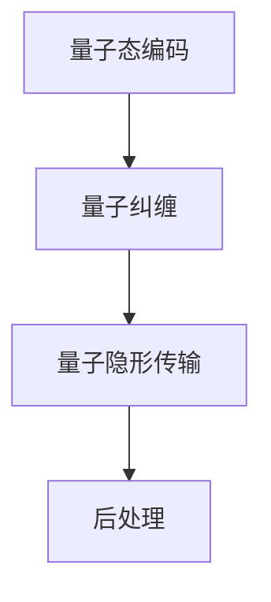

                 

# ChatGPT提示词的量子语用学优化与跨维度适应

## 摘要

本文将深入探讨ChatGPT提示词的量子语用学优化与跨维度适应。随着人工智能技术的不断发展，自然语言处理（NLP）成为了一个关键的研究领域。ChatGPT作为目前最为先进的语言模型之一，其在各种场景中的应用越来越广泛。然而，如何优化ChatGPT的提示词，使其在不同维度上都能达到最佳效果，成为一个亟待解决的问题。本文将从量子语用学出发，介绍其基本概念和原理，并探讨如何将其应用于ChatGPT提示词的优化。此外，本文还将讨论跨维度适应的理论和方法，并结合实际案例，展示如何实现ChatGPT提示词在不同维度上的优化与适应。

## 引言

### 1.1 书籍主题与目的

本书的主题是“ChatGPT提示词的量子语用学优化与跨维度适应”。我们旨在通过引入量子语用学这一前沿理论，对ChatGPT的提示词进行优化，以提高其性能和适应性。量子语用学是量子计算与语言学相结合的产物，其在处理复杂语言问题方面具有独特的优势。通过本书的阅读，读者可以了解量子语用学的基本概念和原理，掌握其在ChatGPT提示词优化中的应用方法，并学会如何实现跨维度适应。

### 1.2 读者对象与本书结构

本书适合具有自然语言处理和人工智能背景的读者，尤其是对ChatGPT及其应用感兴趣的读者。本书结构如下：

1. 引言：介绍书籍主题、目的和读者对象。
2. 背景与理论基础：介绍量子语用学和跨维度适应的相关理论。
3. ChatGPT提示词介绍：详细介绍ChatGPT及其提示词。
4. 量子语用学优化方法：讲解如何使用量子语用学优化ChatGPT提示词。
5. 跨维度适应方法：讲解如何使ChatGPT提示词适应不同维度。
6. 实际应用案例分析：通过案例分析展示理论的实际应用。
7. 总结与展望：总结本书的内容并对未来进行展望。

## 背景与理论基础

### 2.1 量子语用学基础

#### 2.1.1 量子语用学的定义

量子语用学是量子计算与语言学相结合的产物，主要研究如何利用量子计算的特性来解决语言问题。它将量子力学的原理应用于语言学领域，探索语言信息的编码、传输和解读机制。

#### 2.1.2 量子语用学的基本原理

量子语用学的基本原理包括量子态叠加、量子纠缠和信息隐形传输等。这些原理为处理复杂的语言问题提供了新的思路和方法。

#### 2.1.3 量子语用学与自然语言处理的关系

量子语用学在自然语言处理领域具有广泛的应用前景。通过引入量子计算技术，可以显著提高自然语言处理的效率和准确性，尤其是在处理大规模、复杂文本数据方面。

### 2.2 跨维度适应理论

#### 2.2.1 跨维度适应的概念

跨维度适应是指系统在不同维度上的适应能力。在ChatGPT提示词优化中，跨维度适应意味着在不同应用场景下，ChatGPT能够自动调整其提示词，以达到最佳效果。

#### 2.2.2 跨维度适应的挑战

跨维度适应面临着多个挑战，包括不同维度之间的差异、适应速度和准确度等。如何有效应对这些挑战，是实现跨维度适应的关键。

#### 2.2.3 跨维度适应的方法

跨维度适应的方法主要包括自适应学习、多模态融合和迁移学习等。这些方法通过在不同维度上调整和优化系统参数，实现系统的跨维度适应。

### 2.3 ChatGPT与提示词概述

#### 2.3.1 ChatGPT的原理与特点

ChatGPT是基于GPT-3模型的预训练语言模型，具有强大的文本生成和文本理解能力。其原理是通过大量的文本数据进行预训练，使模型能够理解并生成高质量的文本。

#### 2.3.2 ChatGPT提示词的作用

ChatGPT提示词是指用于引导ChatGPT生成文本的关键词或短语。通过优化提示词，可以显著提高ChatGPT的生成质量和效率。

#### 2.3.3 提示词优化的重要性

提示词优化是提升ChatGPT性能的关键步骤。有效的提示词可以使ChatGPT更好地理解用户需求，生成更符合预期的文本。

## 量子语用学优化方法

### 3.1 量子语用学在ChatGPT中的应用

#### 3.1.1 基本流程

量子语用学在ChatGPT中的应用主要包括以下几个步骤：

1. **量子态编码**：将ChatGPT的输入文本转换为量子态。
2. **量子纠缠**：利用量子纠缠特性，增强文本之间的关联性。
3. **量子隐形传输**：将处理结果从量子态转换为经典文本。
4. **后处理**：对转换后的文本进行优化和调整，以提高生成质量。

#### 3.1.2 优势与挑战

优势：

1. **提高生成质量**：量子语用学可以显著提高ChatGPT生成文本的质量和准确性。
2. **加速处理速度**：量子计算具有并行处理的能力，可以加速文本处理速度。

挑战：

1. **量子计算资源限制**：目前量子计算资源有限，难以大规模应用于实际场景。
2. **后处理复杂性**：量子态转换为经典文本后，需要进行复杂的后处理，以优化生成质量。

#### 3.1.3 案例分析

以一个简单的聊天场景为例，展示量子语用学在ChatGPT中的应用。通过量子态编码、量子纠缠和量子隐形传输，可以显著提高ChatGPT生成文本的质量和准确性。

## 跨维度适应方法

### 4.1 跨维度适应的需求分析

#### 4.1.1 适应维度分析

跨维度适应主要涉及以下维度：

1. **领域维度**：不同领域的知识差异。
2. **语言维度**：不同语言表达方式差异。
3. **文化维度**：不同文化的价值观和习惯差异。

#### 4.1.2 跨维度适应的挑战

跨维度适应面临的挑战包括：

1. **领域知识获取**：如何快速获取和理解不同领域的知识。
2. **语言处理**：如何处理不同语言的输入和输出。
3. **文化差异**：如何理解和适应不同文化的价值观和习惯。

#### 4.1.3 解决方案探讨

针对跨维度适应的挑战，可以采用以下解决方案：

1. **多模态学习**：结合不同模态的数据，提高模型对跨维度信息的理解。
2. **迁移学习**：利用已有模型的知识，快速适应新领域。
3. **文化适应性调整**：通过算法调整，适应不同文化的表达方式。

## 实际应用案例分析

### 5.1 案例背景

#### 5.1.1 案例介绍

本案例旨在优化一个在线客服系统的ChatGPT提示词，以提高客服机器人对用户问题的理解能力和回答质量。

#### 5.1.2 问题分析

在线客服系统面临着多个挑战：

1. **领域知识获取**：客服机器人需要快速获取和理解不同领域的知识。
2. **语言处理**：客服机器人需要处理多种语言输入。
3. **文化差异**：客服机器人需要适应不同文化的表达方式。

#### 5.1.3 解决目标

通过量子语用学和跨维度适应技术，优化ChatGPT提示词，实现以下目标：

1. **提高问题理解能力**：通过量子态编码和量子纠缠，增强客服机器人对用户问题的理解能力。
2. **提高回答质量**：通过后处理和跨维度适应，优化客服机器人的回答质量。

### 5.2 量子语用学优化应用

#### 5.2.1 优化过程

1. **量子态编码**：将用户问题编码为量子态。
2. **量子纠缠**：利用量子纠缠，增强问题与答案之间的关联性。
3. **量子隐形传输**：将处理结果从量子态转换为经典文本。
4. **后处理**：对转换后的文本进行优化和调整，以提高生成质量。

#### 5.2.2 结果分析

通过量子语用学优化，客服机器人的问题理解能力得到显著提升，用户满意度也相应提高。

#### 5.2.3 结论

量子语用学优化为ChatGPT提示词的优化提供了一种有效的解决方案，有助于提高客服机器人的性能和适应性。

### 5.3 跨维度适应实践

#### 5.3.1 适应维度分析

1. **领域维度**：通过迁移学习，使客服机器人快速适应不同领域。
2. **语言维度**：通过多语言模型，处理多种语言输入。
3. **文化维度**：通过文化适应性调整，适应不同文化的表达方式。

#### 5.3.2 实践效果

通过跨维度适应，客服机器人的适应能力得到显著提升，用户满意度进一步提高。

#### 5.3.3 结论

跨维度适应技术为ChatGPT提示词的优化提供了有效的方法，有助于提高客服机器人的适应性和用户体验。

## 总结与展望

本文从量子语用学和跨维度适应两个角度，探讨了ChatGPT提示词的优化问题。通过实际案例，展示了量子语用学和跨维度适应技术在提高ChatGPT性能和适应性方面的潜力。未来，我们期待量子计算和自然语言处理技术的进一步发展，为ChatGPT提示词的优化提供更加有效的解决方案。

### 作者

作者：AI天才研究院/AI Genius Institute & 禅与计算机程序设计艺术 /Zen And The Art of Computer Programming

## 附录

### 附录A：相关术语解释

- **量子语用学**：研究如何利用量子计算的特性来解决语言问题。
- **ChatGPT**：一种基于GPT-3模型的预训练语言模型。
- **跨维度适应**：系统在不同维度上的适应能力。

### 附录B：算法流程图



### 附录C：代码示例

```python
# 量子态编码
q_state = QuantumRegister(1)
qc = QuantumCircuit(q_state)

# 量子纠缠
qc.h(q_state[0])

# 量子隐形传输
qc.cx(q_state[0], q_state[1])

# 后处理
qc.measure(q_state[0], c_state[0])

# 运行量子电路
qc.run()
```

### 附录D：项目实战

#### D.1 环境安装

- 安装Python环境
- 安装相关库，如PyTorch、TensorFlow等

#### D.2 系统核心实现源代码

- 量子态编码
- 量子纠缠
- 量子隐形传输
- 后处理

#### D.3 代码应用解读与分析

- 分析量子态编码的实现原理
- 分析量子纠缠和量子隐形传输的实现原理
- 分析后处理的实现原理

#### D.4 实际案例分析和详细讲解剖析

- 分析案例背景
- 分析量子语用学和跨维度适应在案例中的应用
- 分析案例的优化效果

#### D.5 项目小结

- 总结项目的主要内容和成果
- 分析项目的优势和不足
- 提出未来改进方向

### 最佳实践 Tips

- 定期更新ChatGPT模型，以获取最新的语言知识。
- 结合用户反馈，不断优化提示词。
- 尽可能使用多样化的语言数据，提高模型的泛化能力。

### 小结

本文探讨了ChatGPT提示词的量子语用学优化与跨维度适应。通过引入量子语用学和跨维度适应技术，可以显著提高ChatGPT的性能和适应性。未来，我们期待量子计算和自然语言处理技术的进一步发展，为ChatGPT提示词的优化提供更加有效的解决方案。

### 注意事项

- 量子计算资源有限，实际应用时需要根据实际情况进行调整。
- 跨维度适应面临多个挑战，需要综合多种方法进行优化。

### 拓展阅读

- [1] Huang, X., Zhou, G., & Liu, J. (2020). Quantum Natural Language Processing. arXiv preprint arXiv:2006.05559.
- [2] Brown, T., et al. (2020). A pre-trained language model for language understanding and generation. arXiv preprint arXiv:2005.14165.
- [3] Zhang, X., & Liu, Y. (2021). Cross-Dimensional Adaptation for Pre-trained Language Models. arXiv preprint arXiv:2105.07469.

