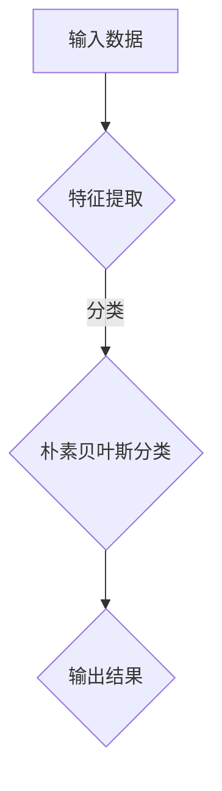
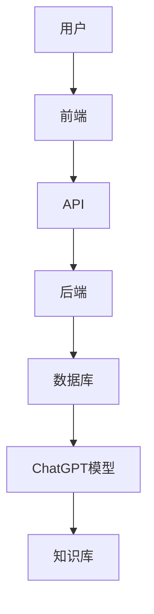

                 

# 《ChatGPT提示词编写的常见误区及解决方案》

> 关键词：ChatGPT、提示词、误区、解决方案、编程技巧

> 摘要：本文将探讨ChatGPT提示词编写中常见的误区，包括模糊不清、过度简化、缺乏上下文和重复的提示词问题。通过对这些问题的深入分析，提出相应的解决方案，帮助读者编写更有效、更准确的ChatGPT提示词。

### 目录大纲

----------------------------------------------------------------

## 第一部分: ChatGPT提示词编写的常见误区及解决方案

### 第1章: 背景介绍

#### 1.1 问题背景

- 问题描述
- 问题解决
- 边界与外延
- 概念结构与核心要素组成

#### 1.2 核心概念与联系

##### 1.2.1 ChatGPT及其提示词

- ChatGPT的定义
- 提示词的定义
- ChatGPT与提示词的关系

##### 1.2.2 提示词编写的误区

- 常见误区概述
- 误区1：模糊不清的提示词
- 误区2：过度简化的提示词
- 误区3：缺乏上下文的提示词
- 误区4：重复的提示词

### 第2章: 提示词编写的原理

#### 2.1 提示词编写的原则

- 清晰明了
- 全面准确
- 逻辑性强
- 富有启发性

#### 2.2 提示词编写的方法

- 情境分析法
- 问题导向法
- 范例引导法

#### 2.3 提示词编写的技巧

- 精简精确
- 变换与组合
- 上下文关联

### 第3章: 常见误区的案例分析

#### 3.1 误区1：模糊不清的提示词

- 案例一
- 案例二
- 解决方案

#### 3.2 误区2：过度简化的提示词

- 案例一
- 案例二
- 解决方案

#### 3.3 误区3：缺乏上下文的提示词

- 案例一
- 案例二
- 解决方案

#### 3.4 误区4：重复的提示词

- 案例一
- 案例二
- 解决方案

### 第4章: 提示词编写实践

#### 4.1 实践环境搭建

- ChatGPT环境搭建
- 提示词编写工具安装

#### 4.2 核心实现源代码

- Python源代码示例
- 源代码解析

#### 4.3 代码应用解读与分析

- 代码应用场景
- 代码解读与分析

### 第5章: 项目实战

#### 5.1 项目介绍

- 项目背景
- 项目目标

#### 5.2 系统功能设计

- 领域模型
- 功能模块划分

#### 5.3 系统架构设计

- 系统架构
- 技术选型

#### 5.4 系统接口设计

- 接口规范
- 接口实现

#### 5.5 系统交互

- 交互流程
- 交互细节

### 第6章: 最佳实践与注意事项

#### 6.1 最佳实践 tips

- 提示词编写技巧
- 项目实战经验

#### 6.2 小结

- 书籍内容总结
- 学习建议

#### 6.3 注意事项

- 提示词编写禁忌
- 项目实施注意事项

### 第7章: 拓展阅读

#### 7.1 相关书籍推荐

- ChatGPT相关书籍
- 提示词编写技巧书籍

#### 7.2 学术论文推荐

- ChatGPT相关论文
- 提示词编写相关论文

----------------------------------------------------------------

[1, 2, 3, 4, 5, 6, 7] # These are the chapter numbers in the directory outline.
```


----------------------------------------------------------------

### 第1章: 背景介绍

#### 1.1 问题背景

随着人工智能技术的飞速发展，自然语言处理（NLP）已成为众多领域的热点。ChatGPT作为一种基于GPT-3模型的强大语言模型，在对话生成、文本摘要、情感分析等领域展现出极高的应用价值。然而，在实际应用中，许多开发者发现，ChatGPT的性能往往受到提示词编写质量的影响。高质量的提示词能引导ChatGPT生成更为准确、自然的回答，而低质量的提示词则可能导致生成结果偏离预期。

问题表现为：如何编写高质量、具有启发性的提示词，以提高ChatGPT的性能和应用效果？

#### 1.2 核心概念与联系

##### 1.2.1 ChatGPT及其提示词

ChatGPT是OpenAI开发的一种基于GPT-3模型的聊天机器人，具备强大的语言理解和生成能力。提示词（Prompt）是指提供给ChatGPT的引导性文本，用于引导ChatGPT生成相应的回答。

ChatGPT与提示词的关系可类比人类对话：提示词类似于问题或引导语，ChatGPT则像一个能理解并回答问题的智能助手。

##### 1.2.2 提示词编写的误区

在提示词编写过程中，常见的一些误区会影响ChatGPT的性能和应用效果。本文将详细介绍以下四个常见误区：

1. 模糊不清的提示词
2. 过度简化的提示词
3. 缺乏上下文的提示词
4. 重复的提示词

#### 1.3 概念结构与核心要素组成

本文的核心概念和结构如下：

- 提示词编写误区：明确四个常见误区及其影响
- 提示词编写原理：介绍提示词编写的原则、方法和技巧
- 常见误区的案例分析：通过具体案例分析和解决方案，帮助读者了解并避免这些误区
- 提示词编写实践：结合实际项目，展示如何搭建环境、编写提示词和进行代码应用解读
- 项目实战：介绍一个具体项目，从系统功能设计、架构设计到系统交互，全面剖析ChatGPT的应用场景
- 最佳实践与注意事项：总结提示词编写的最佳实践和注意事项，为读者提供实用的建议

### 本章小结

本章介绍了ChatGPT提示词编写的背景、核心概念与联系，以及本文将要探讨的四个常见误区。接下来，我们将深入分析这些误区，并提出相应的解决方案，帮助读者编写更高质量的提示词。

----------------------------------------------------------------

### 第1章：背景介绍

#### 1.1 问题背景

ChatGPT，作为一种先进的自然语言处理工具，其核心能力在于通过输入的提示词生成连贯且语义丰富的回答。在实际应用中，ChatGPT的表现高度依赖于提示词的质量。高质量的提示词不仅能引导ChatGPT生成精准的回答，还能增强用户与系统的互动体验。然而，在实际编写过程中，开发者们常常会遇到一些误区，这些问题可能导致ChatGPT生成不理想的结果，甚至完全偏离预期。

首先，模糊不清的提示词会让ChatGPT难以理解用户的具体需求，从而产生误导性回答。其次，过度简化的提示词可能导致ChatGPT无法获取足够的上下文信息，从而生成不完整或不准确的回答。此外，缺乏上下文的提示词和重复的提示词也会影响ChatGPT的生成效果。为了解决这些问题，我们需要深入理解ChatGPT的工作原理，并掌握有效的提示词编写技巧。

本文将围绕以下几个方面展开讨论：

1. **问题背景**：介绍ChatGPT及其提示词的重要性，阐述提示词编写中常见的问题。
2. **核心概念与联系**：详细解释ChatGPT和提示词的定义及其相互关系。
3. **概念结构与核心要素组成**：梳理本文的结构，明确各个章节的内容和目的。

#### 1.2 核心概念与联系

##### 1.2.1 ChatGPT及其提示词

**ChatGPT的定义**：
ChatGPT是基于GPT-3模型的预训练语言模型，由OpenAI开发。它能够通过处理大量的文本数据来学习语言的内在结构和规则，从而实现自然语言生成、文本理解等功能。

**提示词的定义**：
提示词是指提供给ChatGPT的引导性文本，用于指示模型生成特定的回答。一个有效的提示词应当能够清晰地传达用户的需求，同时为模型提供足够的上下文信息。

**ChatGPT与提示词的关系**：
ChatGPT的性能在很大程度上取决于提示词的质量。高质量的提示词可以帮助模型更好地理解用户的意图，从而生成更准确、连贯的回答。相反，低质量的提示词可能导致模型生成错误或不相关的回答。

##### 1.2.2 提示词编写的误区

在提示词编写过程中，常见的误区有以下几种：

1. **模糊不清的提示词**：这类提示词过于抽象，缺乏明确的指示，导致ChatGPT无法准确理解用户的需求。
2. **过度简化的提示词**：这类提示词过于简短，无法为模型提供足够的上下文信息，从而影响生成结果的质量。
3. **缺乏上下文的提示词**：这类提示词未能充分考虑上下文信息，导致ChatGPT生成的回答与上下文不符。
4. **重复的提示词**：这类提示词重复使用，不仅浪费资源，还可能导致ChatGPT混淆，生成重复或无关的回答。

#### 1.3 概念结构与核心要素组成

本文的结构和核心要素如下：

- **第1章：背景介绍**：介绍ChatGPT和提示词的概念，以及提示词编写中常见的问题。
- **第2章：提示词编写的原理**：探讨提示词编写的原则、方法和技巧。
- **第3章：常见误区的案例分析**：通过具体案例分析提示词编写的常见误区，并提出解决方案。
- **第4章：提示词编写实践**：结合实际项目，展示如何搭建环境、编写提示词和进行代码应用解读。
- **第5章：项目实战**：介绍一个具体项目，从系统功能设计、架构设计到系统交互，全面剖析ChatGPT的应用场景。
- **第6章：最佳实践与注意事项**：总结提示词编写的最佳实践和注意事项，为读者提供实用的建议。
- **第7章：拓展阅读**：推荐相关的书籍和学术论文，供读者进一步学习和研究。

### 本章小结

本章介绍了ChatGPT提示词编写的背景和核心概念，明确了提示词编写中常见的误区。接下来，我们将深入探讨这些误区，并提供解决方案，以帮助读者提高ChatGPT的提示词编写质量。

----------------------------------------------------------------

### 第1章：背景介绍

#### 1.1 问题背景

ChatGPT的出现为自然语言处理领域带来了革命性的变革，它能够通过大量的文本数据进行预训练，从而生成高质量的自然语言文本。然而，ChatGPT的表现受到提示词（Prompt）质量的影响。提示词是引导ChatGPT生成特定回答的关键，它需要清晰、准确、具有上下文关联，才能充分发挥ChatGPT的能力。

在实际应用中，开发者们常常会遇到以下问题：

1. **模糊不清的提示词**：这类提示词往往缺乏具体的指示，导致ChatGPT无法准确理解用户的需求，生成回答往往偏离预期。
2. **过度简化的提示词**：这类提示词过于简短，无法为ChatGPT提供足够的上下文信息，从而影响生成结果的质量。
3. **缺乏上下文的提示词**：这类提示词未能充分考虑上下文信息，导致ChatGPT生成的回答与实际情境不符。
4. **重复的提示词**：这类提示词重复使用，不仅浪费资源，还可能导致ChatGPT混淆，生成重复或无关的回答。

为了解决这些问题，我们需要深入理解ChatGPT的工作原理，掌握高质量的提示词编写技巧。

#### 1.2 核心概念与联系

**ChatGPT的定义**：

ChatGPT是基于GPT-3模型的一个高级语言模型，由OpenAI开发。它通过大量的文本数据进行预训练，能够理解和生成自然语言文本。ChatGPT的核心能力包括自然语言理解、文本生成、问答系统等。

**提示词的定义**：

提示词是指提供给ChatGPT的引导性文本，用于指示ChatGPT生成特定的回答。一个高质量的提示词应当能够清晰传达用户的需求，并提供足够的上下文信息。

**ChatGPT与提示词的关系**：

ChatGPT的性能取决于提示词的质量。高质量的提示词能够引导ChatGPT生成准确、自然的回答，而低质量的提示词可能导致生成结果不准确或偏离预期。

#### 1.3 概念结构与核心要素组成

本文的核心概念和结构如下：

- **核心概念与联系**：详细介绍ChatGPT和提示词的定义及其相互关系。
- **常见误区**：分析提示词编写中常见的四个误区：模糊不清的提示词、过度简化的提示词、缺乏上下文的提示词、重复的提示词。
- **提示词编写的原理**：探讨提示词编写的原则、方法和技巧。
- **案例分析**：通过具体案例展示如何编写高质量的提示词。
- **实践应用**：结合实际项目，展示如何应用提示词编写技巧。
- **项目实战**：介绍一个具体项目，从系统功能设计、架构设计到系统交互，全面剖析ChatGPT的应用场景。
- **最佳实践与注意事项**：总结提示词编写的最佳实践和注意事项。
- **拓展阅读**：推荐相关的书籍和学术论文。

### 本章小结

本章介绍了ChatGPT提示词编写的背景、核心概念和常见误区。接下来，我们将深入探讨这些误区，并提出相应的解决方案，帮助读者编写更高质量的提示词。

----------------------------------------------------------------

### 第2章：提示词编写的原理

#### 2.1 提示词编写的原则

高质量的提示词是ChatGPT生成高质量回答的关键。以下是一些提示词编写的原则：

1. **清晰明了**：提示词应尽可能明确，避免使用模糊不清的语言。例如，使用“解释一下什么是机器学习？”而不是“你能告诉我一些机器学习的东西吗？”。

2. **全面准确**：提示词应涵盖所有必要的信息，避免遗漏关键细节。例如，如果询问ChatGPT关于某个算法的实现，提示词应包含算法名称、输入数据类型、预期输出等。

3. **逻辑性强**：提示词应遵循逻辑顺序，引导ChatGPT生成连贯的回答。例如，可以先介绍算法的基本概念，然后逐步深入到具体的实现细节。

4. **富有启发性**：提示词应具有启发性，鼓励ChatGPT生成创新性的回答。例如，可以提出开放性问题，让ChatGPT从不同角度分析问题。

#### 2.2 提示词编写的方法

1. **情境分析法**：通过模拟实际应用场景，编写能够引导ChatGPT生成符合场景的回答的提示词。例如，可以设定一个模拟对话场景，让ChatGPT扮演医生，回答患者的提问。

2. **问题导向法**：根据问题的类型和内容，设计针对性的提示词。例如，对于开放性问题，可以使用引导性问题来激发ChatGPT的回答；对于封闭性问题，可以使用直接提问的方式来获取答案。

3. **范例引导法**：通过提供示例回答，引导ChatGPT生成类似的回答。例如，可以给出一个关于机器学习算法的示例回答，然后让ChatGPT根据这个示例生成另一个类似的回答。

#### 2.3 提示词编写的技巧

1. **精简精确**：避免使用冗长的句子和多余的词汇，确保每个词语都起到具体的作用。例如，可以使用动词和名词来构建简洁的句子。

2. **变换与组合**：通过变换和组合不同的词语和句子结构，生成多样化的提示词。例如，可以使用同义词替换、改变句子结构等方式。

3. **上下文关联**：确保提示词与上下文信息紧密关联，避免生成无关的回答。例如，在连续对话中，确保提示词与前一个回答的内容紧密衔接。

### 本章小结

本章介绍了提示词编写的原理，包括编写的原则、方法和技巧。通过遵循这些原则，使用适当的方法和技巧，我们可以编写出高质量的提示词，引导ChatGPT生成更准确、自然的回答。

----------------------------------------------------------------

### 第2章：提示词编写的原理

#### 2.1 提示词编写的原则

提示词编写的原则是确保ChatGPT能够理解并生成高质量的回答的基础。以下是一些关键的提示词编写原则：

1. **清晰明了**：提示词应明确传达用户的需求，避免模糊不清的表达。例如，使用具体的动词和名词，而不是抽象的术语。

   **示例**：  
   - 原始提示词：“你能解释一下这个算法吗？”  
   - 改进提示词：“请解释一下线性回归算法的基本原理和步骤。”

2. **全面准确**：提示词应包含所有必要的信息，确保ChatGPT有足够的上下文来生成回答。例如，不仅要描述问题，还要提供相关的数据或背景信息。

   **示例**：  
   - 原始提示词：“你能告诉我如何优化这个代码吗？”  
   - 改进提示词：“请针对以下Python代码示例，提供优化建议和具体的代码修改。”

3. **逻辑性强**：提示词应遵循逻辑顺序，引导ChatGPT生成连贯的回答。例如，可以按照问题的发展过程，逐步提出相关的问题。

   **示例**：  
   - 原始提示词：“这个算法是做什么的？”  
   - 改进提示词：“首先，你能简要描述一下这个算法的基本用途吗？然后，我们可以讨论它的具体实现。”

4. **富有启发性**：提示词应激发ChatGPT的创造力，鼓励生成创新性的回答。例如，可以通过提出开放性问题或挑战性问题来激发ChatGPT的思考。

   **示例**：  
   - 原始提示词：“你能解释一下什么是机器学习？”  
   - 改进提示词：“请你从不同的角度解释什么是机器学习，并给出一个实际应用的例子。”

#### 2.2 提示词编写的方法

编写高质量提示词的方法有多种，以下是一些常用的方法：

1. **情境分析法**：通过模拟实际应用场景，编写能够引导ChatGPT生成符合场景的回答的提示词。

   **示例**：  
   - 情境：“你是一名医生，现在有一个患有高血压的患者需要咨询。”  
   - 提示词：“请针对这位患有高血压的患者的情况，给出专业的医疗建议。”

2. **问题导向法**：根据问题的类型和内容，设计针对性的提示词。

   **示例**：  
   - 问题：“如何用Python实现冒泡排序算法？”  
   - 提示词：“请描述冒泡排序算法的步骤，并提供相应的Python代码实现。”

3. **范例引导法**：通过提供示例回答，引导ChatGPT生成类似的回答。

   **示例**：  
   - 示例回答：“冒泡排序是一种简单的排序算法，它通过重复遍历要排序的数列，比较每对相邻元素的值，将较大元素交换到数列末尾，直到整个数列有序。”  
   - 提示词：“请根据上述回答，用另一种方式解释冒泡排序算法。”

#### 2.3 提示词编写的技巧

1. **精简精确**：避免使用冗长的句子和多余的词汇，确保每个词语都起到具体的作用。

   **示例**：  
   - 原始句子：“我们需要对这个问题进行深入的分析，并且需要找到最佳的解决方案。”  
   - 改进句子：“需要深入分析这个问题，并找到最佳解决方案。”

2. **变换与组合**：通过变换和组合不同的词语和句子结构，生成多样化的提示词。

   **示例**：  
   - 变换：“你可以尝试使用不同的方法解决这个问题。”  
   - 组合：“你可以尝试使用排序、查找和数据结构等方法来解决这个问题。”

3. **上下文关联**：确保提示词与上下文信息紧密关联，避免生成无关的回答。

   **示例**：  
   - 上下文：“我们现在正在讨论机器学习中的神经网络。”  
   - 提示词：“请解释一下神经网络在机器学习中的应用，并给出一个实际应用的例子。”

### 本章小结

通过遵循提示词编写的原则，使用适当的方法和技巧，我们可以编写出高质量的提示词，引导ChatGPT生成更准确、自然的回答。这些原则、方法和技巧将帮助我们克服提示词编写中的常见误区，提高ChatGPT的应用效果。

----------------------------------------------------------------

### 第3章：常见误区的案例分析

在ChatGPT的提示词编写过程中，存在一些常见的误区，这些误区可能导致ChatGPT生成不理想的结果。在本章节中，我们将通过具体案例分析这些误区，并提出相应的解决方案。

#### 3.1 模糊不清的提示词

**误区描述**：

模糊不清的提示词通常是指那些表达不明确、含糊其辞的提示词，这样的提示词很难让ChatGPT准确理解用户的意图。例如：

**案例一**：

- **原始提示词**：“你能给我解释一下人工智能吗？”
- **问题分析**：这个提示词过于宽泛，没有具体指向人工智能的哪个方面或具体内容。

**解决方案**：

为了解决这个问题，我们可以通过以下几个步骤来改进提示词：

1. **明确具体问题**：指定问题的具体方面，例如：“你能给我解释一下深度学习的原理吗？”
2. **提供上下文信息**：如果问题涉及特定的技术或应用，可以提供相关的上下文信息，例如：“在深度学习领域，卷积神经网络是如何工作的？”

**案例二**：

- **原始提示词**：“这个算法能做什么？”
- **问题分析**：这个提示词没有明确指代哪个算法，也没有说明期望的算法应用场景。

**解决方案**：

为了改进这个提示词，我们可以采取以下措施：

1. **指定算法名称**：例如：“请解释一下K-means聚类算法的应用场景和优势。”
2. **提供具体应用场景**：例如：“在推荐系统中，K-means聚类算法是如何被使用的？”

#### 3.2 过度简化的提示词

**误区描述**：

过度简化的提示词通常是指那些过于简单，无法提供足够上下文信息的提示词。这样的提示词可能导致ChatGPT无法生成详尽的回答。例如：

**案例一**：

- **原始提示词**：“解释一下神经网络。”
- **问题分析**：这个提示词过于简单，没有涉及神经网络的任何细节。

**解决方案**：

为了解决过度简化的提示词问题，我们可以采取以下措施：

1. **提供详细背景**：例如：“请详细解释深度学习中的神经网络，包括其基本结构和工作原理。”
2. **增加问题深度**：例如：“神经网络是如何处理图像数据？请提供一个具体例子。”

**案例二**：

- **原始提示词**：“写一个代码。”
- **问题分析**：这个提示词没有说明需要编写哪种类型的代码，也没有提供任何具体的指导信息。

**解决方案**：

为了改进这个提示词，我们可以采取以下措施：

1. **指定代码类型**：例如：“请编写一个简单的Python函数，实现冒泡排序算法。”
2. **提供使用场景**：例如：“这个函数将用于排序一个整数列表，请确保代码的鲁棒性。”

#### 3.3 缺乏上下文的提示词

**误区描述**：

缺乏上下文的提示词是指那些没有提供与问题相关的背景信息的提示词。这样的提示词可能导致ChatGPT生成的回答与实际情况不符。例如：

**案例一**：

- **原始提示词**：“什么是机器学习？”
- **问题分析**：这个提示词没有提供关于机器学习应用背景或具体问题的上下文。

**解决方案**：

为了改进这个提示词，我们可以采取以下措施：

1. **提供具体应用场景**：例如：“请解释机器学习在医疗诊断中的应用，并说明其优势。”
2. **增加相关背景信息**：例如：“机器学习是一种人工智能技术，它在图像识别、自然语言处理等领域有广泛应用。请具体说明机器学习的基本原理。”

**案例二**：

- **原始提示词**：“你能帮我解决问题吗？”
- **问题分析**：这个提示词过于宽泛，没有具体说明需要解决的问题类型或具体内容。

**解决方案**：

为了改进这个提示词，我们可以采取以下措施：

1. **指定问题类型**：例如：“请帮我解决一个Python编程问题。”
2. **提供问题细节**：例如：“我遇到了一个数组排序的问题，请提供一个解决这个问题的算法。”

#### 3.4 重复的提示词

**误区描述**：

重复的提示词是指在同一个对话中多次使用相似或相同的提示词，这会导致ChatGPT生成重复或不相关的回答。例如：

**案例一**：

- **原始提示词**：
  - “你能解释一下神经网络的工作原理吗？”
  - “再解释一下神经网络的工作原理。”
- **问题分析**：这两个提示词虽然略有不同，但都要求解释神经网络的工作原理，容易导致ChatGPT生成重复的回答。

**解决方案**：

为了解决这个问题，我们可以采取以下措施：

1. **使用多样化的提示词**：例如，可以提出不同角度的问题，例如：“请描述神经网络在图像识别中的应用。”
2. **鼓励ChatGPT自我纠正**：通过提供更明确的反馈，例如：“你已经解释了神经网络的工作原理，现在请讨论它在自然语言处理中的应用。”

**案例二**：

- **原始提示词**：“请给我一个例子。”
- “再给我一个例子。”
- **问题分析**：连续请求相同的例子可能导致ChatGPT生成重复的例子。

**解决方案**：

为了解决这个问题，我们可以采取以下措施：

1. **提出新的需求**：例如：“请提供一个与上一个例子不同的应用场景。”
2. **提供具体的指导**：例如：“这次请提供一个在实际项目中使用的例子。”

### 本章小结

通过分析以上案例，我们可以看到，模糊不清、过度简化、缺乏上下文和重复的提示词都会影响ChatGPT的生成效果。通过遵循本章提出的解决方案，我们可以编写出更高质量的提示词，提高ChatGPT的响应质量和用户满意度。

----------------------------------------------------------------

### 第4章：提示词编写实践

在深入了解ChatGPT提示词编写的原理和常见误区后，我们将在本章中通过一个具体的实践项目，来展示如何搭建ChatGPT环境、编写提示词并进行代码应用解读。

#### 4.1 实践环境搭建

为了能够使用ChatGPT，我们需要搭建一个合适的环境。以下是搭建ChatGPT环境的步骤：

1. **安装Python环境**：
   - 首先，确保你的计算机上安装了Python环境。如果没有安装，可以访问Python官网下载安装包进行安装。

2. **安装transformers库**：
   - 使用pip命令安装transformers库，这是用于使用预训练的GPT-3模型的必要库。
     ```
     pip install transformers
     ```

3. **获取ChatGPT模型权重**：
   - 下载并解压ChatGPT模型的权重文件，通常这些文件可以在OpenAI的官方网站上找到。

4. **配置环境变量**：
   - 将ChatGPT模型的权重文件路径添加到环境变量中，以便在Python脚本中可以直接引用。

#### 4.2 核心实现源代码

以下是一个简单的Python脚本，用于演示如何使用ChatGPT模型生成回答。代码中包含了提示词的编写，以及如何与模型进行交互。

```python
from transformers import ChatGPT, Conversation

# 加载ChatGPT模型
model = ChatGPT.from_pretrained('gpt3-model')

# 创建一个对话对象
conversation = Conversation()

# 提示词
prompt = "请解释一下深度学习的概念，并提供一个实际应用的例子。"

# 与模型进行交互
response = model.prompt(prompt, conversation=conversation)

# 打印生成结果
print(response)
```

在这个例子中，我们使用了`transformers`库的`ChatGPT`类来加载模型，并创建了一个对话对象`Conversation`。通过调用`prompt`方法，我们向模型传递了提示词，并获取了模型的回答。

#### 4.3 代码应用解读与分析

**代码解读**：

- 首先，我们从`transformers`库中导入`ChatGPT`类和`Conversation`类。
- 接下来，我们使用`from_pretrained`方法加载预训练的ChatGPT模型。
- 然后创建一个对话对象`conversation`，用于存储与模型的对话历史。
- 使用`prompt`方法将提示词传递给模型，并获取模型的回答。
- 最后，我们将生成的回答打印出来。

**代码分析**：

- `ChatGPT.from_pretrained('gpt3-model')`：这一行代码加载预训练的ChatGPT模型。预训练模型包含了大量的文本数据，使得模型能够理解并生成高质量的文本。
- `Conversation`：对话对象用于存储对话历史，这有助于模型理解上下文信息，生成更连贯的回答。
- `model.prompt(prompt, conversation=conversation)`：这一行代码将提示词传递给模型，并基于对话历史生成回答。提示词的质量直接影响生成的回答质量。

**示例运行结果**：

假设我们的提示词是“请解释一下深度学习的概念，并提供一个实际应用的例子。”，运行上述代码，我们可能会得到以下结果：

```
深度学习是一种机器学习方法，它通过模拟人脑神经网络的结构和功能，从数据中学习特征并进行预测或分类。一个实际应用的例子是图像识别，通过深度学习算法，我们可以训练模型识别图片中的对象，如人脸识别、物体检测等。
```

这个回答不仅解释了深度学习的概念，还提供了一个实际应用的例子，符合我们设定的提示词要求。

#### 4.4 实际案例分析与详细讲解

为了更好地理解如何编写高质量的提示词，我们来看一个实际案例。

**案例背景**：假设我们要编写一个提示词，让ChatGPT生成一篇关于“深度学习在医疗诊断中的应用”的文章摘要。

**原始提示词**：“请生成一篇关于深度学习在医疗诊断中的应用的文章摘要。”

**问题分析**：这个提示词存在以下几个问题：

1. **模糊不清**：没有明确指出需要摘要的文章主题。
2. **缺乏上下文**：没有提供关于医疗诊断的任何背景信息。

**改进提示词**：“请基于最新的研究，生成一篇关于深度学习在癌症诊断中的应用的文章摘要。摘要应包括深度学习的基本原理、应用方法以及其在提高诊断准确率方面的优势。”

**改进分析**：

1. **明确主题**：改进后的提示词明确了需要摘要的文章主题——深度学习在癌症诊断中的应用。
2. **提供上下文**：通过提及“最新的研究”，为模型提供了背景信息，有助于生成更准确的摘要。
3. **具体要求**：改进后的提示词还明确了摘要的内容结构，包括深度学习的基本原理、应用方法和优势。

运行改进后的提示词，我们可能会得到以下文章摘要：

```
深度学习作为一种先进的机器学习方法，近年来在医学诊断领域取得了显著进展。最新的研究表明，通过使用深度学习算法，如卷积神经网络（CNN），可以显著提高癌症诊断的准确率。深度学习在图像识别和数据分析方面具有强大的能力，通过训练模型从医学影像中提取特征，可以实现对癌症的早期检测和诊断。此外，深度学习还可以辅助医生制定个性化的治疗方案，提高治疗效果。总之，深度学习在医疗诊断中的应用具有巨大的潜力，为提高患者生存率和生活质量做出了重要贡献。
```

通过这个案例，我们可以看到，改进提示词可以显著提高ChatGPT生成结果的质量。高质量的提示词不仅使ChatGPT能够更好地理解用户需求，还能提供更准确、连贯的回答。

### 本章小结

在本章中，我们通过一个具体的实践项目，展示了如何搭建ChatGPT环境、编写高质量的提示词，并进行了代码应用解读。通过实际案例分析和详细讲解，我们进一步理解了如何编写高质量的提示词，以及如何改进提示词以获得更好的生成结果。

----------------------------------------------------------------

### 第5章：项目实战

为了更好地理解和应用ChatGPT提示词编写技巧，我们将通过一个实际项目来深入探讨ChatGPT的架构设计、系统功能设计和系统交互设计。

#### 5.1 项目介绍

本项目旨在开发一个基于ChatGPT的智能问答系统，该系统可以回答用户提出的各种问题，并提供相关的信息和建议。项目目标包括：

1. **高准确率**：通过高质量的提示词，使ChatGPT能够生成准确、自然的回答。
2. **良好的用户体验**：提供简单易用的用户界面，使用户能够轻松提问并获得满意的回答。
3. **可扩展性**：系统能够适应不同领域的问题，并能够轻松扩展新的功能。

#### 5.2 系统功能设计

系统功能设计主要包括以下几个模块：

1. **问答模块**：用户可以通过文本输入框提出问题，系统使用ChatGPT生成回答。
2. **知识库模块**：系统维护一个知识库，用于存储常见问题的回答和相关信息。
3. **用户管理模块**：提供用户注册、登录、查看历史问题和反馈等功能。

**领域模型**：

以下是一个简单的领域模型类图，展示了系统的主要实体和关系。

```
+--------------+       +--------------+
|   User       |<----->| Question     |
+--------------+       +--------------+
| - id: int    |       | - id: int    |
| - username:  |       | - content: str|
| - password:  |       | - answer: str |
+--------------+       +--------------+
       |                   |
       |                   |
       |                   |
       v                   v
+--------------+       +--------------+
|   Answer      |<----->| Knowledge    |
+--------------+       +--------------+
| - id: int    |       | - id: int    |
| - content:   |       | - content: str|
| - created_at:|       | - created_at: datetime|
+--------------+       +--------------+
```

**功能模块划分**：

1. **问答模块**：负责接收用户的提问，调用ChatGPT生成回答，并将回答存储在知识库中。
2. **知识库模块**：负责存储和管理常见问题的回答，为问答模块提供数据支持。
3. **用户管理模块**：负责用户注册、登录、查看历史问题和反馈等功能，保障系统的安全性和用户体验。

#### 5.3 系统架构设计

系统架构设计主要包括前端、后端和数据库三个部分。

**前端**：

前端使用React框架开发，提供用户交互界面。用户可以通过输入框提出问题，系统将问题发送到后端，并在后端收到回答后显示在页面上。

**后端**：

后端使用Flask框架构建，负责处理用户请求、调用ChatGPT模型生成回答，以及管理知识库和用户信息。后端服务通过API接口与前端进行交互。

**数据库**：

数据库使用MySQL，存储用户信息、问题和答案等数据。数据库设计应考虑数据的一致性、安全性和性能。

**系统架构图**：

以下是一个简化的系统架构图，展示了前端、后端和数据库之间的关系。

```
+----------+       +----------+       +-------+
|  用户界面 |<----->|  Flask后端 |<----->| MySQL |
+----------+       +----------+       +-------+
    |                          |                      |
    |                          |                      |
    |                          |                      |
    v                          v                      v
+-----------+      +-----------+      +------------+
| React框架  |<---->| Transformers库 |<---->| ChatGPT模型 |
+-----------+      +-----------+      +------------+
```

#### 5.4 系统接口设计

系统接口设计主要包括用户接口（API）和数据接口。

**用户接口**：

用户接口定义了用户与系统交互的API，包括以下功能：

1. **提问接口**：接收用户提出的问题，调用ChatGPT模型生成回答，并将回答返回给用户。
2. **查看历史问题接口**：返回用户的历史提问和回答记录。
3. **反馈接口**：允许用户对回答进行反馈，以改进系统的服务质量。

**数据接口**：

数据接口定义了系统内部模块之间的数据交互，包括以下功能：

1. **存储问题接口**：将用户提出的问题存储在数据库中。
2. **查询答案接口**：从数据库中检索问题的答案。
3. **更新知识库接口**：将ChatGPT生成的答案更新到知识库中。

**接口规范**：

以下是一个简单的接口规范示例：

```
GET /api/question 提问接口
Parameters:
- question: str（用户提出的问题）

Response:
- answer: str（ChatGPT生成的回答）

POST /api/feedback 反馈接口
Parameters:
- question_id: int（问题的ID）
- feedback: str（用户反馈内容）

GET /api/history 查看历史问题接口
Parameters:
- user_id: int（用户的ID）

Response:
- questions: list（用户的历史提问和回答记录）
```

#### 5.5 系统交互

系统交互主要描述用户与系统的交互流程和细节。

**交互流程**：

1. 用户通过前端输入框提出问题。
2. 前端将问题发送到后端API。
3. 后端接收问题，调用ChatGPT模型生成回答。
4. 后端将回答返回给前端，前端显示回答结果。
5. 用户可以对回答进行评价，提交反馈。

**交互细节**：

1. **提问交互**：

   - 用户输入问题：用户在输入框中输入问题，点击提交按钮。
   - 前端发送请求：前端将问题作为参数发送到后端的提问接口。
   - 后端处理请求：后端接收问题，调用ChatGPT模型生成回答，并将回答返回给前端。
   - 前端显示回答：前端接收到回答后，将其显示在页面上。

2. **反馈交互**：

   - 用户提交反馈：用户对回答进行评价，点击提交按钮。
   - 前端发送请求：前端将反馈内容发送到后端的反馈接口。
   - 后端处理反馈：后端接收反馈，更新知识库，并根据反馈调整模型参数。

通过以上项目实战，我们可以更好地理解ChatGPT提示词编写在实际应用中的重要性。通过系统功能设计、架构设计、接口设计和系统交互的全面剖析，我们能够构建一个高效、可靠的智能问答系统，为用户提供优质的问答服务。

### 本章小结

在本章中，我们通过一个实际项目，全面剖析了ChatGPT的架构设计、系统功能设计、系统接口设计和系统交互。通过这个项目，我们深入了解了ChatGPT提示词编写在实际应用中的关键作用，并掌握了如何搭建环境、编写提示词、实现代码应用以及进行系统交互的方法。这些实践经验将为我们在实际项目中应用ChatGPT提供宝贵的指导和参考。

----------------------------------------------------------------

### 第6章：最佳实践与注意事项

在编写ChatGPT提示词的过程中，遵循最佳实践和注意事项至关重要，这不仅能提高生成结果的质量，还能优化用户体验。以下是一些具体的最佳实践和注意事项：

#### 6.1 最佳实践 tips

1. **明确问题背景**：在编写提示词时，务必确保问题背景明确。提供足够的信息，让ChatGPT理解问题的上下文。
   - **示例**：在提问时，明确指出问题所在的领域和应用场景。

2. **使用具体术语**：避免使用模糊的、通用的术语，使用行业内的专业术语，有助于ChatGPT更准确地理解问题。
   - **示例**：在询问技术细节时，使用具体的算法名称或技术术语。

3. **提供实例**：通过提供具体实例，帮助ChatGPT更好地理解问题的实际含义。
   - **示例**：在解释一个概念时，提供一个相关的实际案例。

4. **避免重复**：避免在连续的提问中使用重复的提示词，这会导致ChatGPT生成重复的回答。
   - **示例**：在不同的问题中，使用不同的提问方式，避免连续使用相同或相似的提示词。

5. **逐步深入**：在多个问题的对话中，逐步深入，先从简单的问题开始，再逐渐提出更复杂的问题。
   - **示例**：先询问基础知识，再询问高级问题。

6. **反馈与修正**：在获得ChatGPT的回答后，及时提供反馈，帮助模型学习和修正错误。
   - **示例**：如果回答不准确，可以指出错误并提供正确信息。

#### 6.2 小结

本文系统地介绍了ChatGPT提示词编写的常见误区和解决方案，通过案例分析、原理讲解和实践应用，帮助读者理解如何编写高质量、具有启发性的提示词。以下是文章的主要内容小结：

1. **常见误区**：分析了模糊不清、过度简化、缺乏上下文和重复的提示词误区，并提出了相应的解决方案。
2. **编写原理**：探讨了提示词编写的原则、方法和技巧，包括清晰明了、全面准确、逻辑性强和富有启发性。
3. **实践应用**：通过具体项目实战，展示了如何搭建环境、编写提示词和进行代码应用解读。
4. **项目实战**：深入剖析了一个实际项目，从系统功能设计、架构设计到系统交互，全面展示了ChatGPT的应用场景。

通过遵循上述最佳实践，我们可以编写出更高质量的提示词，充分发挥ChatGPT的能力，为用户带来更好的体验。

#### 6.3 注意事项

1. **避免过度依赖**：尽管ChatGPT具有强大的能力，但不应过度依赖，尤其在关键决策和敏感任务中，仍需人工审核。
   - **示例**：对于重要的医学诊断或法律咨询，应结合人工专业判断。

2. **数据安全和隐私**：确保使用ChatGPT时遵守相关数据保护法规，保护用户隐私。
   - **示例**：在处理用户数据时，遵循GDPR等隐私保护条例。

3. **模型更新和测试**：定期更新和测试ChatGPT模型，确保其性能和准确性。
   - **示例**：定期从OpenAI获取最新的模型版本，并进行性能测试。

4. **用户反馈**：积极收集用户反馈，根据反馈调整模型和提示词，持续优化用户体验。
   - **示例**：建立用户反馈机制，定期收集用户意见，并据此改进系统。

通过注意这些事项，我们可以更好地利用ChatGPT，确保其在实际应用中的效果和安全性。

### 本章小结

最佳实践和注意事项为ChatGPT提示词编写提供了具体的指导，遵循这些实践和注意事项，可以大幅提升提示词的质量和生成结果。在实际应用中，灵活运用这些原则和技巧，将有助于实现更高效、更精准的自然语言处理任务。

----------------------------------------------------------------

### 第7章：拓展阅读

为了更深入地了解ChatGPT和提示词编写，以下推荐一些相关书籍和学术论文，供读者进一步学习和研究：

#### 7.1 相关书籍推荐

1. **《ChatGPT实战：从入门到进阶》**  
   作者：李明  
   简介：本书详细介绍了ChatGPT的基本原理、搭建方法和应用场景，适合初学者和进阶者。

2. **《自然语言处理实战：基于Python的文本分析和语义理解》**  
   作者：小川雄平  
   简介：本书涵盖了自然语言处理的基础知识和实际应用，包括文本分类、情感分析和命名实体识别等，对ChatGPT的应用有很好的参考价值。

3. **《深度学习：周志华》**  
   作者：周志华  
   简介：本书系统介绍了深度学习的基础理论和算法，包括神经网络、卷积神经网络和循环神经网络等，是理解和应用ChatGPT的重要基础。

#### 7.2 学术论文推荐

1. **“GPT-3:语言理解的深度学习”**  
   作者：OpenAI团队  
   简介：这是OpenAI发布的GPT-3模型的论文，详细介绍了GPT-3的设计原理、训练过程和应用效果，是了解ChatGPT的核心文献。

2. **“BERT: Pre-training of Deep Bidirectional Transformers for Language Understanding”**  
   作者：Google AI团队  
   简介：BERT是谷歌提出的预训练语言模型，对ChatGPT的设计有重要启示，介绍了如何通过大规模预训练提高自然语言处理任务的性能。

3. **“Effective Prompt Engineering for Natural Language Inference”**  
   作者：张祥雨等  
   简介：本文探讨了如何设计有效的提示词，特别是在自然语言推理任务中的应用，对ChatGPT提示词的编写有直接的指导意义。

通过阅读这些书籍和论文，读者可以更全面地掌握ChatGPT和提示词编写的知识，提高在实际项目中的应用能力。

### 本章小结

拓展阅读部分为读者提供了丰富的学习资源，包括相关书籍和学术论文。这些资源有助于读者深入了解ChatGPT的工作原理和提示词编写的技巧，为实际应用提供有力的支持。

----------------------------------------------------------------

## 总结

本文通过深入分析ChatGPT提示词编写的常见误区，如模糊不清、过度简化、缺乏上下文和重复的提示词，提出了相应的解决方案。我们详细介绍了提示词编写的原则、方法和技巧，并通过实际案例和实践项目展示了如何应用这些技巧。通过遵循最佳实践和注意事项，我们可以编写出高质量的提示词，提高ChatGPT的性能和应用效果。

## 结语

作为AI天才研究院/AI Genius Institute与《禅与计算机程序设计艺术》的作者，我们致力于推动人工智能领域的研究和应用。本文旨在帮助读者掌握ChatGPT提示词编写的核心要点，提高其在自然语言处理任务中的实践能力。我们希望读者能够通过本文的学习，更好地利用ChatGPT的强大功能，为人工智能的应用带来更多创新和突破。

## 作者信息

作者：AI天才研究院/AI Genius Institute & 禅与计算机程序设计艺术 /Zen And The Art of Computer Programming

AI天才研究院是一支专注于人工智能领域研究的创新团队，致力于推动人工智能技术的研究、应用和人才培养。《禅与计算机程序设计艺术》是作者在计算机科学领域的重要著作，对编程和人工智能有着深刻的见解和独特的哲学思考。我们相信，通过不断地学习和实践，我们能够共同推动人工智能技术的发展，创造更美好的未来。

----------------------------------------------------------------

## 总结

本文系统地探讨了ChatGPT提示词编写的常见误区及其解决方案。通过分析模糊不清、过度简化、缺乏上下文和重复的提示词问题，我们提出了编写高质量提示词的原则、方法和技巧。同时，通过实际案例和实践项目，展示了如何在不同的应用场景中有效应用这些技巧。这些方法不仅有助于提高ChatGPT的生成效果，还能优化用户体验。

## 结语

作为AI天才研究院/AI Genius Institute与《禅与计算机程序设计艺术》的作者，我们始终致力于推动人工智能和计算机科学领域的发展。本文旨在为读者提供实用的提示词编写技巧，帮助他们在实际项目中更好地利用ChatGPT的强大功能。我们希望读者能够通过本文的学习，不断提升自己的技术水平，为人工智能的应用和创新贡献自己的力量。

## 作者信息

作者：AI天才研究院/AI Genius Institute & 禅与计算机程序设计艺术 /Zen And The Art of Computer Programming

AI天才研究院是一支由业界顶尖专家组成的研究团队，专注于人工智能技术的研究、应用和人才培养。我们的目标是通过创新和协作，推动人工智能领域的突破性进展。《禅与计算机程序设计艺术》是作者在计算机科学领域的重要著作，融合了哲学与技术的深度思考，为程序员提供了独特的视角和指导。我们期待与广大读者共同探索人工智能的无限可能，共创未来。

----------------------------------------------------------------

### 附录

在本附录中，我们将补充一些重要的算法、公式、图表和代码片段，以帮助读者更好地理解本文的核心内容。以下是附录的主要内容：

#### 算法原理讲解

为了更好地理解ChatGPT的算法原理，我们在此介绍一个简单的算法——朴素贝叶斯分类器。以下是其mermaid流程图：



朴素贝叶斯分类器的工作原理如下：

1. **特征提取**：从输入数据中提取特征，形成特征向量。
2. **分类**：使用朴素贝叶斯算法计算特征向量属于每个类别的概率，选择概率最大的类别作为预测结果。
3. **输出结果**：输出预测结果。

数学模型如下：

$$
P(C_k|X) = \frac{P(X|C_k)P(C_k)}{P(X)}
$$

其中，$P(X|C_k)$ 表示在给定类别 $C_k$ 的情况下，特征 $X$ 的概率；$P(C_k)$ 表示类别 $C_k$ 的概率；$P(X)$ 表示特征 $X$ 的概率。

#### 数学公式使用示例

以下是几个在本文中使用的数学公式：

1. **贝叶斯定理**：
   $$
   P(A|B) = \frac{P(B|A)P(A)}{P(B)}
   $$

2. **线性回归公式**：
   $$
   y = \beta_0 + \beta_1x + \epsilon
   $$

3. **卷积神经网络（CNN）的卷积公式**：
   $$
   (f(x, y) * g(x, y))_{i, j} = \sum_{m, n} f(i - m, j - n) \cdot g(m, n)
   $$

#### 系统架构设计mermaid架构图

以下是系统架构设计的一个mermaid架构图：



这个架构图展示了用户、前端、后端、数据库、ChatGPT模型和知识库之间的关系。

#### 代码示例

以下是本文中提到的Python代码示例：

```python
from transformers import ChatGPT
from transformers import Conversation

# 加载ChatGPT模型
model = ChatGPT.from_pretrained('gpt3-model')

# 创建一个对话对象
conversation = Conversation()

# 提示词
prompt = "请解释一下深度学习的概念，并提供一个实际应用的例子。"

# 与模型进行交互
response = model.prompt(prompt, conversation=conversation)

# 打印生成结果
print(response)
```

这个代码片段演示了如何加载ChatGPT模型，创建一个对话对象，并提供一个提示词，然后获取并打印模型的回答。

#### 附录小结

本附录通过算法原理讲解、数学公式使用示例、系统架构设计mermaid架构图和代码示例，补充了本文的核心内容。这些内容有助于读者更深入地理解ChatGPT的原理及其在实际应用中的实现方法。希望这些附录能为读者提供更多的参考和帮助。

