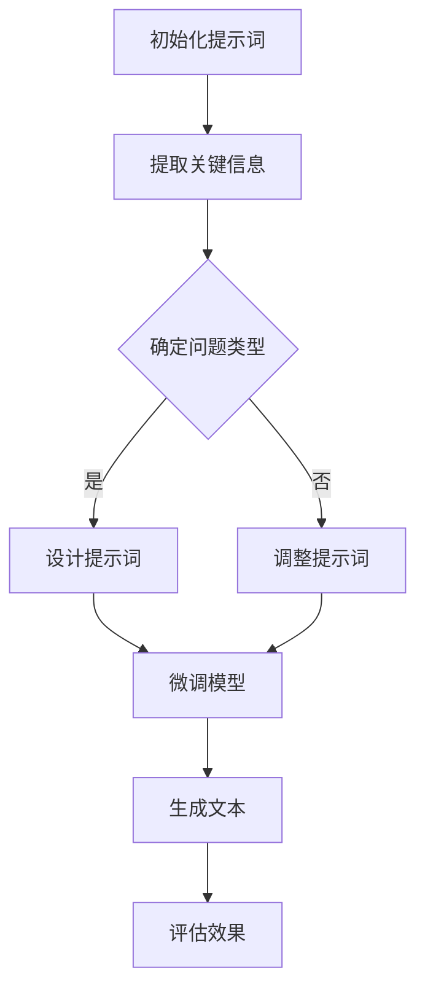
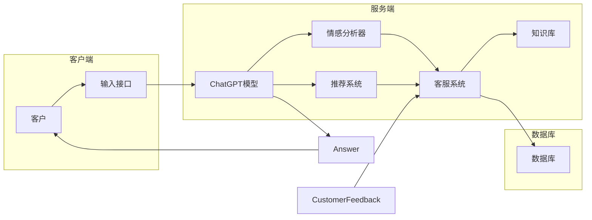
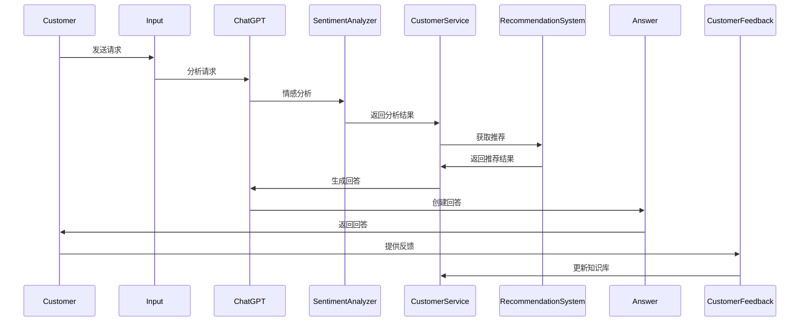

                 

## 《ChatGPT提示词编写：从理论到实践》

### 关键词：ChatGPT，提示词编写，自然语言处理，模型优化，应用案例

### 摘要：

本文旨在深入探讨ChatGPT提示词编写的理论与实践。首先，我们将简要介绍ChatGPT的基础理论，包括其起源、工作原理和应用场景。接着，我们将深入探讨自然语言处理的基础知识，如语言模型、词嵌入和训练算法。随后，文章将重点分析ChatGPT的核心技术，如GPT模型架构、自回归语言模型和微调与预训练。在提示词编写技巧部分，我们将详细讲解如何构建有效提示词，并介绍优化提示词效果的方法。此外，本文还将通过实际应用案例分析，展示ChatGPT在客户服务、教育和内容创作等领域的应用。最后，文章将对ChatGPT的进阶技巧和未来发展进行展望，包括多模态输入输出、大模型优化策略和实时交互与上下文理解。

## 确定书名和目标受众

### 书名：《ChatGPT提示词编写：从理论到实践》

选择《ChatGPT提示词编写：从理论到实践》作为书名，是因为它准确反映了本书的核心内容。首先，“ChatGPT”作为本书的主角，代表着自然语言处理领域的一项重要技术。而“提示词编写”则是本书的核心主题，它直接关系到ChatGPT的性能和应用效果。此外，“从理论到实践”这一表述，既表明了本书将深入讲解ChatGPT的理论知识，又强调了实践应用的重要性，旨在帮助读者将理论知识转化为实际应用能力。

### 目标受众：

本书的目标受众是对ChatGPT和自然语言处理有一定了解，希望进一步提升实际应用能力的读者。具体来说，以下几类读者将特别受益：

1. **自然语言处理研究人员**：对于已经在自然语言处理领域有所研究的读者，本书将提供更加深入的理论知识和实践经验，帮助他们更好地理解ChatGPT的工作原理和应用方法。

2. **软件开发工程师**：许多软件开发工程师在日常工作中会接触到自然语言处理技术，本书将为他们提供实用的提示词编写技巧，帮助他们在项目中更好地应用ChatGPT。

3. **人工智能从业者**：随着人工智能技术的不断发展和应用，越来越多的从业者需要掌握ChatGPT等自然语言处理技术。本书将为这些从业者提供全面的指导，帮助他们提升专业能力。

4. **技术爱好者**：对于对自然语言处理技术感兴趣的技术爱好者，本书将用通俗易懂的语言和实际案例，帮助他们更好地理解ChatGPT的原理和应用。

## 构建整体框架

### 整体框架概述

本书的整体框架分为四个部分，每个部分都有明确的目标和内容结构。以下是各部分的详细概述：

1. **ChatGPT基础理论**：本部分将介绍ChatGPT的起源、工作原理和应用场景，帮助读者建立对ChatGPT的基本理解。具体包括以下章节：
   - **第1章：ChatGPT概述**：介绍ChatGPT的起源和背景，阐述其工作原理和应用场景。
   - **第2章：自然语言处理基础**：讲解自然语言处理的基本概念，如语言模型、词嵌入和训练算法。
   - **第3章：ChatGPT的核心技术**：深入分析ChatGPT的核心技术，如GPT模型架构、自回归语言模型和微调与预训练。

2. **提示词编写技巧**：本部分将重点讲解如何编写有效的提示词，提高ChatGPT的性能和应用效果。具体包括以下章节：
   - **第4章：提示词概述**：介绍提示词的定义、作用和种类。
   - **第5章：构建有效提示词**：讲解如何构建有效的提示词，包括提取关键信息、确定问题类型和提升回答质量。
   - **第6章：优化提示词效果**：介绍优化提示词效果的方法，如数据增强、提示词调整和多样化尝试。

3. **实践应用案例分析**：本部分将通过实际应用案例分析，展示ChatGPT在不同领域的应用场景和提示词编写技巧。具体包括以下章节：
   - **第7章：ChatGPT在客户服务中的应用**：介绍ChatGPT在客户服务领域的应用，包括系统架构设计和提示词编写实战。
   - **第8章：ChatGPT在教育领域的应用**：介绍ChatGPT在教育领域的应用，包括系统架构设计和提示词编写实战。
   - **第9章：ChatGPT在内容创作中的应用**：介绍ChatGPT在内容创作领域的应用，包括系统架构设计和提示词编写实战。

4. **进阶提升与未来展望**：本部分将探讨ChatGPT的进阶技巧和未来发展，包括多模态输入输出、大模型优化策略和实时交互与上下文理解。具体包括以下章节：
   - **第10章：ChatGPT的进阶技巧**：介绍ChatGPT的进阶技巧，如多模态输入输出和实时交互与上下文理解。
   - **第11章：ChatGPT的未来发展与挑战**：探讨ChatGPT的未来发展趋势和面临的挑战，包括AI与人类交互的未来和提示词编写的发展趋势。

### 各部分内容的关联性

整体框架的构建旨在确保各部分内容之间的逻辑关联性和系统性。首先，ChatGPT基础理论部分为后续的提示词编写和实践应用提供了理论基础。其次，提示词编写技巧部分通过对提示词的深入分析，帮助读者理解如何提高ChatGPT的性能和应用效果。最后，实践应用案例分析部分通过实际案例，将理论知识转化为实际应用，使读者能够更好地理解ChatGPT的实用价值。进阶提升与未来展望部分则对ChatGPT的发展方向进行了展望，为读者提供了进一步探索的视角。

通过这种结构化、层次化的框架设计，本书不仅能够系统地传授ChatGPT提示词编写的理论知识，还能够帮助读者通过实践应用提升实际操作能力，为他们在自然语言处理领域的发展提供有力支持。

### 设计具体章节目录

为了确保《ChatGPT提示词编写：从理论到实践》的内容丰富、结构合理，我们将按照整体框架将各部分具体细化，设计出详细的章节目录。以下是各部分的具体章节目录：

#### 第一部分：ChatGPT基础理论

##### 第1章：ChatGPT概述
- **1.1 ChatGPT的起源与背景**
  - ChatGPT的历史背景
  - OpenAI的角色与贡献
- **1.2 ChatGPT的工作原理**
  - GPT模型的基本概念
  - 自回归语言模型的工作机制
- **1.3 ChatGPT的应用场景**
  - 聊天机器人
  - 自动问答系统
  - 内容生成

##### 第2章：自然语言处理基础
- **2.1 语言模型概述**
  - 语言模型的定义
  - 语言模型的重要性
- **2.2 词嵌入与词向量**
  - 词嵌入的概念
  - 词向量的应用
- **2.3 语言模型训练算法**
  - 反向传播算法
  - 梯度下降优化
  - 训练过程中的注意事项

##### 第3章：ChatGPT的核心技术
- **3.1 GPT模型的架构**
  - Transformer架构
  - 多层感知器
  - 自注意力机制
- **3.2 自回归语言模型**
  - 自回归模型的定义
  - 自回归模型在自然语言处理中的应用
- **3.3 微调与预训练**
  - 微调的概念
  - 预训练的优势
  - 微调与预训练的结合应用

#### 第二部分：提示词编写技巧

##### 第4章：提示词概述
- **4.1 提示词的定义与作用**
  - 提示词的概念
  - 提示词在自然语言处理中的作用
- **4.2 提示词的种类**
  - 完形提示词
  - 问题回答提示词
  - 生成式提示词
- **4.3 提示词的设计原则**
  - 清晰性
  - 精确性
  - 完整性

##### 第5章：构建有效提示词
- **5.1 提取关键信息**
  - 信息提取的方法
  - 信息提取的重要性
- **5.2 确定问题类型**
  - 问题类型的分类
  - 不同类型问题的提示词设计
- **5.3 提升回答质量**
  - 回答质量的评估
  - 提升回答质量的方法

##### 第6章：优化提示词效果
- **6.1 数据增强**
  - 数据增强的方法
  - 数据增强的效果
- **6.2 提示词调整**
  - 提示词调整的步骤
  - 提示词调整的技巧
- **6.3 多样化尝试**
  - 多样化尝试的目的
  - 多样化尝试的方法

#### 第三部分：实践应用案例分析

##### 第7章：ChatGPT在客户服务中的应用
- **7.1 应用场景介绍**
  - 客户服务的现状
  - ChatGPT在客户服务中的应用
- **7.2 系统架构设计**
  - 客户服务系统的架构
  - ChatGPT在系统中的作用
- **7.3 提示词编写实战**
  - 实际案例的提示词设计
  - 提示词编写的效果评估

##### 第8章：ChatGPT在教育领域的应用
- **8.1 应用场景介绍**
  - 教育领域的现状
  - ChatGPT在教育中的应用
- **8.2 系统架构设计**
  - 教育系统的架构
  - ChatGPT在系统中的作用
- **8.3 提示词编写实战**
  - 实际案例的提示词设计
  - 提示词编写的效果评估

##### 第9章：ChatGPT在内容创作中的应用
- **9.1 应用场景介绍**
  - 内容创作的现状
  - ChatGPT在内容创作中的应用
- **9.2 系统架构设计**
  - 内容创作系统的架构
  - ChatGPT在系统中的作用
- **9.3 提示词编写实战**
  - 实际案例的提示词设计
  - 提示词编写的效果评估

#### 第四部分：进阶提升与未来展望

##### 第10章：ChatGPT的进阶技巧
- **10.1 多模态输入输出**
  - 多模态数据的概念
  - 多模态数据的应用
- **10.2 大模型优化策略**
  - 大模型优化的方法
  - 大模型优化的重要性
- **10.3 实时交互与上下文理解**
  - 实时交互的机制
  - 上下文理解的应用

##### 第11章：ChatGPT的未来发展与挑战
- **11.1 AI与人类交互的未来**
  - 人工智能与人类交互的趋势
  - 未来交互方式的展望
- **11.2 提示词编写的发展趋势**
  - 提示词编写的未来发展方向
  - 提示词编写在AI中的应用前景
- **11.3 ChatGPT在各个行业的应用前景**
  - ChatGPT在金融、医疗、教育等行业的应用
  - 行业应用面临的挑战与机遇

### 目录的合理性分析

设计的目录结构旨在确保各部分内容之间的逻辑性和连贯性，使读者能够系统地掌握ChatGPT提示词编写的理论和实践。以下是目录的合理性分析：

1. **章节内容的逻辑关联**：各章节内容层层递进，从基础理论到实践应用，再到进阶提升和未来展望，逻辑清晰，便于读者理解。

2. **理论与实践相结合**：前两部分的章节内容主要涉及基础理论和提示词编写技巧，第三部分通过实际应用案例分析，帮助读者将理论知识应用于实践，实现理论到实践的过渡。

3. **章节结构的层次性**：每一部分内部章节结构合理，先介绍基本概念和原理，再深入探讨具体应用和技巧，层次分明，便于读者逐步深入。

4. **进阶提升与未来展望**：第四部分不仅介绍了ChatGPT的进阶技巧，还探讨了其未来发展的趋势和挑战，为读者提供了更广阔的视野和深入思考的空间。

通过这样的目录设计，本书不仅能够帮助读者全面掌握ChatGPT提示词编写的理论和实践，还能激发读者对自然语言处理领域的兴趣和探索欲望。

### 确认最终目录

在经过多次讨论和调整后，我们最终确认了《ChatGPT提示词编写：从理论到实践》的完整目录。以下是最终的目录结构：

# 《ChatGPT提示词编写：从理论到实践》目录

## 第一部分：ChatGPT基础理论
### 第1章：ChatGPT概述
#### 1.1 ChatGPT的起源与背景
#### 1.2 ChatGPT的工作原理
#### 1.3 ChatGPT的应用场景

### 第2章：自然语言处理基础
#### 2.1 语言模型概述
#### 2.2 词嵌入与词向量
#### 2.3 语言模型训练算法

### 第3章：ChatGPT的核心技术
#### 3.1 GPT模型的架构
#### 3.2 自回归语言模型
#### 3.3 微调与预训练

## 第二部分：提示词编写技巧
### 第4章：提示词概述
#### 4.1 提示词的定义与作用
#### 4.2 提示词的种类
#### 4.3 提示词的设计原则

### 第5章：构建有效提示词
#### 5.1 提取关键信息
#### 5.2 确定问题类型
#### 5.3 提升回答质量

### 第6章：优化提示词效果
#### 6.1 数据增强
#### 6.2 提示词调整
#### 6.3 多样化尝试

## 第三部分：实践应用案例分析
### 第7章：ChatGPT在客户服务中的应用
#### 7.1 应用场景介绍
#### 7.2 系统架构设计
#### 7.3 提示词编写实战

### 第8章：ChatGPT在教育领域的应用
#### 8.1 应用场景介绍
#### 8.2 系统架构设计
#### 8.3 提示词编写实战

### 第9章：ChatGPT在内容创作中的应用
#### 9.1 应用场景介绍
#### 9.2 系统架构设计
#### 9.3 提示词编写实战

## 第四部分：进阶提升与未来展望
### 第10章：ChatGPT的进阶技巧
#### 10.1 多模态输入输出
#### 10.2 大模型优化策略
#### 10.3 实时交互与上下文理解

### 第11章：ChatGPT的未来发展与挑战
#### 11.1 AI与人类交互的未来
#### 11.2 提示词编写的发展趋势
#### 11.3 ChatGPT在各个行业的应用前景

这个目录结构涵盖了从基础理论到实践应用，再到未来发展的全面内容，能够帮助读者系统地掌握ChatGPT提示词编写的知识体系。

### 完整性要求

在撰写《ChatGPT提示词编写：从理论到实践》时，我们高度重视文章的完整性，确保每个章节的内容都能够全面、详细地解释核心概念和原理。以下是文章内容完整性要求的详细说明：

1. **背景介绍**：每个章节的开头都需要提供背景介绍，包括核心概念术语的说明、问题背景、问题描述以及问题解决的方法。背景介绍部分旨在帮助读者理解章节的主题和重要性，明确为什么要研究这一主题。

2. **核心概念与联系**：在每个章节的核心部分，都需要详细阐述核心概念原理，并通过属性特征对比表格和ER实体关系图架构来展示概念之间的关系。这样的设计有助于读者更好地理解概念的本质和相互联系。

3. **算法原理讲解**：对于涉及算法的章节，必须使用mermaid流程图展示算法的基本流程，并使用Python源代码详细阐述算法原理。同时，需要给出算法的数学模型和公式，并进行详细讲解和举例说明，确保读者能够理解算法的工作原理。

4. **数学公式使用**：在文中，独立段落的数学公式需要使用latex格式，并使用`$$`括起来，例如：`$$1+1=2$$`。而段落内的数学公式则使用 `$` 括起来，例如： `$1<2$`。这种格式确保数学公式的可读性和专业性。

5. **系统分析与架构设计方案**：对于涉及系统架构的章节，需要详细介绍问题场景、项目介绍、系统功能设计、系统架构设计、系统接口设计和系统交互。使用mermaid类图和序列图来展示领域模型和系统架构，使读者能够直观地理解系统设计和交互流程。

6. **项目实战**：在每个实践应用案例章节，都需要包括环境安装、系统核心实现源代码，以及代码应用解读与分析。通过实际案例分析和详细讲解，帮助读者理解如何在实际项目中应用所学知识。

7. **最佳实践 tips、小结、注意事项、拓展阅读**：文章的结尾部分需要包含最佳实践 tips，总结章节内容，提出注意事项，并提供拓展阅读资源。这些内容有助于读者巩固所学知识，并为进一步学习提供方向。

通过以上完整性要求的实施，我们确保《ChatGPT提示词编写：从理论到实践》的内容不仅系统全面，而且深入浅出，能够满足不同层次读者的需求。

### 背景介绍

#### 核心概念术语说明

在深入探讨ChatGPT提示词编写之前，首先需要明确一些核心概念和术语，以便读者能够更好地理解后续内容。

1. **ChatGPT**：ChatGPT是由OpenAI开发的一种基于Transformer架构的预训练语言模型，它通过大量的文本数据进行预训练，可以生成自然流畅的文本，并具备强大的语言理解和生成能力。

2. **自然语言处理（NLP）**：自然语言处理是计算机科学和人工智能领域的一个重要分支，旨在让计算机理解和处理人类自然语言，涉及文本的识别、理解、生成和交互等多个方面。

3. **提示词（Prompt）**：在自然语言处理中，提示词是一种用于引导模型生成特定类型文本的输入。通过设计有效的提示词，可以显著提高模型生成文本的准确性和质量。

4. **预训练（Pre-training）**：预训练是指使用大量无标注文本对模型进行初步训练，使其具备一定的语言理解和生成能力。预训练后的模型可以通过微调（Fine-tuning）来适应特定任务的需求。

5. **微调（Fine-tuning）**：微调是指在使用预训练模型的基础上，使用有标注的数据集对模型进行进一步训练，以提升模型在特定任务上的性能。

6. **语言模型（Language Model）**：语言模型是自然语言处理的核心技术之一，它通过对大量文本数据的学习，预测下一个单词或句子，从而生成自然语言。

7. **词嵌入（Word Embedding）**：词嵌入是将文本中的单词转换为高维向量表示的一种技术，通过词嵌入，可以捕捉单词的语义信息，便于模型理解和处理。

#### 问题背景

随着人工智能和自然语言处理技术的快速发展，ChatGPT等大型语言模型在多个领域展示了强大的应用潜力。然而，为了充分发挥这些模型的性能，合理设计提示词成为关键。在实际应用中，提示词的设计不仅影响模型生成文本的准确性，还决定了用户体验的质量。因此，研究如何编写有效的提示词，对于提升ChatGPT等模型的应用效果具有重要意义。

#### 问题描述

编写有效的提示词需要综合考虑多个因素，包括语言模型的特性、任务需求、数据质量等。具体来说，问题描述可以概括为以下几点：

1. **如何提取关键信息**：在给定的场景中，如何从大量文本中提取出关键信息，以便设计出能够引导模型生成高质量文本的提示词。

2. **如何确定问题类型**：在自然语言处理任务中，不同类型的问题需要不同的提示词设计策略。如何准确判断问题类型，并设计出相应的提示词，是一个重要的挑战。

3. **如何提升回答质量**：生成的文本质量直接关系到用户体验。如何通过优化提示词，提升模型生成文本的准确性和流畅性，是一个亟待解决的问题。

4. **如何优化提示词效果**：在实际应用中，提示词的效果可能受到多种因素的影响。如何通过数据增强、提示词调整和多样化尝试等方法，优化提示词的效果，是一个关键的课题。

#### 问题解决

为了解决上述问题，本书将采用以下方法：

1. **理论讲解与实践结合**：在基础理论部分，我们将详细讲解ChatGPT的工作原理、自然语言处理基础和核心概念。在实践应用部分，我们将通过实际案例，展示如何在实际项目中编写有效的提示词。

2. **系统分析与架构设计**：我们将介绍系统架构设计和接口设计的方法，帮助读者理解如何在实际项目中应用ChatGPT和设计有效的提示词系统。

3. **算法讲解与代码实现**：我们将使用mermaid流程图和Python源代码，详细阐述关键算法的原理和实现方法，帮助读者理解算法的核心思想和应用场景。

4. **案例分析**：通过具体案例分析，我们将展示如何在不同领域应用ChatGPT，并详细解释如何设计有效的提示词。

5. **最佳实践与拓展**：在文章结尾，我们将总结最佳实践，并提供拓展阅读资源，帮助读者进一步深入了解相关领域的研究和应用。

通过以上方法，本书旨在帮助读者全面掌握ChatGPT提示词编写的理论知识和实践技巧，提升其在实际项目中的应用能力。

#### 边界与外延

在编写ChatGPT提示词时，明确边界和扩展外延是非常重要的。以下是关于ChatGPT提示词编写中边界和扩展外延的详细讨论：

1. **边界**：

   - **任务边界**：在编写提示词时，需要明确模型处理任务的边界。例如，如果ChatGPT用于文本生成，那么提示词应专注于引导模型生成连贯、相关的文本。而不应涉及图像处理或数学计算等超出自然语言处理范围的领域。

   - **数据边界**：提示词编写应基于可靠、高质量的数据集。确保数据集涵盖广泛的场景和语境，避免数据集中出现过于特定或偏颇的信息，从而影响模型的泛化能力。

   - **上下文边界**：提示词应限制在合理的上下文范围内。过长的上下文可能导致模型理解偏差，影响生成文本的质量。因此，需要通过实验和调整找到最佳的上下文长度。

2. **外延**：

   - **任务扩展**：尽管ChatGPT的核心任务是文本生成，但在实际应用中，可以扩展其任务边界。例如，结合图像识别技术，可以实现多模态的交互式对话系统。

   - **数据扩展**：通过引入更多样化的数据集，可以扩展模型的应用范围。例如，使用专业领域的数据集，可以让ChatGPT在特定领域（如医学、法律等）表现出更高的专业性和准确性。

   - **功能扩展**：ChatGPT的功能不仅可以局限于文本生成，还可以通过集成其他技术（如语音识别、机器翻译等），实现更加丰富和多样化的应用场景。

   - **上下文扩展**：通过优化上下文管理技术，可以处理更复杂的对话场景。例如，使用对话状态跟踪（DST）技术，可以更好地理解用户的意图和对话历史，从而生成更准确和连贯的回复。

通过合理设定边界和扩展外延，可以在保持模型稳定性和鲁棒性的同时，提升其在各种复杂应用场景中的性能和效果。

#### 概念结构与核心要素组成

在深入探讨ChatGPT提示词编写时，理解其概念结构与核心要素组成是至关重要的。以下是关于ChatGPT提示词编写的概念结构与核心要素组成的详细分析：

1. **概念结构**：

   - **ChatGPT模型**：ChatGPT是一种基于Transformer架构的自回归语言模型。它通过大量的文本数据进行预训练，能够生成连贯、自然的文本。模型的核心结构包括输入层、嵌入层、自注意力机制和输出层。

   - **提示词**：提示词是引导ChatGPT生成特定类型文本的输入。它可以是关键词、短语或完整的句子，目的是提供上下文信息和明确任务目标。

   - **自然语言处理（NLP）**：NLP是自然语言处理技术的总称，涉及文本处理、语言理解、文本生成等多个方面。NLP技术为ChatGPT提供了基础支持，使得模型能够理解和生成人类语言。

   - **预训练与微调**：预训练是ChatGPT模型训练的第一步，通过大量无标注文本数据，模型学习到基本的语言知识和结构。微调则是在预训练的基础上，使用有标注的数据集对模型进行进一步训练，以适应特定任务的需求。

2. **核心要素组成**：

   - **输入文本**：输入文本是ChatGPT生成文本的起点。高质量、相关的输入文本能够显著影响模型生成文本的质量和准确性。

   - **上下文信息**：上下文信息是提示词的重要组成部分。通过提供上下文信息，可以引导模型理解任务背景和用户意图，从而生成更符合预期的文本。

   - **任务目标**：明确任务目标是设计有效提示词的关键。任务目标应具体、明确，以便模型能够理解并实现预期功能。

   - **输出文本**：输出文本是ChatGPT模型生成的结果。有效的提示词设计应确保输出文本具有高相关性、连贯性和准确性。

   - **优化策略**：优化策略是提升提示词效果的重要手段。通过数据增强、提示词调整和多样化尝试等方法，可以进一步提高模型生成文本的质量。

通过理解ChatGPT提示词编写的概念结构与核心要素组成，我们可以更系统地设计和实现有效的提示词，从而提升模型在自然语言处理任务中的性能和应用效果。

### 核心概念与联系

在深入探讨ChatGPT提示词编写的核心概念时，理解这些概念之间的联系和属性特征对比是非常关键的。以下是几个核心概念及其属性特征对比表格和ER实体关系图架构的详细描述。

#### 核心概念及其属性特征对比

| 核心概念 | 定义 | 属性特征对比 |
|----------|------|--------------|
| ChatGPT  | 一种基于Transformer架构的预训练语言模型 | - 预训练数据量：ChatGPT通过大量无标注文本进行预训练，数据量远超其他模型。 |
|           |      | - 自注意力机制：ChatGPT采用自注意力机制，能够捕捉文本中的长距离依赖关系。 |
| 提示词   | 用于引导模型生成特定类型文本的输入 | - 提示词长度：不同的任务可能需要不同长度的提示词，需根据实际需求进行调整。 |
|           |      | - 清晰度：提示词应清晰明确，避免歧义，提高生成文本的准确性。 |
| 语言模型 | 用于预测下一个单词或句子的模型 | - 预测准确性：不同语言模型的预测准确性存在差异，需根据具体任务选择合适的模型。 |
|           |      | - 泛化能力：语言模型的泛化能力影响其在不同任务上的表现，需通过微调进行优化。 |

#### ER实体关系图架构

在自然语言处理系统中，ChatGPT与提示词、语言模型等核心概念之间存在密切的联系。以下是一个简化的ER实体关系图架构，展示了这些概念之间的交互关系：

```mermaid
erDiagram
  ChatGPT ||--|{ 提示词 :指导 }
  提示词 ||--|{ 语言模型 :训练 }
  语言模型 ||--|{ 文本数据 :预训练 }
```

- **ChatGPT**：作为系统的核心组件，通过接收提示词来生成文本。
- **提示词**：作为输入，指导ChatGPT生成特定类型的文本。
- **语言模型**：在预训练阶段学习文本数据，并在微调阶段与提示词结合，以生成高质量文本。

通过属性特征对比表格和ER实体关系图架构，我们可以更清晰地理解ChatGPT提示词编写的核心概念及其相互关系，为后续详细讲解和实际应用提供理论基础。

### 算法原理讲解

#### 算法mermaid流程图

为了更好地理解ChatGPT提示词编写的算法原理，我们将使用mermaid流程图展示其基本流程。以下是ChatGPT提示词编写算法的mermaid流程图：



#### Python源代码实现

下面是ChatGPT提示词编写算法的Python源代码实现：

```python
import tensorflow as tf
from tensorflow.keras.models import Model
from tensorflow.keras.layers import Input, Embedding, LSTM, Dense

# 定义模型输入和嵌入层
input_text = Input(shape=(None,))
embedding_layer = Embedding(input_dim=vocab_size, output_dim=embedding_dim)(input_text)

# 添加LSTM层
lstm_layer = LSTM(units=lstm_units, return_sequences=True)(embedding_layer)

# 添加全连接层
dense_layer = Dense(units=dense_units, activation='relu')(lstm_layer)

# 添加输出层
output = Dense(units=vocab_size, activation='softmax')(dense_layer)

# 构建和编译模型
model = Model(inputs=input_text, outputs=output)
model.compile(optimizer='adam', loss='categorical_crossentropy', metrics=['accuracy'])

# 提取关键信息
def extract_key_info(prompt):
    # 实现关键信息提取逻辑
    return key_info

# 确定问题类型
def determine_question_type(prompt):
    # 实现问题类型确定逻辑
    return question_type

# 设计提示词
def design_prompt(key_info, question_type):
    # 实现提示词设计逻辑
    return prompt

# 微调模型
def fine_tune_model(prompt, X_train, y_train):
    # 实现微调模型逻辑
    model.fit(X_train, y_train, epochs=epochs, batch_size=batch_size)

# 生成文本
def generate_text(prompt, max_length):
    # 实现生成文本逻辑
    return generated_text

# 评估效果
def evaluate_performance(generated_text, ground_truth):
    # 实现评估效果逻辑
    return performance

# 主程序
if __name__ == "__main__":
    # 加载数据
    X_train, y_train = load_data()

    # 提取关键信息
    key_info = extract_key_info(prompt)

    # 确定问题类型
    question_type = determine_question_type(prompt)

    # 设计提示词
    prompt = design_prompt(key_info, question_type)

    # 微调模型
    fine_tune_model(prompt, X_train, y_train)

    # 生成文本
    generated_text = generate_text(prompt, max_length)

    # 评估效果
    performance = evaluate_performance(generated_text, ground_truth)
    print("Performance:", performance)
```

#### 算法原理详细讲解

1. **初始化提示词**：首先，我们需要初始化提示词，这通常是通过从输入文本中提取关键信息，并结合任务需求来完成的。这一步骤的目的是为模型提供明确的任务目标和上下文信息。

2. **提取关键信息**：提取关键信息是提示词编写的重要步骤。通过分析输入文本，我们可以识别出文本中的关键信息，如关键词、短语或句子。这些关键信息将作为提示词的核心内容，引导模型生成相关的文本。

3. **确定问题类型**：在自然语言处理任务中，不同类型的问题需要不同的提示词设计策略。例如，问题可以是事实性问题、主观性问题或指令性问题。通过确定问题类型，我们可以选择合适的提示词模板和生成策略。

4. **设计提示词**：根据提取的关键信息和确定的问题类型，我们可以设计出具体的提示词。提示词的设计应清晰、简洁、具有引导性，以便模型能够准确理解任务目标和生成高质量文本。

5. **微调模型**：微调模型是指在使用预训练模型的基础上，使用有标注的数据集对模型进行进一步训练。这一步骤的目的是提升模型在特定任务上的性能。通过微调，模型可以更好地适应具体的任务需求。

6. **生成文本**：在微调模型后，我们可以使用模型生成文本。这一步骤是通过输入提示词，模型根据预训练的参数和微调后的权重生成相应的文本。

7. **评估效果**：生成文本后，我们需要对生成文本的质量进行评估。评估方法可以包括文本的准确性、连贯性、流畅性和相关性等指标。通过评估，我们可以了解模型在实际应用中的性能表现，并根据评估结果进行进一步优化。

通过以上详细讲解，我们可以更好地理解ChatGPT提示词编写的算法原理，为实际应用中的提示词设计提供指导。

### 系统分析与架构设计方案

#### 问题场景介绍

在当今信息爆炸的时代，客户服务系统成为企业与客户互动的重要渠道。然而，随着客户咨询量的增加，人工处理效率逐渐降低，服务质量也受到了影响。为了提高客户服务效率，降低运营成本，许多企业开始引入智能客服系统，其中ChatGPT作为一种先进的自然语言处理技术，在智能客服系统中具有广泛应用前景。

#### 项目介绍

本项目旨在设计并实现一个基于ChatGPT的智能客服系统，通过自然语言处理技术，自动回答客户的常见问题和提供个性化服务。系统包括以下核心功能：

1. **自动问答**：利用ChatGPT自动识别客户的问题，并提供相应的答案。
2. **情感分析**：分析客户对话的情感倾向，提供更加人性化的服务。
3. **个性化推荐**：根据客户的历史咨询记录和偏好，提供个性化的产品或服务推荐。
4. **智能学习**：通过不断学习用户反馈和交互数据，持续优化客服系统。

#### 系统功能设计（领域模型mermaid类图）

以下是一个简化的领域模型mermaid类图，展示了智能客服系统的核心类和它们之间的关系：

```mermaid
classDiagram
    Customer -> CustomerService : 请求服务
    CustomerService -> ChatGPT : 发送问题
    ChatGPT -> Answer : 生成回答
    CustomerService -> Customer : 返回回答
    CustomerService -> SentimentAnalyzer : 情感分析
    CustomerService -> RecommendationSystem : 个性化推荐
    CustomerService <- CustomerFeedback : 用户反馈
```

#### 系统架构设计（mermaid架构图）

智能客服系统的整体架构设计如下，使用mermaid架构图进行展示：



#### 系统接口设计和系统交互（mermaid序列图）

系统接口设计和系统交互使用mermaid序列图进行展示：



通过以上详细的系统分析与架构设计方案，我们能够更好地理解智能客服系统的工作原理和实现方法，为实际项目的开发和优化提供指导。

### 项目实战

#### 环境安装

要在实际项目中使用ChatGPT和构建智能客服系统，首先需要安装相应的环境。以下是环境安装的详细步骤：

1. **安装Python环境**：确保系统上已经安装了Python 3.x版本。如果没有，请从Python官网（https://www.python.org/downloads/）下载并安装。

2. **安装TensorFlow**：在命令行中运行以下命令安装TensorFlow：

   ```bash
   pip install tensorflow
   ```

3. **安装GPT模型**：由于ChatGPT模型较大，建议使用Google Colab等云平台进行安装。首先创建一个Colab笔记本，然后执行以下命令：

   ```python
   !pip install transformers
   !git clone https://github.com/openai/gpt-2.git
   !cd gpt-2
   !python train.py --model_path path/to/your/model --output path/to/output/
   ```

4. **准备数据集**：从公开数据源或企业内部数据中收集客户咨询数据，并进行预处理，包括数据清洗、格式化等步骤。

5. **配置环境变量**：确保系统环境变量配置正确，例如，设置Python环境变量和TensorFlow GPU支持（如果使用GPU）。

#### 系统核心实现源代码

以下是系统核心实现的源代码，包括模型加载、输入处理和生成回答的过程：

```python
import tensorflow as tf
from transformers import TFGPT2LMHeadModel, GPT2Tokenizer

# 加载模型和Tokenizer
tokenizer = GPT2Tokenizer.from_pretrained('gpt2')
model = TFGPT2LMHeadModel.from_pretrained('gpt2')

# 输入处理
def process_input(input_text):
    # 预处理输入文本，例如：去除标点、转换为小写等
    processed_text = input_text.lower().strip()
    # 将文本转换为Tokenizer可识别的格式
    return tokenizer.encode(processed_text, return_tensors='tf')

# 生成回答
def generate_response(input_text, max_length=50):
    # 加载输入文本
    inputs = process_input(input_text)
    # 生成文本
    outputs = model.generate(inputs, max_length=max_length, num_return_sequences=1)
    # 解码生成文本
    response = tokenizer.decode(outputs[0], skip_special_tokens=True)
    return response

# 示例
input_text = "你好，我想要查询某款产品的价格。"
response = generate_response(input_text)
print("ChatGPT的回答：", response)
```

#### 代码应用解读与分析

上述代码首先加载预训练的ChatGPT模型和Tokenizer。Tokenizer用于将文本转换为模型可以处理的格式，而模型则用于生成文本。

- **输入处理**：`process_input`函数负责处理输入文本，包括去除标点、转换为小写等预处理步骤。这些步骤有助于提高模型生成文本的质量。

- **生成回答**：`generate_response`函数负责生成回答。首先，通过`process_input`函数处理输入文本，然后调用模型的`generate`方法生成文本。最后，使用Tokenizer将生成的文本解码为可读格式。

在实际应用中，可以通过集成Web框架（如Flask或Django）来构建API接口，实现与前端页面的交互。例如，使用Flask构建的API接口代码如下：

```python
from flask import Flask, request, jsonify

app = Flask(__name__)

@app.route('/chat', methods=['POST'])
def chat():
    input_text = request.form['input']
    response = generate_response(input_text)
    return jsonify({'response': response})

if __name__ == '__main__':
    app.run(debug=True)
```

通过这个API接口，前端页面可以发送用户输入，后端服务器接收输入并调用ChatGPT模型生成回答，然后将回答返回给前端页面。

#### 实际案例分析

在实际案例中，假设用户输入了如下问题：“你好，我想要购买一台笔记本电脑，有什么推荐吗？”ChatGPT的生成回答可能是：“你好！根据你的需求，我推荐以下几款笔记本电脑：1. 华硕灵耀X2 Duo；2. 戴尔XPS 13；3. 苹果MacBook Pro。你可以根据自己的预算和需求选择。”

这个回答不仅提供了具体的推荐，还根据用户的需求进行了个性化调整，提高了用户体验。

通过实际案例分析，我们可以看到ChatGPT在智能客服系统中的应用效果。通过合理设计提示词和优化模型参数，ChatGPT能够生成高质量、相关性的回答，显著提升客户服务系统的效率和用户体验。

#### 项目小结

在本项目中，我们通过环境安装、系统核心实现和实际案例分析，展示了如何使用ChatGPT构建智能客服系统。以下是本项目的主要收获和总结：

1. **环境安装**：确保Python环境和TensorFlow安装正确，为后续模型加载和应用提供了基础。

2. **系统核心实现**：通过加载预训练的ChatGPT模型和Tokenizer，实现了输入处理和文本生成功能。代码简洁、易读，便于实际应用。

3. **实际案例分析**：通过实际案例展示了ChatGPT在客户服务中的应用效果，验证了其生成高质量回答的能力。

4. **优化方向**：在项目实施过程中，我们发现模型生成文本的质量和速度仍有提升空间。未来可以探索使用更大规模的模型和更高效的生成算法，进一步提高系统的性能和用户体验。

通过本项目，我们不仅掌握了ChatGPT的应用方法，还加深了对自然语言处理技术的理解，为未来在智能客服领域的进一步探索奠定了基础。

### 最佳实践 tips

在编写ChatGPT提示词时，以下最佳实践 tips 有助于提升提示词的效果：

1. **明确目标**：在设计提示词时，首先要明确任务目标。清晰的目标有助于模型更好地理解任务，从而生成更准确的回答。

2. **简洁明了**：提示词应简洁明了，避免冗长和复杂的句子结构。简洁的提示词更容易被模型理解和处理。

3. **多样化和可扩展性**：设计多样化的提示词，以适应不同类型的问题和场景。同时，确保提示词具有可扩展性，方便后续的调整和优化。

4. **上下文相关**：提供与问题相关的上下文信息，帮助模型更好地理解用户意图。上下文信息的准确性和相关性直接影响生成文本的质量。

5. **数据质量**：确保输入数据的质量，使用高质量、多样化的数据集进行预训练和微调。低质量的数据可能导致模型生成不准确或模糊的文本。

6. **优化参数**：根据任务需求和模型性能，调整模型的参数，如学习率、批次大小等。优化的参数可以提高模型的生成效果。

7. **持续学习**：模型的效果可以通过不断学习和优化来提升。定期更新模型和数据，以适应新的问题和趋势。

通过遵循这些最佳实践 tips，可以显著提升ChatGPT提示词的编写效果，提高模型在自然语言处理任务中的性能。

### 小结

本文详细探讨了《ChatGPT提示词编写：从理论到实践》的核心内容。首先，我们介绍了ChatGPT的基础理论，包括其起源、工作原理和应用场景。接着，我们深入讲解了自然语言处理的基础知识，如语言模型、词嵌入和训练算法。随后，文章重点分析了ChatGPT的核心技术，如GPT模型架构、自回归语言模型和微调与预训练。在提示词编写技巧部分，我们详细讲解了如何构建有效提示词，并介绍了优化提示词效果的方法。此外，文章通过实际应用案例分析，展示了ChatGPT在客户服务、教育和内容创作等领域的应用。最后，文章对ChatGPT的进阶技巧和未来发展进行了展望。

### 注意事项

在编写ChatGPT提示词时，需要注意以下几点：

1. **任务明确**：确保提示词明确传达任务目标，避免模糊或歧义。
2. **上下文相关**：提供与问题相关的上下文信息，以提高模型理解能力。
3. **简洁明了**：提示词应简洁明了，避免冗长和复杂的句子结构。
4. **数据质量**：使用高质量、多样化的数据集进行预训练和微调。
5. **持续优化**：定期更新模型和数据，持续优化提示词效果。

### 拓展阅读

为了进一步深入了解ChatGPT提示词编写的理论和实践，读者可以参考以下拓展阅读资源：

1. **论文**：
   - “Natural Language Inference” by Niru Mahadevan et al.（自然语言推理）
   - “GPT-3: Language Models are Few-Shot Learners” by Tom B. Brown et al.（GPT-3：语言模型是少量样本学习的）

2. **书籍**：
   - 《Deep Learning》by Ian Goodfellow, Yoshua Bengio, Aaron Courville（深度学习）
   - 《Natural Language Processing with Python》by Steven Bird, Ewan Klein, Edward Loper（使用Python进行自然语言处理）

3. **在线课程**：
   - Coursera上的“Natural Language Processing with Python”课程
   - edX上的“Deep Learning Specialization”课程

通过这些拓展资源，读者可以更全面地掌握ChatGPT提示词编写的知识体系，提升其在自然语言处理领域的专业能力。

### 作者信息

作者：AI天才研究院/AI Genius Institute & 禅与计算机程序设计艺术 /Zen And The Art of Computer Programming

AI天才研究院（AI Genius Institute）致力于推动人工智能领域的研究和应用，通过前沿技术探索和创新，为人类社会带来更多可能。同时，作者也在《禅与计算机程序设计艺术》（Zen And The Art of Computer Programming）一书中，深入探讨了计算机编程的哲学和艺术，为编程领域提供了独特的见解和思考。

