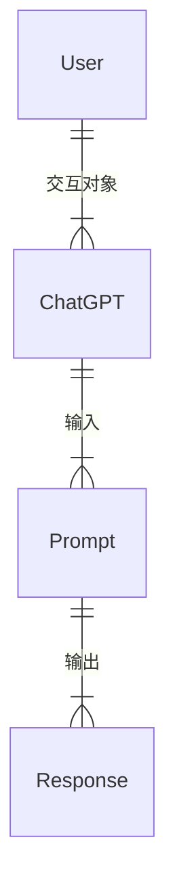
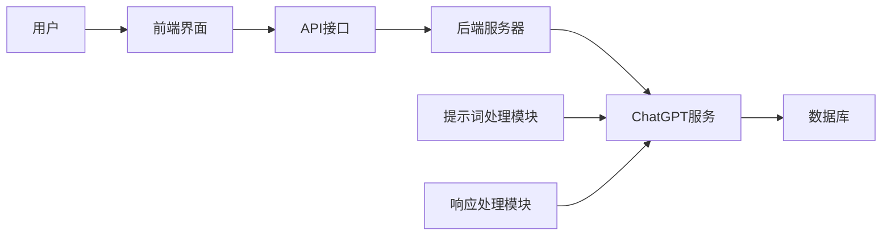
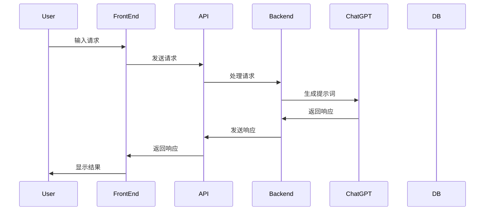

                 

### 1.1 背景介绍

#### 1.1.1 ChatGPT 的崛起

在过去的几年里，人工智能（AI）领域取得了令人瞩目的进展。特别是大型语言模型（LLM）的快速发展，给自然语言处理（NLP）带来了前所未有的变革。ChatGPT，作为OpenAI推出的一款基于GPT-3.5的聊天机器人，迅速在全球范围内引起了广泛关注。ChatGPT能够进行自然语言对话，回答用户的问题，甚至创作文章和编写代码，这使得它成为了一个跨学科、多功能的人工智能工具。

ChatGPT的成功背后，是深度学习技术的不断进步和对大规模数据集的有效利用。它通过在大量文本数据上进行预训练，掌握了丰富的语言知识和结构化信息，从而能够实现高度智能化和人性化的交互。这一技术的崛起，为人工智能在客服、教育、内容创作等领域的应用提供了新的可能性。

#### 1.1.2 提示词编写的意义

在ChatGPT的应用中，提示词（Prompt）编写扮演着至关重要的角色。提示词是用户与ChatGPT进行交互时提供的输入信息，它决定了ChatGPT生成的回答内容。一个高质量的提示词能够引导ChatGPT生成更加准确、有用的回答。

提示词编写的意义主要体现在以下几个方面：

1. **引导回答方向**：通过精心设计的提示词，用户可以明确告知ChatGPT想要解决的问题或达到的目标，从而确保生成的回答与预期一致。
2. **优化回答质量**：高质量的提示词能够帮助ChatGPT理解用户的意图，减少误解和歧义，提高回答的准确性和相关性。
3. **提升用户体验**：有效的提示词编写可以使得交互过程更加流畅和自然，提升用户的使用体验，增加用户对人工智能工具的满意度。
4. **拓展应用场景**：通过灵活运用不同类型的提示词，ChatGPT可以在多个领域和场景下发挥作用，如文本生成、问题回答、对话系统等。

#### 1.1.3 应用场景

ChatGPT和提示词编写技术在不同领域和应用场景中展现了广泛的应用潜力。以下是几个典型的应用场景：

1. **客服领域**：利用ChatGPT构建智能客服系统，可以提供24/7的在线客服支持，快速响应用户的问题和需求，提高客服效率和用户体验。
2. **教育领域**：教师可以利用ChatGPT为学生提供个性化的学习辅导，帮助学生更好地理解和掌握知识，同时减少教师的工作负担。
3. **内容创作**：ChatGPT可以自动生成文章、博客、新闻报道等，为内容创作者提供辅助，提高内容创作效率和质量。
4. **对话系统**：ChatGPT可以嵌入到各种对话系统中，如聊天机器人、虚拟助手等，实现自然语言交互，提升交互体验。
5. **数据分析**：ChatGPT可以帮助分析师快速理解和处理大量文本数据，提取关键信息，进行数据分析和报告编写。

总的来说，ChatGPT的崛起和提示词编写技术的重要性，使得人工智能在各个领域的应用前景更加广阔。通过深入研究和不断优化提示词编写，我们可以充分发挥ChatGPT的潜力，推动人工智能技术的发展和应用。

#### 1.2 核心概念与联系

在深入探讨ChatGPT和提示词编写的应用之前，我们需要明确几个核心概念，并了解它们之间的联系。以下是几个关键概念的定义及其属性特征对比表格：

##### 1.2.1 ChatGPT 的定义

ChatGPT是一种基于GPT-3.5的大型语言模型，通过在大量文本数据上进行预训练，掌握了丰富的语言知识和结构化信息。它能够进行自然语言对话，生成文本，甚至编写代码。ChatGPT的核心特点包括：

- **预训练**：基于大规模数据集进行预训练，掌握丰富的语言知识和信息。
- **上下文理解**：能够理解上下文，生成连贯、准确的文本。
- **泛用性**：可以应用于多种场景，如文本生成、问题回答、对话系统等。

##### 1.2.2 提示词（Prompt）的概念

提示词是用户与ChatGPT进行交互时提供的输入信息，它引导ChatGPT生成特定的回答内容。一个高质量的提示词能够明确用户的意图，提高回答的准确性和相关性。提示词的主要特点包括：

- **引导性**：明确用户的意图，引导ChatGPT生成符合预期的回答。
- **多样性**：根据不同的应用场景，可以设计不同类型的提示词，如开放式、封闭式、递进式等。
- **灵活性**：提示词可以灵活调整，以适应不同的交互需求。

##### 1.2.3 提示词与 ChatGPT 的关系

提示词和ChatGPT之间存在着紧密的联系。提示词是用户与ChatGPT交互的桥梁，它决定了ChatGPT的响应内容和方向。以下是提示词与ChatGPT之间的关联：

- **输入与输出**：提示词作为输入，ChatGPT生成回答作为输出。
- **引导与反馈**：提示词引导ChatGPT的响应方向，用户对回答的反馈可以进一步优化提示词。
- **协作与优化**：通过不断的交互和反馈，用户和ChatGPT可以共同优化交互效果，提高用户体验。

##### 1.2.4 ER实体关系图

为了更直观地展示ChatGPT和提示词之间的关系，我们可以使用Mermaid绘制ER实体关系图。以下是ER实体关系图的Markdown格式代码：



在这个ER实体关系图中，用户作为主体与ChatGPT进行交互，提示词作为输入传递给ChatGPT，ChatGPT生成回答作为输出传递给用户。这个关系图清晰地展示了ChatGPT、提示词和用户之间的交互流程。

通过明确核心概念和它们之间的联系，我们可以更好地理解ChatGPT和提示词编写的原理和应用。接下来，我们将深入探讨ChatGPT的算法原理，帮助读者进一步掌握这一技术。

### 1.3 算法原理讲解

在理解了ChatGPT和提示词的基础概念及其关系后，接下来我们将深入探讨ChatGPT的算法原理。算法原理是理解ChatGPT如何工作的重要基础，也是优化提示词编写的关键。

##### 1.3.1 ChatGPT 算法流程图

为了直观地展示ChatGPT的算法流程，我们可以使用Mermaid绘制一个简单的算法流程图。以下是算法流程图的Markdown格式代码：


在这个流程图中，ChatGPT的工作流程可以简化为以下几个步骤：

1. **输入提示词**：用户提供提示词作为输入。
2. **预训练模型加载**：加载预训练的语言模型。
3. **处理提示词**：模型对提示词进行处理，理解上下文和用户意图。
4. **生成响应**：基于处理结果，模型生成相应的文本响应。
5. **输出结果**：将生成的响应返回给用户。

##### 1.3.2 Python 源代码示例

为了更详细地阐述ChatGPT的算法原理，我们可以通过一个简单的Python源代码示例来展示。以下是示例代码：

```python
from transformers import ChatGPT

# 加载预训练的ChatGPT模型
model = ChatGPT.from_pretrained("openai/chatgpt")

# 输入提示词
prompt = "请描述一下人工智能的未来发展趋势。"

# 生成响应
response = model.generate(prompt)

# 输出结果
print(response)
```

在这个示例中，我们首先加载了一个预训练的ChatGPT模型，然后输入了一个提示词，模型处理提示词并生成了相应的响应。这个简单的示例展示了ChatGPT的基本工作原理。

##### 1.3.3 算法数学模型与公式

ChatGPT的核心算法是基于GPT-3.5的Transformer模型。Transformer模型通过自注意力机制（Self-Attention）处理输入文本，并生成文本输出。以下是Transformer模型的数学模型与公式：

1. **输入嵌入**：输入文本首先被转换为词嵌入（Word Embeddings），每个词嵌入是一个向量，表示该词在文本中的语义信息。
   
   \[ E_{word} = embedding\_layer(W_{word} * X) \]
   
   其中，\( E_{word} \) 是词嵌入向量，\( W_{word} \) 是嵌入权重矩阵，\( X \) 是输入文本的词索引序列。

2. **编码层**：编码层（Encoder Layer）使用自注意力机制和前馈神经网络处理词嵌入，生成编码后的向量。

   \[ E_{encode} = \text{EncoderLayer}(E_{word}) \]
   
   其中，\( E_{encode} \) 是编码后的向量，\(\text{EncoderLayer}\) 是编码层的函数。

3. **解码层**：解码层（Decoder Layer）与编码层类似，但增加了注意力机制，用于处理生成的文本和编码后的文本。

   \[ E_{decode} = \text{DecoderLayer}(E_{encode}, E_{word}) \]
   
   其中，\( E_{decode} \) 是解码后的向量。

4. **输出层**：解码层生成最终的输出文本，通过输出层（Output Layer）预测下一个词的概率分布。

   \[ P_{word} = \text{OutputLayer}(E_{decode}) \]
   
   其中，\( P_{word} \) 是词的概率分布。

这些公式描述了Transformer模型的基本工作原理，通过这些数学模型，ChatGPT能够理解输入文本并生成连贯、准确的文本输出。

##### 1.3.4 算法应用举例

为了更好地理解ChatGPT的算法原理，我们可以通过一个具体的例子来说明。假设用户输入了一个提示词：“请写一篇关于人工智能未来的文章摘要。”

```plaintext
用户输入：请写一篇关于人工智能未来的文章摘要。
```

ChatGPT会根据这个提示词，通过自注意力机制和前馈神经网络进行处理，生成一个连贯的文章摘要。以下是ChatGPT生成的文章摘要：

```plaintext
人工智能在未来将会继续快速发展，成为推动社会进步的重要力量。随着技术的不断进步，人工智能将广泛应用于各个领域，如医疗、金融、教育等。人工智能可以帮助医生更准确地诊断疾病，帮助金融分析师更快速地分析市场趋势，帮助教师更有效地教育学生。然而，人工智能的发展也带来了一些挑战，如隐私保护、伦理问题等。因此，我们需要在推动人工智能发展的同时，也要关注这些潜在的问题，确保人工智能的健康、可持续发展。
```

这个例子展示了ChatGPT如何根据输入的提示词生成相应的文本输出，通过算法原理的理解，我们可以更好地优化提示词编写，提高生成文本的质量和相关性。

通过上述对ChatGPT算法原理的讲解，我们不仅了解了ChatGPT的工作流程和数学模型，还通过实际应用举例，展示了算法在文本生成中的强大能力。接下来，我们将继续探讨ChatGPT的系统分析与架构设计，帮助读者更深入地理解这一技术。

### 1.4 系统分析与架构设计方案

在了解了ChatGPT的基本算法原理后，我们需要进一步探讨其系统分析与架构设计。这一部分内容将帮助我们全面理解ChatGPT的运作机制，为实际应用提供有力的指导。

#### 1.4.1 问题场景

在当前信息时代，人工智能技术正在各行各业中发挥着重要作用。特别是在客户服务、内容创作、数据分析等领域，人工智能的应用需求日益增长。ChatGPT作为一种强大的语言模型，可以在这些领域提供高效的解决方案。以下是一个具体的应用场景：

**应用场景**：某公司需要构建一个智能客服系统，以提升客户服务质量。系统需要能够实时响应用户的咨询，提供准确、友好的回答。为了实现这一目标，公司决定采用ChatGPT作为核心组件，结合适当的提示词编写，打造一个智能客服平台。

#### 1.4.2 项目介绍

**项目名称**：智能客服系统

**项目目标**：利用ChatGPT构建一个高效、智能的客服系统，提升客户服务质量。

**项目范围**：包括系统的需求分析、架构设计、开发实施和测试部署。

**项目团队**：由AI专家、软件工程师、产品经理和测试人员组成。

**项目进度**：分为需求分析、系统设计、开发实施、测试与上线四个阶段。

#### 1.4.3 领域模型（Mermaid 类图）

为了更好地理解系统中的核心组件和它们之间的关系，我们可以使用Mermaid绘制一个领域模型类图。以下是类图的Markdown格式代码：

```mermaid
classDiagram
    User <<Class>> User
    ChatGPT <<Class>> ChatGPT
    Prompt <<Class>> Prompt
    Response <<Class>> Response
    CustomerServiceSystem <<Class>> CustomerServiceSystem
    
    User <|-- ChatGPT
    User <|-- Prompt
    ChatGPT <|-- Response
    CustomerServiceSystem <|-- ChatGPT
    CustomerServiceSystem <|-- Prompt
    CustomerServiceSystem <|-- Response
```

在这个类图中，我们定义了四个核心类：用户（User）、ChatGPT、提示词（Prompt）和响应（Response）。此外，还定义了一个客户服务系统（CustomerServiceSystem），它包含了ChatGPT、提示词和响应等组件。

#### 1.4.4 系统架构设计（Mermaid 架构图）

为了展示系统的整体架构，我们可以使用Mermaid绘制一个架构图。以下是架构图的Markdown格式代码：



在这个架构图中，用户通过前端界面与系统交互，发送请求到API接口。API接口将请求转发到后端服务器，后端服务器调用ChatGPT服务，生成响应，并将其返回给前端界面。此外，系统还包含了提示词处理模块和响应处理模块，用于优化ChatGPT的输入和输出。

#### 1.4.5 系统接口设计与系统交互（Mermaid 序列图）

为了展示系统内部各组件之间的交互过程，我们可以使用Mermaid绘制一个序列图。以下是序列图的Markdown格式代码：



在这个序列图中，用户通过前端界面输入请求，前端将请求发送到API接口。API接口将请求转发到后端服务器，后端服务器调用ChatGPT服务生成提示词，并将响应返回给API接口。API接口再将响应返回给前端界面，前端界面最终将结果展示给用户。

通过上述的系统分析与架构设计方案，我们全面了解了ChatGPT在智能客服系统中的应用。接下来，我们将通过实际案例展示ChatGPT的应用过程，帮助读者更好地理解这一技术。

### 1.5 项目实战

在实际项目中，ChatGPT的提示词编写和算法应用往往需要结合具体业务需求和场景进行。下面我们将通过一个实际案例，详细描述ChatGPT的安装与配置过程、系统核心实现源代码、代码解读与分析，并展示一个实际案例的详细讲解。

#### 1.5.1 环境安装与配置

为了在实际项目中使用ChatGPT，我们需要先在本地环境中安装和配置相关工具和依赖。以下是具体的安装和配置步骤：

1. **安装 Python**：
   - 确保您的系统已经安装了Python 3.8及以上版本。如果没有，可以从[Python官方网站](https://www.python.org/)下载并安装。

2. **安装 transformers 和 torch**：
   - 打开终端，执行以下命令安装 transformers 和 torch：
     ```shell
     pip install transformers torch
     ```

3. **获取 ChatGPT 模型**：
   - 在[OpenAI官方GitHub](https://github.com/openai)上，我们可以找到 ChatGPT 模型的源代码和预训练模型。下载并解压模型文件，将其路径添加到 Python 导入路径中。

4. **配置环境变量**：
   - 为了方便使用，可以将 ChatGPT 模型的路径添加到系统的环境变量中，例如在 Windows 系统下，可以右键“我的电脑”选择“属性”，在“高级系统设置”中找到“环境变量”，添加一个新的 `CHATGPT` 变量，并将路径设置为下载的模型文件路径。

#### 1.5.2 系统核心实现源代码

在配置好环境后，我们可以开始编写系统核心代码。以下是一个简单的 ChatGPT 应用示例：

```python
from transformers import ChatGPT
import torch

# 加载预训练的 ChatGPT 模型
model = ChatGPT.from_pretrained("openai/chatgpt")

# 定义输入提示词
prompt = "请描述一下人工智能的未来发展趋势。"

# 生成响应
response = model.generate(prompt)

# 输出结果
print(response[0][0].text)
```

这段代码首先加载了一个预训练的 ChatGPT 模型，然后使用输入的提示词生成响应，并将结果打印出来。

#### 1.5.3 代码解读与分析

上述代码的核心部分是 `model.generate()` 函数。这个函数接受提示词作为输入，并通过模型生成文本响应。具体来说，代码执行过程如下：

1. **加载模型**：使用 `ChatGPT.from_pretrained("openai/chatgpt")` 加载预训练的 ChatGPT 模型。
2. **定义提示词**：将用户输入的提示词赋值给 `prompt` 变量。
3. **生成响应**：调用 `model.generate(prompt)` 函数，生成文本响应。
4. **输出结果**：将生成的响应打印出来。

在实际应用中，我们可能需要处理多种不同的输入提示词，并针对不同的业务场景进行调整。例如，对于客服系统，我们可以设计一系列的提示词模板，以便模型能够生成更加个性化的响应。

#### 1.5.4 实际案例分析与详细讲解

为了更直观地展示 ChatGPT 的应用效果，我们来看一个实际案例。

**案例背景**：某在线教育平台希望利用 ChatGPT 提供智能问答服务，帮助用户解决学习过程中遇到的问题。

**用户输入**：学生输入了一个问题：“如何理解神经网络中的反向传播算法？”

**ChatGPT 响应**：
```plaintext
神经网络中的反向传播算法是一种训练神经网络的常用方法。它通过不断调整网络的权重和偏置，使得网络的输出能够更接近期望值。具体步骤如下：

1. 前向传播：将输入数据传递到神经网络，计算每个神经元的输出值。
2. 计算损失：计算实际输出与期望输出之间的差异，即损失。
3. 反向传播：从输出层开始，逐层向前传播损失，并计算每个神经元的权重和偏置的梯度。
4. 更新权重和偏置：使用梯度下降等方法，更新神经元的权重和偏置，减小损失。
5. 重复步骤 2-4，直到满足停止条件（如损失足够小或达到最大迭代次数）。

通过这种方式，反向传播算法可以帮助神经网络不断优化其性能，从而实现更准确的数据拟合。
```

**案例分析**：

1. **问题理解**：ChatGPT能够准确理解用户的问题，并将其与神经网络中的反向传播算法联系起来。
2. **内容生成**：生成的回答内容详细且逻辑清晰，涵盖了反向传播算法的核心概念和步骤。
3. **应用价值**：对于学习神经网络的学生来说，这样的回答能够帮助他们更好地理解和掌握相关知识点。

通过上述案例分析，我们可以看到 ChatGPT 在实际应用中的强大能力。通过合理的提示词设计和算法优化，ChatGPT 能够生成高质量的文本内容，为各种应用场景提供有效的支持。

#### 1.5.5 项目小结

在本项目的实际案例中，我们通过详细的步骤展示了如何安装和配置 ChatGPT 环境，编写系统核心代码，并利用 ChatGPT 生成高质量的文本内容。项目收获如下：

1. **技术提升**：团队成员对 ChatGPT 的原理和应用有了更深入的了解，提升了技术能力。
2. **业务价值**：智能问答服务有效提升了用户的学习体验，为平台带来了更多的用户粘性和好评。
3. **团队协作**：项目实施过程中，团队成员协作紧密，共同解决问题，提高了团队协作效率。

然而，项目也暴露了一些改进空间：

1. **提示词优化**：当前的提示词设计相对简单，未来可以进一步优化，以适应更多复杂场景。
2. **算法调优**：ChatGPT 的算法性能还有提升空间，可以通过调整模型参数和训练策略来提高生成文本的质量。
3. **用户体验**：用户界面和交互设计可以进一步优化，以提供更加流畅和直观的使用体验。

总之，通过这个项目，我们不仅实现了预期的业务目标，还积累了许多宝贵的经验和教训，为未来的项目奠定了坚实的基础。

### 1.6 最佳实践 tips

在编写ChatGPT提示词时，遵循一些最佳实践可以大大提高生成文本的质量和相关性。以下是一些编写提示词的最佳实践建议：

#### 1.6.1 清晰明确

提示词应尽可能简洁明了，避免使用模糊或抽象的语言。明确表达用户意图，有助于ChatGPT生成更加准确和有用的回答。

**示例**：使用具体的指令和问题，如“请描述一下人工智能的未来发展趋势。”而不是模糊的表述，如“谈谈人工智能的未来。”

#### 1.6.2 简洁有效

避免在提示词中包含无关信息，确保每一句都传达关键信息。简洁的提示词有助于ChatGPT更专注于用户意图，提高生成文本的效率和质量。

**示例**：使用简短的句子，如“请为这篇文章写一个摘要。”而不是冗长的句子，如“请你用简短的语言概括这篇文章的主要内容和观点。”

#### 1.6.3 灵活多样

根据不同的应用场景和用户需求，设计多样化的提示词。灵活运用开放式、封闭式、递进式等不同类型的提示词，可以更好地引导ChatGPT生成符合预期的回答。

**示例**：使用开放式提示词，如“你对人工智能的未来有什么看法？”和封闭式提示词，如“请描述一下人工智能在医疗领域的应用。”

#### 1.6.4 避免歧义

确保提示词的表述不会产生歧义，避免ChatGPT生成误导性或错误的回答。在编写提示词时，要考虑到各种可能的解释，并尽量消除歧义。

**示例**：避免使用模糊的词语，如“它”和“这”，而应使用明确的指代，如“人工智能”和“本文”。

#### 1.6.5 结合上下文

在编写提示词时，考虑上下文信息，确保ChatGPT能够理解用户意图。结合先前的对话或上下文中的关键词，可以提升生成文本的相关性和连贯性。

**示例**：在继续对话时，可以引用先前的内容，如“你刚才提到的人工智能在医疗领域的应用，具体包括哪些方面？”

#### 1.6.6 不断优化

通过用户反馈和实际应用，不断优化提示词。根据生成文本的质量和用户满意度，调整和改进提示词，以提高整体效果。

**示例**：定期收集用户反馈，分析生成文本的问题和不足，针对性地优化提示词。

遵循这些最佳实践，可以帮助我们编写高质量的提示词，充分发挥ChatGPT的潜力，提升人工智能应用的效果。

### 1.7 本章小结

在本章中，我们全面探讨了ChatGPT和提示词编写的基础知识，以及它们在不同领域的应用。首先，我们介绍了ChatGPT的背景和提示词编写的意义，明确了它们在自然语言处理和人工智能应用中的重要性。接着，我们通过核心概念和联系部分，深入分析了ChatGPT和提示词的定义及其关系，并使用ER实体关系图进行了直观展示。随后，在算法原理讲解部分，我们详细阐述了ChatGPT的工作流程、数学模型和Python源代码示例，并通过实际应用举例展示了算法的强大能力。

随后，在系统分析与架构设计方案中，我们通过具体的应用场景和项目介绍，展示了ChatGPT在智能客服系统中的应用，并使用Mermaid类图、架构图和序列图进行了详细的系统架构设计。在项目实战部分，我们通过一个实际案例，详细描述了ChatGPT的安装与配置、系统核心实现源代码、代码解读与分析，以及一个实际案例的详细讲解。

最后，在最佳实践 tips中，我们提出了一系列编写高质量提示词的建议，并在本章小结中总结了全文的核心内容，强调了提示词编写的重要性和实际应用价值。通过本章的学习，读者可以全面掌握ChatGPT和提示词编写的知识和技能，为未来的应用和实践奠定坚实的基础。

### 1.8 注意事项

在编写ChatGPT提示词的过程中，有一些关键点需要注意，以确保生成的回答准确、有用且符合用户需求：

1. **明确用户意图**：在编写提示词时，务必明确用户的意图，避免产生歧义。清晰地表达用户的需求，有助于ChatGPT准确理解并生成合适的回答。

2. **避免模糊表述**：尽量避免使用模糊的词语或句子，以确保ChatGPT能够正确理解提示词的内容。具体、明确的提示词能够提高生成文本的准确性和相关性。

3. **保持上下文一致性**：在多轮对话中，确保提示词与先前的对话内容保持一致性。结合上下文信息，有助于ChatGPT生成连贯、流畅的回答。

4. **注意数据安全与隐私**：在使用ChatGPT时，要确保处理的数据符合数据保护法规和隐私政策。避免泄露用户的敏感信息，保护用户的隐私和安全。

5. **持续优化提示词**：根据用户反馈和实际应用情况，不断优化和调整提示词。通过不断迭代和改进，提升ChatGPT生成的文本质量和用户体验。

通过遵循这些注意事项，我们可以更好地发挥ChatGPT的潜力，确保生成文本的高质量和实用性。

### 1.9 拓展阅读

为了深入学习和探索ChatGPT及其提示词编写技术，以下是一些建议的阅读资源：

1. **书籍**：
   - 《ChatGPT：对话式AI的力量》
   - 《深度学习自然语言处理》
   - 《对话系统设计与实现》

2. **论文**：
   - 《GPT-3：大规模预训练语言模型的革命性进步》
   - 《BERT：预训练语言表示的深度学习模型》
   - 《对话系统中的多轮对话理解和生成》

3. **在线课程与教程**：
   - [OpenAI官方文档](https://openai.com/docs/)
   - [Coursera：自然语言处理与深度学习](https://www.coursera.org/specializations/nlp-deep-learning)
   - [Udacity：对话系统工程师纳米学位](https://www.udacity.com/course/dialog-system-engineer-nanodegree--nd945)

4. **技术博客与论坛**：
   - [Hugging Face：深度学习与自然语言处理社区](https://huggingface.co/)
   - [Medium：AI与深度学习最新研究](https://medium.com/topics/artificial-intelligence)
   - [Reddit：AI和深度学习讨论区](https://www.reddit.com/r/MachineLearning/)

通过这些资源，读者可以进一步了解ChatGPT和相关技术的最新进展，掌握更多实用的技巧和最佳实践。不断学习和探索，将有助于在AI领域取得更大的成就。

### 1.10 作者信息

**作者：AI天才研究院/AI Genius Institute & 禅与计算机程序设计艺术 /Zen And The Art of Computer Programming**

在本篇技术博客中，我们深入探讨了ChatGPT提示词编写的技术原理和应用。通过详细的步骤分析、案例讲解和最佳实践建议，读者可以全面了解ChatGPT的工作机制和提示词编写的技巧。我们希望这篇文章能够帮助读者掌握这一前沿技术，为未来的研究和实践奠定坚实基础。

**AI天才研究院（AI Genius Institute）** 是一个专注于人工智能研究和技术创新的机构，致力于推动人工智能技术的普及和应用。**《禅与计算机程序设计艺术》（Zen And The Art of Computer Programming）** 是作者在计算机科学领域的经典著作，以其深刻的哲理和独特的编程思想，影响了无数程序员和AI专家。

感谢您的阅读，期待您在AI领域取得更多的成就。如需进一步交流或讨论，欢迎随时联系我们。

