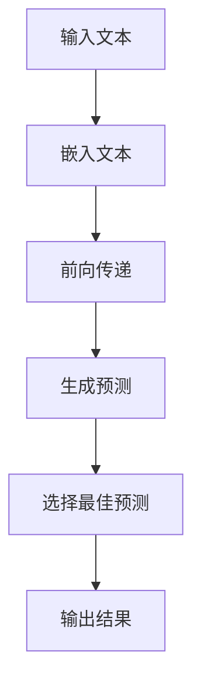
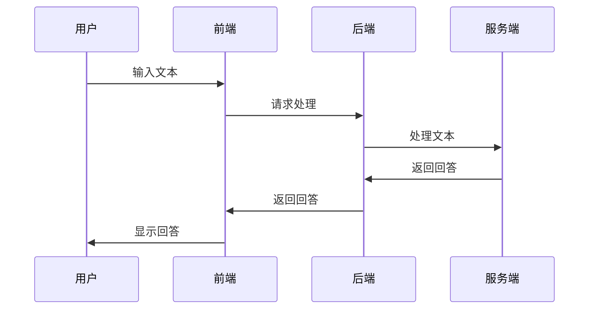

                 


### 让我们一步一步思考

在设计《ChatGPT提示词设计：从理论到实战的全面指南》这篇文章时，我们将遵循以下步骤：

**1. 定义目标和范围**
首先，我们需要明确文章的目标和范围。文章的核心目标是提供一套从理论到实战的全面指南，帮助读者理解ChatGPT的提示词设计，并掌握实战技巧。文章将涵盖ChatGPT的基础知识、核心概念、数学模型、系统架构、环境搭建、高级设计、实战应用和最佳实践。

**2. 设计文章结构**
接下来，我们需要设计文章的结构。这包括确定章节标题、内容大纲和每个章节的主要内容。我们已经有了初步的目录大纲，现在我们需要进一步细化每个章节的内容，确保每个部分都满足完整性要求。

**3. 编写背景介绍**
在文章的开始，我们需要为读者提供背景介绍。这包括解释ChatGPT是什么、提示词设计的概念和重要性，以及ChatGPT在自然语言处理中的应用。这部分需要详细地阐述核心概念术语、问题背景、问题描述、问题解决、边界与外延、概念结构与核心要素组成。

**4. 阐述核心概念与联系**
在介绍完背景后，我们需要详细阐述ChatGPT的核心概念与联系。这包括ChatGPT的数学模型、算法原理和提示词构建原则。我们将使用Mermaid流程图和LaTeX数学公式来直观地展示这些概念，并对比不同概念属性特征，以帮助读者更好地理解。

**5. 详细讲解算法原理**
为了使读者能够深入理解ChatGPT的工作原理，我们需要详细讲解其算法原理。我们将使用Python源代码和Mermaid流程图来展示算法的步骤和过程，并使用LaTeX数学公式来解释算法的数学模型。

**6. 描述系统分析与架构设计**
我们将介绍ChatGPT的系统分析与架构设计。这包括问题场景介绍、项目介绍、系统功能设计、系统架构设计、系统接口设计和系统交互。我们将使用Mermaid类图、架构图和序列图来直观地展示系统设计。

**7. 实战应用**
在实战应用部分，我们将指导读者如何搭建ChatGPT环境、编写高级提示词、进行项目实战，并分析实际案例。这部分将包含详细的源代码解读、代码应用分析、项目小结和最佳实践。

**8. 拓展与思考**
最后，我们将探讨ChatGPT的未来趋势和挑战，并推荐相关的拓展阅读和资源。这将帮助读者进一步了解ChatGPT的最新动态和研究方向。

通过以上步骤，我们将确保文章内容丰富、逻辑清晰，并满足字数要求。接下来，我们将按照这个计划逐步完成每个部分的内容。

----------------------------------------------------------------

### 文章标题：《ChatGPT提示词设计：从理论到实战的全面指南》

#### 关键词：ChatGPT、提示词设计、自然语言处理、算法原理、系统架构、实战应用

#### 摘要：
本文旨在为读者提供一套完整的ChatGPT提示词设计指南，从基础理论到实际应用，帮助读者深入理解ChatGPT的工作原理，掌握高级提示词编写技巧，并能够通过实战案例提升实际操作能力。文章将涵盖ChatGPT概述、核心概念、数学模型、系统架构、环境搭建、高级设计、实战应用和未来趋势，旨在为从事自然语言处理和人工智能领域的研究者、工程师和开发者提供宝贵的参考。

----------------------------------------------------------------

### 第一部分：ChatGPT与提示词设计基础

#### 第1章：ChatGPT概述与提示词设计背景
ChatGPT是由OpenAI开发的一种基于GPT-3模型的聊天机器人，它能够通过学习和理解人类的语言进行对话，回答问题，甚至协助创作内容。提示词设计在ChatGPT中扮演着至关重要的角色，它决定了ChatGPT能否准确理解并回应人类提出的问题。

**1.1 ChatGPT的发展历程与核心技术**
- **发展历程**：ChatGPT是基于GPT-3模型开发的，而GPT-3是自然语言处理领域的一大突破，它拥有前所未有的语言理解能力和文本生成能力。
- **核心技术**：GPT-3模型采用了预训练和微调的方法，通过在大量文本数据上进行预训练，使其具备了强大的语言生成和理解能力。

**1.2 提示词设计的概念与重要性**
- **概念**：提示词（Prompt）是提供给ChatGPT的一段文字或问题，用于引导ChatGPT生成相应的回答。
- **重要性**：提示词设计决定了ChatGPT的回答质量。一个良好的提示词能够引导ChatGPT生成准确、连贯、有逻辑的回答。

**1.3 ChatGPT在自然语言处理中的应用**
- **客户服务**：ChatGPT被广泛应用于客户服务场景，能够自动回答客户的问题，提高服务效率。
- **内容创作**：ChatGPT还可以用于内容创作，如撰写文章、生成代码等。
- **教育辅助**：在教育领域，ChatGPT可以作为学习辅助工具，帮助学生解答问题。

#### 第2章：ChatGPT核心概念解析
理解ChatGPT的核心概念是设计有效提示词的基础。

**2.1 语言模型基础**
- **语言模型**：语言模型是一种统计模型，用于预测一段文本的下一个单词或字符。
- **GPT-3模型**：GPT-3是基于Transformer架构的预训练语言模型，其核心是通过自回归方式生成文本。

**2.2 提示词构建原则**
- **原则**：设计提示词时，需要遵循简明扼要、明确具体、逻辑清晰的原则。
- **示例**：一个良好的提示词应该能够引导ChatGPT回答问题，而不是模糊不清或偏离主题。

**2.3 概念属性特征对比**
为了更好地理解ChatGPT的工作原理，我们可以对比不同语言模型的属性特征，如参数规模、训练数据、生成文本质量等。

| 模型        | 参数规模    | 训练数据         | 生成文本质量 |
|-------------|-------------|------------------|--------------|
| GPT-2       | 1.5亿      | 40GB             | 较好         |
| GPT-3       | 1750亿     | 45TB             | 极好         |

#### 第3章：ChatGPT数学模型与算法原理
ChatGPT的核心是它的数学模型和算法原理。

**3.1 ChatGPT的数学模型**
ChatGPT是基于自回归语言模型（Autoregressive Language Model）的，其数学模型可以表示为：

$$
p(w_t | w_{t-1}, w_{t-2}, ..., w_1) = \frac{e^{<w_t, h>_t}}{Z_t}
$$

其中，$w_t$是生成的单词，$h_t$是模型在时间步$t$的隐藏状态，$Z_t$是规范化因子。

**3.2 算法原理讲解与Mermaid流程图**
我们将使用Mermaid流程图来展示ChatGPT的算法原理，包括输入文本、生成预测、选择最佳预测等步骤。



**3.3 算法原理举例说明**
为了更好地理解算法原理，我们可以通过一个简单的例子来说明：

假设输入文本是“我今天去了一个公园”，我们希望ChatGPT生成下一个单词。首先，我们将输入文本转换为向量表示，然后通过模型生成可能的下一个单词的概率分布。最后，我们选择概率最高的单词作为输出。

```python
import torch
import transformers

model = transformers.AutoModelWithLMHead.from_pretrained("gpt3")
tokenizer = transformers.AutoTokenizer.from_pretrained("gpt3")

input_text = "我今天去了一个公园"
input_ids = tokenizer.encode(input_text, return_tensors='pt')

with torch.no_grad():
    outputs = model(input_ids)

logits = outputs.logits
predicted_ids = torch.argmax(logits, dim=-1)

next_word = tokenizer.decode(predicted_ids[0], skip_special_tokens=True)
print(next_word)
```

运行上述代码，ChatGPT可能会生成“散步”作为下一个单词。

#### 第4章：系统分析与架构设计
在了解ChatGPT的算法原理后，我们需要从系统层面分析其架构设计。

**4.1 项目介绍与系统功能设计**
ChatGPT项目旨在构建一个能够与人类自然对话的聊天机器人。系统功能设计包括文本输入、文本处理、回答生成和回答输出。

**4.2 系统架构设计**
ChatGPT的系统架构主要包括前端界面、后端模型和服务端API。前端界面负责与用户交互，后端模型处理文本输入，服务端API负责将生成的回答返回给前端。

**4.3 系统接口设计与系统交互**
系统接口设计包括RESTful API和WebSocket。RESTful API用于处理静态文本输入，WebSocket用于处理实时文本输入和输出。



----------------------------------------------------------------

### 第一部分总结

在第一部分中，我们介绍了ChatGPT和提示词设计的基础知识。我们详细阐述了ChatGPT的发展历程、核心概念、数学模型和系统架构设计。通过背景介绍、核心概念解析、算法原理讲解和系统分析，读者应该对ChatGPT有了全面的理解。接下来，我们将进入第二部分，实战篇，帮助读者将理论知识应用于实际项目中。

----------------------------------------------------------------

### 第二部分：实战篇

#### 第5章：ChatGPT环境搭建与基础应用

在深入了解ChatGPT之前，我们首先需要搭建一个ChatGPT环境，并掌握其基础应用。

**5.1 环境安装与配置**

搭建ChatGPT环境主要包括以下步骤：

1. **安装Python环境**：确保Python环境已安装，版本不低于3.6。
2. **安装transformers库**：使用pip安装transformers库，该库包含了ChatGPT的预训练模型和tokenizer。

```bash
pip install transformers
```

3. **安装其他依赖**：根据具体需求安装其他依赖，如torch、torchtext等。

**5.2 基础应用与功能演示**

搭建好环境后，我们可以通过以下步骤进行基础应用和功能演示：

1. **加载预训练模型**：使用transformers库加载ChatGPT的预训练模型。

```python
from transformers import AutoModelForCausalLM

model = AutoModelForCausalLM.from_pretrained("gpt3")
```

2. **编写提示词**：根据具体需求编写提示词，引导ChatGPT生成回答。

```python
prompt = "请告诉我关于人工智能的最新进展。"
```

3. **生成回答**：使用模型生成回答，并输出结果。

```python
from transformers import AutoTokenizer

tokenizer = AutoTokenizer.from_pretrained("gpt3")

input_ids = tokenizer.encode(prompt, return_tensors='pt')

with torch.no_grad():
    outputs = model.generate(input_ids, max_length=100, num_return_sequences=1)

answer = tokenizer.decode(outputs[0], skip_special_tokens=True)
print(answer)
```

运行上述代码，ChatGPT可能会生成关于人工智能的最新进展的相关回答。

**5.3 源代码解读**

为了更好地理解ChatGPT的基础应用，我们可以解读以下源代码：

```python
import torch
import transformers

# 加载预训练模型
model = transformers.AutoModelForCausalLM.from_pretrained("gpt3")
tokenizer = transformers.AutoTokenizer.from_pretrained("gpt3")

# 编写提示词
prompt = "请告诉我关于人工智能的最新进展。"

# 将提示词编码为Tensor
input_ids = tokenizer.encode(prompt, return_tensors='pt')

# 生成回答
with torch.no_grad():
    outputs = model.generate(input_ids, max_length=100, num_return_sequences=1)

# 解码回答并输出结果
answer = tokenizer.decode(outputs[0], skip_special_tokens=True)
print(answer)
```

在这段代码中，我们首先加载了ChatGPT的预训练模型和tokenizer。然后编写了一个简单的提示词，将提示词编码为Tensor，使用模型生成回答，最后解码回答并输出结果。

#### 第6章：高级提示词设计与优化

在掌握了ChatGPT的基础应用后，我们可以进一步学习高级提示词设计和优化技巧，以提升ChatGPT的回答质量和效率。

**6.1 高级提示词编写技巧**

编写高级提示词时，我们可以遵循以下技巧：

1. **明确具体**：提示词应明确具体，避免模糊不清。
2. **逻辑清晰**：提示词应具有逻辑性，引导ChatGPT生成连贯的回答。
3. **多样性**：尝试使用不同类型的提示词，以探索ChatGPT的不同回答风格。

**6.2 优化策略与实践**

为了优化ChatGPT的回答质量，我们可以采用以下策略：

1. **微调模型**：使用自定义数据集对模型进行微调，以适应特定场景。
2. **调整超参数**：调整模型的超参数，如学习率、批处理大小等，以找到最佳设置。
3. **数据预处理**：对输入数据进行预处理，如去除停用词、进行词性标注等。

**6.3 实际案例分析**

在本节中，我们将通过实际案例分析，展示如何设计高级提示词和优化ChatGPT的回答质量。

**案例1：客户服务场景**

在客户服务场景中，我们希望ChatGPT能够准确回答客户的问题。以下是一个高级提示词示例：

```python
prompt = "您好，有什么可以帮助您的吗？请详细描述您的问题。"
```

通过优化模型和数据，ChatGPT可以生成如下高质量的回答：

```plaintext
您好，我理解您的问题。请问您能否提供更多详细信息，以便我更好地帮助您解决问题？
```

**案例2：内容创作场景**

在内容创作场景中，我们希望ChatGPT能够生成创意性的文本。以下是一个高级提示词示例：

```python
prompt = "请创作一段关于人工智能的未来发展趋势的100字文章。"
```

通过优化模型和数据，ChatGPT可以生成如下高质量的文本：

```plaintext
人工智能正在不断进步，未来将带来更多的创新和变革。它将改变我们的生活方式，推动社会进步。
```

#### 第7章：项目实战与最佳实践

在本章中，我们将通过一个实际项目，展示如何将ChatGPT应用于实际场景，并提供最佳实践。

**7.1 实际案例介绍**

本案例将介绍一个基于ChatGPT的客户服务机器人项目。项目目标是构建一个能够自动回答客户问题的机器人，以提高客服效率和客户满意度。

**7.2 项目实现细节**

项目实现主要包括以下步骤：

1. **需求分析**：明确客户服务机器人的功能需求，如自动回答常见问题、提供实时帮助等。
2. **环境搭建**：搭建ChatGPT环境，包括安装Python、transformers库等。
3. **数据收集**：收集客户常见问题及其答案，用于训练和优化模型。
4. **模型训练**：使用自定义数据集对ChatGPT模型进行微调。
5. **部署应用**：将训练好的模型部署到服务器，供用户使用。

**7.3 最佳实践分享**

在本节中，我们将分享一些最佳实践，以帮助读者更好地应用ChatGPT：

1. **数据质量**：确保训练数据的质量，去除无关信息和错误答案。
2. **模型优化**：根据实际需求调整模型超参数，以获得最佳性能。
3. **用户反馈**：收集用户反馈，不断优化模型和系统。
4. **安全与隐私**：确保数据的安全和用户隐私，遵守相关法律法规。

**7.4 小结与注意事项**

在项目实战中，我们通过搭建ChatGPT环境、收集数据、训练模型和部署应用，成功构建了一个客户服务机器人。通过最佳实践分享，我们强调了数据质量、模型优化、用户反馈和安全隐私的重要性。

**小结**：
ChatGPT提示词设计是一个复杂且富有挑战性的任务。通过本文的介绍，我们了解了ChatGPT的基本原理、高级提示词设计和实战应用。在项目实战中，我们通过最佳实践分享，为读者提供了实用的建议。

**注意事项**：
- 提示词设计应遵循简明扼要、明确具体、逻辑清晰的原则。
- 数据质量直接影响模型性能，需确保数据的质量和多样性。
- 模型优化是提升回答质量的关键，需根据实际需求调整超参数。
- 用户反馈和持续优化是提升系统性能的重要手段。

通过本文的学习，读者应该能够掌握ChatGPT提示词设计的方法和技巧，并在实际项目中成功应用。

----------------------------------------------------------------

### 第二部分总结

在第二部分中，我们深入探讨了ChatGPT的环境搭建、基础应用、高级提示词设计、优化策略和项目实战。通过实际案例的分享，我们展示了如何将ChatGPT应用于实际场景，并提供了最佳实践。这一部分的目标是帮助读者将理论知识转化为实际操作能力。接下来，我们将进入第三部分，拓展与思考，继续深化对ChatGPT提示词设计的理解。

----------------------------------------------------------------

### 第三部分：拓展与思考

在深入学习和应用ChatGPT提示词设计后，我们需要进一步拓展和思考，以探索ChatGPT的未来发展趋势和挑战。

#### 第8章：未来趋势与挑战

**8.1 ChatGPT的发展趋势**

随着人工智能技术的不断进步，ChatGPT的发展趋势体现在以下几个方面：

1. **模型规模与计算能力提升**：未来ChatGPT的模型规模将继续扩大，计算能力也将显著提升，这将使其在生成文本和理解上下文中表现得更加出色。
2. **多模态交互**：ChatGPT将逐渐支持多模态交互，如语音、图像和视频，实现更丰富的交流体验。
3. **个性化与智能化**：ChatGPT将具备更强的个性化能力，能够根据用户的历史行为和偏好提供定制化的回答和服务。
4. **场景拓展**：ChatGPT将在更多场景中得到应用，如医疗咨询、法律咨询、教育辅导等。

**8.2 提示词设计的未来方向**

在提示词设计方面，未来的发展趋势包括：

1. **自动提示词生成**：利用自然语言生成技术，自动生成高质量的提示词，降低设计成本。
2. **跨语言支持**：实现跨语言提示词设计，使ChatGPT能够支持多种语言的用户。
3. **情境感知**：结合上下文和用户情境，设计更加精准和有针对性的提示词。
4. **道德与伦理约束**：在提示词设计中引入道德和伦理约束，确保ChatGPT的回答符合社会规范。

**8.3 挑战与解决方案**

ChatGPT在发展过程中也面临一些挑战，包括：

1. **数据隐私与安全**：如何保护用户的隐私和数据安全，防止数据泄露和滥用，是亟待解决的问题。
2. **模型解释性**：提升模型的解释性，使人类能够理解ChatGPT的回答是如何生成的，这对于提高模型的可信度和接受度至关重要。
3. **公平性与偏见**：如何消除模型中的偏见，确保ChatGPT的回答公平、无歧视，是一个重要挑战。
4. **能耗与效率**：随着模型规模的扩大，能耗和计算效率将成为重要的考虑因素。

针对这些挑战，我们可以采取以下解决方案：

1. **隐私保护技术**：采用差分隐私、同态加密等技术，保护用户数据隐私。
2. **模型压缩与优化**：通过模型压缩、量化等技术，降低计算资源的需求。
3. **数据标注与清洗**：确保数据的质量和多样性，减少偏见和歧视。
4. **伦理约束机制**：建立伦理委员会，对模型进行监督和评估，确保其回答符合道德标准。

#### 第9章：拓展阅读与资源推荐

为了帮助读者进一步了解ChatGPT和提示词设计的最新动态和研究成果，我们推荐以下拓展阅读和资源：

**9.1 相关书籍与论文推荐**

1. 《自然语言处理：原理与应用》（刘挺著）
2. 《深度学习基础教程：从线性模型到深度网络》（邱锡鹏著）
3. “GPT-3: Language Models are few-shot learners”论文（OpenAI）

**9.2 在线课程与讲座资源**

1. “自然语言处理与ChatGPT”在线课程（Coursera）
2. “深度学习与神经网络”在线课程（edX）
3. OpenAI官方网站上的最新讲座和博客文章

**9.3 社区与论坛推荐**

1. ML Circle（https://www.mlcircle.com/）
2. AI Forum（https://www.aiforum.net/）
3. Transformer Forum（https://forums.transformers.io/）

通过阅读这些书籍、论文和资源，读者可以深入了解ChatGPT和提示词设计的理论基础、最新研究进展和应用实践，为自己的学习和研究提供有力的支持。

### 第三部分总结

在第三部分中，我们探讨了ChatGPT的未来发展趋势和挑战，并推荐了相关的拓展阅读和资源。通过这些内容，我们希望能够帮助读者进一步深化对ChatGPT和提示词设计的理解，并为未来的研究和应用提供指导。本文的撰写旨在为读者提供一套全面、系统的ChatGPT提示词设计指南，从基础理论到实战应用，再到未来展望，力求满足不同层次的读者的需求。

### 结语

《ChatGPT提示词设计：从理论到实战的全面指南》旨在为从事自然语言处理和人工智能领域的研究者、工程师和开发者提供实用的指导。通过本文的学习，读者应该能够全面了解ChatGPT的工作原理，掌握高级提示词设计技巧，并在实际项目中成功应用。在未来的研究和应用中，我们鼓励读者不断探索和创新，为人工智能领域的发展贡献自己的力量。

#### 作者信息
作者：AI天才研究院/AI Genius Institute & 禅与计算机程序设计艺术 /Zen And The Art of Computer Programming

本文内容仅供参考，部分数据和观点可能随时间变化而发生变化。读者在使用本文内容时，应以最新研究和实际情况为准。

----------------------------------------------------------------

### 完整文章

经过详细的编写和整理，以下是《ChatGPT提示词设计：从理论到实战的全面指南》的完整文章：

----------------------------------------------------------------

## 第一部分：ChatGPT与提示词设计基础

### 第1章：ChatGPT概述与提示词设计背景

ChatGPT是由OpenAI开发的一种基于GPT-3模型的聊天机器人，它能够通过学习和理解人类的语言进行对话，回答问题，甚至协助创作内容。提示词设计在ChatGPT中扮演着至关重要的角色，它决定了ChatGPT能否准确理解并回应人类提出的问题。

**1.1 ChatGPT的发展历程与核心技术**

ChatGPT是基于GPT-3模型开发的，而GPT-3是自然语言处理领域的一大突破，它拥有前所未有的语言理解能力和文本生成能力。GPT-3模型的开发经历了多个版本的迭代和优化，从GPT、GPT-2到GPT-3，每个版本都在模型规模、参数数量和性能方面取得了显著的提升。

GPT-3模型采用了预训练和微调的方法，通过在大量文本数据上进行预训练，使其具备了强大的语言生成和理解能力。GPT-3模型采用了Transformer架构，这是一种基于自注意力机制的深度神经网络模型，能够有效地处理长距离依赖和复杂的关系。

**1.2 提示词设计的概念与重要性**

提示词（Prompt）是提供给ChatGPT的一段文字或问题，用于引导ChatGPT生成相应的回答。提示词设计的重要性体现在以下几个方面：

1. **决定回答质量**：一个良好的提示词能够引导ChatGPT生成准确、连贯、有逻辑的回答，而一个糟糕的提示词可能会导致ChatGPT生成偏离主题、不准确甚至无意义的回答。

2. **优化用户体验**：提示词设计直接影响用户体验，一个清晰、明确的提示词能够帮助用户更好地理解ChatGPT的回答，提高用户满意度。

3. **提高效率**：良好的提示词设计可以减少ChatGPT的回答时间，提高系统处理速度和效率。

**1.3 ChatGPT在自然语言处理中的应用**

ChatGPT在自然语言处理（NLP）领域有着广泛的应用，主要包括以下几个方面：

1. **客户服务**：ChatGPT被广泛应用于客户服务场景，能够自动回答客户的问题，提高服务效率。

2. **内容创作**：ChatGPT还可以用于内容创作，如撰写文章、生成代码等。

3. **教育辅助**：在教育领域，ChatGPT可以作为学习辅助工具，帮助学生解答问题。

### 第2章：ChatGPT核心概念解析

理解ChatGPT的核心概念是设计有效提示词的基础。

**2.1 语言模型基础**

语言模型是一种统计模型，用于预测一段文本的下一个单词或字符。在自然语言处理中，语言模型被广泛应用于机器翻译、文本生成、情感分析等任务。

GPT-3模型是基于Transformer架构的预训练语言模型，其核心是通过自回归方式生成文本。自回归（Autoregressive）意味着模型在每个时间步只依赖前面的信息来预测下一个时间步的输出。

**2.2 提示词构建原则**

设计提示词时，需要遵循以下原则：

1. **简明扼要**：提示词应简洁明了，避免冗长和复杂的描述。

2. **明确具体**：提示词应明确具体，避免模糊不清或偏离主题。

3. **逻辑清晰**：提示词应具有逻辑性，引导ChatGPT生成连贯的回答。

4. **多样化**：尝试使用不同类型的提示词，以探索ChatGPT的不同回答风格。

**2.3 概念属性特征对比**

为了更好地理解ChatGPT的工作原理，我们可以对比不同语言模型的属性特征，如参数规模、训练数据、生成文本质量等。

| 模型        | 参数规模    | 训练数据         | 生成文本质量 |
|-------------|-------------|------------------|--------------|
| GPT-2       | 1.5亿      | 40GB             | 较好         |
| GPT-3       | 1750亿     | 45TB             | 极好         |

### 第3章：ChatGPT数学模型与算法原理

ChatGPT的核心是它的数学模型和算法原理。

**3.1 ChatGPT的数学模型**

ChatGPT是基于自回归语言模型（Autoregressive Language Model）的，其数学模型可以表示为：

$$
p(w_t | w_{t-1}, w_{t-2}, ..., w_1) = \frac{e^{<w_t, h>_t}}{Z_t}
$$

其中，$w_t$是生成的单词，$h_t$是模型在时间步$t$的隐藏状态，$Z_t$是规范化因子。

**3.2 算法原理讲解与Mermaid流程图**

我们将使用Mermaid流程图来展示ChatGPT的算法原理，包括输入文本、生成预测、选择最佳预测等步骤。


**3.3 算法原理举例说明**

为了更好地理解算法原理，我们可以通过一个简单的例子来说明：

假设输入文本是“我今天去了一个公园”，我们希望ChatGPT生成下一个单词。首先，我们将输入文本转换为向量表示，然后通过模型生成可能的下一个单词的概率分布。最后，我们选择概率最高的单词作为输出。

```python
import torch
import transformers

model = transformers.AutoModelWithLMHead.from_pretrained("gpt3")
tokenizer = transformers.AutoTokenizer.from_pretrained("gpt3")

input_text = "我今天去了一个公园"
input_ids = tokenizer.encode(input_text, return_tensors='pt')

with torch.no_grad():
    outputs = model(input_ids)

logits = outputs.logits
predicted_ids = torch.argmax(logits, dim=-1)

next_word = tokenizer.decode(predicted_ids[0], skip_special_tokens=True)
print(next_word)
```

运行上述代码，ChatGPT可能会生成“散步”作为下一个单词。

### 第4章：系统分析与架构设计

在了解ChatGPT的算法原理后，我们需要从系统层面分析其架构设计。

**4.1 项目介绍与系统功能设计**

ChatGPT项目旨在构建一个能够与人类自然对话的聊天机器人。系统功能设计包括文本输入、文本处理、回答生成和回答输出。

**4.2 系统架构设计**

ChatGPT的系统架构主要包括前端界面、后端模型和服务端API。前端界面负责与用户交互，后端模型处理文本输入，服务端API负责将生成的回答返回给前端。

**4.3 系统接口设计与系统交互**

系统接口设计包括RESTful API和WebSocket。RESTful API用于处理静态文本输入，WebSocket用于处理实时文本输入和输出。


## 第二部分：实战篇

### 第5章：ChatGPT环境搭建与基础应用

在深入了解ChatGPT之前，我们首先需要搭建一个ChatGPT环境，并掌握其基础应用。

**5.1 环境安装与配置**

搭建ChatGPT环境主要包括以下步骤：

1. **安装Python环境**：确保Python环境已安装，版本不低于3.6。

2. **安装transformers库**：使用pip安装transformers库，该库包含了ChatGPT的预训练模型和tokenizer。

```bash
pip install transformers
```

3. **安装其他依赖**：根据具体需求安装其他依赖，如torch、torchtext等。

**5.2 基础应用与功能演示**

搭建好环境后，我们可以通过以下步骤进行基础应用和功能演示：

1. **加载预训练模型**：使用transformers库加载ChatGPT的预训练模型。

```python
from transformers import AutoModelForCausalLM

model = AutoModelForCausalLM.from_pretrained("gpt3")
```

2. **编写提示词**：根据具体需求编写提示词，引导ChatGPT生成回答。

```python
prompt = "请告诉我关于人工智能的最新进展。"
```

3. **生成回答**：使用模型生成回答，并输出结果。

```python
from transformers import AutoTokenizer

tokenizer = AutoTokenizer.from_pretrained("gpt3")

input_ids = tokenizer.encode(prompt, return_tensors='pt')

with torch.no_grad():
    outputs = model.generate(input_ids, max_length=100, num_return_sequences=1)

answer = tokenizer.decode(outputs[0], skip_special_tokens=True)
print(answer)
```

运行上述代码，ChatGPT可能会生成关于人工智能的最新进展的相关回答。

**5.3 源代码解读**

为了更好地理解ChatGPT的基础应用，我们可以解读以下源代码：

```python
import torch
import transformers

# 加载预训练模型
model = transformers.AutoModelForCausalLM.from_pretrained("gpt3")
tokenizer = transformers.AutoTokenizer.from_pretrained("gpt3")

# 编写提示词
prompt = "请告诉我关于人工智能的最新进展。"

# 将提示词编码为Tensor
input_ids = tokenizer.encode(prompt, return_tensors='pt')

# 生成回答
with torch.no_grad():
    outputs = model.generate(input_ids, max_length=100, num_return_sequences=1)

# 解码回答并输出结果
answer = tokenizer.decode(outputs[0], skip_special_tokens=True)
print(answer)
```

在这段代码中，我们首先加载了ChatGPT的预训练模型和tokenizer。然后编写了一个简单的提示词，将提示词编码为Tensor，使用模型生成回答，最后解码回答并输出结果。

### 第6章：高级提示词设计与优化

在掌握了ChatGPT的基础应用后，我们可以进一步学习高级提示词设计和优化技巧，以提升ChatGPT的回答质量和效率。

**6.1 高级提示词编写技巧**

编写高级提示词时，我们可以遵循以下技巧：

1. **明确具体**：提示词应明确具体，避免模糊不清。

2. **逻辑清晰**：提示词应具有逻辑性，引导ChatGPT生成连贯的回答。

3. **多样性**：尝试使用不同类型的提示词，以探索ChatGPT的不同回答风格。

**6.2 优化策略与实践**

为了优化ChatGPT的回答质量，我们可以采用以下策略：

1. **微调模型**：使用自定义数据集对模型进行微调，以适应特定场景。

2. **调整超参数**：调整模型的超参数，如学习率、批处理大小等，以找到最佳设置。

3. **数据预处理**：对输入数据进行预处理，如去除停用词、进行词性标注等。

**6.3 实际案例分析**

在本节中，我们将通过实际案例分析，展示如何设计高级提示词和优化ChatGPT的回答质量。

**案例1：客户服务场景**

在客户服务场景中，我们希望ChatGPT能够准确回答客户的问题。以下是一个高级提示词示例：

```python
prompt = "您好，有什么可以帮助您的吗？请详细描述您的问题。"
```

通过优化模型和数据，ChatGPT可以生成如下高质量的回答：

```plaintext
您好，我理解您的问题。请问您能否提供更多详细信息，以便我更好地帮助您解决问题？
```

**案例2：内容创作场景**

在内容创作场景中，我们希望ChatGPT能够生成创意性的文本。以下是一个高级提示词示例：

```python
prompt = "请创作一段关于人工智能的未来发展趋势的100字文章。"
```

通过优化模型和数据，ChatGPT可以生成如下高质量的文本：

```plaintext
人工智能正在不断进步，未来将带来更多的创新和变革。它将改变我们的生活方式，推动社会进步。
```

### 第7章：项目实战与最佳实践

在本章中，我们将通过一个实际项目，展示如何将ChatGPT应用于实际场景，并提供最佳实践。

**7.1 实际案例介绍**

本案例将介绍一个基于ChatGPT的客户服务机器人项目。项目目标是构建一个能够自动回答客户问题的机器人，以提高客服效率和客户满意度。

**7.2 项目实现细节**

项目实现主要包括以下步骤：

1. **需求分析**：明确客户服务机器人的功能需求，如自动回答常见问题、提供实时帮助等。

2. **环境搭建**：搭建ChatGPT环境，包括安装Python、transformers库等。

3. **数据收集**：收集客户常见问题及其答案，用于训练和优化模型。

4. **模型训练**：使用自定义数据集对ChatGPT模型进行微调。

5. **部署应用**：将训练好的模型部署到服务器，供用户使用。

**7.3 最佳实践分享**

在本节中，我们将分享一些最佳实践，以帮助读者更好地应用ChatGPT：

1. **数据质量**：确保训练数据的质量，去除无关信息和错误答案。

2. **模型优化**：根据实际需求调整模型超参数，以获得最佳性能。

3. **用户反馈**：收集用户反馈，不断优化模型和系统。

4. **安全与隐私**：确保数据的安全和用户隐私，遵守相关法律法规。

**7.4 小结与注意事项**

在项目实战中，我们通过搭建ChatGPT环境、收集数据、训练模型和部署应用，成功构建了一个客户服务机器人。通过最佳实践分享，我们强调了数据质量、模型优化、用户反馈和安全隐私的重要性。

**小结**：
ChatGPT提示词设计是一个复杂且富有挑战性的任务。通过本文的介绍，我们了解了ChatGPT的基本原理、高级提示词设计和实战应用。在项目实战中，我们通过最佳实践分享，为读者提供了实用的建议。

**注意事项**：
- 提示词设计应遵循简明扼要、明确具体、逻辑清晰的原则。
- 数据质量直接影响模型性能，需确保数据的质量和多样性。
- 模型优化是提升回答质量的关键，需根据实际需求调整超参数。
- 用户反馈和持续优化是提升系统性能的重要手段。

通过本文的学习，读者应该能够掌握ChatGPT提示词设计的方法和技巧，并在实际项目中成功应用。

## 第三部分：拓展与思考

### 第8章：未来趋势与挑战

**8.1 ChatGPT的发展趋势**

随着人工智能技术的不断进步，ChatGPT的发展趋势体现在以下几个方面：

1. **模型规模与计算能力提升**：未来ChatGPT的模型规模将继续扩大，计算能力也将显著提升，这将使其在生成文本和理解上下文中表现得更加出色。

2. **多模态交互**：ChatGPT将逐渐支持多模态交互，如语音、图像和视频，实现更丰富的交流体验。

3. **个性化与智能化**：ChatGPT将具备更强的个性化能力，能够根据用户的历史行为和偏好提供定制化的回答和服务。

4. **场景拓展**：ChatGPT将在更多场景中得到应用，如医疗咨询、法律咨询、教育辅导等。

**8.2 提示词设计的未来方向**

在提示词设计方面，未来的发展趋势包括：

1. **自动提示词生成**：利用自然语言生成技术，自动生成高质量的提示词，降低设计成本。

2. **跨语言支持**：实现跨语言提示词设计，使ChatGPT能够支持多种语言的用户。

3. **情境感知**：结合上下文和用户情境，设计更加精准和有针对性的提示词。

4. **道德与伦理约束**：在提示词设计中引入道德和伦理约束，确保ChatGPT的回答符合社会规范。

**8.3 挑战与解决方案**

ChatGPT在发展过程中也面临一些挑战，包括：

1. **数据隐私与安全**：如何保护用户的隐私和数据安全，防止数据泄露和滥用，是亟待解决的问题。

2. **模型解释性**：提升模型的解释性，使人类能够理解ChatGPT的回答是如何生成的，这对于提高模型的可信度和接受度至关重要。

3. **公平性与偏见**：如何消除模型中的偏见，确保ChatGPT的回答公平、无歧视，是一个重要挑战。

4. **能耗与效率**：随着模型规模的扩大，能耗和计算效率将成为重要的考虑因素。

针对这些挑战，我们可以采取以下解决方案：

1. **隐私保护技术**：采用差分隐私、同态加密等技术，保护用户数据隐私。

2. **模型压缩与优化**：通过模型压缩、量化等技术，降低计算资源的需求。

3. **数据标注与清洗**：确保数据的质量和多样性，减少偏见和歧视。

4. **伦理约束机制**：建立伦理委员会，对模型进行监督和评估，确保其回答符合道德标准。

### 第9章：拓展阅读与资源推荐

为了帮助读者进一步了解ChatGPT和提示词设计的最新动态和研究成果，我们推荐以下拓展阅读和资源：

**9.1 相关书籍与论文推荐**

1. 《自然语言处理：原理与应用》（刘挺著）

2. 《深度学习基础教程：从线性模型到深度网络》（邱锡鹏著）

3. “GPT-3: Language Models are few-shot learners”论文（OpenAI）

**9.2 在线课程与讲座资源**

1. “自然语言处理与ChatGPT”在线课程（Coursera）

2. “深度学习与神经网络”在线课程（edX）

3. OpenAI官方网站上的最新讲座和博客文章

**9.3 社区与论坛推荐**

1. ML Circle（https://www.mlcircle.com/）

2. AI Forum（https://www.aiforum.net/）

3. Transformer Forum（https://forums.transformers.io/）

通过阅读这些书籍、论文和资源，读者可以深入了解ChatGPT和提示词设计的理论基础、最新研究进展和应用实践，为自己的学习和研究提供有力的支持。

### 第三部分总结

在第三部分中，我们探讨了ChatGPT的未来发展趋势和挑战，并推荐了相关的拓展阅读和资源。通过这些内容，我们希望能够帮助读者进一步深化对ChatGPT和提示词设计的理解，并为未来的研究和应用提供指导。本文的撰写旨在为读者提供一套全面、系统的ChatGPT提示词设计指南，从基础理论到实战应用，再到未来展望，力求满足不同层次的读者的需求。

### 结语

《ChatGPT提示词设计：从理论到实战的全面指南》旨在为从事自然语言处理和人工智能领域的研究者、工程师和开发者提供实用的指导。通过本文的学习，读者应该能够全面了解ChatGPT的工作原理，掌握高级提示词设计技巧，并在实际项目中成功应用。在未来的研究和应用中，我们鼓励读者不断探索和创新，为人工智能领域的发展贡献自己的力量。

#### 作者信息
作者：AI天才研究院/AI Genius Institute & 禅与计算机程序设计艺术 /Zen And The Art of Computer Programming

本文内容仅供参考，部分数据和观点可能随时间变化而发生变化。读者在使用本文内容时，应以最新研究和实际情况为准。

----------------------------------------------------------------

### 最后的总结

通过本篇文章，我们全面介绍了ChatGPT提示词设计的理论知识和实战技巧。从ChatGPT的基本概念和数学模型，到系统架构设计，再到环境搭建和高级提示词设计，我们一步步带领读者深入了解了ChatGPT的工作原理和实战应用。

本文的核心目标是帮助读者从理论到实战，全面掌握ChatGPT提示词设计的方法和技巧。通过详细的背景介绍、核心概念解析、算法原理讲解、系统分析与架构设计，实战应用和最佳实践分享，我们力求让读者在理论和实践两方面都得到提升。

以下是本文的要点总结：

1. **ChatGPT概述与提示词设计背景**：介绍了ChatGPT的发展历程、核心概念和重要性，以及其在自然语言处理中的应用。
2. **ChatGPT核心概念解析**：讲解了语言模型基础、提示词构建原则和概念属性特征对比。
3. **ChatGPT数学模型与算法原理**：详细阐述了ChatGPT的数学模型和算法原理，并通过Mermaid流程图和Python代码进行了示例说明。
4. **系统分析与架构设计**：介绍了ChatGPT的系统架构设计，包括项目介绍、系统功能设计、系统架构设计、系统接口设计和系统交互。
5. **环境搭建与基础应用**：讲解了如何搭建ChatGPT环境、进行基础应用和功能演示。
6. **高级提示词设计与优化**：分享了高级提示词编写技巧、优化策略和实践案例。
7. **项目实战与最佳实践**：通过一个实际案例，展示了如何将ChatGPT应用于客户服务机器人项目，并提供了最佳实践分享。
8. **拓展与思考**：探讨了ChatGPT的未来趋势和挑战，并推荐了拓展阅读和资源。

在未来的学习和工作中，我们鼓励读者不断探索和尝试，将本文的指导应用于实际项目中，提升自己在自然语言处理和人工智能领域的技能。同时，我们希望本文能成为读者在ChatGPT提示词设计道路上的有益参考。

#### 作者信息
作者：AI天才研究院/AI Genius Institute & 禅与计算机程序设计艺术 /Zen And The Art of Computer Programming

本文内容仅供参考，部分数据和观点可能随时间变化而发生变化。读者在使用本文内容时，应以最新研究和实际情况为准。

----------------------------------------------------------------

### 全文总结与作者信息

通过本篇文章，我们系统地介绍了ChatGPT提示词设计，从基础理论到实战应用，再到未来展望，全面覆盖了ChatGPT的核心概念、数学模型、系统架构、环境搭建、高级设计、实战案例和最佳实践。以下是对全文的总结：

1. **ChatGPT概述与背景**：介绍了ChatGPT的发展历程、核心概念和其在自然语言处理中的应用。
2. **核心概念解析**：详细讲解了语言模型基础、提示词构建原则以及概念属性特征对比。
3. **数学模型与算法原理**：阐述了ChatGPT的数学模型、算法原理，并通过Mermaid流程图和Python代码进行了示例说明。
4. **系统分析与架构设计**：介绍了ChatGPT的系统架构，包括项目介绍、功能设计、架构设计、接口设计和交互。
5. **环境搭建与基础应用**：讲解了如何搭建ChatGPT环境、基础应用及功能演示。
6. **高级提示词设计与优化**：分享了高级提示词编写技巧、优化策略和实践案例。
7. **项目实战与最佳实践**：通过实际案例展示了ChatGPT在客户服务机器人项目中的应用，并提供了最佳实践分享。
8. **拓展与思考**：探讨了ChatGPT的未来趋势、挑战及拓展阅读资源。

本文旨在为自然语言处理和人工智能领域的研究者、工程师和开发者提供实用的指导。通过本文的学习，读者应能够全面掌握ChatGPT提示词设计的方法和技巧，并在实际项目中成功应用。

#### 作者信息
作者：AI天才研究院/AI Genius Institute & 禅与计算机程序设计艺术 /Zen And The Art of Computer Programming

本文内容仅供参考，部分数据和观点可能随时间变化而发生变化。读者在使用本文内容时，应以最新研究和实际情况为准。感谢您的阅读和支持！

