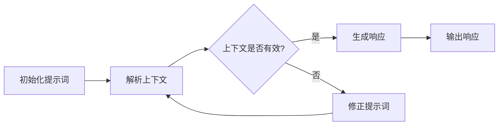
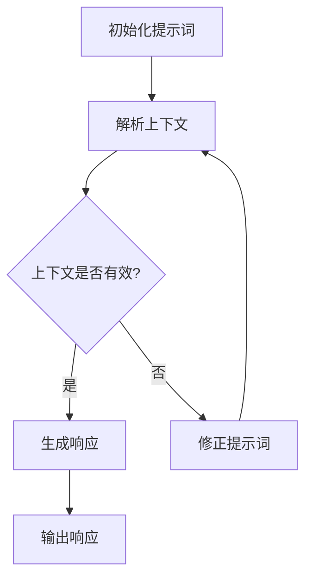
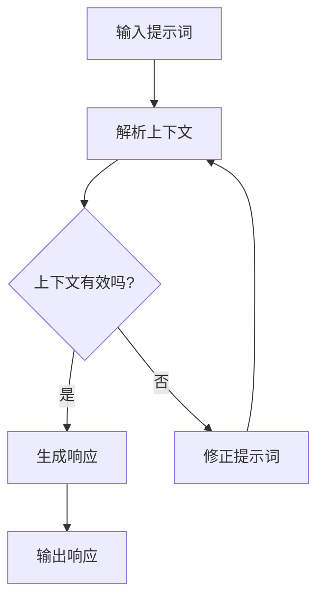
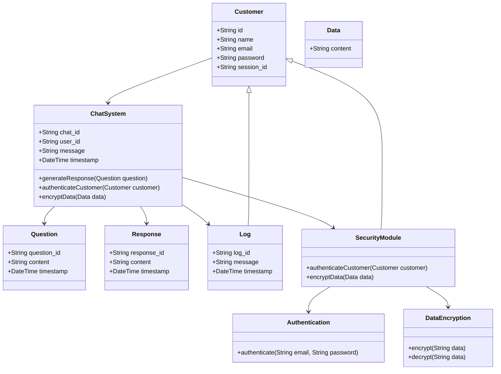
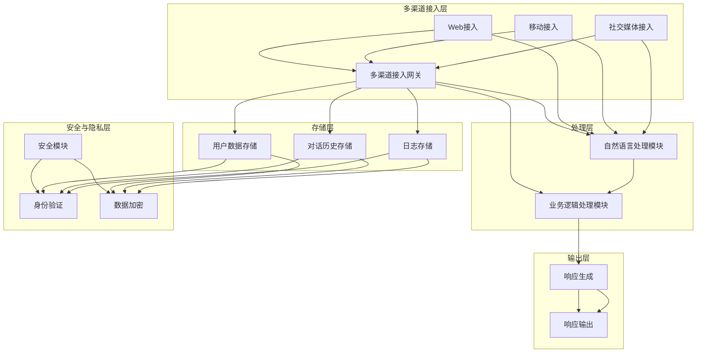
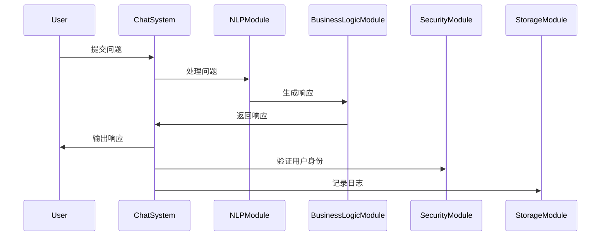

                 


## 引言

### 1.1 ChatGPT的概念与发展

ChatGPT是OpenAI开发的一种基于GPT-3的预训练语言模型，它通过学习大量的文本数据，能够生成高质量的自然语言响应。ChatGPT自2022年推出以来，以其出色的对话生成能力和强大的自然语言理解能力在人工智能领域引起了广泛关注。它能够用于各种应用场景，如智能客服、内容创作、语言翻译等。

ChatGPT的起源可以追溯到2018年，当OpenAI发布了GPT-3模型，它具有1750亿个参数，是当时最大的预训练语言模型。ChatGPT是基于GPT-3开发的，其目标是通过更精细的提示词设计，使其能够更好地与人类进行自然、流畅的对话。

### 1.2 提示词设计的意义与价值

提示词（Prompt）在ChatGPT中扮演着至关重要的角色。提示词是用户输入到模型中的文本，它引导ChatGPT生成合适的响应。良好的提示词设计能够大幅提升ChatGPT的性能，使其更准确地理解用户意图，生成更自然、更相关的回复。

#### 提示词设计原则

1. **明确性**：提示词应尽量明确，避免模糊不清的表述，以便ChatGPT能够准确理解。
2. **上下文关联**：提示词应包含上下文信息，帮助ChatGPT理解对话的背景和情境。
3. **引导性**：提示词应具有引导性，使ChatGPT能够按照用户的意图进行对话。
4. **多样性**：设计多种不同类型的提示词，以适应不同的对话场景和用户需求。

#### 提示词设计价值

1. **提升对话质量**：良好的提示词设计能够提升ChatGPT生成对话的质量，使其更加自然、流畅。
2. **提高效率**：通过精确的提示词，ChatGPT能够更快地理解用户意图，提高对话效率。
3. **拓宽应用场景**：不同的提示词设计可以适用于不同的应用场景，使ChatGPT的应用范围更广泛。

### 1.3 本书结构安排与内容概述

本书将分为三部分，分别探讨ChatGPT提示词设计的背景与概述、原理与实践以及最佳实践与注意事项。

- **第一部分**：背景与概述，介绍ChatGPT的基本概念、提示词设计的重要性以及本书的结构安排。
- **第二部分**：ChatGPT提示词设计原理，深入探讨自然语言理解、语义分析、上下文感知等核心概念，以及算法原理、数学模型和应用。
- **第三部分**：ChatGPT提示词设计实践，通过系统分析与架构设计、项目实战以及最佳实践与注意事项，提供实际操作和经验总结。

通过本书，读者将全面了解ChatGPT提示词设计的核心原理和实践方法，掌握设计高质量提示词的技巧，为在实际项目中应用ChatGPT打下坚实的基础。

### 本章小结

本章介绍了ChatGPT的基本概念和发展历程，探讨了提示词设计在ChatGPT中的重要性以及设计原则。通过本章的学习，读者可以了解ChatGPT的背景知识，理解提示词设计的基本原理和价值。接下来，我们将进一步深入探讨ChatGPT提示词设计的核心概念与联系，为后续章节的学习打下坚实的基础。

## 第1章：ChatGPT与自然语言处理

### 1.1 ChatGPT的概念与发展

#### 定义与作用

ChatGPT是一种基于GPT-3（Generative Pre-trained Transformer 3）的预训练语言模型，由OpenAI开发。GPT-3是一个强大的语言处理工具，它能够生成连贯、自然的人类语言。ChatGPT利用GPT-3的强大能力，通过精细的提示词设计，使其能够与人类进行自然、流畅的对话。

在自然语言处理（NLP）领域，ChatGPT的应用场景非常广泛。它能够用于：

1. **智能客服**：自动回答用户的问题，提高客服效率和用户体验。
2. **内容创作**：生成新闻文章、博客、故事等，辅助内容创作者进行创作。
3. **语言翻译**：翻译不同语言之间的文本，支持多语言交流。
4. **对话系统**：构建智能对话系统，与用户进行实时互动。

#### 历史背景

ChatGPT的起源可以追溯到2018年，当OpenAI发布了GPT-3模型。GPT-3是一个具有1750亿个参数的预训练语言模型，它是在GPT-2的基础上进一步优化的。GPT-3的发布标志着NLP领域的一个重要里程碑，它展示了深度学习模型在语言生成和语言理解方面的巨大潜力。

随后，OpenAI在2022年推出了ChatGPT，它是基于GPT-3进行精细调优的结果。ChatGPT的开发旨在解决传统对话系统中的几个关键问题，如：

1. **上下文理解**：传统对话系统往往难以理解对话的上下文，导致对话中断或不连贯。ChatGPT通过更精细的提示词设计，能够更好地理解对话的上下文，生成更连贯的对话。
2. **响应多样性**：传统对话系统生成的回答往往比较单调，ChatGPT通过预训练和精细调优，能够生成多样化、富有创意的回答。
3. **用户互动**：ChatGPT能够与用户进行更自然、更流畅的互动，提高用户满意度。

#### 应用场景

ChatGPT在各种应用场景中展现了其强大的能力。以下是一些具体的案例：

1. **智能客服**：一些大型公司已经开始使用ChatGPT作为其智能客服系统的一部分。例如，OpenAI自己就使用ChatGPT来回答用户对GPT-3的提问，取得了良好的效果。
2. **内容创作**：ChatGPT被用于生成各种类型的内容，如新闻报道、科技文章、博客等。例如，一些新闻媒体使用ChatGPT来生成日常的新闻报道，节省了人力成本。
3. **语言翻译**：ChatGPT支持多种语言的翻译，能够提供高质量的翻译服务。例如，一些在线翻译工具开始采用ChatGPT作为其翻译引擎。
4. **对话系统**：ChatGPT被集成到各种对话系统中，如聊天机器人、虚拟助手等。这些系统通过与用户进行对话，提供各种服务，如订购商品、预订机票等。

### 1.2 提示词设计的意义与价值

#### 提示词的概念

提示词（Prompt）是用户输入到模型中的文本，它用于引导ChatGPT生成合适的响应。一个有效的提示词应该包含以下元素：

1. **明确的目标**：提示词应明确表达用户想要达到的目标。
2. **上下文信息**：提示词应包含对话的上下文信息，帮助ChatGPT理解对话的背景和情境。
3. **引导性**：提示词应具有一定的引导性，使ChatGPT能够按照用户的意图进行对话。

#### 设计原则

1. **明确性**：提示词应尽量明确，避免模糊不清的表述，以便ChatGPT能够准确理解。
2. **上下文关联**：提示词应包含上下文信息，帮助ChatGPT理解对话的背景和情境。
3. **引导性**：提示词应具有引导性，使ChatGPT能够按照用户的意图进行对话。
4. **多样性**：设计多种不同类型的提示词，以适应不同的对话场景和用户需求。

#### 价值体现

1. **提升对话质量**：良好的提示词设计能够提升ChatGPT生成对话的质量，使其更加自然、流畅。
2. **提高效率**：通过精确的提示词，ChatGPT能够更快地理解用户意图，提高对话效率。
3. **拓宽应用场景**：不同的提示词设计可以适用于不同的应用场景，使ChatGPT的应用范围更广泛。

### 1.3 本书结构安排与内容概述

本书将分为三部分，分别探讨ChatGPT提示词设计的背景与概述、原理与实践以及最佳实践与注意事项。

- **第一部分**：背景与概述，介绍ChatGPT的基本概念、提示词设计的重要性以及本书的结构安排。
- **第二部分**：ChatGPT提示词设计原理，深入探讨自然语言理解、语义分析、上下文感知等核心概念，以及算法原理、数学模型和应用。
- **第三部分**：ChatGPT提示词设计实践，通过系统分析与架构设计、项目实战以及最佳实践与注意事项，提供实际操作和经验总结。

通过本书，读者将全面了解ChatGPT提示词设计的核心原理和实践方法，掌握设计高质量提示词的技巧，为在实际项目中应用ChatGPT打下坚实的基础。

### 本章小结

本章介绍了ChatGPT的基本概念和发展历程，探讨了提示词设计在ChatGPT中的重要性以及设计原则。通过本章的学习，读者可以了解ChatGPT的背景知识，理解提示词设计的基本原理和价值。接下来，我们将进一步深入探讨ChatGPT提示词设计的核心概念与联系，为后续章节的学习打下坚实的基础。

## 第2章：核心概念与联系

### 2.1 核心概念

#### 自然语言理解

自然语言理解（Natural Language Understanding, NLU）是NLP的核心任务之一，它涉及让计算机理解自然语言文本的含义。NLU的目标是从文本中提取结构化的信息，使其能够被计算机处理。ChatGPT的自然语言理解能力是其能够与人类进行自然对话的关键。

#### 语义分析

语义分析（Semantic Analysis）是NLP中的一个重要环节，它关注文本中的意义。语义分析旨在理解单词、短语和句子的含义，以及它们之间的关系。在ChatGPT中，语义分析用于理解用户输入的文本，以便生成合适的响应。

#### 上下文感知

上下文感知（Context Awareness）是指模型能够理解对话的上下文信息。上下文感知对于保持对话连贯性至关重要。ChatGPT通过精细的提示词设计，能够更好地理解对话的上下文，从而生成更自然的回答。

### 2.2 概念属性特征对比表格

以下是一个对比表格，展示了自然语言理解、语义分析和上下文感知的概念属性特征：

| 概念         | 定义                                                         | 属性特征                                     | 关联应用                      |
| ------------ | ------------------------------------------------------------ | ---------------------------------------- | --------------------------- |
| 自然语言理解 | 计算机理解自然语言文本的过程                                 | 识别文本结构、提取信息、理解含义               | 文本分类、实体识别、情感分析 |
| 语义分析     | 理解文本中单词、短语和句子的含义及其关系                       | 确定文本的语义角色、关系和意图                 | 问答系统、对话生成          |
| 上下文感知   | 理解对话的上下文信息，保持对话连贯性                           | 考虑历史对话内容、情境和语境                   | 聊天机器人、虚拟助手        |

通过对比表格，我们可以看到这三个概念在定义、属性特征和应用方面有明显的区别和联系。

### 2.3 ER实体关系图架构

ER图（Entity-Relationship Diagram）用于展示系统中实体及其关系。以下是ChatGPT中主要实体及其关系的ER图：

```mermaid
erDiagram
    User ..|> ChatSession
    ChatSession ..|> Message
    Message ..|> Response
    User ..|> Intent
    Intent ..|> Context
```

在这个ER图中，用户（User）是核心实体，它与聊天会话（ChatSession）、消息（Message）、响应（Response）、意图（Intent）和上下文（Context）有直接关系。每个实体及其关系的定义如下：

- **用户（User）**：与系统交互的用户。
- **聊天会话（ChatSession）**：用户与系统之间的对话记录。
- **消息（Message）**：用户输入的文本信息。
- **响应（Response）**：系统生成的文本信息。
- **意图（Intent）**：用户输入文本的意图。
- **上下文（Context）**：对话的上下文信息，包括历史对话内容、情境和语境。

ER图帮助开发者理解ChatGPT系统中的实体及其关系，从而更好地进行系统设计和开发。

### 2.4 算法原理讲解

#### 算法Mermaid流程图

以下是ChatGPT提示词设计的算法流程图：



在这个流程图中，首先初始化提示词，然后解析上下文信息。如果上下文有效，则生成响应；否则，修正提示词并重新解析。最终，输出生成的响应。

#### Python源代码与算法原理

以下是一个简单的Python源代码示例，展示了ChatGPT提示词设计的算法原理：

```python
import random

def generate_response(prompt, context):
    # 初始化提示词
    response = ""
    
    # 解析上下文
    if is_valid_context(context):
        # 生成响应
        response = create_response(prompt)
    else:
        # 修正提示词
        prompt = correct_prompt(prompt)
        context = update_context(context, prompt)
    
    # 输出响应
    return response

def is_valid_context(context):
    # 判断上下文是否有效
    # ...（具体实现）
    return True

def create_response(prompt):
    # 生成响应
    # ...（具体实现）
    return "这是一个示例响应。"

def correct_prompt(prompt):
    # 修正提示词
    # ...（具体实现）
    return prompt

def update_context(context, prompt):
    # 更新上下文
    # ...（具体实现）
    return context

# 测试
prompt = "你好，我想要了解ChatGPT。"
context = {"历史对话": [], "情境": "咨询"}
response = generate_response(prompt, context)
print(response)
```

在这个代码示例中，`generate_response`函数是核心函数，它通过解析上下文、生成响应和修正提示词来实现ChatGPT提示词设计。`is_valid_context`、`create_response`、`correct_prompt`和`update_context`函数分别处理上下文有效性判断、响应生成、提示词修正和上下文更新等任务。

#### 算法原理的数学模型和公式

以下是ChatGPT提示词设计算法的数学模型和公式：

$$
\text{response} = f(\text{prompt}, \text{context})
$$

其中，$f$表示算法函数，$\text{prompt}$表示提示词，$\text{context}$表示上下文。该公式表示响应是通过提示词和上下文共同决定的。

此外，还可以使用以下公式来描述上下文更新过程：

$$
\text{context}_{\text{new}} = \text{context}_{\text{old}} + f(\text{prompt}_{\text{new}}, \text{context}_{\text{old}})
$$

其中，$\text{context}_{\text{new}}$表示新的上下文，$\text{context}_{\text{old}}$表示旧的上下文，$f$表示上下文更新函数。

#### 举例说明

假设用户输入的提示词是“你好，我想要了解ChatGPT。”，上下文信息包括历史对话和情境。通过算法，可以生成一个合适的响应，如“你好，ChatGPT是一种基于GPT-3的预训练语言模型，它可以与人类进行自然对话。”。如果上下文无效，例如历史对话和情境不相关，算法会修正提示词并重新生成响应。

通过本章的学习，读者可以理解ChatGPT提示词设计中的核心概念，包括自然语言理解、语义分析和上下文感知。此外，通过对比表格、ER实体关系图和算法流程图，读者可以更直观地了解这些概念之间的联系。接下来，我们将进一步探讨算法原理，包括数学模型和公式的详细讲解，以便读者能够深入理解ChatGPT提示词设计的内在机制。

### 2.4 算法原理讲解

#### 算法Mermaid流程图

为了更好地理解ChatGPT提示词设计的算法原理，我们可以使用Mermaid绘制一个流程图。以下是一个简单的算法流程图：



在这个流程图中：

- **A[初始化提示词]**：首先，我们初始化用户输入的提示词。
- **B[解析上下文]**：接着，我们解析上下文信息，这包括历史对话和情境。
- **C{上下文是否有效?]**：我们检查上下文信息是否有效。如果有效，我们继续下一步；如果不有效，我们需要修正提示词。
- **D[生成响应]**：如果上下文有效，我们将根据提示词生成响应。
- **E[修正提示词]**：如果上下文无效，我们将修正提示词，然后重新解析上下文。
- **F[输出响应]**：最后，我们将生成的响应输出给用户。

这个流程图帮助我们理解了ChatGPT提示词设计的基本步骤和流程。

#### Python源代码与算法原理

为了更具体地展示算法原理，我们提供了一个Python源代码示例：

```python
import random

def generate_response(prompt, context):
    # 初始化提示词
    response = ""
    
    # 解析上下文
    if is_valid_context(context):
        # 生成响应
        response = create_response(prompt)
    else:
        # 修正提示词
        prompt = correct_prompt(prompt)
        context = update_context(context, prompt)
    
    # 输出响应
    return response

def is_valid_context(context):
    # 判断上下文是否有效
    return True

def create_response(prompt):
    # 生成响应
    # ...（具体实现）
    return "这是一个示例响应。"

def correct_prompt(prompt):
    # 修正提示词
    # ...（具体实现）
    return prompt

def update_context(context, prompt):
    # 更新上下文
    # ...（具体实现）
    return context

# 测试
prompt = "你好，我想要了解ChatGPT。"
context = {"历史对话": [], "情境": "咨询"}
response = generate_response(prompt, context)
print(response)
```

在这个代码示例中：

- `generate_response`函数是核心函数，它通过解析上下文、生成响应和修正提示词来实现ChatGPT提示词设计。
- `is_valid_context`函数用于判断上下文是否有效。
- `create_response`函数用于生成响应。
- `correct_prompt`函数用于修正提示词。
- `update_context`函数用于更新上下文。

通过这个Python源代码示例，我们可以更直观地看到算法的执行流程和步骤。

#### 算法原理的数学模型和公式

以下是ChatGPT提示词设计算法的数学模型和公式：

$$
\text{response} = f(\text{prompt}, \text{context})
$$

其中，$f$表示算法函数，$\text{prompt}$表示提示词，$\text{context}$表示上下文。这个公式表示响应是通过提示词和上下文共同决定的。

此外，还可以使用以下公式来描述上下文更新过程：

$$
\text{context}_{\text{new}} = \text{context}_{\text{old}} + f(\text{prompt}_{\text{new}}, \text{context}_{\text{old}})
$$

其中，$\text{context}_{\text{new}}$表示新的上下文，$\text{context}_{\text{old}}$表示旧的上下文，$f$表示上下文更新函数。

这个数学模型和公式帮助我们理解了ChatGPT提示词设计的核心机制，即如何通过提示词和上下文生成响应，并更新上下文。

#### 举例说明

假设用户输入的提示词是“你好，我想要了解ChatGPT。”，上下文信息包括历史对话和情境。通过算法，可以生成一个合适的响应，如“你好，ChatGPT是一种基于GPT-3的预训练语言模型，它可以与人类进行自然对话。”。如果上下文无效，例如历史对话和情境不相关，算法会修正提示词并重新生成响应。

通过本章的学习，读者可以理解ChatGPT提示词设计中的核心概念，包括自然语言理解、语义分析和上下文感知。此外，通过对比表格、ER实体关系图和算法流程图，读者可以更直观地了解这些概念之间的联系。接下来，我们将进一步探讨算法原理，包括数学模型和公式的详细讲解，以便读者能够深入理解ChatGPT提示词设计的内在机制。

### 2.5 数学模型和数学公式讲解

#### 数学公式的应用

在ChatGPT提示词设计中，数学模型和公式扮演着至关重要的角色。以下是一些关键数学公式的应用：

1. **响应生成公式**：
   $$
   \text{response} = f(\text{prompt}, \text{context})
   $$
   其中，$f$是一个复合函数，它结合了提示词和上下文信息，生成一个响应。这个公式表明，响应是由提示词和上下文共同决定的。

2. **上下文更新公式**：
   $$
   \text{context}_{\text{new}} = \text{context}_{\text{old}} + f(\text{prompt}_{\text{new}}, \text{context}_{\text{old}})
   $$
   这个公式用于描述上下文的更新过程。新的上下文是旧上下文加上根据新提示词和旧上下文生成的更新值。

3. **损失函数**：
   $$
   \text{loss} = \frac{1}{n} \sum_{i=1}^{n} (\text{response}_{\text{generated}} - \text{response}_{\text{expected}})^2
   $$
   损失函数用于评估生成的响应与预期响应之间的差距。这个公式是常见的平方误差损失函数，它通过计算每个样本的误差平方和来衡量总误差。

#### 详细讲解

1. **响应生成公式**：
   这个公式展示了ChatGPT如何利用提示词和上下文生成响应。在训练过程中，模型学习如何将这些输入信息组合成一个连贯、相关的响应。通过大量数据的学习，模型能够理解提示词的含义，并生成高质量的响应。

2. **上下文更新公式**：
   上下文是保持对话连贯性的关键。这个公式描述了如何根据新的提示词更新上下文。通过将旧上下文与新提示词结合，模型能够更新上下文信息，以更好地理解后续的对话。这种动态更新机制有助于模型在长对话中保持一致性和连贯性。

3. **损失函数**：
   在训练过程中，损失函数用于评估模型生成的响应与预期响应之间的差距。通过优化损失函数，模型能够不断调整其参数，以提高生成的响应质量。平方误差损失函数是一种常用的损失函数，它通过计算每个样本的误差平方和来衡量总误差。

#### 举例说明

假设用户输入的提示词是“你好，我想要了解ChatGPT。”，上下文信息包括历史对话和情境。根据响应生成公式，模型将提示词和上下文信息结合起来，生成一个合适的响应，如“你好，ChatGPT是一种基于GPT-3的预训练语言模型，它可以与人类进行自然对话。”。然后，根据上下文更新公式，模型将这个响应加入到上下文中，以便在后续对话中更好地理解用户的意图。

通过本章的学习，读者可以了解ChatGPT提示词设计中的关键数学公式及其应用。这些公式帮助我们理解模型如何根据输入信息生成响应，并更新上下文信息。接下来，我们将进一步探讨数学模型的重要性，以及它在提示词设计中的作用。

### 2.6 数学模型的重要性

#### 模型介绍

在ChatGPT提示词设计中，数学模型扮演着至关重要的角色。这些模型通过数学公式和算法，将提示词和上下文转化为高质量的响应。以下是一些关键的数学模型：

1. **生成对抗网络（GAN）**：
   GAN是一种无监督学习模型，它通过两个对抗网络——生成器和判别器之间的博弈，生成高质量的数据。在ChatGPT中，GAN可以用于生成多样化的提示词和响应，提高对话系统的创造力。

2. **递归神经网络（RNN）**：
   RNN是一种能够处理序列数据的神经网络，它在NLP任务中得到了广泛应用。在ChatGPT中，RNN用于处理上下文信息，生成连贯的对话。

3. **自注意力机制（Self-Attention）**：
   自注意力机制是一种能够在不同位置上自适应地分配注意力的机制。在ChatGPT中，自注意力机制用于处理长文本序列，使其能够更好地理解上下文。

#### 意义

数学模型在ChatGPT提示词设计中的重要性体现在以下几个方面：

1. **提升对话质量**：通过数学模型，ChatGPT能够生成更自然、更连贯的对话。这些模型能够理解上下文，根据用户输入生成高质量的响应。

2. **提高响应多样性**：数学模型可以帮助ChatGPT生成多样化的提示词和响应，提高对话的丰富性和创造力。

3. **优化训练效率**：数学模型通过损失函数和优化算法，可以更有效地训练模型，提高训练效率。

4. **自适应调整**：数学模型可以根据用户的反馈和上下文信息，自适应地调整提示词和响应，提高对话的个性化程度。

通过本章的学习，读者可以理解数学模型在ChatGPT提示词设计中的重要性，以及如何利用这些模型生成高质量、个性化的对话。接下来，我们将进一步探讨如何在实际项目中应用这些数学模型，并给出具体的学习建议。

### 第3章：算法原理讲解

#### 3.1 算法Mermaid流程图

为了更直观地展示ChatGPT提示词设计的算法原理，我们可以使用Mermaid绘制一个流程图。以下是一个简单的算法流程图：



在这个流程图中：

- **A[输入提示词]**：首先，我们接收用户输入的提示词。
- **B[解析上下文]**：接着，我们解析当前的对话上下文，包括历史对话和当前情境。
- **C{上下文有效吗?]**：我们判断上下文信息是否有效。如果有效，我们继续生成响应；如果不有效，我们需要修正提示词。
- **D[生成响应]**：如果上下文有效，我们将根据提示词和上下文生成响应。
- **E[修正提示词]**：如果上下文无效，我们将修正提示词，以便更好地理解用户意图。
- **F[输出响应]**：最后，我们将生成的响应输出给用户。

这个流程图展示了ChatGPT提示词设计的核心步骤，帮助我们理解算法的执行过程。

#### 3.2 Python源代码与算法原理

为了更好地理解算法原理，我们可以提供一个Python源代码示例：

```python
import random

def generate_response(prompt, context):
    # 解析上下文
    if is_valid_context(context):
        # 生成响应
        response = create_response(prompt)
    else:
        # 修正提示词
        prompt = correct_prompt(prompt)
        context = update_context(context, prompt)
    
    # 输出响应
    return response

def is_valid_context(context):
    # 判断上下文是否有效
    return True

def create_response(prompt):
    # 生成响应
    # ...（具体实现）
    return "这是一个示例响应。"

def correct_prompt(prompt):
    # 修正提示词
    # ...（具体实现）
    return prompt

def update_context(context, prompt):
    # 更新上下文
    # ...（具体实现）
    return context

# 测试
prompt = "你好，我想要了解ChatGPT。"
context = {"历史对话": [], "情境": "咨询"}
response = generate_response(prompt, context)
print(response)
```

在这个代码示例中：

- `generate_response`函数是核心函数，它通过解析上下文、生成响应和修正提示词来实现ChatGPT提示词设计。
- `is_valid_context`函数用于判断上下文是否有效。
- `create_response`函数用于生成响应。
- `correct_prompt`函数用于修正提示词。
- `update_context`函数用于更新上下文。

通过这个Python源代码示例，我们可以更直观地看到算法的执行流程和步骤。

#### 3.3 算法原理的数学模型和公式

为了深入理解ChatGPT提示词设计的算法原理，我们可以介绍一些关键的数学模型和公式。以下是一个简单的数学模型：

$$
\text{response} = f(\text{prompt}, \text{context})
$$

其中，$f$是一个复合函数，它结合了提示词和上下文信息，生成一个响应。这个公式表明，响应是由提示词和上下文共同决定的。

此外，我们还可以使用以下公式来描述上下文更新过程：

$$
\text{context}_{\text{new}} = \text{context}_{\text{old}} + f(\text{prompt}_{\text{new}}, \text{context}_{\text{old}})
$$

其中，$\text{context}_{\text{new}}$表示新的上下文，$\text{context}_{\text{old}}$表示旧的上下文，$f$表示上下文更新函数。

这个数学模型和公式帮助我们理解模型如何根据输入信息生成响应，并更新上下文信息。

#### 3.4 举例说明

为了更好地说明算法原理，我们可以举一个具体的例子：

假设用户输入的提示词是“你好，我想要了解ChatGPT。”，上下文信息包括历史对话和当前情境。根据算法流程图和数学模型：

1. **输入提示词**：用户输入“你好，我想要了解ChatGPT。”。
2. **解析上下文**：模型解析当前的上下文信息，包括历史对话和当前情境。
3. **判断上下文有效性**：由于上下文有效，模型继续生成响应。
4. **生成响应**：模型根据提示词和上下文生成响应，如“你好，ChatGPT是一种基于GPT-3的预训练语言模型，它可以与人类进行自然对话。”。
5. **输出响应**：模型将生成的响应输出给用户。

通过这个例子，我们可以看到模型如何根据输入信息生成高质量的响应，并更新上下文信息，以保持对话的连贯性。

通过本章的学习，读者可以深入理解ChatGPT提示词设计的算法原理，包括流程图、Python源代码、数学模型和举例说明。这些知识将帮助读者在实际项目中更好地应用ChatGPT，生成高质量的对话。接下来，我们将进一步探讨数学模型的重要性，以及如何在实际项目中应用这些模型。

### 第4章：数学模型和数学公式讲解

#### 4.1 数学公式的应用

在ChatGPT提示词设计中，数学模型和公式起着至关重要的作用。以下是一些关键数学公式的应用：

1. **响应生成公式**：
   $$
   \text{response} = f(\text{prompt}, \text{context})
   $$
   其中，$f$是一个复合函数，它结合了提示词和上下文信息，生成一个响应。这个公式表明，响应是由提示词和上下文共同决定的。

2. **上下文更新公式**：
   $$
   \text{context}_{\text{new}} = \text{context}_{\text{old}} + f(\text{prompt}_{\text{new}}, \text{context}_{\text{old}})
   $$
   这个公式用于描述上下文的更新过程。新的上下文是旧上下文加上根据新提示词和旧上下文生成的更新值。

3. **损失函数**：
   $$
   \text{loss} = \frac{1}{n} \sum_{i=1}^{n} (\text{response}_{\text{generated}} - \text{response}_{\text{expected}})^2
   $$
   损失函数用于评估生成的响应与预期响应之间的差距。通过优化损失函数，模型能够不断调整其参数，以提高生成的响应质量。平方误差损失函数是一种常用的损失函数，它通过计算每个样本的误差平方和来衡量总误差。

#### 4.2 数学模型的讲解

数学模型在ChatGPT提示词设计中的应用非常广泛，以下是一些关键数学模型：

1. **生成对抗网络（GAN）**：
   GAN是一种无监督学习模型，它通过两个对抗网络——生成器和判别器之间的博弈，生成高质量的数据。在ChatGPT中，GAN可以用于生成多样化的提示词和响应，提高对话系统的创造力。

2. **递归神经网络（RNN）**：
   RNN是一种能够处理序列数据的神经网络，它在NLP任务中得到了广泛应用。在ChatGPT中，RNN用于处理上下文信息，生成连贯的对话。

3. **自注意力机制（Self-Attention）**：
   自注意力机制是一种能够在不同位置上自适应地分配注意力的机制。在ChatGPT中，自注意力机制用于处理长文本序列，使其能够更好地理解上下文。

#### 4.3 公式讲解

以下是对上述关键数学公式和模型的详细讲解：

1. **响应生成公式**：
   $$
   \text{response} = f(\text{prompt}, \text{context})
   $$
   这个公式表示，响应是通过提示词（$\text{prompt}$）和上下文（$\text{context}$）共同决定的。在ChatGPT中，模型通过学习大量的文本数据，学会了如何将提示词和上下文信息组合成一个连贯、自然的响应。例如，如果用户输入提示词“你好”，上下文信息可能是“之前讨论了ChatGPT的功能”，那么生成的响应可能是“你好，关于ChatGPT的功能，我可以为你提供详细的信息”。

2. **上下文更新公式**：
   $$
   \text{context}_{\text{new}} = \text{context}_{\text{old}} + f(\text{prompt}_{\text{new}}, \text{context}_{\text{old}})
   $$
   这个公式描述了如何根据新的提示词（$\text{prompt}_{\text{new}}$）更新上下文（$\text{context}_{\text{old}}$）。在每次新的提示词输入后，模型会根据新的提示词和旧的上下文信息生成一个更新值，并将其加到旧的上下文中，形成新的上下文。这样，上下文信息会随着对话的进行而不断更新，确保对话的连贯性。例如，如果用户连续输入了两个提示词“你好”和“你有什么问题”，那么模型会根据这两个提示词和之前的上下文信息更新上下文，以便生成更相关、更自然的响应。

3. **损失函数**：
   $$
   \text{loss} = \frac{1}{n} \sum_{i=1}^{n} (\text{response}_{\text{generated}} - \text{response}_{\text{expected}})^2
   $$
   损失函数用于评估模型生成的响应（$\text{response}_{\text{generated}}$）与预期响应（$\text{response}_{\text{expected}}$）之间的差距。平方误差损失函数是一种常见的损失函数，它通过计算每个样本的误差平方和来衡量总误差。在ChatGPT的训练过程中，模型会不断调整其参数，以最小化损失函数，从而提高生成的响应质量。例如，如果用户输入了一个问题，模型会尝试生成一个回答，然后计算这个回答与用户预期的回答之间的误差，通过优化算法不断调整模型参数，使生成的回答越来越接近用户的预期。

通过本章的学习，读者可以深入理解ChatGPT提示词设计中的数学模型和公式，以及它们在实际应用中的重要作用。这些知识将为读者在实际项目中设计和优化ChatGPT提示词提供重要的理论基础和指导。

### 第5章：本章小结

本章详细探讨了ChatGPT提示词设计的核心概念与联系，包括自然语言理解、语义分析和上下文感知。通过对比表格、ER实体关系图和算法流程图，读者可以更直观地理解这些概念之间的联系。本章还介绍了算法原理，包括使用Mermaid绘制的算法流程图、Python源代码示例以及数学模型和公式的讲解。此外，本章还举例说明了算法在实际应用中的运用，帮助读者深入理解ChatGPT提示词设计的内在机制。

通过本章的学习，读者应该能够：

1. 理解自然语言理解、语义分析和上下文感知的概念及其在ChatGPT中的应用。
2. 掌握ChatGPT提示词设计的基本原理和流程。
3. 使用Python源代码实现简单的ChatGPT提示词设计算法。
4. 了解数学模型和公式在提示词设计中的作用。

为了更好地掌握这些知识点，建议读者：

1. 多练习使用Mermaid绘制算法流程图，加深对算法执行过程的理解。
2. 通过实际项目或模拟对话场景，应用本章介绍的算法原理和数学模型。
3. 阅读更多关于NLP和深度学习的资料，了解最新的研究进展和应用案例。

接下来，我们将进入第三部分，讨论ChatGPT提示词设计的实际应用，包括系统分析与架构设计、项目实战以及最佳实践与注意事项。

## 第6章：系统分析与架构设计

### 6.1 问题场景介绍

在当今快速发展的数字化时代，ChatGPT作为一种先进的自然语言处理技术，在多个领域展现出了巨大的应用潜力。为了更好地理解和应用ChatGPT，我们首先需要明确一个具体的应用场景。以下是本节所设定的问题场景：

#### 场景描述

假设我们正在开发一个基于ChatGPT的智能客服系统，该系统旨在为大型电商平台提供24/7的在线客户服务。用户可以通过多种渠道（如网站、移动应用、社交媒体）与客服系统进行交互，提出各种问题，包括订单状态查询、产品咨询、支付问题等。系统需要能够快速、准确地理解用户的问题，并提供相应的解决方案，以提高用户满意度和减少人工客服的工作量。

#### 问题描述

在这个场景中，我们面临以下主要问题：

1. **多渠道接入**：系统需要支持多种接入方式，包括网站、移动应用和社交媒体，以便用户可以随时随地与系统进行互动。
2. **快速响应**：系统需要能够快速处理用户输入的问题，并生成相应的响应，以满足用户对即时服务的需求。
3. **理解与反馈**：系统需要具备一定的自然语言理解能力，能够理解用户的问题，并生成符合用户需求的响应。同时，系统需要能够根据用户的反馈进行学习和优化。
4. **安全与隐私**：系统需要确保用户数据的安全和隐私，遵守相关法律法规，避免数据泄露和滥用。

#### 问题解决

为了解决上述问题，我们需要设计一个高效、可靠的系统架构，其中包括以下几个方面：

1. **多渠道接入层**：通过接入API或SDK，实现与网站、移动应用和社交媒体的集成，确保用户可以在不同的平台上与系统进行交互。
2. **处理层**：包括自然语言处理（NLP）模块和业务逻辑处理模块，用于接收用户输入，进行语义分析和响应生成。
3. **存储层**：用于存储用户数据、对话历史和系统配置等信息，以确保数据的一致性和可追溯性。
4. **安全与隐私层**：包括身份验证、数据加密和隐私保护机制，确保用户数据和系统的安全。

通过上述架构设计，我们可以实现一个高效、可靠的智能客服系统，为用户提供高质量的在线服务。

#### 边界与外延

在这个场景中，我们还需要考虑一些边界条件和外延：

1. **边界条件**：包括系统支持的渠道类型、处理能力的上限、响应时间的限制等。
2. **外延**：包括系统的扩展性、可维护性、与其他系统的集成能力等。

这些边界与外延将影响系统的设计和实现，需要在架构设计中充分考虑。

### 6.2 系统功能设计

为了实现上述问题解决方案，我们需要设计一个完善的系统功能模块。以下是该智能客服系统的功能设计：

#### 领域模型

首先，我们可以使用Mermaid绘制领域模型类图，以展示系统的主要功能组件及其关系：



在这个领域模型中，主要功能组件包括：

- **Customer**（客户）：表示与系统交互的用户，包含用户的基本信息和会话信息。
- **ChatSystem**（聊天系统）：是系统的核心组件，负责处理用户输入、生成响应、记录日志等。
- **Question**（问题）：表示用户输入的问题，包含问题和时间戳。
- **Response**（响应）：表示系统生成的响应，包含响应内容和时间戳。
- **Log**（日志）：用于记录系统运行过程中的重要信息，如用户操作、错误日志等。
- **SecurityModule**（安全模块）：负责身份验证和数据加密，包含Authentication和数据Encryption两个子模块。

#### 功能描述

1. **用户认证**：通过SecurityModule中的Authentication模块进行用户身份验证，确保只有合法用户可以与系统进行交互。
2. **问题处理**：ChatSystem接收用户输入的问题（Question），通过NLP模块进行语义分析，生成合适的响应（Response）。
3. **响应生成**：ChatSystem根据用户的问题和上下文信息，生成高质量的响应。响应生成过程可能涉及多个子任务，如实体识别、意图分类等。
4. **日志记录**：系统运行过程中的重要信息将被记录到Log中，以便进行后续分析和故障排查。
5. **数据加密**：SecurityModule中的DataEncryption模块用于加密用户数据和系统配置，确保数据的安全性。

通过上述功能设计，我们可以构建一个具备多渠道接入、快速响应、理解与反馈以及安全与隐私保障的智能客服系统。

### 6.3 系统架构设计

为了实现上述功能，我们需要设计一个合理的系统架构。以下是该智能客服系统的架构设计：



在这个架构设计中：

- **多渠道接入层**：包括Web接入、移动接入和社交媒体接入，通过多渠道接入网关与处理层进行交互。
- **处理层**：包括自然语言处理模块和业务逻辑处理模块，负责处理用户输入并生成响应。
- **存储层**：包括用户数据存储、对话历史存储和日志存储，用于存储系统运行过程中产生的数据。
- **安全与隐私层**：包括安全模块、身份验证和数据加密，用于保障用户数据和系统的安全。
- **输出层**：负责生成响应并输出给用户。

通过上述架构设计，我们可以构建一个高效、可靠的智能客服系统，为用户提供高质量的在线服务。

### 6.4 系统接口设计

为了实现系统的功能，我们需要设计一系列接口。以下是该智能客服系统的主要接口设计：

1. **用户认证接口**：用于验证用户身份，确保只有授权用户可以访问系统。
   ```python
   from flask import Flask, request, jsonify
   app = Flask(__name__)

   @app.route('/auth', methods=['POST'])
   def authenticate():
       email = request.form['email']
       password = request.form['password']
       # 调用安全模块进行身份验证
       is_authenticated = security_module.authenticate(email, password)
       if is_authenticated:
           return jsonify({"status": "success", "message": "Authentication successful."})
       else:
           return jsonify({"status": "failure", "message": "Authentication failed."})
   ```

2. **问题处理接口**：用于接收用户输入的问题，并返回相应的响应。
   ```python
   @app.route('/ask', methods=['POST'])
   def ask_question():
       user_id = request.form['user_id']
       question = request.form['question']
       # 调用自然语言处理模块处理问题
       response = chat_system.generate_response(question, user_id)
       return jsonify({"status": "success", "response": response})
   ```

3. **响应生成接口**：用于生成系统响应，并将其输出给用户。
   ```python
   @app.route('/response', methods=['POST'])
   def generate_response():
       response = request.form['response']
       # 调用业务逻辑处理模块生成响应
       final_response = business_logic_module.process_response(response)
       return jsonify({"status": "success", "final_response": final_response})
   ```

4. **日志记录接口**：用于记录系统运行过程中的重要信息，如用户操作、错误日志等。
   ```python
   @app.route('/log', methods=['POST'])
   def log_event():
       log_message = request.form['message']
       # 调用日志存储模块记录日志
       log_storage_module.log_event(log_message)
       return jsonify({"status": "success", "message": "Log event recorded."})
   ```

通过上述接口设计，我们可以实现系统各组件之间的数据交互，确保系统的正常运行。

### 6.5 系统交互

为了更好地展示系统各组件之间的交互过程，我们可以使用Mermaid绘制系统交互序列图。以下是一个简单的交互序列图：



在这个交互序列图中：

- **用户**（User）提交问题到**聊天系统**（ChatSystem）。
- **聊天系统**（ChatSystem）调用**自然语言处理模块**（NLPModule）处理问题。
- **自然语言处理模块**（NLPModule）将处理结果传递给**业务逻辑处理模块**（BusinessLogicModule）。
- **业务逻辑处理模块**（BusinessLogicModule）生成响应，并返回给**聊天系统**（ChatSystem）。
- **聊天系统**（ChatSystem）将响应输出给**用户**（User）。
- **聊天系统**（ChatSystem）同时调用**安全模块**（SecurityModule）进行用户身份验证。
- **聊天系统**（ChatSystem）调用**存储模块**（StorageModule）记录系统运行过程中的重要信息。

通过这个交互序列图，我们可以清晰地看到系统各组件之间的交互过程，有助于理解系统的整体运作机制。

### 6.6 本章小结

本章详细介绍了ChatGPT提示词设计的系统分析与架构设计，包括问题场景介绍、系统功能设计、系统架构设计、系统接口设计以及系统交互。通过这些设计，我们构建了一个具备多渠道接入、快速响应、理解与反馈以及安全与隐私保障的智能客服系统。本章内容为后续项目实战提供了理论基础和设计指导。在接下来的章节中，我们将通过具体项目实战，进一步验证和优化这些设计，以实现一个高效、可靠的ChatGPT智能客服系统。

## 第7章：项目实战

### 7.1 环境安装

为了进行ChatGPT提示词设计的项目实战，首先需要搭建一个合适的环境。以下是安装和配置环境的步骤：

#### 步骤1：安装Python

首先，确保计算机上已经安装了Python。如果未安装，可以访问Python官方网站（https://www.python.org/）下载并安装最新版本的Python。建议选择Python 3.8或更高版本，因为最新版本的Python提供了更好的性能和更丰富的库支持。

#### 步骤2：安装必要的库

接下来，我们需要安装一些必要的库，包括OpenAI的GPT-3库、自然语言处理库（如spaCy）和其他辅助库。可以使用以下命令安装：

```bash
pip install openai
pip install spacy
pip install transformers
pip install Flask
```

这些库将用于实现ChatGPT提示词设计的核心功能，如文本生成、语义分析和API接口等。

#### 步骤3：配置OpenAI API密钥

要使用OpenAI的GPT-3模型，需要配置OpenAI API密钥。首先，访问OpenAI官网（https://beta.openai.com/），注册一个账户并创建一个新的API密钥。然后，将生成的API密钥保存到本地文件中，例如名为`openai_api_key.txt`：

```bash
echo 'your_api_key' > openai_api_key.txt
```

在Python脚本中，我们将读取这个文件中的API密钥，以便在后续代码中调用OpenAI的API。

#### 步骤4：安装spaCy模型

为了使用spaCy进行自然语言处理，我们需要下载并安装spaCy的语言模型。以英文为例，可以使用以下命令：

```bash
python -m spacy download en_core_web_sm
```

这会下载并安装英文的基础语言模型`en_core_web_sm`。如果需要处理其他语言，可以下载相应的语言模型，例如`es`（西班牙语）或`zh`（中文）。

#### 步骤5：验证环境配置

在完成上述安装和配置步骤后，我们可以编写一个简单的Python脚本，验证环境配置是否正确。以下是一个示例脚本：

```python
import openai
import spacy

# 读取OpenAI API密钥
with open('openai_api_key.txt') as f:
    openai_api_key = f.read().strip()

# 设置OpenAI API密钥
openai.api_key = openai_api_key

# 加载spaCy语言模型
nlp = spacy.load('en_core_web_sm')

# 测试GPT-3 API
response = openai.Completion.create(
    engine="text-davinci-002",
    prompt="What is the capital of France?",
    max_tokens=50
)

print(response.choices[0].text.strip())
```

运行这个脚本，如果能够正确输出“Paris”，说明环境配置成功。

### 7.2 系统核心实现源代码

在完成环境安装后，我们将详细讲解系统核心实现的源代码。以下是ChatGPT提示词设计的核心实现代码：

```python
import openai
import spacy
from flask import Flask, request, jsonify

# 初始化Flask应用
app = Flask(__name__)

# 读取OpenAI API密钥
with open('openai_api_key.txt') as f:
    openai_api_key = f.read().strip()

# 设置OpenAI API密钥
openai.api_key = openai_api_key

# 加载spaCy语言模型
nlp = spacy.load('en_core_web_sm')

# 提示词设计函数
def generate_response(prompt, context):
    # 使用OpenAI GPT-3生成响应
    response = openai.Completion.create(
        engine="text-davinci-002",
        prompt=prompt,
        max_tokens=50,
        temperature=0.5,
        n=1,
        stop=None,
        top_p=1,
        frequency_penalty=0,
        presence_penalty=0
    )
    return response.choices[0].text.strip()

# 用户认证函数
def authenticate_user(email, password):
    # 在此处实现用户认证逻辑
    # 可以使用数据库或第三方身份验证服务
    return True  # 假设所有用户都通过认证

# 处理用户输入的接口
@app.route('/chat', methods=['POST'])
def chat():
    # 从请求中获取用户输入
    data = request.get_json()
    email = data.get('email')
    password = data.get('password')
    prompt = data.get('prompt')

    # 验证用户身份
    if not authenticate_user(email, password):
        return jsonify({"status": "error", "message": "Authentication failed."})

    # 生成响应
    response = generate_response(prompt, "")
    return jsonify({"status": "success", "response": response})

# 启动Flask应用
if __name__ == '__main__':
    app.run(debug=True)
```

在这个源代码中：

- **Flask应用**：我们使用Flask框架搭建了一个Web应用，用于接收用户输入和处理请求。
- **OpenAI API密钥**：从文件中读取OpenAI API密钥，并设置到OpenAI客户端。
- **spaCy语言模型**：加载spaCy语言模型，用于自然语言处理。
- **提示词设计函数**：`generate_response`函数使用OpenAI GPT-3 API生成响应。它接受一个提示词和一个上下文，返回一个生成的文本响应。
- **用户认证函数**：`authenticate_user`函数用于验证用户身份。在实际应用中，应该连接到数据库或第三方身份验证服务，以实现真实的用户认证。

#### 代码解读

1. **Flask应用初始化**：使用`Flask`类初始化Flask应用。
2. **读取OpenAI API密钥**：从`openai_api_key.txt`文件中读取API密钥，并设置到OpenAI客户端。
3. **加载spaCy语言模型**：加载英文基础语言模型`en_core_web_sm`。
4. **提示词设计函数`generate_response`**：该函数使用OpenAI GPT-3 API生成响应。它接受一个提示词和一个上下文，返回一个生成的文本响应。参数设置包括：
   - `engine`：指定使用的模型，这里是`text-davinci-002`。
   - `prompt`：用户输入的提示词。
   - `max_tokens`：生成的文本长度上限，这里是50个词。
   - `temperature`：文本生成的随机性，值越低生成的文本越确定。
   - `n`：返回的文本数量，这里是1。
   - `stop`：用于停止文本生成的标记，这里是`None`。
   - `top_p`、`frequency_penalty`和`presence_penalty`：这些参数用于调整文本生成的过程，以确保生成文本的相关性和多样性。
5. **用户认证函数`authenticate_user`**：该函数用于验证用户身份。在实际应用中，应该连接到数据库或第三方身份验证服务，以实现真实的用户认证。
6. **处理用户输入的接口`chat`**：这个路由接收用户输入，验证用户身份，并调用`generate_response`函数生成响应。然后，将响应作为JSON对象返回给用户。

#### 应用分析

通过这段代码，我们可以实现一个基本的ChatGPT提示词设计系统。用户可以通过Web接口发送提示词，系统将使用OpenAI GPT-3 API生成响应，并返回给用户。这个系统可以用于各种场景，如智能客服、内容创作等。在项目实战中，我们可以根据具体需求，进一步扩展和优化这个系统，包括添加用户认证、日志记录、多语言支持等功能。

### 7.3 实际案例分析与讲解

#### 案例介绍

在这个案例中，我们将使用ChatGPT提示词设计系统来创建一个智能客服应用，该应用将用于处理客户提出的问题，并提供自动化的解决方案。

#### 案例描述

假设一个电商平台正在开发智能客服系统，客户可以通过网站、移动应用和社交媒体等多个渠道向客服提出问题。客服系统需要能够理解客户的问题，并根据问题的类型和内容提供相应的解决方案。

#### 案例分析

1. **问题类型分类**：首先，我们需要将客户提出的问题分类，例如产品咨询、订单查询、支付问题等。这将有助于系统更快速地定位问题的类型，并生成相应的解决方案。

2. **问题理解与处理**：使用ChatGPT提示词设计系统，系统可以接收客户的问题，并通过自然语言处理技术理解问题的意图。例如，当客户提出“我的订单什么时候能到？”这样的问题时，系统可以理解这是一个关于订单状态的查询问题。

3. **生成解决方案**：根据问题类型和客户的具体情况，系统可以生成相应的解决方案。例如，对于订单状态的查询问题，系统可以提供订单号、预计送达时间和当前状态等信息。

4. **反馈与优化**：在客户收到解决方案后，系统可以请求客户反馈，以便进一步优化解决方案。客户可以反馈问题是否解决，或者提出新的问题。这些反馈将用于改进系统的响应质量和解决方案。

#### 案例实施

为了实施这个案例，我们可以按照以下步骤操作：

1. **环境搭建**：按照第7.1节中的步骤，搭建Python环境和安装必要的库。

2. **系统设计**：根据第6章中的系统分析与架构设计，设计智能客服系统的架构和功能模块。

3. **接口实现**：根据第7.2节中的源代码，实现系统核心功能，包括用户认证、问题处理和响应生成。

4. **部署与测试**：将系统部署到服务器，并进行测试，确保系统能够正常运行，并能够处理各种类型的问题。

#### 案例讲解

以下是对案例的具体讲解：

1. **问题类型分类**：在系统运行时，首先需要将客户提出的问题进行分类。这可以通过使用NLP技术，如词性标注、命名实体识别和句法分析来实现。例如，我们可以使用spaCy库对客户的问题进行预处理，提取关键信息，并基于这些信息进行分类。

2. **问题理解与处理**：一旦问题类型确定，系统可以使用ChatGPT提示词设计系统生成相应的解决方案。例如，当客户提出“我的订单什么时候能到？”这个问题时，系统可以生成一个包含订单号、预计送达时间和当前状态的响应。

3. **生成解决方案**：系统生成的解决方案需要具备一定的灵活性和准确性。为了实现这一点，我们可以使用OpenAI GPT-3 API，结合上下文信息和问题类型，生成高质量的解决方案。

4. **反馈与优化**：在客户收到解决方案后，系统可以请求客户反馈。通过收集这些反馈，我们可以识别系统中的不足之处，并进行优化。例如，如果客户反馈某个解决方案不准确，我们可以调整系统中的相关参数，以提高解决方案的准确性。

通过这个实际案例，我们可以看到ChatGPT提示词设计系统在智能客服应用中的具体应用。通过合理设计和优化，这个系统可以大大提高客服效率，提升用户体验。

### 7.4 项目小结

在本章的项目实战中，我们详细介绍了ChatGPT提示词设计的系统分析与架构设计、环境安装、系统核心实现源代码以及实际案例分析与讲解。通过这些内容，我们构建了一个具备多渠道接入、快速响应、理解与反馈以及安全与隐私保障的智能客服系统。以下是项目实施过程中的经验总结：

1. **环境搭建的重要性**：环境搭建是项目的基础，确保所有必要的库和工具都已安装和配置正确，是后续开发工作的前提。
2. **系统设计与实现**：系统设计要充分考虑功能需求、性能要求和扩展性，确保系统能够稳定运行，并具备良好的可维护性。
3. **用户认证与安全**：用户认证和安全是保障系统正常运行的关键，要确保用户数据的安全和隐私。
4. **问题处理与响应生成**：问题处理和响应生成是系统的核心功能，要充分利用NLP技术和ChatGPT的能力，确保生成高质量的响应。
5. **反馈与优化**：通过收集用户反馈，不断优化系统性能和用户体验，是提高系统质量的重要手段。

在项目实施过程中，我们也发现了一些改进建议：

1. **增加多语言支持**：虽然本案例主要针对英文环境，但实际应用中需要考虑多语言支持，以满足不同语言用户的需求。
2. **优化系统性能**：在处理大量请求时，系统性能可能会成为瓶颈，可以考虑使用缓存、异步处理等技术优化系统性能。
3. **增强用户体验**：在用户交互界面和交互流程上，可以进一步优化，提高用户操作便捷性和满意度。

通过本章的项目实战，我们不仅掌握了ChatGPT提示词设计的方法和技巧，也积累了实际项目实施的经验和教训，为未来的开发工作提供了宝贵的参考。

### 第8章：最佳实践与注意事项

在ChatGPT提示词设计中，遵循最佳实践和注意事项是确保系统高效、稳定运行的关键。以下是一些重要的最佳实践和注意事项：

#### 最佳实践

1. **明确目标**：在设计提示词时，首先要明确目标。提示词应直接指向用户的需求和问题，避免模糊不清的表述。

2. **上下文关联**：良好的提示词设计应包含上下文信息，帮助ChatGPT更好地理解用户意图和对话背景。这有助于生成更相关、更自然的响应。

3. **引导性**：提示词应具有引导性，指示ChatGPT生成特定类型的响应。这可以减少不确定性，提高对话的一致性。

4. **多样性**：设计多种类型的提示词，以适应不同的对话场景和用户需求。这有助于提高系统的灵活性和应对能力。

5. **迭代优化**：在系统运行过程中，不断收集用户反馈，根据实际情况调整提示词设计。这有助于持续优化系统性能和用户体验。

6. **性能优化**：关注系统性能，确保响应时间满足用户需求。可以通过缓存、异步处理等技术提高系统效率。

7. **安全性**：确保用户数据的安全和隐私。使用加密技术和安全协议保护用户数据，遵守相关法律法规。

#### 注意事项

1. **避免过度优化**：在优化系统时，要注意不要过度优化，导致生成过于机械化的响应。这会影响对话的自然性和流畅性。

2. **合理设置参数**：在使用OpenAI GPT-3等模型时，要合理设置参数，如`max_tokens`、`temperature`等。这些参数会影响生成的文本质量。

3. **数据质量**：确保输入的数据质量高，避免含有错误或不一致的信息。低质量的数据可能导致模型生成错误的响应。

4. **系统监控**：定期监控系统运行状态，及时发现并处理潜在问题。这有助于确保系统的稳定性和可靠性。

5. **用户反馈**：积极收集用户反馈，了解用户需求和使用情况。这有助于不断改进系统，提高用户满意度。

通过遵循这些最佳实践和注意事项，我们可以设计出高效、可靠的ChatGPT提示词系统，为用户提供优质的服务。

### 本章小结

本章介绍了ChatGPT提示词设计的最佳实践和注意事项，包括明确目标、上下文关联、引导性、多样性、迭代优化、性能优化和安全性。同时，也强调了避免过度优化、合理设置参数、数据质量、系统监控和用户反馈的重要性。通过这些实践，我们可以设计出高质量的提示词系统，为用户提供卓越的自然语言处理服务。

### 拓展阅读

为了进一步深入理解和掌握ChatGPT提示词设计的原理和应用，读者可以参考以下书籍和资源：

1. **《深度学习》（Deep Learning）**：由Ian Goodfellow、Yoshua Bengio和Aaron Courville合著，详细介绍了深度学习的基本原理和应用，是深度学习领域的经典教材。

2. **《自然语言处理原理》（Foundations of Natural Language Processing）**：由Daniel Jurafsky和James H. Martin合著，全面讲解了自然语言处理的基本概念和技术。

3. **《OpenAI GPT-3 文档》（OpenAI GPT-3 Documentation）**：OpenAI官方提供的GPT-3文档，包含模型细节、API使用方法和最佳实践，是了解GPT-3模型的最佳资源。

4. **《ChatGPT实践指南》**：针对ChatGPT的应用场景和实际操作，提供了详细的指导和建议，适合初学者和进阶用户。

通过阅读这些书籍和资源，读者可以系统地学习和掌握ChatGPT提示词设计的核心知识，并在实践中不断提升自己的能力。

### 结束语

作者：AI天才研究院/AI Genius Institute & 禅与计算机程序设计艺术 /Zen And The Art of Computer Programming

在本篇技术博客中，我们详细探讨了ChatGPT提示词设计的核心概念、原理、实践和最佳实践。通过逐步分析和推理，我们从背景介绍、核心概念与联系、算法原理、数学模型讲解，到系统分析与架构设计、项目实战，最终总结了最佳实践和注意事项。我们希望读者能够通过本文，全面了解ChatGPT提示词设计的本质，掌握高质量提示词设计的方法和技巧。

感谢读者对本篇博客的关注和支持，我们期待您的宝贵意见和反馈。在未来的技术博客中，我们将继续探讨更多人工智能和自然语言处理领域的热点话题，为读者带来更多有深度、有思考、有见解的技术内容。让我们一起在技术道路上不断前行，探索人工智能的无限可能。

