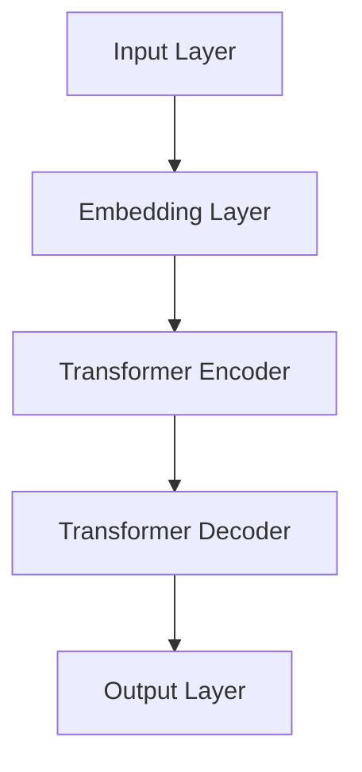

                 

## 《ChatGPT提示词设计：原则、方法与创新》

关键词：ChatGPT、提示词设计、交互体验、性能优化、创新应用

摘要：随着人工智能技术的快速发展，基于GPT的大规模语言模型ChatGPT在自然语言处理领域取得了显著成果。本文旨在探讨ChatGPT提示词设计的原则、方法和创新应用，以提高交互质量和性能优化，为相关研究和实践提供参考。

## 第一部分：ChatGPT提示词设计概述

### 第1章 问题背景与核心概念

#### 1.1 问题背景

人工智能（AI）技术的迅速发展，为自然语言处理（NLP）领域带来了新的机遇。特别是基于GPT（Generative Pre-trained Transformer）的大规模语言模型，已经在诸多任务中展现出了强大的能力。ChatGPT作为OpenAI推出的一款基于GPT-3的语言模型，通过用户输入的提示词（prompts）与用户进行交互，实现智能对话和问答功能。然而，提示词的设计对交互质量和性能具有重要影响，因此研究ChatGPT提示词设计具有重要的实际意义。

#### 1.2 核心概念

- **ChatGPT**：ChatGPT是一种基于GPT-3的语言模型，它可以接受用户的提示词，并生成相应的回复。
- **提示词**：提示词是用户输入给ChatGPT的一段文本，用于引导ChatGPT生成相应的回复。

#### 1.3 提示词设计的意义

高质量的提示词设计对于提升用户与ChatGPT的交互体验和性能优化具有重要意义：

- **交互质量**：通过设计明确的、引导性的提示词，可以更好地引导ChatGPT生成用户期望的回复，提高交互的准确性和满意度。
- **性能优化**：优化提示词设计可以减少ChatGPT的计算复杂度，提高处理速度和效率。

## 第二部分：ChatGPT提示词设计方法

### 第2章 核心概念与联系

#### 2.1 ChatGPT模型架构

ChatGPT的模型架构基于GPT-3，其核心是Transformer模型。下面使用Mermaid流程图展示ChatGPT的模型架构：

#### 2.2 提示词设计原理

提示词设计应遵循以下原则：

- **明确性**：提示词应明确表达用户的意图，避免歧义。
- **引导性**：提示词应引导ChatGPT生成符合用户期望的回复。
- **相关性**：提示词应与上下文相关，有助于ChatGPT理解用户意图。

#### 2.3 提示词设计属性特征对比

下表对比了不同类型的提示词设计属性特征：

| 类型       | 开放性 | 封闭性 | 引导性 |
|------------|--------|--------|--------|
| 明确性提示词 | 低     | 高     | 高     |
| 含糊性提示词 | 高     | 低     | 低     |
| 开放性提示词 | 高     | 中     | 中     |
| 封闭性提示词 | 低     | 高     | 高     |

## 第三部分：ChatGPT提示词设计方法

### 第3章 提示词设计方法

#### 3.1 确定目标用户需求

设计提示词前，首先需要了解目标用户的需求。可以通过以下方法来确定：

- **用户调研**：通过问卷、访谈等方式收集用户反馈。
- **需求分析**：分析用户反馈，提取核心需求。

#### 3.2 设计引导性提示词

引导性提示词的设计策略包括：

- **明确引导**：在提示词中明确指出ChatGPT应该生成的回复类型。
- **模糊引导**：在提示词中给出一些指导性的信息，让ChatGPT自行判断。

#### 3.3 设计开放性提示词

开放性提示词的设计策略包括：

- **提供多种选择**：在提示词中给出多个选项，让ChatGPT选择。
- **鼓励用户参与**：在提示词中鼓励用户参与对话，提高交互性。

### 第4章 提示词设计实战

#### 4.1 实战案例介绍

下面介绍两个实战案例：

- **案例一**：设计一个简单的聊天机器人对话。
- **案例二**：设计一个复杂的问答系统。

#### 4.2 实战技巧与策略

实战中需要注意以下技巧和策略：

- **避免歧义**：确保提示词表达清晰，避免产生歧义。
- **持续优化**：通过用户反馈和数据分析，持续优化提示词设计。

## 第四部分：ChatGPT提示词设计创新

### 第5章 创新设计与实践

#### 5.1 新型提示词设计

新型提示词设计包括：

- **情感提示词**：设计用于表达情感的提示词，提高交互的生动性。
- **上下文提示词**：设计用于提供上下文信息的提示词，帮助ChatGPT更好地理解用户意图。

#### 5.2 创新设计应用

创新设计应用包括：

- **多模态交互**：结合文本、语音、图像等多模态信息进行交互。
- **个性化提示词**：根据用户偏好和习惯设计个性化的提示词。

### 第6章 创新方法与工具

#### 6.1 创新方法

创新方法包括：

- **用户参与设计**：邀请用户参与提示词设计，提高设计的实用性和满意度。
- **迭代优化**：通过多次迭代优化提示词设计，不断提升性能和用户体验。

#### 6.2 设计工具与平台

设计工具与平台包括：

- **自然语言处理工具**：如NLTK、spaCy等。
- **代码库**：如GitHub等，用于存储和管理提示词设计代码。

### 第四部分：总结与展望

#### 第7章 总结与展望

#### 7.1 总结

本文从问题背景、核心概念、设计方法、创新应用等方面探讨了ChatGPT提示词设计，总结了关键点与实践经验。

#### 7.2 展望

未来ChatGPT提示词设计的发展趋势包括：

- **智能化**：利用深度学习和自然语言处理技术，实现更智能的提示词设计。
- **个性化**：根据用户偏好和习惯，实现个性化的提示词设计。

作者：AI天才研究院/AI Genius Institute & 禅与计算机程序设计艺术 /Zen And The Art of Computer Programming

（注：本文为大纲，实际撰写时需要根据要求扩充每个章节的内容，确保字数在10000～12000字左右。）

