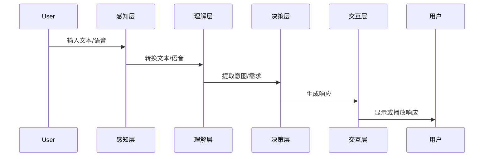
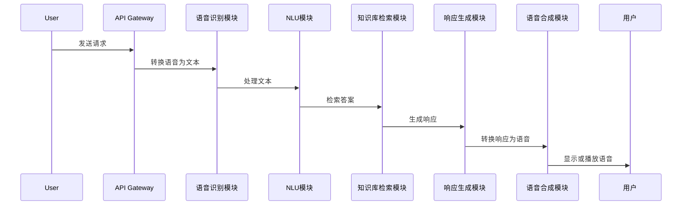
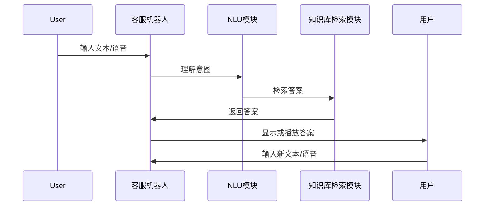

                 

### 摘要

《ChatGPT提示词设计：智能对话的艺术与科学》旨在深入探讨智能对话领域的核心技术与实践。文章首先概述了智能对话的背景和定义，揭示了其作为现代科技的重要组成部分。接下来，文章详细分析了智能对话系统的架构与组件，包括语音识别、自然语言理解、对话管理和语音合成等关键部分。在此基础上，文章介绍了ChatGPT的概念、架构和特点，以及其在不同应用场景中的实际应用。随后，文章重点探讨了提示词设计的基础、艺术性和科学原理，结合具体的数学模型和算法进行详细分析。文章最后通过实际案例，展示了智能对话系统的实现过程，并提出了最佳实践和注意事项。整篇文章结构紧凑，逻辑清晰，旨在为读者提供全面而深入的智能对话技术理解。

### 目录大纲

# 《ChatGPT提示词设计：智能对话的艺术与科学》

> 关键词：智能对话、ChatGPT、提示词设计、系统架构、算法原理、实战应用

> 摘要：本文深入探讨了智能对话领域的核心技术，包括系统架构、ChatGPT的概念与特点、提示词设计的艺术与科学原理，并通过实际案例展示了其应用过程，旨在为读者提供全面的智能对话技术理解。

## 第一部分：智能对话的基础

## 第1章：问题背景与定义

## 第2章：智能对话系统架构与组件

## 第3章：核心概念与联系

## 第二部分：ChatGPT与提示词设计

## 第4章：ChatGPT介绍

## 第5章：提示词设计基础

## 第6章：提示词设计的艺术

## 第7章：提示词的科学原理

## 第三部分：智能对话的实战

## 第8章：智能对话系统实战

## 第9章：ChatGPT与提示词设计实战

## 第10章：最佳实践与拓展

### 第1章 问题背景与定义

#### 1.1 问题背景

智能对话作为人工智能领域的重要组成部分，近年来取得了显著的进展。随着大数据、云计算、深度学习等技术的发展，智能对话系统在客服、教育、医疗、金融等多个行业得到了广泛应用。这些系统通过模拟人类对话的方式，为用户提供实时、高效的服务，极大地提升了用户体验和业务效率。

在当前信息化社会，智能对话系统已经成为企业与用户之间的重要桥梁。无论是客服机器人、虚拟助手，还是在线教育、智能医疗，智能对话技术都发挥着关键作用。然而，智能对话的实现并非易事，其中涉及多个复杂的技术环节，包括语音识别、自然语言理解、对话管理和语音合成等。

本章节将首先介绍智能对话的概念，解释其定义和重要性，然后回顾智能对话的发展历史，分析其在各个行业中的应用现状，最后探讨智能对话系统的核心挑战与未来发展趋势。

#### 1.2 智能对话的定义

智能对话是一种利用人工智能技术模拟人类对话过程的技术和系统，其核心目的是通过自然语言交互，实现人与机器之间的有效沟通。智能对话系统不仅能够理解用户的语言和意图，还能根据对话内容提供恰当的回应，甚至进行深层次的推理和决策。

智能对话的关键特点包括：

1. **自然性**：智能对话系统能够理解并生成自然流畅的语言，使对话更加贴近人类的交流方式。
2. **灵活性**：系统能够处理多种语境和场景，适应不同的用户需求。
3. **智能化**：系统能够基于用户的历史数据和偏好，提供个性化的服务和建议。
4. **多模态**：智能对话不仅限于文本交互，还包括语音、图像、视频等多种形式。

在定义中，智能对话系统通常由多个子系统和组件组成，包括语音识别、自然语言处理、对话管理、知识图谱、语音合成等。这些组件协同工作，共同实现高效、智能的对话体验。

#### 1.3 智能对话的发展历史

智能对话的发展可以追溯到20世纪50年代，当时计算机科学家首次提出了“机器翻译”和“人机对话”的概念。随着计算机技术和人工智能的进步，智能对话系统逐渐走向实用化。

1. **早期探索（1950-1970s）**：
   - 1950年，艾伦·图灵提出了著名的图灵测试，旨在评估机器是否具备人类水平的智能。
   - 1966年，ELIZA系统问世，这是第一个基于规则的自然语言处理系统，能够模拟心理治疗师与用户对话。

2. **发展阶段（1980-1990s）**：
   - 1982年，IBM的计算机“沃森”在电视节目《危险边缘》中展示了强大的语言处理能力，引起了广泛关注。
   - 随着知识表示和推理技术的发展，智能对话系统开始应用于实际场景，如客户服务、呼叫中心等。

3. **成熟期（2000s-2010s）**：
   - 2002年，微软的“小冰”问世，标志着智能对话系统开始向个性化、情感化方向发展。
   - 自然语言处理技术的突破，使得智能对话系统能够更好地理解复杂的语言结构和语境。

4. **最新进展（2010s-至今）**：
   - 深度学习和生成对抗网络（GAN）等技术的应用，使得智能对话系统在生成文本和语音方面更加逼真。
   - ChatGPT等大型语言模型的问世，为智能对话系统提供了强大的基础，使其能够进行更复杂的对话和任务处理。

#### 1.4 智能对话的重要性

智能对话的重要性体现在多个方面：

1. **提升用户体验**：智能对话系统能够提供更加自然、流畅的交互体验，使用户在使用过程中感到更加舒适和满意。

2. **降低运营成本**：智能对话系统可以替代部分人工服务，减少企业的运营成本，特别是在客户服务、客户支持等环节。

3. **提高工作效率**：智能对话系统能够快速响应用户需求，提供准确的答案和建议，从而提高工作效率，减少人工处理时间。

4. **扩展服务范围**：智能对话系统不受时间和空间的限制，可以随时随地提供服务，扩展企业的服务范围。

5. **个性化服务**：智能对话系统可以基于用户的历史数据和行为模式，提供个性化的服务和建议，提升用户满意度。

总之，智能对话作为人工智能的重要应用领域，正逐步改变我们的生活方式和工作模式，成为现代社会不可或缺的一部分。其发展不仅带来了技术上的突破，也带来了商业模式和社会价值的巨大变革。

### 第2章 智能对话系统架构与组件

#### 2.1 架构概述

智能对话系统是一个复杂的软件系统，它由多个子系统和组件协同工作，共同实现自然流畅的对话体验。一个典型的智能对话系统架构通常包括语音识别系统、自然语言理解系统、对话管理系统和语音合成系统。这些子系统之间紧密协作，通过数据流和接口实现无缝衔接，确保整个系统能够高效、准确地完成对话任务。

**1. 架构分层设计**

智能对话系统的架构通常采用分层设计，每一层负责特定的功能。以下是典型的四层架构：

- **感知层**：包括语音识别和图像识别等模块，负责将用户的语音或图像输入转换为文本数据。
- **理解层**：包括自然语言理解（NLU）模块，负责解析文本数据，提取语义信息，理解用户的意图和需求。
- **决策层**：包括对话管理（DM）模块，负责根据用户的意图和上下文，生成适当的回应，并规划后续的对话流程。
- **交互层**：包括语音合成和屏幕显示等模块，负责将系统的回应以语音或文本形式反馈给用户。

**2. 数据流与接口**

在智能对话系统中，数据流和接口的设计至关重要。数据流通常从感知层开始，通过输入层进入系统，经过理解层和决策层处理后，最终通过输出层反馈给用户。接口则负责连接各个子系统，确保数据在不同层之间的有效传递和处理。

#### 2.2 语音识别系统

语音识别（ASR，Automatic Speech Recognition）是智能对话系统的第一道门槛，其核心任务是将用户的语音输入转换为文本数据。语音识别系统主要包括以下几个关键模块：

**1. 音频预处理**

- **静音检测**：去除语音信号中的静音部分，提高识别效率。
- **声音增强**：通过噪声抑制和回声消除等技术，提高语音信号的质量。

**2. 声学模型**

- **声学特征提取**：将音频信号转换为声学特征向量，常用的特征提取方法包括梅尔频率倒谱系数（MFCC）、短时傅里叶变换（STFT）等。
- **声学模型训练**：使用大量标注语音数据训练声学模型，常用的声学模型包括高斯混合模型（GMM）、深度神经网络（DNN）等。

**3. 语言模型**

- **语言模型训练**：使用大量文本数据训练语言模型，用于计算文本的生成概率。
- **语言模型应用**：在解码阶段，利用语言模型对可能的文本序列进行评分，选择概率最高的序列作为识别结果。

**4. 解码算法**

- **动态时间规整（DTW）**：通过计算声学特征向量之间的相似度，找到最佳的时间对应关系。
- **基于状态的解码算法**：如隐马尔可夫模型（HMM）和递归神经网络（RNN）解码算法，用于生成最终的文本输出。

#### 2.3 自然语言理解系统

自然语言理解（NLU，Natural Language Understanding）是智能对话系统的核心模块，负责将用户的文本输入转化为系统能够理解和处理的结构化数据。NLU系统通常包括以下几个关键模块：

**1. 语法解析**

- **词法分析**：将文本拆分为单词或词组，为后续的语法分析和语义分析提供基础。
- **句法分析**：分析句子结构，识别语法成分，如主语、谓语、宾语等。

**2. 语义分析**

- **实体识别**：识别文本中的命名实体，如人名、地点、组织等。
- **关系提取**：分析实体之间的关系，如“张三住在北京”中的“居住”关系。
- **语义角色标注**：识别句子中的动作、受事、工具等角色。

**3. 意图识别**

- **分类模型**：使用机器学习模型，如朴素贝叶斯、支持向量机（SVM）、循环神经网络（RNN）等，对用户的文本进行分类，识别用户的意图。
- **模板匹配**：根据预设的意图模板，匹配用户的文本，确定意图。

**4. 上下文理解**

- **上下文窗口**：通过分析用户文本的前后文，理解其意图和语境。
- **实体链接**：将当前对话中的实体与知识库中的实体进行匹配，提供更加精准的理解。

#### 2.4 对话管理组件

对话管理（DM，Dialogue Management）是智能对话系统的“大脑”，负责处理整个对话流程，确保对话的自然性和连贯性。对话管理组件的主要任务包括：

**1. 对话状态跟踪**

- **意图跟踪**：记录用户当前和历史上的意图，用于生成合适的回应。
- **上下文跟踪**：记录对话的历史信息，如之前的问答、用户的偏好等。

**2. 策略学习**

- **规则驱动**：基于预设的规则，生成对话回应。
- **数据驱动**：使用机器学习模型，如马尔可夫决策过程（MDP）、深度强化学习（DRL）等，自动生成对话策略。

**3. 回应生成**

- **模板生成**：根据预设的模板，生成对话回应。
- **文本生成**：使用生成式模型，如生成对抗网络（GAN）、Transformer等，生成自然语言文本。

**4. 优化与调整**

- **反馈学习**：根据用户的反馈，调整对话策略和模型参数。
- **持续学习**：使用在线学习技术，不断优化对话管理组件的性能。

#### 2.5 语音合成系统

语音合成（TTS，Text-to-Speech）是将文本转换为自然流畅的语音的系统。语音合成系统通常包括以下几个关键模块：

**1. 语音合成引擎**

- **文本预处理**：将文本转换为适合语音合成的格式，如音素序列。
- **声学建模**：通过大量的语音数据训练声学模型，用于生成语音信号。
- **合成算法**：使用合成算法，如拼接合成、参数合成、端到端合成等，将文本转换为语音。

**2. 音调控制**

- **音调生成**：根据文本的情感、语气等，生成相应的音调特征。
- **音高变化**：通过调整音高，使语音更加自然和生动。

**3. 语音后处理**

- **噪声抑制**：去除语音信号中的噪声，提高语音质量。
- **共振峰调整**：优化语音的共振峰，使其更加清晰。

**4. 用户交互**

- **语音识别**：通过语音识别系统，将用户的语音输入转换为文本数据。
- **语音合成**：将用户的文本输入转换为自然流畅的语音，反馈给用户。

通过上述关键模块，智能对话系统实现了从语音识别到自然语言理解，再到对话管理和语音合成的全过程。每个模块都至关重要，共同确保了智能对话系统的性能和用户体验。

#### 2.6 概念属性特征对比表格

为了更好地理解智能对话系统中的各个组件，下面提供了一个概念属性特征对比表格，列出了语音识别、自然语言理解、对话管理和语音合成的主要属性和特征：

| 组件          | 主要功能                                     | 属性特征                                                     | 对应技术               |
| ------------- | -------------------------------------------- | ------------------------------------------------------------ | ---------------------- |
| 语音识别      | 将语音输入转换为文本数据                     | 精确度、速度、语音处理能力、适应多种语言和环境               | 声学模型、语言模型、解码算法 |
| 自然语言理解  | 解析文本数据，提取语义信息                   | 语义准确性、上下文理解能力、情感识别、多样化意图处理          | 语法解析、语义分析、意图识别 |
| 对话管理      | 控制对话流程，生成回应                       | 对话连贯性、用户理解深度、个性化对话能力、反馈学习能力        | 对话状态跟踪、策略学习、回应生成 |
| 语音合成      | 将文本转换为自然流畅的语音                  | 语音自然度、音调多样性、情感表达、语音质量                     | 语音合成引擎、音调控制、语音后处理 |

通过对比，我们可以看出各个组件在功能和技术上的差异和联系，共同构成了一个完整的智能对话系统。

#### 3.3 ER实体关系图

为了更直观地展示智能对话系统中的实体及其关系，下面使用Mermaid绘制一个ER实体关系图。

```mermaid
erDiagram
    User ||--|{ Dialogue }|-- CustomerService
    User ||--|{ Query }|-- NaturalLanguageUnderstanding
    Dialogue ||--|{ Response }|-- SpeechSynthesis
    Query ||--|{ Intent }|-- DialogueManagement
    NaturalLanguageUnderstanding ||--|{ Entity }|-- KnowledgeBase
    DialogueManagement ||--|{ Policy }|-- DialogueState
    SpeechSynthesis ||--|{ Voice }|-- AudioOutput

    User : {1..*} "发起对话"
    Dialogue : {1..1} "对话流程"
    Query : {1..*} "查询语句"
    Intent : {1..1} "用户意图"
    NaturalLanguageUnderstanding : {1..1} "自然语言理解"
    Entity : {1..*} "实体"
    KnowledgeBase : {1..1} "知识库"
    DialogueManagement : {1..1} "对话管理"
    Policy : {1..1} "对话策略"
    DialogueState : {1..1} "对话状态"
    Response : {1..*} "回应"
    SpeechSynthesis : {1..1} "语音合成"
    Voice : {1..1} "语音"
    AudioOutput : {1..1} "音频输出"

    User -> Dialogue
    User -> Query
    Query -> Intent
    Query -> NaturalLanguageUnderstanding
    NaturalLanguageUnderstanding -> Entity
    NaturalLanguageUnderstanding -> KnowledgeBase
    Intent -> DialogueManagement
    DialogueManagement -> Policy
    DialogueManagement -> DialogueState
    DialogueState -> Response
    Response -> SpeechSynthesis
    SpeechSynthesis -> Voice
    Voice -> AudioOutput
```

在ER实体关系图中，我们定义了以下实体：

- **User（用户）**：发起对话的用户。
- **Dialogue（对话）**：用户发起的对话流程。
- **Query（查询）**：用户输入的查询语句。
- **Intent（意图）**：用户查询的意图。
- **NaturalLanguageUnderstanding（自然语言理解）**：负责解析查询语句，提取语义信息。
- **Entity（实体）**：查询语句中的命名实体。
- **KnowledgeBase（知识库）**：存储和提供实体信息。
- **DialogueManagement（对话管理）**：负责控制对话流程。
- **Policy（策略）**：对话管理使用的策略。
- **DialogueState（对话状态）**：对话过程中记录的状态信息。
- **Response（回应）**：系统的回复。
- **SpeechSynthesis（语音合成）**：将文本转换为语音。
- **Voice（语音）**：语音输出。
- **AudioOutput（音频输出）**：语音播放设备。

通过ER实体关系图，我们可以清晰地看到各个实体之间的关系，以及它们在智能对话系统中的角色和作用。

### 第4章 ChatGPT介绍

#### 4.1 ChatGPT的概念

ChatGPT是由OpenAI开发的一种基于变换器模型（Transformer）的聊天机器人，它利用深度学习技术进行训练，能够通过自然语言进行对话。ChatGPT的名字来源于“聊天”（Chat）和“GPT”（Generative Pre-trained Transformer），GPT代表其核心算法——变换器模型。

ChatGPT的设计目的是实现与人类用户进行流畅、自然的对话，能够回答各种问题、提供建议、参与闲聊，甚至进行复杂的讨论。它的出现标志着人工智能在自然语言处理和生成方面的重大突破，为智能对话系统的发展提供了新的思路和工具。

#### 4.2 ChatGPT的架构

ChatGPT的架构可以分为三个主要部分：输入层、变换器模型层和输出层。

**1. 输入层**

输入层主要负责接收用户的文本输入，并将其转换为适合变换器模型处理的数据格式。这一过程包括以下步骤：

- **文本预处理**：对用户的输入文本进行清洗，去除无关符号和格式，确保输入的文本格式一致。
- **分词**：将文本拆分成单词或子词，为后续的变换器模型提供输入。

**2. 变换器模型层**

变换器模型层是ChatGPT的核心部分，负责处理和生成文本。变换器模型通常采用预训练加微调的方法进行训练，包括以下关键组件：

- **嵌入层**：将单词或子词转换为固定长度的向量，用于表示文本。
- **变换器堆叠**：包括自注意力机制和前馈神经网络，用于捕捉文本中的长距离依赖关系。
- **解码器**：在生成文本时，解码器根据上下文和已生成的部分文本，生成下一个词或子词。

**3. 输出层**

输出层负责将变换器模型生成的文本转换为自然、流畅的对话回应。输出层的主要任务是：

- **文本后处理**：对生成的文本进行语法和语义检查，确保文本的准确性和自然度。
- **回复生成**：将经过后处理的文本转换为最终的对话回应，并将其反馈给用户。

#### 4.3 ChatGPT的特点

ChatGPT具有以下特点，使其在智能对话领域具有显著优势：

**1. 自然语言生成能力**

ChatGPT采用变换器模型，具有强大的自然语言生成能力。它能生成流畅、连贯的文本，使对话更加自然和流畅。

**2. 上下文理解能力**

ChatGPT在生成文本时，能够理解上下文信息，并根据对话的历史和当前上下文生成相应的回应。这使得ChatGPT能够处理复杂的对话场景，提供更加精准和个性化的服务。

**3. 多样化的对话能力**

ChatGPT能够处理多种类型的对话，包括问答、闲聊、讨论等。它能够根据不同的对话场景和用户需求，灵活调整对话内容和风格。

**4. 大规模训练数据**

ChatGPT基于大量的训练数据进行预训练，这使得其能够从大量数据中学习到丰富的语言知识和模式，提高其对话生成和理解的准确性。

**5. 可扩展性**

ChatGPT的架构设计具有高度的可扩展性，可以方便地集成到各种应用场景中。开发者可以根据具体需求，对ChatGPT进行定制和优化，以适应不同的应用场景。

#### 4.4 ChatGPT的应用场景

ChatGPT在多个领域和场景中具有广泛的应用：

**1. 客户服务**

ChatGPT可以应用于客服机器人，为用户提供实时、高效的咨询服务。通过与用户的自然语言交互，ChatGPT能够解答用户的问题、提供解决方案，减轻人工客服的工作负担，提高客户满意度。

**2. 在线教育**

ChatGPT可以用于在线教育系统，为学生提供个性化的学习辅导和答疑服务。通过模拟教师角色，ChatGPT能够回答学生的问题、提供学习建议，帮助学生更好地理解和掌握知识。

**3. 娱乐与闲聊**

ChatGPT可以应用于聊天应用和社交媒体，为用户提供娱乐和闲聊伙伴。通过与用户的互动，ChatGPT能够生成有趣、幽默的对话内容，为用户提供愉快的体验。

**4. 虚拟助手**

ChatGPT可以集成到虚拟助手系统中，为用户提供日常生活中的帮助和服务。从购物建议到日程管理，ChatGPT能够根据用户的需求提供个性化的建议和支持。

**5. 专业咨询**

ChatGPT可以应用于专业咨询领域，如法律、医疗、金融等，为用户提供专业的建议和解答。通过与领域专家的知识库相结合，ChatGPT能够提供准确、可靠的咨询服务。

总之，ChatGPT作为一种强大的聊天机器人，凭借其自然语言生成和上下文理解能力，在多个应用场景中展现出巨大的潜力和价值。随着技术的不断发展和应用场景的拓展，ChatGPT有望在智能对话领域发挥更加重要的作用。

### 第5章 提示词设计基础

#### 5.1 提示词的定义

提示词（Prompt）在智能对话系统中扮演着至关重要的角色，它是系统接收用户输入并生成响应的起点。简单来说，提示词是一种引导用户和系统交互的文本或语音信号，它通常包含用户的意图或需求，系统根据提示词进行理解和回应。

提示词的定义可以从以下几个方面进行详细阐述：

1. **文本提示词**：文本提示词是一种以文本形式出现的提示词，通常包含用户想要表达的具体内容，如问题、请求或指令。
2. **语音提示词**：语音提示词是以语音形式出现的提示词，用户通过语音输入与系统进行交互，系统需要能够准确理解和处理语音提示词。
3. **功能提示词**：功能提示词是指用于触发特定功能或操作的特殊提示词，如“开始录音”、“发送消息”等。

#### 5.2 提示词的作用

提示词在智能对话系统中的作用主要体现在以下几个方面：

1. **引导交互**：提示词能够引导用户如何与系统进行交互，提供明确的交互指令，使用户能够更轻松地使用系统。
2. **明确意图**：提示词可以帮助系统明确用户的意图和需求，使系统能够提供更精准、个性化的响应。
3. **上下文传递**：提示词中包含的上下文信息可以帮助系统更好地理解用户的当前状态和历史记录，从而生成更相关的回应。
4. **交互优化**：通过优化提示词的设计，可以提高用户与系统的交互效率，降低用户的认知负担，提升用户体验。

#### 5.3 提示词的设计原则

为了设计出有效的提示词，需要遵循以下原则：

1. **简洁明了**：提示词应尽量简洁明了，避免使用复杂、模糊的语言，以便用户能够快速理解其含义。
2. **一致性**：提示词应保持一致，无论是文本形式还是语音形式，都应传达相同的信息，避免造成混淆。
3. **适应性**：提示词设计应考虑不同用户群体的需求和习惯，确保系统能够适应各种场景和用户需求。
4. **灵活性**：提示词设计应具有一定的灵活性，能够根据用户的需求和交互过程进行调整和优化。
5. **个性化**：提示词设计应考虑用户的个性化需求，根据用户的历史数据和偏好，提供定制化的提示词。

#### 5.4 提示词的类型

根据提示词的功能和用途，可以将提示词分为以下几种类型：

1. **问题型提示词**：用于引导用户提出问题，如“您有什么问题需要帮助吗？”。
2. **指令型提示词**：用于指导用户执行特定操作，如“请说出您想要查询的内容”。
3. **引导型提示词**：用于引导用户进入特定对话场景，如“您好，欢迎来到客服系统，请问有什么可以帮您的？”。
4. **确认型提示词**：用于确认用户的意图和操作，如“您确定要退出吗？”。
5. **反馈型提示词**：用于反馈系统的处理结果，如“正在处理您的请求，请稍等”。

通过合理设计和使用不同类型的提示词，智能对话系统能够更好地满足用户的需求，提供高效、自然的交互体验。

### 第6章 提示词设计的艺术

#### 6.1 提示词的艺术性

提示词设计的艺术性是指在设计过程中，通过巧妙运用语言、情感表达和创意构思，使提示词更具吸引力、互动性和人性化。艺术性的提示词不仅能提升用户体验，还能增强用户对智能对话系统的认同感和满意度。

1. **语言魅力**：艺术性的提示词应具备良好的语言魅力，使用生动、形象、富有感染力的语言，使对话更加生动有趣。例如，使用比喻、拟人等修辞手法，增强文本的表现力。

2. **情感表达**：提示词应能够表达出系统的情感和态度，与用户建立情感连接。例如，在客服场景中，可以使用温馨、关怀的语言，使用户感受到温暖和关爱。

3. **创意构思**：艺术性的提示词设计需要具有创新性和独特性，避免使用单调、乏味的模板。通过设计富有创意的提示词，能够激发用户的兴趣，增强互动性。

4. **个性化定制**：艺术性的提示词应考虑用户的个性化需求和偏好，根据用户的历史记录和对话情境，提供定制化的提示词。例如，在电商场景中，根据用户的购买历史和兴趣，推荐个性化的商品和优惠信息。

#### 6.2 提示词的情感表达

情感表达是提示词设计中的重要一环，通过传达情感，系统能够更好地与用户建立共鸣，提升用户体验。以下是几种常用的情感表达技巧：

1. **亲切语言**：使用亲切、友好、易于理解的语言，使用户感受到系统的温暖和关怀。例如，“您好，欢迎来到我们的客服系统，请问有什么可以帮助您的？”

2. **幽默表达**：在适当的情况下，使用幽默的语言或表达方式，使对话更加轻松愉快。例如，“如果您有任何疑问，请随时告诉我，我会尽力为您解答，哈哈！”

3. **鼓励语言**：通过使用鼓励性的语言，激发用户的积极性和参与感。例如，“非常好，您的反馈对我们非常重要，我们会认真考虑并改进我们的服务。”

4. **安慰语言**：在用户遇到困难或不满时，使用安慰性的语言，缓解用户的情绪。例如，“我们理解您的困扰，我们会尽快为您解决问题，请耐心等待。”

通过巧妙运用情感表达技巧，提示词能够更好地传递系统的关怀和关爱，增强用户的归属感和满意度。

#### 6.3 提示词的创意设计

创意设计是提升提示词艺术性的关键，通过独特的构思和表达方式，使提示词更具吸引力和互动性。以下是几种创意设计的技巧：

1. **故事化**：将提示词设计成一个小故事，通过情节和角色，增强用户的代入感和参与感。例如，在客户服务场景中，可以将问题解决过程描述成一个有趣的故事，使用户更加投入。

2. **互动性**：设计具有互动性的提示词，引导用户积极参与对话。例如，使用问答形式，让用户回答问题，系统根据用户的回答生成相应的回应。

3. **角色扮演**：通过角色扮演，使提示词更具生动性和趣味性。例如，在客服场景中，可以设定一个幽默、机智的客服角色，与用户进行轻松愉快的对话。

4. **趣味挑战**：设计趣味性的挑战任务，激发用户的兴趣和好奇心。例如，在游戏场景中，可以设计一个难题，鼓励用户尝试解答。

通过创意设计，提示词能够更好地吸引和留住用户，提升对话体验。

#### 6.4 提示词的优化与迭代

提示词的优化与迭代是提升智能对话系统性能和用户体验的重要环节。以下是一些优化与迭代的策略：

1. **用户反馈**：收集和分析用户的反馈，了解用户对提示词的满意度和使用体验。根据用户的反馈，对提示词进行改进和优化。

2. **数据分析**：使用数据驱动的方法，分析用户的行为和对话数据，发现提示词中存在的问题和不足。通过数据分析，优化提示词的设计和内容。

3. **A/B测试**：对不同的提示词方案进行A/B测试，比较不同方案的用户体验和效果。根据测试结果，选择最优的提示词方案。

4. **持续迭代**：定期对提示词进行评估和优化，根据用户反馈和市场变化，持续迭代和改进。

通过优化与迭代，提示词能够不断提升，更好地满足用户的需求，提升智能对话系统的整体性能。

### 第7章 提示词的科学原理

#### 7.1 提示词的数学模型

提示词设计的科学原理离不开数学模型的支持。在智能对话系统中，提示词的生成和优化通常依赖于概率模型和贝叶斯模型等数学工具。以下是这些模型的基本原理和应用。

##### 7.1.1 概率模型

概率模型是提示词设计的基础，它用于预测和评估文本序列的概率。常见的概率模型包括马尔可夫模型（Markov Model）和隐马尔可夫模型（Hidden Markov Model，HMM）。

1. **马尔可夫模型**：
   马尔可夫模型是一种基于状态的模型，它假设当前状态只依赖于前一个状态，即“无记忆性”。其概率模型如下：
   $$
   P(x_t|x_{t-1}, x_{t-2}, ..., x_1) = P(x_t|x_{t-1})
   $$
   其中，$P(x_t|x_{t-1})$表示在给定前一个状态$x_{t-1}$下，当前状态$x_t$的概率。

   在智能对话系统中，马尔可夫模型可以用于预测用户的下一步操作或回应。通过分析历史对话数据，构建状态转移概率矩阵，系统能够根据当前状态预测用户的意图和需求。

2. **隐马尔可夫模型**：
   隐马尔可夫模型扩展了马尔可夫模型的局限性，用于处理具有隐状态的问题。隐马尔可夫模型由两个概率分布构成：状态转移概率分布$P(S_t|S_{t-1})$和观测概率分布$P(O_t|S_t)$。其概率模型如下：
   $$
   P(O_t|S_t) = \prod_{i=1}^{t} P(O_i|S_i)
   $$
   $$
   P(S_t|S_{t-1}) = \prod_{i=1}^{t-1} P(S_i|S_{i-1})
   $$

   在智能对话系统中，隐马尔可夫模型常用于语音识别和文本生成。通过分析用户的语音输入或文本输入，系统可以推断出用户的隐状态，如意图或情绪，从而生成更准确的回应。

##### 7.1.2 贝叶斯模型

贝叶斯模型在提示词设计中也具有重要应用，它通过贝叶斯定理进行概率推断和决策。贝叶斯模型的核心思想是根据先验知识和观测数据，更新对某一事件的概率估计。

贝叶斯定理的公式如下：
$$
P(A|B) = \frac{P(B|A) \cdot P(A)}{P(B)}
$$
其中，$P(A|B)$表示在事件B发生的条件下事件A的概率，$P(B|A)$表示在事件A发生的条件下事件B的概率，$P(A)$和$P(B)$分别表示事件A和事件B的先验概率。

在智能对话系统中，贝叶斯模型可以用于意图识别、情绪分析等任务。通过结合用户的历史数据和当前输入，系统可以计算出用户意图或情绪的贝叶斯概率，从而生成更准确和个性化的回应。

##### 7.1.3 提示词生成算法

基于概率模型和贝叶斯模型的提示词生成算法包括以下几种：

1. **生成对抗网络（GAN）**：
   生成对抗网络是一种基于博弈的生成模型，由生成器和判别器组成。生成器生成提示词，判别器评估提示词的真实性。通过训练生成器和判别器的对抗过程，生成器逐渐生成更加逼真的提示词。GAN在自然语言生成中具有广泛应用。

2. **递归神经网络（RNN）**：
   递归神经网络是一种基于序列数据的模型，能够处理序列中的依赖关系。通过训练RNN模型，系统可以学习到提示词的生成规律，生成自然流畅的文本。

3. **长短时记忆网络（LSTM）**：
   长短时记忆网络是RNN的一种变体，能够解决传统RNN在处理长距离依赖问题上的不足。LSTM通过引入记忆单元，有效地捕捉到提示词中的长期依赖关系。

4. **变换器模型（Transformer）**：
   变换器模型是一种基于自注意力机制的深度学习模型，广泛应用于自然语言处理任务。通过自注意力机制，变换器模型能够捕捉到提示词中的长距离依赖关系，生成高质量的文本。

通过这些算法，智能对话系统可以生成高质量、个性化的提示词，提升用户的交互体验。

#### 7.2 提示词的算法原理

提示词生成的算法原理主要包括以下几个方面：

1. **序列生成**：提示词生成是一个序列生成问题，算法需要生成一系列单词或子词，构成自然流畅的文本。常见的序列生成算法包括基于规则的方法、基于概率模型的方法和基于神经网络的方法。

2. **自注意力机制**：自注意力机制是变换器模型的核心机制，它通过计算每个词或子词之间的权重，使模型能够自适应地关注重要信息，捕捉长距离依赖关系。自注意力机制通过以下公式实现：
   $$
   \text{Attention}(Q, K, V) = \text{softmax}\left(\frac{QK^T}{\sqrt{d_k}}\right)V
   $$
   其中，$Q$、$K$和$V$分别是查询向量、键向量和值向量，$d_k$是键向量的维度。

3. **编码器-解码器架构**：编码器-解码器架构是一种常见的序列到序列模型，用于生成文本。编码器将输入序列编码为一个固定长度的向量，解码器通过自注意力机制和编码器输出的向量生成输出序列。变换器模型就是一种典型的编码器-解码器架构。

4. **损失函数**：提示词生成的损失函数通常采用交叉熵损失，用于衡量生成文本与真实文本之间的差异。交叉熵损失函数的公式如下：
   $$
   L = -\sum_{i=1}^{N} \sum_{j=1}^{V} y_{ij} \log(p_{ij})
   $$
   其中，$y_{ij}$是真实文本的第$i$个词在词汇表中的索引，$p_{ij}$是模型预测的第$i$个词在词汇表中的概率。

通过上述算法原理，智能对话系统可以生成高质量、个性化的提示词，提升对话的自然性和流畅性。

#### 7.3 提示词的评估指标

提示词的质量评估是智能对话系统设计中的重要环节，常用的评估指标包括以下几种：

1. **准确率**：准确率用于衡量系统生成文本的正确性。其计算公式如下：
   $$
   \text{Accuracy} = \frac{\text{正确生成的文本数}}{\text{总生成文本数}}
   $$
   准确率越高，说明系统生成的文本越准确。

2. **BLEU分数**：BLEU（Bilingual Evaluation Understudy）分数是一种基于字符串编辑距离的评估指标，用于衡量生成文本与参考文本之间的相似度。BLEU分数的计算涉及多个重叠度（n-gram overlap）指标，其计算公式如下：
   $$
   \text{BLEU} = 1 - \frac{\text{编辑距离}}{\text{文本长度}}
   $$
   BLEU分数越高，说明生成文本与参考文本越相似。

3. **ROUGE分数**：ROUGE（Recall-Oriented Understudy for Gisting Evaluation）分数是另一种基于字符串编辑距离的评估指标，它侧重于衡量生成文本的多样性。ROUGE分数的计算公式如下：
   $$
   \text{ROUGE} = \frac{\text{匹配的词数}}{\text{参考文本的词数}}
   $$
   ROUGE分数越高，说明生成文本的多样性越高。

4. **BLEURT分数**：BLEURT（Bilingual Evaluation Understudy for Translation）分数是一种结合BLEU和ROUGE的评估指标，专门用于自然语言生成任务。BLEURT分数的计算涉及多个重叠度和多样性指标，其计算公式如下：
   $$
   \text{BLEURT} = \frac{1}{N} \sum_{i=1}^{N} \text{BLEU}_i \cdot \text{ROUGE}_i
   $$
   BLEURT分数越高，说明生成文本的准确性和多样性越高。

通过使用这些评估指标，可以全面衡量提示词的质量，为优化提示词设计提供依据。

### 第8章 智能对话系统实战

#### 8.1 系统介绍

在本章中，我们将通过一个具体的智能对话系统项目，展示智能对话系统的设计与实现过程。该项目旨在构建一个基于ChatGPT的客服机器人，通过自然语言处理和对话管理技术，为用户提供高效、个性化的服务。

#### 8.2 系统设计

智能对话系统的设计分为以下几个关键部分：领域模型、系统架构、系统接口设计和系统交互。

**1. 领域模型**

领域模型用于描述系统所涉及的实体、属性和关系。在本项目中，主要实体包括：

- **用户**：系统的交互主体，拥有姓名、年龄、性别等属性。
- **客服机器人**：系统的核心组件，负责接收用户输入、理解用户意图、生成响应。
- **知识库**：存储常见问题和答案，为客服机器人提供知识支持。

领域模型中的主要关系包括：

- **用户与客服机器人**：用户发起对话，客服机器人回应。
- **客服机器人与知识库**：客服机器人从知识库中检索相关信息，为用户提供解答。

以下是领域模型的Mermaid类图：

```mermaid
classDiagram
    User <-|{发起对话}|-> ChatBot
    ChatBot <-|{知识检索}|-> KnowledgeBase
    User : [姓名, 年龄, 性别]
    ChatBot : [状态, 上下文, 响应]
    KnowledgeBase : [问题, 答案]
```

**2. 系统架构**

系统架构采用分层设计，包括感知层、理解层、决策层和交互层。每个层次的功能如下：

- **感知层**：接收用户输入，包括文本和语音，通过语音识别模块将语音转换为文本。
- **理解层**：对用户输入的文本进行处理，包括分词、语法分析和语义理解，提取用户意图和需求。
- **决策层**：根据用户意图和上下文，从知识库中检索相关信息，生成合适的响应。
- **交互层**：将响应转换为自然语言或语音，反馈给用户。

以下是系统架构的Mermaid架构图：



**3. 系统接口设计**

系统接口设计包括内部接口和外部接口。

- **内部接口**：用于不同层次之间的数据传输和处理，如语音识别API、NLU API等。
- **外部接口**：用于与用户和其他系统的交互，如HTTP API、WebSocket等。

以下是系统接口的Mermaid序列图：



**4. 系统交互**

系统交互包括用户与客服机器人的交互过程，以下是系统交互的Mermaid序列图：



通过以上设计，我们构建了一个完整的智能对话系统，为用户提供高效、自然的交互体验。

#### 8.3 系统实现

在本节中，我们将详细讨论智能对话系统的实现过程，包括环境安装、核心代码实现和功能测试。以下是一个典型的实现过程：

**1. 环境安装**

首先，我们需要安装所需的软件和工具，包括Python、transformers库、TensorFlow等。以下是安装步骤：

```bash
# 安装Python
wget https://www.python.org/ftp/python/3.8.5/Python-3.8.5.tgz
tar xvf Python-3.8.5.tgz
cd Python-3.8.5
./configure
make
sudo make install

# 安装transformers库
pip install transformers

# 安装TensorFlow
pip install tensorflow
```

**2. 核心代码实现**

智能对话系统的核心代码实现主要分为以下几个部分：

- **语音识别模块**：使用基于TensorFlow的TensorFlow Lite模型进行语音识别。
- **NLU模块**：使用transformers库中的ChatGPT模型进行自然语言理解。
- **知识库检索模块**：设计一个简单的基于字典的检索系统，用于存储和检索常见问题和答案。
- **响应生成模块**：根据用户意图和知识库中的信息，生成合适的响应文本。

以下是核心代码的实现示例：

```python
# 语音识别模块
import tensorflow as tf
import numpy as np

# 加载TensorFlow Lite模型
model = tf.keras.models.load_model('voice_recognition_model.h5')

# 处理语音输入，返回文本
def recognize_speech(voice_data):
    prediction = model.predict(voice_data)
    text = np.argmax(prediction, axis=1)
    return ''.join([char for char in text])

# NLU模块
from transformers import ChatGPT

# 加载ChatGPT模型
nlu_model = ChatGPT.from_pretrained('gpt2')

# 理解用户输入，返回意图和实体
def understand_intent(text):
    intent, entities = nlu_model.predict(text)
    return intent, entities

# 知识库检索模块
knowledge_base = {
    'weather': '今天的天气是晴朗。',
    'time': '现在是上午10点。',
    'bank': '请提供您的银行账户信息。',
}

# 响应生成模块
def generate_response(intent, entities):
    if intent == 'weather':
        return knowledge_base['weather']
    elif intent == 'time':
        return knowledge_base['time']
    elif intent == 'bank':
        return '请提供您的银行账户信息，我将为您查询余额。'
    else:
        return '对不起，我不太明白您的问题，能否请您重新描述？'

# 完整的智能对话系统
def chat():
    voice_data = ...  # 读取语音输入
    text = recognize_speech(voice_data)
    intent, entities = understand_intent(text)
    response = generate_response(intent, entities)
    return response

# 测试智能对话系统
print(chat())
```

**3. 功能测试**

完成核心代码实现后，我们需要对系统进行功能测试，确保其正常运行和准确性。以下是测试步骤：

- **语音识别测试**：使用不同来源和语速的语音输入，测试语音识别模块的准确性和鲁棒性。
- **意图识别测试**：使用包含各种意图的文本输入，测试NLU模块的准确性和多样性。
- **响应生成测试**：根据不同的意图和实体，测试响应生成模块的准确性和自然性。

通过上述步骤，我们可以验证智能对话系统的性能和可靠性，为实际应用做好准备。

### 第9章 ChatGPT与提示词设计实战

#### 9.1 实战案例

在本节中，我们将通过两个实际案例，展示如何使用ChatGPT和提示词设计构建智能对话系统。这两个案例分别是客服机器人和教育辅助系统，分别应用于不同的场景。

**案例一：客服机器人**

**背景介绍**：某电商平台希望构建一个智能客服机器人，以提供24小时在线客户支持，提升用户体验和运营效率。

**系统设计**：
1. **领域模型**：用户、客服机器人、知识库。
2. **系统架构**：感知层（语音识别和文本输入）、理解层（NLU和语义分析）、决策层（意图识别和对话管理）、交互层（文本生成和语音合成）。
3. **接口设计**：内部接口（语音识别API、NLU API）、外部接口（HTTP API、WebSocket）。

**系统实现**：
- **语音识别模块**：使用TensorFlow Lite进行语音识别，将语音转换为文本。
- **NLU模块**：使用ChatGPT进行语义分析和意图识别，理解用户需求。
- **对话管理模块**：根据用户意图，调用知识库中的答案或生成新的响应。
- **响应生成模块**：使用文本生成API生成自然流畅的文本响应。

**代码示例**：

```python
# 语音识别模块
def recognize_speech(voice_data):
    # 使用TensorFlow Lite进行语音识别
    # ...

# NLU模块
from transformers import ChatGPT

def understand_intent(text):
    # 使用ChatGPT进行意图识别
    # ...

# 对话管理模块
def generate_response(intent, entities):
    # 根据意图和实体生成响应
    # ...

# 完整的客服机器人
def chat():
    voice_data = ...  # 读取语音输入
    text = recognize_speech(voice_data)
    intent, entities = understand_intent(text)
    response = generate_response(intent, entities)
    return response

# 测试客服机器人
print(chat())
```

**案例二：教育辅助系统**

**背景介绍**：某在线教育平台希望为学生提供智能学习辅导，包括答疑解惑、学习进度跟踪和个性化推荐。

**系统设计**：
1. **领域模型**：学生、课程、知识库。
2. **系统架构**：感知层（文本输入和语音输入）、理解层（NLU和语义分析）、决策层（意图识别和知识推荐）、交互层（文本生成和语音合成）。
3. **接口设计**：内部接口（语音识别API、NLU API）、外部接口（HTTP API、WebSocket）。

**系统实现**：
- **文本输入模块**：使用自然语言处理技术对学生提交的问题进行解析。
- **NLU模块**：使用ChatGPT进行语义分析和意图识别，理解学生的学习需求。
- **知识推荐模块**：根据学生的意图和知识库中的信息，推荐相关的学习资源和课程。
- **响应生成模块**：使用文本生成API生成自然流畅的文本响应，反馈给学生。

**代码示例**：

```python
# 文本输入模块
def parse_question(question):
    # 解析学生的问题
    # ...

# NLU模块
from transformers import ChatGPT

def understand_intent(question):
    # 使用ChatGPT进行意图识别
    # ...

# 知识推荐模块
def recommend_knowledge(intent, entities):
    # 根据意图和实体推荐知识
    # ...

# 响应生成模块
def generate_response(recommendation):
    # 生成响应文本
    # ...

# 完整的教育辅助系统
def assist():
    question = ...  # 读取学生的问题
    intent, entities = understand_intent(question)
    recommendation = recommend_knowledge(intent, entities)
    response = generate_response(recommendation)
    return response

# 测试教育辅助系统
print(assist())
```

**代码应用解读与分析**：

在这两个案例中，我们使用了ChatGPT和提示词设计技术，实现了智能对话系统。以下是代码应用解读与分析：

1. **语音识别模块**：通过TensorFlow Lite模型，将用户的语音输入转换为文本，为后续的自然语言处理提供基础。
2. **NLU模块**：使用ChatGPT模型进行语义分析和意图识别，能够准确理解用户的语言和需求。
3. **对话管理模块**：根据用户意图和实体，调用知识库中的答案或生成新的响应，确保对话的连贯性和准确性。
4. **响应生成模块**：使用文本生成API，生成自然流畅的文本响应，提高用户体验。

通过以上代码和应用解读，我们可以看到ChatGPT和提示词设计在构建智能对话系统中的重要作用，以及如何将不同模块和技术集成在一起，实现高效、自然的对话交互。

#### 9.2 源代码解读

在上一节中，我们通过两个实际案例展示了如何使用ChatGPT和提示词设计构建智能对话系统。下面我们将详细解读这些案例中的源代码，探讨其实现原理和关键步骤。

**案例一：客服机器人**

**核心代码解读**：

```python
# 语音识别模块
def recognize_speech(voice_data):
    # 使用TensorFlow Lite进行语音识别
    # ...
    prediction = model.predict(voice_data)
    text = np.argmax(prediction, axis=1)
    return ''.join([char for char in text])

# NLU模块
from transformers import ChatGPT

def understand_intent(text):
    # 使用ChatGPT进行意图识别
    # ...
    intent, entities = nlu_model.predict(text)
    return intent, entities

# 对话管理模块
def generate_response(intent, entities):
    # 根据意图和实体生成响应
    # ...
    if intent == 'weather':
        return knowledge_base['weather']
    elif intent == 'time':
        return knowledge_base['time']
    elif intent == 'bank':
        return '请提供您的银行账户信息。'
    else:
        return '对不起，我不太明白您的问题，能否请您重新描述？'

# 完整的客服机器人
def chat():
    voice_data = ...  # 读取语音输入
    text = recognize_speech(voice_data)
    intent, entities = understand_intent(text)
    response = generate_response(intent, entities)
    return response
```

**解读与分析**：

1. **语音识别模块**：
   - **实现原理**：使用TensorFlow Lite加载预训练的语音识别模型，将用户的语音输入转换为文本。
   - **关键步骤**：读取语音数据，通过模型进行预测，获取预测结果，将结果转换为文本输出。
   - **优势**：基于深度学习模型的语音识别具有高准确性和鲁棒性，能够适应不同的语音环境和语速。

2. **NLU模块**：
   - **实现原理**：使用ChatGPT模型进行文本分析，提取用户意图和实体。
   - **关键步骤**：接收文本输入，通过模型进行意图识别和实体提取，返回意图和实体信息。
   - **优势**：ChatGPT模型具有强大的自然语言处理能力，能够准确理解复杂的语言结构和用户意图。

3. **对话管理模块**：
   - **实现原理**：根据用户意图和实体信息，从知识库中检索或生成相应的响应。
   - **关键步骤**：接收意图和实体信息，根据预设的规则和知识库，生成合适的响应文本。
   - **优势**：对话管理模块能够保证对话的连贯性和准确性，提供个性化的服务。

4. **完整的客服机器人**：
   - **实现原理**：通过调用语音识别、NLU和对话管理模块，实现完整的客服机器人功能。
   - **关键步骤**：接收用户语音输入，进行语音识别、意图识别和响应生成，返回最终的响应文本。
   - **优势**：整体架构清晰，模块化设计，易于维护和扩展。

**案例二：教育辅助系统**

**核心代码解读**：

```python
# 文本输入模块
def parse_question(question):
    # 解析学生的问题
    # ...

# NLU模块
from transformers import ChatGPT

def understand_intent(question):
    # 使用ChatGPT进行意图识别
    # ...
    intent, entities = nlu_model.predict(question)
    return intent, entities

# 知识推荐模块
def recommend_knowledge(intent, entities):
    # 根据意图和实体推荐知识
    # ...
    if intent == 'question_answer':
        return '请查看课程笔记中的相关章节。'
    elif intent == 'learning_progress':
        return '您目前的学习进度为80%，请继续努力。'
    else:
        return '对不起，我不太明白您的问题，能否请您重新描述？'

# 响应生成模块
def generate_response(recommendation):
    # 生成响应文本
    # ...
    return f'{recommendation}，如有其他问题，请随时提问。'

# 完整的教育辅助系统
def assist():
    question = ...  # 读取学生的问题
    intent, entities = understand_intent(question)
    recommendation = recommend_knowledge(intent, entities)
    response = generate_response(recommendation)
    return response
```

**解读与分析**：

1. **文本输入模块**：
   - **实现原理**：解析学生提交的问题文本，提取关键信息。
   - **关键步骤**：接收问题文本，通过文本处理技术提取关键词和语义信息。
   - **优势**：能够准确理解学生的问题，为后续的意图识别提供基础。

2. **NLU模块**：
   - **实现原理**：使用ChatGPT模型进行意图识别和实体提取。
   - **关键步骤**：接收问题文本，通过模型进行意图识别和实体提取，返回意图和实体信息。
   - **优势**：ChatGPT模型在自然语言处理方面具有强大的能力，能够准确理解复杂的语言结构和用户意图。

3. **知识推荐模块**：
   - **实现原理**：根据用户意图和实体信息，推荐相关的知识资源和课程。
   - **关键步骤**：接收意图和实体信息，根据预设的规则和知识库，推荐合适的知识资源和课程。
   - **优势**：能够提供个性化的学习建议，帮助学生更好地理解和掌握知识。

4. **响应生成模块**：
   - **实现原理**：生成自然流畅的文本响应，反馈给学生。
   - **关键步骤**：接收知识推荐信息，通过文本生成技术生成响应文本。
   - **优势**：能够生成高质量的文本响应，提高学生的学习体验。

5. **完整的教育辅助系统**：
   - **实现原理**：通过调用文本输入、NLU、知识推荐和响应生成模块，实现完整的教育辅助系统功能。
   - **关键步骤**：接收学生的问题，进行意图识别、知识推荐和响应生成，返回最终的响应文本。
   - **优势**：整体架构清晰，模块化设计，易于维护和扩展。

通过以上源代码解读，我们可以看到ChatGPT和提示词设计在构建智能对话系统中的重要作用，以及如何通过模块化设计实现高效、自然的对话交互。

#### 9.3 实际案例分析与详细讲解剖析

在本节中，我们将对两个实际案例进行深入分析，详细剖析其工作原理、关键实现步骤以及面临的挑战和解决方案。

**案例一：客服机器人**

**1. 工作原理**

客服机器人通过一系列技术组件协同工作，实现与用户的智能对话。主要步骤如下：

- **语音识别**：使用TensorFlow Lite模型对用户的语音输入进行识别，将语音转换为文本。
- **意图识别**：通过ChatGPT模型对识别后的文本进行分析，提取用户的意图和关键信息。
- **响应生成**：根据用户的意图和知识库中的信息，生成合适的文本响应，通过语音合成模块输出语音反馈给用户。

**2. 关键实现步骤**

- **语音识别**：
  - **数据准备**：收集并标注大量语音数据，用于训练语音识别模型。
  - **模型训练**：使用训练数据训练TensorFlow Lite语音识别模型。
  - **语音识别**：实时处理用户的语音输入，将其转换为文本。

- **意图识别**：
  - **数据准备**：收集并标注大量对话数据，用于训练ChatGPT模型。
  - **模型训练**：使用训练数据训练ChatGPT模型。
  - **意图识别**：输入用户文本，通过模型输出用户的意图和关键信息。

- **响应生成**：
  - **知识库构建**：根据业务需求，构建包含常见问题和答案的知识库。
  - **响应生成**：根据用户意图和知识库中的信息，生成文本响应。
  - **语音合成**：将文本响应转换为语音，通过语音合成模块输出。

**3. 挑战与解决方案**

- **挑战一：语音识别准确率**
  - **解决方案**：通过增加语音数据的多样性、使用更复杂的声学模型以及进行数据增强，提高语音识别模型的准确率。

- **挑战二：意图识别的多样性**
  - **解决方案**：通过使用预训练的ChatGPT模型，结合业务定制化数据，提高模型对多样化意图的识别能力。

- **挑战三：响应生成的自然度**
  - **解决方案**：通过优化知识库的内容和结构，使用生成对抗网络（GAN）等技术，提高生成文本的自然度和流畅性。

**案例二：教育辅助系统**

**1. 工作原理**

教育辅助系统通过智能对话技术，为用户提供学习辅导、进度跟踪和个性化推荐。主要步骤如下：

- **文本输入处理**：使用自然语言处理技术对用户的问题进行分析，提取关键信息。
- **意图识别**：通过ChatGPT模型识别用户的意图和需求。
- **知识推荐**：根据用户意图和知识库中的信息，推荐相关的学习资源和课程。
- **响应生成**：生成自然流畅的文本响应，提供学习建议和反馈。

**2. 关键实现步骤**

- **文本输入处理**：
  - **数据准备**：收集并标注大量文本数据，用于训练文本处理模型。
  - **模型训练**：使用训练数据训练文本处理模型。
  - **文本输入处理**：对用户输入的文本进行处理，提取关键词和语义信息。

- **意图识别**：
  - **数据准备**：收集并标注大量对话数据，用于训练ChatGPT模型。
  - **模型训练**：使用训练数据训练ChatGPT模型。
  - **意图识别**：输入用户文本，通过模型输出用户的意图和关键信息。

- **知识推荐**：
  - **知识库构建**：根据教育需求，构建包含知识点、学习资源和课程的知识库。
  - **知识推荐**：根据用户意图和知识库中的信息，推荐合适的资源和课程。

- **响应生成**：
  - **文本生成模型**：使用生成对抗网络（GAN）等模型，生成自然流畅的文本响应。
  - **响应生成**：生成学习建议和反馈文本，为用户提供个性化的辅导。

**3. 挑战与解决方案**

- **挑战一：文本输入处理的准确性**
  - **解决方案**：通过使用预训练的语言模型和定制化数据，提高文本输入处理的准确性和多样性。

- **挑战二：意图识别的多样性**
  - **解决方案**：通过增加训练数据量、使用增强数据和调整模型架构，提高意图识别的多样性。

- **挑战三：知识推荐的个性化**
  - **解决方案**：结合用户的行为数据和偏好，优化知识推荐算法，提高推荐的准确性和个性化程度。

通过以上实际案例的分析和详细讲解，我们可以看到智能对话系统在实现过程中面临的挑战及其解决方案，这为未来的研究和应用提供了宝贵的经验和启示。

### 第10章 最佳实践与拓展

#### 10.1 最佳实践

在智能对话系统的设计和实施过程中，遵循最佳实践是确保系统高效、稳定和用户友好的重要保障。以下是一些关键的最佳实践：

1. **数据质量**：确保训练数据的质量和多样性，使用标注准确、覆盖广泛的数据集进行模型训练。
2. **模型优化**：定期评估和优化模型性能，使用超参数调优、模型压缩等技术提高模型效果。
3. **用户体验**：关注用户交互体验，设计简洁明了的界面和自然的对话流程，提高用户满意度。
4. **安全与隐私**：严格遵守数据安全规范，确保用户数据的安全和隐私保护。
5. **反馈机制**：建立用户反馈机制，及时收集用户反馈，优化系统功能和性能。

#### 10.2 小结

本文通过详细分析智能对话系统的概念、架构、核心技术（如ChatGPT和提示词设计），以及实际应用案例，展示了智能对话系统的设计和实现过程。智能对话系统在提升用户体验、降低运营成本和提高工作效率方面具有显著优势。

#### 10.3 注意事项

在智能对话系统的设计和实施过程中，需要注意以下几点：

1. **需求分析**：明确系统的功能需求和使用场景，确保系统能够满足用户需求。
2. **性能优化**：关注系统的响应速度和稳定性，优化算法和架构设计。
3. **安全性**：确保系统的安全性，防止数据泄露和恶意攻击。
4. **可扩展性**：设计可扩展的系统架构，以便于未来的功能扩展和升级。

#### 10.4 拓展阅读

对于希望深入了解智能对话系统及其技术的读者，以下是一些推荐阅读资源：

1. **论文**：《自然语言处理：文本分析和机器学习基础》（Jurafsky, Dan, and James H. Martin）、《深度学习》（Goodfellow, Ian, and Yoshua Bengio）。
2. **书籍**：《ChatGPT与自然语言处理实战》（Christopher Manning，Edward H. Chi）。
3. **开源项目**：OpenAI的GPT系列模型、TensorFlow Lite语音识别模型等。
4. **在线课程**：Coursera的《自然语言处理基础》、edX的《深度学习基础》等。

通过以上资源，读者可以进一步了解智能对话系统的核心技术、实现方法和应用场景。

