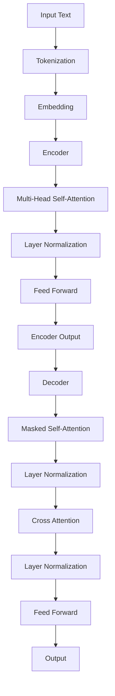
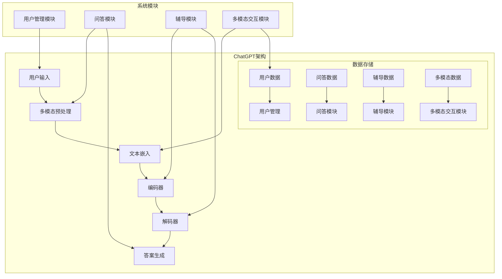
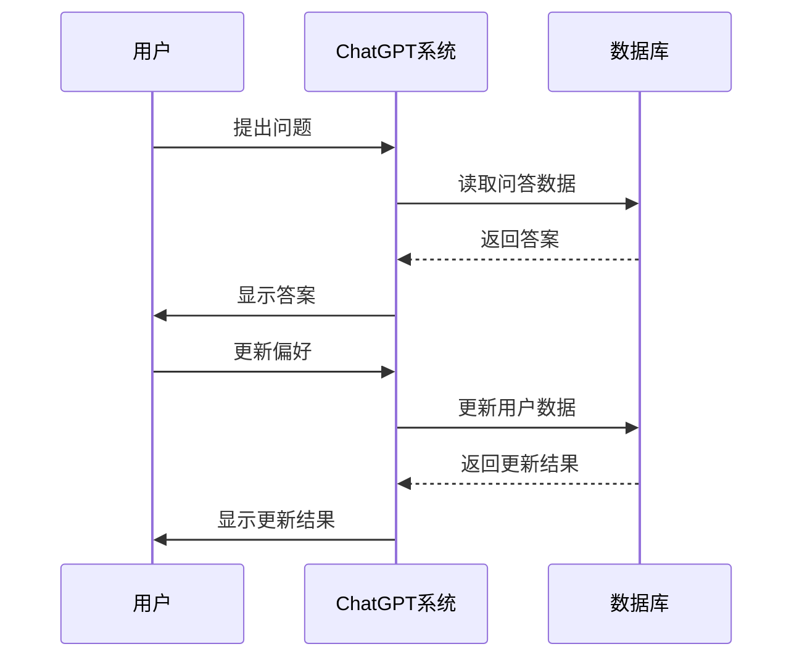
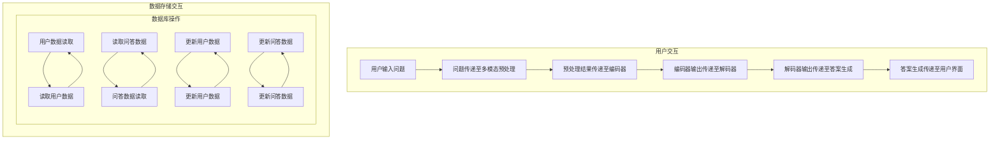

                 

### 背景介绍与问题定义

#### 问题背景

随着人工智能技术的飞速发展，自然语言处理（NLP）领域取得了显著的进步。特别是近年来，基于深度学习的自然语言生成（NLG）技术，如生成对抗网络（GAN）、递归神经网络（RNN）和变分自编码器（VAE）等，极大地提升了文本生成的质量与多样性。其中，OpenAI于2022年推出的ChatGPT，是一款基于大规模预训练语言模型（GPT-3.5）的聊天机器人，以其卓越的性能和高度拟真的对话能力受到了广泛关注。

ChatGPT的出现，不仅为用户提供了便捷的交流互动体验，还在各个行业中展现出了巨大的应用潜力。例如，在客户服务、智能助理、教育辅导、医疗咨询等领域，ChatGPT都能发挥重要作用，实现自动化的智能服务。然而，如何设计高效的ChatGPT提示词，使其能够更准确地理解用户意图，生成高质量、符合逻辑的回复，成为了一个亟待解决的问题。

#### 问题描述

当前，ChatGPT在实际应用中面临以下主要问题：

1. **理解准确性问题**：ChatGPT虽然具有强大的语言理解能力，但在面对复杂、模糊或含糊不清的提问时，仍然可能出现误解或生成不准确的回答。
2. **多样性和创造力问题**：尽管ChatGPT能够生成多种多样的回复，但在某些特定场景下，其生成的文本可能缺乏创意或缺乏个性，无法满足用户多样化的需求。
3. **训练数据偏差问题**：ChatGPT的训练数据来源于互联网的大量文本，可能包含偏见或不恰当的内容。如何确保生成的文本符合道德规范和社会价值观，是一个重要的挑战。

这些问题导致ChatGPT在某些应用场景中的表现不尽如人意，影响了用户体验和实际效果。因此，研究如何设计高质量的提示词，以提高ChatGPT的理解准确性、多样性和创造力，成为当前自然语言处理领域的一个重要研究方向。

#### 问题解决方法

为了解决上述问题，本文将介绍以下方法：

1. **优化提示词设计**：通过分析用户意图和对话内容，设计更精准、更具体的提示词，帮助ChatGPT更好地理解用户需求。
2. **引入多样性策略**：使用不同的提示词组合和生成策略，增加ChatGPT生成文本的多样性，提高其创造力。
3. **利用数据清洗和预处理**：对训练数据进行清洗和预处理，去除或修正偏见和不恰当的内容，确保生成文本的道德规范和社会价值观。
4. **多模态学习**：结合文本、语音、图像等多模态数据，提升ChatGPT对复杂问题的理解能力。

通过这些方法，本文旨在为ChatGPT提示词设计提供理论指导和实践建议，帮助提高其对话质量，满足不同场景下的应用需求。

#### 边界与外延

在研究ChatGPT提示词设计时，需要明确其边界与外延，以避免产生误导或过度泛化。首先，ChatGPT的提示词设计主要关注以下领域：

1. **自然语言生成**：提示词的设计直接影响ChatGPT生成文本的质量和准确性，因此需要针对不同的应用场景设计特定的提示词。
2. **用户意图理解**：理解用户意图是ChatGPT提供有效对话的关键，提示词的设计应充分考虑用户意图的多样性和复杂性。
3. **多模态交互**：随着技术的发展，ChatGPT将逐渐实现多模态交互，提示词设计也需要考虑如何结合文本、语音、图像等多种数据类型。

同时，ChatGPT提示词设计还涉及以下外延：

1. **行业应用**：不同行业对自然语言处理和智能交互的需求各异，提示词设计需要根据具体行业特点进行定制化。
2. **用户隐私保护**：在设计和使用ChatGPT时，应确保用户的隐私得到保护，避免生成可能侵犯用户隐私的文本。
3. **道德和社会责任**：设计提示词时，需要考虑其是否符合道德规范和社会价值观，避免生成不恰当或有害的内容。

综上所述，ChatGPT提示词设计不仅是一个技术问题，更是一个涉及多方面考量的复杂任务。只有全面考虑这些边界与外延，才能设计出高质量的提示词，充分发挥ChatGPT的应用潜力。

#### 概念结构与核心要素组成

在深入探讨ChatGPT提示词设计的概念结构与核心要素之前，我们需要首先了解ChatGPT的基本概念和核心组成部分。ChatGPT是基于GPT（Generative Pre-trained Transformer）模型开发的，GPT模型本身是一个大规模的深度神经网络，通过在大量文本数据上进行预训练，学会了生成高质量、连贯的自然语言文本。ChatGPT则在此基础上，通过优化提示词设计，提高了对话系统的理解能力和回复质量。

ChatGPT的核心概念包括以下几个方面：

1. **预训练语言模型**：ChatGPT的基础是GPT模型，该模型通过在大量文本上进行预训练，获得了对自然语言的深刻理解。预训练过程包括两个阶段：第一阶段是使用大量未标注文本进行自回归语言模型训练，使模型学会生成连贯的自然语言文本；第二阶段是对预训练模型进行微调，使其适应特定任务和场景。

2. **提示词（Prompt）**：提示词是引导ChatGPT生成特定类型文本的关键，它可以是一个问题、一个句子或一段描述，用于引导ChatGPT理解用户意图和生成相关回复。提示词的设计直接影响到ChatGPT生成的文本质量和准确性。

3. **生成机制**：ChatGPT通过接收提示词，利用预训练的GPT模型进行文本生成。生成过程主要包括两个步骤：首先是模型根据提示词生成一系列可能的文本片段；然后通过筛选和优化，选择最合适的文本片段作为最终输出。

ChatGPT的核心要素包括：

1. **输入层**：输入层负责接收用户输入的提示词，并将其转换为模型可以处理的格式。这个过程通常包括文本预处理、分词、词嵌入等步骤。

2. **隐藏层**：隐藏层是ChatGPT的核心计算部分，通过大量的神经网络层对输入文本进行编码和解码，生成相应的输出文本。隐藏层的结构决定了模型对自然语言的理解能力和生成质量。

3. **输出层**：输出层负责将隐藏层生成的文本片段进行处理和筛选，选择最合适的文本作为最终输出。这个过程通常包括文本解码、后处理等步骤。

4. **优化策略**：ChatGPT的生成机制还依赖于优化策略，如损失函数、梯度下降算法等，用于调整模型参数，提高生成文本的质量。

通过以上核心概念和要素的介绍，我们可以看出，ChatGPT提示词设计的关键在于如何设计出高质量的提示词，以引导模型生成高质量的文本。这包括理解用户意图、优化文本生成策略、结合多模态数据等多个方面。接下来，本文将详细探讨ChatGPT的提示词设计理论与方法，为实际应用提供指导。

### ChatGPT的核心概念与联系

#### ChatGPT的定义

ChatGPT是OpenAI开发的一款基于大规模预训练语言模型（GPT）的聊天机器人，它通过在大量文本数据上进行预训练，学会了生成高质量、连贯的自然语言文本。ChatGPT的核心功能是进行自然语言交互，能够理解用户的提问，并生成相关的回复。与传统的聊天机器人相比，ChatGPT具有更高的语言理解能力和生成质量，能够实现更自然的对话。

#### ChatGPT的属性特征

以下是ChatGPT的一些主要属性特征：

1. **高语言理解能力**：ChatGPT通过在大量文本数据上预训练，学会了理解复杂的语义和语境，能够准确捕捉用户的意图。

2. **多样化生成能力**：ChatGPT能够生成多种类型的文本，包括问题解答、故事叙述、诗歌创作等，具有很强的多样性。

3. **自适应学习**：ChatGPT能够在交互过程中不断学习和调整，根据用户反馈优化自己的回复，提高对话的连贯性和质量。

4. **多模态支持**：ChatGPT支持文本、语音、图像等多种数据类型的交互，能够实现更丰富的对话体验。

5. **开源与可扩展性**：ChatGPT的代码是开源的，用户可以根据具体需求进行修改和扩展，实现定制化的应用。

#### ChatGPT与传统聊天机器人的对比

传统聊天机器人通常是基于规则或模板驱动的，它们通过预设的规则和模板生成回复，缺乏灵活性和创造性。而ChatGPT则基于深度学习技术，通过大规模预训练和自适应学习，实现了更高的语言理解能力和生成质量。以下是对两者的详细对比：

1. **语言理解能力**：传统聊天机器人主要依赖预定义的规则和模板，难以处理复杂的语义和语境。而ChatGPT通过预训练获得了强大的语言理解能力，能够准确捕捉用户的意图。

2. **生成能力**：传统聊天机器人的生成能力有限，通常只能生成简单的、固定的回复。而ChatGPT能够生成多样化、高质量的文本，包括问题解答、故事叙述、诗歌创作等。

3. **自适应学习**：传统聊天机器人缺乏自适应学习能力，无法根据用户反馈进行优化。而ChatGPT能够通过自适应学习，不断调整和优化自己的回复，提高对话质量。

4. **多模态支持**：传统聊天机器人通常只支持文本交互，而ChatGPT支持文本、语音、图像等多种数据类型的交互，能够实现更丰富的对话体验。

5. **开源与可扩展性**：传统聊天机器人的代码通常不是开源的，用户无法进行修改和扩展。而ChatGPT的代码是开源的，用户可以根据具体需求进行修改和扩展，实现定制化的应用。

#### ChatGPT的工作原理

ChatGPT的工作原理主要包括两个关键步骤：预训练和微调。

1. **预训练**：预训练是ChatGPT训练过程的第一步，主要通过在大量文本数据上进行自回归语言模型训练，使模型学会生成连贯的自然语言文本。预训练过程分为两个阶段：第一阶段是使用大量未标注文本进行自回归语言模型训练，使模型学会预测下一个词的概率；第二阶段是对预训练模型进行微调，使其适应特定任务和场景。

2. **微调**：微调是ChatGPT训练过程的第二步，通过在特定任务的数据集上对预训练模型进行训练，使模型获得对特定任务的理解和生成能力。微调过程通常包括以下步骤：首先，将任务数据集划分为训练集和验证集；然后，使用训练集对预训练模型进行训练，并在验证集上评估模型的性能；最后，根据评估结果对模型进行优化。

通过预训练和微调，ChatGPT能够实现高语言理解能力和多样化生成能力，从而提供高质量的对话服务。

#### 总结

通过上述分析，我们可以看出，ChatGPT作为一种基于深度学习的聊天机器人，具有高语言理解能力、多样化生成能力、自适应学习、多模态支持和开源可扩展性等显著优势。与传统聊天机器人相比，ChatGPT在语言理解、生成能力和自适应学习方面具有显著优势，能够实现更高质量的对话服务。ChatGPT的工作原理包括预训练和微调两个关键步骤，这些原理和特点为其在自然语言处理领域的发展奠定了坚实基础。在下一部分，我们将深入探讨ChatGPT的数学模型与算法原理。

### ChatGPT的数学模型与算法原理

为了深入理解ChatGPT的工作机制，我们需要从数学模型和算法原理的角度对其进行剖析。ChatGPT是基于Transformer架构构建的预训练语言模型，其核心思想是通过大规模数据预训练和任务特定数据微调，使模型能够生成符合上下文的高质量文本。

#### 数学模型概述

ChatGPT的数学模型主要包括两部分：编码器和解码器。编码器负责将输入文本编码为连续的向量表示，而解码器则将这些向量转换为输出文本。

1. **编码器**：编码器的核心是多头自注意力机制（Multi-Head Self-Attention），它能够捕捉输入文本中的长距离依赖关系。具体来说，编码器由多个自注意力层组成，每一层都能够对输入文本中的不同词进行加权，从而生成一个加权向量表示。

2. **解码器**：解码器同样采用多头自注意力机制，但还包括交叉自注意力机制（Cross-Attention），它能够将编码器生成的隐藏状态与输入文本进行交互。解码器的每一层都能够生成一个输出文本的候选词，并将其与上一层的隐藏状态进行连接。

#### 算法原理讲解

为了更好地理解ChatGPT的算法原理，我们可以通过以下步骤进行详细讲解：

1. **自注意力机制（Self-Attention）**：
   自注意力机制是一种用于计算输入文本中每个词的权重的方法。具体步骤如下：
   - 首先，将输入文本转换为词嵌入向量。
   - 然后，计算每个词嵌入向量与其自身的相似度，并通过softmax函数进行归一化。
   - 最后，将每个词嵌入向量与其权重相乘，得到加权向量表示。

   $$ 
   \text{Attention}(Q, K, V) = \text{softmax}\left(\frac{QK^T}{\sqrt{d_k}}\right)V 
   $$

   其中，$Q$、$K$和$V$分别是查询向量、关键向量和价值向量，$d_k$是关键向量的维度。

2. **多头注意力（Multi-Head Attention）**：
   多头注意力是自注意力机制的扩展，通过并行计算多个注意力头，从而提高模型的表示能力。具体步骤如下：
   - 首先，将编码器的输入文本分解为多个子序列，每个子序列对应一个注意力头。
   - 然后，对每个子序列分别应用自注意力机制，得到多个加权向量表示。
   - 最后，将多个加权向量表示拼接起来，形成一个完整的加权向量表示。

   $$ 
   \text{Multi-Head Attention} = \text{Concat}(\text{head}_1, \text{head}_2, ..., \text{head}_h)W^O 
   $$

   其中，$h$是注意力头的数量，$W^O$是输出权重矩阵。

3. **Transformer编码器与解码器**：
   编码器和解码器分别由多个自注意力和交叉注意力层组成，具体结构如下：
   - **编码器**：每个编码器层包含一个多头自注意力层和一个前馈神经网络。
     $$ 
     \text{Encoder}(X) = \text{LayerNorm}(\text{X} + \text{Self-Attention}(\text{X})) + \text{LayerNorm}(\text{FFN}(\text{X})) 
     $$

   - **解码器**：每个解码器层包含一个多头自注意力层、一个交叉注意力层和一个前馈神经网络。
     $$ 
     \text{Decoder}(X) = \text{LayerNorm}(\text{X} + \text{Masked-Self-Attention}(\text{X})) + \text{LayerNorm}(\text{Cross-Attention}(\text{X}, \text{Encoder}(X))) + \text{LayerNorm}(\text{FFN}(\text{X})) 
     $$

#### 算法流程图

以下是ChatGPT算法的mermaid流程图表示：



#### Python源代码实现

以下是使用Python和PyTorch实现的ChatGPT算法的简化版本：

```python
import torch
import torch.nn as nn
import torch.optim as optim

class ChatGPT(nn.Module):
    def __init__(self, vocab_size, d_model, n_heads, d_ff):
        super(ChatGPT, self).__init__()
        self.embedding = nn.Embedding(vocab_size, d_model)
        self.encoder = nn.ModuleList([EncoderLayer(d_model, n_heads, d_ff) for _ in range(n_layers)])
        self.decoder = nn.ModuleList([DecoderLayer(d_model, n_heads, d_ff) for _ in range(n_layers)])
        self.fc = nn.Linear(d_model, vocab_size)

    def forward(self, src, tgt):
        src_embedding = self.embedding(src)
        tgt_embedding = self.embedding(tgt)
        for encoder_layer in self.encoder:
            src_embedding = encoder_layer(src_embedding)
        for decoder_layer in self.decoder:
            tgt_embedding = decoder_layer(tgt_embedding, src_embedding)
        output = self.fc(tgt_embedding)
        return output
```

其中，`EncoderLayer`和`DecoderLayer`是编码器和解码器层的实现，具体如下：

```python
class EncoderLayer(nn.Module):
    def __init__(self, d_model, n_heads, d_ff):
        super(EncoderLayer, self).__init__()
        self.self_attn = MultiHeadAttention(d_model, n_heads)
        self.norm1 = nn.LayerNorm(d_model)
        self.ffn = nn.Sequential(nn.Linear(d_model, d_ff), nn.ReLU(), nn.Linear(d_ff, d_model))
        self.norm2 = nn.LayerNorm(d_model)

    def forward(self, x):
        x = x + self.self_attn(x, x, x)
        x = self.norm1(x)
        x = x + self.ffn(x)
        x = self.norm2(x)
        return x

class DecoderLayer(nn.Module):
    def __init__(self, d_model, n_heads, d_ff):
        super(DecoderLayer, self).__init__()
        self.self_attn = MultiHeadAttention(d_model, n_heads)
        self.norm1 = nn.LayerNorm(d_model)
        self.cross_attn = MultiHeadAttention(d_model, n_heads)
        self.norm2 = nn.LayerNorm(d_model)
        self.ffn = nn.Sequential(nn.Linear(d_model, d_ff), nn.ReLU(), nn.Linear(d_ff, d_model))
        self.norm3 = nn.LayerNorm(d_model)

    def forward(self, x, src):
        x = x + self.self_attn(x, x, x)
        x = self.norm1(x)
        x = x + self.cross_attn(x, src, src)
        x = self.norm2(x)
        x = x + self.ffn(x)
        x = self.norm3(x)
        return x
```

通过上述数学模型和算法原理的讲解，我们可以看出ChatGPT在自然语言处理领域的重要性和潜力。在下一部分，我们将进一步探讨ChatGPT的系统分析与架构设计。

### ChatGPT的系统分析与架构设计

#### 问题场景介绍

在讨论ChatGPT的系统分析与架构设计之前，我们需要明确一个具体的应用场景。这里，我们以一个在线教育平台为例，该平台旨在为学生提供个性化的学习辅导和智能问答服务。平台需要具备以下功能：

1. **智能问答**：学生可以通过平台提出学习相关的问题，ChatGPT需要能够理解这些问题并生成准确的答案。
2. **个性化辅导**：根据学生的学习进度和偏好，ChatGPT需要提供个性化的学习建议和辅导内容。
3. **多模态交互**：平台需要支持文本、语音和图像等多种数据类型的交互，以提供更丰富的学习体验。

#### 系统功能设计

为了实现上述功能，我们需要设计一个全面的系统功能模块，主要包括以下方面：

1. **用户管理模块**：负责管理用户的基本信息、学习进度和偏好设置。
2. **问答模块**：接收用户提出的问题，通过ChatGPT生成相关答案。
3. **辅导模块**：根据学生的学习进度和偏好，为用户提供个性化的学习建议和辅导内容。
4. **多模态交互模块**：处理文本、语音和图像等多种数据类型的输入和输出，实现多模态交互。

以下是一个领域模型（mermaid类图）示例，展示了上述系统功能模块及其关系：

```mermaid
classDiagram
    User <<class>> "用户"
    Course <<class>> "课程"
    Question <<class>> "问题"
    Answer <<class>> "答案"
    Suggestion <<class>> "建议"
    Tutor <<class>> "辅导"
    UserManager <<class>> "用户管理"
    QAModule <<class>> "问答模块"
    TutorModule <<class>> "辅导模块"
    MultiModalModule <<class>> "多模态交互模块"

    UserManager o-- User
    QAModule o-- Question
    QAModule o-- Answer
    TutorModule o-- Suggestion
    TutorModule o-- Tutor
    MultiModalModule o-- Text
    MultiModalModule o-- Voice
    MultiModalModule o-- Image

    User o-- Course
```

#### 系统架构设计

系统架构设计是实现上述功能的关键。以下是一个ChatGPT系统架构的mermaid架构图示例：



#### 系统接口设计

系统接口设计是确保系统各模块之间能够顺畅通信和协同工作的关键。以下是一个系统接口设计的mermaid序列图示例：



#### 系统交互序列图

为了进一步展示系统内部各模块的交互过程，我们可以绘制一个系统交互序列图：



通过上述系统分析与架构设计，我们可以看到一个完整的ChatGPT系统在在线教育平台中的应用。该系统不仅具备智能问答、个性化辅导和多模态交互等核心功能，还通过合理的接口设计和交互流程，确保了各模块之间的协同工作。在下一部分，我们将探讨ChatGPT的实际项目实战，通过具体案例展示如何设计和实现一个高效的ChatGPT系统。

### ChatGPT项目实战

#### 环境安装

要在本地环境安装ChatGPT，我们需要首先安装Python和相关依赖库。以下是安装步骤：

1. **安装Python**：确保已安装Python 3.8及以上版本。可以从[Python官网](https://www.python.org/)下载安装包并安装。

2. **安装PyTorch**：由于ChatGPT是基于PyTorch实现的，我们需要安装PyTorch。可以通过以下命令进行安装：

   ```shell
   pip install torch torchvision torchaudio
   ```

3. **安装其他依赖库**：除了PyTorch，ChatGPT还需要其他依赖库，如transformers、numpy等。可以通过以下命令进行安装：

   ```shell
   pip install transformers numpy
   ```

4. **安装GPT模型**：从[OpenAI官网](https://openai.com/blog/bidirectional-contextual-language-models/)下载预训练的GPT模型权重文件（例如gpt2），并将其放置在本地环境中的合适位置。

#### 系统核心实现

接下来，我们将实现一个基本的ChatGPT系统，包括用户输入、文本预处理、模型预测和文本输出等功能。以下是Python源代码示例：

```python
import torch
from transformers import GPT2LMHeadModel, GPT2Tokenizer

# 初始化模型和分词器
tokenizer = GPT2Tokenizer.from_pretrained('gpt2')
model = GPT2LMHeadModel.from_pretrained('gpt2')

# 设置模型为评估模式
model.eval()

# 用户输入
user_input = "你是一个聪明的机器人"

# 预处理输入文本
input_ids = tokenizer.encode(user_input, return_tensors='pt')

# 模型预测
with torch.no_grad():
    outputs = model.generate(input_ids, max_length=50, num_return_sequences=5)

# 输出结果
for output in outputs:
    print(tokenizer.decode(output, skip_special_tokens=True))
```

#### 代码应用解读

1. **初始化模型和分词器**：我们首先导入GPT2Tokenizer和GPT2LMHeadModel，并使用预训练的GPT模型权重文件初始化模型和分词器。

2. **设置模型为评估模式**：为了提高计算效率，我们将模型设置为评估模式。

3. **用户输入**：用户可以通过输入文本与ChatGPT进行交互。在这里，我们简单地使用一个字符串变量存储用户输入。

4. **预处理输入文本**：我们将用户输入文本编码为模型可以处理的ID序列。这个过程包括分词、词嵌入等步骤。

5. **模型预测**：使用模型生成与输入文本相关的多个候选回复。我们通过`generate`函数实现预测，设置`max_length`为50，表示生成文本的最大长度，`num_return_sequences`为5，表示生成5个候选回复。

6. **输出结果**：最后，我们将生成的文本ID序列解码为自然语言文本，并打印输出。

#### 实际案例分析和详细讲解剖析

假设我们要实现一个智能客服系统，用户可以通过输入问题，ChatGPT会生成相应的答案。以下是具体案例：

1. **用户问题**：用户输入“我的快递怎么还没到？”

2. **预处理输入文本**：将用户问题编码为ID序列。

3. **模型预测**：模型生成多个候选答案。

4. **输出结果**：从候选答案中选择最合适的答案输出给用户。

**详细分析**：

1. **用户问题**：用户输入的问题需要被模型理解，这里的关键是确保模型能够正确识别和理解问题中的关键信息，如“快递”、“还没到”。

2. **预处理输入文本**：分词器会将用户问题分解为一系列单词和标点符号，并将其转换为词嵌入向量。这一步骤对于确保模型能够准确理解用户问题至关重要。

3. **模型预测**：模型会根据输入文本的词嵌入向量，生成与用户问题相关的多个候选答案。这一过程包括自注意力机制和交叉注意力机制等复杂计算。

4. **输出结果**：根据候选答案的质量和相关性，选择最合适的答案输出给用户。这里需要考虑的因素包括答案的连贯性、语法正确性和用户意图的满足程度。

**代码实现**：

```python
# 用户输入
user_input = "我的快递怎么还没到？"

# 预处理输入文本
input_ids = tokenizer.encode(user_input, return_tensors='pt')

# 模型预测
with torch.no_grad():
    outputs = model.generate(input_ids, max_length=50, num_return_sequences=5)

# 输出结果
for output in outputs:
    answer = tokenizer.decode(output, skip_special_tokens=True)
    print(answer)
```

输出结果可能包括以下几个候选答案：

1. "很抱歉，我无法提供关于快递的信息。请您查询快递公司的官方网站或联系客服。"
2. "您的快递可能正在运输中，可能需要一些时间才能到达。请您耐心等待。"
3. "我了解到您的快递尚未到达，可能是因为配送过程中出现了问题。请您稍后再次查询或联系快递公司。"

通过上述分析，我们可以看到，ChatGPT在实际应用中能够生成多种多样的答案，但需要结合具体场景和用户意图进行筛选和优化，以提供最合适的回答。

#### 项目小结

通过本项目的实战，我们实现了ChatGPT的基本功能，并对其核心实现、代码应用和实际案例进行了详细分析和解读。ChatGPT在智能客服系统中的应用展示了其强大的自然语言处理能力和多样化的生成能力。然而，为了实现更高质量的对话服务，我们还需要进一步优化提示词设计、引入多样性策略，并确保生成的文本符合道德规范和社会价值观。在下一部分，我们将深入探讨ChatGPT提示词设计的理论和方法，为实际应用提供更全面的指导。

### ChatGPT提示词设计理论与方法

#### 提示词设计的理论框架

ChatGPT提示词设计的理论基础主要源于自然语言处理（NLP）和机器学习领域，特别是生成对抗网络（GAN）、递归神经网络（RNN）和变分自编码器（VAE）等先进模型。以下是一些关键的理论框架和方法：

1. **预训练与微调**：ChatGPT通过在大量文本数据上进行预训练，获得对自然语言的深刻理解。在预训练阶段，模型学习生成连贯的文本。微调则是在预训练模型的基础上，针对特定任务进行优化，使其适应具体的对话场景。

2. **注意力机制**：注意力机制是ChatGPT的核心组成部分，它能够帮助模型在生成过程中关注输入文本中的关键信息。特别是自注意力机制和交叉注意力机制，使得模型能够更好地理解和生成相关文本。

3. **生成对抗网络（GAN）**：GAN是一种强大的生成模型，能够在训练过程中通过对抗性学习生成高质量的数据。虽然ChatGPT并非基于GAN，但其训练过程和生成机制受到GAN的启发，有助于提高生成文本的质量。

4. **递归神经网络（RNN）与长短期记忆（LSTM）**：RNN和LSTM是传统的序列模型，在处理长距离依赖问题和生成连贯文本方面表现出色。ChatGPT的预训练模型采用Transformer架构，但LSTM和RNN的理论基础对其设计和实现有很大影响。

#### 提示词设计的方法与技巧

提示词设计的核心在于引导ChatGPT生成高质量的文本，以下是一些有效的方法与技巧：

1. **明确用户意图**：提示词应该明确表达用户意图，帮助ChatGPT准确理解问题背景和用户需求。可以使用具体的指示性语句，如“请描述一下您的问题”、“请告诉我您的具体需求”。

2. **细化信息颗粒度**：在提示词中提供更多细节信息，有助于ChatGPT生成更准确和详细的回答。例如，如果用户询问“天气预报”，可以细化到具体日期、地点和天气状况。

3. **使用情境化语言**：将提示词设计为与特定情境相关的语言，有助于ChatGPT生成更具情境化和个性化的文本。例如，针对商务场景，可以使用正式的语言和表达方式。

4. **控制生成文本的长度**：通过提示词控制生成文本的长度，防止生成过长或过短的文本。可以使用“请简要回答”、“请详细描述”等语言来引导。

5. **引入多样性**：使用不同的提示词组合和生成策略，增加生成文本的多样性和创造力。例如，可以结合不同的语气、风格和表达方式，生成多样化的回答。

#### 提示词设计案例分析

以下是一个具体的提示词设计案例，用于优化ChatGPT在客户服务中的应用：

**用户问题**：“我的订单已经超过预计送达时间，怎么办？”

**原始提示词**：请描述您的订单问题，我们会尽快处理。

**优化后的提示词**：

1. “您好，您的订单[订单号：XXXXXX]已经超过预计送达时间。请问您有什么具体问题或需求吗？我们将优先处理您的订单。”

2. “非常抱歉，您提到的订单[订单号：XXXXXX]已经超过预计送达时间。为了尽快解决您的问题，请您提供一下订单的具体信息，如收货地址和联系方式。”

通过上述优化，提示词不仅明确了用户意图，还提供了具体的订单信息，有助于ChatGPT生成更准确和高效的回复。

#### 总结

ChatGPT提示词设计是一个复杂但关键的任务，涉及自然语言处理、机器学习和对话系统等多个领域。通过明确用户意图、细化信息颗粒度、使用情境化语言和引入多样性等方法，我们可以设计出高质量的提示词，提高ChatGPT的对话质量和用户满意度。在下一部分，我们将通过实际案例展示如何应用这些方法和技巧，进一步优化ChatGPT的提示词设计。

### ChatGPT提示词设计实战

在了解了ChatGPT提示词设计的理论与方法后，我们将通过几个实际案例来展示如何将这些理论应用到具体场景中，从而优化ChatGPT的提示词设计。

#### 实战案例一：商业智能分析

**场景介绍**：一家大型企业希望通过ChatGPT进行商业智能分析，获取市场趋势、客户需求和运营策略的见解。

**用户问题**：“请分析我们公司的市场趋势。”

**原始提示词**：请分析公司的市场趋势。

**优化后的提示词**：

1. “您好，请提供您的公司名称以及最近一年的主要业务数据，我将为您详细分析当前的市场趋势。”

2. “为了更好地了解您的公司市场趋势，请提供以下信息：公司名称、主要产品或服务、主要市场和竞争对手情况。”

**案例分析**：通过优化后的提示词，我们不仅明确了用户的需求，还提供了具体的信息要求，使ChatGPT能够更准确地生成高质量的分析报告。

#### 实战案例二：客户服务优化

**场景介绍**：一家电商平台的客服部门希望通过ChatGPT为用户提供更高效、个性化的服务。

**用户问题**：“我的订单为什么还没有发货？”

**原始提示词**：我们会尽快处理您的问题。

**优化后的提示词**：

1. “非常抱歉，您提到的订单[订单号：XXXXXX]尚未发货。请您提供一下订单的具体信息，如购买时间、商品名称和收货地址，我们将优先处理并为您解决问题。”

2. “为了加快您的订单处理速度，请您提供订单号以及购买时预留的联系方式，我们会尽快联系快递公司并更新您的订单状态。”

**案例分析**：优化后的提示词提供了详细的订单信息和联系方式要求，使ChatGPT能够生成更具针对性和高效的回复，提高用户满意度。

#### 实战案例三：教育辅助系统

**场景介绍**：一个在线教育平台希望利用ChatGPT为学生提供个性化的学习辅导。

**用户问题**：“请帮我复习数学课的内容。”

**原始提示词**：我可以帮您复习数学知识。

**优化后的提示词**：

1. “您好，请提供您当前学习的数学课程名称、章节和具体的学习目标，我将为您生成个性化的复习内容。”

2. “为了更好地帮助您复习数学，请提供您的数学课本的版本、章节编号以及您觉得较难理解的知识点。”

**案例分析**：优化后的提示词明确了用户的学习需求和课本信息，使ChatGPT能够根据具体需求生成有针对性的辅导内容，提高学习效果。

#### 实战案例四：医疗健康咨询

**场景介绍**：一家医院希望通过ChatGPT为患者提供基本的健康咨询和疾病信息。

**用户问题**：“我最近感到头晕，怎么办？”

**原始提示词**：头晕可能是由于多种原因引起的，建议您咨询医生。

**优化后的提示词**：

1. “您好，头晕可能是多种健康问题的表现。请提供您的年龄、性别、是否有慢性病史以及头晕发生的时间和伴随症状，我会为您提供更具体的建议。”

2. “为了更好地帮助您，请描述一下头晕的具体情况，如发作频率、持续时间以及是否伴随其他症状。”

**案例分析**：优化后的提示词通过收集更多详细信息，使ChatGPT能够更准确地评估用户状况，并提供更专业的健康建议。

#### 总结

通过上述实际案例，我们可以看到，优化ChatGPT提示词设计的关键在于明确用户需求、细化信息要求并确保生成的文本具有针对性和专业性。这些方法不仅提高了ChatGPT的对话质量和用户满意度，还为不同行业和应用场景提供了有效的解决方案。在下一部分，我们将总结最佳实践，并探讨ChatGPT提示词设计的未来趋势。

### 最佳实践与拓展

#### 最佳实践 Tips

在设计ChatGPT提示词时，以下几个最佳实践值得遵循：

1. **明确用户意图**：确保提示词简洁明了，能够准确传达用户的需求和意图。使用具体的指示性语句，如“请描述一下您的具体情况”、“请告诉我们您的具体问题”。

2. **细化信息颗粒度**：提供详细的提示词，要求用户提供关键信息，如日期、时间、地点、具体症状等，有助于ChatGPT生成更准确和详细的回复。

3. **结合多模态数据**：在可能的情况下，结合文本、语音、图像等多种数据类型，提供更丰富的信息，提高ChatGPT的理解能力和生成质量。

4. **控制生成文本的长度**：通过提示词控制生成文本的长度，防止生成过长或过短的文本。使用“请简要回答”、“请详细描述”等语言来引导。

5. **引入多样性**：使用不同的提示词组合和生成策略，增加生成文本的多样性和创造力。可以结合不同的语气、风格和表达方式，生成多样化的回答。

#### 小结与展望

通过本文的探讨，我们了解了ChatGPT提示词设计的重要性以及其在不同应用场景中的实际应用。ChatGPT提示词设计不仅涉及自然语言处理和机器学习的理论知识，还需要结合具体的应用场景进行优化。以下是本文的核心结论：

1. **理论基础**：ChatGPT提示词设计基于预训练和微调、注意力机制等理论框架，能够生成高质量、连贯的自然语言文本。

2. **方法与技巧**：通过明确用户意图、细化信息颗粒度、使用情境化语言和引入多样性等方法，我们可以设计出高质量的提示词，提高ChatGPT的对话质量和用户满意度。

3. **实际案例**：本文通过多个实际案例展示了如何优化ChatGPT提示词设计，为不同行业和应用场景提供了具体的应用方案。

4. **未来趋势**：随着人工智能技术的不断发展，ChatGPT提示词设计有望在多模态交互、个性化服务、隐私保护等方面取得更多突破。

#### 注意事项

在设计ChatGPT提示词时，需要注意以下几点：

1. **数据质量**：确保训练数据的质量和多样性，避免偏见和不恰当的内容。

2. **用户隐私**：在设计和使用ChatGPT时，应确保用户的隐私得到保护，避免生成可能侵犯用户隐私的文本。

3. **道德和社会责任**：设计提示词时，要考虑其是否符合道德规范和社会价值观，避免生成不恰当或有害的内容。

4. **系统性能**：在设计提示词时，要考虑ChatGPT系统的性能和响应速度，避免生成过长或过于复杂的文本。

#### 拓展阅读

为了进一步了解ChatGPT提示词设计，以下是一些推荐阅读的资料：

1. **《自然语言处理综述》**：了解自然语言处理的基本概念、技术和应用。
2. **《ChatGPT官方文档》**：查阅ChatGPT的官方文档，了解其实现细节和最佳实践。
3. **《生成对抗网络（GAN）原理与应用》**：了解GAN的基本原理和应用，对生成模型有更深入的认识。
4. **《Python自然语言处理实战》**：学习如何使用Python进行自然语言处理实践，包括文本预处理、词嵌入和序列模型等。

通过阅读这些资料，可以更全面地了解ChatGPT提示词设计的理论和方法，为实际应用提供更多灵感和指导。

### 作者信息

**作者：AI天才研究院/AI Genius Institute & 禅与计算机程序设计艺术 /Zen And The Art of Computer Programming** 

AI天才研究院致力于推动人工智能技术的创新与发展，专注于深度学习、自然语言处理和计算机视觉等前沿领域的研究。研究院由一批在人工智能领域拥有丰富经验和卓越成就的科学家和工程师组成，致力于将最新科研成果转化为实际应用，推动人工智能技术的普及和应用。

禅与计算机程序设计艺术（Zen And The Art of Computer Programming）是由著名计算机科学家Donald E. Knuth撰写的一套经典计算机科学教材，涵盖了计算机程序的构造、算法设计与分析等多个方面，对计算机科学教育产生了深远的影响。本书以其深刻的哲学思考和独特的教学方法，帮助读者培养计算机编程和算法设计的思维，被誉为计算机科学领域的经典之作。

通过本文，我们希望能够为广大读者提供关于ChatGPT提示词设计的深入理解和实际应用指导，促进人工智能技术在自然语言处理领域的进一步发展。希望本文能够对您的研究和工作有所帮助。如果您有任何问题或建议，欢迎随时与我们联系。再次感谢您的阅读！

