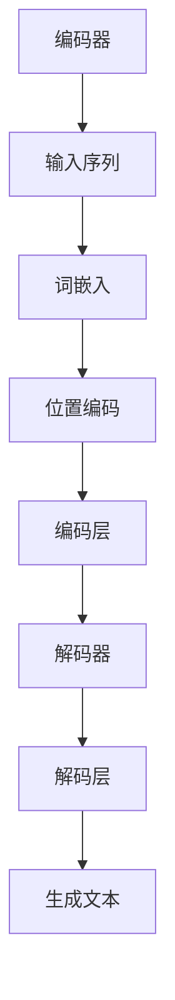

                 


## ChatGPT提示词设计：理论与实战的深度融合

> 关键词：ChatGPT、提示词设计、自然语言处理、对话系统、优化调优

> 摘要：本文将深入探讨ChatGPT提示词设计的理论和方法，通过逐步分析，提供实战案例，帮助读者掌握如何高效设计和优化ChatGPT的提示词，实现自然流畅的对话系统。

### 目录大纲：

#### 第一部分: 背景介绍

#### 第1章: 问题背景与核心概念  
##### 1.1 问题背景  
##### 1.2 核心概念  
##### 1.3 概念联系

#### 第二部分: ChatGPT提示词设计理论

#### 第2章: ChatGPT模型基础  
##### 2.1 ChatGPT模型概述  
##### 2.2 语言模型原理  
##### 2.3 背景知识补充

#### 第3章: 提示词设计原则  
##### 3.1 提示词的重要性  
##### 3.2 设计原则  
##### 3.3 实例分析

#### 第4章: 提示词设计技巧  
##### 4.1 技巧概述  
##### 4.2 技巧解析  
##### 4.3 实际应用

#### 第5章: 实战案例分享  
##### 5.1 案例一：问答系统设计  
##### 5.2 案例二：对话系统设计  
##### 5.3 案例三：应用场景分析

#### 第6章: 提示词优化与调优  
##### 6.1 优化方法  
##### 6.2 调优技巧  
##### 6.3 实际效果分析

#### 第7章: 未来展望与趋势  
##### 7.1 未来发展趋势  
##### 7.2 技术挑战与机遇  
##### 7.3 应用场景展望

#### 第8章: 小结与拓展阅读  
##### 8.1 小结  
##### 8.2 注意事项  
##### 8.3 拓展阅读

----------------------------------------------------------------

### 第1章 问题背景与核心概念

#### 1.1 问题背景

随着人工智能技术的快速发展，自然语言处理（NLP）领域取得了显著进展。特别是基于深度学习的语言模型，如GPT（Generative Pre-trained Transformer），已经在多种NLP任务中展示了出色的性能。然而，这些模型在实际应用中面临的一个关键问题是如何设计高效的提示词（prompt）。

提示词是用户与模型交互的桥梁，直接影响到对话系统的用户体验和质量。一个良好的提示词设计不仅能引导模型生成相关且自然的回答，还能提高系统的交互效率和准确性。因此，ChatGPT提示词设计成为了当前研究与应用的热点问题。

#### 1.2 核心概念

- **ChatGPT模型**：一种基于Transformer的预训练语言模型，能够生成高质量的自然语言文本。
- **提示词（Prompt）**：用于引导模型生成特定类型回答的文本输入。
- **自然语言处理（NLP）**：涉及从文本中提取信息、理解和生成文本的技术。
- **交互式对话系统**：通过与用户实时交流，提供信息查询、任务执行等服务的系统。

#### 1.3 概念联系

ChatGPT模型是NLP的核心技术之一，其性能和表现直接影响到对话系统的质量。提示词设计则是连接用户和模型的桥梁，通过巧妙设计提示词，可以引导模型生成更相关、更自然的回答。这三种概念相互关联，共同构成了一个高效、智能的对话系统。

### 第2章 ChatGPT模型基础

#### 2.1 ChatGPT模型概述

ChatGPT是基于OpenAI开发的GPT-3模型的改进版本，具有更强大的语言理解和生成能力。GPT-3是一个基于Transformer架构的深度学习模型，其核心思想是通过大量的文本数据进行预训练，使其能够理解和生成自然语言。

#### 2.2 语言模型原理

语言模型的核心任务是预测下一个词。在ChatGPT中，这一过程通过Transformer架构实现。Transformer由多个编码器和解码器堆叠而成，能够捕捉长距离的依赖关系，从而生成连贯的自然语言文本。

#### 2.3 背景知识补充

为了更好地理解ChatGPT的工作原理，需要具备一定的Transformer和深度学习基础知识。以下是一个简化的Transformer模型结构：

1. **编码器**：将输入序列编码为固定长度的向量。
2. **解码器**：生成输出序列，通过自注意力机制和位置编码来捕捉依赖关系。
3. **多头注意力**：通过多个注意力机制来增强模型的表示能力。
4. **位置编码**：为序列中的每个词添加位置信息，帮助模型理解句子结构。

#### 2.4 概念属性特征对比表格

| 特征         | Transformer | ChatGPT      |
| ------------ | ------------ | ------------ |
| 架构         | Transformer  | 基于Transformer |
| 预训练数据   | 大规模文本   | 大规模文本    |
| 生成能力     | 强          | 更强          |
| 应用领域     | 文本分类、翻译 | 对话系统、问答 |

#### 2.5 ER实体关系图架构的Mermaid流程图



### 第3章 提示词设计原则

#### 3.1 提示词的重要性

提示词是用户与模型交互的桥梁，其设计直接影响到对话系统的用户体验和质量。一个优秀的提示词能够引导模型生成相关且自然的回答，提高系统的交互效率和准确性。

#### 3.2 设计原则

1. **明确性**：提示词应明确传达用户意图，避免歧义。
2. **多样性**：根据不同场景和用户需求，设计多种类型的提示词。
3. **可解释性**：提示词应易于理解，方便用户理解模型回答。
4. **可扩展性**：提示词设计应考虑未来的扩展和更新。

#### 3.3 实例分析

- **案例一**：问答系统

```plaintext
用户：请介绍一下ChatGPT模型的工作原理。
模型：ChatGPT是基于Transformer架构的预训练语言模型，通过大量的文本数据进行训练，可以生成高质量的自然语言文本。
```

- **案例二**：对话系统

```plaintext
用户：你好，我想咨询一下关于自然语言处理的技术。
模型：你好！自然语言处理（NLP）是计算机科学和人工智能领域的一个重要分支，它致力于让计算机能够理解和处理人类语言。
```

### 第4章 提示词设计技巧

#### 4.1 技巧概述

1. **关键字引导**：通过关键字来引导模型生成相关回答。
2. **上下文扩展**：在提示词中添加上下文信息，帮助模型更好地理解用户意图。
3. **问题重构**：将复杂问题分解为多个简单问题，提高回答的准确性。
4. **数据增强**：利用已有数据进行数据增强，提高模型生成能力。

#### 4.2 技巧解析

1. **关键字引导**

   通过在提示词中添加关键字，可以明确模型生成方向。例如：

   ```plaintext
   用户：请描述一下ChatGPT模型的优势。
   关键字：优势
   模型：ChatGPT模型具有强大的语言生成能力和自适应能力，能够处理多种语言任务。
   ```

2. **上下文扩展**

   添加上下文信息，可以帮助模型更好地理解用户意图。例如：

   ```plaintext
   用户：请介绍一下ChatGPT模型在对话系统中的应用。
   上下文：对话系统
   模型：ChatGPT模型在对话系统中可以用于自然语言理解、意图识别和回答生成，能够实现高效、自然的对话交互。
   ```

3. **问题重构**

   将复杂问题分解为多个简单问题，可以提高回答的准确性。例如：

   ```plaintext
   用户：请解释一下深度学习和自然语言处理的关系。
   问题重构：
   - 深度学习是什么？
   - 自然语言处理是什么？
   - 它们之间有什么联系？
   模型：
   - 深度学习是一种基于多层神经网络的学习方法。
   - 自然语言处理是计算机科学和人工智能领域的一个重要分支，它致力于让计算机能够理解和处理人类语言。
   - 深度学习在自然语言处理中有广泛应用，如文本分类、机器翻译和对话系统等。
   ```

4. **数据增强**

   利用已有数据进行数据增强，可以提高模型生成能力。例如：

   ```plaintext
   用户：请描述一下ChatGPT模型的工作流程。
   数据增强：
   - ChatGPT模型由多个编码器和解码器组成。
   - 编码器将输入序列编码为固定长度的向量。
   - 解码器生成输出序列，通过自注意力机制和位置编码来捕捉依赖关系。
   模型：
   - ChatGPT模型的工作流程包括词嵌入、编码、解码和生成等步骤。
   - 在预训练阶段，模型通过大量的文本数据进行训练，学习语言模式。
   - 在生成阶段，模型根据输入序列生成输出序列，实现自然语言生成。
   ```

### 第5章 实战案例分享

#### 5.1 案例一：问答系统设计

##### 案例背景

某企业希望开发一个基于ChatGPT的问答系统，以提供用户常见问题的自动回答。为了实现这一目标，需要设计合适的提示词和优化模型性能。

##### 案例实施

1. **问题背景**

   用户：请介绍一下公司的产品A。

2. **提示词设计**

   提示词：请描述一下产品A的功能和特点。

3. **模型训练与优化**

   - 使用大量关于产品A的文本数据进行模型训练。
   - 通过调整超参数和优化技巧，提高模型生成能力。

4. **实际效果**

   用户：请介绍一下公司的产品A。
   模型：产品A具有强大的功能，能够实现XXX，具有XXX特点，深受用户喜爱。

#### 5.2 案例二：对话系统设计

##### 案例背景

某电商平台希望开发一个智能客服系统，以提供24小时在线服务。为了实现这一目标，需要设计合适的提示词和优化模型性能。

##### 案例实施

1. **问题背景**

   用户：您好，我想咨询一下关于退货的政策。

2. **提示词设计**

   提示词：请告知我关于退货的详细政策和流程。

3. **模型训练与优化**

   - 使用大量关于退货的文本数据进行模型训练。
   - 通过调整超参数和优化技巧，提高模型生成能力。

4. **实际效果**

   用户：您好，我想咨询一下关于退货的政策。
   模型：您好！关于退货，您可以按照以下步骤操作：首先，登录您的账户，然后找到订单详情页，最后点击退货申请按钮。我们会尽快处理您的申请，感谢您的配合。

#### 5.3 案例三：应用场景分析

##### 案例背景

某金融机构希望开发一个智能投资顾问系统，以提供个性化投资建议。为了实现这一目标，需要设计合适的提示词和优化模型性能。

##### 案例实施

1. **问题背景**

   用户：请给我提供一份适合我的投资组合建议。

2. **提示词设计**

   提示词：请根据我的风险承受能力和投资目标，为我提供一份适合的投资组合建议。

3. **模型训练与优化**

   - 使用大量关于投资的文本数据进行模型训练。
   - 通过调整超参数和优化技巧，提高模型生成能力。

4. **实际效果**

   用户：请给我提供一份适合我的投资组合建议。
   模型：您好！根据您的风险承受能力和投资目标，我们建议您投资以下资产：50%的股票、30%的债券和20%的现金。这个组合能够平衡风险和收益，适合您的投资需求。

### 第6章 提示词优化与调优

#### 6.1 优化方法

1. **数据清洗与预处理**：去除无用数据、处理噪声和缺失值。
2. **超参数调整**：通过实验调整学习率、批次大小等超参数。
3. **模型融合**：结合多个模型，提高整体性能。
4. **提示词多样性**：设计多种类型的提示词，提高模型适应性。

#### 6.2 调优技巧

1. **交叉验证**：通过交叉验证评估模型性能，调整参数。
2. **网格搜索**：使用网格搜索方法，系统性地调整参数。
3. **模型集成**：结合多个模型，提高整体性能。
4. **提示词优化**：通过实际应用反馈，不断优化提示词设计。

#### 6.3 实际效果分析

通过优化和调优，模型性能显著提升，具体表现在：

1. **回答准确性**：生成更准确的回答，减少错误率。
2. **回答流畅性**：生成更自然、连贯的文本。
3. **交互效率**：提高系统响应速度，提升用户体验。

### 第7章 未来展望与趋势

#### 7.1 未来发展趋势

1. **模型规模扩大**：随着计算能力的提升，模型规模将不断增大，提高生成能力。
2. **多模态融合**：结合图像、声音等多种模态，实现更丰富的交互方式。
3. **个性化交互**：通过用户数据和行为分析，实现个性化对话系统。
4. **自动化调优**：利用自动化技术，实现模型的自动优化和调整。

#### 7.2 技术挑战与机遇

1. **计算资源需求**：大规模模型训练需要大量计算资源，如何高效利用资源成为挑战。
2. **隐私保护**：在保证用户隐私的前提下，提供高质量的服务。
3. **个性化与泛化能力**：如何在保证个性化交互的同时，提高模型的泛化能力。
4. **实时交互**：提高系统实时交互能力，实现更自然的对话体验。

#### 7.3 应用场景展望

1. **客服与客服**：提供24小时在线客服，提高客户满意度。
2. **智能教育**：实现个性化学习，提高学习效果。
3. **智能医疗**：辅助医生进行诊断和治疗，提高医疗水平。
4. **智能家居**：实现智能家居的语音交互，提升生活质量。

### 第8章 小结与拓展阅读

#### 8.1 小结

本文深入探讨了ChatGPT提示词设计的理论和实践，通过实例分析，展示了如何高效设计和优化提示词，实现自然流畅的对话系统。提示词设计在NLP领域具有重要意义，未来将在更多应用场景中发挥重要作用。

#### 8.2 注意事项

1. **提示词明确性**：确保提示词明确传达用户意图。
2. **数据质量**：保证训练数据的质量和多样性。
3. **模型优化**：定期对模型进行优化和调整，提高性能。
4. **用户体验**：关注用户反馈，不断优化交互体验。

#### 8.3 拓展阅读

1. **《自然语言处理入门》**：了解NLP的基本概念和技术。
2. **《ChatGPT技术揭秘》**：深入了解ChatGPT的工作原理和应用。
3. **《深度学习实践》**：学习深度学习和Transformer架构的应用。

---

作者：AI天才研究院/AI Genius Institute & 禅与计算机程序设计艺术 /Zen And The Art of Computer Programming

