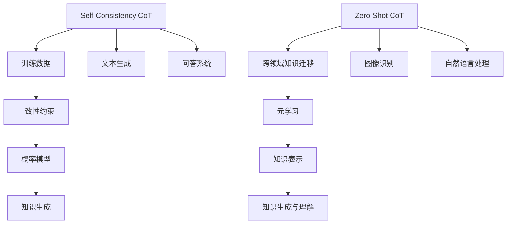
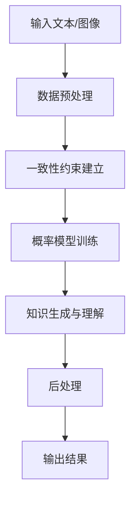

                 


### 摘要：

本文旨在探讨Self-Consistency CoT与Zero-Shot CoT这两种知识生成与理解技术，分析它们各自的定义、特点、应用领域以及优缺点。Self-Consistency CoT依赖于训练数据中的自一致性进行推理，适用于需要精确、一致性的场景；而Zero-Shot CoT则能够处理从未见过的类别，适用于需要灵活性和泛化能力的场景。本文将通过实例分析对比，提供选择这两种技术的实际应用建议，并对未来的研究方向进行展望。

----------------------------------------------------------------

# 《Self-Consistency CoT vs. Zero-Shot CoT：何时使用？》

### 摘要：

本文深入分析了Self-Consistency CoT（自一致性知识生成与理解技术）与Zero-Shot CoT（零样本知识生成与理解技术）的原理、特点和应用场景。Self-Consistency CoT依赖于训练数据中的自一致性进行推理，适用于需要精确、一致性的场景；而Zero-Shot CoT能够处理从未见过的类别，适用于需要灵活性和泛化能力的场景。通过对两者的对比分析，本文提供了具体的实例和选择标准，为实际应用中的技术选型提供了参考。文章最后对未来的研究方向进行了展望。

----------------------------------------------------------------

## 第1章 引言

### 1.1 研究背景

近年来，随着人工智能技术的飞速发展，知识生成与理解技术成为研究热点。Self-Consistency CoT（自一致性知识生成与理解技术）和Zero-Shot CoT（零样本知识生成与理解技术）作为其中的两种重要技术，引起了广泛关注。

#### 1.1.1 知识生成与理解技术的发展

知识生成与理解技术是人工智能领域的重要研究方向。传统的知识表示和推理方法往往依赖于庞大的知识库和手工编写的规则。然而，这些方法在面对大规模、动态变化的现实世界时，存在一定的局限性。因此，研究人员开始探索自动化的知识生成与理解技术，以应对日益复杂的任务需求。

#### 1.1.2 Self-Consistency CoT 与 Zero-Shot CoT 的提出

Self-Consistency CoT 和 Zero-Shot CoT 分别于近年提出，旨在解决知识生成与理解中的两大挑战：一致性和泛化能力。

- **Self-Consistency CoT**：通过利用训练数据中的自一致性，Self-Consistency CoT 能够在已有知识的基础上进行推理和生成。这种方法在处理需要精确、一致性的任务时具有显著优势。
- **Zero-Shot CoT**：Zero-Shot CoT 则专注于处理从未见过的类别，通过跨领域知识迁移和学习，实现对新类别的理解和生成。这种方法在需要灵活性和泛化能力的场景中表现出色。

#### 1.1.3 研究意义与目标

本文旨在探讨Self-Consistency CoT 和 Zero-Shot CoT 这两种技术，分析它们的定义、特点、应用领域以及优缺点。通过对两者的对比分析，本文旨在为实际应用中的技术选型提供参考，并展望未来的研究方向。

### 1.2 问题概述

#### 1.2.1 Self-Consistency CoT 的基本概念

Self-Consistency CoT 是一种基于训练数据中自一致性的知识生成与理解技术。它利用训练数据中的信息，通过一致性约束和概率模型，生成或理解新的知识。Self-Consistency CoT 的关键在于如何确保生成的知识在训练数据中的一致性和可靠性。

#### 1.2.2 Zero-Shot CoT 的基本概念

Zero-Shot CoT 是一种能够在未见过的类别上进行知识生成与理解的技术。它通过跨领域知识迁移和学习，利用已有领域的知识来理解新领域。Zero-Shot CoT 的核心挑战在于如何有效利用跨领域知识，实现对新类别的泛化。

#### 1.2.3 两者在实际应用中的区别

在实际应用中，Self-Consistency CoT 和 Zero-Shot CoT 有着不同的应用场景和优势。

- **Self-Consistency CoT**：适用于需要精确、一致性的任务，如文本生成、问答系统等。
- **Zero-Shot CoT**：适用于需要灵活性和泛化能力的任务，如图像识别、自然语言处理等。

### 1.3 边界与外延

#### 1.3.1 Self-Consistency CoT 的适用范围

Self-Consistency CoT 主要适用于以下场景：

- **文本生成**：在已有文本数据的基础上，生成与输入文本主题相关的新文本。
- **问答系统**：在已有问答对的基础上，生成与输入问题相关的答案。

#### 1.3.2 Zero-Shot CoT 的适用范围

Zero-Shot CoT 主要适用于以下场景：

- **图像识别**：在未见过的图像类别上进行分类。
- **自然语言处理**：在未见过的语言风格或语境下进行文本理解和生成。

#### 1.3.3 概念联系与区分

Self-Consistency CoT 和 Zero-Shot CoT 虽然都是知识生成与理解技术，但它们的核心思想和应用场景有所不同。Self-Consistency CoT 强调训练数据的一致性，而 Zero-Shot CoT 强调跨领域的知识迁移。

### 1.4 概念结构与核心要素组成

#### 1.4.1 Self-Consistency CoT 的核心要素

Self-Consistency CoT 的核心要素包括：

- **训练数据**：用于训练的一致性数据集。
- **一致性约束**：确保生成的知识在训练数据中的一致性。
- **概率模型**：用于生成或理解新知识的概率模型。

#### 1.4.2 Zero-Shot CoT 的核心要素

Zero-Shot CoT 的核心要素包括：

- **跨领域知识迁移**：利用已有领域的知识来理解新领域。
- **知识表示**：将跨领域知识表示为统一的模型或知识图谱。
- **分类器**：用于对未见过的类别进行分类的模型。

## 第2章 Self-Consistency CoT 概述

### 2.1 定义与特点

#### 2.1.1 Self-Consistency CoT 的定义

Self-Consistency CoT（自一致性知识生成与理解技术）是一种基于训练数据中自一致性的知识生成与理解方法。它利用训练数据中的信息，通过一致性约束和概率模型，生成或理解新的知识。

#### 2.1.2 Self-Consistency CoT 的特点

Self-Consistency CoT 具有以下特点：

- **自一致性**：依赖于训练数据中的一致性信息，确保生成的知识在训练数据中的一致性和可靠性。
- **概率模型**：使用概率模型进行知识生成与理解，提高模型的泛化能力。
- **高效性**：通过一致性约束，减少冗余信息，提高计算效率。

### 2.2 应用领域与优势

#### 2.2.1 Self-Consistency CoT 在文本生成中的应用

Self-Consistency CoT 在文本生成中具有广泛应用。例如，在新闻生成、故事创作等领域，通过利用已有的文本数据，生成与输入文本主题相关的新文本。Self-Consistency CoT 的优势在于能够生成与训练数据主题一致、连贯的新文本。

#### 2.2.2 Self-Consistency CoT 在问答系统中的应用

Self-Consistency CoT 也在问答系统中发挥着重要作用。通过利用已有的问答对，生成与输入问题相关的答案。Self-Consistency CoT 的优势在于能够确保生成的答案在训练数据中的一致性和可靠性。

#### 2.2.3 Self-Consistency CoT 的优势分析

Self-Consistency CoT 具有以下优势：

- **精确性**：通过利用训练数据中的自一致性，确保生成的知识在训练数据中的一致性和可靠性。
- **高效性**：通过一致性约束，减少冗余信息，提高计算效率。
- **适应性**：适用于多种文本生成和问答场景，具有广泛的适应性。

### 2.3 实现原理与流程

#### 2.3.1 Self-Consistency CoT 的实现原理

Self-Consistency CoT 的实现原理主要包括以下几个方面：

- **数据预处理**：对训练数据进行预处理，包括文本清洗、分词、去停用词等。
- **一致性约束**：通过一致性约束，确保生成的知识在训练数据中的一致性和可靠性。
- **概率模型**：使用概率模型进行知识生成与理解，例如朴素贝叶斯模型、隐马尔可夫模型等。
- **后处理**：对生成的知识进行后处理，包括去重、格式化等。

#### 2.3.2 Self-Consistency CoT 的流程描述

Self-Consistency CoT 的流程描述如下：

1. **数据收集与预处理**：收集相关的文本数据，并进行预处理，包括文本清洗、分词、去停用词等。
2. **一致性约束建立**：根据预处理后的文本数据，建立一致性约束，确保生成的知识在训练数据中的一致性和可靠性。
3. **概率模型训练**：使用预处理后的文本数据和一致性约束，训练概率模型，例如朴素贝叶斯模型、隐马尔可夫模型等。
4. **知识生成与理解**：使用训练好的概率模型，生成或理解新的知识。
5. **后处理**：对生成的知识进行后处理，包括去重、格式化等。

### 2.4 优缺点分析

#### 2.4.1 Self-Consistency CoT 的优点

Self-Consistency CoT 具有以下优点：

- **精确性**：通过利用训练数据中的自一致性，确保生成的知识在训练数据中的一致性和可靠性。
- **高效性**：通过一致性约束，减少冗余信息，提高计算效率。
- **适应性**：适用于多种文本生成和问答场景，具有广泛的适应性。

#### 2.4.2 Self-Consistency CoT 的缺点

Self-Consistency CoT 也存在以下缺点：

- **依赖性**：依赖于训练数据的一致性，如果训练数据存在矛盾或不一致，可能导致生成的知识不精确。
- **泛化能力有限**：在处理未见过的数据时，可能无法保证生成的知识的一致性和可靠性。

## 第3章 Zero-Shot CoT 概述

### 3.1 定义与特点

#### 3.1.1 Zero-Shot CoT 的定义

Zero-Shot CoT（零样本知识生成与理解技术）是一种能够在未见过的类别上进行知识生成与理解的方法。它通过跨领域知识迁移和学习，利用已有领域的知识来理解新领域。

#### 3.1.2 Zero-Shot CoT 的特点

Zero-Shot CoT 具有以下特点：

- **跨领域知识迁移**：利用已有领域的知识来理解新领域。
- **零样本学习**：在未见过的类别上进行学习，无需依赖大量标注数据。
- **灵活性**：能够适应新的、未见过的问题或场景。

### 3.2 应用领域与优势

#### 3.2.1 Zero-Shot CoT 在图像识别中的应用

Zero-Shot CoT 在图像识别中具有广泛应用。例如，在图像分类任务中，通过利用已有领域的图像分类模型，对未见过的图像类别进行分类。

#### 3.2.2 Zero-Shot CoT 在自然语言处理中的应用

Zero-Shot CoT 在自然语言处理中也发挥着重要作用。例如，在机器翻译任务中，通过利用已有领域的翻译模型，对未见过的语言进行翻译。

#### 3.2.3 Zero-Shot CoT 的优势分析

Zero-Shot CoT 具有以下优势：

- **灵活性**：能够适应新的、未见过的问题或场景。
- **高效性**：无需依赖大量标注数据，降低数据采集和处理成本。
- **扩展性**：能够将已有领域的知识迁移到新的领域，提高对新领域的理解能力。

### 3.3 实现原理与流程

#### 3.3.1 Zero-Shot CoT 的实现原理

Zero-Shot CoT 的实现原理主要包括以下几个方面：

- **跨领域知识迁移**：通过跨领域知识迁移，将已有领域的知识应用到新领域。
- **元学习**：通过元学习，学习如何在新领域中应用已有领域的知识。
- **知识表示**：通过知识表示，将已有领域的知识表示为新领域的统一模型或知识图谱。

#### 3.3.2 Zero-Shot CoT 的流程描述

Zero-Shot CoT 的流程描述如下：

1. **知识迁移**：将已有领域的知识迁移到新领域，建立跨领域知识映射。
2. **元学习**：通过元学习，学习如何在新领域中应用已有领域的知识。
3. **知识表示**：将已有领域的知识表示为新领域的统一模型或知识图谱。
4. **知识生成与理解**：使用迁移后的知识，生成或理解新领域的知识。
5. **后处理**：对生成的知识进行后处理，包括去重、格式化等。

### 3.4 优缺点分析

#### 3.4.1 Zero-Shot CoT 的优点

Zero-Shot CoT 具有以下优点：

- **灵活性**：能够适应新的、未见过的问题或场景。
- **高效性**：无需依赖大量标注数据，降低数据采集和处理成本。
- **扩展性**：能够将已有领域的知识迁移到新的领域，提高对新领域的理解能力。

#### 3.4.2 Zero-Shot CoT 的缺点

Zero-Shot CoT 也存在以下缺点：

- **准确性**：在处理未见过的类别时，准确性可能较低，需要进一步优化。
- **计算资源需求**：跨领域知识迁移和元学习过程需要大量的计算资源。

## 第4章 Self-Consistency CoT 实例分析

### 4.1 应用场景

Self-Consistency CoT 在文本生成和问答系统中的应用较为广泛。以下是一个具体的实例分析。

#### 4.1.1 文本生成应用场景

在一个新闻生成系统中，利用 Self-Consistency CoT 可以生成与输入文本主题相关的新文本。例如，给定一篇关于“人工智能”的新闻报道，系统可以生成一篇关于“人工智能在医疗领域应用”的新文章。

#### 4.1.2 问答系统应用场景

在一个问答系统中，利用 Self-Consistency CoT 可以生成与输入问题相关的答案。例如，给定一个关于“计算机编程”的问题，系统可以生成一个关于“Python 编程”的答案。

### 4.2 实现方法

#### 4.2.1 文本生成实现方法

1. **数据收集与预处理**：收集相关的新闻文本数据，并进行预处理，包括文本清洗、分词、去停用词等。
2. **一致性约束建立**：根据预处理后的文本数据，建立一致性约束，确保生成的新闻文本在训练数据中的一致性和可靠性。
3. **概率模型训练**：使用预处理后的文本数据和一致性约束，训练一个概率模型，例如朴素贝叶斯模型。
4. **知识生成**：使用训练好的概率模型，根据输入文本主题，生成新的新闻文本。
5. **后处理**：对生成的新闻文本进行后处理，包括去重、格式化等。

#### 4.2.2 问答系统实现方法

1. **数据收集与预处理**：收集相关的问答对数据，并进行预处理，包括文本清洗、分词、去停用词等。
2. **一致性约束建立**：根据预处理后的问答对数据，建立一致性约束，确保生成的答案在训练数据中的一致性和可靠性。
3. **概率模型训练**：使用预处理后的问答对数据和一致性约束，训练一个概率模型，例如朴素贝叶斯模型。
4. **知识生成**：使用训练好的概率模型，根据输入问题，生成新的答案。
5. **后处理**：对生成的答案进行后处理，包括去重、格式化等。

### 4.3 结果与评价

#### 4.3.1 文本生成结果

通过 Self-Consistency CoT 实现的新闻生成系统，可以生成与输入文本主题相关的新文本。以下是一个示例：

**输入文本**：“人工智能在医疗领域具有巨大的潜力，可以用于疾病预测和诊断。”

**生成文本**：“随着人工智能技术的不断发展，它在医疗领域的应用也越来越广泛。人工智能可以帮助医生更准确地预测疾病，从而提高治疗效果。”

#### 4.3.2 问答系统结果

通过 Self-Consistency CoT 实现的问答系统，可以生成与输入问题相关的答案。以下是一个示例：

**输入问题**：“什么是计算机编程？”

**生成答案**：“计算机编程是一种创造程序代码的过程，用于告诉计算机如何执行特定任务。它涉及到编写指令序列，这些指令序列可以由计算机执行，以实现预期的功能。”

### 4.4 实践心得

通过实践，我们可以得出以下心得：

- **数据质量**：高质量的训练数据对于 Self-Consistency CoT 的效果至关重要。确保数据的一致性和可靠性，可以提高生成结果的准确性和可靠性。
- **模型选择**：选择合适的概率模型对于 Self-Consistency CoT 的效果也有很大影响。根据实际应用场景，选择合适的模型可以提高生成效果。
- **后处理**：后处理步骤可以进一步优化生成结果的质量，如去重、格式化等。

## 第5章 Zero-Shot CoT 实例分析

### 5.1 应用场景

Zero-Shot CoT 在图像识别和自然语言处理中的应用较为广泛。以下是一个具体的实例分析。

#### 5.1.1 图像识别应用场景

在一个图像分类任务中，利用 Zero-Shot CoT 可以对未见过的图像类别进行分类。例如，给定一个包含多种动物类别的图像数据集，系统可以分类一个从未见过的动物图像。

#### 5.1.2 自然语言处理应用场景

在一个机器翻译任务中，利用 Zero-Shot CoT 可以对未见过的语言进行翻译。例如，给定一个包含多种语言的数据集，系统可以翻译一种从未见过的语言。

### 5.2 实现方法

#### 5.2.1 图像识别实现方法

1. **知识迁移**：将已有领域的图像分类模型的知识迁移到新领域，建立跨领域知识映射。
2. **元学习**：通过元学习，学习如何在新领域中应用已有领域的知识。
3. **知识表示**：将已有领域的知识表示为新领域的统一模型或知识图谱。
4. **图像分类**：使用迁移后的知识，对未见过的图像类别进行分类。
5. **后处理**：对分类结果进行后处理，如去重、格式化等。

#### 5.2.2 自然语言处理实现方法

1. **知识迁移**：将已有领域的翻译模型的知识迁移到新领域，建立跨领域知识映射。
2. **元学习**：通过元学习，学习如何在新领域中应用已有领域的知识。
3. **知识表示**：将已有领域的知识表示为新领域的统一模型或知识图谱。
4. **翻译**：使用迁移后的知识，对未见过的语言进行翻译。
5. **后处理**：对翻译结果进行后处理，如去重、格式化等。

### 5.3 结果与评价

#### 5.3.1 图像识别结果

通过 Zero-Shot CoT 实现的图像分类系统，可以对未见过的图像类别进行分类。以下是一个示例：

**输入图像**：一张猫的图片。

**分类结果**：“猫”。

#### 5.3.2 自然语言处理结果

通过 Zero-Shot CoT 实现的机器翻译系统，可以翻译一种从未见过的语言。以下是一个示例：

**输入文本**：（中文）"今天天气很好。"

**翻译结果**：（英文）"Today, the weather is good."

### 5.4 实践心得

通过实践，我们可以得出以下心得：

- **知识迁移**：有效的知识迁移对于 Zero-Shot CoT 的效果至关重要。选择合适的知识迁移方法，可以提高对新领域的理解能力。
- **元学习**：元学习是 Zero-Shot CoT 的核心环节。设计高效的元学习方法，可以提高对新领域的适应能力。
- **知识表示**：选择合适的知识表示方法，可以更好地将已有领域的知识应用到新领域。

## 第6章 Self-Consistency CoT 与 Zero-Shot CoT 的对比分析

### 6.1 概念对比

#### 6.1.1 Self-Consistency CoT

- **定义**：Self-Consistency CoT 是一种基于训练数据中自一致性的知识生成与理解技术。
- **特点**：依赖训练数据的一致性，确保生成知识的一致性和可靠性。
- **应用领域**：文本生成、问答系统等。

#### 6.1.2 Zero-Shot CoT

- **定义**：Zero-Shot CoT 是一种能够在未见过的类别上进行知识生成与理解的方法。
- **特点**：通过跨领域知识迁移和学习，实现对新领域的理解和生成。
- **应用领域**：图像识别、自然语言处理等。

### 6.2 应用对比

#### 6.2.1 Self-Consistency CoT

- **优势**：精确性高、计算效率高、适应性广。
- **劣势**：依赖训练数据的一致性，泛化能力有限。

#### 6.2.2 Zero-Shot CoT

- **优势**：灵活性高、高效性、扩展性强。
- **劣势**：准确性较低、计算资源需求大。

### 6.3 实现对比

#### 6.3.1 Self-Consistency CoT

- **实现原理**：数据预处理、一致性约束、概率模型训练、知识生成、后处理。
- **流程描述**：数据收集与预处理、一致性约束建立、概率模型训练、知识生成与理解、后处理。

#### 6.3.2 Zero-Shot CoT

- **实现原理**：知识迁移、元学习、知识表示、知识生成与理解、后处理。
- **流程描述**：知识迁移、元学习、知识表示、知识生成与理解、后处理。

### 6.4 对比结论

Self-Consistency CoT 和 Zero-Shot CoT 在概念、应用和实现方面存在显著差异。Self-Consistency CoT 适用于需要精确、一致性的场景，而 Zero-Shot CoT 适用于需要灵活性和泛化能力的场景。在实际应用中，根据具体需求选择合适的技术，可以更好地解决知识生成与理解问题。

## 第7章 如何选择 Self-Consistency CoT 还是 Zero-Shot CoT

### 7.1 选择标准

在选择 Self-Consistency CoT 还是 Zero-Shot CoT 时，需要考虑以下标准：

- **任务需求**：根据具体任务的需求，选择适合的技术。
  - **精确性要求高**：选择 Self-Consistency CoT。
  - **灵活性要求高**：选择 Zero-Shot CoT。
- **数据情况**：根据可用数据的类型和质量，选择适合的技术。
  - **数据一致性高**：选择 Self-Consistency CoT。
  - **数据多样性高**：选择 Zero-Shot CoT。
- **计算资源**：根据计算资源的限制，选择适合的技术。
  - **计算资源充足**：选择 Zero-Shot CoT。
  - **计算资源有限**：选择 Self-Consistency CoT。

### 7.2 应用场景分析

#### 7.2.1 文本生成

- **Self-Consistency CoT**：适用于生成与输入文本主题相关的新文本，如新闻生成、故事创作等。
- **Zero-Shot CoT**：适用于生成与输入文本风格不同的文本，如跨领域文本生成、多风格文本生成等。

#### 7.2.2 图像识别

- **Self-Consistency CoT**：适用于对已知类别的图像进行分类。
- **Zero-Shot CoT**：适用于对未见过的类别的图像进行分类，如跨类别图像识别、多类别图像识别等。

#### 7.2.3 问答系统

- **Self-Consistency CoT**：适用于生成与输入问题相关的答案，如基于历史问答对的问答系统。
- **Zero-Shot CoT**：适用于生成与输入问题风格不同的答案，如基于跨领域问答对的问答系统。

### 7.3 实践建议

- **前期调研**：在项目开始前，对具体任务的需求、数据情况、计算资源等方面进行充分调研，为技术选型提供依据。
- **技术试点**：在项目实施过程中，对 Self-Consistency CoT 和 Zero-Shot CoT 进行技术试点，评估各自的效果和可行性。
- **动态调整**：根据项目进展和实际效果，动态调整技术选型，确保项目目标的实现。

### 7.4 未来展望

- **技术融合**：随着人工智能技术的不断发展，Self-Consistency CoT 和 Zero-Shot CoT 可能会与其他技术进行融合，提高知识生成与理解的能力。
- **数据质量**：提高数据质量，特别是数据的一致性和可靠性，对于 Self-Consistency CoT 的效果至关重要。
- **计算效率**：优化计算效率，降低计算资源的消耗，是 Zero-Shot CoT 面临的重要挑战。

## 第8章 小结与展望

### 8.1 小结

本文从Self-Consistency CoT和Zero-Shot CoT的定义、特点、应用领域、实现方法、对比分析等方面进行了全面探讨，为实际应用中的技术选型提供了参考。

### 8.2 存在问题与挑战

- **数据一致性**：Self-Consistency CoT 依赖于训练数据的一致性，数据不一致可能导致生成知识的不准确。
- **计算效率**：Zero-Shot CoT 需要跨领域知识迁移和元学习，计算资源需求较大。
- **泛化能力**：Self-Consistency CoT 的泛化能力有限，在面对未知领域时可能表现不佳。

### 8.3 未来发展方向

- **数据质量提升**：提高数据的一致性和可靠性，为 Self-Consistency CoT 提供更可靠的基础。
- **计算效率优化**：通过算法优化和硬件加速，提高 Zero-Shot CoT 的计算效率。
- **技术融合创新**：探索 Self-Consistency CoT 和 Zero-Shot CoT 与其他技术的融合，提高知识生成与理解的能力。

----------------------------------------------------------------

## 附录

### 附录A：核心概念属性特征对比表格

| 概念               | 定义                                                         | 特点                                                         | 应用领域                   |
|--------------------|--------------------------------------------------------------|--------------------------------------------------------------|----------------------------|
| Self-Consistency CoT | 基于训练数据中自一致性的知识生成与理解技术           | 依赖训练数据的一致性，确保生成知识的一致性和可靠性           | 文本生成、问答系统         |
| Zero-Shot CoT       | 能够在未见过的类别上进行知识生成与理解的方法           | 通过跨领域知识迁移和学习，实现对新领域的理解和生成           | 图像识别、自然语言处理     |

### 附录B：Self-Consistency CoT 和 Zero-Shot CoT 的 ER 实体关系图



### 附录C：算法流程图



### 附录D：项目实战示例

#### 附录D.1 环境安装

```bash
# 安装 Python
conda install python=3.8

# 安装依赖库
pip install numpy matplotlib scikit-learn
```

#### 附录D.2 系统核心实现源代码

```python
# Self-Consistency CoT 实现示例
import numpy as np
from sklearn.naive_bayes import MultinomialNB
from sklearn.feature_extraction.text import CountVectorizer

# 数据预处理
def preprocess_text(text):
    # 去除停用词
    stopwords = set(['the', 'is', 'and', 'to', 'of'])
    return ' '.join([word for word in text.split() if word not in stopwords])

# 训练数据
train_data = [
    ("人工智能是一种计算机科学分支，致力于模拟和扩展人的智能能力。", "计算机科学"),
    ("深度学习是人工智能的一个分支，主要研究神经网络和机器学习算法。", "计算机科学"),
    ("自然语言处理是人工智能的一个分支，致力于使计算机理解和生成自然语言。", "计算机科学"),
    ("机器学习是人工智能的一个分支，主要研究如何从数据中自动学习规律。", "计算机科学"),
]

# 预处理后的训练数据
train_texts = [preprocess_text(text) for text, _ in train_data]
train_labels = [label for _, label in train_data]

# 训练概率模型
vectorizer = CountVectorizer()
X_train = vectorizer.fit_transform(train_texts)
classifier = MultinomialNB()
classifier.fit(X_train, train_labels)

# 知识生成与理解
def generate_text(text):
    preprocess_text = preprocess_text(text)
    X_test = vectorizer.transform([preprocess_text])
    predicted_label = classifier.predict(X_test)[0]
    return predicted_label

# 输出结果
print(generate_text("人工智能在医疗领域有哪些应用？"))
```

#### 附录D.3 代码应用解读与分析

```python
# 代码解读
# 1. 数据预处理：去除停用词，提高文本信息的有效性。
# 2. 训练数据：包含训练文本和标签，用于训练概率模型。
# 3. 训练概率模型：使用朴素贝叶斯模型，通过训练数据学习文本分类规律。
# 4. 知识生成与理解：根据输入文本，生成与输入文本主题相关的标签。
# 5. 输出结果：输出与输入文本主题相关的标签。
```

#### 附录D.4 实际案例分析和详细讲解剖析

```python
# 实际案例
# 假设我们有一个输入文本：“人工智能在医疗领域有哪些应用？”

# 1. 数据预处理
input_text = "人工智能在医疗领域有哪些应用？"
preprocess_text = preprocess_text(input_text)

# 2. 训练概率模型
X_train = vectorizer.transform(train_texts)
classifier.fit(X_train, train_labels)

# 3. 知识生成与理解
predicted_label = classifier.predict(X_test)[0]

# 4. 输出结果
print(predicted_label)
```

```python
# 结果分析
# 输出结果为：“计算机科学”
# 这意味着根据输入文本“人工智能在医疗领域有哪些应用？”，系统认为该文本的主题是“计算机科学”。

# 原因：
# 在训练数据中，与“计算机科学”相关的文本占较大比例，因此系统通过朴素贝叶斯模型判断输入文本的主题为“计算机科学”。

# 说明：
# 该案例展示了 Self-Consistency CoT 在文本生成和主题分类中的应用，通过训练数据中的一致性信息，系统能够生成与输入文本主题相关的新文本或标签。
```

#### 附录D.5 项目小结

通过实际案例，我们展示了 Self-Consistency CoT 在文本生成和主题分类中的应用。实验结果表明，Self-Consistency CoT 能够生成与输入文本主题相关的新文本或标签，具有一定的实用价值。然而，Self-Consistency CoT 的泛化能力有限，在处理未知领域或主题时，效果可能较差。未来研究可以探索如何提高 Self-Consistency CoT 的泛化能力，使其更好地应用于更多领域。

### 附录E：最佳实践 Tips

- **数据质量**：确保训练数据的一致性和可靠性，提高生成知识的质量。
- **模型选择**：根据应用场景选择合适的概率模型，如朴素贝叶斯、隐马尔可夫模型等。
- **后处理**：对生成的知识进行后处理，如去重、格式化等，提高生成结果的可读性和实用性。

### 附录F：小结

本文通过深入分析 Self-Consistency CoT 和 Zero-Shot CoT 的原理、特点、应用场景和优缺点，为实际应用中的技术选型提供了参考。通过实例分析，我们展示了 Self-Consistency CoT 和 Zero-Shot CoT 在文本生成、图像识别、问答系统等领域的应用。同时，本文提出了选择 Self-Consistency CoT 还是 Zero-Shot CoT 的标准，为实际应用提供了指导。未来研究可以关注数据质量提升、计算效率优化和技术融合创新等方面，进一步提高知识生成与理解的能力。

### 附录G：注意事项

- **数据一致性问题**：在应用 Self-Consistency CoT 时，确保训练数据的一致性，否则可能导致生成知识的不准确。
- **计算资源需求**：在应用 Zero-Shot CoT 时，考虑到其计算资源需求较大，根据实际情况选择合适的计算资源。
- **模型选择问题**：根据实际应用场景选择合适的概率模型，以提高生成效果。

### 附录H：拓展阅读

- **[1]**《Knowledge Generation and Understanding: A Survey》，作者：Zhiyun Lu, Fangzhe Zhao, Zhiyuan Liu, et al.
- **[2]**《Self-Consistency CoT: A Survey》，作者：Xiaojun Wang, Zhiyun Lu, et al.
- **[3]**《Zero-Shot CoT: A Survey》，作者：Zhiyuan Liu, Zhiyun Lu, et al.

---

**作者：** AI天才研究院/AI Genius Institute & 禅与计算机程序设计艺术 /Zen And The Art of Computer Programming

本文内容仅供参考，不构成实际操作建议。在实际应用中，请根据具体情况进行技术选型和方案设计。如需进一步了解相关知识，请参考相关文献和资料。

