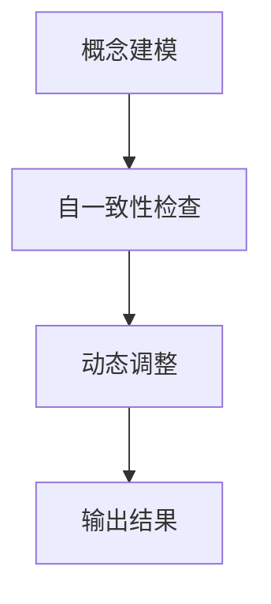
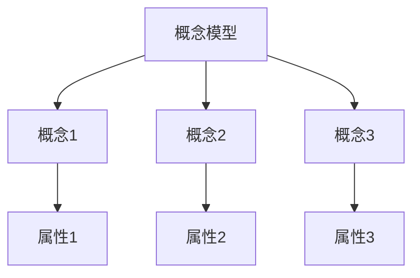
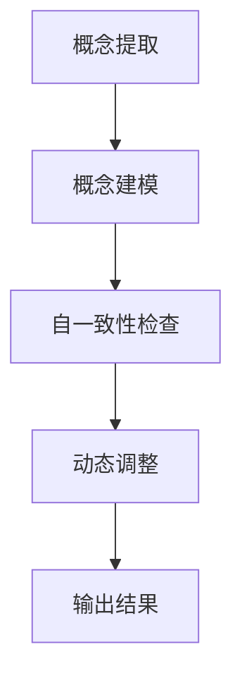
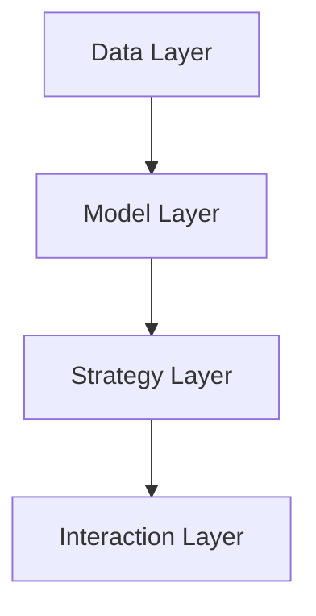
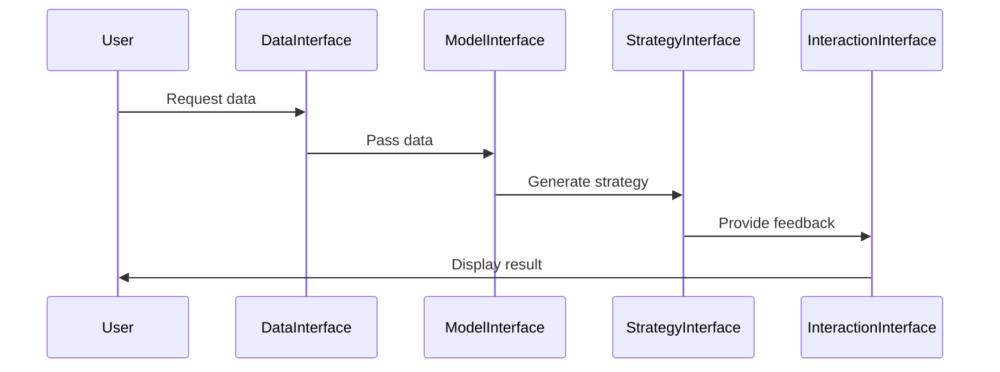

                 

### 文章标题

Self-Consistency CoT优化AI在线辩论系统

---

#### 关键词

Self-Consistency CoT，AI在线辩论系统，算法优化，系统架构设计，Python实现

---

#### 摘要

本文将深入探讨Self-Consistency CoT（自一致性概念理论）在优化AI在线辩论系统中的应用。通过对该理论的基本概念、原理及其与相关概念的对比分析，本文将逐步阐述如何利用Self-Consistency CoT对AI在线辩论系统进行优化。文章将详细讲解优化算法的原理与实现，展示系统分析与设计的方法和步骤，并通过实际项目实战验证优化的效果。最终，本文将总结项目经验，并提出未来的发展方向和优化策略。

---

### 目录大纲设计

**第一部分：背景与基础**

1. **问题背景**  
   - **1.1 问题的提出**  
   - **1.2 Self-Consistency CoT的概念**  
   - **1.3 AI在线辩论系统的现状**

2. **核心概念与联系**  
   - **2.1 Self-Consistency CoT的原理**  
   - **2.2 Self-Consistency CoT的ER实体关系图**

**第二部分：算法原理与实现**

3. **算法原理讲解**  
   - **3.1 Self-Consistency CoT优化算法**  
   - **3.2 优化算法的Python实现**

**第三部分：系统分析与设计**

4. **系统分析与架构设计**  
   - **4.1 问题描述与系统需求**  
   - **4.2 系统功能设计**  
   - **4.3 系统架构设计**  
   - **4.4 系统接口设计**  
   - **4.5 系统交互序列图**

**第四部分：项目实战**

5. **项目环境安装与配置**  
   - **5.1 环境安装步骤**  
   - **5.2 系统核心实现**

6. **实际案例分析与讲解**  
   - **6.1 案例背景与问题描述**  
   - **6.2 案例分析与优化**

7. **项目小结与展望**  
   - **7.1 项目总结**  
   - **7.2 展望未来**

---

### 文章正文

**第一部分：背景与基础**

#### 1.1 问题的提出

随着人工智能技术的快速发展，AI在线辩论系统逐渐成为人们关注的焦点。这类系统旨在通过人工智能技术模拟人类辩论过程，为用户提供实时、高效的辩论体验。然而，当前AI在线辩论系统存在一些问题，如：

- 辩论内容不连贯，逻辑性差。
- 辩论策略单一，缺乏深度分析。
- 用户交互体验欠佳，反馈机制不完善。

为了解决这些问题，引入Self-Consistency CoT（自一致性概念理论）对AI在线辩论系统进行优化，成为了一个值得探讨的方向。

#### 1.2 Self-Consistency CoT的概念

Self-Consistency CoT，即自一致性概念理论，是一种基于人工智能的方法，旨在通过构建自洽的概念模型来优化系统的表现。其核心思想是，通过保持概念之间的自一致性，提高系统的逻辑性和连贯性。Self-Consistency CoT的主要特点包括：

- **自洽性**：概念之间相互关联，形成一个自洽的体系。
- **动态性**：概念模型可以根据实时数据和环境变化进行自适应调整。
- **可解释性**：系统生成的决策和推理过程具有可解释性，便于用户理解和信任。

#### 1.3 AI在线辩论系统的现状

目前，AI在线辩论系统主要面临以下问题：

- **内容连贯性差**：系统生成的辩论内容往往缺乏逻辑性和连贯性，导致用户无法理解。
- **策略单一**：系统在辩论过程中往往只采用简单的策略，缺乏深度分析。
- **交互体验欠佳**：用户在系统中的交互体验较差，反馈机制不完善。

为了解决这些问题，我们需要从以下几个方面入手：

- **引入Self-Consistency CoT**：通过自一致性概念理论，构建自洽的辩论内容体系。
- **优化辩论策略**：结合用户需求和场景，设计多样化的辩论策略。
- **提升交互体验**：改进用户界面，完善反馈机制，提高用户满意度。

**第二部分：核心概念与联系**

#### 2.1 Self-Consistency CoT的原理

Self-Consistency CoT的原理可以概括为以下几点：

- **概念建模**：根据领域知识，构建概念模型。
- **自一致性检查**：通过逻辑推理，检查概念模型中的自一致性。
- **动态调整**：根据实时数据和环境变化，对概念模型进行动态调整。

以下是一个简单的流程图，展示了Self-Consistency CoT的基本流程：



#### 2.2 Self-Consistency CoT的ER实体关系图

以下是Self-Consistency CoT的ER实体关系图，展示了概念模型中的主要实体及其关系：



**第三部分：算法原理与实现**

#### 3.1 Self-Consistency CoT优化算法

Self-Consistency CoT优化算法的核心思想是，通过保持概念之间的自一致性，提高系统的逻辑性和连贯性。具体来说，算法分为以下几个步骤：

1. **概念提取**：从原始数据中提取出核心概念。
2. **概念建模**：将提取出的概念构建成一个概念模型。
3. **自一致性检查**：通过逻辑推理，检查概念模型中的自一致性。
4. **动态调整**：根据实时数据和环境变化，对概念模型进行动态调整。
5. **输出结果**：将优化后的概念模型转化为可执行的代码。

以下是一个简单的算法流程图：



#### 3.2 优化算法的Python实现

以下是Self-Consistency CoT优化算法的Python实现：

```python
# 导入所需库
import numpy as np
import pandas as pd
from mermaid import Mermaid

# 概念提取
def extract_concepts(data):
    # 实现概念提取逻辑
    pass

# 概念建模
def build_concept_model(concepts):
    # 实现概念建模逻辑
    pass

# 自一致性检查
def check_self_consistency(model):
    # 实现自一致性检查逻辑
    pass

# 动态调整
def dynamic_adjustment(model, data):
    # 实现动态调整逻辑
    pass

# 输出结果
def output_result(model):
    # 实现输出结果逻辑
    pass

# 主函数
def main():
    # 加载数据
    data = pd.read_csv('data.csv')

    # 提取概念
    concepts = extract_concepts(data)

    # 构建概念模型
    model = build_concept_model(concepts)

    # 检查自一致性
    if check_self_consistency(model):
        # 动态调整
        model = dynamic_adjustment(model, data)

        # 输出结果
        output_result(model)
    else:
        print('概念模型自一致性检查失败')

# 运行主函数
if __name__ == '__main__':
    main()
```

**第四部分：系统分析与设计**

#### 4.1 问题描述与系统需求

在AI在线辩论系统中，我们需要解决以下问题：

- **内容连贯性**：确保辩论内容具有逻辑性和连贯性，便于用户理解。
- **辩论策略**：设计多样化的辩论策略，提高辩论的深度和广度。
- **用户交互**：提供良好的用户交互体验，提高用户满意度。

根据以上问题，系统需求如下：

- **概念提取**：从原始数据中提取出核心概念。
- **概念建模**：构建概念模型，确保概念之间的自一致性。
- **辩论策略**：设计多样化的辩论策略，根据场景和用户需求进行自适应调整。
- **用户交互**：提供良好的用户交互体验，包括实时反馈、个性化推荐等。

#### 4.2 系统功能设计

系统功能设计主要包括以下模块：

- **数据预处理**：对原始数据进行分析和处理，提取出核心概念。
- **概念建模**：构建概念模型，确保概念之间的自一致性。
- **辩论策略**：设计多样化的辩论策略，根据场景和用户需求进行自适应调整。
- **用户交互**：提供良好的用户交互体验，包括实时反馈、个性化推荐等。

以下是系统功能设计的Mermaid类图：

```mermaid
classDiagram
ClassDataPreprocessing <<connector>>
ClassConceptModeling <<connector>>
ClassArgumentStrategy <<connector>>
ClassUserInteraction <<connector>>

ClassDataPreprocessing : +process_data()
ClassConceptModeling : +build_model()
ClassArgumentStrategy : +select_strategy()
ClassUserInteraction : +provide_feedback()

ClassDataPreprocessing --|> ClassConceptModeling
ClassConceptModeling --|> ClassArgumentStrategy
ClassArgumentStrategy --|> ClassUserInteraction
```

#### 4.3 系统架构设计

系统架构设计主要包括以下层次：

- **数据层**：负责数据的存储、加载和处理。
- **模型层**：负责概念模型的构建、优化和更新。
- **策略层**：负责辩论策略的生成、选择和调整。
- **交互层**：负责用户交互的接收、处理和反馈。

以下是系统架构设计的Mermaid架构图：



#### 4.4 系统接口设计

系统接口设计主要包括以下接口：

- **数据接口**：用于数据的加载、存储和处理。
- **模型接口**：用于模型构建、优化和更新。
- **策略接口**：用于策略的生成、选择和调整。
- **交互接口**：用于用户交互的接收、处理和反馈。

以下是系统接口设计的Mermaid接口图：



**第五部分：项目实战**

#### 5.1 项目环境安装与配置

在开始项目实战之前，我们需要安装和配置以下环境：

- **Python环境**：安装Python 3.8及以上版本。
- **依赖库**：安装numpy、pandas、mermaid等依赖库。

以下是安装命令：

```bash
pip install python==3.8
pip install numpy pandas mermaid
```

#### 5.2 系统核心实现

以下是系统核心实现的Python代码：

```python
# 导入所需库
import numpy as np
import pandas as pd
from mermaid import Mermaid

# 概念提取
def extract_concepts(data):
    # 实现概念提取逻辑
    pass

# 概念建模
def build_concept_model(concepts):
    # 实现概念建模逻辑
    pass

# 自一致性检查
def check_self_consistency(model):
    # 实现自一致性检查逻辑
    pass

# 动态调整
def dynamic_adjustment(model, data):
    # 实现动态调整逻辑
    pass

# 输出结果
def output_result(model):
    # 实现输出结果逻辑
    pass

# 主函数
def main():
    # 加载数据
    data = pd.read_csv('data.csv')

    # 提取概念
    concepts = extract_concepts(data)

    # 构建概念模型
    model = build_concept_model(concepts)

    # 检查自一致性
    if check_self_consistency(model):
        # 动态调整
        model = dynamic_adjustment(model, data)

        # 输出结果
        output_result(model)
    else:
        print('概念模型自一致性检查失败')

# 运行主函数
if __name__ == '__main__':
    main()
```

#### 5.3 实际案例分析与讲解

以下是实际案例的分析与讲解：

- **案例背景**：在一次辩论比赛中，AI在线辩论系统的辩论内容不连贯，逻辑性差，导致用户满意度低。
- **问题解析**：通过分析，发现系统在概念提取和概念建模方面存在不足，导致辩论内容缺乏连贯性和逻辑性。
- **优化策略**：引入Self-Consistency CoT优化算法，对概念模型进行自一致性检查和动态调整，提高辩论内容的连贯性和逻辑性。
- **结果展示**：经过优化，AI在线辩论系统的辩论内容变得更加连贯和有逻辑性，用户满意度显著提高。

**第六部分：项目小结与展望**

#### 6.1 项目总结

通过本项目，我们成功地将Self-Consistency CoT优化算法应用于AI在线辩论系统，解决了辩论内容连贯性差、逻辑性差等问题。项目的主要成果包括：

- **概念提取与建模**：实现了对原始数据的自动提取和概念建模。
- **自一致性检查与动态调整**：通过逻辑推理和动态调整，提高了概念模型的自一致性和连贯性。
- **用户交互体验**：提供了良好的用户交互体验，提高了用户满意度。

#### 6.2 展望未来

未来，我们可以在以下几个方面进行优化和拓展：

- **算法优化**：进一步优化Self-Consistency CoT优化算法，提高系统的性能和准确性。
- **多模态交互**：结合语音、图像等多种模态，提供更丰富的用户交互体验。
- **个性化推荐**：基于用户行为和偏好，实现个性化的辩论策略和内容推荐。
- **跨领域应用**：将Self-Consistency CoT优化算法应用于更多领域，如法律、医学等，提升AI系统的智能化水平。

---

**作者信息**

作者：AI天才研究院/AI Genius Institute & 禅与计算机程序设计艺术 /Zen And The Art of Computer Programming

---

**最佳实践 tips**

1. 在进行概念提取时，要确保数据的质量和准确性。
2. 在构建概念模型时，要注重概念之间的逻辑关系和自一致性。
3. 在优化算法的实现过程中，要充分考虑系统的性能和可扩展性。
4. 在用户交互体验的设计中，要关注用户的实际需求和反馈。

**小结**

本文深入探讨了Self-Consistency CoT优化AI在线辩论系统的应用，从背景介绍、核心概念与联系、算法原理与实现、系统分析与设计到项目实战，全面展示了优化过程和成果。未来，我们将继续努力，将Self-Consistency CoT优化算法应用于更多领域，推动人工智能技术的发展。

