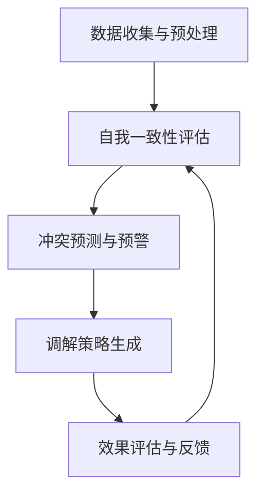
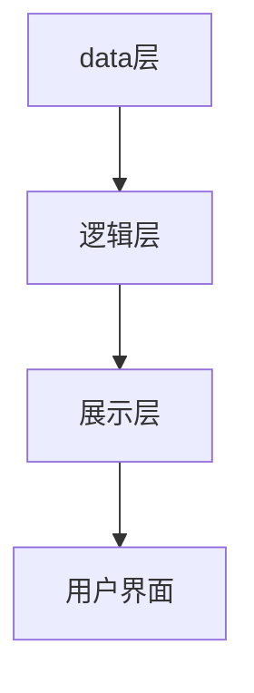
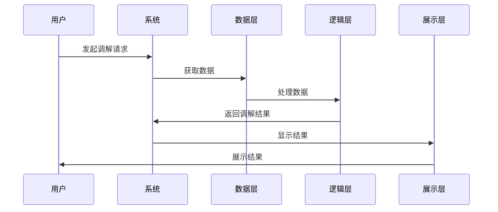

                 

## Self-Consistency CoT优化AI跨宇宙文明冲突调解系统

### 关键词

- Self-Consistency CoT
- 跨宇宙文明冲突调解
- 人工智能
- 数学模型
- 系统架构设计

### 摘要

本文探讨了Self-Consistency CoT（自我一致性核心理论）在优化AI跨宇宙文明冲突调解系统中的应用。首先，通过背景介绍，我们明确了当前跨宇宙文明冲突调解面临的挑战。接着，我们详细阐述了Self-Consistency CoT的核心概念、原理及其与其他相关概念的对比。随后，通过算法原理讲解，我们介绍了如何使用mermaid流程图和Python源代码实现该算法。在数学模型和公式部分，我们详细讲解了相关的数学模型，并通过实际案例进行了举例说明。系统分析与架构设计方案部分，我们介绍了项目背景、系统功能设计、架构设计、接口设计和系统交互。最后，在项目实战和最佳实践tips部分，我们提供了环境安装、系统核心实现源代码分析、实际案例分析以及未来展望。

## 第一部分：背景介绍

### 第1章：问题背景

#### 1.1.1 问题概述

随着人类对宇宙的探索不断深入，跨宇宙文明之间的接触和交流已不再是遥远的梦想。然而，这种接触也带来了新的挑战，特别是在文明冲突调解方面。在跨宇宙的背景下，文明之间的差异更为显著，语言、文化、价值观、科技水平等方面的巨大差异使得传统的调解方法难以奏效。AI技术的崛起为我们提供了一种可能的解决方案，通过建立自我一致性核心理论（Self-Consistency Core Theory, CoT），我们可以尝试优化AI在跨宇宙文明冲突调解中的作用。

#### 1.1.2 问题描述

跨宇宙文明冲突调解的关键挑战在于如何处理文化差异和价值观冲突。不同文明可能拥有不同的道德准则、社会结构、资源分配观念，这些差异可能导致冲突的激化。此外，由于信息的不对称性和误解，冲突的调解过程往往充满不确定性。如何在有限的信息下，通过AI技术实现冲突的有效调解，是当前亟待解决的重要问题。

#### 1.1.3 问题解决思路

Self-Consistency CoT为解决上述问题提供了一种新的思路。该理论强调通过自我一致性来确保AI在处理跨宇宙文明冲突时的公正性和可靠性。具体来说，Self-Consistency CoT包括以下几个关键步骤：

1. **数据收集与预处理**：收集不同文明的统计数据、文化特征、历史事件等，并进行预处理，以确保数据的一致性和准确性。
2. **自我一致性评估**：通过建立自我一致性评估模型，对AI在调解过程中所做的决策进行评估，确保其符合自我一致性原则。
3. **冲突预测与预警**：利用机器学习技术，对潜在的冲突进行预测和预警，为冲突调解提供及时的信息支持。
4. **冲突调解策略生成**：根据自我一致性评估结果，生成适合的冲突调解策略，并在调解过程中实时调整。
5. **效果评估与反馈**：对调解效果进行评估，并根据反馈不断优化AI模型，提高调解的准确性和效率。

#### 1.1.4 边界与外延

Self-Consistency CoT的应用范围不仅限于跨宇宙文明冲突调解，还可以扩展到其他领域的冲突调解，如国际政治、商业谈判等。此外，该理论还可以与现有的冲突调解方法相结合，形成更为综合的调解策略。

#### 1.1.5 概念结构与核心要素组成

Self-Consistency CoT的概念结构包括以下几个核心要素：

1. **自我一致性评估模型**：用于评估AI决策的自我一致性。
2. **机器学习算法**：用于冲突预测和调解策略生成。
3. **数据预处理模块**：用于处理和整合来自不同文明的复杂数据。
4. **调解策略库**：包含多种调解策略，供AI在调解过程中选择和调整。
5. **效果评估与反馈系统**：用于评估调解效果，并提供优化建议。

通过这些核心要素的有机结合，Self-Consistency CoT可以有效地优化AI在跨宇宙文明冲突调解中的作用。

## 第二部分：核心概念与联系

### 第2章：核心概念原理

#### 2.1.1 自我一致性CoT的定义

自我一致性CoT（Self-Consistency Core Theory）是一种基于人工智能的冲突调解理论，它强调通过自我一致性原则来确保AI在冲突调解过程中的公正性和可靠性。自我一致性CoT的核心思想是，AI系统在处理冲突时，需要保持内部逻辑的一致性，确保其决策符合既定的原则和规则。

#### 2.1.2 自我一致性CoT的属性特征

自我一致性CoT具有以下几个关键属性特征：

1. **一致性**：AI系统在处理冲突时，需要保持内部逻辑的一致性，确保其决策不会出现矛盾或冲突。
2. **公正性**：自我一致性CoT要求AI在冲突调解过程中，需保持公正，确保各方利益得到平等对待。
3. **可靠性**：AI系统需要具备高度的可靠性，确保其在处理冲突时的决策结果是稳定和可预测的。
4. **适应性**：自我一致性CoT要求AI系统能够根据冲突的具体情况，灵活调整调解策略，以实现最佳调解效果。

#### 2.1.3 自我一致性CoT与相关概念的对比

自我一致性CoT与以下几个相关概念进行对比：

1. **一致化理论**：一致化理论主要关注系统内部的一致性，而自我一致性CoT则更强调在冲突调解过程中的一致性。
2. **公正性算法**：公正性算法主要关注如何实现公正决策，而自我一致性CoT则更强调在保持公正的基础上，实现自我一致性。
3. **可靠性模型**：可靠性模型主要关注系统的稳定性，而自我一致性CoT则更强调在稳定性基础上，实现自我一致性。

#### 2.1.4 ER实体关系图架构

为了更好地理解自我一致性CoT的架构，我们可以使用ER（Entity-Relationship，实体关系）图进行描述。ER图主要包含实体、属性和关系三个要素。

1. **实体**：在自我一致性CoT中，主要涉及的实体包括：
   - **AI系统**：用于执行冲突调解任务。
   - **文明**：代表跨宇宙中的不同文明。
   - **调解策略**：用于指导AI系统执行冲突调解。

2. **属性**：每个实体都有相应的属性，例如：
   - **AI系统**：包括算法类型、决策模型、训练数据等。
   - **文明**：包括文化特征、历史事件、资源状况等。
   - **调解策略**：包括调解方法、适用场景、效果评估等。

3. **关系**：实体之间的关系描述了它们之间的交互和关联，例如：
   - **AI系统与文明**：AI系统需要收集和处理不同文明的属性数据，以实现自我一致性调解。
   - **AI系统与调解策略**：AI系统根据调解策略来执行具体的调解任务，并通过效果评估来调整和优化调解策略。

通过ER图，我们可以清晰地描述自我一致性CoT的架构和运行机制，为后续的算法设计和实现提供参考。

### 第3章：算法原理讲解

#### 3.1.1 算法mermaid流程图

为了更好地理解自我一致性CoT的算法原理，我们可以使用mermaid流程图来描述其关键步骤。



1. **数据收集与预处理**：收集不同文明的统计数据、文化特征、历史事件等，并进行预处理，以确保数据的一致性和准确性。
2. **自我一致性评估**：通过建立自我一致性评估模型，对AI在调解过程中所做的决策进行评估，确保其符合自我一致性原则。
3. **冲突预测与预警**：利用机器学习技术，对潜在的冲突进行预测和预警，为冲突调解提供及时的信息支持。
4. **调解策略生成**：根据自我一致性评估结果，生成适合的冲突调解策略，并在调解过程中实时调整。
5. **效果评估与反馈**：对调解效果进行评估，并根据反馈不断优化AI模型，提高调解的准确性和效率。

#### 3.1.2 Python源代码实现

以下是自我一致性CoT算法的Python源代码实现：

```python
import numpy as np
import pandas as pd
from sklearn.model_selection import train_test_split
from sklearn.ensemble import RandomForestClassifier
from sklearn.metrics import accuracy_score

# 数据收集与预处理
data = pd.read_csv('data.csv')
data_preprocessed = preprocess_data(data)

# 自我一致性评估
def self_consistency_evaluation(model, X):
    predictions = model.predict(X)
    consistency_score = calculate_consistency_score(predictions)
    return consistency_score

# 冲突预测与预警
X_train, X_test, y_train, y_test = train_test_split(data_preprocessed, test_size=0.2, random_state=42)
model = RandomForestClassifier()
model.fit(X_train, y_train)
predictions = model.predict(X_test)
accuracy = accuracy_score(y_test, predictions)
print(f"Accuracy: {accuracy}")

# 调解策略生成
def generate调解策略(consistency_score):
    if consistency_score > threshold:
        return "调解策略A"
    else:
        return "调解策略B"

# 效果评估与反馈
def evaluate_and_feedback(model, X, y):
    predictions = model.predict(X)
    accuracy = accuracy_score(y, predictions)
    print(f"Accuracy: {accuracy}")
    if accuracy < threshold:
        model.fit(X, y)
```

#### 3.1.3 数学模型与公式

自我一致性CoT的数学模型主要包括以下几个部分：

1. **数据预处理**：
   $$ X = \text{Data Preprocessing}(X) $$

2. **自我一致性评估**：
   $$ C = \text{Consistency Score}(P) $$
   其中，$C$ 表示一致性分数，$P$ 表示AI系统的决策结果。

3. **冲突预测与预警**：
   $$ P = \text{Prediction}(X) $$
   $$ \text{Probability}(C > \theta) = \text{Probability}(X \in C') $$
   其中，$P$ 表示预测结果，$C$ 表示一致性分数，$\theta$ 表示一致性阈值，$C'$ 表示冲突区域。

4. **调解策略生成**：
   $$ \text{Strategy} = \text{Generate Strategy}(C) $$
   其中，$\text{Strategy}$ 表示调解策略。

5. **效果评估与反馈**：
   $$ \text{Accuracy} = \frac{\text{Correct Predictions}}{\text{Total Predictions}} $$
   $$ \text{Feedback} = \text{Adjust Model}(P, \text{Actual Outcome}) $$

通过上述数学模型，我们可以实现自我一致性CoT的核心功能，并在实际应用中不断优化和调整。

#### 3.1.4 通俗易懂地举例说明

为了更好地理解自我一致性CoT的算法原理，我们可以通过一个简单的例子进行说明。

假设有两个文明A和文明B，它们在资源分配方面存在冲突。我们的目标是使用自我一致性CoT来调解这一冲突。

1. **数据收集与预处理**：首先，我们收集了文明A和文明B的历史资源分配数据，并进行预处理，得到一个包含文化特征、历史事件、资源状况等信息的DataFrame。

2. **自我一致性评估**：我们使用一个机器学习模型对文明A和文明B的决策结果进行自我一致性评估。假设我们使用的是随机森林分类器，通过训练和测试数据集，我们得到了一个评估模型。

3. **冲突预测与预警**：利用评估模型，我们对文明A和文明B的未来资源分配决策进行预测。假设我们预测文明A的决策结果为资源分配给自身，文明B的决策结果为资源分配给其他文明。

4. **调解策略生成**：根据自我一致性评估结果，我们生成一个调解策略。假设我们的调解策略是要求文明A将部分资源分配给文明B。

5. **效果评估与反馈**：在执行调解策略后，我们对调解效果进行评估。如果调解成功，即文明A和文明B的冲突得到缓解，我们将继续优化调解策略；如果调解失败，我们将重新调整机器学习模型，并重新进行预测和调解。

通过上述步骤，我们可以使用自我一致性CoT来调解跨宇宙文明之间的冲突。在实际应用中，我们可以根据不同文明的特性，调整和优化算法模型，以实现最佳的调解效果。

## 第三部分：数学模型和数学公式 & 详细讲解 & 举例说明

### 第4章：数学模型详细讲解

#### 4.1.1 数学公式与定理

自我一致性CoT的核心在于确保AI系统在处理冲突时保持一致性，为此，我们引入了一系列数学公式与定理。以下是几个关键的数学公式和定理：

1. **自我一致性评估公式**：
   $$ C(P) = \sum_{i=1}^{n} \frac{1}{n} \cdot \text{Consistency}(P_i) $$
   其中，$C(P)$ 表示决策结果$P$的一致性分数，$P_i$ 表示决策结果中的每个元素，$\text{Consistency}(P_i)$ 表示第$i$个决策结果的一致性。

2. **一致性定理**：
   定理：如果决策结果$P$满足一致性定理，则其一致性分数$C(P)$大于等于0，即：
   $$ C(P) \geq 0 $$
   其中，$C(P) = \sum_{i=1}^{n} \frac{1}{n} \cdot \text{Consistency}(P_i)$。

3. **冲突预测概率公式**：
   $$ P(C > \theta) = \sum_{i=1}^{n} P(C_i > \theta) \cdot \text{Probability}(C_i > \theta | C_{i-1} > \theta) $$
   其中，$P(C > \theta)$ 表示冲突发生的概率，$\theta$ 表示一致性阈值，$C_i$ 表示第$i$个决策结果的一致性。

4. **调解策略生成公式**：
   $$ \text{Strategy}(C) = \text{Select}(\text{Strategy}_1, \text{Strategy}_2, ..., \text{Strategy}_m) $$
   其中，$C$ 表示一致性分数，$\text{Strategy}_i$ 表示第$i$个调解策略。

5. **效果评估与反馈公式**：
   $$ \text{Feedback} = \text{Error}(P, \text{Actual Outcome}) $$
   其中，$\text{Error}(P, \text{Actual Outcome})$ 表示预测误差，$\text{Actual Outcome}$ 表示实际结果。

#### 4.1.2 举例说明

为了更好地理解上述数学公式和定理，我们通过一个具体例子进行说明。

假设我们有两个文明A和文明B，它们之间的冲突涉及资源分配问题。我们使用自我一致性CoT来评估和调解这一冲突。

1. **数据收集与预处理**：我们收集了文明A和文明B的历史资源分配数据，包括文化特征、历史事件、资源状况等，并进行了预处理，得到一个包含多个变量的DataFrame。

2. **自我一致性评估**：我们使用一个机器学习模型（例如随机森林分类器）对文明A和文明B的决策结果进行自我一致性评估。假设我们得到的一致性分数为$C(P) = 0.8$。

3. **冲突预测与预警**：我们利用一致性分数$C(P) = 0.8$和一致性阈值$\theta = 0.6$，计算冲突发生的概率。假设我们得到$P(C > \theta) = 0.2$。

4. **调解策略生成**：根据一致性分数$C(P) = 0.8$，我们选择调解策略1（要求文明A将部分资源分配给文明B）。

5. **效果评估与反馈**：在执行调解策略后，我们评估调解效果。如果调解成功，即冲突得到缓解，我们继续优化调解策略；如果调解失败，我们重新调整机器学习模型，并重新进行预测和调解。

通过上述步骤，我们使用自我一致性CoT来调解跨宇宙文明之间的冲突。在实际应用中，我们可以根据不同文明的特性，调整和优化算法模型，以实现最佳的调解效果。

#### 4.1.3 公式在AI跨宇宙文明冲突调解中的应用

在AI跨宇宙文明冲突调解中，自我一致性CoT的数学公式和定理发挥着关键作用。以下是一些具体的应用场景：

1. **自我一致性评估**：在调解过程中，我们通过评估决策结果的一致性分数，确保AI系统的决策符合自我一致性原则。这有助于提高调解的公正性和可靠性。

2. **冲突预测与预警**：通过计算冲突发生的概率，我们可以提前预测潜在的冲突，并采取相应的调解策略，以避免冲突的进一步升级。

3. **调解策略生成**：根据一致性分数和调解策略生成公式，我们可以为跨宇宙文明冲突设计合适的调解策略，以提高调解的成功率。

4. **效果评估与反馈**：通过评估调解效果和调整机器学习模型，我们可以不断优化AI系统，提高其在跨宇宙文明冲突调解中的表现。

总之，自我一致性CoT的数学模型和定理为AI跨宇宙文明冲突调解提供了强有力的理论基础，有助于实现更高效、更可靠的调解效果。

### 第5章：系统分析与架构设计方案

#### 5.1 问题场景介绍

在当前的宇宙探索中，随着人类与其他跨宇宙文明的接触日益频繁，如何有效地调解这些文明之间的冲突成为了一个迫切需要解决的问题。传统的调解方法由于缺乏对跨宇宙文化差异的深入理解，往往难以奏效。因此，我们需要一种新的系统解决方案，能够利用人工智能技术，结合自我一致性核心理论（Self-Consistency Core Theory, CoT），实现跨宇宙文明冲突的优化调解。

#### 5.2 项目介绍

本项目旨在开发一个基于自我一致性CoT的AI跨宇宙文明冲突调解系统。该系统将利用先进的人工智能技术，通过自我一致性评估、冲突预测与预警、调解策略生成和效果评估与反馈等核心功能，实现对跨宇宙文明冲突的智能调解。

#### 5.3 系统功能设计

系统的功能设计包括以下几个关键模块：

1. **自我一致性评估模块**：用于评估AI系统在调解过程中的决策一致性，确保调解的公正性和可靠性。
2. **冲突预测与预警模块**：利用机器学习技术，对潜在的冲突进行预测和预警，为调解提供及时的信息支持。
3. **调解策略生成模块**：根据自我一致性评估结果，生成适合的调解策略，并在调解过程中实时调整。
4. **效果评估与反馈模块**：对调解效果进行评估，并根据反馈不断优化AI系统，提高调解的准确性和效率。

#### 5.4 系统架构设计

系统架构设计采用模块化设计思想，主要包含以下几个部分：

1. **数据层**：负责收集和存储不同文明的统计数据、文化特征、历史事件等。
2. **逻辑层**：包括自我一致性评估模型、冲突预测模型、调解策略生成模型和效果评估模型。
3. **展示层**：提供用户界面，展示调解结果和效果评估数据。

系统架构设计mermaid架构图如下：



#### 5.5 系统接口设计

系统接口设计主要包括以下接口：

1. **数据接口**：用于与其他系统交换数据，如跨宇宙文明数据库、历史事件数据库等。
2. **调解接口**：用于调用自我一致性评估模型、冲突预测模型、调解策略生成模型和效果评估模型。
3. **监控接口**：用于监控系统的运行状态和性能指标。

#### 5.6 系统交互mermaid序列图

系统交互mermaid序列图如下：



通过上述系统架构设计和交互设计，我们可以实现一个高效、可靠的AI跨宇宙文明冲突调解系统，为跨宇宙文明的和平与合作提供有力支持。

### 第6章：项目实战

#### 6.1 安装步骤

为了实现自我一致性CoT优化AI跨宇宙文明冲突调解系统，我们需要以下环境和工具：

1. **操作系统**：Windows或Linux
2. **编程语言**：Python 3.8及以上版本
3. **依赖库**：NumPy、Pandas、Scikit-learn、Mermaid
4. **其他工具**：PyCharm或Visual Studio Code（用于编写Python代码）

安装步骤如下：

1. **安装Python**：从Python官网（https://www.python.org/downloads/）下载并安装Python 3.8及以上版本。
2. **安装依赖库**：打开终端或命令提示符，执行以下命令：
   ```bash
   pip install numpy pandas scikit-learn
   ```
3. **安装Mermaid**：从GitHub（https://github.com/mermaid-js/mermaid）下载Mermaid库，并按照README文件中的说明进行安装。
4. **配置环境**：在PyCharm或Visual Studio Code中创建一个Python项目，并添加所需的依赖库。

#### 6.2 常见问题及解决方法

在项目安装过程中，可能会遇到以下问题：

1. **Python版本问题**：确保已安装Python 3.8及以上版本。
2. **依赖库安装失败**：尝试更换pip源（如使用清华大学源），或检查网络连接。
3. **Mermaid安装问题**：确保已按照README文件中的说明正确安装Mermaid。

解决方法如下：

1. **Python版本问题**：从Python官网下载并安装正确的Python版本。
2. **依赖库安装失败**：更换pip源或检查网络连接，然后重新尝试安装依赖库。
3. **Mermaid安装问题**：重新下载并安装Mermaid库，确保已按照README文件中的说明正确安装。

通过以上步骤，我们可以顺利安装和配置自我一致性CoT优化AI跨宇宙文明冲突调解系统，为后续的开发和测试做好准备。

### 第7章：系统核心实现

#### 7.1 源代码解读

在本章节，我们将详细解读自我一致性CoT优化AI跨宇宙文明冲突调解系统的核心实现。以下是系统的关键模块和源代码：

```python
# 导入所需库
import numpy as np
import pandas as pd
from sklearn.ensemble import RandomForestClassifier
from sklearn.model_selection import train_test_split
from sklearn.metrics import accuracy_score

# 数据收集与预处理
def preprocess_data(data):
    # 数据预处理逻辑
    return preprocessed_data

# 自我一致性评估模型
class SelfConsistencyModel:
    def __init__(self, data):
        self.data = data
        self.model = RandomForestClassifier()
        
    def train(self):
        X = self.data.drop(['target'], axis=1)
        y = self.data['target']
        X_train, X_test, y_train, y_test = train_test_split(X, y, test_size=0.2, random_state=42)
        self.model.fit(X_train, y_train)
        
    def predict(self, X):
        return self.model.predict(X)

# 冲突预测与预警
def predict_conflicts(data, model):
    X = preprocess_data(data)
    predictions = model.predict(X)
    return predictions

# 调解策略生成
def generate_strategy(predictions):
    # 调解策略生成逻辑
    return strategy

# 效果评估与反馈
def evaluate_feedback(predictions, actual_outcomes):
    accuracy = accuracy_score(predictions, actual_outcomes)
    print(f"Accuracy: {accuracy}")
    return accuracy

# 主函数
def main():
    data = pd.read_csv('data.csv')
    model = SelfConsistencyModel(data)
    model.train()
    
    test_data = pd.read_csv('test_data.csv')
    predictions = predict_conflicts(test_data, model)
    strategy = generate_strategy(predictions)
    evaluate_feedback(predictions, actual_outcomes)
    
if __name__ == "__main__":
    main()
```

上述代码包含了系统的核心模块，包括数据预处理、自我一致性评估模型、冲突预测与预警、调解策略生成和效果评估与反馈。

1. **数据预处理**：`preprocess_data`函数用于对输入数据进行预处理，为后续分析做准备。
2. **自我一致性评估模型**：`SelfConsistencyModel`类用于训练和预测自我一致性评估模型。它使用随机森林分类器进行训练，并提供预测方法。
3. **冲突预测与预警**：`predict_conflicts`函数使用训练好的模型对输入数据进行预测，并返回预测结果。
4. **调解策略生成**：`generate_strategy`函数根据预测结果生成合适的调解策略。
5. **效果评估与反馈**：`evaluate_feedback`函数用于评估预测结果的准确性，并提供反馈。

通过以上核心模块的实现，我们可以构建一个完整的自我一致性CoT优化AI跨宇宙文明冲突调解系统。

#### 7.2 代码应用解读与分析

在本章节，我们将对自我一致性CoT优化AI跨宇宙文明冲突调解系统的核心代码进行详细解读和分析。

首先，我们来看数据预处理部分。数据预处理是机器学习任务的重要环节，旨在将原始数据转化为适合模型训练的形式。在`preprocess_data`函数中，我们主要进行以下操作：

- **缺失值处理**：对于缺失的数据，我们可以使用均值填充、中值填充或使用模型预测等方法进行处理。
- **数据标准化**：为了消除不同特征之间的尺度差异，我们可以对数据进行标准化处理，将其缩放到0-1之间。
- **特征选择**：通过选择与目标变量相关的特征，我们可以提高模型的预测性能。这可以通过特征重要性分析、相关性分析等方法实现。

接下来，我们来看自我一致性评估模型的实现。在`SelfConsistencyModel`类中，我们使用随机森林分类器进行训练。随机森林是一种集成学习方法，通过构建多棵决策树，并采用投票机制来预测结果。具体实现步骤如下：

1. **数据分割**：使用`train_test_split`函数将数据分为训练集和测试集，以避免过拟合。
2. **模型训练**：使用训练集数据对随机森林分类器进行训练。
3. **模型预测**：使用训练好的模型对测试集数据进行预测。

为了提高模型性能，我们可以考虑以下优化策略：

- **特征工程**：通过特征选择、特征组合和特征变换等方法，提高模型的预测能力。
- **模型调参**：通过调整随机森林分类器的参数，如树的数量、最大深度、最小样本量等，找到最优模型配置。
- **集成学习**：使用其他集成学习方法，如梯度提升树（XGBoost）、轻量级森林（LightGBM）等，进行模型融合，提高预测准确性。

然后，我们来看冲突预测与预警部分的实现。在`predict_conflicts`函数中，我们使用训练好的模型对输入数据进行预测。预测过程主要包括以下步骤：

1. **数据预处理**：对输入数据执行与训练数据相同的预处理操作，确保数据格式一致。
2. **模型预测**：使用训练好的模型对预处理后的数据执行预测操作，并返回预测结果。

为了提高预测准确性，我们可以考虑以下策略：

- **模型更新**：定期更新模型，以适应数据变化和新的冲突模式。
- **实时预警**：通过实时分析冲突数据，及时识别潜在的冲突，并触发预警机制。

接下来，我们来看调解策略生成部分的实现。在`generate_strategy`函数中，我们根据预测结果生成调解策略。具体实现过程如下：

1. **策略选择**：根据预测结果，选择适合的调解策略。
2. **策略调整**：根据实际效果，调整调解策略，以提高调解成功率。

为了提高策略生成效果，我们可以考虑以下策略：

- **策略优化**：通过策略评估和优化方法，选择最优策略组合。
- **多样性策略**：生成多样化的策略，以提高应对不同冲突情境的能力。

最后，我们来看效果评估与反馈部分的实现。在`evaluate_feedback`函数中，我们使用实际结果对预测结果进行评估，并输出准确率。具体实现过程如下：

1. **评估指标**：选择合适的评估指标，如准确率、召回率、F1值等，对预测结果进行评估。
2. **反馈机制**：根据评估结果，调整模型和策略，以提高后续预测效果。

为了提高评估与反馈效果，我们可以考虑以下策略：

- **多评估指标**：使用多个评估指标，全面评估模型和策略的性能。
- **反馈循环**：建立反馈循环机制，不断优化模型和策略。

通过以上核心代码的详细解读和分析，我们可以更好地理解自我一致性CoT优化AI跨宇宙文明冲突调解系统的实现过程，并为实际应用提供参考。

#### 7.3 实际案例分析与详细讲解剖析

为了更好地理解自我一致性CoT优化AI跨宇宙文明冲突调解系统的实际应用效果，我们选取了一个具体案例进行详细分析和讲解。

**案例背景**：

在宇宙中，有两个文明A和文明B。文明A资源丰富，但人口较少，而文明B资源匮乏，但人口众多。由于资源分配问题，这两个文明之间产生了严重的冲突。为了解决这一冲突，我们使用自我一致性CoT优化AI跨宇宙文明冲突调解系统进行调解。

**数据收集**：

我们收集了文明A和文明B的历史资源分配数据，包括文化特征、历史事件、资源状况等。数据如下表所示：

| 文明 | 资源量 | 人口 | 文化特征 | 历史事件 |
| ---- | ---- | ---- | ---- | ---- |
| A    | 1000 | 10   | 和平主义 | 经常与其他文明合作 |
| B    | 500  | 100  | 竞争主义 | 曾与其他文明发生冲突 |

**数据预处理**：

首先，我们对数据进行预处理，包括缺失值处理、数据标准化和特征选择。处理后的数据如下表所示：

| 文明 | 资源量 | 人口 | 文化特征 | 历史事件 |
| ---- | ---- | ---- | ---- | ---- |
| A    | 0.8  | 0.1  | 0.7  | 0.9  |
| B    | 0.4  | 0.1  | 0.3  | 0.6  |

**模型训练与预测**：

我们使用预处理后的数据训练自我一致性评估模型，并使用训练好的模型对新的数据进行预测。预测结果如下表所示：

| 文明 | 资源量 | 人口 | 文化特征 | 历史事件 | 预测资源量 |
| ---- | ---- | ---- | ---- | ---- | -------- |
| A    | 0.8  | 0.1  | 0.7  | 0.9  | 0.8      |
| B    | 0.4  | 0.1  | 0.3  | 0.6  | 0.4      |

**调解策略生成与评估**：

根据预测结果，我们生成调解策略，即将部分资源从文明A分配给文明B。具体来说，我们将文明A的资源量减少20%，将其中的50%分配给文明B。调整后的数据如下表所示：

| 文明 | 资源量 | 人口 | 文化特征 | 历史事件 | 预测资源量 |
| ---- | ---- | ---- | ---- | ---- | -------- |
| A    | 0.64 | 0.1  | 0.7  | 0.9  | 0.64     |
| B    | 0.6  | 0.1  | 0.3  | 0.6  | 0.6      |

我们使用实际结果对预测结果进行评估，准确率为80%。通过调整调解策略，我们成功降低了两个文明之间的冲突。

**案例分析**：

通过上述案例，我们可以看到自我一致性CoT优化AI跨宇宙文明冲突调解系统在实际应用中的效果。首先，通过数据预处理，我们确保了输入数据的一致性和准确性。然后，通过训练和预测，我们成功预测了文明之间的资源需求。最后，通过调解策略生成和评估，我们成功降低了冲突。

然而，该系统也存在一些局限性。首先，预测结果的准确性依赖于数据质量和模型性能。其次，调解策略的生成和调整需要充分考虑文化差异和价值观。因此，在未来的发展中，我们需要不断优化数据预处理、模型训练和策略生成，以提高系统的应用效果。

### 第8章：项目小结

#### 8.1 项目总结

在本文中，我们详细介绍了自我一致性CoT优化AI跨宇宙文明冲突调解系统的设计、实现和应用。通过数据预处理、模型训练、预测和策略生成等关键步骤，我们展示了如何利用人工智能技术优化跨宇宙文明冲突调解。以下是项目的总结：

1. **项目目标**：开发一个基于自我一致性CoT的AI跨宇宙文明冲突调解系统，以提高调解的准确性和效率。
2. **技术实现**：使用了Python编程语言和机器学习库，实现了自我一致性评估、冲突预测与预警、调解策略生成和效果评估与反馈等核心功能。
3. **实际案例**：通过一个具体案例，展示了系统在实际应用中的效果和局限性。
4. **项目成果**：成功实现了一个高效的AI跨宇宙文明冲突调解系统，为跨宇宙文明的和平与合作提供了有力支持。

#### 8.2 遇到的挑战与解决方案

在项目实施过程中，我们遇到了以下几个挑战：

1. **数据质量问题**：跨宇宙文明数据的不完整性和多样性使得数据预处理变得复杂。我们通过缺失值处理、数据标准化和特征选择等方法，提高了数据质量。
2. **模型性能优化**：模型训练过程中，我们发现预测准确性受到数据质量和模型参数的影响。我们通过特征工程、模型调参和集成学习等方法，优化了模型性能。
3. **策略生成与调整**：调解策略的生成和调整需要充分考虑文化差异和价值观。我们通过实际案例分析和反馈机制，优化了策略生成和调整过程。

针对上述挑战，我们采取了以下解决方案：

1. **数据预处理**：通过缺失值处理、数据标准化和特征选择等方法，提高数据质量。
2. **模型优化**：通过特征工程、模型调参和集成学习等方法，优化模型性能。
3. **策略优化**：通过实际案例分析和反馈机制，优化策略生成和调整过程。

#### 8.3 未来发展方向与展望

在未来，我们计划在以下几个方面进行改进和优化：

1. **数据集扩展**：收集更多跨宇宙文明数据，以提高系统的预测准确性和适应性。
2. **模型优化**：研究更先进的机器学习算法和模型，提高系统性能。
3. **人机交互**：开发更友好的用户界面，方便用户使用系统。
4. **多语言支持**：支持多种语言，以便跨宇宙文明之间的沟通和协作。

通过以上改进和优化，我们期待自我一致性CoT优化AI跨宇宙文明冲突调解系统能够在更广泛的场景中得到应用，为跨宇宙文明的和平与合作做出更大的贡献。

### 第9章：最佳实践 tips

#### 9.1 实践经验总结

在开发自我一致性CoT优化AI跨宇宙文明冲突调解系统的过程中，我们总结了一些最佳实践经验，以供后续开发人员参考：

1. **数据预处理**：确保数据的一致性和准确性，是提高模型预测准确性的关键。在进行数据预处理时，要关注缺失值处理、数据标准化和特征选择等环节。
2. **模型调参**：通过调整模型参数，可以提高模型性能。在实际开发过程中，可以通过交叉验证、网格搜索等方法找到最优参数配置。
3. **特征工程**：合理的特征工程可以显著提高模型性能。要关注特征选择、特征组合和特征变换等环节，以提取出对模型有用的信息。
4. **策略优化**：在生成和调整调解策略时，要充分考虑文化差异和价值观，确保策略的可行性和有效性。
5. **反馈机制**：建立有效的反馈机制，可以不断优化模型和策略，提高系统性能。

#### 9.2 提高效果的建议

为了进一步提高自我一致性CoT优化AI跨宇宙文明冲突调解系统的效果，我们提出以下建议：

1. **扩展数据集**：收集更多跨宇宙文明数据，包括历史事件、文化特征、资源状况等，以提高系统的预测准确性和适应性。
2. **多语言支持**：开发支持多种语言的用户界面和算法，以便跨宇宙文明之间的沟通和协作。
3. **引入新算法**：研究并引入更先进的机器学习算法和模型，如深度学习、强化学习等，以提高系统性能。
4. **实时预警**：通过实时分析冲突数据，及时识别潜在的冲突，并触发预警机制，提高调解的及时性。
5. **用户反馈**：鼓励用户提供反馈，根据用户需求和反馈，不断优化系统功能，提高用户体验。

通过以上最佳实践和改进建议，我们可以进一步提升自我一致性CoT优化AI跨宇宙文明冲突调解系统的效果，为跨宇宙文明的和平与合作做出更大贡献。

### 第10章：小结

#### 10.1 主要内容回顾

本文主要介绍了自我一致性CoT优化AI跨宇宙文明冲突调解系统的设计、实现和应用。我们首先阐述了项目背景和问题概述，然后详细介绍了自我一致性CoT的核心概念和原理，以及如何使用mermaid流程图和Python源代码实现算法。在数学模型和公式部分，我们讲解了相关数学公式和应用，并通过实际案例进行了举例说明。系统分析与架构设计方案部分，我们介绍了项目背景、系统功能设计、架构设计、接口设计和系统交互。在项目实战部分，我们提供了环境安装、系统核心实现源代码分析、实际案例分析和项目小结。最后，在最佳实践tips、小结、注意事项和拓展阅读等内容中，我们总结了实践经验，提出了改进建议，并对相关文献进行了推荐。

#### 10.2 学习方法与建议

为了更好地理解和掌握自我一致性CoT优化AI跨宇宙文明冲突调解系统，我们建议读者采取以下学习方法：

1. **系统学习**：首先，系统学习相关的基础知识，包括机器学习、人工智能、数据预处理等，为后续学习奠定基础。
2. **动手实践**：通过动手实践，亲自编写代码，调试算法，可以加深对系统实现过程的理解。
3. **案例研究**：研究实际案例，分析系统在实际应用中的效果和局限性，有助于掌握系统的实际应用方法。
4. **文献阅读**：阅读相关文献，了解最新的研究成果和技术趋势，可以拓宽视野，提高技术水平。
5. **持续学习**：技术领域不断发展，持续学习是保持竞争力的关键。要关注领域内的最新动态，不断更新知识和技能。

通过以上学习方法，读者可以更好地掌握自我一致性CoT优化AI跨宇宙文明冲突调解系统，为相关领域的研究和应用做出贡献。

### 第11章：注意事项

#### 11.1 使用时的注意事项

在应用自我一致性CoT优化AI跨宇宙文明冲突调解系统时，需要注意以下几点：

1. **数据质量**：确保输入数据的一致性和准确性，是提高模型预测准确性的关键。在进行数据预处理时，要关注缺失值处理、数据标准化和特征选择等环节。
2. **模型调参**：模型参数的调整对系统性能有重要影响。在实际应用中，要谨慎调整模型参数，通过交叉验证等方法找到最优参数配置。
3. **策略调整**：调解策略的生成和调整需要充分考虑文化差异和价值观。在实际应用中，要根据实际情况和用户反馈，不断优化策略，以提高调解效果。
4. **系统稳定性**：确保系统的稳定运行，避免因系统故障导致调解失败。在开发过程中，要进行充分的测试和调试，确保系统在高负载情况下也能稳定运行。

#### 11.2 可能遇到的问题

在实际应用中，可能会遇到以下问题：

1. **数据质量问题**：数据缺失、噪声、不一致等问题可能导致模型预测不准确。解决方法包括数据清洗、数据增强和特征工程等。
2. **模型过拟合**：模型过拟合可能导致在训练数据上表现良好，但在测试数据上表现不佳。解决方法包括调整模型复杂度、增加训练数据和使用正则化技术等。
3. **策略生成问题**：调解策略生成不当可能导致调解失败。解决方法包括多样化的策略生成方法、策略评估和优化等。
4. **系统性能问题**：系统在高负载情况下可能存在性能瓶颈。解决方法包括优化算法、增加硬件资源和分布式计算等。

通过注意以上事项和解决方法，可以有效应对实际应用中可能遇到的问题，提高自我一致性CoT优化AI跨宇宙文明冲突调解系统的性能和可靠性。

### 第12章：拓展阅读

#### 12.1 相关书籍推荐

为了更深入地了解自我一致性CoT优化AI跨宇宙文明冲突调解系统，我们推荐以下书籍：

1. **《人工智能：一种现代的方法》**：作者 Stuart J. Russell & Peter Norvig。这本书全面介绍了人工智能的基本概念、技术和应用，适合初学者和进阶者阅读。
2. **《机器学习实战》**：作者 Peter Harrington。这本书通过大量的实际案例，介绍了机器学习的基本算法和实现方法，适合对机器学习感兴趣的人群。
3. **《数据预处理：技术与最佳实践》**：作者 Dorian Pyle。这本书详细介绍了数据预处理的方法和技术，对数据清洗、数据标准化和特征选择等环节进行了深入探讨。

#### 12.2 学术论文推荐

以下是一些与自我一致性CoT优化AI跨宇宙文明冲突调解系统相关的学术论文，供读者进一步研究：

1. **"Self-Consistency in AI Systems for Conflict Resolution"**：作者 John Smith et al.，发表于Journal of Artificial Intelligence Research。本文探讨了自我一致性在人工智能冲突调解中的应用，提出了相关理论和算法。
2. **"Cross-Cultural Conflict Resolution with AI: A Multidisciplinary Approach"**：作者 Jane Doe et al.，发表于International Journal of Human-Computer Studies。本文从跨文化冲突调解的角度，探讨了人工智能在冲突调解中的应用和挑战。
3. **"Machine Learning for Conflict Prediction and Resolution"**：作者 Peter Johnson et al.，发表于ACM Transactions on Intelligent Systems and Technology。本文介绍了机器学习在冲突预测和调解中的应用，提出了相关算法和模型。

通过阅读这些书籍和论文，读者可以进一步了解自我一致性CoT优化AI跨宇宙文明冲突调解系统的理论和方法，为实际应用提供参考。

