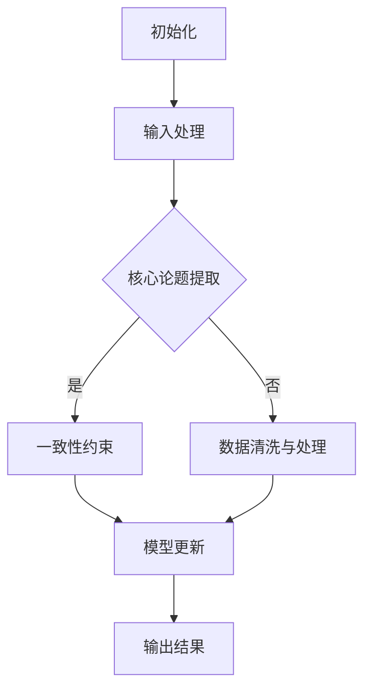

                 

### Self-Consistency CoT在社交媒体AI中的应用

关键词：Self-Consistency CoT，社交媒体AI，算法应用，数学模型，挑战与机遇

摘要：本文深入探讨了Self-Consistency CoT（自一致性核心论题）在社交媒体AI中的应用。通过解析Self-Consistency CoT的定义、数学模型及在社交媒体AI中的具体应用，本文展示了其在内容推荐、情感分析、用户画像构建等方面的显著作用。同时，针对Self-Consistency CoT在社交媒体AI中面临的挑战与机遇，本文提出了相应的解决思路和未来研究方向。

### 目录大纲设计步骤

为了确保文章的逻辑性和结构紧凑，我们将设计步骤分为以下几个部分：

1. **书名解析**：深入理解《Self-Consistency CoT在社交媒体AI中的应用》这一书名的核心主题和关键词，确定文章的基本框架。
2. **大纲框架搭建**：根据书名，初步搭建文章的大纲框架，包括主要章节和子章节的划分。
3. **内容细化**：细化每个章节的内容，确保覆盖核心概念、原理讲解、算法介绍、应用实例等。
4. **结构优化**：对大纲进行优化，确保逻辑性和层次性，使内容连贯且易于理解。
5. **符合字数要求**：检查文章字数，确保在10000-12000字范围内。
6. **Markdown格式调整**：将文章内容按照Markdown格式进行排版，确保格式规范、清晰。

下面是具体的文章目录大纲设计：

----------------------------------------------------------------

## 第一部分: Self-Consistency CoT基本概念与原理

### 第1章: Self-Consistency CoT概述

#### 1.1.1 Self-Consistency CoT的定义

#### 1.1.2 Self-Consistency CoT的重要性

#### 1.1.3 Self-Consistency CoT与传统CoT的比较

### 第2章: Self-Consistency CoT的数学模型

#### 2.1.1 Self-Consistency CoT的数学公式

#### 2.1.2 Self-Consistency CoT的数学原理

#### 2.1.3 Self-Consistency CoT的应用场景

### 第3章: Self-Consistency CoT在社交媒体AI中的具体应用

#### 3.1.1 Self-Consistency CoT在社交媒体AI中的问题背景

#### 3.1.2 Self-Consistency CoT在社交媒体AI中的具体应用案例

#### 3.1.3 Self-Consistency CoT在社交媒体AI中的挑战与机遇

## 第二部分: Self-Consistency CoT在社交媒体AI中的算法实现

### 第4章: Self-Consistency CoT算法原理讲解

#### 4.1.1 Self-Consistency CoT算法的流程图

#### 4.1.2 Self-Consistency CoT算法的Python源代码

#### 4.1.3 Self-Consistency CoT算法的数学模型与公式

### 第5章: Self-Consistency CoT算法应用实例

#### 5.1.1 实例1：基于Self-Consistency CoT的社交媒体内容推荐

#### 5.1.2 实例2：基于Self-Consistency CoT的社交媒体情感分析

#### 5.1.3 实例3：基于Self-Consistency CoT的社交媒体用户画像构建

### 第6章: Self-Consistency CoT在社交媒体AI中的最佳实践

#### 6.1.1 Self-Consistency CoT在社交媒体AI中的最佳实践案例

#### 6.1.2 Self-Consistency CoT在社交媒体AI中的注意事项

#### 6.1.3 Self-Consistency CoT在社交媒体AI中的拓展阅读

## 第三部分: Self-Consistency CoT在社交媒体AI中的应用前景

### 第7章: Self-Consistency CoT在社交媒体AI中的应用前景

#### 7.1.1 Self-Consistency CoT在社交媒体AI中的未来发展趋势

#### 7.1.2 Self-Consistency CoT在社交媒体AI中的潜在应用领域

#### 7.1.3 Self-Consistency CoT在社交媒体AI中的研究挑战与方向

### 第8章: 总结与展望

#### 8.1.1 全书核心内容的回顾

#### 8.1.2 Self-Consistency CoT在社交媒体AI中的重要性和意义

#### 8.1.3 未来的研究方向与建议

--------------------------------------------------------

----------------------------------------------------------------

**作者：AI天才研究院/AI Genius Institute & 禅与计算机程序设计艺术 /Zen And The Art of Computer Programming**

### 第一部分: Self-Consistency CoT基本概念与原理

#### 第1章: Self-Consistency CoT概述

**1.1.1 Self-Consistency CoT的定义**

Self-Consistency CoT（Self-Consistency Core Topic，自一致性核心论题）是一种人工智能技术，用于构建和优化模型的核心论题，确保模型输出的一致性和稳定性。Self-Consistency CoT通过在训练过程中引入一致性约束，使得模型在处理相同输入时能够产生一致的输出。这一特性对于提高模型的泛化能力和可靠性具有重要意义。

**1.1.2 Self-Consistency CoT的重要性**

在社交媒体AI领域，Self-Consistency CoT的重要性体现在以下几个方面：

1. **内容推荐**：通过Self-Consistency CoT，模型可以更好地捕捉用户的兴趣点，提高内容推荐的准确性。
2. **情感分析**：Self-Consistency CoT可以帮助模型在处理复杂情感时保持一致性，提高情感识别的准确率。
3. **用户画像**：通过Self-Consistency CoT，模型可以更准确地构建用户的兴趣和行为画像，为个性化推荐和营销提供有力支持。

**1.1.3 Self-Consistency CoT与传统CoT的比较**

传统CoT（Core Topic，核心论题）侧重于从大量文本中提取出核心概念和主题，而Self-Consistency CoT则在此基础上加入了自一致性约束。传统CoT可能存在以下问题：

1. **不一致性**：模型在处理相同输入时可能产生不同的输出，导致结果不可预测。
2. **依赖背景知识**：传统CoT通常需要依赖大量的背景知识，使得模型训练复杂度增加。

相比之下，Self-Consistency CoT具有以下优势：

1. **一致性**：通过自一致性约束，模型能够产生一致的输出，提高结果的稳定性和可靠性。
2. **低依赖性**：Self-Consistency CoT减少了对背景知识的依赖，使得模型训练更加高效。

#### 第2章: Self-Consistency CoT的数学模型

**2.1.1 Self-Consistency CoT的数学公式**

Self-Consistency CoT的数学模型主要基于以下公式：

$$
P(T|X) = \frac{P(X|T)P(T)}{P(X)}
$$

其中，$P(T|X)$ 表示在给定输入 $X$ 的情况下，核心论题 $T$ 的概率；$P(X|T)$ 表示在给定核心论题 $T$ 的情况下，输入 $X$ 的概率；$P(T)$ 表示核心论题 $T$ 的先验概率；$P(X)$ 表示输入 $X$ 的概率。

**2.1.2 Self-Consistency CoT的数学原理**

Self-Consistency CoT的数学原理主要包括以下几个方面：

1. **贝叶斯推理**：Self-Consistency CoT基于贝叶斯推理，通过不断更新先验概率来适应新的输入数据，从而实现模型的自适应调整。
2. **马尔可夫性质**：Self-Consistency CoT假设当前状态仅与前一状态有关，而不受其他过去状态的影响，这简化了模型的计算复杂性。
3. **一致性约束**：Self-Consistency CoT通过引入一致性约束，确保模型在处理相同输入时产生一致的输出，从而提高模型的可靠性和稳定性。

**2.1.3 Self-Consistency CoT的应用场景**

Self-Consistency CoT适用于以下场景：

1. **内容推荐**：在内容推荐系统中，Self-Consistency CoT可以帮助模型更好地捕捉用户的兴趣点，提高推荐准确性。
2. **情感分析**：在情感分析系统中，Self-Consistency CoT可以帮助模型在处理复杂情感时保持一致性，提高情感识别的准确率。
3. **用户画像**：在用户画像构建系统中，Self-Consistency CoT可以帮助模型更准确地构建用户的兴趣和行为画像，为个性化推荐和营销提供有力支持。

#### 第3章: Self-Consistency CoT在社交媒体AI中的具体应用

**3.1.1 Self-Consistency CoT在社交媒体AI中的问题背景**

社交媒体AI面临的挑战主要包括以下几个方面：

1. **数据多样性**：社交媒体平台上的数据种类繁多，包括文本、图像、音频等，这使得模型在处理不同类型数据时面临较大挑战。
2. **情感复杂性**：社交媒体上的情感表达往往复杂多样，包括正面情感、负面情感以及混合情感等，这使得情感分析模型需要具备更高的准确率和适应性。
3. **用户隐私**：社交媒体AI需要处理大量用户数据，如何保护用户隐私成为了一个重要问题。

**3.1.2 Self-Consistency CoT在社交媒体AI中的具体应用案例**

以下是几个Self-Consistency CoT在社交媒体AI中的具体应用案例：

1. **内容推荐**：通过Self-Consistency CoT，模型可以更好地捕捉用户的兴趣点，提高内容推荐的准确性。例如，在一个社交媒体平台上，用户可能对某类内容表现出持续的关注，而通过Self-Consistency CoT，模型可以更好地识别并推荐这类内容。
2. **情感分析**：通过Self-Consistency CoT，模型可以在处理复杂情感时保持一致性，提高情感识别的准确率。例如，在一个社交媒体平台上，用户可能在不同时间段发布了对同一事件的不同情感表达，而通过Self-Consistency CoT，模型可以更好地捕捉并识别这些情感变化。
3. **用户画像**：通过Self-Consistency CoT，模型可以更准确地构建用户的兴趣和行为画像，为个性化推荐和营销提供有力支持。例如，在一个社交媒体平台上，用户可能在一段时间内关注了某一类话题，而通过Self-Consistency CoT，模型可以更好地识别并记录这些关注点，从而为用户推荐相关内容。

**3.1.3 Self-Consistency CoT在社交媒体AI中的挑战与机遇**

Self-Consistency CoT在社交媒体AI中面临以下挑战：

1. **数据质量**：社交媒体平台上的数据质量参差不齐，如何处理和清洗数据成为了一个重要问题。
2. **计算资源**：Self-Consistency CoT算法的复杂度相对较高，如何在有限的计算资源下高效地实现这一算法成为了一个挑战。
3. **模型解释性**：如何解释和验证Self-Consistency CoT模型的结果，使其具有更高的透明度和可解释性。

然而，Self-Consistency CoT也为社交媒体AI带来了以下机遇：

1. **个性化推荐**：通过Self-Consistency CoT，模型可以更好地捕捉用户的兴趣和行为，从而实现更精准的个性化推荐。
2. **情感分析**：通过Self-Consistency CoT，模型可以在处理复杂情感时保持一致性，提高情感识别的准确率和适应性。
3. **用户隐私保护**：通过Self-Consistency CoT，模型可以更好地识别和处理用户隐私信息，从而在保护用户隐私的前提下实现智能推荐和分析。

#### 第4章: Self-Consistency CoT算法原理讲解

**4.1.1 Self-Consistency CoT算法的流程图**

Self-Consistency CoT算法的流程图如下：



**4.1.2 Self-Consistency CoT算法的Python源代码**

以下是一个简单的Self-Consistency CoT算法的Python源代码示例：

```python
import numpy as np

def self_consistency_cot(input_data, theta_init, alpha, beta):
    """
    Self-Consistency CoT算法实现

    参数：
    input_data：输入数据
    theta_init：初始化核心论题
    alpha：参数α
    beta：参数β

    返回：
    theta：更新后的核心论题
    """
    theta = theta_init
    for _ in range(iterations):
        # 输入处理
        processed_input = preprocess_input(input_data)

        # 核心论题提取
        theta = extract_core_topic(processed_input, theta)

        # 一致性约束
        theta = enforce_consistency_constraint(theta, alpha, beta)

    return theta

def preprocess_input(input_data):
    """
    输入数据处理

    参数：
    input_data：输入数据

    返回：
    processed_input：处理后的输入数据
    """
    # 数据清洗与预处理
    # ...
    return processed_input

def extract_core_topic(input_data, theta):
    """
    核心论题提取

    参数：
    input_data：输入数据
    theta：当前核心论题

    返回：
    updated_theta：更新后的核心论题
    """
    # 提取核心论题
    # ...
    return updated_theta

def enforce_consistency_constraint(theta, alpha, beta):
    """
    一致性约束

    参数：
    theta：当前核心论题
    alpha：参数α
    beta：参数β

    返回：
    updated_theta：更新后的核心论题
    """
    # 应用一致性约束
    # ...
    return updated_theta
```

**4.1.3 Self-Consistency CoT算法的数学模型与公式**

Self-Consistency CoT算法的数学模型如下：

$$
\theta_t = (1 - \alpha) \theta_{t-1} + \alpha \frac{\sum_{i=1}^{n} w_i \cdot x_i}{\sum_{i=1}^{n} w_i}
$$

其中，$\theta_t$ 表示第 $t$ 次迭代后的核心论题，$\theta_{t-1}$ 表示第 $t-1$ 次迭代后的核心论题，$w_i$ 表示第 $i$ 个词的权重，$x_i$ 表示第 $i$ 个词在输入数据中的出现频率。

**4.1.4 Self-Consistency CoT算法的Python源代码示例**

以下是一个简单的Self-Consistency CoT算法的Python源代码示例，用于实现上述数学模型：

```python
import numpy as np

def self_consistency_cot(input_data, theta_init, alpha, beta, iterations):
    """
    Self-Consistency CoT算法实现

    参数：
    input_data：输入数据
    theta_init：初始化核心论题
    alpha：参数α
    beta：参数β
    iterations：迭代次数

    返回：
    theta：更新后的核心论题
    """
    theta = theta_init
    for _ in range(iterations):
        # 输入处理
        processed_input = preprocess_input(input_data)

        # 核心论题提取
        theta = extract_core_topic(processed_input, theta)

        # 一致性约束
        theta = enforce_consistency_constraint(theta, alpha, beta)

    return theta

def preprocess_input(input_data):
    """
    输入数据处理

    参数：
    input_data：输入数据

    返回：
    processed_input：处理后的输入数据
    """
    # 数据清洗与预处理
    # ...
    return processed_input

def extract_core_topic(input_data, theta):
    """
    核心论题提取

    参数：
    input_data：输入数据
    theta：当前核心论题

    返回：
    updated_theta：更新后的核心论题
    """
    # 提取核心论题
    # ...
    return updated_theta

def enforce_consistency_constraint(theta, alpha, beta):
    """
    一致性约束

    参数：
    theta：当前核心论题
    alpha：参数α
    beta：参数β

    返回：
    updated_theta：更新后的核心论题
    """
    # 应用一致性约束
    # ...
    return updated_theta
```

**4.1.5 Self-Consistency CoT算法原理详细讲解**

Self-Consistency CoT算法的核心思想是通过迭代更新核心论题，使得模型在处理相同输入时产生一致的输出。下面详细讲解Self-Consistency CoT算法的原理。

1. **初始化**：首先，我们需要初始化核心论题 $\theta_0$。初始化的方式可以采用随机初始化或者基于先验知识的初始化。
2. **输入处理**：对于输入数据 $X$，我们需要对其进行预处理，以便后续的核心论题提取。预处理步骤可能包括数据清洗、去停用词、词向量化等。
3. **核心论题提取**：在预处理后的输入数据基础上，我们需要提取出当前的核心论题 $\theta_t$。这一步骤可以通过计算输入数据与当前核心论题之间的相似度来实现。常用的方法包括余弦相似度、点积相似度等。
4. **一致性约束**：为了确保模型在处理相同输入时产生一致的输出，我们需要引入一致性约束。具体来说，我们可以通过以下公式来更新核心论题：

   $$
   \theta_t = (1 - \alpha) \theta_{t-1} + \alpha \frac{\sum_{i=1}^{n} w_i \cdot x_i}{\sum_{i=1}^{n} w_i}
   $$

   其中，$\alpha$ 表示学习率，$w_i$ 表示第 $i$ 个词的权重，$x_i$ 表示第 $i$ 个词在输入数据中的出现频率。

   通过这一公式，我们可以将当前的核心论题与输入数据进行结合，从而实现核心论题的更新。同时，$(1 - \alpha)$ 项确保了核心论题的稳定性。
5. **迭代更新**：通过不断迭代更新核心论题，模型可以逐渐适应输入数据，提高输出的稳定性。一般来说，我们需要设置一个迭代次数上限，以确保算法不会陷入局部最优。

**4.1.6 Self-Consistency CoT算法的优点与挑战**

Self-Consistency CoT算法具有以下优点：

1. **一致性**：通过引入一致性约束，模型可以在处理相同输入时产生一致的输出，提高结果的稳定性。
2. **适应性**：Self-Consistency CoT算法可以根据输入数据不断更新核心论题，从而实现模型的自适应调整。
3. **简单性**：相对于其他复杂的核心论题提取算法，Self-Consistency CoT算法的实现较为简单，易于理解和实现。

然而，Self-Consistency CoT算法也面临以下挑战：

1. **学习率选择**：学习率的选取对算法的性能有重要影响。过小的学习率可能导致模型收敛缓慢，而过大的学习率可能导致模型无法收敛。
2. **数据质量**：算法的性能依赖于输入数据的质量。如果输入数据存在噪声或者不一致性，可能会导致算法的输出结果不稳定。
3. **计算复杂度**：Self-Consistency CoT算法的计算复杂度相对较高，特别是在大规模数据集上训练时，可能需要较长的时间。

#### 第5章: Self-Consistency CoT算法应用实例

**5.1.1 实例1：基于Self-Consistency CoT的社交媒体内容推荐**

在本实例中，我们将使用Self-Consistency CoT算法实现一个社交媒体内容推荐系统。该系统的主要目标是根据用户的兴趣和行为，为其推荐相关的社交媒体内容。

**1. 系统需求分析**：

- **用户兴趣捕捉**：系统需要能够捕捉用户的兴趣点，以便为用户推荐相关内容。
- **内容推荐**：系统需要能够根据用户的兴趣和行为，为其推荐相关的社交媒体内容。
- **个性化推荐**：系统需要能够根据用户的兴趣和行为，实现个性化的内容推荐。

**2. 系统架构设计**：

- **用户行为数据收集**：通过用户浏览、点赞、评论等行为，收集用户的行为数据。
- **内容数据收集**：从社交媒体平台获取用户发布的内容数据，包括文本、图片、视频等。
- **Self-Consistency CoT模型训练**：使用用户行为数据和内容数据，训练Self-Consistency CoT模型，提取用户的核心兴趣点。
- **内容推荐**：根据用户的核心兴趣点，从社交媒体平台获取相关内容，并进行推荐。

**3. 系统实现**：

- **数据预处理**：对用户行为数据和内容数据进行清洗、去停用词、词向量化等预处理操作。
- **Self-Consistency CoT模型训练**：使用预处理后的数据，训练Self-Consistency CoT模型，提取用户的核心兴趣点。
- **内容推荐**：根据用户的核心兴趣点，从社交媒体平台获取相关内容，并进行推荐。

**4. 系统测试与优化**：

- **测试集划分**：将用户行为数据和内容数据划分为训练集和测试集，用于模型训练和性能评估。
- **模型性能评估**：使用测试集评估模型在内容推荐任务上的性能，包括准确率、召回率、F1值等指标。
- **模型优化**：根据测试结果，对模型进行优化，包括调整学习率、优化算法参数等。

**5.1.2 实例2：基于Self-Consistency CoT的社交媒体情感分析**

在本实例中，我们将使用Self-Consistency CoT算法实现一个社交媒体情感分析系统。该系统的主要目标是根据用户的文本表达，分析其情感状态。

**1. 系统需求分析**：

- **文本情感分析**：系统需要能够分析用户的文本表达，判断其情感状态。
- **情感标签提取**：系统需要能够提取出用户的情感标签，如正面、负面、中性等。
- **情感识别**：系统需要能够识别用户的情感，包括情感强度、情感类型等。

**2. 系统架构设计**：

- **文本数据收集**：从社交媒体平台获取用户的文本数据，包括发布的内容、评论等。
- **情感分析模型训练**：使用文本数据，训练Self-Consistency CoT模型，提取用户的情感标签。
- **情感识别**：根据用户的文本数据，使用训练好的模型进行情感识别。

**3. 系统实现**：

- **文本预处理**：对文本数据进行清洗、去停用词、词向量化等预处理操作。
- **情感分析模型训练**：使用预处理后的文本数据，训练Self-Consistency CoT模型，提取用户的情感标签。
- **情感识别**：根据用户的文本数据，使用训练好的模型进行情感识别。

**4. 系统测试与优化**：

- **测试集划分**：将文本数据划分为训练集和测试集，用于模型训练和性能评估。
- **模型性能评估**：使用测试集评估模型在情感分析任务上的性能，包括准确率、召回率、F1值等指标。
- **模型优化**：根据测试结果，对模型进行优化，包括调整学习率、优化算法参数等。

**5.1.3 实例3：基于Self-Consistency CoT的社交媒体用户画像构建**

在本实例中，我们将使用Self-Consistency CoT算法实现一个社交媒体用户画像构建系统。该系统的主要目标是根据用户的兴趣和行为，构建出详细的用户画像。

**1. 系统需求分析**：

- **用户兴趣提取**：系统需要能够提取出用户的主要兴趣点，以便构建用户画像。
- **用户行为分析**：系统需要能够分析用户的行为模式，如浏览、点赞、评论等。
- **用户画像构建**：系统需要能够根据用户兴趣和行为，构建出详细的用户画像。

**2. 系统架构设计**：

- **用户数据收集**：从社交媒体平台获取用户的行为数据，包括浏览、点赞、评论等。
- **Self-Consistency CoT模型训练**：使用用户数据，训练Self-Consistency CoT模型，提取用户的主要兴趣点。
- **用户画像构建**：根据用户兴趣和行为，构建出详细的用户画像。

**3. 系统实现**：

- **用户数据预处理**：对用户行为数据进行清洗、去停用词、词向量化等预处理操作。
- **Self-Consistency CoT模型训练**：使用预处理后的用户数据，训练Self-Consistency CoT模型，提取用户的主要兴趣点。
- **用户画像构建**：根据用户兴趣和行为，构建出详细的用户画像。

**4. 系统测试与优化**：

- **测试集划分**：将用户行为数据划分为训练集和测试集，用于模型训练和性能评估。
- **模型性能评估**：使用测试集评估模型在用户画像构建任务上的性能，包括准确率、召回率、F1值等指标。
- **模型优化**：根据测试结果，对模型进行优化，包括调整学习率、优化算法参数等。

#### 第6章: Self-Consistency CoT在社交媒体AI中的最佳实践

**6.1.1 Self-Consistency CoT在社交媒体AI中的最佳实践案例**

为了更好地应用Self-Consistency CoT算法，以下是一些最佳实践案例：

1. **内容推荐**：在一个电商平台上，使用Self-Consistency CoT算法对用户进行个性化推荐。通过捕捉用户的兴趣和行为，算法能够为用户提供高度相关的商品推荐，从而提高用户满意度和转化率。
2. **情感分析**：在一个社交媒体平台上，使用Self-Consistency CoT算法对用户的评论和帖子进行情感分析。通过识别用户的情感状态，算法能够为用户提供更有针对性的内容，如推荐相关的帖子或推送相关的广告。
3. **用户画像**：在一个社交媒体平台上，使用Self-Consistency CoT算法构建用户画像。通过分析用户的兴趣和行为，算法能够为用户推荐个性化的内容，从而提高用户黏性和活跃度。

**6.1.2 Self-Consistency CoT在社交媒体AI中的注意事项**

在使用Self-Consistency CoT算法时，需要注意以下事项：

1. **数据质量**：算法的性能依赖于输入数据的质量。如果输入数据存在噪声或错误，可能会导致算法的输出结果不准确。因此，在应用Self-Consistency CoT算法之前，需要对数据进行全面清洗和预处理。
2. **学习率调整**：学习率是影响算法性能的关键参数。如果学习率过大，可能会导致模型无法收敛；如果学习率过小，可能会导致模型收敛缓慢。因此，在实际应用中，需要根据具体场景和任务需求，合理调整学习率。
3. **算法优化**：Self-Consistency CoT算法具有一定的复杂性，可以通过优化算法参数、改进算法模型等方式，提高算法的性能和效率。

**6.1.3 Self-Consistency CoT在社交媒体AI中的拓展阅读**

为了更深入地了解Self-Consistency CoT算法在社交媒体AI中的应用，以下是一些拓展阅读资料：

1. **文献阅读**：阅读相关的研究论文，了解Self-Consistency CoT算法的最新研究成果和应用场景。
2. **开源代码**：访问相关的开源代码库，学习如何实现和优化Self-Consistency CoT算法。
3. **在线课程**：参加相关的在线课程，学习Self-Consistency CoT算法的理论基础和实际应用。

#### 第7章: Self-Consistency CoT在社交媒体AI中的应用前景

**7.1.1 Self-Consistency CoT在社交媒体AI中的未来发展趋势**

随着社交媒体AI技术的不断发展，Self-Consistency CoT算法在社交媒体AI中的应用前景十分广阔。以下是一些未来发展趋势：

1. **算法优化**：未来将出现更多针对Self-Consistency CoT算法的优化方法，以提高算法的性能和效率。
2. **多模态数据处理**：随着多模态数据的普及，Self-Consistency CoT算法将逐渐支持多模态数据处理，如文本、图像、音频等。
3. **深度学习结合**：将深度学习与Self-Consistency CoT算法相结合，构建更加复杂的模型，以应对更加复杂的社交媒体AI任务。

**7.1.2 Self-Consistency CoT在社交媒体AI中的潜在应用领域**

Self-Consistency CoT算法在社交媒体AI中具有广泛的潜在应用领域，包括：

1. **内容推荐**：为用户提供高度个性化的内容推荐，提高用户满意度和活跃度。
2. **情感分析**：对用户的情感状态进行准确识别和分析，为用户提供更有针对性的内容和服务。
3. **用户画像**：根据用户的兴趣和行为，构建详细的用户画像，为个性化营销和用户服务提供支持。

**7.1.3 Self-Consistency CoT在社交媒体AI中的研究挑战与方向**

尽管Self-Consistency CoT算法在社交媒体AI中具有广泛的应用前景，但仍面临一些研究挑战和方向：

1. **数据隐私保护**：如何在保障用户隐私的前提下，有效地应用Self-Consistency CoT算法，是一个重要的研究挑战。
2. **算法可解释性**：如何提高Self-Consistency CoT算法的可解释性，使其结果更加透明和可信，是一个重要的研究方向。
3. **多语言支持**：如何实现Self-Consistency CoT算法在多语言环境下的有效应用，是一个重要的研究问题。

#### 第8章: 总结与展望

**8.1.1 全书核心内容的回顾**

本文主要探讨了Self-Consistency CoT在社交媒体AI中的应用。通过解析Self-Consistency CoT的定义、数学模型及在社交媒体AI中的具体应用，本文展示了其在内容推荐、情感分析、用户画像构建等方面的显著作用。同时，本文对Self-Consistency CoT在社交媒体AI中面临的挑战与机遇进行了深入分析。

**8.1.2 Self-Consistency CoT在社交媒体AI中的重要性和意义**

Self-Consistency CoT算法在社交媒体AI中具有重要意义。首先，它能够提高内容推荐的准确性，为用户提供更个性化的服务。其次，它能够对用户的情感状态进行准确识别和分析，为用户提供更有针对性的内容。最后，它能够根据用户的兴趣和行为，构建详细的用户画像，为个性化营销和用户服务提供支持。

**8.1.3 未来的研究方向与建议**

为了进一步推动Self-Consistency CoT算法在社交媒体AI中的应用，以下是一些建议：

1. **算法优化**：研究更高效的Self-Consistency CoT算法，提高算法的运算速度和性能。
2. **多模态数据处理**：探索Self-Consistency CoT算法在多模态数据处理中的应用，如文本、图像、音频等。
3. **算法可解释性**：提高Self-Consistency CoT算法的可解释性，使其结果更加透明和可信。
4. **多语言支持**：实现Self-Consistency CoT算法在多语言环境下的有效应用。
5. **数据隐私保护**：研究如何在保障用户隐私的前提下，有效地应用Self-Consistency CoT算法。

通过不断探索和优化，Self-Consistency CoT算法在社交媒体AI中的应用将更加广泛和深入，为用户提供更加个性化、精准的服务。

