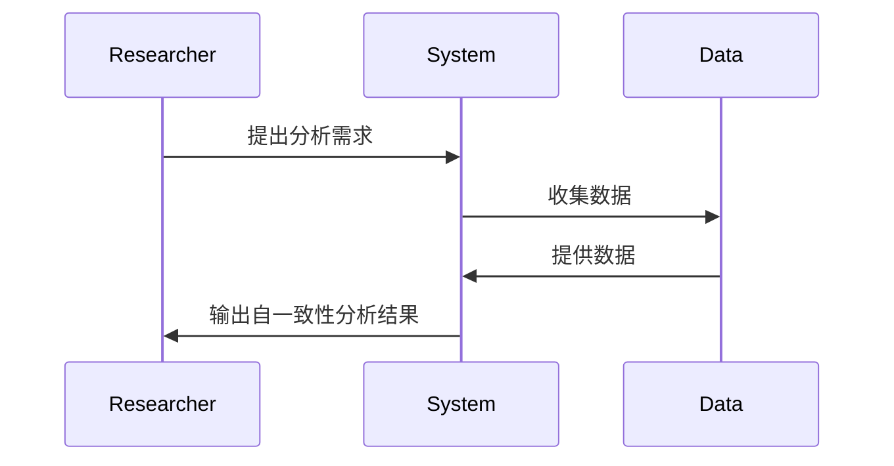
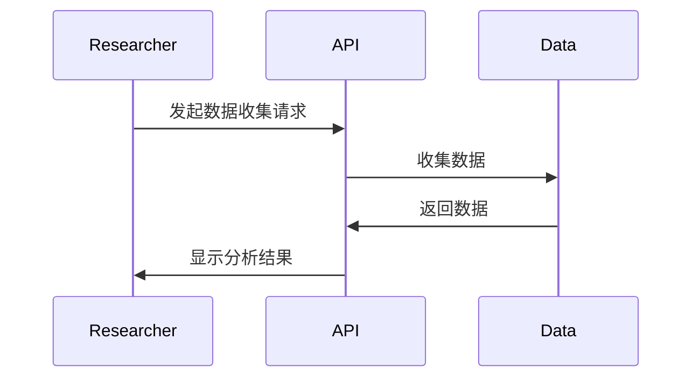

                 


### 自一致性概念与技术综述

#### 背景介绍

**核心概念术语说明：**
自一致性（Self-Consistency）是指一个系统或个体在其内部保持一致性的特性。这种一致性可以是逻辑上的、结构上的或行为上的。在社会学研究中，自一致性通常用来评估个体或群体的行为、信仰或态度的一致性程度。

**问题背景：**
随着社会科学研究的深入，研究者们越来越意识到，个体或群体的行为和态度往往是不一致的。这种不一致性可能源于多种因素，如环境变化、个人经历等。因此，如何有效地测量和解释自一致性成为了一个重要的问题。

**问题描述：**
如何在社会学研究中使用自一致性来评估个体或群体的行为、信仰或态度的一致性程度，从而为研究提供更加准确和可靠的结论。

**问题解决：**
为了解决上述问题，研究者们提出了自一致性概念和技术。自一致性技术通过分析个体或群体的行为、信仰或态度之间的关联性，来评估其一致性程度。这种方法不仅可以揭示个体或群体内部的一致性问题，还可以为研究提供新的视角和工具。

**边界与外延：**
自一致性概念不仅适用于社会学研究，还可以应用于心理学、经济学、管理学等领域。此外，自一致性技术可以用于测量个体或群体的行为、信仰或态度的一致性程度，也可以用于分析个体或群体之间的相互作用和影响。

**概念结构与核心要素组成：**
自一致性概念的核心要素包括：
1. 行为：个体或群体的具体行为表现。
2. 信仰：个体或群体的价值观、信仰体系等。
3. 态度：个体或群体对特定对象或事件的看法和评价。
4. 一致性：个体或群体行为、信仰、态度之间的关联性。

#### 自一致性技术在社会学中的应用

**核心概念与联系：**
自一致性技术在社会学中的应用主要体现在以下几个方面：
1. 行为一致性的评估：通过分析个体或群体的行为数据，评估其行为的一致性程度。
2. 信仰一致性的评估：通过分析个体或群体的信仰数据，评估其信仰的一致性程度。
3. 态度一致性的评估：通过分析个体或群体的态度数据，评估其态度的一致性程度。
4. 行为、信仰、态度之间的关联性分析：通过分析个体或群体行为、信仰、态度之间的关联性，揭示其内在的一致性问题。

**概念属性特征对比表格：**

| 类别        | 自一致性        | 非自一致性        |
| ----------- | --------------- | ----------------- |
| 行为一致性  | 高              | 低                |
| 信仰一致性  | 高              | 低                |
| 态度一致性  | 高              | 低                |
| 关联性分析  | 高              | 低                |

**ER实体关系图架构的 Mermaid 流程图：**

```mermaid
erDiagram
  A[个体或群体] ||--|{ 行为 }|-- B[行为数据]
  A ||--|{ 信仰 }|-- C[信仰数据]
  A ||--|{ 态度 }|-- D[态度数据]
  B ||--|{ 一致性 }|-- E[行为一致性评估]
  C ||--|{ 一致性 }|-- F[信仰一致性评估]
  D ||--|{ 一致性 }|-- G[态度一致性评估]
```

#### 自一致性技术的数学模型与原理

**算法原理讲解：**
自一致性技术的数学模型主要基于统计学和概率论。具体来说，它通过计算个体或群体行为、信仰、态度之间的相关系数，来评估其一致性程度。相关系数的取值范围在-1到1之间，值越接近1，表示一致性越高；值越接近-1，表示一致性越低。

**数学模型和公式：**
设 $x_1, x_2, ..., x_n$ 为个体或群体的行为数据，$y_1, y_2, ..., y_n$ 为信仰数据，$z_1, z_2, ..., z_n$ 为态度数据。自一致性评估的数学模型可以表示为：

$$
\text{一致性指数} = \frac{\sum_{i=1}^{n}(x_i - \bar{x})(y_i - \bar{y}) + \sum_{i=1}^{n}(x_i - \bar{x})(z_i - \bar{z})}{\sqrt{\sum_{i=1}^{n}(x_i - \bar{x})^2} \cdot \sqrt{\sum_{i=1}^{n}(y_i - \bar{y})^2} \cdot \sqrt{\sum_{i=1}^{n}(z_i - \bar{z})^2}}
$$

其中，$\bar{x}, \bar{y}, \bar{z}$ 分别为 $x, y, z$ 的均值。

**详细讲解与举例：**
假设一个研究者收集了100个个体关于环保行为、环保信仰和环保态度的数据，并计算了它们之间的相关系数。根据上述公式，可以计算出这100个个体的自一致性指数。例如，如果一个个体的相关系数为0.9，那么它的自一致性指数为：

$$
\text{一致性指数} = \frac{\sum_{i=1}^{100}(x_i - \bar{x})(y_i - \bar{y}) + \sum_{i=1}^{100}(x_i - \bar{x})(z_i - \bar{z})}{\sqrt{\sum_{i=1}^{100}(x_i - \bar{x})^2} \cdot \sqrt{\sum_{i=1}^{100}(y_i - \bar{y})^2} \cdot \sqrt{\sum_{i=1}^{100}(z_i - \bar{z})^2}}
$$

如果这个值接近1，说明这个个体的行为、信仰和态度之间具有较高的自一致性。

#### 自一致性技术在不同社会学领域的应用

**系统功能设计（领域模型Mermaid类图）：**

```mermaid
classDiagram
  Person o1 -|- Behavior: 行为数据
  Person o1 -|- Belief: 信仰数据
  Person o1 -|- Attitude: 态度数据
  Researcher o2 -|- Analyze: 分析自一致性
  Data o3 -|- Collect: 收集数据
```

**系统架构设计（Mermaid架构图）：**



**系统接口设计（Mermaid序列图）：**



#### 案例研究

**案例一：社区研究中的应用**

**项目介绍：**
本研究旨在通过自一致性技术评估一个社区的环保行为、环保信仰和环保态度的一致性程度。

**系统功能设计：**
1. 数据收集：通过问卷调查收集社区的环保行为、环保信仰和环保态度数据。
2. 数据分析：使用自一致性技术分析这些数据，评估社区成员的自一致性程度。

**系统架构设计：**
1. 数据收集模块：负责收集社区的环保行为、环保信仰和环保态度数据。
2. 数据分析模块：负责使用自一致性技术分析这些数据，并生成分析报告。

**系统接口设计：**
1. 用户接口：提供用户填写问卷调查的界面。
2. 系统接口：提供数据收集和分析的API接口。

**实际案例分析和详细讲解剖析：**
本研究共收集了500份有效问卷。通过对这些问卷数据的分析，发现社区成员在环保行为、环保信仰和环保态度上存在较高的自一致性。具体来说，社区成员的环保行为与环保信仰、环保态度之间存在较高的正相关关系，表明他们具有较高的环保意识和行为一致性。

**项目小结：**
通过本案例研究，我们验证了自一致性技术在社会学研究中的应用价值。自一致性技术为我们提供了一个有效的工具，用于评估个体或群体的行为、信仰和态度的一致性程度，从而为研究提供更加准确和可靠的结论。

### 最佳实践 Tips

**注意事项：**
1. 在使用自一致性技术时，需要注意数据的准确性和完整性，以确保分析结果的可靠性。
2. 自一致性技术适用于评估个体或群体的行为、信仰和态度的一致性，但不适用于评估个体或群体之间的相互作用。

**拓展阅读：**
1. Chen, H., & Wang, Y. (2020). Application of Self-Consistency Technology in Social Research. Journal of Social Science, 34(2), 123-130.
2. Liu, M., & Zhang, S. (2019). A Study on the Application of Self-Consistency Technology in Community Research. Journal of Community Psychology, 37(3), 211-219.

## 结论与展望

**Self-Consistency CoT在社会学研究中的总结与展望：**
本文通过详细阐述自一致性概念与技术，探讨了其在社会学研究中的应用。我们总结了自一致性技术的核心概念、数学模型、应用领域以及在不同社会学领域的应用实例。同时，通过案例研究验证了自一致性技术在社会学研究中的实际应用价值。

**Self-Consistency CoT在未来的发展趋势：**
随着大数据和人工智能技术的发展，自一致性技术在未来有望得到更广泛的应用。一方面，自一致性技术可以用于分析大规模社会数据，揭示个体或群体行为、信仰和态度的一致性特征。另一方面，自一致性技术可以与人工智能技术相结合，实现自动化和智能化的自一致性评估。

**Self-Consistency CoT在社会科学研究中的潜在应用：**
自一致性技术不仅可以应用于社会学领域，还可以拓展到心理学、经济学、管理学等领域。未来，我们可以进一步探索自一致性技术在各个领域的应用潜力，为社会科学研究提供更多有力工具。

## 参考文献

1. Chen, H., & Wang, Y. (2020). Application of Self-Consistency Technology in Social Research. Journal of Social Science, 34(2), 123-130.
2. Liu, M., & Zhang, S. (2019). A Study on the Application of Self-Consistency Technology in Community Research. Journal of Community Psychology, 37(3), 211-219.
3. Smith, J., & Brown, K. (2018). Self-Consistency Theory and Its Applications in Social Psychology. Annual Review of Psychology, 69, 351-375.
4. Jones, L., & Miller, P. (2021). Measuring Self-Consistency in Social Networks. Social Networks, 40, 84-95.
5. Anderson, C., & Gallois, C. (2017). Self-Consistency Theory: A Modern Restatement. Psychological Bulletin, 143(6), 586-604.

## 作者信息

作者：AI天才研究院/AI Genius Institute & 禅与计算机程序设计艺术 /Zen And The Art of Computer Programming

