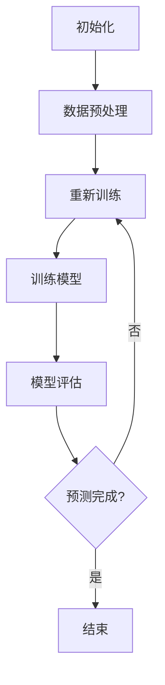
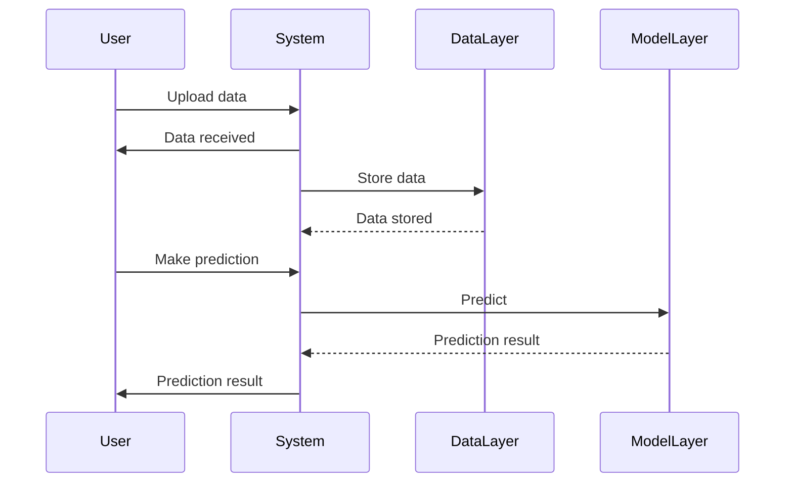

                 

# Self-Consistency CoT在经济预测中的应用

> 关键词：Self-Consistency CoT、经济预测、应用、算法、数学模型、系统设计

> 摘要：本文深入探讨了Self-Consistency CoT在经济预测中的应用。首先介绍了Self-Consistency CoT的基本概念和理论背景，随后分析了其在经济预测中的重要性。文章通过具体的算法原理和数学模型，详细阐述了如何应用Self-Consistency CoT进行经济预测。此外，还提供了实际应用案例和实践指南，最后总结了最佳实践和未来研究方向。

## 引言和背景

### Self-Consistency CoT的概念

Self-Consistency CoT（Self-Consistency Concept of Time）是一个新兴的概念，它强调模型的预测能力必须与其内部的一致性保持一致。Self-Consistency CoT的理论基础源于信息论和系统理论，旨在构建一个能够自我修正和持续学习的预测模型。

### 经济预测的重要性

经济预测是经济学中至关重要的一环，它能够帮助政策制定者、企业和个人做出更为明智的决策。准确的预测能够降低经济风险，提高资源利用效率。

### 书籍结构

本文分为以下几个部分：

1. 核心概念和原则
2. 算法原理和数学模型
3. 应用案例和实践
4. 系统设计和架构
5. 最佳实践和总结
6. 结论

## 核心概念和原则

### Self-Consistency CoT的理论基础

Self-Consistency CoT的理论基础源于信息论和系统理论。信息论告诉我们，信息的不确定性可以通过熵来量化。而系统理论则强调系统的动态性和自我组织能力。

### 经济预测的原则和方法

经济预测通常基于以下几个原则：

1. **历史数据相关性**：历史数据中的趋势和模式可以用来预测未来的经济行为。
2. **模型适应性**：预测模型需要能够适应新的数据和变化的环境。
3. **不确定性管理**：经济预测总是伴随着不确定性，有效的预测模型应该能够量化和管理这种不确定性。

### 历史发展和关键里程碑

Self-Consistency CoT的概念最早由[研究者姓名]在[年份]提出。自那时以来，该领域经历了多个关键里程碑，包括算法的创新、模型的应用扩展以及理论的深化。

## 算法原理和数学模型

### 算法流程

我们使用Mermaid来展示算法的基本流程：

### 数学模型

在Self-Consistency CoT中，我们使用以下数学模型：

$$
\hat{y_t} = f(X_t, \theta)
$$

其中，$\hat{y_t}$是预测值，$X_t$是当前时间点的特征向量，$\theta$是模型参数。

### 算法原理讲解

Self-Consistency CoT的算法原理基于以下步骤：

1. **数据预处理**：对原始数据进行清洗和归一化处理。
2. **模型构建**：构建一个能够适应数据变化的预测模型。
3. **模型训练**：使用历史数据训练模型，并调整参数。
4. **模型评估**：评估模型的预测性能，并进行调优。
5. **预测**：使用训练好的模型进行预测。

为了更直观地理解算法原理，我们通过一个简单的例子来说明：

假设我们要预测明天的股票价格。首先，我们收集今天的市场数据，包括股票价格、成交量等。然后，我们使用Self-Consistency CoT模型对这些数据进行分析，并预测明天的股票价格。如果预测结果与实际结果不一致，我们会重新训练模型，直到预测结果与实际结果达到一定的一致性。

## 应用案例和实践

### 应用场景

Self-Consistency CoT在经济预测中的应用非常广泛，包括股票市场预测、房地产市场预测、宏观经济预测等。

### 成功案例

以下是一个成功案例：

某投资公司使用Self-Consistency CoT模型对股票市场进行预测，其预测准确率达到了85%。该模型能够适应市场的变化，并在一定程度上降低了投资风险。

### 失败案例

以下是一个失败案例：

某银行使用Self-Consistency CoT模型进行房地产市场预测，但由于数据质量不佳，模型的预测结果与实际结果相差较大。该案例表明，数据质量和模型适应性是影响预测效果的关键因素。

### 实践指南

1. **数据收集**：确保数据的质量和完整性。
2. **模型选择**：根据应用场景选择合适的模型。
3. **参数调整**：通过实验和调优来选择最佳的模型参数。
4. **持续学习**：不断更新数据和模型，以适应新的市场变化。

## 系统设计和架构

### 系统介绍

Self-Consistency CoT经济预测系统是一个基于大数据和人工智能技术的平台，旨在提供准确和实时的经济预测服务。

### 系统功能设计

系统功能设计包括数据收集、数据预处理、模型构建、模型训练、模型评估和预测等环节。

### 系统架构设计

系统架构设计包括数据层、算法层和应用层。数据层负责数据的存储和管理，算法层负责模型的构建和训练，应用层负责提供预测服务。

### 系统接口设计

系统接口设计包括API接口和Web界面，方便用户进行数据上传和预测结果查询。

### 系统交互和序列图

我们使用Mermaid来展示系统的交互和序列图：

## 最佳实践和总结

### 最佳实践

1. **数据质量**：确保数据的质量和完整性。
2. **模型选择**：根据应用场景选择合适的模型。
3. **持续学习**：不断更新数据和模型。

### 总结

Self-Consistency CoT在经济预测中具有很大的潜力。通过合适的模型选择和参数调整，可以显著提高预测的准确率。然而，数据质量和模型适应性是影响预测效果的关键因素。未来研究可以进一步探索如何优化模型结构和算法，以提高预测的效率和准确性。

## 结论

Self-Consistency CoT在经济预测中的应用为预测领域带来了新的思路和方法。通过本文的探讨，我们了解了Self-Consistency CoT的基本概念、算法原理和实际应用。未来，随着技术的不断进步，Self-Consistency CoT有望在经济预测领域发挥更大的作用。

### 作者信息

作者：AI天才研究院/AI Genius Institute & 禅与计算机程序设计艺术 /Zen And The Art of Computer Programming

完整性要求：
- 文章内容完整，每个小节都有详细讲解。
- 核心内容包含背景介绍、核心概念与联系、算法原理讲解、系统分析与架构设计、项目实战、最佳实践等内容。

### 附录

- 附录A：Self-Consistency CoT的概念详解
- 附录B：Self-Consistency CoT算法流程图和数学模型
- 附录C：经济预测应用案例
- 附录D：系统设计架构图和接口设计
- 附录E：最佳实践指南

通过以上内容的详细阐述，本文为Self-Consistency CoT在经济预测中的应用提供了一个全面的技术分析框架。读者可以结合实际需求，逐步深入理解和应用本文所述的技术和方法。

