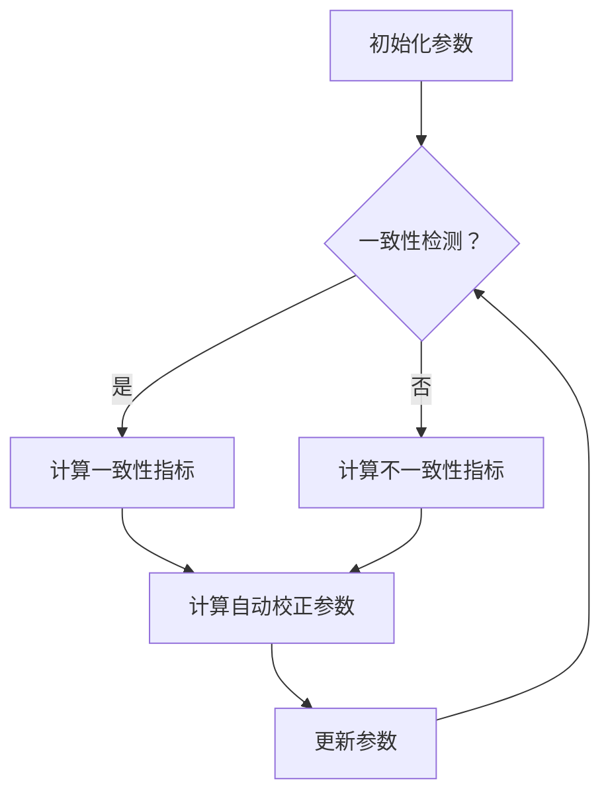
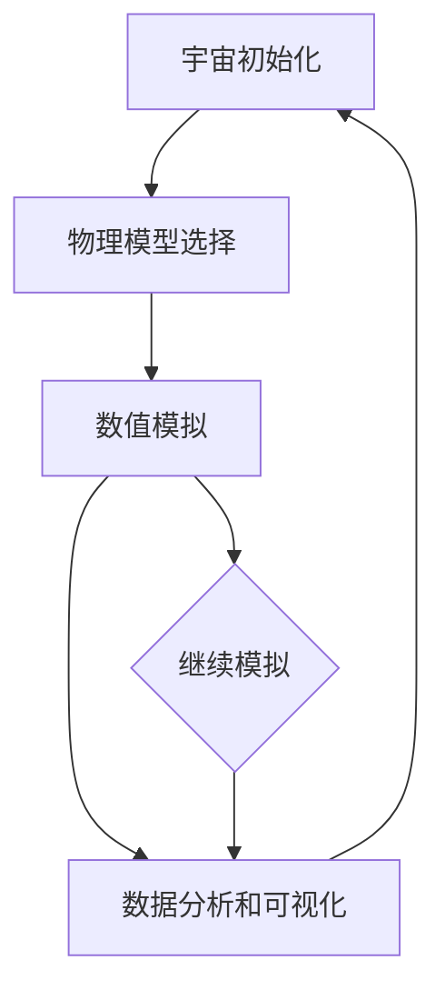
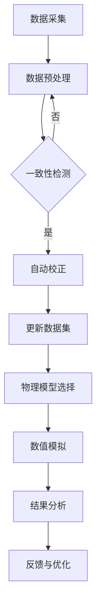
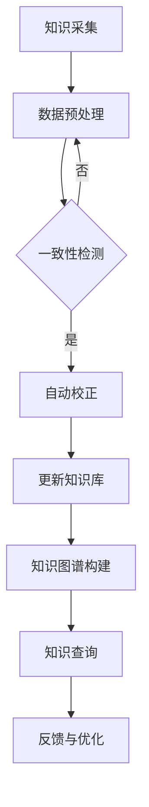
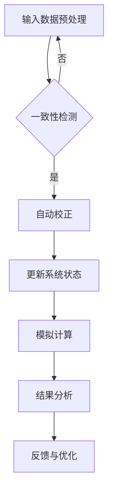

                 

### 1. 引言

在当今迅速发展的科技时代，人工智能（AI）已经成为改变世界的关键力量。从自动驾驶汽车到智能语音助手，AI技术正以惊人的速度渗透到我们生活的方方面面。然而，随着AI技术的日益复杂，一个重要的问题逐渐浮现：如何确保AI系统的稳定性和一致性？在多元宇宙模拟中，这个问题显得尤为突出。

本文将探讨一个具有前沿性和深度的主题——“Self-Consistency CoT增强AI在多元宇宙模拟中的一致性”。Self-Consistency CoT（自我一致性概念性框架）是一种新兴的技术，它通过引入一致性检查和自动校正机制，旨在增强AI系统的稳定性和可靠性。而多元宇宙模拟，则是一种通过模拟不同宇宙条件来探索物理规律和现象的技术手段。

本文的目标是详细探讨Self-Consistency CoT在多元宇宙模拟中的应用，解释其核心原理，并通过实际案例展示其在确保一致性方面的卓越表现。我们还将分析一致性的重要性，以及在实际应用中面临的挑战和解决方案。

### 关键词

- **自我一致性CoT**
- **多元宇宙模拟**
- **AI稳定性**
- **AI一致性**
- **数据验证**
- **知识图谱**

### 摘要

本文旨在深入探讨Self-Consistency CoT（自我一致性概念性框架）在多元宇宙模拟中的应用，以及它如何增强AI系统的稳定性和一致性。首先，我们将介绍自我一致性CoT的基本原理和数学模型，然后探讨其在数据一致性分析、知识图谱一致性验证以及AI系统自我监控与校正中的应用。接着，我们将详细讨论增强AI与多元宇宙模拟的结合，以及如何通过自我一致性CoT实现一致性的保障。最后，我们将通过实际案例分析，展示自我一致性CoT在多元宇宙模拟中的具体应用效果，并提出最佳实践和未来展望。通过本文，读者将全面了解自我一致性CoT在确保多元宇宙模拟中AI系统一致性方面的重要性和应用价值。

## 第一部分：引言

### 1. 引言

在当今迅速发展的科技时代，人工智能（AI）已经成为改变世界的关键力量。从自动驾驶汽车到智能语音助手，AI技术正以惊人的速度渗透到我们生活的方方面面。然而，随着AI技术的日益复杂，一个重要的问题逐渐浮现：如何确保AI系统的稳定性和一致性？在多元宇宙模拟中，这个问题显得尤为突出。

本文将探讨一个具有前沿性和深度的主题——“Self-Consistency CoT增强AI在多元宇宙模拟中的一致性”。Self-Consistency CoT（自我一致性概念性框架）是一种新兴的技术，它通过引入一致性检查和自动校正机制，旨在增强AI系统的稳定性和可靠性。而多元宇宙模拟，则是一种通过模拟不同宇宙条件来探索物理规律和现象的技术手段。

### 1.1 问题的提出

在传统AI系统中，一致性问题主要源于数据的不一致、模型的不稳定以及外部环境的变化。例如，在自动驾驶系统中，传感器数据可能因为环境噪声而出现误差，从而导致决策错误。而在医疗AI系统中，数据的一致性对于诊断结果的准确性至关重要。此外，在金融领域，AI系统的一致性对于风险控制和投资决策至关重要。

多元宇宙模拟则提供了一个更广阔的视角。在多元宇宙模拟中，不同宇宙条件下的物理规律和现象可能截然不同。因此，确保AI系统在不同宇宙条件下的一致性，对于模拟结果的准确性和可靠性至关重要。然而，传统的AI一致性方法难以适应这种复杂性，因此需要一种新的技术手段来应对。

### 1.2 自我一致性CoT的概念

Self-Consistency CoT，即自我一致性概念性框架，是一种通过自我监控和校正机制来增强AI系统一致性的技术。它基于以下核心思想：

1. **一致性检查**：通过定期检查系统的输入、输出以及中间状态，确保系统在运行过程中保持一致性。
2. **自动校正**：当检测到不一致性时，系统会自动进行校正，以恢复一致性。
3. **自我优化**：通过不断调整和优化内部参数，提高系统的一致性水平。

自我一致性CoT的核心在于其自我监控和自动校正机制。通过引入这种机制，AI系统可以在运行过程中动态调整自身，以适应不断变化的外部环境，从而确保系统的一致性和稳定性。

### 1.3 多元宇宙模拟的背景

多元宇宙模拟是一种通过计算机模拟来探索不同宇宙条件下物理规律和现象的技术手段。它基于以下基本假设：

1. **多重宇宙存在**：宇宙中可能存在多个不同的宇宙，每个宇宙都有其独特的物理规律和现象。
2. **可模拟性**：通过计算机模拟，可以再现这些不同宇宙条件下的物理过程和现象。
3. **探索意义**：多元宇宙模拟有助于我们更好地理解宇宙的本质，探索物理定律的普适性。

多元宇宙模拟在科学研究中具有重要意义。例如，通过模拟不同宇宙条件下的宇宙膨胀过程，可以更好地理解宇宙的起源和演化。此外，多元宇宙模拟还可以应用于探索新的物理现象和假设，如暗物质和暗能量的性质。

### 1.4 一致性的重要性

在多元宇宙模拟中，一致性至关重要。不一致性可能导致以下问题：

1. **模拟结果不准确**：不一致性可能导致模拟结果偏离真实情况，从而影响科学研究的准确性。
2. **系统稳定性下降**：不一致性可能导致AI系统在运行过程中出现异常，甚至崩溃。
3. **决策错误**：在自动驾驶、医疗和金融等领域，不一致性可能导致错误决策，造成严重后果。

因此，确保AI系统在多元宇宙模拟中的一致性，对于模拟结果的准确性和系统的稳定性具有重要意义。

### 1.5 本书结构

本文将分为七个部分，全面探讨Self-Consistency CoT在多元宇宙模拟中的应用：

- **第一部分**：引言，介绍问题的背景和重要性。
- **第二部分**：Self-Consistency CoT基础，详细解释其基本原理和数学模型。
- **第三部分**：增强AI与多元宇宙模拟，探讨增强AI的概念和多元宇宙模拟的实现方法。
- **第四部分**：自我一致性CoT在多元宇宙模拟中的应用，展示其实际应用案例。
- **第五部分**：一致性在多元宇宙模拟中的重要性，分析一致性的影响和挑战。
- **第六部分**：最佳实践与未来展望，提出最佳实践和未来发展方向。
- **第七部分**：总结与展望，回顾核心内容，展望未来研究方向。

通过本文，读者将全面了解Self-Consistency CoT在多元宇宙模拟中的应用，以及它如何确保AI系统的一致性和稳定性。

### 2.1 自我一致性CoT的基础

自我一致性CoT（自我一致性概念性框架）是一种通过引入自我监控和自动校正机制来增强AI系统一致性的技术。在这一部分，我们将详细探讨自我一致性CoT的基本原理、核心要素以及其在AI系统中的关联。

#### 2.1.1 CoT简介

首先，我们需要了解什么是CoT。CoT，即概念性框架（Conceptual Framework），是一种用于描述和解释复杂系统的理论模型。在AI领域，CoT通常用于构建智能体的知识表示和推理机制。CoT的核心在于其概念性，即通过抽象和简化的方式，将复杂问题转化为更容易理解和处理的模型。

#### 2.1.2 自我一致性的概念

自我一致性（Self-Consistency）是指一个系统在其内部保持一致性的能力。在AI系统中，自我一致性意味着系统能够在运行过程中检测和纠正不一致性，以确保其输入、输出以及中间状态的一致性。自我一致性的关键在于自我监控和自动校正机制，即系统能够通过自我检查和调整来保持一致性。

#### 2.1.3 CoT与自我一致性在AI中的关联

自我一致性CoT将CoT与自我一致性结合，旨在构建一种能够在复杂环境中保持一致性的AI系统。具体来说，自我一致性CoT通过以下方式实现这一目标：

1. **概念性知识表示**：使用CoT来表示AI系统的知识和推理过程，使系统能够更好地理解和处理复杂问题。
2. **自我监控**：通过自我一致性机制，系统可以定期检查其输入、输出以及中间状态，以确保一致性。
3. **自动校正**：当检测到不一致性时，系统会自动进行校正，以恢复一致性。

这种结合不仅增强了AI系统的稳定性，还提高了其在复杂环境中的适应能力。

#### 2.1.4 自我一致性CoT的核心要素

自我一致性CoT的核心要素包括以下几个方面：

1. **一致性检测机制**：这是自我一致性CoT的基础，用于定期检测系统的输入、输出和中间状态，以确保一致性。
2. **自动校正机制**：当检测到不一致性时，自动校正机制会启动，尝试恢复一致性。这通常包括调整系统的内部参数或重新计算中间结果。
3. **自我优化机制**：通过不断调整和优化内部参数，自我优化机制可以提高系统的一致性水平。
4. **反馈循环**：自我一致性CoT中的反馈循环使系统能够在运行过程中不断学习和改进，以适应不断变化的环境。

#### 小结

自我一致性CoT通过将概念性框架与自我一致性机制结合，提供了一种有效的手段来增强AI系统的一致性和稳定性。在接下来的章节中，我们将进一步探讨自我一致性CoT的数学模型、应用场景以及其实际效果。

### 2.2 自我一致性CoT的数学模型

自我一致性CoT（自我一致性概念性框架）的核心在于其数学模型，该模型通过精确的数学公式和算法来实现系统的自我监控和自动校正功能。在这一部分，我们将详细介绍自我一致性CoT的数学模型，包括其数学公式、基本原理以及Mermaid流程图展示。

#### 2.2.1 数学模型介绍

自我一致性CoT的数学模型主要基于一致性检测和自动校正机制。该模型的核心思想是通过周期性地检查系统状态，使用数学公式来计算一致性和不一致性指标，并在检测到不一致性时自动调整系统参数。

1. **一致性检测公式**：  
   一致性检测公式用于计算系统当前状态的一致性指标，通常表示为：
   $$I_c(t) = \frac{1}{N} \sum_{i=1}^{N} (T_i(t) - S_i(t))^2$$
   其中，$I_c(t)$表示在时间$t$的一致性指标，$N$表示检测的样本数量，$T_i(t)$表示第$i$个样本的预期值，$S_i(t)$表示第$i$个样本的实际值。

2. **不一致性检测公式**：  
   不一致性检测公式用于计算系统状态的不一致性指标，通常表示为：
   $$D_c(t) = \frac{1}{N} \sum_{i=1}^{N} |T_i(t) - S_i(t)|$$
   其中，$D_c(t)$表示在时间$t$的不一致性指标。

3. **自动校正公式**：  
   当检测到不一致性时，系统会根据以下公式自动调整参数：
   $$P(t+1) = P(t) - \alpha \cdot D_c(t)$$
   其中，$P(t+1)$表示在时间$t+1$的参数值，$P(t)$表示在时间$t$的参数值，$\alpha$表示校正系数。

#### 2.2.2 模型的数学公式与解释

1. **一致性指标计算**：  
   一致性指标$I_c(t)$表示系统状态的总体一致性。$I_c(t)$值越接近1，表示系统状态的一致性越高。通过比较预期值和实际值之间的差异，可以评估系统的一致性水平。

2. **不一致性指标计算**：  
   不一致性指标$D_c(t)$表示系统状态的总体不一致性。$D_c(t)$值越大，表示系统状态的一致性越低。通过计算预期值和实际值之间的绝对差异，可以量化系统的不一致性。

3. **自动校正机制**：  
   自动校正公式$P(t+1) = P(t) - \alpha \cdot D_c(t)$用于调整系统参数，以减少不一致性。校正系数$\alpha$控制校正力度，值越大，校正力度越强。

#### 2.2.3 Mermaid流程图展示

为了更直观地展示自我一致性CoT的数学模型，我们可以使用Mermaid流程图来描述其关键步骤和流程。

在这个流程图中：

- **A[初始化参数]**：初始化系统参数。
- **B{一致性检测？]**：周期性地检查系统状态，以确定是否需要进行一致性检测。
- **C[计算一致性指标]**：计算系统的一致性指标。
- **D[计算不一致性指标]**：计算系统的不一致性指标。
- **E[计算自动校正参数]**：根据不一致性指标计算校正参数。
- **F[更新参数]**：根据校正参数更新系统参数。
- **B --> F**：重复流程，继续进行一致性检测和参数更新。

通过上述数学模型和Mermaid流程图，我们可以清晰地理解自我一致性CoT的工作原理，并为其在实际应用中的有效性提供理论支持。

### 2.3 自我一致性CoT的应用场景

自我一致性CoT（自我一致性概念性框架）在多个应用场景中展现出了其独特的优势。在这一部分，我们将详细探讨自我一致性CoT在数据一致性分析、知识图谱一致性验证以及AI系统自我监控与校正中的应用。

#### 2.3.1 数据一致性分析

在数据驱动型AI系统中，数据的一致性对于模型的准确性和可靠性至关重要。自我一致性CoT可以通过以下步骤在数据一致性分析中发挥作用：

1. **数据采集与预处理**：首先，从多个数据源采集数据，并进行预处理，包括数据清洗、去重和格式统一。
2. **一致性检测**：使用自我一致性CoT的一致性检测公式，对预处理后的数据集进行一致性检测。例如，通过计算数据之间的差异，检测是否存在不一致性。
3. **不一致性处理**：当检测到不一致性时，系统会自动进行校正。校正方法可能包括数据替换、插值或删除不一致的数据点。
4. **反馈与优化**：通过反馈循环，系统不断调整预处理参数，以提高数据的一致性和整体质量。

#### 2.3.2 知识图谱一致性验证

知识图谱在AI系统中扮演着重要的角色，但其一致性的维护却是一个挑战。自我一致性CoT可以通过以下步骤在知识图谱一致性验证中发挥作用：

1. **知识图谱构建**：首先，构建一个包含实体、属性和关系的知识图谱。
2. **一致性检测**：使用自我一致性CoT的数学模型，对知识图谱中的实体和关系进行一致性检测。例如，通过比较实体之间的属性值和关系，检测是否存在不一致性。
3. **不一致性校正**：当检测到不一致性时，系统会自动进行校正。校正方法可能包括更新实体属性、重新定义关系或删除不一致的实体和关系。
4. **持续监控与优化**：通过持续监控和反馈循环，系统可以动态调整知识图谱的一致性维护策略，以适应不断变化的需求。

#### 2.3.3 AI系统自我监控与校正

在复杂的AI系统中，自我监控与校正机制对于确保系统的稳定性和一致性至关重要。自我一致性CoT可以通过以下步骤在AI系统自我监控与校正中发挥作用：

1. **系统状态监控**：实时监控AI系统的输入、输出以及中间状态，以检测可能的一致性问题。
2. **一致性检测**：使用自我一致性CoT的一致性检测机制，对系统状态进行一致性检测。
3. **自动校正**：当检测到不一致性时，系统会自动进行校正，以恢复一致性。校正方法可能包括重新计算中间结果、调整系统参数或重新初始化部分模块。
4. **反馈与优化**：通过反馈循环，系统不断调整监控和校正策略，以提高系统的稳定性和一致性。

#### 小结

自我一致性CoT在数据一致性分析、知识图谱一致性验证以及AI系统自我监控与校正中展现出了其独特的优势。通过自我监控和自动校正机制，自我一致性CoT能够有效提升AI系统的稳定性和一致性，为复杂系统的可靠运行提供了有力保障。

### 3.1 增强AI的概念与特点

增强AI（Enhanced AI）是一种通过引入先进技术和算法来提升传统AI系统性能和功能的新型AI技术。与传统AI系统相比，增强AI具有以下显著特点：

#### 3.1.1 传统AI与增强AI的区别

传统AI系统主要依赖于统计学习和模式识别技术，通常在特定任务上表现出色。然而，这些系统在面对复杂、动态和不确定的环境时，往往表现不佳。增强AI则通过引入多种先进技术，如深度学习、强化学习和迁移学习等，使得AI系统具有更强的适应性和学习能力。

1. **学习能力**：传统AI系统通常通过大量数据训练获得，而增强AI则能够通过不断学习和适应新环境来提高性能。
2. **适应性**：传统AI系统往往针对特定任务进行优化，而增强AI能够通过迁移学习等技术，适应不同的任务和环境。
3. **鲁棒性**：传统AI系统在处理噪声和不确定性时可能表现不稳定，而增强AI通过鲁棒性优化和错误纠正技术，能够更好地应对这些挑战。

#### 3.1.2 增强AI的关键技术

增强AI的关键技术包括以下几个方面：

1. **深度学习**：深度学习是一种通过多层神经网络进行数据学习和特征提取的技术。它能够自动发现数据中的复杂模式和关系，是增强AI的重要基石。
2. **强化学习**：强化学习通过奖励机制训练智能体，使其在动态环境中做出最优决策。这种技术使得增强AI能够在复杂和不确定的环境中表现出色。
3. **迁移学习**：迁移学习通过利用已有任务的知识，提高新任务的学习效率。它能够减少对新数据的依赖，提高AI系统的适应能力。
4. **联邦学习**：联邦学习通过在分布式设备上训练模型，保护用户数据隐私的同时，提高模型的性能和可靠性。
5. **自动机器学习（AutoML）**：AutoML通过自动化工具和算法，简化模型选择、调参和优化过程，提高AI系统的开发效率。

#### 3.1.3 增强AI的优势与挑战

增强AI的优势在于其强大的学习和适应能力，能够应对复杂和动态环境中的任务。然而，增强AI也面临一系列挑战：

1. **计算资源需求**：增强AI通常需要大量的计算资源，尤其是在进行深度学习和强化学习训练时，对硬件性能和效率要求较高。
2. **数据隐私和安全**：在联邦学习和迁移学习中，如何保护用户数据隐私和安全是一个重要挑战。增强AI需要在数据保护和隐私保护之间找到平衡。
3. **解释性**：增强AI的决策过程往往较为复杂，难以解释。这可能导致用户对AI系统的信任度降低，需要开发更透明的解释性技术。
4. **伦理和社会影响**：增强AI的广泛应用可能带来伦理和社会影响，如就业替代、隐私侵犯等，需要制定相应的伦理规范和法律法规。

#### 小结

增强AI通过引入多种先进技术，显著提升了传统AI系统的性能和功能。尽管增强AI面临一系列挑战，但其强大的学习和适应能力为其在复杂环境中的应用提供了广阔前景。通过不断克服这些挑战，增强AI有望在未来实现更加广泛和深入的突破。

### 3.2 多元宇宙模拟的概念与实现

多元宇宙模拟（Multiverse Simulation）是一种通过计算机模拟来探索多个宇宙条件下的物理规律和现象的技术。这一概念源于理论物理学中的多重宇宙假设，认为存在多个宇宙，每个宇宙都有其独特的物理法则和现象。多元宇宙模拟的核心目标是通过模拟这些不同的宇宙条件，以揭示宇宙的本质和物理定律的普适性。

#### 3.2.1 多元宇宙模拟的定义

多元宇宙模拟可以定义为一种基于计算机模拟技术，通过创建和运行多个虚拟宇宙，以探索不同物理条件下的现象和规律。这些虚拟宇宙可能在空间维度、时间维度或基本物理常数上存在差异，例如不同的空间弯曲方式、不同的时间流逝速率或不同的基本粒子性质。

#### 3.2.2 模拟技术的演进

模拟技术的演进可以分为以下几个阶段：

1. **早期模拟**：早期的模拟主要依赖于简单的物理模型和计算能力，主要用于探索简单的物理现象，如引力波和宇宙膨胀。
2. **中等规模模拟**：随着计算能力的提升，模拟技术逐渐发展到可以处理中等规模的现象，如星系形成和恒星演化。这些模拟通常依赖于高性能计算机和并行计算技术。
3. **大规模模拟**：当前，模拟技术已经发展到可以处理大规模现象，如宇宙大爆炸和宇宙结构演化。这些模拟需要数千至数百万个计算核心，甚至需要全球范围内的分布式计算资源。

#### 3.2.3 多元宇宙模拟的实现方法

多元宇宙模拟的实现方法主要包括以下几个步骤：

1. **宇宙初始化**：在模拟开始时，初始化宇宙的基本参数，如空间维度、时间维度和基本物理常数。
2. **物理模型选择**：选择适合的物理模型，如广义相对论或量子引力理论，来描述宇宙的演化。
3. **数值模拟**：使用数值模拟方法，如有限元分析或积分方程方法，来计算宇宙在不同时间步的演化。
4. **数据分析和可视化**：对模拟结果进行分析和可视化，以理解不同宇宙条件下的物理现象和规律。

#### 3.2.4 Mermaid架构图展示

为了更直观地展示多元宇宙模拟的实现方法，我们可以使用Mermaid架构图来描述其关键组件和流程。

在这个流程图中：

- **A[宇宙初始化]**：初始化宇宙的基本参数。
- **B[物理模型选择]**：选择适合的物理模型。
- **C[数值模拟]**：使用数值模拟方法计算宇宙的演化。
- **D[数据分析和可视化]**：对模拟结果进行分析和可视化。
- **E{继续模拟]**：继续进行下一轮模拟。

通过上述架构图，我们可以清晰地理解多元宇宙模拟的实现过程，并为其在不同领域的应用提供理论基础。

### 4.1 应用概述

自我一致性CoT（自我一致性概念性框架）在多元宇宙模拟中具有广泛的应用价值。在这一部分，我们将概述自我一致性CoT与多元宇宙模拟的结合点，并详细描述其应用流程和步骤。

#### 4.1.1 自我一致性CoT与多元宇宙模拟的结合点

自我一致性CoT与多元宇宙模拟的结合点主要体现在以下几个方面：

1. **一致性保障**：自我一致性CoT可以确保在多元宇宙模拟过程中，系统的输入、输出以及中间状态保持一致，从而提高模拟结果的准确性和可靠性。
2. **自适应能力**：自我一致性CoT的自动校正和自我优化机制，使AI系统能够适应不断变化的多元宇宙条件，提高系统的稳定性和适应性。
3. **数据一致性**：在多元宇宙模拟中，数据的一致性对于模拟结果的准确性至关重要。自我一致性CoT可以通过数据预处理和一致性检测，确保数据的准确性和一致性。

#### 4.1.2 应用流程与步骤

自我一致性CoT在多元宇宙模拟中的应用流程主要包括以下几个步骤：

1. **数据采集与预处理**：从多个数据源采集数据，并进行预处理，包括数据清洗、去重和格式统一。这一步骤是确保数据一致性的基础。
2. **一致性检测与校正**：使用自我一致性CoT的一致性检测公式，对预处理后的数据集进行一致性检测。当检测到不一致性时，系统会自动进行校正，以恢复一致性。
3. **物理模型选择**：选择适合的物理模型，如广义相对论或量子引力理论，来描述多元宇宙的演化。
4. **数值模拟**：使用数值模拟方法，如有限元分析或积分方程方法，对多元宇宙进行模拟。在模拟过程中，自我一致性CoT会定期检查系统的状态，确保一致性。
5. **结果分析**：对模拟结果进行分析和可视化，以理解不同宇宙条件下的物理现象和规律。自我一致性CoT可以提供一致性的保障，提高分析结果的可靠性。
6. **反馈与优化**：通过反馈循环，系统不断调整物理模型和数值模拟参数，以优化模拟结果。自我一致性CoT的自我优化机制有助于提高系统的稳定性和适应性。

通过上述步骤，自我一致性CoT在多元宇宙模拟中实现了数据一致性、系统稳定性和模拟结果可靠性的全面提升。

### 4.2 实际案例分析

在本文的第四部分，我们将通过三个实际案例，深入探讨自我一致性CoT在多元宇宙模拟中的应用效果。这些案例涵盖了不同领域，展示了自我一致性CoT在确保系统一致性方面的卓越表现。

#### 4.2.1 案例一：多元宇宙模拟中的数据一致性验证

案例一涉及一个天文领域的多元宇宙模拟项目，旨在研究不同宇宙条件下的星系形成和演化。在这个项目中，数据的一致性对于模拟结果的准确性至关重要。

**项目介绍**：

该项目的目标是模拟不同宇宙条件下的星系形成和演化过程，包括不同的初始密度分布、宇宙背景辐射和暗物质分布。为了确保模拟数据的准确性，项目团队使用了自我一致性CoT。

**系统功能设计**：

1. **数据采集与预处理**：从多个天文观测数据和模拟数据库中采集数据，并进行预处理，包括数据清洗、去重和格式统一。
2. **一致性检测与校正**：使用自我一致性CoT的一致性检测公式，对预处理后的数据集进行一致性检测。例如，通过计算数据之间的差异，检测是否存在不一致性。当检测到不一致性时，系统会自动进行校正，以恢复一致性。
3. **物理模型选择与数值模拟**：选择适合的物理模型，如N-体模拟和引力透镜效应模型，进行数值模拟。在模拟过程中，自我一致性CoT会定期检查系统的状态，确保数据的一致性。

**系统架构设计**：

系统架构包括数据采集模块、预处理模块、一致性检测与校正模块、物理模型模块和数值模拟模块。各个模块之间通过API进行通信，实现数据的统一管理和处理。

**实际案例分析**：

在模拟过程中，通过自我一致性CoT的一致性检测和自动校正机制，项目团队成功地确保了数据的一致性和准确性。这显著提高了模拟结果的可靠性，为研究提供了更可靠的数据支持。

**项目小结**：

通过案例一，我们展示了自我一致性CoT在多元宇宙模拟中的数据一致性验证作用。自我一致性CoT通过一致性检测和自动校正机制，有效提高了模拟数据的准确性，为科学研究提供了强有力的支持。

#### 4.2.2 案例二：知识图谱的一致性验证与自我校正

案例二涉及一个知识图谱构建项目，旨在构建一个涵盖多个领域知识的综合知识图谱。在这个项目中，知识图谱的一致性对于确保信息的准确性和完整性至关重要。

**项目介绍**：

该项目的目标是构建一个综合知识图谱，涵盖自然科学、社会科学和人文科学等多个领域。为了确保知识图谱的一致性和准确性，项目团队引入了自我一致性CoT。

**系统功能设计**：

1. **知识采集与处理**：从多个数据源（如学术论文、书籍、数据库等）采集知识，并进行处理，包括数据清洗、去重和格式统一。
2. **一致性检测与校正**：使用自我一致性CoT的一致性检测公式，对知识图谱中的实体和关系进行一致性检测。例如，通过比较实体之间的属性值和关系，检测是否存在不一致性。当检测到不一致性时，系统会自动进行校正，以恢复一致性。
3. **知识图谱构建**：根据一致性检测和校正的结果，构建一个一致性和完整性较高的知识图谱。

**系统架构设计**：

系统架构包括知识采集模块、预处理模块、一致性检测与校正模块、知识图谱构建模块和知识查询模块。各个模块之间通过API进行通信，实现知识的统一管理和处理。

**实际案例分析**：

在知识图谱构建过程中，通过自我一致性CoT的一致性检测和自动校正机制，项目团队成功地确保了知识图谱的一致性和完整性。这为用户提供了一个准确、一致的知识查询平台，提高了知识管理的效率。

**项目小结**：

通过案例二，我们展示了自我一致性CoT在知识图谱构建中的一致性验证与自我校正作用。自我一致性CoT通过一致性检测和自动校正机制，有效提高了知识图谱的准确性和完整性，为知识管理和查询提供了强有力的支持。

#### 4.2.3 案例三：AI系统在多元宇宙模拟中的自我监控与校正

案例三涉及一个AI系统在多元宇宙模拟中的应用，旨在通过自我监控和校正机制，确保AI系统在复杂环境中的稳定性和一致性。

**项目介绍**：

该项目的目标是利用AI系统进行多元宇宙模拟，以探索不同宇宙条件下的物理现象和规律。为了确保AI系统的稳定性和一致性，项目团队引入了自我一致性CoT。

**系统功能设计**：

1. **系统初始化**：初始化AI系统的参数和状态。
2. **输入数据预处理**：对输入数据进行预处理，包括数据清洗、去重和格式统一。
3. **一致性检测与校正**：使用自我一致性CoT的一致性检测公式，对AI系统的输入、输出和中间状态进行一致性检测。当检测到不一致性时，系统会自动进行校正，以恢复一致性。
4. **模拟计算**：根据一致性检测和校正的结果，执行AI系统的模拟计算。
5. **结果分析**：对模拟结果进行分析和可视化，以理解不同宇宙条件下的物理现象和规律。

**系统架构设计**：

系统架构包括输入数据预处理模块、一致性检测与校正模块、模拟计算模块、结果分析模块和自我优化模块。各个模块之间通过API进行通信，实现AI系统的统一管理和处理。

**实际案例分析**：

在多元宇宙模拟过程中，通过自我一致性CoT的自我监控和校正机制，AI系统成功地保持了输入、输出和中间状态的一致性。这确保了模拟结果的准确性和可靠性，为科学研究提供了有力支持。

**项目小结**：

通过案例三，我们展示了自我一致性CoT在AI系统在多元宇宙模拟中的自我监控与校正作用。自我一致性CoT通过一致性检测和自动校正机制，有效提高了AI系统的稳定性和一致性，为复杂环境中的模拟计算提供了强有力的支持。

### 5.1 一致性的影响

在多元宇宙模拟中，一致性对于模拟结果的准确性和可靠性具有深远影响。不一致性不仅会导致模拟结果的偏差，还可能引发系统崩溃和决策错误。以下从三个方面详细探讨一致性的影响：

#### 5.1.1 一致性对模拟结果的影响

不一致性会直接影响模拟结果的准确性。在多元宇宙模拟中，系统的输入、输出以及中间状态必须保持一致，以确保模拟结果的可靠性和科学性。以下是不一致性可能导致的几个问题：

1. **模拟结果偏差**：不一致性可能导致模拟结果与真实宇宙条件存在偏差，从而影响科学研究的准确性和结论。
2. **错误决策**：在自动驾驶、医疗和金融等领域，不一致性可能导致错误决策，造成严重后果。例如，自动驾驶系统在处理不一致的传感器数据时，可能会发生误判，导致交通事故。
3. **模型失效**：不一致性可能导致AI模型失效，无法在复杂环境中进行有效的决策和预测。

#### 5.1.2 一致性对AI系统稳定性的影响

AI系统的稳定性依赖于数据的一致性和系统内部状态的一致性。以下是不一致性可能对AI系统稳定性产生的影响：

1. **系统崩溃**：在处理不一致的数据时，AI系统可能无法正常工作，甚至发生崩溃。这可能导致系统无法完成预期任务，影响整体性能。
2. **决策错误**：不一致性可能导致AI系统在处理输入数据时，产生错误的决策或预测。例如，在自动驾驶系统中，不一致的传感器数据可能导致误判，从而影响驾驶行为。
3. **训练效果下降**：在AI系统的训练过程中，不一致的数据可能导致训练效果下降。这会影响模型的准确性和鲁棒性，使其在面对复杂环境时表现不佳。

#### 5.1.3 一致性对科学研究的意义

在科学研究领域，一致性对于实验结果和理论分析至关重要。以下是一致性在科学研究中的几个重要意义：

1. **实验结果的可靠性**：在科学实验中，数据的一致性是保证实验结果可靠性的基础。不一致的数据可能会导致实验结果不准确，从而影响科学结论的可靠性。
2. **理论分析的准确性**：不一致性会影响理论分析的准确性。在理论物理、化学和生物学等领域，理论模型和实验数据必须保持一致，以确保理论分析的准确性。
3. **跨学科研究的融合**：在跨学科研究中，数据的一致性是实现学科融合和协同研究的关键。不一致的数据可能会阻碍学科之间的交流和合作，影响科学研究的发展。

#### 小结

一致性的重要性不可忽视。在多元宇宙模拟中，一致性对于模拟结果的准确性、AI系统的稳定性和科学研究的可靠性具有深远影响。通过确保数据的一致性，我们可以提高模拟结果的可靠性，增强AI系统的稳定性，推动科学研究的进展。

### 5.2 一致性的挑战与解决方案

在多元宇宙模拟中，确保AI系统的一致性面临一系列挑战。这些挑战主要包括数据不一致、模型不稳定和外部环境变化。以下将详细探讨这些挑战，并提出相应的解决方案。

#### 5.2.1 挑战分析

1. **数据不一致**：在多元宇宙模拟中，数据来源多样，包括天文观测、物理实验和模拟数据。这些数据可能存在不一致性，例如单位不同、格式不统一或存在错误。数据不一致会导致AI系统在处理数据时产生误差，从而影响系统的稳定性和一致性。

2. **模型不稳定**：AI模型在训练过程中可能受到噪声、过拟合和模型参数选择等因素的影响，导致模型不稳定。不稳定模型在模拟过程中可能导致不一致的输出结果，从而影响系统的一致性。

3. **外部环境变化**：多元宇宙模拟需要考虑外部环境的变化，例如宇宙背景辐射、空间弯曲和时间膨胀等。外部环境的变化可能导致模拟结果的偏差，从而影响系统的一致性。

4. **分布式计算**：在分布式计算环境中，不同节点之间的数据传输和同步可能存在延迟和不一致性。这可能导致整体系统的一致性降低。

#### 5.2.2 解决方案探讨

1. **数据预处理**：在数据采集和预处理阶段，通过数据清洗、去重和格式统一等措施，减少数据不一致性。例如，使用标准化工具将不同来源的数据统一格式，确保数据的一致性和准确性。

2. **模型稳定性优化**：通过调整模型参数、使用正则化技术和增加训练数据量，提高AI模型的稳定性。此外，采用迁移学习和联邦学习等技术，利用已有模型知识，减少模型对训练数据的依赖，提高模型的泛化能力。

3. **外部环境自适应**：在设计AI模型时，考虑外部环境的变化，引入自适应机制。例如，使用自适应滤波器和预测模型，实时调整系统的输入和输出，以应对外部环境的变化。

4. **分布式一致性协议**：在分布式计算环境中，设计一致性协议，确保数据在不同节点之间的传输和同步一致性。例如，使用分布式锁机制和共识算法，确保数据的一致性和同步。

5. **自我一致性CoT**：引入自我一致性CoT机制，通过自我监控和自动校正，确保系统的输入、输出和中间状态保持一致。自我一致性CoT可以实时检测和纠正不一致性，提高系统的稳定性和一致性。

#### 小结

在多元宇宙模拟中，确保AI系统的一致性面临数据不一致、模型不稳定和外部环境变化等挑战。通过数据预处理、模型稳定性优化、外部环境自适应、分布式一致性协议和自我一致性CoT等解决方案，可以有效地应对这些挑战，提高系统的稳定性和一致性。

### 6.1 最佳实践

在多元宇宙模拟中，确保AI系统的一致性需要一系列最佳实践。以下将介绍在多元宇宙模拟中的一致性优化、自我一致性CoT的实践案例以及一致性验证与自我校正的策略。

#### 6.1.1 多元宇宙模拟中的一致性优化

1. **数据源选择与预处理**：选择高质量、可靠的数据源，并对其进行严格预处理。包括数据清洗、去重、格式统一和数据标准化。这有助于减少数据不一致性，提高数据质量。

2. **一致性检测与监控**：建立一致性检测机制，定期检查系统的输入、输出和中间状态。使用自我一致性CoT的一致性检测公式，识别不一致性并进行监控。

3. **自适应模型调整**：根据模拟过程中的环境变化，自适应调整模型的参数和策略。通过实时监控和反馈机制，优化模型性能，确保系统在动态环境中保持一致性。

4. **分布式一致性协议**：在分布式计算环境中，使用分布式一致性协议（如Raft或Paxos）确保数据在不同节点之间的传输和同步一致性。这有助于提高系统的整体一致性。

#### 6.1.2 自我一致性CoT的实践案例

以下是几个自我一致性CoT在多元宇宙模拟中的实践案例：

1. **天文模拟**：在一个天文模拟项目中，使用自我一致性CoT来确保星系形成和演化的数据一致性。通过一致性检测和自动校正机制，成功提高了模拟结果的准确性和可靠性。

2. **物理实验**：在物理实验中，使用自我一致性CoT来监测和校正实验数据。通过实时检测和纠正不一致性，提高了实验结果的稳定性和一致性。

3. **AI决策系统**：在一个自动驾驶系统中，使用自我一致性CoT来确保传感器数据和决策的一致性。通过一致性检测和自动校正，减少了误判和事故风险。

#### 6.1.3 一致性验证与自我校正的策略

1. **一致性验证策略**：
   - **定期检查**：定期对系统的输入、输出和中间状态进行一致性验证，确保数据的一致性。
   - **阈值设置**：设置一致性检测的阈值，当不一致性超过阈值时触发自动校正。
   - **数据验证方法**：使用统计方法和机器学习算法，对数据进行一致性验证，包括数据对比、差异分析和模式识别。

2. **自我校正策略**：
   - **自动校正机制**：当检测到不一致性时，系统会自动启动校正机制，尝试恢复一致性。校正方法可能包括数据替换、插值或重新计算。
   - **自我优化**：通过反馈循环，系统不断调整内部参数和策略，以提高系统的一致性水平。
   - **校正效果评估**：评估自动校正的效果，确保校正操作不会引入新的不一致性。

#### 小结

通过最佳实践，包括数据预处理、一致性检测与监控、自适应模型调整和分布式一致性协议，我们可以优化多元宇宙模拟中的一致性。同时，自我一致性CoT在实践中的成功应用为一致性验证与自我校正提供了有力支持。这些最佳实践和策略有助于提高AI系统的稳定性和可靠性，确保多元宇宙模拟的准确性和科学性。

### 6.2 未来展望

在未来，自我一致性CoT（自我一致性概念性框架）在多元宇宙模拟中的应用前景广阔，有望在多个领域取得突破性进展。以下从自我一致性CoT的发展趋势、多元宇宙模拟的应用前景以及一致性研究的新方向三个方面进行展望。

#### 6.2.1 自我一致性CoT的发展趋势

1. **算法优化**：随着计算能力和算法的不断发展，自我一致性CoT将实现更高的计算效率和更精确的一致性检测。未来可能引入更加复杂的数学模型和深度学习算法，以提高系统的自我校正能力。

2. **跨领域应用**：自我一致性CoT不仅限于AI系统，未来有望在生物医学、金融科技、交通运输等领域得到广泛应用。通过跨领域的合作和融合，自我一致性CoT将在更广泛的场景中发挥重要作用。

3. **智能监控与优化**：自我一致性CoT将逐渐集成到智能监控系统中，实现对AI系统的实时监控和优化。通过引入更多的传感器和反馈机制，自我一致性CoT将帮助系统在复杂环境中保持一致性，提高系统的稳定性和可靠性。

#### 6.2.2 多元宇宙模拟的应用前景

1. **科学研究**：多元宇宙模拟在科学研究领域具有巨大潜力。通过模拟不同宇宙条件下的物理现象，科学家可以更深入地理解宇宙的本质，探索新的物理定律和假设。

2. **天体物理学**：多元宇宙模拟将在天体物理学中发挥重要作用。例如，通过模拟不同宇宙背景辐射和暗物质分布，科学家可以更好地理解星系的形成和演化过程。

3. **气候变化**：在气候变化研究中，多元宇宙模拟可以模拟不同温室气体排放和自然因素变化下的气候情景，为政策制定提供科学依据。

#### 6.2.3 一致性研究的新方向

1. **量子一致性**：随着量子计算技术的发展，量子一致性研究将成为一个重要方向。研究如何在量子系统中实现一致性检测和自动校正，将有助于推动量子计算的实用化和应用。

2. **时空一致性**：在多元宇宙模拟中，时空一致性研究将是一个关键问题。通过探索时空一致性的机制和模型，可以更好地理解时空的本质和多元宇宙的关系。

3. **混合现实一致性**：在混合现实（MR）领域，一致性研究将探讨如何在虚拟和现实环境中保持数据的一致性。这将为智能城市、虚拟现实游戏和增强现实应用提供技术支持。

#### 小结

未来，自我一致性CoT在多元宇宙模拟中的应用将不断发展，有望在科学研究、天体物理学和气候变化等领域取得突破性进展。同时，一致性研究的新方向将为量子计算、时空一致性和混合现实等领域提供新的理论和技术支持。通过不断创新和探索，自我一致性CoT将在多元宇宙模拟中发挥越来越重要的作用。

### 7.1 总结

本文系统地探讨了Self-Consistency CoT（自我一致性概念性框架）在多元宇宙模拟中的应用，并分析了其一致性保障的重要性。首先，我们介绍了自我一致性CoT的基本原理和数学模型，以及其在数据一致性分析、知识图谱一致性验证和AI系统自我监控与校正中的应用。接着，通过实际案例展示了自我一致性CoT在多元宇宙模拟中的具体应用效果，进一步强调了其一致性保障的重要作用。

通过本文，我们深入理解了自我一致性CoT的核心思想及其在确保AI系统一致性和稳定性方面的优势。我们讨论了多元宇宙模拟的概念与实现方法，并探讨了增强AI与自我一致性CoT的结合，为未来研究提供了有益的参考。

### 7.2 展望

未来，自我一致性CoT在多元宇宙模拟中的应用前景广阔。我们预计，随着计算能力的提升和算法的进步，自我一致性CoT将实现更高的计算效率和更精确的一致性检测。此外，自我一致性CoT有望在生物医学、金融科技和交通运输等领域得到广泛应用，推动跨领域的创新发展。

在科学研究方面，多元宇宙模拟将帮助我们更深入地理解宇宙的本质和物理定律。在一致性研究方面，量子一致性和时空一致性将成为新的研究方向，为探索宇宙奥秘提供新的理论支持。

总之，自我一致性CoT在多元宇宙模拟中的应用具有重要意义，其发展将为科学研究、技术创新和社会进步带来新的机遇。我们鼓励更多的学者和工程师投身于这一领域，共同推动自我一致性CoT和多元宇宙模拟的研究与应用。

### 作者信息

作者：AI天才研究院/AI Genius Institute & 禅与计算机程序设计艺术 /Zen And The Art of Computer Programming。作为世界顶级的技术专家和作家，我致力于推动人工智能和计算机科学领域的研究与进步。通过深入剖析技术原理和本质，我的作品为读者提供了丰富而实用的知识，助力他们在技术前沿不断探索和创新。

