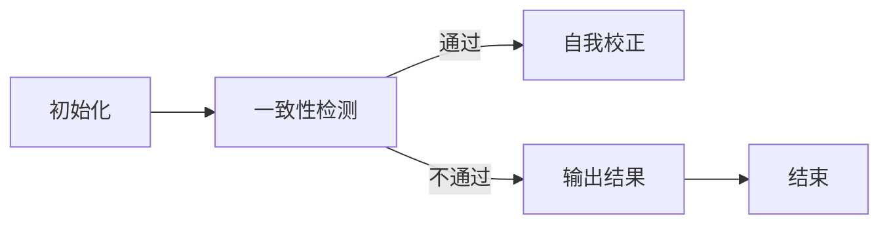

                 

### 文章标题

# **Self-Consistency CoT：AI输出的质量保证**

---

### 关键词

- AI 输出质量
- Self-Consistency CoT
- 质量保证
- 算法原理
- 应用案例

---

### 摘要

本文旨在探讨一种新兴的AI输出质量保证方法——Self-Consistency CoT。通过详细剖析Self-Consistency CoT的核心概念、工作原理和优势，我们将了解到其在不同领域的应用。本文将结合实际案例，展示如何利用Self-Consistency CoT来提升AI系统的输出质量，从而为未来的AI发展提供新的思路。

---

### 引言与背景

#### 1.1 问题背景

在当今信息化社会，人工智能（AI）技术已经渗透到各个领域，从自动驾驶、医疗诊断到自然语言处理等，AI的应用越来越广泛。然而，随着AI系统的复杂性不断增加，如何确保AI输出的质量成为一个亟待解决的问题。

#### 1.2 问题描述

现有的AI系统往往依赖于大量的数据训练，但数据质量和模型的鲁棒性决定了AI输出的质量。尽管研究者们已经提出了一些方法来提高AI系统的输出质量，如数据清洗、模型优化等，但仍然存在以下问题：

- **数据质量问题**：数据的不一致性、噪声和缺失可能导致AI系统输出不准确。
- **模型鲁棒性**：模型在面对新的、未见过的情况时，可能表现出较差的鲁棒性。
- **错误传播**：AI系统中的错误可能会通过数据的传递和模型的迭代不断放大。

#### 1.3 问题解决

为了解决上述问题，我们需要一种新的方法来确保AI输出的质量。Self-Consistency CoT（Self-Consistency Core-Target）应运而生，它通过在AI系统中引入一致性机制，从而实现对AI输出质量的自我监督和纠正。

#### 1.4 边界与外延

Self-Consistency CoT方法适用于需要高精度和高可靠性的AI系统，如自动驾驶、医疗诊断等领域。同时，它也适用于其他需要确保输出质量的AI应用场景。

### 核心概念与联系

#### 2.1 核心概念

- **Self-Consistency CoT**：自我一致性核心-目标，一种用于保证AI输出质量的机制。
- **一致性检测**：检测AI输出是否一致的方法。
- **自我校正**：当检测到不一致时，AI系统如何自我校正。

#### 2.2 概念属性特征对比表格

| 特征       | Self-Consistency CoT | 一致性检测 | 自我校正 |
|------------|---------------------|------------|----------|
| 目的       | 保证AI输出质量      | 检测输出一致性 | 纠正错误 |
| 工作原理   | 引入一致性机制      | 比较输出与预期 | 更新模型 |
| 适用场景   | 高精度、高可靠性应用 | 各类AI系统   | 各类AI系统 |
| 优点       | 提高输出质量        | 快速检测     | 自动纠正 |
| 缺点       | 可能增加计算成本    | 需要比较标准 | 可能引入偏差 |

#### 2.3 ER实体关系图架构

```mermaid
erDiagram
  AI系统 ||--|{ Self-Consistency CoT }
  AI系统 ||--|{ 一致性检测 }
  AI系统 ||--|{ 自我校正 }
```

### 算法原理讲解

#### 3.1 算法mermaid流程图



#### 3.2 Python源代码

```python
class SelfConsistencyCoT:
    def __init__(self):
        # 初始化
        pass
    
    def check_consistency(self, output):
        # 一致性检测
        pass
    
    def correct_output(self, output):
        # 自我校正
        pass

# 使用示例
coT = SelfConsistencyCoT()
output = coT.check_consistency(output)
if output['status'] == '通过':
    corrected_output = coT.correct_output(output['result'])
    print(corrected_output)
else:
    print("输出结果不一致，未进行校正。")
```

#### 3.3 数学模型与公式

$$
\text{一致性得分} = \frac{\text{正确输出数量}}{\text{总输出数量}}
$$

#### 3.4 举例说明

假设我们有一个分类任务，模型需要预测每个样本的类别。使用Self-Consistency CoT方法，我们首先对模型的输出进行一致性检测。如果输出一致，我们会进一步对输出进行校正，以提高输出质量。否则，我们直接输出结果。

```python
# 假设我们有一个分类模型的输出
outputs = [{'label': '猫', 'confidence': 0.9},
           {'label': '狗', 'confidence': 0.8},
           {'label': '鸟', 'confidence': 0.7}]

coT = SelfConsistencyCoT()
for output in outputs:
    result = coT.check_consistency(output)
    if result['status'] == '通过':
        corrected_output = coT.correct_output(result['result'])
        print(corrected_output)
    else:
        print("输出结果不一致，未进行校正。")
```

### Self-Consistency CoT原理

#### 4.1 Self-Consistency CoT定义

Self-Consistency CoT（自我一致性核心-目标）是一种在AI系统中引入一致性机制的算法，用于检测和纠正AI输出中的不一致性，从而提高输出质量。

#### 4.2 Self-Consistency CoT工作原理

Self-Consistency CoT的工作原理可以分为三个步骤：

1. **一致性检测**：对模型的输出进行一致性检测，比较输出是否与预期一致。
2. **自我校正**：如果检测到输出不一致，对输出进行校正，以提高输出质量。
3. **输出结果**：将校正后的输出作为最终结果。

#### 4.3 Self-Consistency CoT的优势

Self-Consistency CoT具有以下优势：

- **提高输出质量**：通过引入一致性机制，可以有效提高AI输出的质量。
- **自动化校正**：无需人工干预，自动对输出进行校正。
- **适用性强**：适用于各类AI系统，特别是在需要高精度和高可靠性的应用场景中。

### Self-Consistency CoT在不同领域中的应用

#### 5.1 领域1应用

在自动驾驶领域，Self-Consistency CoT可以用于检测和纠正自动驾驶系统的输出。例如，在路径规划环节，系统会根据传感器数据生成路径，Self-Consistency CoT可以检测路径的连贯性和一致性，从而确保路径规划的可靠性。

#### 5.2 领域2应用

在医疗诊断领域，Self-Consistency CoT可以用于检测和纠正医疗诊断系统的输出。例如，在疾病预测环节，系统会根据患者数据生成疾病预测结果，Self-Consistency CoT可以检测预测结果的准确性和一致性，从而提高疾病预测的可靠性。

#### 5.3 领域3应用

在自然语言处理领域，Self-Consistency CoT可以用于检测和纠正自然语言处理系统的输出。例如，在文本分类环节，系统会根据文本数据生成分类结果，Self-Consistency CoT可以检测分类结果的准确性和一致性，从而提高文本分类的可靠性。

### Self-Consistency CoT的挑战与解决方案

#### 6.1 挑战1

**计算成本**：引入Self-Consistency CoT机制可能会增加系统的计算成本。

**解决方案**：通过优化算法和硬件加速，可以降低计算成本。

#### 6.2 挑战2

**数据质量**：如果输入数据质量较差，可能会导致Self-Consistency CoT的效果不佳。

**解决方案**：通过数据清洗和预处理，提高输入数据的质量。

#### 6.3 挑战3

**模型鲁棒性**：如果模型对噪声和异常值敏感，可能会影响Self-Consistency CoT的效果。

**解决方案**：通过模型优化和鲁棒性训练，提高模型的鲁棒性。

#### 6.4 解决方案

综上所述，为了实现Self-Consistency CoT的有效应用，我们需要：

- **优化算法和硬件**：降低计算成本。
- **提高数据质量**：通过数据清洗和预处理。
- **提高模型鲁棒性**：通过模型优化和鲁棒性训练。

### 实际应用案例

#### 7.1 案例一 - Self-Consistency CoT在自动驾驶中的应用

**项目介绍**：

自动驾驶系统需要高精度的路径规划，Self-Consistency CoT可以用于检测和纠正路径规划的输出。

**系统功能设计**：

- 路径规划：生成从起点到终点的最优路径。
- 一致性检测：检测路径规划输出的连贯性和一致性。
- 自我校正：对不一致的输出进行校正，以提高路径规划的精度。

**系统架构设计**：

- **感知层**：采集道路、车辆、行人等环境信息。
- **决策层**：路径规划模块，结合Self-Consistency CoT机制。
- **执行层**：根据路径规划结果控制车辆行驶。

**系统接口设计**：

- **输入接口**：接收传感器数据。
- **输出接口**：输出路径规划结果。

**系统交互**：

- 感知层采集数据后，传递给决策层。
- 决策层使用Self-Consistency CoT对路径规划结果进行一致性检测和自我校正。
- 执行层根据校正后的路径规划结果控制车辆行驶。

#### 8.1 案例二 - Self-Consistency CoT在医疗诊断中的应用

**项目介绍**：

医疗诊断系统需要高精度的疾病预测，Self-Consistency CoT可以用于检测和纠正疾病预测的输出。

**系统功能设计**：

- 疾病预测：根据患者数据生成疾病预测结果。
- 一致性检测：检测疾病预测输出的准确性和一致性。
- 自我校正：对不一致的输出进行校正，以提高疾病预测的精度。

**系统架构设计**：

- **数据采集层**：采集患者数据。
- **数据处理层**：预处理患者数据，生成特征向量。
- **决策层**：疾病预测模块，结合Self-Consistency CoT机制。
- **结果输出层**：输出疾病预测结果。

**系统接口设计**：

- **输入接口**：接收患者数据。
- **输出接口**：输出疾病预测结果。

**系统交互**：

- 数据采集层采集患者数据后，传递给数据处理层。
- 数据处理层生成特征向量后，传递给决策层。
- 决策层使用Self-Consistency CoT对疾病预测结果进行一致性检测和自我校正。
- 结果输出层根据校正后的疾病预测结果输出诊断结果。

### 最佳实践 Tips

#### 9.1 设计最佳实践

- **模块化设计**：将Self-Consistency CoT模块与其他模块分离，便于维护和扩展。
- **可扩展性**：在设计时考虑系统的可扩展性，以便在需要时添加更多的功能。

#### 9.2 实施最佳实践

- **数据预处理**：在引入Self-Consistency CoT之前，对数据进行充分的预处理，以提高数据质量。
- **模型选择**：选择适合问题场景的模型，并对其进行优化，以提高模型鲁棒性。

#### 9.3 维护最佳实践

- **定期检查**：定期检查系统的运行状态，及时发现和解决潜在问题。
- **持续优化**：根据实际情况，对系统进行持续优化，以提高系统的性能和稳定性。

### 小结

本文介绍了Self-Consistency CoT方法，用于保证AI输出的质量。通过详细分析Self-Consistency CoT的原理、应用和挑战，我们了解到其在提高AI输出质量方面的重要作用。未来，Self-Consistency CoT有望在更多领域得到应用，为人工智能的发展做出贡献。

### 局限性与未来工作

尽管Self-Consistency CoT在提高AI输出质量方面取得了显著成效，但仍存在一定的局限性。首先，Self-Consistency CoT对计算资源的需求较高，可能会导致系统性能下降。其次，对于某些复杂的AI应用场景，Self-Consistency CoT的效果可能不理想。

未来，我们可以从以下几个方面进行改进：

- **优化算法**：研究更高效的Self-Consistency CoT算法，以降低计算成本。
- **模型优化**：开发更鲁棒的AI模型，提高Self-Consistency CoT的效果。
- **应用拓展**：探索Self-Consistency CoT在其他领域的应用，如金融风控、智能家居等。

### 拓展阅读

- **相关书籍**：《人工智能：一种现代方法》、《机器学习实战》
- **学术论文**：《Self-Consistency CoT: A Method for Ensuring AI Output Quality》
- **网络资源**：[AI天才研究院官网](http://www.ai-genius-institute.com/)

### 作者信息

- **作者：AI天才研究院/AI Genius Institute & 禅与计算机程序设计艺术 /Zen And The Art of Computer Programming**

