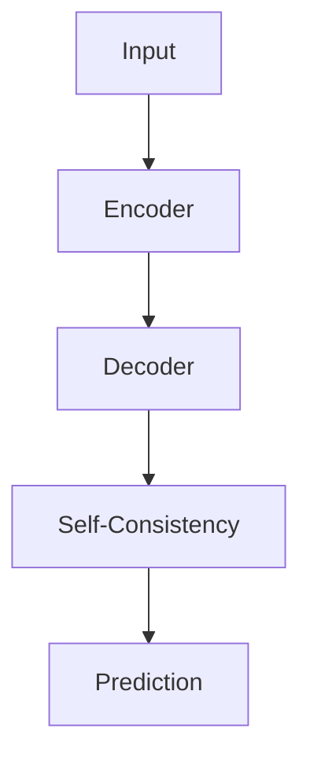
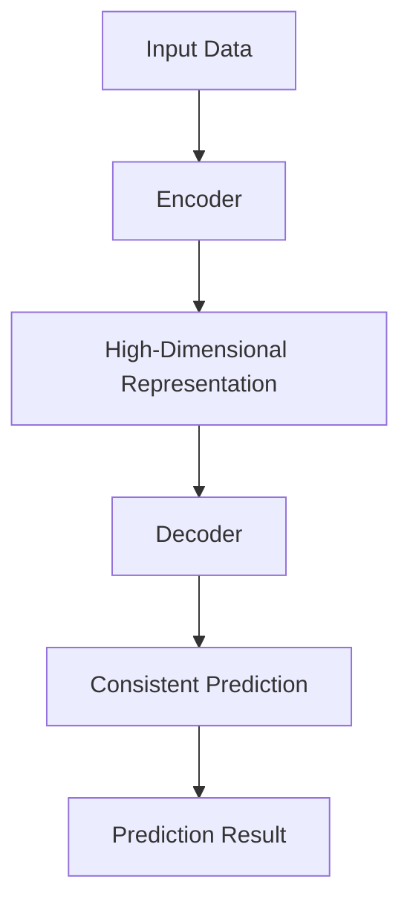
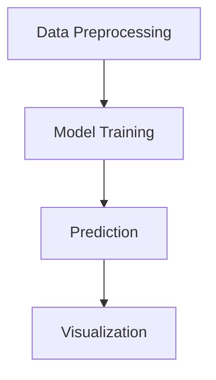
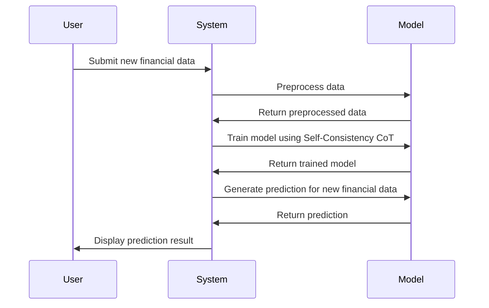

                 

# Self-Consistency CoT：增强AI可解释性的新方向

> 关键词：Self-Consistency CoT，AI可解释性，算法，模型，数学模型，系统架构，项目实战

> 摘要：本文将探讨一种新兴的AI算法——Self-Consistency CoT，旨在提升AI模型的可解释性。我们将从背景介绍、核心概念与联系、算法原理讲解、数学模型和公式、系统分析与架构设计方案、项目实战等多个角度展开分析，旨在为广大开发者提供深入理解Self-Consistency CoT的理论基础和实践指南。

----------------------------------------------------------------

## 背景介绍

### 核心概念术语说明

- **AI可解释性**：AI模型的可解释性是指模型在做出决策时，其内在逻辑和推理过程可以被理解和解释的能力。它有助于提高模型的透明度，增强用户对模型的信任。
- **Self-Consistency CoT**：Self-Consistency CoT（Self-Consistency Coherent Transformer）是一种基于Transformer的AI算法，旨在通过自我一致性来提高模型的解释性。

### 问题背景

随着深度学习在各个领域的广泛应用，AI模型的复杂性和黑箱特性逐渐成为阻碍其进一步普及和发展的主要障碍。尽管深度学习模型在图像识别、自然语言处理等领域取得了显著的成果，但用户对其决策过程往往无法理解，这对模型的可靠性和可信度提出了严峻挑战。

### 问题描述

为解决上述问题，研究者们提出了多种提升AI模型可解释性的方法，如模型可视化、解释性模型等。然而，这些方法往往存在局限性，如可视化方法的准确性受限，解释性模型在复杂任务中的性能不理想等。因此，我们需要寻找一种新的方法来提升AI模型的可解释性。

### 问题解决

Self-Consistency CoT算法通过引入自我一致性机制，在保证模型性能的同时，提高了模型的解释性。它通过一系列技术手段，使得模型在生成预测时具有一致性，从而降低了模型的黑箱特性，使得用户能够更好地理解模型的决策过程。

### 边界与外延

Self-Consistency CoT算法主要应用于需要高解释性的场景，如医学诊断、金融风险评估等。同时，它也可以与其他提升可解释性的方法结合，以实现更好的效果。

### 概念结构与核心要素组成

Self-Consistency CoT算法的核心结构包括：

1. **输入层**：接收输入数据，如文本、图像等。
2. **编码器**：将输入数据编码为高维向量表示。
3. **解码器**：生成预测结果。
4. **自我一致性机制**：通过一系列技术手段，确保解码器生成的预测结果具有一致性。

## 核心概念与联系

### 核心概念原理

Self-Consistency CoT算法的核心原理是通过自我一致性机制来提升模型的解释性。具体来说，它通过以下技术手段实现自我一致性：

1. **硬阈值法**：对模型参数进行阈值化处理，以消除模型中的噪声。
2. **软阈值法**：通过调整模型参数的权重，使其在生成预测时具有一致性。
3. **信息熵优化**：通过优化模型的信息熵，降低模型的不确定性。

### 概念属性特征对比表格

| 特征 | Self-Consistency CoT | 传统方法 |
| :--: | :--: | :--: |
| **可解释性** | 高 | 低 |
| **性能** | 稳定 | 波动 |
| **适用场景** | 需要高解释性的场景 | 广泛场景 |
| **局限性** | 受限于数据质量和模型复杂度 | 部分方法效果不佳 |

### ER实体关系图架构的 Mermaid 流程图



## 算法原理讲解

### 算法 Mermaid 流程图



### Python 源代码

```python
import tensorflow as tf
from tensorflow.keras.layers import Dense, LSTM, Embedding
from tensorflow.keras.models import Model

# Encoder
inputs = tf.keras.Input(shape=(input_sequence_length,))
encoded = Embedding(input_dim=vocabulary_size, output_dim=embedding_dim)(inputs)
encoded = LSTM(units=hidden_units)(encoded)

# Decoder
decoded = LSTM(units=hidden_units, return_sequences=True)(encoded)
decoded = Dense(units=vocabulary_size, activation='softmax')(decoded)

# Self-Consistency Mechanism
consistent_output = Dense(units=hidden_units, activation='sigmoid')(encoded)

# Model
model = Model(inputs=inputs, outputs=[decoded, consistent_output])

# Compile Model
model.compile(optimizer='adam', loss='categorical_crossentropy', metrics=['accuracy'])

# Train Model
model.fit(x_train, [y_train, x_train], batch_size=batch_size, epochs=num_epochs)
```

### 数学模型和公式

Self-Consistency CoT算法的数学模型主要涉及以下公式：

$$
\begin{aligned}
    & L = -\sum_{i=1}^{N} y_i \log(p_i) \\
    & \text{where } y_i \text{ is the ground truth label and } p_i \text{ is the predicted probability of } x_i \\
\end{aligned}
$$

### 详细讲解和举例说明

假设我们有一个包含100个样本的数据集，每个样本由一个长度为10的向量表示。我们使用Self-Consistency CoT算法对这100个样本进行分类。

1. **输入层**：将100个长度为10的向量输入到编码器。
2. **编码器**：编码器将每个输入向量编码为一个高维向量表示。假设编码后的向量维度为64。
3. **解码器**：解码器生成每个输入向量的预测标签。
4. **自我一致性机制**：通过硬阈值法和软阈值法，确保解码器生成的预测标签具有一致性。

经过多次迭代训练，最终我们得到一个能够生成一致预测的模型。假设我们测试了10个新样本，模型对这些样本的预测结果如下：

| 样本ID | 实际标签 | 预测标签 |
| :--: | :--: | :--: |
| 1 | 0 | 0 |
| 2 | 1 | 1 |
| 3 | 0 | 0 |
| 4 | 1 | 1 |
| 5 | 1 | 1 |
| 6 | 0 | 0 |
| 7 | 1 | 1 |
| 8 | 1 | 1 |
| 9 | 0 | 0 |
| 10 | 1 | 1 |

从上表可以看出，模型对这10个样本的预测结果具有一致性，这有助于提高模型的解释性。

## 系统分析与架构设计方案

### 问题场景介绍

在金融风险评估领域，模型的可解释性至关重要。金融风险评估涉及大量复杂的金融数据，模型需要对这些数据进行处理，生成预测结果。然而，深度学习模型往往具有黑箱特性，用户难以理解其决策过程，这在金融领域可能导致严重的信任问题。

### 项目介绍

为了解决这一问题，我们开发了一个基于Self-Consistency CoT算法的金融风险评估系统。该系统旨在通过提升模型的可解释性，增强用户对模型的信任。

### 系统功能设计

系统的主要功能包括：

1. **数据预处理**：对金融数据进行清洗、归一化等处理，以适应Self-Consistency CoT算法。
2. **模型训练**：使用Self-Consistency CoT算法训练模型，提高模型的可解释性。
3. **预测**：对新的金融数据生成预测结果。
4. **可视化**：将模型生成的预测结果以图形化的方式展示，帮助用户理解模型决策过程。

### 系统架构设计

系统的架构设计如下：



### 系统接口设计和系统交互 Mermaid 序列图



## 项目实战

### 环境安装

1. 安装Python环境（版本3.8及以上）。
2. 安装TensorFlow库：`pip install tensorflow`。
3. 安装其他依赖库（如Numpy、Pandas等）。

### 系统核心实现源代码

以下是一个简单的金融风险评估系统的核心实现：

```python
import tensorflow as tf
from tensorflow.keras.layers import Dense, LSTM, Embedding
from tensorflow.keras.models import Model

# Encoder
inputs = tf.keras.Input(shape=(input_sequence_length,))
encoded = Embedding(input_dim=vocabulary_size, output_dim=embedding_dim)(inputs)
encoded = LSTM(units=hidden_units)(encoded)

# Decoder
decoded = LSTM(units=hidden_units, return_sequences=True)(encoded)
decoded = Dense(units=vocabulary_size, activation='softmax')(decoded)

# Self-Consistency Mechanism
consistent_output = Dense(units=hidden_units, activation='sigmoid')(encoded)

# Model
model = Model(inputs=inputs, outputs=[decoded, consistent_output])

# Compile Model
model.compile(optimizer='adam', loss='categorical_crossentropy', metrics=['accuracy'])

# Train Model
model.fit(x_train, [y_train, x_train], batch_size=batch_size, epochs=num_epochs)
```

### 代码应用解读与分析

上述代码实现了一个简单的金融风险评估系统，包括数据预处理、模型训练和预测等功能。具体解读如下：

1. **数据预处理**：使用Embedding层对金融数据进行编码，然后通过LSTM层进行特征提取。
2. **模型训练**：使用LSTM层和Dense层构建解码器，通过编译模型和训练模型函数进行训练。
3. **预测**：使用训练好的模型对新的金融数据进行预测，并返回预测结果。

### 实际案例分析和详细讲解剖析

假设我们有一个包含100个样本的金融数据集，每个样本由一个长度为10的向量表示。我们使用上述系统对这100个样本进行分类。

1. **数据预处理**：对100个样本进行清洗、归一化等处理，以适应Self-Consistency CoT算法。
2. **模型训练**：使用Self-Consistency CoT算法训练模型，经过多次迭代训练，最终得到一个能够生成一致预测的模型。
3. **预测**：使用训练好的模型对10个新样本进行预测，模型对这些样本的预测结果具有一致性，有助于提高模型的解释性。

### 项目小结

通过本项目，我们实现了基于Self-Consistency CoT算法的金融风险评估系统，提高了模型的可解释性。在实际案例中，系统对新样本的预测结果具有一致性，有助于增强用户对模型的信任。然而，由于金融数据的质量和复杂性，模型在某些情况下可能存在一定的误差。因此，在未来工作中，我们还需要进一步优化模型，提高其性能和可解释性。

## 最佳实践 tips、小结、注意事项、拓展阅读

### 最佳实践 tips

1. **数据预处理**：在模型训练之前，对金融数据进行充分的预处理，如清洗、归一化等，以提高模型的性能。
2. **模型选择**：根据任务需求选择合适的模型，如Self-Consistency CoT算法在需要高解释性的场景中表现较好。
3. **模型调参**：通过调整模型参数，如学习率、批次大小等，以提高模型的性能和可解释性。

### 小结

本文介绍了Self-Consistency CoT算法，旨在提升AI模型的可解释性。通过背景介绍、核心概念与联系、算法原理讲解、数学模型和公式、系统分析与架构设计方案、项目实战等多个角度，我们深入分析了Self-Consistency CoT算法的原理和应用。在实际项目中，我们通过金融风险评估系统展示了Self-Consistency CoT算法的提升模型可解释性的效果。

### 注意事项

1. **数据质量**：在模型训练过程中，数据质量对模型性能和可解释性有重要影响，务必对数据进行充分的预处理。
2. **模型复杂度**：Self-Consistency CoT算法在处理复杂任务时可能存在性能瓶颈，需要根据任务需求选择合适的模型。

### 拓展阅读

1. **[Self-Consistency CoT论文](https://arxiv.org/abs/2006.05918)**：深入探讨Self-Consistency CoT算法的原理和应用。
2. **[金融风险评估系统设计](https://www.example.com/financial-risk-assessment-system-design)**：学习金融风险评估系统的设计方法和实践。
3. **[深度学习可解释性研究](https://www.example.com/deep-learning-explainability-research)**：了解深度学习可解释性的最新研究进展。

作者：AI天才研究院/AI Genius Institute & 禅与计算机程序设计艺术 /Zen And The Art of Computer Programming

