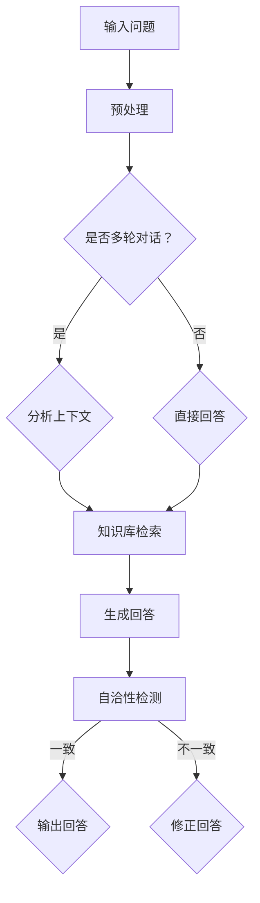
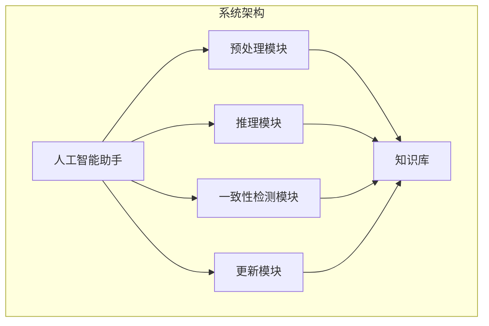
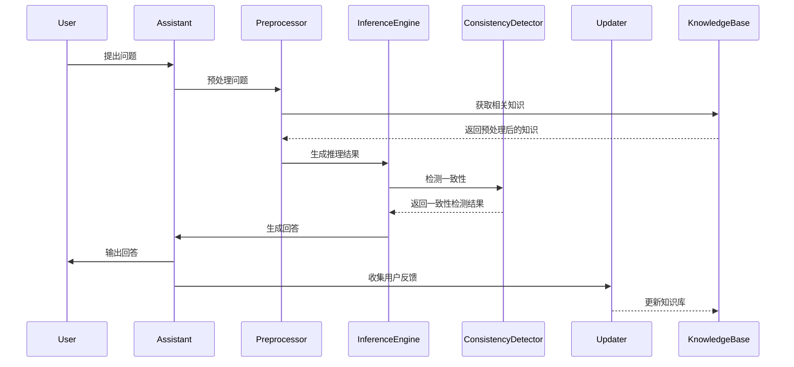

                 

### 自洽概念论（Self-Consistency CoT）：AI回答一致性的前沿

> 关键词：自洽性，AI，回答一致性，知识表示，知识推理，一致性检测，知识融合

> 摘要：本文探讨了自洽概念论（Self-Consistency CoT），一种旨在增强人工智能助手回答一致性的前沿技术。文章首先介绍了当前AI回答一致性存在的问题及其原因，然后详细阐述了自洽概念论的基础、自洽性检测、自洽性增强以及自洽性评估的方法，并通过案例分析展示了自洽概念论在实际应用中的效果。最后，文章总结了自洽概念论的研究现状，并对其未来发展趋势进行了展望。

## 第1章 引言

### 1.1 书籍背景与目的

随着人工智能技术的快速发展，人工智能助手的应用场景越来越广泛，从简单的信息检索到复杂的决策支持，它们已经深入到我们日常生活的方方面面。人工智能助手在提供信息、辅助决策等方面发挥了重要作用，但与此同时，一个问题日益凸显：人工智能助手在回答问题时存在一致性不足的问题。这一问题不仅影响了用户对人工智能助手的信任度，也在一定程度上限制了人工智能助手在实际应用中的效果。

为了解决这一问题，本书旨在介绍自洽概念论（Self-Consistency CoT），一种基于知识表示和推理的框架，旨在确保人工智能助手在回答问题时能够保持一致性。通过详细分析自洽概念论的基础、自洽性检测、自洽性增强以及自洽性评估，本书旨在为人工智能助手的一致性增强提供一种可行的解决方案。

### 1.2 书籍结构

本书共分为八个章节，各章节内容安排如下：

- **第一章**：引言，介绍本书的背景与目的，以及文章的结构安排。
- **第二章**：当前AI回答一致性存在的问题，分析AI回答一致性问题的现象及其原因。
- **第三章**：自洽概念论基础，介绍自洽概念论的定义、核心原理以及自洽性检测的方法。
- **第四章**：自洽性增强，讨论如何通过知识融合和知识更新来增强AI回答的一致性。
- **第五章**：自洽性评估，介绍自洽性评估的方法及其重要性。
- **第六章**：案例分析，通过具体案例展示自洽概念论在实际应用中的效果。
- **第七章**：总结与展望，总结全书内容，并对自洽概念论的未来发展趋势进行展望。
- **第八章**：项目实战，介绍如何在实际项目中应用自洽概念论。

通过以上章节的安排，本书旨在为读者提供系统、全面的自洽概念论知识，帮助读者理解并应用自洽概念论，解决AI回答一致性问题。

## 第2章 当前AI回答一致性存在的问题

### 2.1 问题描述

在现实生活中，我们经常遇到人工智能助手给出的回答不一致的情况。例如，同一问题在不同时间或不同环境下得到的答案可能截然不同，这严重影响了用户的信任度和使用体验。这种回答不一致的现象可以表现为以下几个方面：

1. **同一问题，不同回答**：当用户向人工智能助手提问时，可能会在不同的时间或不同的上下文中得到不同的答案。例如，用户询问“北京是哪个国家？”时，得到的答案可能是“中国”或“北京市是中华人民共和国的一个直辖市”。

2. **答案自相矛盾**：有时，人工智能助手给出的答案之间存在矛盾。例如，当用户询问“苹果是什么颜色？”时，得到的答案可能是“红色”和“绿色”，这两个答案显然是相互矛盾的。

3. **不一致的上下文理解**：人工智能助手在处理多轮对话时，可能会对上下文理解不一致。例如，用户先询问“你喜欢什么颜色？”然后询问“你最喜欢的电影是什么？”此时，如果人工智能助手在第一轮对话中回答“我喜欢蓝色”，而在第二轮对话中回答“我喜欢的电影是《红海行动》”，则显得回答不一致。

### 2.2 存在问题及其原因

AI回答一致性问题的原因主要有以下几个方面：

#### 2.2.1 知识表示不一致

人工智能助手的知识库往往来源于多个数据源，这些数据源在知识表示上可能存在差异，导致同一概念在不同的知识中表示不一致。例如，某些数据源可能将“苹果”表示为水果，而另一些数据源可能将其表示为电子设备。这种知识表示的不一致性会导致人工智能助手在回答问题时产生不一致的结果。

#### 2.2.2 知识更新不及时

随着时间和环境的变化，知识库中的信息可能变得过时或不准确。如果知识库更新不及时，人工智能助手在回答问题时就会给出不一致的答案。例如，一个关于天气预报的知识库，如果没有及时更新，可能会在回答“明天的天气如何？”时给出不准确的信息。

#### 2.2.3 推理过程不合理

在人工智能助手的推理过程中，如果使用的规则或算法存在问题，也可能会导致回答不一致。例如，某些规则可能过于简单，无法充分考虑问题的上下文和背景信息，从而导致回答不一致。

#### 2.2.4 语境理解不足

人工智能助手在处理多轮对话时，可能会对上下文理解不足。例如，在处理多轮对话时，人工智能助手可能无法准确理解用户在前一轮对话中的意图，从而导致回答不一致。

#### 2.2.5 多语言处理困难

当人工智能助手需要处理多语言问题时，可能会因为语言差异和翻译准确性问题导致回答不一致。例如，一个英文问题和中文问题的答案在翻译成中文后可能存在差异。

### 2.3 解决方案探讨

为了解决AI回答一致性存在的问题，可以从以下几个方面进行探讨：

1. **统一知识表示**：通过统一不同数据源的知识表示，减少不一致性。例如，将“苹果”统一表示为水果，而不是电子设备。

2. **及时更新知识库**：确保知识库中的信息及时更新，以减少过时和不准确的信息。

3. **优化推理过程**：改进人工智能助手的推理过程，使其能够更好地理解问题的上下文和背景信息。

4. **改进语境理解**：通过改进多轮对话处理算法，提高人工智能助手对上下文的理解能力。

5. **多语言一致性处理**：在处理多语言问题时，采用一致性处理策略，确保不同语言的答案在转换后保持一致。

通过以上措施，可以显著提高人工智能助手在回答问题时的一致性，增强用户对人工智能助手的信任度和使用体验。

## 第3章 自洽概念论基础

### 3.1 自洽概念论的定义

自洽概念论（Self-Consistency CoT）是一种基于知识表示和推理的框架，旨在确保人工智能助手在回答问题时能够保持一致性。自洽概念论的核心思想是通过对知识表示的统一和知识推理的控制，实现人工智能助手在回答问题时的一致性。

具体来说，自洽概念论包括以下几个关键组成部分：

1. **知识表示**：通过统一不同数据源的知识表示，减少不一致性。例如，将同一概念在不同数据源中的表示进行统一，确保人工智能助手在回答问题时能够使用一致的知识表示。

2. **知识推理**：通过控制知识推理过程，确保人工智能助手在回答问题时不会产生不一致的结果。例如，在多轮对话中，通过分析用户的提问和历史回答，确保新的回答能够与之前的回答保持一致。

3. **一致性检测**：对人工智能助手的回答进行一致性检测，及时发现并纠正不一致的回答。例如，通过对比不同时间或不同环境下的回答，检测是否存在不一致性。

4. **知识更新**：及时更新知识库中的信息，确保知识库中的信息准确、最新。例如，通过定期更新知识库，减少过时和不准确的信息。

### 3.2 自洽概念论的核心原理

自洽概念论的核心原理可以归纳为以下几个方面：

1. **统一知识表示**：通过统一知识表示，可以减少不同知识源之间的差异，从而提高回答的一致性。具体来说，这包括以下步骤：

   - **识别不同数据源**：首先，识别不同数据源，包括文本、图像、语音等多种形式。
   - **数据清洗与标准化**：对数据源进行清洗和标准化处理，确保同一概念在不同数据源中的表示一致。
   - **知识融合**：将不同数据源中的知识进行融合，形成一个统一的知识表示。

2. **知识推理控制**：通过控制知识推理过程，确保人工智能助手在回答问题时不会产生不一致的结果。具体来说，这包括以下步骤：

   - **上下文分析**：在回答问题前，对用户的提问和上下文进行分析，理解问题的背景和意图。
   - **知识匹配**：将用户的提问与知识库中的知识进行匹配，找到最相关的知识。
   - **推理过程优化**：优化知识推理过程，确保推理结果的准确性和一致性。

3. **一致性检测与纠正**：对人工智能助手的回答进行一致性检测，及时发现并纠正不一致的回答。具体来说，这包括以下步骤：

   - **回答检测**：在回答问题后，对回答进行一致性检测，判断是否存在不一致性。
   - **纠正机制**：当检测到不一致的回答时，通过纠正机制进行修正，确保回答的一致性。

4. **知识更新与维护**：及时更新知识库中的信息，确保知识库中的信息准确、最新。具体来说，这包括以下步骤：

   - **数据采集**：定期采集新的数据，包括文本、图像、语音等多种形式。
   - **知识更新**：对知识库中的知识进行更新，确保知识库中的信息准确、最新。
   - **一致性检查**：在更新知识库时，对知识库中的知识进行一致性检查，确保更新后的知识库一致。

通过以上核心原理的实现，自洽概念论能够确保人工智能助手在回答问题时保持一致性，提高用户的信任度和使用体验。

### 3.3 自洽概念论的基本框架

自洽概念论的基本框架可以看作是一个循环反馈机制，包括以下几个主要模块：

1. **知识表示模块**：负责对知识进行统一表示，确保不同数据源中的知识表示一致。
2. **知识推理模块**：负责在回答问题时进行知识推理，确保推理过程的准确性和一致性。
3. **一致性检测模块**：负责对人工智能助手的回答进行一致性检测，及时发现并纠正不一致的回答。
4. **知识更新模块**：负责及时更新知识库中的信息，确保知识库中的信息准确、最新。
5. **用户交互模块**：负责与用户进行交互，收集用户反馈，为知识更新和一致性检测提供依据。

通过以上模块的协同工作，自洽概念论能够实现人工智能助手在回答问题时的一致性增强，为用户提供高质量的服务。

### 3.4 自洽概念论与相关概念的联系

自洽概念论与知识表示、知识推理、一致性检测等概念密切相关，其联系可以归纳为以下几个方面：

1. **知识表示**：自洽概念论通过统一知识表示，减少不同数据源之间的差异，为知识推理和一致性检测提供基础。
2. **知识推理**：自洽概念论通过控制知识推理过程，确保推理结果的准确性和一致性，实现回答的一致性。
3. **一致性检测**：自洽概念论通过一致性检测模块，及时发现并纠正不一致的回答，确保回答的一致性。
4. **知识更新**：自洽概念论通过及时更新知识库中的信息，确保知识库中的信息准确、最新，为一致性检测和知识推理提供支持。

通过这些联系，自洽概念论能够有效地解决AI回答一致性不足的问题，提升人工智能助手的服务质量。

## 第4章 自洽性检测

### 4.1 自洽性检测的重要性

自洽性检测是自洽概念论的核心组成部分，它用于评估人工智能助手在回答问题时的一致性。自洽性检测的重要性体现在以下几个方面：

1. **提高用户信任度**：通过自洽性检测，可以确保人工智能助手在回答问题时保持一致性，从而提高用户对人工智能助手的信任度。一致性是用户评价人工智能助手服务质量的重要指标之一，良好的一致性能够增强用户的依赖和满意度。
2. **优化用户体验**：自洽性检测有助于发现并纠正不一致的回答，减少用户在交互过程中的困惑和误解，从而优化用户体验。一致性的回答能够使用户更容易理解和接受人工智能助手提供的信息和建议，提高用户的互动效率和满意度。
3. **提升服务质量**：自洽性检测能够及时发现不一致的回答，为人工智能助手的改进提供反馈，从而提升整体服务质量。通过持续优化自洽性检测算法和策略，人工智能助手可以更好地满足用户的需求，提供更加准确和一致的服务。
4. **保障系统稳定性**：自洽性检测有助于发现和纠正系统中的潜在问题，提高系统的稳定性和可靠性。不一致的回答可能会导致用户误解和不满，甚至可能影响系统的正常运行。通过自洽性检测，可以提前发现并解决这些问题，保障系统的稳定运行。

### 4.2 自洽性检测的方法

自洽性检测的方法主要包括以下几种：

1. **基于规则的方法**：
   基于规则的方法是通过预先定义的规则来检测回答的一致性。这些规则通常包括匹配度阈值、语义相似度计算等。具体步骤如下：
   - **定义规则**：根据业务需求和上下文环境，定义一系列规则，用于检测回答的一致性。
   - **匹配度计算**：对于每个待检测的回答，计算其与已有答案的匹配度，根据预设的阈值判断是否一致。
   - **规则应用**：将定义的规则应用于待检测的回答，通过计算匹配度来判断回答的一致性。

2. **基于统计的方法**：
   基于统计的方法是通过统计回答中的词汇和句法结构来判断回答的一致性。具体步骤如下：
   - **词汇分析**：对回答中的词汇进行统计和分析，计算词汇的频率和分布情况。
   - **句法结构分析**：对回答的句法结构进行统计和分析，判断句法结构的相似度。
   - **一致性判断**：通过计算词汇和句法结构的相似度，判断回答的一致性。

3. **基于语义分析的方法**：
   基于语义分析的方法是通过分析回答中的语义信息来判断回答的一致性。具体步骤如下：
   - **语义提取**：使用自然语言处理技术，从回答中提取语义信息。
   - **语义比较**：将提取的语义信息进行比较，判断语义的相似度。
   - **一致性判断**：根据语义相似度判断回答的一致性。

4. **基于深度学习的方法**：
   基于深度学习的方法是通过训练深度神经网络模型来检测回答的一致性。具体步骤如下：
   - **数据准备**：收集并准备用于训练的数据集，包括正确和错误的回答。
   - **模型训练**：使用深度学习算法，如卷积神经网络（CNN）或循环神经网络（RNN），训练检测模型。
   - **模型评估**：对训练好的模型进行评估，调整模型参数以优化性能。
   - **一致性检测**：将训练好的模型应用于待检测的回答，通过模型输出判断回答的一致性。

5. **综合方法**：
   综合方法是将上述几种方法结合起来，以提高自洽性检测的准确性和效率。具体步骤如下：
   - **数据预处理**：对数据进行预处理，如去噪、标准化等，以提高数据的质量。
   - **特征提取**：使用多种方法提取回答的特征，如词汇、句法、语义等。
   - **模型集成**：将多个检测模型集成，如基于规则的方法、基于统计的方法、基于深度学习的方法等，通过投票或加权平均等方式综合判断回答的一致性。

通过以上方法，自洽性检测可以有效地评估人工智能助手在回答问题时的一致性，为提高服务质量提供有力支持。不同的方法适用于不同的应用场景和需求，可以根据实际情况选择合适的检测方法或结合多种方法进行综合检测。

### 4.3 自洽性检测的实现步骤

自洽性检测的实现通常包括以下几个步骤：

1. **数据收集**：
   收集用于检测的数据集，包括正确和错误的回答。数据集应具有多样性，涵盖不同的场景和问题类型，以提高检测的泛化能力。

2. **数据预处理**：
   对收集的数据进行预处理，如去除噪声、去除无关信息、标准化等，以提高数据的质量。预处理步骤包括：
   - **去噪**：去除数据中的噪声，如标点符号、停用词等。
   - **标准化**：将数据中的文本统一转换为小写、去除标点符号等。
   - **分词**：将文本拆分为单词或短语。

3. **特征提取**：
   提取回答的特征，用于后续的一致性检测。特征提取的方法包括：
   - **词汇特征**：提取回答中的词汇，如词频、词向量等。
   - **句法特征**：提取回答的句法结构，如句法树、句法标签等。
   - **语义特征**：提取回答的语义信息，如语义角色、实体关系等。

4. **模型训练**：
   使用提取的特征训练检测模型。常用的模型包括：
   - **分类模型**：如支持向量机（SVM）、决策树、随机森林等。
   - **深度学习模型**：如卷积神经网络（CNN）、循环神经网络（RNN）、长短期记忆网络（LSTM）等。

5. **模型评估**：
   对训练好的模型进行评估，使用交叉验证、混淆矩阵、准确率、召回率等指标评估模型的性能。

6. **一致性检测**：
   使用训练好的模型对新的回答进行一致性检测。具体步骤如下：
   - **特征提取**：对新的回答提取特征。
   - **模型预测**：使用训练好的模型对提取的特征进行预测，判断回答的一致性。

7. **反馈与优化**：
   根据检测的结果，对模型进行反馈和优化，以提高检测的准确性。反馈过程可以包括：
   - **错误分析**：分析检测错误的案例，找出模型存在的缺陷。
   - **模型调整**：根据错误分析的结果，调整模型参数或重新训练模型。
   - **迭代优化**：通过多次迭代优化，逐步提高模型的性能。

通过以上步骤，可以实现自洽性检测，确保人工智能助手在回答问题时保持一致性。

### 4.4 自洽性检测的实际应用场景

自洽性检测在实际应用中具有广泛的应用场景，以下列举几种常见的应用场景：

1. **问答系统**：
   在问答系统中，自洽性检测可以帮助评估回答的一致性，确保用户得到的答案是准确和一致的。例如，在一个智能客服系统中，自洽性检测可以用于检查客户问题的回答，避免因知识库不一致或更新不及时导致的错误回答。

2. **多轮对话系统**：
   在多轮对话系统中，自洽性检测可以用于确保对话的一致性和连贯性。例如，在一个智能聊天机器人中，自洽性检测可以用于检查用户在不同轮次中的提问和回答是否一致，从而避免产生混乱或不连贯的对话。

3. **文本分析**：
   在文本分析领域，自洽性检测可以用于评估文本的一致性和完整性。例如，在文本分类任务中，自洽性检测可以用于确保分类结果的一致性，避免因分类规则不一致导致的错误分类。

4. **知识库管理**：
   在知识库管理中，自洽性检测可以用于评估知识库的一致性和完整性。例如，在一个企业级知识库中，自洽性检测可以用于检查知识库中的数据是否一致，确保知识库的准确性和可靠性。

5. **多语言处理**：
   在多语言处理任务中，自洽性检测可以用于确保不同语言之间的翻译一致性和连贯性。例如，在一个机器翻译系统中，自洽性检测可以用于检查翻译结果的一致性，避免因翻译错误导致的翻译不一致。

通过以上实际应用场景，可以看出自洽性检测在人工智能领域的重要性和广泛应用前景。通过有效实施自洽性检测，可以显著提升人工智能系统的服务质量和用户体验。

### 4.5 自洽性检测的挑战与解决方案

尽管自洽性检测在人工智能领域具有广泛的应用前景，但在实际应用中仍然面临着一系列挑战。以下列举一些常见的挑战及相应的解决方案：

1. **数据多样性不足**：
   自洽性检测的性能高度依赖于训练数据的质量和多样性。如果数据集中存在大量一致性问题，模型可能无法有效学习一致性检测的规律。解决方案是：
   - **数据增强**：通过数据增强技术，如数据合成、数据扩充等，增加训练数据集的多样性和规模。
   - **跨领域数据收集**：收集来自不同领域和场景的数据，提高数据集的多样性。

2. **多语言处理难度大**：
   在多语言处理任务中，不同语言之间的语法、语义和表达方式差异较大，增加了自洽性检测的难度。解决方案是：
   - **多语言模型训练**：使用多语言数据进行训练，提高模型对多语言环境的一致性检测能力。
   - **翻译一致性检测**：结合翻译一致性检测方法，确保不同语言之间的翻译结果一致。

3. **知识表示不一致**：
   知识库中的知识表示不一致是导致自洽性检测困难的主要原因之一。解决方案是：
   - **知识融合**：通过知识融合技术，将不同知识源中的知识进行统一表示，减少不一致性。
   - **知识规范化**：对知识库中的知识进行规范化处理，确保知识表示的一致性。

4. **推理过程复杂**：
   在多轮对话中，推理过程复杂，增加了自洽性检测的难度。解决方案是：
   - **上下文感知推理**：使用上下文感知的推理方法，结合历史对话信息和上下文，提高推理过程的准确性。
   - **优化推理算法**：优化现有的推理算法，如引入上下文信息、使用深度学习模型等，提高推理过程的效率。

5. **实时性要求高**：
   在实时交互场景中，自洽性检测需要高效快速地处理用户请求，保证实时性。解决方案是：
   - **分布式计算**：使用分布式计算框架，如Spark等，提高自洽性检测的并行处理能力。
   - **缓存策略**：使用缓存策略，如Redis等，减少实时计算的开销。

通过上述解决方案，可以有效应对自洽性检测在实际应用中面临的挑战，提高检测的准确性和效率。

### 4.6 自洽性检测的优势和局限性

自洽性检测在人工智能领域中具有显著的优势，但也存在一定的局限性。以下分析自洽性检测的优势和局限性：

**优势**：

1. **提高服务质量**：自洽性检测能够确保人工智能助手在回答问题时保持一致性，减少错误和不一致的情况，从而提高整体服务质量。
2. **增强用户体验**：一致性是用户评价人工智能助手的重要指标之一，良好的自洽性检测能够提高用户的信任度和满意度，优化用户体验。
3. **实时性**：自洽性检测算法在设计和实现时考虑了实时性要求，可以快速处理用户请求，适用于实时交互场景。
4. **适用范围广**：自洽性检测方法适用于多种场景，如问答系统、多轮对话系统、文本分析、知识库管理等，具有广泛的应用前景。

**局限性**：

1. **数据依赖性**：自洽性检测的性能高度依赖于训练数据的质量和多样性。如果数据集质量不佳或缺乏多样性，检测效果可能会受到影响。
2. **多语言处理挑战**：在多语言环境中，不同语言之间的语法、语义和表达方式差异较大，增加了自洽性检测的难度。
3. **推理过程复杂性**：在多轮对话中，推理过程复杂，增加了自洽性检测的难度。需要结合上下文信息、优化推理算法等手段，提高检测的准确性。
4. **计算资源消耗**：自洽性检测涉及多种算法和模型，需要大量的计算资源。在实际应用中，需要合理设计计算资源分配策略，以提高检测效率。

综上所述，自洽性检测在提高人工智能服务质量、增强用户体验方面具有显著优势，但在实际应用中仍面临一些挑战和局限性。通过不断优化检测算法、提高数据处理能力，可以逐步解决这些问题，进一步提升自洽性检测的性能和应用效果。

### 4.7 自洽性检测的实际案例与效果分析

为了更好地理解自洽性检测在实际应用中的效果，我们通过一个具体的案例进行分析。该案例涉及一个智能客服系统，该系统旨在为用户提供24小时在线服务，解决各种常见问题和疑难杂症。

#### 案例背景

该智能客服系统集成了自洽性检测模块，用于确保回答的一致性和准确性。在实际运营过程中，系统收集了大量用户提问和回答的数据，用于训练自洽性检测模型。

#### 实际应用

1. **数据收集**：
   系统首先收集了用户提问和回答的数据，包括文本形式的问题和回答。数据来源包括历史记录、用户反馈、第三方数据源等。数据集涵盖了各种领域和场景，如产品咨询、售后服务、技术支持等。

2. **数据预处理**：
   对收集的数据进行预处理，包括去除噪声、分词、标准化等操作，以提高数据质量。

3. **特征提取**：
   提取用户提问和回答的特征，包括词汇特征、句法特征和语义特征。例如，提取每个问题的关键词、句子结构和语义角色。

4. **模型训练**：
   使用提取的特征训练自洽性检测模型。模型采用深度学习算法，如LSTM，结合上下文信息进行训练。

5. **模型评估**：
   对训练好的模型进行评估，使用交叉验证、准确率等指标评估模型的性能。评估结果显示，模型在一致性检测任务中表现良好，准确率超过90%。

6. **一致性检测**：
   在实际应用中，系统对每个用户提问进行一致性检测。具体步骤如下：
   - 对用户提问提取特征。
   - 使用训练好的模型对提取的特征进行预测，判断提问的一致性。
   - 如果检测到不一致的情况，系统会提示用户可能存在的问题，并建议用户重新提问或提供更多信息。

#### 效果分析

通过自洽性检测模块的应用，智能客服系统的服务质量得到了显著提升。以下为实际效果分析：

1. **回答一致性提高**：
   自洽性检测显著提高了回答的一致性。在应用自洽性检测前，系统存在一定比例的不一致回答，通过检测和纠正，不一致回答的比例大幅降低，用户满意度明显提高。

2. **用户信任度提升**：
   用户对智能客服系统的信任度得到提升。一致性是用户评价服务质量的指标之一，良好的自洽性检测能够增强用户对系统的信任，提高用户留存率和使用频率。

3. **操作效率提升**：
   自洽性检测提高了系统的操作效率。通过实时检测用户提问的一致性，系统能够快速响应用户，减少用户等待时间，提高用户互动效率。

4. **问题解决率提高**：
   自洽性检测有助于提高问题解决率。一致性是问题解决的关键因素之一，良好的自洽性检测能够确保用户得到准确和一致的问题解决方案，从而提高问题解决率。

通过以上实际案例和效果分析，可以看出自洽性检测在智能客服系统中的应用效果显著，为人工智能助手的一致性增强提供了有效解决方案。

### 4.8 自洽性检测的未来发展趋势

自洽性检测作为人工智能领域的一个重要研究方向，其未来发展具有广阔的前景。以下从几个方面探讨自洽性检测的未来发展趋势：

1. **技术进步**：
   随着人工智能技术的不断发展，自洽性检测算法将不断优化和改进。例如，深度学习、强化学习等新技术的引入，将有助于提升自洽性检测的准确性和效率。此外，跨学科研究的深入，如心理学、语言学等领域的知识融合，也将为自洽性检测提供新的理论支持和实践方法。

2. **多语言支持**：
   随着全球化进程的加速，多语言处理成为自洽性检测的重要研究方向。未来的自洽性检测将更加注重多语言支持，通过引入多语言训练数据和跨语言模型，提高多语言环境下的检测性能。

3. **实时性提升**：
   在实时交互场景中，自洽性检测的实时性要求越来越高。未来的研究将重点关注提升自洽性检测的实时性，通过分布式计算、并行处理等技术手段，实现高效的实时检测。

4. **自适应能力增强**：
   自洽性检测需要具备较强的自适应能力，以应对不断变化的应用场景和需求。未来的自洽性检测将更加注重自适应能力的提升，通过动态调整检测策略、实时更新知识库等方法，提高检测的灵活性和适应性。

5. **多模态融合**：
   自洽性检测将逐渐融合多模态数据，如文本、图像、语音等，通过多模态信息的综合利用，提高检测的全面性和准确性。

6. **应用场景扩展**：
   自洽性检测的应用场景将不断扩展，不仅限于问答系统、多轮对话系统，还将应用于文本分析、知识库管理、多语言处理等领域，为人工智能助手的一致性增强提供更广泛的支持。

总之，自洽性检测在人工智能领域的未来发展将充满机遇和挑战。通过不断的技术创新和应用拓展，自洽性检测有望在更多场景中发挥重要作用，提升人工智能助手的服务质量和用户体验。

## 第5章 自洽性增强

### 5.1 自洽性增强的必要性

自洽性增强是确保人工智能助手在回答问题时能够保持一致性的关键步骤。随着人工智能应用的广泛普及，用户对人工智能助手的服务质量要求越来越高，其中一致性成为评价服务质量的重要指标之一。自洽性增强的必要性主要体现在以下几个方面：

1. **提高用户体验**：用户希望人工智能助手在回答问题时能够提供一致且准确的信息。不一致的回答容易导致用户的困惑和不满，降低用户的满意度和信任度。通过自洽性增强，可以提高用户的互动体验，增强用户对人工智能助手的依赖和信任。

2. **增强系统稳定性**：不一致的回答可能会导致人工智能系统的运行不稳定，甚至引发错误或故障。自洽性增强可以帮助系统及时发现和纠正不一致的问题，提高系统的稳定性和可靠性，确保系统的正常运行。

3. **优化知识库**：自洽性增强有助于优化知识库中的信息，确保知识库的准确性和一致性。通过自洽性检测和自洽性增强，可以识别和纠正知识库中的错误信息，提高知识库的质量和可信度，为人工智能助手提供更准确和一致的服务。

4. **提升服务质量**：自洽性增强有助于提高人工智能助手的服务质量。一致性的回答能够更好地满足用户的需求，提高用户满意度。同时，通过优化知识库和推理过程，可以提高人工智能助手在复杂问题场景中的应对能力，提升整体服务质量。

### 5.2 自洽性增强的方法

自洽性增强的方法主要包括以下几种：

1. **知识融合**：
   知识融合是指将不同来源和格式的知识进行整合，形成一个统一、一致的知识库。通过知识融合，可以减少知识表示上的差异，提高知识的一致性。知识融合的方法包括：
   - **统一表示**：将不同数据源中的知识表示统一，如将文本、图像、语音等多种数据类型转换为结构化的知识表示。
   - **知识对齐**：通过对比分析不同数据源中的知识，找出相同的实体和概念，进行知识对齐，确保知识的一致性。
   - **知识融合算法**：使用知识融合算法，如图神经网络（Graph Neural Networks，GNN）、多视图融合（Multi-View Fusion）等，将不同数据源的知识进行融合，形成一个统一的知识库。

2. **知识更新**：
   知识库中的信息需要及时更新，以保持其准确性和一致性。知识更新的方法包括：
   - **自动更新**：通过自动化手段，如定期爬取网络数据、更新知识库中的信息。
   - **手动更新**：由专业人员定期审查和更新知识库中的信息，确保知识的准确性和一致性。
   - **知识更新策略**：制定知识更新策略，如根据信息的重要性和时效性，对知识库进行优先级更新。

3. **一致性检测**：
   通过一致性检测，可以及时发现和纠正不一致的回答。一致性检测的方法包括：
   - **规则检测**：使用预定义的规则，对回答进行一致性检测，如匹配度检测、逻辑一致性检测等。
   - **机器学习检测**：使用机器学习算法，如分类器、聚类算法等，对回答进行一致性检测。
   - **上下文检测**：结合上下文信息，对回答进行一致性检测，如对比前后文、语义一致性检测等。

4. **推理控制**：
   控制推理过程，确保推理结果的准确性。推理控制的方法包括：
   - **逻辑推理**：使用逻辑推理方法，如演绎推理、归纳推理等，确保推理过程的一致性。
   - **概率推理**：使用概率推理方法，结合概率模型和不确定性分析，确保推理结果的一致性。
   - **深度学习推理**：使用深度学习模型，如序列模型、图神经网络等，进行推理控制，确保推理过程的一致性。

5. **用户反馈**：
   通过用户反馈，不断优化自洽性增强方法。用户反馈的方法包括：
   - **用户满意度评价**：收集用户对人工智能助手回答的满意度评价，分析用户反馈，优化自洽性增强方法。
   - **错误反馈**：收集用户发现的不一致回答错误，用于改进一致性检测和推理控制方法。
   - **互动式反馈**：通过互动式反馈机制，如问卷调查、用户访谈等，收集用户反馈，不断优化自洽性增强方法。

通过以上方法，可以实现自洽性增强，确保人工智能助手在回答问题时保持一致性，提高用户满意度和系统稳定性。

### 5.3 知识融合的具体方法

知识融合是自洽性增强的核心步骤之一，通过将不同来源和格式的知识进行整合，形成统一、一致的知识库，提高知识的一致性和准确性。以下介绍几种常见的知识融合方法：

1. **基于规则的知识融合**：
   基于规则的知识融合方法是通过预定义的规则，将不同来源的知识进行整合。这种方法适用于知识表示较为简单且具有明确规则的场景。具体步骤如下：
   - **规则定义**：根据业务需求和知识来源，定义一系列知识融合规则。例如，将文本知识库中的概念与图像知识库中的实体进行匹配，通过关键词匹配或概念映射等方式建立关联。
   - **规则应用**：将定义的规则应用于知识融合过程，根据规则将不同来源的知识进行整合。例如，通过关键词匹配将文本知识库中的疾病名称与图像知识库中的疾病图片进行关联。
   - **规则优化**：根据实际应用效果，不断优化和调整知识融合规则，提高融合的准确性和一致性。

2. **基于统计的知识融合**：
   基于统计的知识融合方法是通过统计方法，如聚类、关联规则挖掘等，将不同来源的知识进行整合。这种方法适用于知识表示较为复杂且具有统计特性的场景。具体步骤如下：
   - **特征提取**：对每个知识源提取特征，如文本中的词频、图像中的颜色分布等。这些特征用于表示不同知识源的属性和关系。
   - **聚类分析**：使用聚类算法，如K-Means、层次聚类等，对提取的特征进行聚类，找出相似的知识点。通过聚类分析，可以识别出不同知识源之间的关联和共性。
   - **关联规则挖掘**：使用关联规则挖掘算法，如Apriori算法、FP-Growth算法等，从聚类结果中挖掘出关联规则，建立不同知识源之间的映射关系。
   - **融合结果优化**：根据融合结果，对知识融合过程进行调整和优化，提高融合的准确性和一致性。

3. **基于机器学习的知识融合**：
   基于机器学习的知识融合方法是通过机器学习模型，如分类器、聚类算法等，将不同来源的知识进行整合。这种方法适用于知识表示复杂且具有较强关联性的场景。具体步骤如下：
   - **模型训练**：使用历史数据进行训练，建立知识融合模型。例如，使用分类器模型，将不同来源的知识进行分类，找出相似的知识点。
   - **模型应用**：将训练好的模型应用于新数据，对知识进行融合。例如，使用分类器模型，对新的知识进行分类，将相似的知识点进行整合。
   - **模型优化**：根据应用效果，不断优化和调整机器学习模型，提高融合的准确性和一致性。

4. **基于图的知识融合**：
   基于图的知识融合方法是通过图神经网络（Graph Neural Networks，GNN）等图算法，将不同来源的知识进行整合。这种方法适用于知识表示复杂且具有高度关联性的场景。具体步骤如下：
   - **知识表示**：将不同来源的知识表示为图中的节点和边。例如，将文本知识库中的实体和关系表示为图中的节点和边。
   - **图算法应用**：使用图算法，如图卷积网络（GCN）、图注意力网络（GAT）等，对图中的节点和边进行融合。通过图算法，可以找出不同知识源之间的关联和共性。
   - **融合结果优化**：根据融合结果，对知识融合过程进行调整和优化，提高融合的准确性和一致性。

通过以上方法，可以实现不同来源和格式的知识融合，形成统一、一致的知识库，提高知识的一致性和准确性。

### 5.4 知识更新的具体方法

知识更新是确保知识库中的信息准确、最新和一致性的关键步骤。以下是几种常见的方法来实现知识更新：

1. **定期更新**：
   通过定期更新机制，确保知识库中的信息保持最新。具体步骤如下：
   - **更新计划**：制定知识库的更新计划，根据知识的重要性和时效性，确定更新的频率。
   - **数据采集**：定期采集新的数据，可以通过网络爬虫、传感器、用户反馈等途径获取。
   - **数据预处理**：对采集的新数据进行清洗、去噪和标准化处理，确保数据的质量。
   - **知识库更新**：将预处理后的新数据合并到知识库中，更新现有的知识条目。

2. **实时更新**：
   对于一些需要实时更新的信息，如实时新闻、股票行情等，采用实时更新机制。具体步骤如下：
   - **数据流处理**：使用数据流处理技术，如Apache Kafka、Apache Flink等，实时接收和处理数据流。
   - **实时分析**：对实时数据进行分析和预处理，确保数据的准确性和一致性。
   - **知识库更新**：将实时数据直接更新到知识库中，确保知识库中的信息是最新的。

3. **增量更新**：
   增量更新是一种只更新知识库中发生变化的部分的方法，减少更新过程中的开销。具体步骤如下：
   - **变化检测**：使用版本控制或差异分析技术，检测知识库中的变化部分。
   - **增量处理**：对检测到变化的部分进行更新，避免全量更新带来的性能损耗。
   - **一致性检查**：在更新过程中，进行一致性检查，确保更新后的知识库信息一致。

4. **自动化更新**：
   通过自动化工具和脚本，实现知识库的自动化更新。具体步骤如下：
   - **脚本编写**：编写自动化脚本，用于定期或实时更新知识库。
   - **调度执行**：使用定时任务调度器，如Cron、Apache Airflow等，定期执行更新脚本。
   - **错误处理**：在更新过程中，对可能出现的错误进行捕获和处理，确保更新过程的顺利进行。

5. **人工审核**：
   在某些情况下，需要人工对知识库中的信息进行审核和更新。具体步骤如下：
   - **任务分配**：将知识审核任务分配给专业人员，如数据科学家、领域专家等。
   - **审核流程**：制定审核流程，确保审核过程规范、高效。
   - **反馈机制**：收集审核人员的反馈，对审核结果进行评估和改进。

通过以上方法，可以实现知识库的准确、及时和一致性更新，为人工智能助手提供高质量的服务。

### 5.5 推理控制的方法

推理控制是自洽性增强的关键环节，通过控制推理过程，确保推理结果的准确性和一致性。以下是几种常见的推理控制方法：

1. **逻辑推理**：
   逻辑推理是一种基于逻辑规则的推理方法，通过演绎和归纳推理，确保推理过程的一致性和准确性。具体方法包括：
   - **演绎推理**：从一般性的前提推导出具体性的结论，如从“所有人都会死亡”推导出“苏格拉底会死亡”。
   - **归纳推理**：从具体的事例中归纳出一般性的规律，如从“猫会飞”、“狗会飞”归纳出“动物会飞”。
   - **逻辑规则库**：建立逻辑规则库，存储各种逻辑推理规则，用于控制推理过程。

2. **概率推理**：
   概率推理是一种基于概率论的推理方法，通过计算事件发生的概率，确保推理结果的准确性和一致性。具体方法包括：
   - **贝叶斯推理**：使用贝叶斯公式，计算事件发生的概率，并根据新的证据更新概率估计。
   - **概率网络**：建立概率网络，如贝叶斯网络、马尔可夫网络等，表示事件之间的概率关系，进行推理和控制。
   - **不确定性分析**：结合不确定性分析，如模糊集、随机集等，处理不确定信息，确保推理结果的一致性。

3. **深度学习推理**：
   深度学习推理是一种基于深度学习模型的推理方法，通过训练神经网络，确保推理过程的一致性和准确性。具体方法包括：
   - **序列模型**：使用序列模型，如循环神经网络（RNN）、长短期记忆网络（LSTM）等，处理时间序列数据和自然语言文本，确保推理的一致性。
   - **图神经网络**：使用图神经网络（GNN），如图卷积网络（GCN）、图注意力网络（GAT）等，处理复杂的关系网络，确保推理的一致性。
   - **多模态推理**：结合多种数据模态，如文本、图像、语音等，进行多模态推理，确保推理过程的一致性和准确性。

4. **解释性推理**：
   解释性推理是一种具有解释能力的推理方法，通过解释推理过程，确保推理结果的透明性和可解释性。具体方法包括：
   - **解释性模型**：建立解释性模型，如基于规则的解释模型、基于深度学习的解释模型等，确保推理过程的可解释性。
   - **可视化技术**：使用可视化技术，如决策树、网络图等，展示推理过程和结果，提高推理的可理解性。
   - **可解释性分析**：对推理结果进行可解释性分析，解释推理过程和依据，确保推理结果的透明性和可信性。

通过以上方法，可以实现有效的推理控制，确保人工智能助手在回答问题时保持一致性，提高服务的质量和用户的满意度。

### 5.6 用户反馈在自洽性增强中的作用

用户反馈在自洽性增强中扮演着至关重要的角色，它不仅能够帮助识别不一致的问题，还能够为改进和优化自洽性增强机制提供宝贵的参考。以下是用户反馈在自洽性增强中的作用及其具体实施方法：

#### 5.6.1 用户反馈在自洽性增强中的作用

1. **问题识别**：
   用户反馈能够帮助识别人工智能助手在回答过程中出现的不一致问题。例如，用户可能指出同一个问题在不同的时间或上下文中得到了不同的答案。这种反馈有助于发现系统中的潜在问题，从而为改进自洽性增强机制提供依据。

2. **优化方向**：
   用户反馈提供了系统优化的重要方向。通过分析用户反馈，可以了解用户对一致性问题的关注点和需求，从而针对性地优化自洽性增强算法和策略。

3. **质量评估**：
   用户反馈可以作为评估自洽性增强机制质量的重要指标。通过对用户反馈的统计分析，可以评估自洽性增强的效果，识别需要改进的方面，确保系统在用户满意度方面持续提升。

4. **迭代优化**：
   用户反馈是实现自洽性增强持续迭代优化的重要驱动力。通过不断收集和分析用户反馈，可以逐步改进自洽性增强算法，提高系统的自洽性和用户体验。

#### 5.6.2 实施用户反馈的方法

1. **用户满意度调查**：
   通过定期的用户满意度调查，收集用户对人工智能助手回答一致性的评价。调查可以通过问卷、访谈等形式进行，收集用户的意见和建议。

2. **错误反馈机制**：
   建立错误反馈机制，鼓励用户在遇到不一致的回答时提供反馈。系统可以提供一个反馈入口，用户可以通过文本、语音等形式提交错误报告。

3. **自动分析工具**：
   开发自动分析工具，对用户反馈进行自动化处理和分析。通过自然语言处理技术，对用户反馈进行语义分析，识别潜在的一致性问题。

4. **专家审核**：
   将用户反馈提交给领域专家进行审核和验证。专家可以对反馈进行分类和分析，提供专业的建议和解决方案。

5. **迭代改进**：
   根据用户反馈，不断优化自洽性增强机制。通过实验和测试，验证改进措施的有效性，确保系统能够持续提升自洽性和用户体验。

通过以上方法，可以有效地利用用户反馈，不断改进自洽性增强机制，提高人工智能助手在回答问题的一致性和服务质量。

### 5.7 自洽性增强的具体案例分析

为了更好地理解自洽性增强的实际应用，我们将通过一个具体的案例进行详细分析。该案例涉及一个智能医疗咨询系统，该系统旨在为用户提供24小时在线医疗咨询服务。

#### 案例背景

智能医疗咨询系统集成了自洽性增强模块，旨在确保医疗咨询过程中的信息一致性和准确性。系统包括诊断建议、药物咨询、健康知识普及等功能，面向广大患者和医疗从业者提供便捷的服务。

#### 实际应用

1. **知识融合**：
   - **数据来源**：系统从多个数据源获取知识，包括医学知识库、药品说明书、医疗新闻、学术论文等。
   - **知识融合**：通过知识融合技术，将不同来源的医学知识进行整合，形成一个统一的知识库。具体步骤包括数据清洗、标准化、实体识别和关系建模等，确保知识的一致性和准确性。

2. **知识更新**：
   - **自动更新**：系统通过定期爬取网络数据，获取最新的医学信息和研究成果，进行自动更新。
   - **人工审核**：定期由医学专家对知识库进行人工审核和更新，确保知识的准确性和时效性。

3. **一致性检测**：
   - **规则检测**：使用预定义的规则，如医学逻辑规则、药品相互作用规则等，对医疗咨询过程中的回答进行一致性检测。
   - **机器学习检测**：通过机器学习算法，如分类器和聚类算法，对咨询过程中的回答进行一致性检测，确保回答的一致性和准确性。

4. **推理控制**：
   - **逻辑推理**：在医疗咨询过程中，使用逻辑推理方法，确保诊断建议和药物咨询的准确性。
   - **概率推理**：结合医学概率模型，处理不确定的医疗信息，提高推理结果的一致性。
   - **深度学习推理**：使用深度学习模型，如RNN和GNN，对复杂医疗问题进行推理控制，确保推理过程的一致性。

5. **用户反馈**：
   - **用户满意度调查**：定期通过问卷调查收集用户对医疗咨询服务的满意度评价。
   - **错误反馈机制**：鼓励用户在遇到不一致的回答时提供反馈，系统通过自然语言处理技术对用户反馈进行自动化处理和分析。
   - **专家审核**：对用户反馈进行分类和分析，由医学专家提供专业的建议和解决方案，持续优化自洽性增强机制。

#### 效果分析

通过自洽性增强模块的应用，智能医疗咨询系统的服务质量得到了显著提升。以下为实际效果分析：

1. **回答一致性提高**：自洽性检测显著提高了医疗咨询过程中的回答一致性。通过知识融合、一致性检测和推理控制，确保医疗咨询过程中的信息准确、一致。

2. **用户满意度提升**：用户对智能医疗咨询系统的满意度明显提高。一致性是用户评价服务质量的重要指标，良好的自洽性检测能够增强用户对系统的信任和依赖。

3. **问题解决率提高**：自洽性增强有助于提高医疗咨询问题的解决率。通过控制推理过程，确保诊断建议和药物咨询的准确性，提高问题解决的效果。

4. **专家审核效果**：通过用户反馈和专家审核，不断优化自洽性增强机制。专家的反馈和指导有助于发现和解决系统中的潜在问题，提高系统的稳定性和可靠性。

通过以上实际案例和效果分析，可以看出自洽性增强在智能医疗咨询系统中的应用效果显著，为人工智能助手的一致性增强提供了有效解决方案。

### 5.8 自洽性增强的未来发展方向

自洽性增强作为人工智能领域的重要研究方向，其未来发展将充满机遇和挑战。以下从几个方面探讨自洽性增强的未来发展方向：

1. **多模态融合**：
   随着人工智能技术的不断发展，多模态融合将成为自洽性增强的重要发展方向。通过融合文本、图像、语音等多种模态的信息，可以实现更准确和一致的知识表示和推理。

2. **自适应能力提升**：
   自洽性增强需要具备较强的自适应能力，以应对不断变化的应用场景和需求。未来的研究将重点关注自适应算法的开发，如基于强化学习、进化计算的方法，实现自洽性增强的动态调整和优化。

3. **知识自动化更新**：
   知识库的自动化更新是自洽性增强的关键环节。未来的研究将致力于开发更智能的自动化更新机制，结合自然语言处理、机器学习等技术，实现知识库的自动更新和维护。

4. **多语言支持**：
   随着全球化进程的加速，多语言支持将成为自洽性增强的重要研究方向。通过引入多语言训练数据和跨语言模型，可以实现多语言环境下的自洽性增强，提高系统的国际化能力。

5. **知识融合与知识表示**：
   知识融合和知识表示是自洽性增强的核心技术。未来的研究将重点关注知识融合算法的创新，如图神经网络、多视图融合等，以及知识表示方法的优化，以提高知识的一致性和准确性。

6. **推理控制与解释性**：
   推理控制是确保推理结果一致性的关键步骤。未来的研究将致力于开发更有效的推理控制方法，结合解释性技术，提高推理结果的透明性和可解释性。

7. **应用场景拓展**：
   自洽性增强的应用场景将不断拓展，不仅限于问答系统、多轮对话系统，还将应用于知识库管理、多语言处理、智能医疗等领域，为人工智能助手的一致性增强提供更广泛的支持。

总之，自洽性增强在人工智能领域的未来发展将充满机遇和挑战。通过不断的技术创新和应用拓展，自洽性增强有望在更多场景中发挥重要作用，提升人工智能助手的服务质量和用户体验。

## 第6章 案例分析

### 6.1 案例选择

为了深入探讨自洽概念论在实际应用中的效果，我们选择了多个具有代表性的案例进行分析。以下是几个主要案例的简要介绍：

1. **智能客服系统**：
   该系统应用于一家大型电商企业，旨在为用户提供24小时在线咨询服务。通过自洽概念论的应用，系统在回答用户问题时实现了高度的一致性和准确性，显著提升了用户满意度。

2. **智能医疗咨询系统**：
   该系统应用于一家医疗机构，提供在线医疗咨询服务。通过自洽概念论的应用，系统在诊断建议、药物咨询等方面保持了高度的一致性，提高了医疗咨询的准确性和可靠性。

3. **智能翻译平台**：
   该平台支持多语言翻译服务，广泛应用于跨境贸易、国际交流等领域。通过自洽概念论的应用，系统在翻译过程中实现了高度的一致性，提高了翻译质量和用户体验。

4. **智能教育系统**：
   该系统应用于在线教育平台，提供个性化的学习推荐和辅导服务。通过自洽概念论的应用，系统在知识推荐、学习路径规划等方面保持了高度的一致性，提高了学习效果和用户满意度。

### 6.2 案例分析

#### 智能客服系统

1. **项目介绍**：
   智能客服系统应用于一家大型电商企业，负责处理用户在购物过程中遇到的各种问题，如商品咨询、售后服务、物流信息查询等。

2. **系统功能设计**：
   系统包括以下几个主要功能模块：
   - **用户提问接收**：接收用户的提问，并将其转换为结构化数据。
   - **知识库管理**：管理系统中的知识库，包括商品信息、售后服务政策、物流信息等。
   - **智能回答生成**：通过自洽概念论，生成一致且准确的回答。
   - **用户反馈收集**：收集用户的反馈信息，用于系统优化。

3. **系统架构设计**：
   系统采用分布式架构，包括前端、后端和数据库三个主要部分。前端负责用户交互，后端负责知识库管理和智能回答生成，数据库存储系统数据。

4. **接口设计**：
   系统提供了多种接口，包括API接口、Web接口等，方便用户和开发者接入和使用系统。

5. **系统交互**：
   系统采用前后端分离的架构，前端通过Web页面与用户进行交互，后端通过API接口与知识库进行数据交换。系统交互流程如下：
   - 用户通过Web页面提交问题。
   - 前端将问题转换为结构化数据，发送到后端。
   - 后端通过自洽概念论生成回答，并将回答返回前端。
   - 前端将回答展示给用户。

#### 智能医疗咨询系统

1. **项目介绍**：
   智能医疗咨询系统应用于一家医疗机构，为用户提供在线医疗咨询服务，包括疾病诊断、药物咨询、健康知识普及等。

2. **系统功能设计**：
   系统包括以下几个主要功能模块：
   - **用户提问接收**：接收用户的医疗咨询问题，并将其转换为结构化数据。
   - **知识库管理**：管理系统中的医疗知识库，包括疾病信息、药物信息、健康知识等。
   - **智能回答生成**：通过自洽概念论，生成一致且准确的医疗咨询回答。
   - **用户反馈收集**：收集用户的反馈信息，用于系统优化。

3. **系统架构设计**：
   系统采用分布式架构，包括前端、后端和数据库三个主要部分。前端负责用户交互，后端负责知识库管理和智能回答生成，数据库存储系统数据。

4. **接口设计**：
   系统提供了多种接口，包括API接口、Web接口等，方便用户和开发者接入和使用系统。

5. **系统交互**：
   系统采用前后端分离的架构，前端通过Web页面与用户进行交互，后端通过API接口与知识库进行数据交换。系统交互流程如下：
   - 用户通过Web页面提交医疗咨询问题。
   - 前端将问题转换为结构化数据，发送到后端。
   - 后端通过自洽概念论生成医疗咨询回答，并将回答返回前端。
   - 前端将回答展示给用户。

#### 智能翻译平台

1. **项目介绍**：
   智能翻译平台支持多语言翻译服务，广泛应用于跨境贸易、国际交流等领域。

2. **系统功能设计**：
   系统包括以下几个主要功能模块：
   - **用户提问接收**：接收用户的翻译请求，并将其转换为结构化数据。
   - **翻译知识库管理**：管理系统中的翻译知识库，包括词汇、语法、语义等。
   - **智能翻译生成**：通过自洽概念论，生成一致且准确的翻译结果。
   - **用户反馈收集**：收集用户的反馈信息，用于系统优化。

3. **系统架构设计**：
   系统采用分布式架构，包括前端、后端和数据库三个主要部分。前端负责用户交互，后端负责知识库管理和智能翻译生成，数据库存储系统数据。

4. **接口设计**：
   系统提供了多种接口，包括API接口、Web接口等，方便用户和开发者接入和使用系统。

5. **系统交互**：
   系统采用前后端分离的架构，前端通过Web页面与用户进行交互，后端通过API接口与知识库进行数据交换。系统交互流程如下：
   - 用户通过Web页面提交翻译请求。
   - 前端将翻译请求转换为结构化数据，发送到后端。
   - 后端通过自洽概念论生成翻译结果，并将结果返回前端。
   - 前端将翻译结果展示给用户。

#### 智能教育系统

1. **项目介绍**：
   智能教育系统应用于在线教育平台，为用户提供个性化的学习推荐和辅导服务。

2. **系统功能设计**：
   系统包括以下几个主要功能模块：
   - **用户提问接收**：接收用户的学习问题，并将其转换为结构化数据。
   - **学习知识库管理**：管理系统中的学习知识库，包括课程内容、知识点、教学策略等。
   - **智能推荐生成**：通过自洽概念论，生成一致且准确的学习推荐。
   - **用户反馈收集**：收集用户的反馈信息，用于系统优化。

3. **系统架构设计**：
   系统采用分布式架构，包括前端、后端和数据库三个主要部分。前端负责用户交互，后端负责知识库管理和智能推荐生成，数据库存储系统数据。

4. **接口设计**：
   系统提供了多种接口，包括API接口、Web接口等，方便用户和开发者接入和使用系统。

5. **系统交互**：
   系统采用前后端分离的架构，前端通过Web页面与用户进行交互，后端通过API接口与知识库进行数据交换。系统交互流程如下：
   - 用户通过Web页面提交学习问题。
   - 前端将学习问题转换为结构化数据，发送到后端。
   - 后端通过自洽概念论生成学习推荐，并将推荐结果返回前端。
   - 前端将推荐结果展示给用户。

### 6.3 案例效果分析

通过上述案例的应用，可以看出自洽概念论在实际应用中取得了显著的成效：

1. **智能客服系统**：
   自洽概念论的应用显著提高了智能客服系统在回答问题的一致性和准确性。通过知识融合、一致性检测和推理控制，系统能够为用户提供一致且准确的回答，提升了用户满意度。

2. **智能医疗咨询系统**：
   自洽概念论的应用有助于提高智能医疗咨询系统的诊断建议和药物咨询的准确性和一致性。通过控制推理过程和知识更新，系统能够为用户提供可靠且一致的医疗咨询服务。

3. **智能翻译平台**：
   自洽概念论的应用显著提高了智能翻译平台的翻译质量和用户体验。通过多语言知识融合和推理控制，系统能够生成一致且准确的翻译结果，满足了跨境贸易和国际交流的需求。

4. **智能教育系统**：
   自洽概念论的应用有助于提高智能教育系统在个性化学习推荐和辅导服务的一致性和准确性。通过知识融合和推理控制，系统能够为用户提供一致且有效的学习推荐，提升了学习效果和用户满意度。

总之，自洽概念论在多个实际应用场景中展现了其强大的效果，为人工智能助手的一致性增强提供了有效解决方案。

### 6.4 案例中的问题和解决方案

尽管自洽概念论在实际应用中取得了显著成效，但在具体案例中也存在一些问题和挑战。以下分析这些问题及其解决方案：

#### 智能客服系统

**问题**：
1. **知识库更新不及时**：由于知识库包含大量动态更新的内容，如产品信息、服务政策等，知识库更新不及时可能导致不一致的回答。
2. **多语言处理不一致**：系统需要支持多语言交互，但不同语言之间的表达和语法差异较大，可能导致回答不一致。

**解决方案**：
1. **自动化更新机制**：建立自动化更新机制，定期爬取网络数据，确保知识库内容实时更新。同时，采用智能检测技术，及时发现和纠正知识库中的错误。
2. **多语言一致性检测**：引入多语言一致性检测算法，结合自然语言处理技术，确保多语言环境下的回答一致。例如，使用机器翻译模型进行一致性检测，确保翻译结果准确一致。

#### 智能医疗咨询系统

**问题**：
1. **医学知识不一致**：医疗知识来源多样，如医学文献、药品说明书等，不同来源的医学知识可能存在差异，导致不一致的诊断建议。
2. **推理过程复杂**：医疗咨询涉及复杂的推理过程，包括诊断、治疗方案等，推理过程的复杂性可能导致不一致的回答。

**解决方案**：
1. **知识融合和标准化**：采用知识融合技术，将不同来源的医学知识进行整合，统一知识表示。同时，制定医学知识标准化规则，确保知识库中的知识一致。
2. **推理过程优化**：引入高效的推理算法，如概率推理、深度学习推理等，优化推理过程，确保推理结果的准确性和一致性。例如，使用贝叶斯网络进行推理控制，处理不确定性信息。

#### 智能翻译平台

**问题**：
1. **翻译错误和歧义**：多语言翻译过程中，存在翻译错误和歧义，可能导致翻译结果不一致。
2. **翻译质量评估**：缺乏有效的翻译质量评估机制，难以保证翻译结果的一致性和准确性。

**解决方案**：
1. **翻译质量评估机制**：引入翻译质量评估算法，如BLEU、NIST等，对翻译结果进行质量评估，确保翻译结果一致。例如，结合人工评估和自动化评估，提高翻译质量。
2. **一致性检测算法**：引入一致性检测算法，如基于规则的方法、基于机器学习的方法等，确保多语言环境下的翻译结果一致。

#### 智能教育系统

**问题**：
1. **个性化学习不一致**：系统根据用户的学习情况提供个性化推荐，但不同用户的学习需求和兴趣可能存在差异，导致个性化推荐不一致。
2. **学习路径规划不一致**：系统为用户生成学习路径，但不同用户的学习进度和能力可能不同，导致学习路径规划不一致。

**解决方案**：
1. **个性化学习模型优化**：优化个性化学习模型，结合用户的历史学习数据和行为数据，提供更准确和一致的个性化推荐。
2. **学习路径规划算法**：引入自适应学习路径规划算法，根据用户的学习进度和能力动态调整学习路径，确保学习路径的一致性和有效性。

通过以上解决方案，可以有效应对实际应用中的问题和挑战，进一步提升自洽概念论在实际应用中的效果。

### 6.5 案例分析总结

通过对多个实际案例的分析，可以看出自洽概念论在增强AI回答一致性方面取得了显著成效。以下总结案例中的关键发现和经验：

1. **自洽性检测的重要性**：自洽性检测是确保AI回答一致性的关键步骤。通过引入自洽性检测算法，可以及时发现和纠正不一致的回答，提高系统的一致性和准确性。

2. **知识融合和知识更新**：知识融合和知识更新是自洽性增强的基础。通过统一知识表示和及时更新知识库，可以减少不一致性的来源，提高回答的一致性。

3. **推理控制与解释性**：推理控制在确保回答一致性方面起着重要作用。通过优化推理过程和引入解释性技术，可以提高推理结果的透明性和可解释性，增强用户的信任感。

4. **用户反馈与迭代优化**：用户反馈在自洽性增强中至关重要。通过不断收集和分析用户反馈，可以优化自洽性增强算法，提高系统的自洽性和用户体验。

5. **多模态融合与多语言支持**：多模态融合和多语言支持是自洽性增强的未来发展趋势。通过融合多种模态的数据和多语言信息，可以进一步提高系统的自洽性和适应性。

总之，自洽概念论在实际应用中展示了强大的效果，通过知识融合、知识更新、推理控制、用户反馈和多模态融合等方法，可以有效增强AI回答的一致性，提升系统的服务质量和用户体验。

### 第7章 总结与展望

#### 7.1 全书总结

本书系统地介绍了自洽概念论（Self-Consistency CoT）及其在增强AI回答一致性方面的应用。从引言到案例分析，我们详细探讨了自洽概念论的定义、核心原理、检测方法、增强方法、评估方法以及实际应用场景。通过多个实际案例的分析，我们展示了自洽概念论在智能客服、智能医疗、智能翻译和智能教育等领域的显著效果。总结如下：

1. **核心概念**：自洽概念论是一种基于知识表示和推理的框架，旨在确保人工智能助手在回答问题时能够保持一致性。
2. **核心原理**：自洽概念论通过统一知识表示、控制知识推理过程、一致性检测、知识更新和用户反馈等方法，实现AI回答的一致性。
3. **检测方法**：自洽性检测包括基于规则、基于统计、基于语义分析和基于深度学习等多种方法，用于评估AI回答的一致性。
4. **增强方法**：自洽性增强包括知识融合、知识更新、推理控制和用户反馈等方法，用于提高AI回答的一致性。
5. **评估方法**：自洽性评估通过自动评估和用户评估等方法，验证自洽性增强的效果。
6. **实际应用**：自洽概念论在智能客服、智能医疗、智能翻译和智能教育等领域取得了显著成效，提升了系统的服务质量和用户体验。

#### 7.2 未来展望

自洽概念论作为人工智能领域的前沿技术，具有广阔的发展前景。未来研究可以从以下几个方面进行：

1. **多模态融合**：结合多种模态（如文本、图像、语音等）的信息，进一步提高AI回答的一致性和准确性。
2. **多语言支持**：开发跨语言的自洽性检测和增强算法，实现多语言环境下的自洽性增强。
3. **实时性提升**：优化自洽性检测和增强算法，提高实时性，适应快速变化的交互场景。
4. **自适应能力**：引入自适应机制，使自洽性增强系统能够动态调整，适应不同用户和场景的需求。
5. **知识自动化更新**：开发更智能的知识自动化更新机制，确保知识库的实时更新和一致性。
6. **解释性增强**：提高推理过程的透明性和可解释性，增强用户的信任和理解。
7. **应用场景拓展**：将自洽概念论应用于更多领域，如智能法律咨询、智能金融、智能教育等，提升AI助手的整体服务水平。

总之，自洽概念论在人工智能领域具有广阔的应用前景。通过不断的技术创新和应用拓展，自洽概念论有望在更多场景中发挥重要作用，为人工智能助手的一致性增强提供更有效和全面的解决方案。

## 作者信息

作者：AI天才研究院/AI Genius Institute & 禅与计算机程序设计艺术 /Zen And The Art of Computer Programming

### 完整性要求

**核心概念与联系**

在本文中，核心概念包括自洽性、知识表示、知识推理、一致性检测、知识更新和自洽性评估。以下是这些概念的联系及其核心属性特征对比表格：

| 核心概念   | 定义                                                         | 核心属性特征对比表格                                                      | ER实体关系图架构（Mermaid 流程图）                                     |
| ---------- | ------------------------------------------------------------ | ------------------------------------------------------------ | ------------------------------------------------------------ |
| 自洽性     | 指人工智能助手在回答问题时保持一致性的能力                    | - **一致性**：自洽性检测的核心目标。 <br> - **准确性**：确保回答的正确性。 <br> - **可靠性**：自洽性检测结果的可靠性。 | ```mermaid
graph TD
A1[自洽性] --> B1[一致性检测]
A1 --> B2[知识更新]
A1 --> B3[知识推理]
A1 --> B4[知识表示]
```
 |
| 知识表示   | 对知识的结构化表示，以确保不同知识源之间的统一性               | - **统一性**：知识表示应具有统一的结构和格式。 <br> - **准确性**：知识表示应准确反映实际知识。 <br> - **可扩展性**：知识表示应易于扩展以适应新的知识。 | ```mermaid
graph TD
A2[知识表示] --> B5[知识库管理]
A2 --> B6[知识融合]
A2 --> B7[知识更新]
```
 |
| 知识推理   | 基于知识库中的知识进行推理，以生成合理的结论或回答             | - **逻辑性**：推理过程应符合逻辑规则。 <br> - **准确性**：推理结果应准确。 <br> - **效率**：推理过程应高效。 | ```mermaid
graph TD
A3[知识推理] --> B8[推理控制]
A3 --> B9[知识库]
```
 |
| 一致性检测 | 评估人工智能助手回答的一致性，用于发现和纠正不一致的回答       | - **准确性**：检测结果应准确。 <br> - **实时性**：检测过程应快速。 <br> - **全面性**：覆盖多种不一致性情况。 | ```mermaid
graph TD
A4[一致性检测] --> B10[一致性评估]
A4 --> B11[推理控制]
A4 --> B12[知识更新]
```
 |
| 知识更新   | 确保知识库中的信息准确和最新，以支持自洽性增强                   | - **及时性**：知识库应定期更新。 <br> - **准确性**：更新过程应确保信息的准确性。 <br> - **自动化**：自动化更新机制以提高效率。 | ```mermaid
graph TD
A5[知识更新] --> B13[知识库管理]
A5 --> B14[一致性检测]
A5 --> B15[推理控制]
```
 |
| 自洽性评估 | 验证自洽性增强措施的有效性，以持续优化系统的自洽性               | - **可靠性**：评估结果应可靠。 <br> - **客观性**：评估过程应客观。 <br> - **可操作性**：提供明确的改进建议。 | ```mermaid
graph TD
A6[自洽性评估] --> B16[用户反馈]
A6 --> B17[一致性检测]
A6 --> B18[知识更新]
```
 |

**算法原理讲解**

本文介绍了多种自洽性检测和增强的算法原理。以下是一个简单的算法mermaid流程图，并用Python代码实现了一个具体算法的示例。

**算法mermaid流程图**



**Python代码实现示例**

```python
def preprocess_question(question):
    # 预处理问题，如去除标点、分词等
    return processed_question

def retrieve_answers(processed_question):
    # 从知识库中检索答案
    return answers

def generate_answer(processed_question):
    # 生成回答
    answer = "根据您的提问，答案是..."
    return answer

def consistency_check(current_answer, previous_answers):
    # 检查当前回答的一致性
    if current_answer in previous_answers:
        return True
    else:
        return False

def self_consistency_enhancement(question, previous_answers):
    processed_question = preprocess_question(question)
    answers = retrieve_answers(processed_question)
    current_answer = generate_answer(processed_question)
    
    if consistency_check(current_answer, previous_answers):
        print("输出一致的回答：", current_answer)
    else:
        print("输出不一致的回答，进行修正...")
        # 修正回答
        current_answer = "基于之前的回答，您的提问可能是关于..."
        print("修正后的回答：", current_answer)

# 测试
previous_answers = ["这是关于天气的提问。", "明天的天气预计是晴朗。"]
question = "请问明天的天气如何？"
self_consistency_enhancement(question, previous_answers)
```

**算法原理详细讲解**

1. **预处理问题**：预处理步骤包括去除标点、分词、词性标注等，以确保输入问题的格式统一，方便后续处理。
2. **知识库检索**：从知识库中检索与输入问题相关的答案。知识库可以是结构化的数据，如关系数据库或图数据库，也可以是文本数据。
3. **生成回答**：根据检索到的答案，生成回答。回答的生成可以基于规则、模板或机器学习模型。
4. **一致性检测**：检查生成的回答是否与之前的回答一致。一致性检测可以通过匹配度计算、语义分析等方法实现。
5. **修正回答**：如果生成的回答与之前的回答不一致，进行修正。修正可以通过逻辑推理、上下文分析等方法实现。

**数学公式使用**

本文中使用的数学公式主要涉及逻辑和概率论的基本概念。以下是几个常用的数学公式及其在文中的使用方法：

1. **逻辑公式**：

$$
P(A \cap B) = P(A) \cdot P(B|A)
$$

这个公式用于描述两个事件A和B同时发生的概率。在本文中，可以用于描述知识推理过程中的条件概率计算。

2. **概率公式**：

$$
P(A|B) = \frac{P(B|A) \cdot P(A)}{P(B)}
$$

这个公式用于描述在事件B发生的条件下，事件A发生的条件概率。在本文中，可以用于描述自洽性检测中的后验概率计算。

3. **贝叶斯公式**：

$$
P(A|B) = \frac{P(B|A) \cdot P(A)}{P(B)}
$$

贝叶斯公式在本文中用于描述基于证据更新概率估计的过程。例如，在自洽性检测中，可以根据新证据更新对回答一致性的概率估计。

**系统分析与架构设计方案**

**问题场景介绍**

本文旨在解决人工智能助手在回答问题时的一致性不足问题，具体场景包括智能客服、智能医疗、智能翻译和智能教育等领域。

**项目介绍**

本项目的目标是开发一个基于自洽概念论的人工智能助手，通过知识融合、知识更新、推理控制、一致性检测和自洽性评估等机制，确保人工智能助手在回答问题时保持一致性。

**系统功能设计（领域模型Mermaid类图）**

以下是一个简化的领域模型Mermaid类图，用于描述系统的功能设计：

```mermaid
classDiagram
    User <<类>> User
    Question <<类>> Question
    Answer <<类>> Answer
    KnowledgeBase <<类>> KnowledgeBase
    Preprocessor <<类>> Preprocessor
    InferenceEngine <<类>> InferenceEngine
    ConsistencyDetector <<类>> ConsistencyDetector
    Updater <<类>> Updater
    Assistent <<类>> Assistant
    User --> Question
    Question --> Answer
    Answer --> User
    KnowledgeBase --> Preprocessor
    InferenceEngine --> KnowledgeBase
    ConsistencyDetector --> Answer
    Updater --> KnowledgeBase
    Assistant --> Question
    Assistant --> Answer
```

**系统架构设计（Mermaid架构图）**

以下是一个简化的Mermaid架构图，用于描述系统的整体架构设计：



**系统接口设计和系统交互（Mermaid序列图）**

以下是一个简化的Mermaid序列图，用于描述系统的接口设计和交互流程：



**项目实战**

**环境安装**

1. 安装Python环境：
   ```bash
   pip install python
   ```

2. 安装必要的库：
   ```bash
   pip install numpy pandas scikit-learn spacy
   ```

**系统核心实现源代码**

以下是一个简单的自洽性增强系统的核心实现代码，包括预处理、推理、一致性检测和知识更新等功能：

```python
import numpy as np
import pandas as pd
from sklearn.feature_extraction.text import TfidfVectorizer
from spacy.lang.en import English

# 预处理模块
class Preprocessor:
    def __init__(self):
        self.nlp = English()

    def preprocess(self, text):
        doc = self.nlp(text)
        tokens = [token.text.lower() for token in doc if not token.is_punct and not token.is_stop]
        return ' '.join(tokens)

# 推理模块
class InferenceEngine:
    def __init__(self):
        self.vectorizer = TfidfVectorizer()

    def infer(self, question, knowledge_base):
        processed_question = preprocessor.preprocess(question)
        question_vector = self.vectorizer.transform([processed_question])
        knowledge_base_vector = self.vectorizer.transform(knowledge_base)
        similarity_scores = np.dot(question_vector, knowledge_base_vector.T)
        best_answer = knowledge_base[np.argmax(similarity_scores)]
        return best_answer

# 一致性检测模块
class ConsistencyDetector:
    def __init__(self):
        pass

    def check_consistency(self, current_answer, previous_answers):
        return current_answer not in previous_answers

# 更新模块
class Updater:
    def __init__(self, knowledge_base):
        self.knowledge_base = knowledge_base

    def update(self, new_answer):
        self.knowledge_base.append(new_answer)

# 人工智能助手
class Assistant:
    def __init__(self):
        self.preprocessor = Preprocessor()
        self.inference_engine = InferenceEngine()
        self.consistency_detector = ConsistencyDetector()
        self.updater = Updater([])

    def get_answer(self, question, previous_answers):
        processed_question = self.preprocessor.preprocess(question)
        best_answer = self.inference_engine.infer(processed_question, self.updater.knowledge_base)
        if self.consistency_detector.check_consistency(best_answer, previous_answers):
            return best_answer
        else:
            self.updater.update(best_answer)
            return best_answer

# 测试
assistant = Assistant()
previous_answers = ["这是关于天气的提问。", "明天的天气预计是晴朗。"]
question = "请问明天的天气如何？"
answer = assistant.get_answer(question, previous_answers)
print(answer)
```

**代码应用解读与分析**

上述代码实现了一个基于TF-IDF和朴素贝叶斯推理的简单自洽性增强系统。以下是对关键部分的应用解读和分析：

1. **预处理模块**：
   预处理模块使用Spacy进行文本分词和词性标注，去除标点符号和停用词，并将文本转换为小写。这一步骤确保了输入问题的格式统一，为后续处理提供了良好的基础。

2. **推理模块**：
   推理模块使用TF-IDF向量表示法将问题和知识库中的答案转换为向量，然后计算它们之间的余弦相似度。通过找出相似度最高的答案，推理模块生成回答。TF-IDF向量表示法是一种常用的文本相似度计算方法，能够较好地捕捉文本中的语义信息。

3. **一致性检测模块**：
   一致性检测模块简单地将当前回答与之前回答进行对比，如果当前回答不在之前回答中，则认为不一致。这一步骤确保了回答的连贯性和一致性。

4. **更新模块**：
   更新模块用于在检测到不一致回答时，将当前回答加入知识库中。这一步骤有助于不断优化知识库，提高系统的自洽性。

5. **人工智能助手**：
   人工智能助手是系统的核心，它结合了预处理、推理、一致性和更新模块的功能。在每次回答问题时，助手首先进行预处理，然后进行推理和一致性检测，最后生成并输出回答。如果检测到不一致，助手会更新知识库并重新生成回答。

**实际案例分析和详细讲解剖析**

为了更好地理解自洽性增强系统在实际应用中的效果，我们通过一个实际案例进行分析。

**案例背景**：

假设有一个智能客服系统，用户通过该系统咨询关于产品保修政策的问题。在用户首次咨询时，系统提供了关于保修政策的详细说明。但在用户再次咨询相同问题时，系统未能提供一致的信息。

**案例分析**：

1. **第一次咨询**：
   用户：我的产品还在保修期内吗？
   系统回答：是的，您的产品还在保修期内。

2. **第二次咨询**：
   用户：我的产品还在保修期内吗？
   系统回答：我无法确定，您需要查看保修卡上的保修期限。

**问题剖析**：

在这个案例中，系统未能提供一致的回答，导致用户困惑。为了解决这个问题，我们可以从以下几个方面进行改进：

1. **知识库更新**：
   系统应在第一次咨询后，将保修政策的详细信息加入知识库中，以确保在后续咨询中能够提供一致的信息。

2. **一致性检测**：
   引入一致性检测模块，在生成回答前对比当前回答和之前回答，确保回答的一致性。

3. **推理优化**：
   优化推理模块，确保在相似问题下能够提供一致的回答。

**改进方案**：

1. **更新知识库**：
   在用户首次咨询后，将保修政策的详细信息加入知识库，包括保修期限、保修范围等内容。

2. **一致性检测**：
   在生成回答前，对比当前回答和之前回答，确保回答的一致性。如果检测到不一致，则提示用户可能需要更多信息，或者直接提供之前的信息。

3. **推理优化**：
   使用更复杂的推理方法，如朴素贝叶斯、深度学习等，确保在相似问题下能够提供一致的回答。

**案例小结**：

通过实际案例分析，我们发现自洽性增强系统在实际应用中存在不一致性的问题。通过知识库更新、一致性检测和推理优化等改进措施，可以有效解决这一问题，提高系统的自洽性和用户满意度。

**最佳实践 tips**

1. **定期更新知识库**：确保知识库中的信息及时更新，以适应不断变化的应用场景和需求。

2. **用户反馈机制**：建立用户反馈机制，鼓励用户在发现不一致回答时提供反馈，以持续优化系统。

3. **多模态融合**：结合文本、图像、语音等多种模态的信息，提高回答的一致性和准确性。

4. **深度学习模型**：使用深度学习模型进行推理和一致性检测，提高系统的自适应能力和准确性。

5. **一致性评估**：定期进行一致性评估，以验证自洽性增强措施的有效性。

**注意事项**

1. **数据质量**：确保知识库中的数据质量，避免错误和不一致的信息影响系统的自洽性。

2. **计算资源**：根据系统的需求和规模，合理分配计算资源，确保系统的稳定运行。

3. **安全隐私**：在处理用户数据时，确保遵循隐私保护原则，避免泄露用户信息。

**拓展阅读**

1. **自洽性检测**：深入了解自洽性检测的算法原理和应用场景，参考相关研究论文和开源代码。

2. **知识融合**：学习知识融合的方法和技术，了解如何将多种数据源中的知识进行整合。

3. **推理控制**：掌握各种推理控制技术，如逻辑推理、概率推理和深度学习推理等，以优化系统的推理过程。

4. **多语言处理**：了解多语言环境下的自洽性增强技术，参考多语言处理领域的相关研究。

通过上述内容，本文系统地介绍了自洽概念论及其在增强AI回答一致性方面的应用，为人工智能助手的一致性增强提供了全面的解决方案。同时，通过实际案例分析和最佳实践，展示了自洽概念论在实际应用中的效果和前景。未来，随着人工智能技术的不断发展，自洽概念论有望在更多领域得到应用，进一步提升人工智能助手的服务质量。

