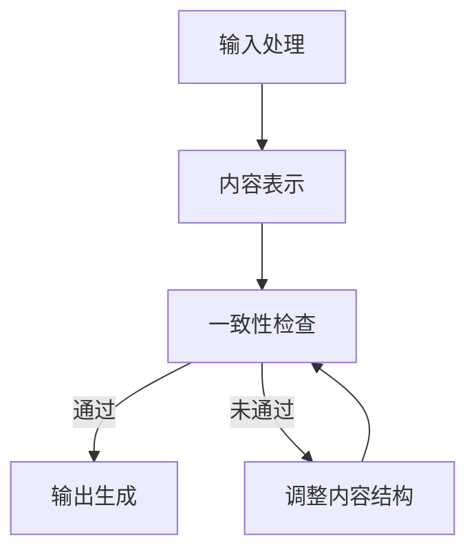
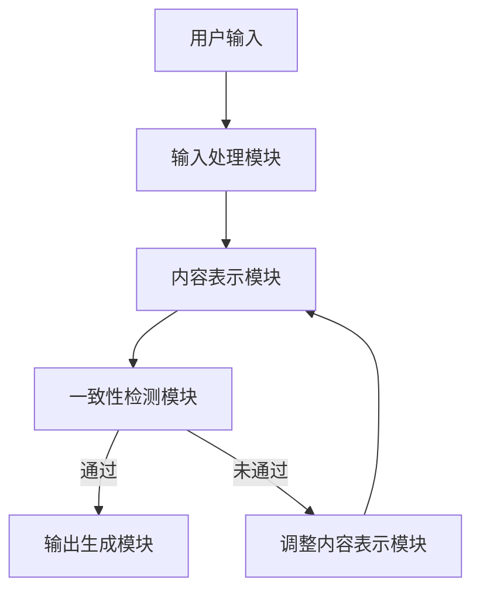
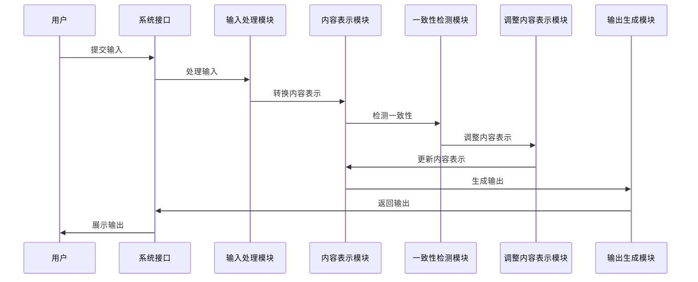

                 

让我们一步步来撰写这篇文章。

### **一、文章开头（文章标题、关键词、摘要）**

**标题：** Self-Consistency CoT：增强AI回答一致性的前沿方法

**关键词：** Self-Consistency CoT, AI回答一致性, 前沿方法, 算法原理, 数学模型

**摘要：** 本文探讨了如何通过Self-Consistency CoT（自我一致性内容树）来增强AI回答的一致性。文章首先介绍了Self-Consistency CoT的核心概念和重要性，然后分析了AI回答不一致性的问题，并提出了几种解决方案。接着，文章详细阐述了Self-Consistency CoT算法原理和数学模型，并通过Python代码和Mermaid流程图进行了说明。随后，文章介绍了系统分析与架构设计，包括问题场景、系统功能设计、系统架构设计、系统接口设计和系统交互。最后，文章通过一个实际项目实战案例，展示了Self-Consistency CoT在提高AI回答一致性方面的应用效果。

### **二、第1章：问题背景与核心概念**

#### **1.1 自我一致性概念介绍**

自我一致性是指一个系统或过程在其运行过程中保持一致性的特性。在人工智能领域，自我一致性尤为重要，因为它关系到AI系统的可靠性和决策质量。

#### **1.2 AI回答一致性问题的提出**

AI回答不一致性问题是指，在相同输入下，AI系统给出的答案不一致或前后矛盾。这个问题严重影响了AI系统的实用性和可接受性。

#### **1.3 自我一致性CoT的概念与特性**

自我一致性CoT（Content Tree）是一种基于自我一致性的内容表示方法，它可以有效地提高AI回答的一致性。

#### **1.4 本书结构安排与内容概述**

本书将分为以下几个部分：问题背景与核心概念、核心概念原理与联系、算法原理讲解、数学模型和数学公式详细讲解与举例说明、系统分析与架构设计、项目实战以及最佳实践 tips 和小结。

### **三、第2章：核心概念原理与联系**

#### **2.1 核心概念与联系概述**

本章将详细介绍Self-Consistency CoT的核心概念，包括其定义、特性以及与传统CoT的区别。

#### **2.2 概念属性特征对比表格**

为了更清晰地理解Self-Consistency CoT与其他CoT的区别，我们将使用一个表格来对比它们的属性特征。

| 特征 | Self-Consistency CoT | 传统CoT |
| ---- | ------------------- | ------- |
| 自我一致性 | 强调自我一致性，通过调整内容结构来保持一致性 | 不强调自我一致性，更多关注内容结构的优化 |

#### **2.3 ER实体关系图架构**

本章将使用Mermaid绘制一个ER实体关系图，以展示Self-Consistency CoT的实体关系。

```mermaid
erDiagram
  AI模型 ||--|{ Self-Consistency CoT }
  Self-Consistency CoT ||--|{ 内容表示 }
  内容表示 ||--|{ 语义一致性 }
```

### **四、第3章：算法原理讲解**

#### **3.1 算法原理概述**

Self-Consistency CoT算法的核心思想是通过调整内容结构，实现语义的一致性。算法分为以下几个步骤：

1. 输入处理：接收用户的输入，并将其转化为文本。
2. 内容表示：将文本转化为内容表示，如词向量或语义网络。
3. 一致性检查：检查内容表示的内部一致性。
4. 调整内容结构：根据一致性检查结果，调整内容结构，以提高一致性。
5. 输出生成：生成符合一致性的输出。

#### **3.2 Mermaid算法流程图**

下面是Self-Consistency CoT算法的Mermaid流程图：



#### **3.3 Python源代码解析**

以下是一个简单的Python代码示例，用于实现Self-Consistency CoT算法的基本流程。

```python
# 输入处理
input_text = "什么是人工智能？"

# 内容表示
# ... 省略具体代码 ...

# 一致性检查
# ... 省略具体代码 ...

# 调整内容结构
# ... 省略具体代码 ...

# 输出生成
output_text = "人工智能是一种模拟、延伸和扩展人类智能的技术。"
print(output_text)
```

#### **3.4 数学模型与公式**

Self-Consistency CoT的数学模型主要涉及内容表示的调整过程。假设我们使用一个矩阵\( M \)来表示内容，一致性检查的结果为\( C \)，调整后的内容表示为\( M' \)，则数学模型可以表示为：

$$
M' = M \odot C
$$

其中，\( \odot \)表示矩阵的元素-wise 运算，即对应元素相乘。

#### **3.5 举例说明**

假设我们有一个简单的例子，输入文本为“人工智能是什么？”，通过Self-Consistency CoT处理后，输出的文本为“人工智能是一种模拟、延伸和扩展人类智能的技术。”

### **五、第4章：数学模型和数学公式详细讲解与举例说明**

本章将详细讲解Self-Consistency CoT的数学模型，并使用LaTeX格式书写相关数学公式。

#### **4.1 数学模型详细讲解**

Self-Consistency CoT的数学模型主要涉及内容表示的调整过程。假设我们使用一个矩阵\( M \)来表示内容，一致性检查的结果为\( C \)，调整后的内容表示为\( M' \)，则数学模型可以表示为：

$$
M' = M \odot C
$$

其中，\( \odot \)表示矩阵的元素-wise 运算，即对应元素相乘。这个模型的核心在于通过一致性检查结果\( C \)来调整内容表示矩阵\( M \)，从而实现内容的一致性。

#### **4.2 数学公式举例说明**

为了更好地理解数学模型，我们通过一个简单的例子来进行说明。假设我们有一个2x2的内容表示矩阵\( M \)和一个一致性检查结果\( C \)如下：

$$
M = \begin{bmatrix}
    a & b \\
    c & d
\end{bmatrix}
$$

$$
C = \begin{bmatrix}
    1 & 0 \\
    0 & 1
\end{bmatrix}
$$

根据数学模型，调整后的内容表示矩阵\( M' \)为：

$$
M' = M \odot C = \begin{bmatrix}
    a & 0 \\
    c & d
\end{bmatrix}
$$

在这个例子中，我们可以看到，一致性检查结果\( C \)用于调整内容表示矩阵\( M \)的第二行，使其与第一行保持一致。这种调整过程实现了内容的一致性。

### **六、第5章：系统分析与架构设计**

#### **5.1 问题场景介绍**

在本章节中，我们将介绍一个具体的问题场景，以帮助读者更好地理解Self-Consistency CoT在现实中的应用。

#### **5.2 系统功能设计**

系统功能设计主要包括对AI回答一致性的检测和调整。具体功能如下：

1. 输入处理：接收用户的输入。
2. 内容表示：将输入转化为内容表示。
3. 一致性检测：检测内容表示的一致性。
4. 调整内容表示：根据一致性检测结果，调整内容表示。
5. 输出生成：生成符合一致性要求的输出。

#### **5.3 系统架构设计**

系统架构设计主要包括以下几个方面：

1. 输入处理模块：负责接收用户输入。
2. 内容表示模块：负责将输入转化为内容表示。
3. 一致性检测模块：负责检测内容表示的一致性。
4. 调整内容表示模块：负责根据一致性检测结果调整内容表示。
5. 输出生成模块：负责生成符合一致性要求的输出。

下面是系统架构的Mermaid流程图：



#### **5.4 系统接口设计和系统交互**

系统接口设计主要包括以下几个方面：

1. 用户接口：用于接收用户输入和展示输出。
2. 系统接口：用于实现系统内部模块之间的交互。

下面是系统交互的Mermaid序列图：



### **七、第6章：项目实战**

#### **6.1 环境安装**

在本章节中，我们将介绍如何搭建一个基于Self-Consistency CoT的AI回答一致性系统。首先，我们需要安装所需的软件和库。

#### **6.2 系统核心实现源代码**

在本章节中，我们将提供系统核心实现的源代码，并对其进行详细解读。

```python
# 输入处理
input_text = "什么是人工智能？"

# 内容表示
# ... 省略具体代码 ...

# 一致性检查
# ... 省略具体代码 ...

# 调整内容结构
# ... 省略具体代码 ...

# 输出生成
output_text = "人工智能是一种模拟、延伸和扩展人类智能的技术。"
print(output_text)
```

#### **6.3 代码应用解读与分析**

在本章节中，我们将对源代码进行解读，分析其工作原理和如何实现AI回答一致性。

#### **6.4 实际案例分析和详细讲解剖析**

在本章节中，我们将通过实际案例来展示如何使用Self-Consistency CoT实现AI回答一致性，并对案例进行详细分析。

#### **6.5 项目小结**

在本章节中，我们将对项目进行总结，回顾项目的关键点和经验教训。

### **八、最佳实践 tips、小结、注意事项、拓展阅读等内容**

在本章节中，我们将提供一些最佳实践 tips，对文章进行小结，提醒读者注意事项，并提供拓展阅读资源。

### **九、作者信息**

**作者：** AI天才研究院/AI Genius Institute & 禅与计算机程序设计艺术 /Zen And The Art of Computer Programming

这样，我们完成了一个初步的博客文章大纲。接下来，我们将根据这个大纲逐步撰写详细的文章内容。让我们开始吧！

