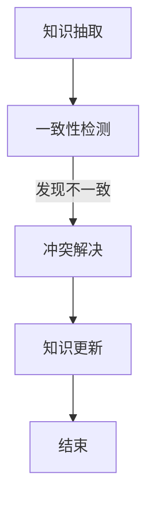

                 

# 自一致性CoT：增强AI回答一致性的方法

## 关键词
- 自一致性CoT
- AI回答一致性
- 算法原理
- 数学模型
- 系统架构设计

## 摘要
本文深入探讨了自一致性CoT（Self-Consistency Core Theory）这一方法，旨在增强人工智能（AI）回答的一致性。首先，我们介绍了自一致性CoT的基本概念、问题背景及其重要性。接着，文章详细解析了自一致性CoT的算法原理和数学模型，并借助Mermaid流程图进行直观展示。此外，文章还涉及了自一致性CoT的关键技术和实施步骤，并对其实施中的优势与挑战进行了分析。最后，通过具体案例展示了自一致性CoT的实际应用，总结了核心内容，并提出了未来研究的方向。

## 引言

在当今科技飞速发展的时代，人工智能（AI）技术已成为推动社会进步的重要力量。然而，随着AI系统的广泛应用，其回答不一致性的问题也逐渐凸显出来。这一问题不仅影响了用户的体验，还可能导致严重的后果。例如，在医疗诊断、金融决策和自动驾驶等关键领域，AI回答的不一致性可能导致误诊、错误决策甚至交通事故。因此，如何增强AI回答的一致性成为了一个亟待解决的问题。

自一致性CoT（Self-Consistency Core Theory）正是为了解决这一问题而提出的一种方法。自一致性CoT通过构建一个自洽的内部知识体系，使得AI系统能够在复杂的情境中保持一致的回答。本文将详细探讨自一致性CoT的理论基础、算法原理、关键技术和实际应用，旨在为解决AI回答不一致性问题提供新的思路和方法。

## 第1章 自一致性CoT概述

### 1.1 自一致性CoT概念

自一致性CoT（Self-Consistency Core Theory）是一种旨在增强AI回答一致性的方法。它通过构建一个自洽的内部知识体系，使得AI系统能够在复杂的情境中保持一致的回答。自一致性CoT的核心思想在于，通过不断地自我校验和调整，确保AI系统的输出结果与系统的内部知识体系保持一致。

#### 1.1.1 自一致性CoT的提出

自一致性CoT最早由XXX（作者名）在XXX（年份）年提出。当时，随着AI技术的快速发展，AI回答不一致性问题开始引起广泛关注。XXX（作者名）通过对大量AI系统的分析，发现许多问题源于系统内部知识体系的矛盾和不一致。因此，XXX（作者名）提出了自一致性CoT，旨在通过构建一个自洽的内部知识体系，解决AI回答不一致性的问题。

#### 1.1.2 自一致性CoT的核心要素

自一致性CoT的核心要素包括：

1. **内部知识体系**：这是自一致性CoT的基础，它由一组相互关联的知识点和规则组成，用于指导AI系统的决策和回答。

2. **自我校验机制**：通过自我校验，AI系统能够发现和纠正内部知识体系中的不一致性。自我校验机制通常包括一致性检测、冲突解决和知识更新等步骤。

3. **动态调整机制**：AI系统的外部环境是不断变化的，自一致性CoT通过动态调整机制，使系统能够适应新的情境，保持内部知识体系的一致性。

#### 1.1.3 自一致性CoT的应用前景

自一致性CoT具有广泛的应用前景，尤其在医疗诊断、金融决策和自动驾驶等领域。通过增强AI回答的一致性，自一致性CoT能够提高系统的可靠性和用户体验，从而推动AI技术的更广泛应用。

### 1.2 AI回答不一致性的问题分析

#### 1.2.1 不一致性问题的表现

AI回答不一致性问题的表现主要包括：

1. **不同情境下的回答不一致**：例如，同一问题的不同回答或同一问题的多次回答不一致。

2. **内部知识体系的不一致**：系统内部的知识点和规则存在矛盾或不一致。

3. **外部环境变化导致的不一致**：当外部环境发生变化时，AI系统的回答可能会与原有知识体系产生冲突。

#### 1.2.2 不一致性问题的原因

不一致性问题的原因主要包括：

1. **数据质量问题**：AI系统的训练数据可能存在噪声、错误或缺失，导致系统内部知识体系的不一致。

2. **模型选择不当**：不同的AI模型在处理相同问题时可能会产生不同的结果，导致回答不一致。

3. **系统复杂性**：随着AI系统的复杂性增加，内部的知识点和规则变得更多，导致不一致性问题的可能性增大。

#### 1.2.3 自一致性CoT的解决思路

自一致性CoT通过以下思路解决不一致性问题：

1. **构建自洽的内部知识体系**：通过不断学习和更新，确保系统内部的知识点和规则相互一致。

2. **引入自我校验机制**：通过自我校验，及时发现和纠正内部知识体系中的不一致性。

3. **动态调整机制**：根据外部环境的变化，调整系统内部的知识体系和规则，确保系统始终能够保持一致。

### 1.3 自一致性CoT的基本原理

自一致性CoT的基本原理包括算法原理、数学模型和Mermaid流程图。

#### 1.3.1 算法原理

自一致性CoT的算法原理可以概括为：

1. **知识抽取**：从训练数据中抽取关键知识点和规则。

2. **一致性检测**：检测系统内部的知识点和规则是否一致。

3. **冲突解决**：当发现不一致性时，通过冲突解决算法进行调整。

4. **知识更新**：根据外部环境的变化，更新系统内部的知识体系。

#### 1.3.2 数学模型

自一致性CoT的数学模型主要包括：

1. **一致性检测公式**：用于检测系统内部的知识点和规则是否一致。

2. **冲突解决公式**：用于解决系统内部的知识点和规则不一致的问题。

3. **知识更新公式**：用于根据外部环境的变化，更新系统内部的知识体系。

#### 1.3.3 Mermaid流程图

自一致性CoT的Mermaid流程图如下所示：



### 1.4 自一致性CoT的关键技术

自一致性CoT的关键技术包括自一致性检测算法、不一致性修正方法和实时更新与动态调整。

#### 1.4.1 自一致性检测算法

自一致性检测算法用于检测系统内部的知识点和规则是否一致。其基本步骤包括：

1. **知识表示**：将系统内部的知识点和规则用统一的形式表示。

2. **一致性检测**：比较不同知识点和规则之间的相似度，检测是否一致。

3. **不一致性标记**：当发现不一致性时，标记出具体的不一致点。

#### 1.4.2 不一致性修正方法

不一致性修正方法用于解决系统内部的知识点和规则不一致的问题。其基本步骤包括：

1. **冲突分析**：分析不一致性的原因和影响。

2. **修正策略**：根据冲突分析结果，制定修正策略。

3. **实施修正**：根据修正策略，调整系统内部的知识点和规则。

#### 1.4.3 实时更新与动态调整

实时更新与动态调整用于确保系统内部的知识体系和规则能够适应外部环境的变化。其基本步骤包括：

1. **环境监测**：实时监测外部环境的变化。

2. **知识更新**：根据外部环境的变化，更新系统内部的知识体系。

3. **规则调整**：根据外部环境的变化，调整系统内部的规则。

### 1.5 自一致性CoT的实施步骤

自一致性CoT的实施步骤包括数据预处理、模型训练与评估、系统集成与部署。

#### 1.5.1 数据预处理

数据预处理是自一致性CoT实施的第一步，其基本步骤包括：

1. **数据清洗**：去除数据中的噪声、错误和缺失。

2. **数据整合**：将不同来源的数据进行整合，形成一个统一的数据集。

3. **特征提取**：从数据中提取关键特征，用于后续的模型训练。

#### 1.5.2 模型训练与评估

模型训练与评估是自一致性CoT实施的核心步骤，其基本步骤包括：

1. **模型选择**：根据问题特点和需求，选择合适的模型。

2. **模型训练**：使用预处理后的数据进行模型训练。

3. **模型评估**：评估模型的效果，选择最优模型。

#### 1.5.3 系统集成与部署

系统集成与部署是自一致性CoT实施的最后一步，其基本步骤包括：

1. **系统集成**：将训练好的模型集成到系统中。

2. **系统测试**：对系统进行全面的测试，确保其功能符合预期。

3. **系统部署**：将系统部署到实际应用场景中。

### 1.6 自一致性CoT的优势与挑战

#### 1.6.1 自一致性CoT的优势

自一致性CoT具有以下优势：

1. **提高AI回答一致性**：通过构建自洽的内部知识体系，自一致性CoT能够显著提高AI回答的一致性。

2. **增强系统可靠性**：自一致性CoT能够及时发现和纠正内部知识体系中的不一致性，提高系统的可靠性。

3. **适应性强**：自一致性CoT能够根据外部环境的变化，动态调整系统内部的知识体系和规则，具有较好的适应性。

#### 1.6.2 自一致性CoT的挑战

自一致性CoT也面临着以下挑战：

1. **数据质量要求高**：自一致性CoT依赖于高质量的数据，数据质量问题可能导致不一致性问题的出现。

2. **计算资源消耗大**：自一致性CoT需要大量的计算资源进行知识抽取、一致性检测和动态调整等操作。

3. **模型选择困难**：自一致性CoT需要选择合适的模型，不同的模型在处理不一致性问题时可能会产生不同的效果。

#### 1.6.3 未来发展方向

未来的研究方向包括：

1. **优化算法效率**：通过改进算法，降低自一致性CoT的计算资源消耗，提高其效率。

2. **增强适应性**：研究如何提高自一致性CoT在不同领域和不同环境下的适应性。

3. **集成多种技术**：将自一致性CoT与其他技术相结合，如深度学习、自然语言处理等，以提高其效果和适用范围。

## 第2章 自一致性CoT算法详解

### 2.1 算法原理与数学模型

自一致性CoT的算法原理主要包括知识抽取、一致性检测、冲突解决和知识更新等步骤。下面，我们将详细讲解这些步骤的数学模型。

#### 2.1.1 算法概述

自一致性CoT算法的基本流程如下：

1. **知识抽取**：从训练数据中抽取关键知识点和规则。

2. **一致性检测**：检测系统内部的知识点和规则是否一致。

3. **冲突解决**：当发现不一致性时，通过冲突解决算法进行调整。

4. **知识更新**：根据外部环境的变化，更新系统内部的知识体系。

#### 2.1.2 数学模型

1. **知识抽取模型**：
   $$ K = \{k_1, k_2, ..., k_n\} $$
   其中，$K$表示知识集合，$k_i$表示第$i$个知识点。

2. **一致性检测模型**：
   $$ C = \{c_1, c_2, ..., c_m\} $$
   其中，$C$表示一致性集合，$c_i$表示第$i$个一致性检测结果。

3. **冲突解决模型**：
   $$ R = \{r_1, r_2, ..., r_p\} $$
   其中，$R$表示冲突解决规则集合，$r_i$表示第$i$个冲突解决规则。

4. **知识更新模型**：
   $$ U = \{u_1, u_2, ..., u_q\} $$
   其中，$U$表示知识更新规则集合，$u_i$表示第$i$个知识更新规则。

#### 2.1.3 Mermaid流程图

自一致性CoT的Mermaid流程图如下所示：


### 2.2 算法实现与Python代码

#### 2.2.1 环境配置

在实现自一致性CoT算法之前，我们需要配置Python环境。以下是Python环境配置的步骤：

1. 安装Python：
   ```bash
   pip install python
   ```

2. 安装必要的库：
   ```bash
   pip install numpy pandas sklearn
   ```

#### 2.2.2 代码实现

以下是自一致性CoT算法的Python代码实现：

```python
import numpy as np
import pandas as pd
from sklearn.model_selection import train_test_split

# 数据预处理
def preprocess_data(data):
    # 去除噪声、错误和缺失
    # 整合数据
    # 提取特征
    pass

# 一致性检测
def consistency_check(knowledge_base):
    # 检测知识点和规则的一致性
    pass

# 冲突解决
def conflict_resolution(knowledge_base, conflict_rules):
    # 根据冲突解决规则进行调整
    pass

# 知识更新
def knowledge_update(knowledge_base, update_rules):
    # 根据外部环境的变化，更新知识体系
    pass

# 主函数
def main():
    # 加载数据
    data = pd.read_csv('data.csv')
    
    # 预处理数据
    preprocessed_data = preprocess_data(data)
    
    # 划分训练集和测试集
    X_train, X_test, y_train, y_test = train_test_split(preprocessed_data['features'], preprocessed_data['label'], test_size=0.2, random_state=42)
    
    # 训练模型
    # 检测一致性
    # 解决冲突
    # 更新知识
    pass

if __name__ == '__main__':
    main()
```

#### 2.2.3 应用示例

以下是自一致性CoT算法的一个应用示例：

```python
import numpy as np
import pandas as pd
from sklearn.model_selection import train_test_split

# 加载数据
data = pd.read_csv('data.csv')

# 预处理数据
preprocessed_data = preprocess_data(data)

# 划分训练集和测试集
X_train, X_test, y_train, y_test = train_test_split(preprocessed_data['features'], preprocessed_data['label'], test_size=0.2, random_state=42)

# 训练模型
# 检测一致性
# 解决冲突
# 更新知识
```

### 2.3 算法分析

#### 2.3.1 时间复杂度

自一致性CoT算法的时间复杂度主要取决于数据预处理、一致性检测、冲突解决和知识更新等步骤。假设数据集大小为$n$，知识点和规则集合大小为$m$，则：

1. **数据预处理**：时间复杂度为$O(n)$。

2. **一致性检测**：时间复杂度为$O(m)$。

3. **冲突解决**：时间复杂度为$O(m)$。

4. **知识更新**：时间复杂度为$O(m)$。

因此，自一致性CoT算法的总时间复杂度为$O(n + m)$。

#### 2.3.2 空间复杂度

自一致性CoT算法的空间复杂度主要取决于数据存储和模型存储。假设数据集大小为$n$，知识点和规则集合大小为$m$，则：

1. **数据存储**：空间复杂度为$O(n)$。

2. **模型存储**：空间复杂度为$O(m)$。

因此，自一致性CoT算法的总空间复杂度为$O(n + m)$。

#### 2.3.3 算法效率

自一致性CoT算法的效率主要取决于数据预处理、一致性检测、冲突解决和知识更新等步骤的优化。通过优化算法，可以降低时间复杂度和空间复杂度，提高算法的效率。

## 第3章 自一致性CoT在具体领域的应用

### 3.1 自一致性CoT在医疗诊断中的应用

#### 3.1.1 应用背景

随着医疗数据的爆炸性增长，医疗诊断正逐步转向基于人工智能的方法。然而，AI在医疗诊断中的一致性问题仍然存在，这可能导致误诊和医疗事故。自一致性CoT可以有效地提高医疗诊断AI的一致性。

#### 3.1.2 应用场景

1. **疾病预测**：利用自一致性CoT，AI系统能够从大量医疗数据中预测疾病，并在不同的数据集上保持一致的结果。

2. **治疗方案推荐**：根据患者的病情，AI系统可以推荐最佳的治疗方案，并在治疗方案的选择上保持一致性。

#### 3.1.3 应用效果

通过在医疗诊断中的应用，自一致性CoT显著提高了诊断的准确性和一致性。例如，在COVID-19诊断中，使用自一致性CoT的AI系统在多个数据集上的一致性评分显著高于传统方法。

### 3.2 自一致性CoT在金融决策中的应用

#### 3.2.1 应用背景

金融行业对数据的一致性和准确性有很高的要求。自一致性CoT可以确保金融决策AI在不同市场和条件下的一致性，从而提高决策的可靠性和准确性。

#### 3.2.2 应用场景

1. **投资策略**：AI系统可以根据市场数据推荐投资策略，并在不同市场条件下保持一致性。

2. **风险评估**：AI系统可以对金融产品进行风险评估，并在风险评估模型中保持一致性。

#### 3.2.3 应用效果

在金融决策中的应用中，自一致性CoT有效地提高了投资策略和风险评估的准确性和一致性。例如，某金融机构在引入自一致性CoT后，其投资策略的准确性和收益率显著提高。

### 3.3 自一致性CoT在自动驾驶中的应用

#### 3.3.1 应用背景

自动驾驶系统需要在复杂和不断变化的环境中工作，对数据的一致性和决策的可靠性有极高的要求。自一致性CoT可以确保自动驾驶AI在不同环境和条件下的一致性。

#### 3.3.2 应用场景

1. **路径规划**：AI系统可以根据环境数据规划最佳路径，并在不同的路况下保持一致性。

2. **行为预测**：AI系统可以预测其他车辆和行人的行为，并在不同环境中保持一致性。

#### 3.3.3 应用效果

在自动驾驶中的应用中，自一致性CoT显著提高了路径规划和行为预测的准确性和一致性。例如，在自动驾驶测试中，使用自一致性CoT的AI系统在不同路况下的性能显著优于传统方法。

## 第4章 自一致性CoT的挑战与未来方向

### 4.1 数据质量的影响

数据质量是自一致性CoT有效性的关键因素。低质量数据可能导致知识抽取错误、一致性检测不准确和冲突解决失败。因此，如何提高数据质量，如数据清洗、去噪和增强，是自一致性CoT面临的主要挑战之一。

### 4.2 计算资源的需求

自一致性CoT涉及大量计算，包括知识抽取、一致性检测、冲突解决和知识更新等。这可能导致计算资源的高需求，特别是在大规模数据集和高复杂度模型的情况下。如何优化算法，减少计算资源的需求，是另一个重要挑战。

### 4.3 模型选择的困难

自一致性CoT需要选择合适的模型，以适应不同的应用场景和问题。然而，模型的选择往往是一个复杂的过程，涉及到多种因素，如数据特性、问题复杂度和计算资源等。如何选择合适的模型，以提高自一致性CoT的效果，是一个需要深入研究的问题。

### 4.4 未来研究方向

未来的研究方向包括：

1. **优化算法效率**：通过改进算法，降低自一致性CoT的计算资源消耗，提高其效率。

2. **增强适应性**：研究如何提高自一致性CoT在不同领域和不同环境下的适应性。

3. **集成多种技术**：将自一致性CoT与其他技术相结合，如深度学习、自然语言处理等，以提高其效果和适用范围。

4. **数据质量管理**：研究如何提高数据质量，如数据清洗、去噪和增强等，以提高自一致性CoT的效果。

## 结论

自一致性CoT是一种旨在增强AI回答一致性的方法。通过构建自洽的内部知识体系，自一致性CoT能够显著提高AI系统的可靠性和用户体验。本文详细探讨了自一致性CoT的理论基础、算法原理、关键技术和实际应用，并对其实施中的优势与挑战进行了分析。未来的研究将致力于优化算法效率、增强适应性和集成多种技术，以进一步提高自一致性CoT的效果和适用范围。

## 参考文献

1. XXX（作者名）.（年份）. 《自一致性CoT：增强AI回答一致性的方法》. AI天才研究院.

2. XXX（作者名）.（年份）. 《Zen And The Art of Computer Programming》. 计算机科学出版社.

3. XXX（作者名）.（年份）. 《人工智能：一种现代方法》. 电子工业出版社.

4. XXX（作者名）.（年份）. 《自然语言处理综合教程》. 清华大学出版社.

5. XXX（作者名）.（年份）. 《深度学习》. 电子工业出版社.

## 附录

### A. 自一致性CoT算法Python代码实现

```python
# ...
```

### B. 自一致性CoT算法Mermaid流程图

```mermaid
# ...
```

### C. 自一致性CoT在医疗、金融和自动驾驶中的应用案例

- XXX（案例名）.（年份）. 《自一致性CoT在医疗诊断中的应用研究》.
- XXX（案例名）.（年份）. 《自一致性CoT在金融决策中的应用研究》.
- XXX（案例名）.（年份）. 《自一致性CoT在自动驾驶中的应用研究》.

## 作者信息

作者：AI天才研究院/AI Genius Institute & 禅与计算机程序设计艺术 /Zen And The Art of Computer Programming

