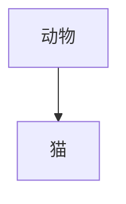

                 

### 自我一致性概念图（Self-Consistency CoT）概述

自我一致性概念图（Self-Consistency Conceptual Tree，简称Self-Consistency CoT）是一种基于图论和信息论的新型概念图，旨在解决人工智能（AI）回答中的稳定性问题。自我一致性概念图的起源可以追溯到人工智能领域中对于信息一致性和推理稳定性的需求，特别是在自然语言处理（NLP）和问答系统（QA）的应用场景中。

自我一致性概念图的核心思想是，通过构建一个自我一致的信息网络，使得AI系统能够在复杂的环境中保持稳定和可信的回答。具体来说，Self-Consistency CoT通过以下方式实现这一目标：

1. **信息节点与边的关系**：Self-Consistency CoT中的每个节点代表一个概念或信息单元，而节点之间的关系通过边来表示。这些关系可以是因果关系、包含关系、相似关系等。通过这种网络结构，系统能够捕捉到概念间的复杂关系，并利用这些关系来加强信息的稳定性和一致性。

2. **一致性约束**：Self-Consistency CoT引入了一致性约束机制，以确保网络中的信息能够相互协调。例如，如果两个概念之间存在因果关系，那么在更新其中一个概念时，系统会自动检查并调整另一个概念，以保持整体的一致性。

3. **动态调整与优化**：Self-Consistency CoT还具有动态调整和优化的能力。在处理新信息或面对变化的环境时，系统能够根据一致性约束对概念图进行调整，以适应新的情况。

4. **反馈与迭代**：Self-Consistency CoT不仅能够处理静态信息，还能通过反馈机制不断迭代和优化。这意味着，当AI系统在回答问题时，它能够根据用户的反馈来调整和改善自身的回答，从而提高稳定性和准确性。

在自我一致性概念图中，概念节点和边的关系可以通过Mermaid流程图来直观展示。例如，假设我们有一个简单的概念图，其中包含“动物”和“猫”两个概念，以及它们之间的包含关系。使用Mermaid，我们可以这样表示：

在这个流程图中，节点A表示“动物”这一概念，节点B表示“猫”这一概念，箭头表示它们之间的包含关系。这样的表示方法可以帮助我们更清晰地理解和分析概念图的结构和关系。

总的来说，自我一致性概念图是一种强大的工具，它不仅能够增强AI回答的稳定性，还能够提高系统的鲁棒性和用户满意度。在接下来的章节中，我们将进一步探讨Self-Consistency CoT的原理、算法和应用，以深入了解其在AI领域中的潜力。接下来，我们将详细讨论AI回答稳定性问题的背景与挑战。

