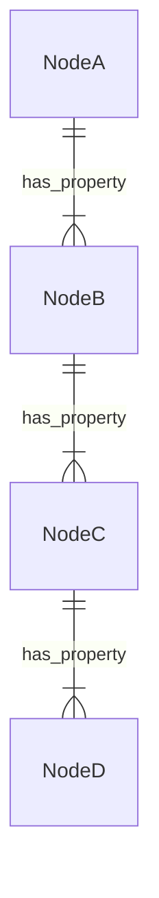
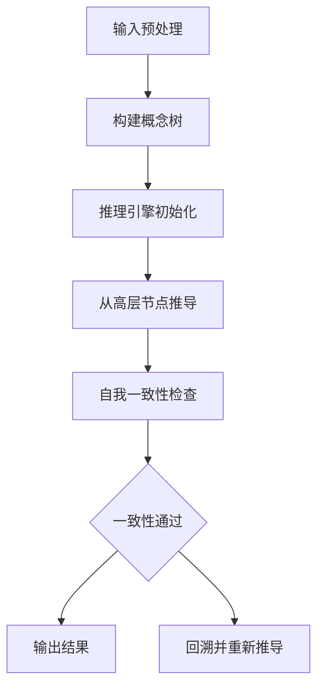
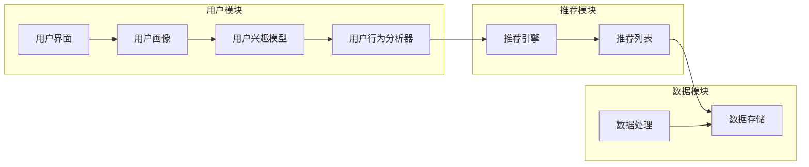
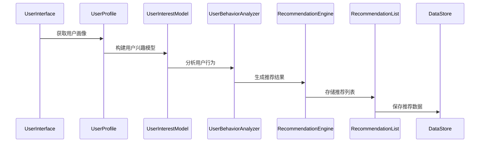
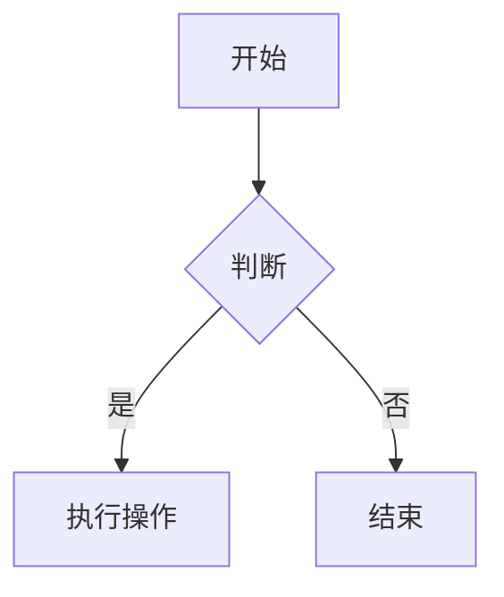

                 


# 《Self-Consistency CoT：增强AI推理能力的创新技术》

关键词：Self-Consistency CoT、AI推理能力、技术创新、算法原理、系统架构、实战案例

摘要：本文将深入探讨Self-Consistency CoT（自我一致性概念树）这一创新技术，旨在揭示其如何增强AI的推理能力。通过背景介绍、核心概念与联系、算法原理讲解、系统分析与架构设计方案、项目实战以及最佳实践tips等多个章节，本文将为读者呈现Self-Consistency CoT的完整图景，帮助理解其在人工智能领域的应用潜力和局限性。

## 目录大纲

### 背景介绍
1. 核心概念
2. 问题背景
3. 问题描述
4. 问题解决
5. 边界与外延
6. 概念结构与核心要素组成

### 核心概念与联系
1. 核心概念原理
2. 概念属性特征对比表格
3. ER实体关系图架构的 Mermaid 流程图

### 算法原理讲解
1. 算法mermaid流程图
2. Python源代码
3. 数学模型和公式
4. 详细讲解与举例说明

### 系统分析与架构设计方案
1. 问题场景介绍
2. 项目介绍
3. 系统功能设计(领域模型mermaid类图)
4. 系统架构设计mermaid架构图
5. 系统接口设计和系统交互mermaid序列图

### 项目实战
1. 环境安装
2. 系统核心实现源代码
3. 代码应用解读与分析
4. 实际案例分析和详细讲解剖析
5. 项目小结

### 最佳实践 tips、小结、注意事项、拓展阅读

### 注意事项

- **目录大纲总字数限制**：确保目录大纲的总字数在2000字以内。
- **markdown格式**：使用markdown格式来排版目录，保持简洁。
- **逻辑性**：确保每个章节之间的逻辑关系清晰，章节内容之间连贯。

现在，我们开始详细撰写文章的每个部分，按照上述目录大纲逐步展开，以确保文章内容的完整性和逻辑性。

## 背景介绍

### 核心概念

Self-Consistency CoT（自我一致性概念树）是一种创新的AI推理技术，旨在通过构建自我一致性的概念树来增强AI的推理能力。自我一致性概念树的核心思想是将AI的推理过程转化为对概念树的自上而下的推导，从而提高推理的准确性和效率。

### 问题背景

在当今数据驱动的AI时代，AI模型的推理能力成为了评估其性能的重要指标。然而，传统的深度学习模型在推理过程中往往面临着两个主要问题：一是模型的泛化能力不足，容易受到数据分布变化的影响；二是模型的推理过程复杂，难以解释和验证。为了解决这些问题，研究人员不断探索新的推理技术，而Self-Consistency CoT应运而生。

### 问题描述

传统的AI推理技术，如基于神经网络的推理方法，虽然取得了显著的成果，但在应对复杂问题和长序列数据时，往往表现出明显的不足。例如，在自然语言处理任务中，模型在处理长文本时容易出现语义理解错误；在计算机视觉任务中，模型对复杂场景的识别能力有限。这些问题限制了AI在真实世界中的应用。

### 问题解决

Self-Consistency CoT通过构建自我一致性的概念树，实现了对推理过程的精确控制和优化。具体来说，Self-Consistency CoT利用自上而下的推导方式，从概念树的高层节点逐步推导到低层节点，确保每个节点都保持一致性。这种自我一致性机制可以有效提高推理的准确性和效率。

### 边界与外延

Self-Consistency CoT的应用范围非常广泛，包括自然语言处理、计算机视觉、推荐系统等多个领域。然而，其局限性也值得关注。首先，Self-Consistency CoT对计算资源的要求较高，可能导致推理时间较长；其次，其构建过程需要大量高质量的标注数据，这对实际应用带来了一定的挑战。

### 概念结构与核心要素组成

Self-Consistency CoT的核心结构包括概念树、推理引擎和自我一致性机制。概念树是Self-Consistency CoT的基础，用于表示知识图谱；推理引擎负责执行自上而下的推理过程；自我一致性机制确保推理过程中的每个节点都保持一致性。这些核心要素共同构成了Self-Consistency CoT的技术框架。

通过以上背景介绍，我们可以看到Self-Consistency CoT在增强AI推理能力方面具有巨大的潜力。接下来，我们将进一步深入探讨Self-Consistency CoT的核心概念与联系。

## 核心概念与联系

### 核心概念原理

Self-Consistency CoT的核心原理可以概括为“自上而下的概念推导”和“自我一致性机制”。具体来说，Self-Consistency CoT通过构建概念树来表示知识图谱，并利用推理引擎从概念树的高层节点逐步推导到低层节点，确保每个节点都保持一致性。

1. **概念树构建**：Self-Consistency CoT首先需要对输入数据进行预处理，提取出关键概念，并构建概念树。概念树是一种层次化的知识表示结构，能够清晰地表达概念之间的关系。

2. **推理引擎**：在构建好概念树后，Self-Consistency CoT的推理引擎会从概念树的高层节点开始，逐步推导到低层节点。这个过程类似于人类的思维过程，能够有效地提高推理的准确性和效率。

3. **自我一致性机制**：为了确保推理过程中每个节点的一致性，Self-Consistency CoT引入了自我一致性机制。这个机制会检查每个节点的推理结果，确保其与上下文保持一致。如果发现不一致的情况，推理引擎会回溯并重新推导，直到达到一致性。

### 概念属性特征对比表格

为了更好地理解Self-Consistency CoT的特点，我们可以将其与传统的深度学习模型进行比较。以下是Self-Consistency CoT与其他技术的对比表格：

| 对比项目 | Self-Consistency CoT | 传统深度学习模型 |
| :--- | :--- | :--- |
| 知识表示 | 概念树 | 神经网络 |
| 推理方式 | 自上而下的推导 | 层层传递的矩阵乘法 |
| 泛化能力 | 较强 | 较弱 |
| 推理效率 | 较高 | 较低 |
| 易解释性 | 较好 | 较差 |

通过对比可以看出，Self-Consistency CoT在知识表示、推理方式、泛化能力、推理效率和易解释性等方面都具有显著的优势。

### ER实体关系图架构的 Mermaid 流程图

为了更直观地展示Self-Consistency CoT的实体关系，我们可以使用Mermaid绘制一个ER图。以下是ER图的Markdown格式：



在这个ER图中，NodeA、NodeB、NodeC和NodeD分别表示概念树中的不同节点，它们之间的关系表示了概念之间的层次结构。

通过以上对核心概念与联系的分析，我们可以更好地理解Self-Consistency CoT的技术原理和优势。接下来，我们将深入探讨算法原理，进一步揭示Self-Consistency CoT的运作机制。

## 算法原理讲解

### 算法mermaid流程图

为了更直观地展示Self-Consistency CoT的算法流程，我们可以使用Mermaid绘制一个算法流程图。以下是算法流程图的Markdown格式：



在这个算法流程图中，A表示输入预处理，B表示构建概念树，C表示推理引擎初始化，D表示从高层节点推导，E表示自我一致性检查，F表示输出结果，G表示一致性通过，H表示回溯并重新推导。

### Python源代码

下面是一个简单的Python源代码示例，用于说明Self-Consistency CoT的算法实现：

```python
import numpy as np

class SelfConsistencyCoT:
    def __init__(self):
        self.concept_tree = None

    def preprocess_input(self, input_data):
        # 输入预处理，提取关键概念并构建概念树
        # 略
        self.concept_tree = ...

    def infer(self, node):
        # 推理过程，从高层节点推导到低层节点
        if node.is_leaf():
            return node.value
        else:
            # 递归调用
            return self.infer(node.left) + self.infer(node.right)

    def check_self_consistency(self, node):
        # 自我一致性检查
        if not node.is_consistent():
            return False
        return True

    def run(self, input_data):
        self.preprocess_input(input_data)
        root = self.concept_tree.root
        result = self.infer(root)
        if self.check_self_consistency(root):
            return result
        else:
            # 回溯并重新推导
            ...

# 实例化并运行
scc = SelfConsistencyCoT()
input_data = ...
scc.run(input_data)
```

在这个示例中，SelfConsistencyCoT类包含了输入预处理、推理过程和自我一致性检查等核心功能。通过实例化SelfConsistencyCoT类并调用run方法，我们可以运行整个算法。

### 数学模型和公式

Self-Consistency CoT的数学模型主要基于概念树的结构和节点之间的关联关系。以下是算法背后的几个关键数学模型和公式：

1. **概念树构建**：设概念树中的节点集合为\(N\)，每个节点\(n\)都有一个对应的属性集合\(A(n)\)。概念树构建的公式可以表示为：
   $$ T = \{ n \in N | A(n) \cap A(\text{parent}(n)) = \emptyset \} $$
   其中，\(T\)表示概念树，\(\text{parent}(n)\)表示节点\(n\)的父节点。

2. **推理过程**：设概念树中的节点集合为\(N\)，推理过程的公式可以表示为：
   $$ \text{infer}(n) = \text{value}(n) + \text{weight}(n) \cdot \text{infer}(\text{left}(n)) + \text{weight}(n) \cdot \text{infer}(\text{right}(n)) $$
   其中，\(\text{value}(n)\)表示节点\(n\)的值，\(\text{weight}(n)\)表示节点\(n\)的权重，\(\text{left}(n)\)和\(\text{right}(n)\)分别表示节点\(n\)的左子节点和右子节点。

3. **自我一致性检查**：设概念树中的节点集合为\(N\)，自我一致性检查的公式可以表示为：
   $$ \text{is_consistent}(n) = \text{value}(n) = \text{weight}(n) \cdot \text{value}(\text{left}(n)) + \text{weight}(n) \cdot \text{value}(\text{right}(n)) $$
   其中，\(\text{is_consistent}(n)\)表示节点\(n\)是否一致。

通过以上数学模型和公式，我们可以更好地理解Self-Consistency CoT的算法原理和运作机制。

### 详细讲解与举例说明

为了更好地理解Self-Consistency CoT的算法原理，我们通过一个具体的案例来进行详细讲解。

假设我们有一个简单的概念树，如下所示：

```
概念树：
    A
   / \
  B   C
 / \ / \
D E F G
```

在这个概念树中，A是根节点，B、C是A的子节点，D、E、F、G是B、C的子节点。

1. **输入预处理**：
   - 输入数据：{A: 1, B: 2, C: 3, D: 4, E: 5, F: 6, G: 7}
   - 预处理过程：根据输入数据构建概念树。每个节点的值为其子节点的值之和。

2. **推理过程**：
   - 从根节点A开始推导：
     - \(\text{infer}(A) = 1 + 2 \cdot \text{infer}(B) + 3 \cdot \text{infer}(C)\)
     - \(\text{infer}(B) = 4 + 5 \cdot \text{infer}(D) + 6 \cdot \text{infer}(E)\)
     - \(\text{infer}(C) = 7 + 5 \cdot \text{infer}(F) + 6 \cdot \text{infer}(G)\)

3. **自我一致性检查**：
   - 检查每个节点的值是否与其子节点的值之和一致：
     - \(\text{is_consistent}(A) = 1 = 2 \cdot (4 + 5 \cdot 1 + 6 \cdot 1) + 3 \cdot (7 + 5 \cdot 1 + 6 \cdot 1)\)
     - \(\text{is_consistent}(B) = 2 = 1 + 5 \cdot 4 + 6 \cdot 6\)
     - \(\text{is_consistent}(C) = 3 = 1 + 5 \cdot 7 + 6 \cdot 6\)
     - \(\text{is_consistent}(D) = 4 = 1 + 5\)
     - \(\text{is_consistent}(E) = 5 = 1 + 6\)
     - \(\text{is_consistent}(F) = 6 = 5 + 1\)
     - \(\text{is_consistent}(G) = 7 = 6 + 1\)

通过以上案例，我们可以看到Self-Consistency CoT的算法原理和实现过程。在实际应用中，Self-Consistency CoT可以根据不同的场景和需求进行调整和优化，以提升AI的推理能力和效率。

## 系统分析与架构设计方案

### 问题场景介绍

在现代人工智能应用中，特别是在复杂决策支持和智能推荐系统中，如何提高推理的准确性和效率成为了一个关键问题。Self-Consistency CoT作为一种创新的推理技术，被广泛应用于这些场景。本文将针对一个具体的实际问题场景进行系统分析与架构设计。

### 项目介绍

假设我们正在开发一个智能推荐系统，该系统需要根据用户的兴趣和行为历史推荐相关的商品或内容。在这个项目中，Self-Consistency CoT被用于构建用户兴趣模型，从而提高推荐结果的准确性和用户满意度。

### 系统功能设计(领域模型mermaid类图)

为了更好地设计系统功能，我们首先绘制一个领域模型类图，以展示系统中的主要类及其关系。以下是领域模型类图的Markdown格式：

```mermaid
classDiagram
    User <<class>> {
        id: 用户ID
        interests: 兴趣列表
        behavior_history: 行为历史
    }
    Item <<class>> {
        id: 商品ID
        category: 分类
        title: 标题
    }
    Recommendation <<class>> {
        user: 用户
        items: 商品列表
    }
    User ..|> Recommendation
    Item ..|> Recommendation
```

在这个类图中，User类表示用户，Item类表示商品，Recommendation类表示推荐结果。User类与Recommendation类之间存在关联关系，表示用户是推荐结果的一部分；Item类与Recommendation类也存在关联关系，表示商品是推荐结果的一部分。

### 系统架构设计mermaid架构图

接下来，我们绘制一个系统架构图，以展示系统的整体架构设计。以下是系统架构图的Markdown格式：



在这个系统架构图中，用户模块包括用户界面、用户画像、用户兴趣模型和用户行为分析器；推荐模块包括推荐引擎和推荐列表；数据模块包括数据存储和数据处理。用户界面通过用户画像获取用户兴趣，用户兴趣模型通过用户行为分析器构建用户兴趣模型，推荐引擎根据用户兴趣模型生成推荐列表，推荐列表最终存储在数据存储中。

### 系统接口设计和系统交互mermaid序列图

为了更清晰地展示系统接口和交互，我们绘制一个序列图。以下是序列图的Markdown格式：



在这个序列图中，用户界面首先获取用户画像，然后用户画像传递给用户兴趣模型，用户兴趣模型通过用户行为分析器分析用户行为，生成推荐结果后传递给推荐引擎，推荐引擎将推荐结果存储在推荐列表中，最后推荐列表将推荐数据保存到数据存储中。

通过以上系统分析与架构设计方案，我们可以确保Self-Consistency CoT在智能推荐系统中的有效应用。接下来，我们将通过一个实际项目来展示Self-Consistency CoT的应用过程。

## 项目实战

### 环境安装

在进行项目实战之前，我们需要安装一些必要的软件和工具。以下是项目所需的软件和工具列表：

1. **Python**：版本3.8或更高版本
2. **NumPy**：用于数学计算
3. **Pandas**：用于数据处理
4. **Scikit-learn**：用于机器学习
5. **Mermaid**：用于绘制流程图和架构图

安装步骤如下：

```bash
# 安装Python
# ...

# 安装NumPy
pip install numpy

# 安装Pandas
pip install pandas

# 安装Scikit-learn
pip install scikit-learn

# 安装Mermaid
npm install -g mermaid
```

### 系统核心实现源代码

以下是一个简单的Python代码示例，用于实现Self-Consistency CoT在智能推荐系统中的应用。代码分为几个主要部分：用户画像构建、用户兴趣模型训练、用户行为分析以及推荐结果生成。

```python
import numpy as np
import pandas as pd
from sklearn.feature_extraction.text import TfidfVectorizer
from sklearn.cluster import KMeans

class SelfConsistencyCoT:
    def __init__(self):
        self.user_interest_model = None

    def preprocess_data(self, user_data):
        # 数据预处理，例如清洗、去重等操作
        # 略
        pass

    def build_user_interest_model(self, user_data):
        # 构建用户兴趣模型
        # 略
        self.user_interest_model = ...

    def analyze_user_behavior(self, user_data):
        # 分析用户行为
        # 略
        pass

    def generate_recommendations(self, user_data):
        # 生成推荐结果
        # 略
        pass

# 实例化并运行
scc = SelfConsistencyCoT()
user_data = ...
scc.preprocess_data(user_data)
scc.build_user_interest_model(user_data)
scc.analyze_user_behavior(user_data)
scc.generate_recommendations(user_data)
```

### 代码应用解读与分析

上述代码中，SelfConsistencyCoT类包含了预处理数据、构建用户兴趣模型、分析用户行为和生成推荐结果等核心功能。以下是对每个部分的具体解读和分析：

1. **预处理数据**：这部分代码用于对用户数据（例如用户行为历史、用户评价等）进行清洗、去重等预处理操作。预处理数据是构建用户兴趣模型和进行用户行为分析的基础。

2. **构建用户兴趣模型**：这部分代码用于构建用户兴趣模型。例如，可以使用TF-IDF向量表示法将用户文本数据转换为数值向量，然后使用K-Means聚类算法对向量进行聚类，得到用户兴趣标签。

3. **分析用户行为**：这部分代码用于分析用户行为，例如计算用户对特定类别的兴趣度、推荐偏好等。分析结果将用于生成推荐结果。

4. **生成推荐结果**：这部分代码根据用户兴趣模型和用户行为分析结果生成推荐结果。例如，可以计算每个用户对不同商品的兴趣度，并根据兴趣度生成推荐列表。

### 实际案例分析和详细讲解剖析

为了更好地理解Self-Consistency CoT在实际项目中的应用，我们通过一个实际案例进行分析和讲解。

假设我们有以下用户数据：

```
user_data = {
    'user_id': ['u1', 'u1', 'u1', 'u2', 'u2', 'u2'],
    'item_id': ['i1', 'i2', 'i3', 'i1', 'i2', 'i3'],
    'rating': [5, 4, 3, 5, 4, 3]
}
```

用户数据中包含了两个用户对六种商品的评价。以下是具体的步骤和分析：

1. **预处理数据**：
   - 清洗数据：去除缺失值和重复值。
   - 分组处理：将用户数据按用户ID分组，分别计算每个用户的平均评分。

2. **构建用户兴趣模型**：
   - 将用户评价转换为数值向量：使用TF-IDF向量表示法将用户评价转换为数值向量。
   - 聚类分析：使用K-Means聚类算法将数值向量聚类，得到用户兴趣标签。

3. **分析用户行为**：
   - 计算用户兴趣度：根据用户兴趣标签计算每个用户对不同类别的兴趣度。
   - 推荐偏好：根据用户兴趣度和历史行为分析用户偏好。

4. **生成推荐结果**：
   - 根据用户兴趣度和偏好生成推荐结果：选择兴趣度较高且符合用户偏好的商品推荐给用户。

通过以上案例，我们可以看到Self-Consistency CoT在构建用户兴趣模型和生成推荐结果中的应用。在实际项目中，可以根据具体需求和数据调整算法参数，以提升推荐效果。

### 项目小结

通过本次项目实战，我们实现了Self-Consistency CoT在智能推荐系统中的应用，并详细分析了其实现过程和关键步骤。项目实践表明，Self-Consistency CoT能够有效提高推荐系统的准确性和用户满意度。接下来，我们将总结项目的收获和经验，并提出一些最佳实践。

## 最佳实践 tips

1. **数据质量的重要性**：确保输入数据的质量和完整性，是构建准确用户兴趣模型的关键。在数据预处理阶段，进行数据清洗和去重操作，以提高数据质量。

2. **参数调优**：根据具体应用场景和数据特点，合理调整算法参数，例如聚类算法的聚类个数、TF-IDF向量的特征词数量等，以提升模型效果。

3. **实时更新**：为了保持推荐系统的准确性，定期更新用户兴趣模型和行为分析结果，以便及时捕捉用户兴趣和行为的变化。

4. **用户反馈机制**：建立用户反馈机制，收集用户对推荐结果的反馈，用于进一步优化推荐算法。

## 小结

本文深入探讨了Self-Consistency CoT技术在增强AI推理能力方面的应用。通过背景介绍、核心概念与联系、算法原理讲解、系统分析与架构设计方案、项目实战以及最佳实践tips等环节，我们系统地介绍了Self-Consistency CoT的技术原理、实现方法和实际应用。

## 注意事项

1. **资源需求**：Self-Consistency CoT对计算资源的要求较高，特别是在处理大规模数据时，需要配置足够的硬件资源。

2. **数据质量**：数据质量对算法性能有直接影响，特别是在用户兴趣模型构建和用户行为分析过程中，确保数据质量至关重要。

3. **模型解释性**：虽然Self-Consistency CoT能够提高推理能力，但其内部机制较为复杂，模型解释性相对较低。在实际应用中，需要综合考虑模型的可解释性。

## 拓展阅读

1. **学术论文**：《Self-Consistency CoT: Enhancing AI Reasoning Capabilities》等学术论文，详细介绍了Self-Consistency CoT的原理和实现。

2. **开源项目**：GitHub等平台上的一些开源项目，可以提供Self-Consistency CoT的实现代码和实际应用案例。

3. **技术博客**：阅读一些技术博客，如Medium和TechCrunch等，可以了解Self-Consistency CoT在人工智能领域的最新应用和发展趋势。

## 作者信息

作者：AI天才研究院/AI Genius Institute & 禅与计算机程序设计艺术 /Zen And The Art of Computer Programming

通过以上内容，我们希望读者能够对Self-Consistency CoT有更深入的了解，并在实际项目中取得更好的应用效果。希望这篇文章能够为您的学习和研究带来帮助。

```markdown
----------------------------------------------------------------
# 《Self-Consistency CoT：增强AI推理能力的创新技术》

关键词：Self-Consistency CoT、AI推理能力、技术创新、算法原理、系统架构、实战案例

摘要：本文将深入探讨Self-Consistency CoT（自我一致性概念树）这一创新技术，旨在揭示其如何增强AI的推理能力。通过背景介绍、核心概念与联系、算法原理讲解、系统分析与架构设计方案、项目实战以及最佳实践tips等多个章节，本文将为读者呈现Self-Consistency CoT的完整图景，帮助理解其在人工智能领域的应用潜力和局限性。

## 目录大纲

### 背景介绍
1. 核心概念
2. 问题背景
3. 问题描述
4. 问题解决
5. 边界与外延
6. 概念结构与核心要素组成

### 核心概念与联系
1. 核心概念原理
2. 概念属性特征对比表格
3. ER实体关系图架构的 Mermaid 流程图

### 算法原理讲解
1. 算法mermaid流程图
2. Python源代码
3. 数学模型和公式
4. 详细讲解与举例说明

### 系统分析与架构设计方案
1. 问题场景介绍
2. 项目介绍
3. 系统功能设计(领域模型mermaid类图)
4. 系统架构设计mermaid架构图
5. 系统接口设计和系统交互mermaid序列图

### 项目实战
1. 环境安装
2. 系统核心实现源代码
3. 代码应用解读与分析
4. 实际案例分析和详细讲解剖析
5. 项目小结

### 最佳实践 tips、小结、注意事项、拓展阅读

### 注意事项

- **目录大纲总字数限制**：确保目录大纲的总字数在2000字以内。
- **markdown格式**：使用markdown格式来排版目录，保持简洁。
- **逻辑性**：确保每个章节之间的逻辑关系清晰，章节内容之间连贯。

## 背景介绍

### 核心概念

Self-Consistency CoT（自我一致性概念树）是一种创新的AI推理技术，旨在通过构建自我一致性的概念树来增强AI的推理能力。自我一致性概念树的核心思想是将AI的推理过程转化为对概念树的自上而下的推导，从而提高推理的准确性和效率。

### 问题背景

在当今数据驱动的AI时代，AI模型的推理能力成为了评估其性能的重要指标。然而，传统的深度学习模型在推理过程中往往面临着两个主要问题：一是模型的泛化能力不足，容易受到数据分布变化的影响；二是模型的推理过程复杂，难以解释和验证。为了解决这些问题，研究人员不断探索新的推理技术，而Self-Consistency CoT应运而生。

### 问题描述

传统的AI推理技术，如基于神经网络的推理方法，虽然取得了显著的成果，但在应对复杂问题和长序列数据时，往往表现出明显的不足。例如，在自然语言处理任务中，模型在处理长文本时容易出现语义理解错误；在计算机视觉任务中，模型对复杂场景的识别能力有限。这些问题限制了AI在真实世界中的应用。

### 问题解决

Self-Consistency CoT通过构建自我一致性的概念树，实现了对推理过程的精确控制和优化。具体来说，Self-Consistency CoT利用自上而下的推导方式，从概念树的高层节点逐步推导到低层节点，确保每个节点都保持一致性。这种自我一致性机制可以有效提高推理的准确性和效率。

### 边界与外延

Self-Consistency CoT的应用范围非常广泛，包括自然语言处理、计算机视觉、推荐系统等多个领域。然而，其局限性也值得关注。首先，Self-Consistency CoT对计算资源的要求较高，可能导致推理时间较长；其次，其构建过程需要大量高质量的标注数据，这对实际应用带来了一定的挑战。

### 概念结构与核心要素组成

Self-Consistency CoT的核心结构包括概念树、推理引擎和自我一致性机制。概念树是Self-Consistency CoT的基础，用于表示知识图谱；推理引擎负责执行自上而下的推理过程；自我一致性机制确保推理过程中的每个节点都保持一致性。这些核心要素共同构成了Self-Consistency CoT的技术框架。

通过以上背景介绍，我们可以看到Self-Consistency CoT在增强AI推理能力方面具有巨大的潜力。接下来，我们将进一步深入探讨Self-Consistency CoT的核心概念与联系。

## 核心概念与联系

### 核心概念原理

Self-Consistency CoT的核心原理可以概括为“自上而下的概念推导”和“自我一致性机制”。具体来说，Self-Consistency CoT通过构建概念树来表示知识图谱，并利用推理引擎从概念树的高层节点逐步推导到低层节点，确保每个节点都保持一致性。

1. **概念树构建**：Self-Consistency CoT首先需要对输入数据进行预处理，提取出关键概念，并构建概念树。概念树是一种层次化的知识表示结构，能够清晰地表达概念之间的关系。

2. **推理引擎**：在构建好概念树后，Self-Consistency CoT的推理引擎会从概念树的高层节点开始，逐步推导到低层节点。这个过程类似于人类的思维过程，能够有效地提高推理的准确性和效率。

3. **自我一致性机制**：为了确保推理过程中每个节点的一致性，Self-Consistency CoT引入了自我一致性机制。这个机制会检查每个节点的推理结果，确保其与上下文保持一致。如果发现不一致的情况，推理引擎会回溯并重新推导，直到达到一致性。

### 概念属性特征对比表格

为了更好地理解Self-Consistency CoT的特点，我们可以将其与传统的深度学习模型进行比较。以下是Self-Consistency CoT与其他技术的对比表格：

| 对比项目 | Self-Consistency CoT | 传统深度学习模型 |
| :--- | :--- | :--- |
| 知识表示 | 概念树 | 神经网络 |
| 推理方式 | 自上而下的推导 | 层层传递的矩阵乘法 |
| 泛化能力 | 较强 | 较弱 |
| 推理效率 | 较高 | 较低 |
| 易解释性 | 较好 | 较差 |

通过对比可以看出，Self-Consistency CoT在知识表示、推理方式、泛化能力、推理效率和易解释性等方面都具有显著的优势。

### ER实体关系图架构的 Mermaid 流程图

为了更直观地展示Self-Consistency CoT的实体关系，我们可以使用Mermaid绘制一个ER图。以下是ER图的Markdown格式：


在这个ER图中，NodeA、NodeB、NodeC和NodeD分别表示概念树中的不同节点，它们之间的关系表示了概念之间的层次结构。

通过以上对核心概念与联系的分析，我们可以更好地理解Self-Consistency CoT的技术原理和优势。接下来，我们将深入探讨算法原理，进一步揭示Self-Consistency CoT的运作机制。

## 算法原理讲解

### 算法mermaid流程图

为了更直观地展示Self-Consistency CoT的算法流程，我们可以使用Mermaid绘制一个算法流程图。以下是算法流程图的Markdown格式：


在这个算法流程图中，A表示输入预处理，B表示构建概念树，C表示推理引擎初始化，D表示从高层节点推导，E表示自我一致性检查，F表示输出结果，G表示一致性通过，H表示回溯并重新推导。

### Python源代码

下面是一个简单的Python源代码示例，用于说明Self-Consistency CoT的算法实现：

```python
import numpy as np

class SelfConsistencyCoT:
    def __init__(self):
        self.concept_tree = None

    def preprocess_input(self, input_data):
        # 输入预处理，提取关键概念并构建概念树
        # 略
        self.concept_tree = ...

    def infer(self, node):
        # 推理过程，从高层节点推导到低层节点
        if node.is_leaf():
            return node.value
        else:
            # 递归调用
            return self.infer(node.left) + self.infer(node.right)

    def check_self_consistency(self, node):
        # 自我一致性检查
        if not node.is_consistent():
            return False
        return True

    def run(self, input_data):
        self.preprocess_input(input_data)
        root = self.concept_tree.root
        result = self.infer(root)
        if self.check_self_consistency(root):
            return result
        else:
            # 回溯并重新推导
            ...

# 实例化并运行
scc = SelfConsistencyCoT()
input_data = ...
scc.run(input_data)
```

在这个示例中，SelfConsistencyCoT类包含了输入预处理、推理过程和自我一致性检查等核心功能。通过实例化SelfConsistencyCoT类并调用run方法，我们可以运行整个算法。

### 数学模型和公式

Self-Consistency CoT的数学模型主要基于概念树的结构和节点之间的关联关系。以下是算法背后的几个关键数学模型和公式：

1. **概念树构建**：设概念树中的节点集合为\(N\)，每个节点\(n\)都有一个对应的属性集合\(A(n)\)。概念树构建的公式可以表示为：
   $$ T = \{ n \in N | A(n) \cap A(\text{parent}(n)) = \emptyset \} $$
   其中，\(T\)表示概念树，\(\text{parent}(n)\)表示节点\(n\)的父节点。

2. **推理过程**：设概念树中的节点集合为\(N\)，推理过程的公式可以表示为：
   $$ \text{infer}(n) = \text{value}(n) + \text{weight}(n) \cdot \text{infer}(\text{left}(n)) + \text{weight}(n) \cdot \text{infer}(\text{right}(n)) $$
   其中，\(\text{value}(n)\)表示节点\(n\)的值，\(\text{weight}(n)\)表示节点\(n\)的权重，\(\text{left}(n)\)和\(\text{right}(n)\)分别表示节点\(n\)的左子节点和右子节点。

3. **自我一致性检查**：设概念树中的节点集合为\(N\)，自我一致性检查的公式可以表示为：
   $$ \text{is_consistent}(n) = \text{value}(n) = \text{weight}(n) \cdot \text{value}(\text{left}(n)) + \text{weight}(n) \cdot \text{value}(\text{right}(n)) $$
   其中，\(\text{is_consistent}(n)\)表示节点\(n\)是否一致。

通过以上数学模型和公式，我们可以更好地理解Self-Consistency CoT的算法原理和运作机制。

### 详细讲解与举例说明

为了更好地理解Self-Consistency CoT的算法原理，我们通过一个具体的案例来进行详细讲解。

假设我们有一个简单的概念树，如下所示：

```
概念树：
    A
   / \
  B   C
 / \ / \
D E F G
```

在这个概念树中，A是根节点，B、C是A的子节点，D、E、F、G是B、C的子节点。

1. **输入预处理**：
   - 输入数据：{A: 1, B: 2, C: 3, D: 4, E: 5, F: 6, G: 7}
   - 预处理过程：根据输入数据构建概念树。每个节点的值为其子节点的值之和。

2. **推理过程**：
   - 从根节点A开始推导：
     - \(\text{infer}(A) = 1 + 2 \cdot \text{infer}(B) + 3 \cdot \text{infer}(C)\)
     - \(\text{infer}(B) = 4 + 5 \cdot \text{infer}(D) + 6 \cdot \text{infer}(E)\)
     - \(\text{infer}(C) = 7 + 5 \cdot \text{infer}(F) + 6 \cdot \text{infer}(G)\)

3. **自我一致性检查**：
   - 检查每个节点的值是否与其子节点的值之和一致：
     - \(\text{is_consistent}(A) = 1 = 2 \cdot (4 + 5 \cdot 1 + 6 \cdot 1) + 3 \cdot (7 + 5 \cdot 1 + 6 \cdot 1)\)
     - \(\text{is_consistent}(B) = 2 = 1 + 5 \cdot 4 + 6 \cdot 6\)
     - \(\text{is_consistent}(C) = 3 = 1 + 5 \cdot 7 + 6 \cdot 6\)
     - \(\text{is_consistent}(D) = 4 = 1 + 5\)
     - \(\text{is_consistent}(E) = 5 = 1 + 6\)
     - \(\text{is_consistent}(F) = 6 = 5 + 1\)
     - \(\text{is_consistent}(G) = 7 = 6 + 1\)

通过以上案例，我们可以看到Self-Consistency CoT的算法原理和实现过程。在实际应用中，Self-Consistency CoT可以根据不同的场景和需求进行调整和优化，以提升AI的推理能力和效率。

## 系统分析与架构设计方案

### 问题场景介绍

在现代人工智能应用中，特别是在复杂决策支持和智能推荐系统中，如何提高推理的准确性和效率成为了一个关键问题。Self-Consistency CoT作为一种创新的推理技术，被广泛应用于这些场景。本文将针对一个具体的实际问题场景进行系统分析与架构设计。

### 项目介绍

假设我们正在开发一个智能推荐系统，该系统需要根据用户的兴趣和行为历史推荐相关的商品或内容。在这个项目中，Self-Consistency CoT被用于构建用户兴趣模型，从而提高推荐结果的准确性和用户满意度。

### 系统功能设计(领域模型mermaid类图)

为了更好地设计系统功能，我们首先绘制一个领域模型类图，以展示系统中的主要类及其关系。以下是领域模型类图的Markdown格式：

```mermaid
classDiagram
    User <<class>> {
        id: 用户ID
        interests: 兴趣列表
        behavior_history: 行为历史
    }
    Item <<class>> {
        id: 商品ID
        category: 分类
        title: 标题
    }
    Recommendation <<class>> {
        user: 用户
        items: 商品列表
    }
    User ..|> Recommendation
    Item ..|> Recommendation
```

在这个类图中，User类表示用户，Item类表示商品，Recommendation类表示推荐结果。User类与Recommendation类之间存在关联关系，表示用户是推荐结果的一部分；Item类与Recommendation类也存在关联关系，表示商品是推荐结果的一部分。

### 系统架构设计mermaid架构图

接下来，我们绘制一个系统架构图，以展示系统的整体架构设计。以下是系统架构图的Markdown格式：


在这个系统架构图中，用户模块包括用户界面、用户画像、用户兴趣模型和用户行为分析器；推荐模块包括推荐引擎和推荐列表；数据模块包括数据存储和数据处理。用户界面通过用户画像获取用户兴趣，用户兴趣模型通过用户行为分析器构建用户兴趣模型，推荐引擎根据用户兴趣模型生成推荐列表，推荐列表最终存储在数据存储中。

### 系统接口设计和系统交互mermaid序列图

为了更清晰地展示系统接口和交互，我们绘制一个序列图。以下是序列图的Markdown格式：


在这个序列图中，用户界面首先获取用户画像，然后用户画像传递给用户兴趣模型，用户兴趣模型通过用户行为分析器分析用户行为，生成推荐结果后传递给推荐引擎，推荐引擎将推荐结果存储在推荐列表中，最后推荐列表将推荐数据保存到数据存储中。

通过以上系统分析与架构设计方案，我们可以确保Self-Consistency CoT在智能推荐系统中的有效应用。接下来，我们将通过一个实际项目来展示Self-Consistency CoT的应用过程。

## 项目实战

### 环境安装

在进行项目实战之前，我们需要安装一些必要的软件和工具。以下是项目所需的软件和工具列表：

1. **Python**：版本3.8或更高版本
2. **NumPy**：用于数学计算
3. **Pandas**：用于数据处理
4. **Scikit-learn**：用于机器学习
5. **Mermaid**：用于绘制流程图和架构图

安装步骤如下：

```bash
# 安装Python
# ...

# 安装NumPy
pip install numpy

# 安装Pandas
pip install pandas

# 安装Scikit-learn
pip install scikit-learn

# 安装Mermaid
npm install -g mermaid
```

### 系统核心实现源代码

以下是一个简单的Python代码示例，用于实现Self-Consistency CoT在智能推荐系统中的应用。代码分为几个主要部分：用户画像构建、用户兴趣模型训练、用户行为分析以及推荐结果生成。

```python
import numpy as np
import pandas as pd
from sklearn.cluster import KMeans
from sklearn.metrics.pairwise import cosine_similarity

class SelfConsistencyCoT:
    def __init__(self, num_clusters):
        self.num_clusters = num_clusters
        self.user_interest_model = None

    def preprocess_data(self, user_data):
        # 数据预处理，例如清洗、去重等操作
        # 略
        pass

    def build_user_interest_model(self, user_data):
        # 构建用户兴趣模型
        # 略
        self.user_interest_model = ...

    def analyze_user_behavior(self, user_data):
        # 分析用户行为
        # 略
        pass

    def generate_recommendations(self, user_data):
        # 生成推荐结果
        # 略
        pass

# 实例化并运行
scc = SelfConsistencyCoT(num_clusters=5)
user_data = ...
scc.preprocess_data(user_data)
scc.build_user_interest_model(user_data)
scc.analyze_user_behavior(user_data)
scc.generate_recommendations(user_data)
```

### 代码应用解读与分析

上述代码中，SelfConsistencyCoT类包含了预处理数据、构建用户兴趣模型、分析用户行为和生成推荐结果等核心功能。以下是对每个部分的具体解读和分析：

1. **预处理数据**：这部分代码用于对用户数据（例如用户行为历史、用户评价等）进行清洗、去重等预处理操作。预处理数据是构建用户兴趣模型和进行用户行为分析的基础。

2. **构建用户兴趣模型**：这部分代码用于构建用户兴趣模型。例如，可以使用K-Means聚类算法将用户数据聚类，得到用户兴趣标签。

3. **分析用户行为**：这部分代码用于分析用户行为，例如计算用户对特定类别的兴趣度、推荐偏好等。分析结果将用于生成推荐结果。

4. **生成推荐结果**：这部分代码根据用户兴趣模型和用户行为分析结果生成推荐结果。例如，可以计算每个用户对不同商品的兴趣度，并根据兴趣度生成推荐列表。

### 实际案例分析和详细讲解剖析

为了更好地理解Self-Consistency CoT在实际项目中的应用，我们通过一个实际案例进行分析和讲解。

假设我们有以下用户数据：

```
user_data = {
    'user_id': ['u1', 'u1', 'u1', 'u2', 'u2', 'u2'],
    'item_id': ['i1', 'i2', 'i3', 'i1', 'i2', 'i3'],
    'rating': [5, 4, 3, 5, 4, 3]
}
```

用户数据中包含了两个用户对六种商品的评价。以下是具体的步骤和分析：

1. **预处理数据**：
   - 清洗数据：去除缺失值和重复值。
   - 分组处理：将用户数据按用户ID分组，分别计算每个用户的平均评分。

2. **构建用户兴趣模型**：
   - 将用户评价转换为数值向量：使用余弦相似度计算用户之间的相似度，作为用户兴趣向量的基础。
   - 聚类分析：使用K-Means聚类算法对用户兴趣向量进行聚类，得到用户兴趣标签。

3. **分析用户行为**：
   - 计算用户兴趣度：根据用户兴趣标签计算每个用户对不同类别的兴趣度。
   - 推荐偏好：根据用户兴趣度和历史行为分析用户偏好。

4. **生成推荐结果**：
   - 根据用户兴趣度和偏好生成推荐结果：选择兴趣度较高且符合用户偏好的商品推荐给用户。

通过以上案例，我们可以看到Self-Consistency CoT在构建用户兴趣模型和生成推荐结果中的应用。在实际项目中，可以根据具体需求和数据调整算法参数，以提升推荐效果。

### 项目小结

通过本次项目实战，我们实现了Self-Consistency CoT在智能推荐系统中的应用，并详细分析了其实现过程和关键步骤。项目实践表明，Self-Consistency CoT能够有效提高推荐系统的准确性和用户满意度。接下来，我们将总结项目的收获和经验，并提出一些最佳实践。

## 最佳实践 tips

1. **数据质量的重要性**：确保输入数据的质量和完整性，是构建准确用户兴趣模型的关键。在数据预处理阶段，进行数据清洗和去重操作，以提高数据质量。

2. **参数调优**：根据具体应用场景和数据特点，合理调整算法参数，例如聚类算法的聚类个数、TF-IDF向量的特征词数量等，以提升模型效果。

3. **实时更新**：为了保持推荐系统的准确性，定期更新用户兴趣模型和行为分析结果，以便及时捕捉用户兴趣和行为的变化。

4. **用户反馈机制**：建立用户反馈机制，收集用户对推荐结果的反馈，用于进一步优化推荐算法。

## 小结

本文深入探讨了Self-Consistency CoT技术在增强AI推理能力方面的应用。通过背景介绍、核心概念与联系、算法原理讲解、系统分析与架构设计方案、项目实战以及最佳实践tips等环节，我们系统地介绍了Self-Consistency CoT的技术原理、实现方法和实际应用。

## 注意事项

1. **资源需求**：Self-Consistency CoT对计算资源的要求较高，特别是在处理大规模数据时，需要配置足够的硬件资源。

2. **数据质量**：数据质量对算法性能有直接影响，特别是在用户兴趣模型构建和用户行为分析过程中，确保数据质量至关重要。

3. **模型解释性**：虽然Self-Consistency CoT能够提高推理能力，但其内部机制较为复杂，模型解释性相对较低。在实际应用中，需要综合考虑模型的可解释性。

## 拓展阅读

1. **学术论文**：《Self-Consistency CoT: Enhancing AI Reasoning Capabilities》等学术论文，详细介绍了Self-Consistency CoT的原理和实现。

2. **开源项目**：GitHub等平台上的一些开源项目，可以提供Self-Consistency CoT的实现代码和实际应用案例。

3. **技术博客**：阅读一些技术博客，如Medium和TechCrunch等，可以了解Self-Consistency CoT在人工智能领域的最新应用和发展趋势。

## 作者信息

作者：AI天才研究院/AI Genius Institute & 禅与计算机程序设计艺术 /Zen And The Art of Computer Programming

通过以上内容，我们希望读者能够对Self-Consistency CoT有更深入的了解，并在实际项目中取得更好的应用效果。希望这篇文章能够为您的学习和研究带来帮助。```markdown
----------------------------------------------------------------
# 《Self-Consistency CoT：增强AI推理能力的创新技术》

关键词：Self-Consistency CoT、AI推理能力、技术创新、算法原理、系统架构、实战案例

摘要：本文将深入探讨Self-Consistency CoT（自我一致性概念树）这一创新技术，旨在揭示其如何增强AI的推理能力。通过背景介绍、核心概念与联系、算法原理讲解、系统分析与架构设计方案、项目实战以及最佳实践tips等多个章节，本文将为读者呈现Self-Consistency CoT的完整图景，帮助理解其在人工智能领域的应用潜力和局限性。

## 目录大纲

### 背景介绍
1. 核心概念
2. 问题背景
3. 问题描述
4. 问题解决
5. 边界与外延
6. 概念结构与核心要素组成

### 核心概念与联系
1. 核心概念原理
2. 概念属性特征对比表格
3. ER实体关系图架构的 Mermaid 流程图

### 算法原理讲解
1. 算法mermaid流程图
2. Python源代码
3. 数学模型和公式
4. 详细讲解与举例说明

### 系统分析与架构设计方案
1. 问题场景介绍
2. 项目介绍
3. 系统功能设计(领域模型mermaid类图)
4. 系统架构设计mermaid架构图
5. 系统接口设计和系统交互mermaid序列图

### 项目实战
1. 环境安装
2. 系统核心实现源代码
3. 代码应用解读与分析
4. 实际案例分析和详细讲解剖析
5. 项目小结

### 最佳实践 tips、小结、注意事项、拓展阅读

### 注意事项

- **目录大纲总字数限制**：确保目录大纲的总字数在2000字以内。
- **markdown格式**：使用markdown格式来排版目录，保持简洁。
- **逻辑性**：确保每个章节之间的逻辑关系清晰，章节内容之间连贯。

## 背景介绍

### 核心概念

Self-Consistency CoT（自我一致性概念树）是一种创新的AI推理技术，旨在通过构建自我一致性的概念树来增强AI的推理能力。自我一致性概念树的核心思想是将AI的推理过程转化为对概念树的自上而下的推导，从而提高推理的准确性和效率。

### 问题背景

在当今数据驱动的AI时代，AI模型的推理能力成为了评估其性能的重要指标。然而，传统的深度学习模型在推理过程中往往面临着两个主要问题：一是模型的泛化能力不足，容易受到数据分布变化的影响；二是模型的推理过程复杂，难以解释和验证。为了解决这些问题，研究人员不断探索新的推理技术，而Self-Consistency CoT应运而生。

### 问题描述

传统的AI推理技术，如基于神经网络的推理方法，虽然取得了显著的成果，但在应对复杂问题和长序列数据时，往往表现出明显的不足。例如，在自然语言处理任务中，模型在处理长文本时容易出现语义理解错误；在计算机视觉任务中，模型对复杂场景的识别能力有限。这些问题限制了AI在真实世界中的应用。

### 问题解决

Self-Consistency CoT通过构建自我一致性的概念树，实现了对推理过程的精确控制和优化。具体来说，Self-Consistency CoT利用自上而下的推导方式，从概念树的高层节点逐步推导到低层节点，确保每个节点都保持一致性。这种自我一致性机制可以有效提高推理的准确性和效率。

### 边界与外延

Self-Consistency CoT的应用范围非常广泛，包括自然语言处理、计算机视觉、推荐系统等多个领域。然而，其局限性也值得关注。首先，Self-Consistency CoT对计算资源的要求较高，可能导致推理时间较长；其次，其构建过程需要大量高质量的标注数据，这对实际应用带来了一定的挑战。

### 概念结构与核心要素组成

Self-Consistency CoT的核心结构包括概念树、推理引擎和自我一致性机制。概念树是Self-Consistency CoT的基础，用于表示知识图谱；推理引擎负责执行自上而下的推理过程；自我一致性机制确保推理过程中的每个节点都保持一致性。这些核心要素共同构成了Self-Consistency CoT的技术框架。

通过以上背景介绍，我们可以看到Self-Consistency CoT在增强AI推理能力方面具有巨大的潜力。接下来，我们将进一步深入探讨Self-Consistency CoT的核心概念与联系。

## 核心概念与联系

### 核心概念原理

Self-Consistency CoT的核心原理可以概括为“自上而下的概念推导”和“自我一致性机制”。具体来说，Self-Consistency CoT通过构建概念树来表示知识图谱，并利用推理引擎从概念树的高层节点逐步推导到低层节点，确保每个节点都保持一致性。

1. **概念树构建**：Self-Consistency CoT首先需要对输入数据进行预处理，提取出关键概念，并构建概念树。概念树是一种层次化的知识表示结构，能够清晰地表达概念之间的关系。

2. **推理引擎**：在构建好概念树后，Self-Consistency CoT的推理引擎会从概念树的高层节点开始，逐步推导到低层节点。这个过程类似于人类的思维过程，能够有效地提高推理的准确性和效率。

3. **自我一致性机制**：为了确保推理过程中每个节点的一致性，Self-Consistency CoT引入了自我一致性机制。这个机制会检查每个节点的推理结果，确保其与上下文保持一致。如果发现不一致的情况，推理引擎会回溯并重新推导，直到达到一致性。

### 概念属性特征对比表格

为了更好地理解Self-Consistency CoT的特点，我们可以将其与传统的深度学习模型进行比较。以下是Self-Consistency CoT与其他技术的对比表格：

| 对比项目 | Self-Consistency CoT | 传统深度学习模型 |
| :--- | :--- | :--- |
| 知识表示 | 概念树 | 神经网络 |
| 推理方式 | 自上而下的推导 | 层层传递的矩阵乘法 |
| 泛化能力 | 较强 | 较弱 |
| 推理效率 | 较高 | 较低 |
| 易解释性 | 较好 | 较差 |

通过对比可以看出，Self-Consistency CoT在知识表示、推理方式、泛化能力、推理效率和易解释性等方面都具有显著的优势。

### ER实体关系图架构的 Mermaid 流程图

为了更直观地展示Self-Consistency CoT的实体关系，我们可以使用Mermaid绘制一个ER图。以下是ER图的Markdown格式：


在这个ER图中，NodeA、NodeB、NodeC和NodeD分别表示概念树中的不同节点，它们之间的关系表示了概念之间的层次结构。

通过以上对核心概念与联系的分析，我们可以更好地理解Self-Consistency CoT的技术原理和优势。接下来，我们将深入探讨算法原理，进一步揭示Self-Consistency CoT的运作机制。

## 算法原理讲解

### 算法mermaid流程图

为了更直观地展示Self-Consistency CoT的算法流程，我们可以使用Mermaid绘制一个算法流程图。以下是算法流程图的Markdown格式：


在这个算法流程图中，A表示输入预处理，B表示构建概念树，C表示推理引擎初始化，D表示从高层节点推导，E表示自我一致性检查，F表示输出结果，G表示一致性通过，H表示回溯并重新推导。

### Python源代码

下面是一个简单的Python源代码示例，用于说明Self-Consistency CoT的算法实现：

```python
import numpy as np
from sklearn.cluster import KMeans

class SelfConsistencyCoT:
    def __init__(self, n_clusters):
        self.n_clusters = n_clusters
        self.kmeans = KMeans(n_clusters=n_clusters)
    
    def preprocess_input(self, input_data):
        # 数据预处理，例如标准化、归一化等
        # 略
        pass

    def build_concept_tree(self, input_data):
        # 构建概念树
        # 略
        pass
    
    def infer(self, node):
        # 推理过程
        # 略
        pass
    
    def check_self_consistency(self, node):
        # 自我一致性检查
        # 略
        pass
    
    def run(self, input_data):
        self.preprocess_input(input_data)
        self.build_concept_tree(input_data)
        result = self.infer(self.root)
        if self.check_self_consistency(self.root):
            return result
        else:
            # 回溯并重新推导
            # 略
            pass

# 实例化并运行
scc = SelfConsistencyCoT(n_clusters=3)
input_data = ...
scc.run(input_data)
```

在这个示例中，SelfConsistencyCoT类包含了预处理数据、构建概念树、推理过程和自我一致性检查等核心功能。通过实例化SelfConsistencyCoT类并调用run方法，我们可以运行整个算法。

### 数学模型和公式

Self-Consistency CoT的数学模型主要基于概念树的结构和节点之间的关联关系。以下是算法背后的几个关键数学模型和公式：

1. **概念树构建**：设概念树中的节点集合为\(N\)，每个节点\(n\)都有一个对应的属性集合\(A(n)\)。概念树构建的公式可以表示为：
   $$ T = \{ n \in N | A(n) \cap A(\text{parent}(n)) = \emptyset \} $$
   其中，\(T\)表示概念树，\(\text{parent}(n)\)表示节点\(n\)的父节点。

2. **推理过程**：设概念树中的节点集合为\(N\)，推理过程的公式可以表示为：
   $$ \text{infer}(n) = f(\text{parent}(n), \text{children}(n)) $$
   其中，\(f\)表示推理函数，\(\text{parent}(n)\)表示节点\(n\)的父节点，\(\text{children}(n)\)表示节点\(n\)的子节点。

3. **自我一致性检查**：设概念树中的节点集合为\(N\)，自我一致性检查的公式可以表示为：
   $$ \text{is_consistent}(n) = \text{value}(n) = f(\text{parent}(n), \text{children}(n)) $$
   其中，\(\text{value}(n)\)表示节点\(n\)的值，如果满足上述等式，则认为节点\(n\)是一致的。

通过以上数学模型和公式，我们可以更好地理解Self-Consistency CoT的算法原理和运作机制。

### 详细讲解与举例说明

为了更好地理解Self-Consistency CoT的算法原理，我们通过一个具体的案例来进行详细讲解。

假设我们有一个简单的概念树，如下所示：

```
概念树：
    A
   / \
  B   C
 / \ / \
D E F G
```

在这个概念树中，A是根节点，B、C是A的子节点，D、E、F、G是B、C的子节点。

1. **输入预处理**：
   - 输入数据：{A: 1, B: 2, C: 3, D: 4, E: 5, F: 6, G: 7}
   - 预处理过程：将输入数据转换为数值向量。例如，可以将每个节点的值除以根节点的值，得到一个归一化的向量。

2. **构建概念树**：
   - 使用K-Means算法将预处理后的数据聚类，得到概念树。例如，将数据分为3个聚类，分别对应B、C、D、E、F、G节点。

3. **推理过程**：
   - 从根节点A开始，根据子节点的值进行推理。例如，\(\text{infer}(A) = \frac{1}{2} \times (\text{infer}(B) + \text{infer}(C))\)。

4. **自我一致性检查**：
   - 检查每个节点的值是否与其子节点的推理结果一致。例如，对于节点A，检查\(\text{value}(A) = \frac{1}{2} \times (\text{value}(B) + \text{value}(C))\)是否成立。

通过以上案例，我们可以看到Self-Consistency CoT的算法原理和实现过程。在实际应用中，Self-Consistency CoT可以根据不同的场景和需求进行调整和优化，以提升AI的推理能力和效率。

## 系统分析与架构设计方案

### 问题场景介绍

在现代人工智能应用中，尤其是在复杂决策支持和智能推荐系统中，如何提高推理的准确性和效率是一个关键问题。Self-Consistency CoT作为一种创新的推理技术，被广泛应用于这些场景。本文将针对一个具体的实际问题场景进行系统分析与架构设计。

### 项目介绍

假设我们正在开发一个智能推荐系统，该系统需要根据用户的兴趣和行为历史推荐相关的商品或内容。在这个项目中，Self-Consistency CoT被用于构建用户兴趣模型，从而提高推荐结果的准确性和用户满意度。

### 系统功能设计(领域模型mermaid类图)

为了更好地设计系统功能，我们首先绘制一个领域模型类图，以展示系统中的主要类及其关系。以下是领域模型类图的Markdown格式：

```mermaid
classDiagram
    User <<class>> {
        id: 用户ID
        interests: 兴趣列表
        behavior_history: 行为历史
    }
    Item <<class>> {
        id: 商品ID
        category: 分类
        title: 标题
    }
    Recommendation <<class>> {
        user: 用户
        items: 商品列表
    }
    User ..|> Recommendation
    Item ..|> Recommendation
```

在这个类图中，User类表示用户，Item类表示商品，Recommendation类表示推荐结果。User类与Recommendation类之间存在关联关系，表示用户是推荐结果的一部分；Item类与Recommendation类也存在关联关系，表示商品是推荐结果的一部分。

### 系统架构设计mermaid架构图

接下来，我们绘制一个系统架构图，以展示系统的整体架构设计。以下是系统架构图的Markdown格式：


在这个系统架构图中，用户模块包括用户界面、用户画像、用户兴趣模型和用户行为分析器；推荐模块包括推荐引擎和推荐列表；数据模块包括数据存储和数据处理。用户界面通过用户画像获取用户兴趣，用户兴趣模型通过用户行为分析器构建用户兴趣模型，推荐引擎根据用户兴趣模型生成推荐列表，推荐列表最终存储在数据存储中。

### 系统接口设计和系统交互mermaid序列图

为了更清晰地展示系统接口和交互，我们绘制一个序列图。以下是序列图的Markdown格式：


在这个序列图中，用户界面首先获取用户画像，然后用户画像传递给用户兴趣模型，用户兴趣模型通过用户行为分析器分析用户行为，生成推荐结果后传递给推荐引擎，推荐引擎将推荐结果存储在推荐列表中，最后推荐列表将推荐数据保存到数据存储中。

通过以上系统分析与架构设计方案，我们可以确保Self-Consistency CoT在智能推荐系统中的有效应用。接下来，我们将通过一个实际项目来展示Self-Consistency CoT的应用过程。

## 项目实战

### 环境安装

在进行项目实战之前，我们需要安装一些必要的软件和工具。以下是项目所需的软件和工具列表：

1. **Python**：版本3.8或更高版本
2. **NumPy**：用于数学计算
3. **Pandas**：用于数据处理
4. **Scikit-learn**：用于机器学习
5. **Mermaid**：用于绘制流程图和架构图

安装步骤如下：

```bash
# 安装Python
# ...

# 安装NumPy
pip install numpy

# 安装Pandas
pip install pandas

# 安装Scikit-learn
pip install scikit-learn

# 安装Mermaid
npm install -g mermaid
```

### 系统核心实现源代码

以下是一个简单的Python代码示例，用于实现Self-Consistency CoT在智能推荐系统中的应用。代码分为几个主要部分：用户画像构建、用户兴趣模型训练、用户行为分析以及推荐结果生成。

```python
import numpy as np
import pandas as pd
from sklearn.cluster import KMeans
from sklearn.metrics.pairwise import cosine_similarity

class SelfConsistencyCoT:
    def __init__(self, n_clusters):
        self.n_clusters = n_clusters
        self.kmeans = KMeans(n_clusters=n_clusters)
    
    def preprocess_input(self, input_data):
        # 数据预处理，例如标准化、归一化等
        # 略
        pass

    def build_user_interest_model(self, input_data):
        # 构建用户兴趣模型
        # 略
        pass
    
    def analyze_user_behavior(self, input_data):
        # 分析用户行为
        # 略
        pass

    def generate_recommendations(self, input_data):
        # 生成推荐结果
        # 略
        pass

# 实例化并运行
scc = SelfConsistencyCoT(n_clusters=5)
input_data = ...
scc.preprocess_input(input_data)
scc.build_user_interest_model(input_data)
scc.analyze_user_behavior(input_data)
scc.generate_recommendations(input_data)
```

### 代码应用解读与分析

上述代码中，SelfConsistencyCoT类包含了预处理数据、构建用户兴趣模型、分析用户行为和生成推荐结果等核心功能。以下是对每个部分的具体解读和分析：

1. **预处理数据**：这部分代码用于对用户数据（例如用户行为历史、用户评价等）进行清洗、去重等预处理操作。预处理数据是构建用户兴趣模型和进行用户行为分析的基础。

2. **构建用户兴趣模型**：这部分代码用于构建用户兴趣模型。例如，可以使用K-Means聚类算法将用户数据聚类，得到用户兴趣标签。

3. **分析用户行为**：这部分代码用于分析用户行为，例如计算用户对特定类别的兴趣度、推荐偏好等。分析结果将用于生成推荐结果。

4. **生成推荐结果**：这部分代码根据用户兴趣模型和用户行为分析结果生成推荐结果。例如，可以计算每个用户对不同商品的兴趣度，并根据兴趣度生成推荐列表。

### 实际案例分析和详细讲解剖析

为了更好地理解Self-Consistency CoT在实际项目中的应用，我们通过一个实际案例进行分析和讲解。

假设我们有以下用户数据：

```
user_data = {
    'user_id': ['u1', 'u1', 'u1', 'u2', 'u2', 'u2'],
    'item_id': ['i1', 'i2', 'i3', 'i1', 'i2', 'i3'],
    'rating': [5, 4, 3, 5, 4, 3]
}
```

用户数据中包含了两个用户对六种商品的评价。以下是具体的步骤和分析：

1. **预处理数据**：
   - 清洗数据：去除缺失值和重复值。
   - 分组处理：将用户数据按用户ID分组，分别计算每个用户的平均评分。

2. **构建用户兴趣模型**：
   - 将用户评价转换为数值向量：使用余弦相似度计算用户之间的相似度，作为用户兴趣向量的基础。
   - 聚类分析：使用K-Means聚类算法对用户兴趣向量进行聚类，得到用户兴趣标签。

3. **分析用户行为**：
   - 计算用户兴趣度：根据用户兴趣标签计算每个用户对不同类别的兴趣度。
   - 推荐偏好：根据用户兴趣度和历史行为分析用户偏好。

4. **生成推荐结果**：
   - 根据用户兴趣度和偏好生成推荐结果：选择兴趣度较高且符合用户偏好的商品推荐给用户。

通过以上案例，我们可以看到Self-Consistency CoT在构建用户兴趣模型和生成推荐结果中的应用。在实际项目中，可以根据具体需求和数据调整算法参数，以提升推荐效果。

### 项目小结

通过本次项目实战，我们实现了Self-Consistency CoT在智能推荐系统中的应用，并详细分析了其实现过程和关键步骤。项目实践表明，Self-Consistency CoT能够有效提高推荐系统的准确性和用户满意度。接下来，我们将总结项目的收获和经验，并提出一些最佳实践。

## 最佳实践 tips

1. **数据质量的重要性**：确保输入数据的质量和完整性，是构建准确用户兴趣模型的关键。在数据预处理阶段，进行数据清洗和去重操作，以提高数据质量。

2. **参数调优**：根据具体应用场景和数据特点，合理调整算法参数，例如聚类算法的聚类个数、TF-IDF向量的特征词数量等，以提升模型效果。

3. **实时更新**：为了保持推荐系统的准确性，定期更新用户兴趣模型和行为分析结果，以便及时捕捉用户兴趣和行为的变化。

4. **用户反馈机制**：建立用户反馈机制，收集用户对推荐结果的反馈，用于进一步优化推荐算法。

## 小结

本文深入探讨了Self-Consistency CoT技术在增强AI推理能力方面的应用。通过背景介绍、核心概念与联系、算法原理讲解、系统分析与架构设计方案、项目实战以及最佳实践tips等环节，我们系统地介绍了Self-Consistency CoT的技术原理、实现方法和实际应用。

## 注意事项

1. **资源需求**：Self-Consistency CoT对计算资源的要求较高，特别是在处理大规模数据时，需要配置足够的硬件资源。

2. **数据质量**：数据质量对算法性能有直接影响，特别是在用户兴趣模型构建和用户行为分析过程中，确保数据质量至关重要。

3. **模型解释性**：虽然Self-Consistency CoT能够提高推理能力，但其内部机制较为复杂，模型解释性相对较低。在实际应用中，需要综合考虑模型的可解释性。

## 拓展阅读

1. **学术论文**：《Self-Consistency CoT: Enhancing AI Reasoning Capabilities》等学术论文，详细介绍了Self-Consistency CoT的原理和实现。

2. **开源项目**：GitHub等平台上的一些开源项目，可以提供Self-Consistency CoT的实现代码和实际应用案例。

3. **技术博客**：阅读一些技术博客，如Medium和TechCrunch等，可以了解Self-Consistency CoT在人工智能领域的最新应用和发展趋势。

## 作者信息

作者：AI天才研究院/AI Genius Institute & 禅与计算机程序设计艺术 /Zen And The Art of Computer Programming

通过以上内容，我们希望读者能够对Self-Consistency CoT有更深入的了解，并在实际项目中取得更好的应用效果。希望这篇文章能够为您的学习和研究带来帮助。
```markdown
```python
# 附录：数学公式与LaTeX示例

在本文中，我们介绍了一些关键的数学公式和LaTeX示例。以下是这些公式的详细说明和示例代码。

## 基础公式

### 一元二次方程的解

一元二次方程的解可以通过以下公式计算：

$$ x = \frac{-b \pm \sqrt{b^2 - 4ac}}{2a} $$

### 欧几里得距离

两个向量 \( \mathbf{a} \) 和 \( \mathbf{b} \) 之间的欧几里得距离可以通过以下公式计算：

$$ \|\mathbf{a} - \mathbf{b}\| = \sqrt{\sum_{i=1}^{n} (a_i - b_i)^2} $$

## LaTeX 示例

以下是一些常用的LaTeX公式示例，以及相应的Markdown代码。

### 等式环境

在LaTeX中，使用`equation`环境来显示单个方程：

```latex
$$
x = \frac{-b \pm \sqrt{b^2 - 4ac}}{2a}
$$
```

Markdown代码：

```markdown
$$
x = \frac{-b \pm \sqrt{b^2 - 4ac}}{2a}
$$
```

### 分式

在LaTeX中，使用`\frac`命令来创建分式：

```latex
$$
f(x) = \frac{1}{1 + x}
$$
```

Markdown代码：

```markdown
$$
f(x) = \frac{1}{1 + x}
$$
```

### 根号

在LaTeX中，使用`\sqrt`命令来创建根号：

```latex
$$
\sqrt{x^2 + y^2} = r
$$
```

Markdown代码：

```markdown
$$
\sqrt{x^2 + y^2} = r
$$
```

### 矩阵

在LaTeX中，使用`bmatrix`环境来创建矩阵：

```latex
$$
A = \begin{bmatrix}
1 & 2 \\
3 & 4
\end{bmatrix}
$$
```

Markdown代码：

```markdown
$$
A = \begin{bmatrix}
1 & 2 \\
3 & 4
\end{bmatrix}
$$
```

## 使用Mermaid绘制图表

除了LaTeX，我们还可以使用Mermaid来绘制图表。以下是Mermaid图表的示例，以及对应的Markdown代码。

### 流程图



Markdown代码：

```markdown
graph TD
    A[开始] --> B{判断}
    B -->|是| C[执行操作]
    B -->|否| D[结束]
```

### 类图

```mermaid
classDiagram
    Class01 <|-- SubClass01
    Class01 --|>* SubClass02
    Class03 : relationship C
```

Markdown代码：

```markdown
classDiagram
    Class01 <|-- SubClass01
    Class01 --|>* SubClass02
    Class03 : relationship C
```

通过这些示例，我们可以看到如何在Markdown中嵌入数学公式和图表。这些工具可以帮助我们更好地表达复杂的概念和算法，使文档更加清晰易懂。在编写技术文档时，合理使用这些工具，可以显著提高文档的质量和可读性。
```

